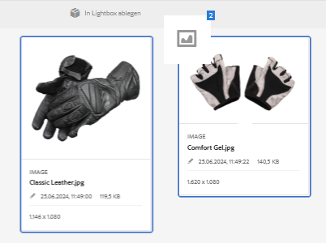

# Lightbox {#lightbox}

Lightbox ist ein spezieller Sammlungstyp, der den einfachen Zugriff auf Assets ermöglicht. Sie können schnell auf Lightbox zugreifen, um Assets hinzuzufügen oder zu löschen. Es dient als Ihre persönliche Bildergalerie.

Wenn Sie Adobe Experience Manager (AEM) Assets verwenden, wird Lightbox bei Ihrer ersten Anmeldung bei der Anwendung automatisch erstellt. Lightbox bezieht sich ausschließlich auf Ihre eigenen Anmeldungen. Andere Benutzer können nicht auf Ihren Lightbox-Ordner zugreifen.

## Assets zu Lightbox hinzufügen {#adding-assets-to-lightbox}

1. Wählen Sie in der Assets-Benutzeroberfläche die Assets aus, die zu Lightbox hinzugefügt werden sollen.
1. Drag the assets to the **[!UICONTROL Drop in Lightbox]** zone. Release when the drop-zone becomes active, and its label changes to **[!UICONTROL Drop to Add]**.

   

1. In the dialog, tap/click **[!UICONTROL Add]**, and then close it to complete the process. Die gewählten Assets werden Lightbox hinzugefügt.
1. Rufen Sie die Konsole &quot;Sammlungen&quot;auf, um Lightbox anzuzeigen.
1. Tap/click **[!UICONTROL Lightbox]** to view the assets in it.

   >[!NOTE]
   >
   >Obwohl Lightbox einer Sammlung ähnelt, können Sie nicht alle Aktionen ausführen, die Sie normalerweise mit Sammlungen ausführen. Sie können beispielsweise keine Einstellungen für eine Lightbox löschen, freigeben oder anzeigen. Außerdem können Sie sie nicht zu anderen Sammlungen hinzufügen. Sie können aber die Assets in einer Lightbox bearbeiten.

## Remove assets from Lightbox {#removing-assets-from-lightbox}

1. Gehen Sie zur Konsole „Sammlungen“ und tippen/klicken Sie auf „Lightbox“, um die entsprechenden Assets anzuzeigen.
1. Wählen Sie die Assets aus, die Sie entfernen möchten.
1. From the toolbar, tap/click **[!UICONTROL Remove]**.
1. In the dialog, tap/click **[!UICONTROL Remove]** to confirm the delete action. Die Assets werden aus Lightbox gelöscht.
