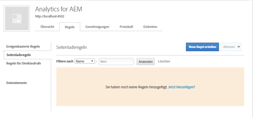
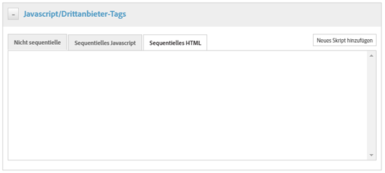
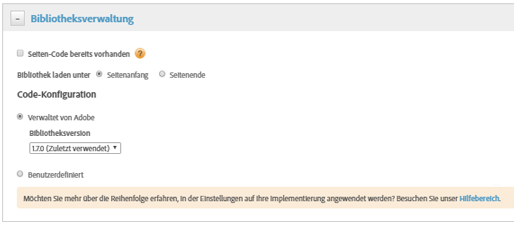

# Aktivieren von Asset Insights über DTM {#enable-asset-insights-through-dtm}

Adobe Dynamic Tag Management ist ein Tool, mit dem Sie Ihre digitalen Marketingtools aktivieren können. Es wird Adobe Analytics-Kunden kostenlos bereitgestellt.

Obwohl Sie Ihren Trackingcode anpassen können, um CMS-Lösungen von Drittanbietern zu aktivieren, um Asset Insights zu verwenden, empfiehlt Adobe, dass Sie DTM verwenden, um Asset Insights-Tags einzufügen.

>[!NOTE]
>
>Einblicke werden nur für Bilder unterstützt und bereitgestellt.

Führen Sie diese Schritte durch, um Asset Insights über DTM zu aktivieren.

1. Tippen/klicken Sie auf das AEM-Logo und navigieren Sie zu **[!UICONTROL Tools]** > **[!UICONTROL Assets]** > **[!UICONTROL Insights-Konfiguration]**.
1. [Konfigurieren Sie die AEM-Instanz mit dem DTM Cloud-Dienst.](/help/sites-administering/dtm.md)

   The API token should be available once you log on to [https://dtm.adobe.com](https://dtm.adobe.com/) and visit **[!UICONTROL Account Settings]** from the Profile icon. Dieser Schritt ist aus der Sicht von Asset Insights nicht erforderlich, weil die Integration von AEM Sites mit Asset Insights noch in Arbeit ist.

1. Melden Sie sich bei [https://dtm.adobe.com](https://dtm.adobe.com/) an und wählen Sie ggf. ein Unternehmen aus.
1. Erstellen/Öffnen einer vorhandenen Webeigenschaft

   * Select the **[!UICONTROL Web Properties]** tab, and then tap/click **[!UICONTROL Add Property]**.

   * Update the fields as appropriate, and tap/click **[!UICONTROL Create Property]**. See [documentation](https://helpx.adobe.com/experience-manager/using/dtm.html).
   

1. In the **[!UICONTROL Rules]** tab, select **[!UICONTROL Page Load Rules]** from the navigation pane and tap/click **[!UICONTROL Create New Rule]**.

   

1. Expand **[!UICONTROL Javascript /Third Party Tags]**. Then tap/click **[!UICONTROL Add New Script]** in the **[!UICONTROL Sequential HTML]** tab to open the Script dialog.

   

1. Tap/click the AEM logo, and go to **[!UICONTROL Tools > Assets]**.
1. Tap/click **[!UICONTROL Insights Page Tracker]**, copy the tracker code, and then paste it in the Script dialog you opened in step 6. Speichern Sie die Änderungen.

   >[!NOTE]
   >
   > * `AppMeasurement.js` entfernt. Es wird erwartet, dass es über das Adobe Analytics-Tool von DTM verfügbar ist.
   > * The call to `assetAnalytics.dispatcher.init`() is removed. Es wird erwartet, dass die Funktion erneut aufgerufen wird, sobald das Adobe Analytics-Tool von DTM vollständig geladen ist.
   > * In Abhängigkeit davon, wo die Asset Insights-Seitenverfolgung gehostet wird (z. B. AEM, CDN usw.), muss der Ursprung der Skriptquelle möglicherweise geändert werden.
   > * Bei AEM-gehosteten Seiten-Tracker sollte die Quelle mit dem Hostnamen der Dispatcher-Instanz auf eine Veröffentlichungsinstanz verweisen.


1. Zugriff `https://dtm.adobe.com`. Klicken Sie in der Web-Eigenschaft auf **[!UICONTROL Übersicht]** und dann auf **[!UICONTROL Tool hinzufügen]** oder öffnen Sie ein vorhandenes Adobe Analytics-Tool. While creating the tool, you can set **[!UICONTROL Configuration Method]** to **[!UICONTROL Automatic]**.

   

   Wählen Sie die Report Suites „Bereitstellung/Produktion“ nach Bedarf.

1. Expand **[!UICONTROL Library Management]**, and ensure that **[!UICONTROL Load Library at]** is set to **[!UICONTROL Page Top]**.

   

1. Expand **[!UICONTROL Customize Page Code]**, and click or tap **[!UICONTROL Open Editor]**.

   

1. Fügen Sie den folgenden Code in das Fenster ein:

   ```Java
   var sObj;
   
   if (arguments.length > 0) {
     sObj = arguments[0];
   } else {
     sObj = _satellite.getToolsByType('sc')[0].getS();
   }
   _satellite.notify('in assetAnalytics customInit');
   (function initializeAssetAnalytics() {
     if ((!!window.assetAnalytics) && (!!assetAnalytics.dispatcher)) {
       _satellite.notify('assetAnalytics ready');
       /** NOTE:
           Copy over the call to 'assetAnalytics.dispatcher.init()' from Assets Pagetracker
           Be mindful about changing the AppMeasurement object as retrieved above.
       */
       assetAnalytics.dispatcher.init(
             "",  /** RSID to send tracking-call to */
             "",  /** Tracking Server to send tracking-call to */
             "",  /** Visitor Namespace to send tracking-call to */
             "",  /** listVar to put comma-separated-list of Asset IDs for Asset Impression Events in tracking-call, e.g. 'listVar1' */
             "",  /** eVar to put Asset ID for Asset Click Events in, e.g. 'eVar3' */
             "",  /** event to include in tracking-calls for Asset Impression Events, e.g. 'event8' */
             "",  /** event to include in tracking-calls for Asset Click Events, e.g. 'event7' */
             sObj  /** [OPTIONAL] if the webpage already has an AppMeasurement object, please include the object here. If unspecified, Pagetracker Core shall create its own AppMeasurement object */
             );
       sObj.usePlugins = true;
       sObj.doPlugins = assetAnalytics.core.updateContextData;
       assetAnalytics.core.optimizedAssetInsights();
     }
     else {
       _satellite.notify('assetAnalytics not available. Consider updating the Custom Page Code', 4);
     }
   })();
   ```

   * Die Seitenladeregel in DTM enthält nur den Code pagetracker.js. Alle `assetAnalytics`-Felder überschreiben die Standardwerte. Sie sind nicht standardmäßig erforderlich.
   * The code calls `assetAnalytics.dispatcher.init`() after making sure that `_satellite.getToolsByType('sc')[0].getS`() is initialized and `assetAnalytics,dispatcher.init` is available. Daher müssen Sie sie in Schritt 11 nicht notwendigerweise hinzufügen.
   * As indicated in comments within the Insights Page Tracker code (**[!UICONTROL Tools > Assets > Insights Page Tracker]**), when Page Tracker does not create an `AppMeasurement` object, the first three arguments (RSID, Tracking Server, and Visitor Namespace) are irrelevant. Leere Zeichenfolgen werden stattdessen übergeben, um dies hervorzuheben.\
      Die restlichen Argumente entsprechen dem, was in der Statistiken-Konfigurationsseite konfiguriert ist (**[!UICONTROL Tools > Assets > Statistiken-Konfiguration]**).
   * Das AppMeasurement-Objekt wird abgerufen, indem `satelliteLib` für alle verfügbaren SiteCatalyst-Engines abgefragt wird. Wenn mehrere Tags konfiguriert sind, ändern Sie den Index des Array-Selektors entsprechend. Einträge im Array werden gemäß der SiteCatalyst-Tools geordnet, die in der DTM-Benutzeroberfläche verfügbar sind.

1. Speichern und schließen Sie das Fenster Code-Editor und speichern Sie die Änderungen in der Tool-Konfiguration.
1. In the **[!UICONTROL Approvals]** tab, approve both the pending approvals. Das DTM-Tag ist für das Einfügen auf Ihrer Webseite bereit. For details on how to insert DTM tags in web pages, see [Integrate DTM in custom page templates](https://blogs.adobe.com/experiencedelivers/experience-management/integrating-dtm-custom-aem6-page-template/).
