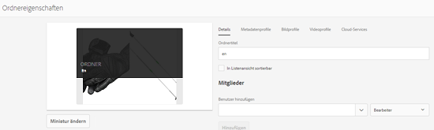
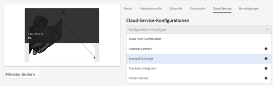
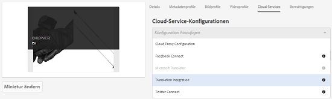
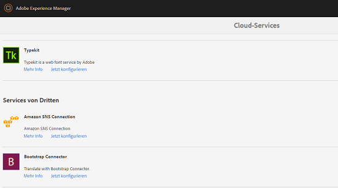
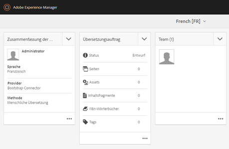

# Anwenden von Übersetzungs-Cloud-Services auf Ordner {#applying-translation-cloud-services-to-folders}

[!DNL Adobe Experience Manager] Sie können Cloud-basierte Übersetzungsdienste vom Übersetzungsanbieter Ihrer Wahl in Anspruch nehmen, um sicherzustellen, dass Ihre Assets entsprechend Ihren Anforderungen übersetzt werden.

Sie können den Übersetzungs-Cloud-Service direkt auf Ihren Asset-Ordner anwenden, sodass die Assets in den Übersetzungs-Workflows verwendet werden können.

## Anwenden von Übersetzungs-Services {#applying-the-translation-services}

Durch die direkte Anwendung der Übersetzungs-Cloud-Services auf Ihren Assets-Ordner entfällt die Notwendigkeit, Übersetzungs-Services zu konfigurieren, wenn Sie Übersetzungs-Workflows erstellen oder aktualisieren.

1. Wählen Sie in der Benutzeroberfläche [!DNL Assets] den Ordner aus, auf den Sie Übersetzungsdienste anwenden möchten.
1. Klicken Sie in der Symbolleiste auf **[!UICONTROL Eigenschaften]**, um die Seite **[!UICONTROL Ordnereigenschaften]** anzuzeigen.

   

1. Navigieren Sie zur Registerkarte **[!UICONTROL Cloud-Services]**.
1. Wählen Sie aus der Liste „Cloud-Service-Konfigurationen“ den gewünschten Übersetzungsanbieter aus. Wenn Sie beispielsweise Übersetzungs-Services von Microsoft nutzen möchten, wählen Sie **[!UICONTROL Microsoft Translator]** aus.

   

1. Wählen Sie den Connector für den Übersetzungsanbieter aus.

   

1. Klicken Sie in der Symbolleiste auf **[!UICONTROL Speichern]** und dann auf **[!UICONTROL OK]**, um das Dialogfeld zu schließen.Der Übersetzungsdienst wird auf den Ordner angewendet.

## Anwenden eines benutzerdefinierten Übersetzungs-Connectors  {#applying-custom-translation-connector}

Wenn Sie einen benutzerdefinierten Connector für die Übersetzungsservices anwenden möchten, den Sie in den Übersetzungsworkflows verwenden möchten. Um einen benutzerdefinierten Connector anzuwenden, installieren Sie zunächst den Connector aus Package Manager. Konfigurieren Sie dann den Connector über die Cloud Services Console. Nachdem Sie den Connector konfiguriert haben, ist er in der Liste der Connectoren auf der Registerkarte „Cloud Services“ verfügbar, wie unter [Anwenden der Übersetzungsservices](transition-cloud-services.md#applying-the-translation-services) beschrieben. Nachdem Sie den benutzerdefinierten Connector angewendet und Übersetzungsworkflows ausgeführt haben, werden in der Kachel **[!UICONTROL Übersetzungszusammenfassung]** des Übersetzungsprojekts die Details zum Connector unter den Überschriften **[!UICONTROL Anbieter]** und **[!UICONTROL Methode]** angezeigt.

1. Installieren Sie den Connector von Package Manager.
1. Klicken Sie auf das [!DNL Experience Manager]-Logo und navigieren Sie zu **[!UICONTROL Tools]** > **[!UICONTROL Bereitstellung]** > **[!UICONTROL Cloud Services]**.
1. Suchen Sie den installierten Connector unter **[!UICONTROL Services von Dritten]** auf der Seite **[!UICONTROL Cloud-Services]**.

   

1. Klicken Sie auf den Link **[!UICONTROL Jetzt konfigurieren]**, um das Dialogfeld **[!UICONTROL Konfiguration erstellen]** zu öffnen.

   

1. Geben Sie einen Titel und einen Namen für den Connector ein und klicken Sie dann auf **[!UICONTROL Erstellen]**. Der benutzerdefinierte Connector ist in der Connector-Liste in der Registerkarte **[!UICONTROL Cloud Services]** verfügbar. Die Beschreibung hierzu finden Sie in Schritt 5 von [Anwenden der Übersetzungs-Services](#applying-the-translation-services).
1. Führen Sie einen beliebigen Übersetzungsworkflow aus, der unter [Erstellen von Übersetzungsprojekten](translation-projects.md) beschrieben wird, nachdem Sie den benutzerdefinierten Connector angewendet haben. Überprüfen Sie die Details des Connectors in der Kachel **[!UICONTROL Zusammenfassung der Übersetzung]** des Übersetzungsprojekts in der **[!UICONTROL Projektekonsole]**.

   
