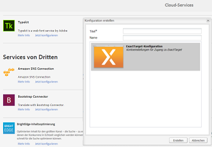

# Anwenden von Übersetzungs-Cloud-Services auf Ordner {#applying-translation-cloud-services-to-folders}

Mit Adobe Experience Manager können Sie Cloud-basierte Übersetzungsdienste des Übersetzungsanbieters Ihrer Wahl nutzen, um sicherzustellen, dass Ihre Assets entsprechend Ihren Anforderungen übersetzt werden.

Sie können den Übersetzungs-Cloud-Service direkt auf Ihren Asset-Ordner anwenden, sodass die Assets in den Übersetzungs-Workflows verwendet werden können.

## Anwenden von Übersetzungsdiensten {#applying-the-translation-services}

Durch die direkte Anwendung der Übersetzungs-Cloud-Services auf Ihren Assets-Ordner entfällt die Notwendigkeit, Übersetzungsdienste zu konfigurieren, wenn Sie Übersetzungs-Workflows erstellen oder aktualisieren.

1. Wählen Sie in der Assets-Benutzeroberfläche den Ordner aus, auf den Sie die Übersetzungsdienste anwenden möchten.
1. From the toolbar, click **[!UICONTROL Properties]** to display the **[!UICONTROL Folder Properties]** page.

   

1. Navigieren Sie zur Registerkarte **[!UICONTROL Cloud Services]**.
1. Wählen Sie aus der Liste „Cloud Service-Konfigurationen“ den gewünschten Übersetzungsanbieter aus. Wenn Sie beispielsweise Übersetzungsdienste von Microsoft nutzen möchten, wählen Sie **[!UICONTROL Microsoft Translator]** aus.

   

1. Wählen Sie den Connector für den Übersetzungsanbieter aus.

   

1. From the toolbar, click **[!UICONTROL Save]**, and then click **[!UICONTROL OK]** to close the dialog.The translation service is applied to the folder.

## Anwenden eines benutzerdefinierten Übersetzungs-Connectors  {#applying-custom-translation-connector}

Wenn Sie einen benutzerdefinierten Connector für die Übersetzungsservices anwenden möchten, den Sie in den Übersetzungsworkflows verwenden möchten. Um einen benutzerdefinierten Connector anzuwenden, installieren Sie zunächst den Connector aus Package Manager. Konfigurieren Sie dann den Connector über die Cloud Services Console. Nachdem Sie den Connector konfiguriert haben, ist er in der Liste der Connectoren auf der Registerkarte „Cloud Services“ verfügbar, wie unter [Anwenden der Übersetzungsservices](transition-cloud-services.md#applying-the-translation-services) beschrieben. Nachdem Sie den benutzerdefinierten Connector angewendet und Übersetzungsworkflows ausgeführt haben, werden in der Kachel **[!UICONTROL Übersetzungszusammenfassung]** des Übersetzungsprojekts die Details zum Connector unter den Überschriften **[!UICONTROL Anbieter]** und **[!UICONTROL Methode]** angezeigt.

1. Installieren Sie den Connector von Package Manager.
1. Click the Experience Manager logo, and navigate to **[!UICONTROL Tools > Deployment > Cloud Services]**.
1. Suchen Sie den installierten Connector unter **[!UICONTROL Services von Dritten]** auf der Seite **[!UICONTROL Cloud Services]**.

   

1. Click the **[!UICONTROL Configure now]** link to open the **[!UICONTROL Create Configuration]** dialog.

   

1. Specify a title and a name for the connector, and then click **[!UICONTROL Create]**. Der benutzerdefinierte Connector ist in der Connector-Liste in der Registerkarte **[!UICONTROL Cloud Services]** verfügbar. Die Beschreibung hierzu finden Sie in Schritt 5 von [Anwenden der Übersetzungsdienste](#applying-the-translation-services).
1. Führen Sie einen beliebigen Übersetzungsworkflow aus, der unter [Erstellen von Übersetzungsprojekten](translation-projects.md) beschrieben wird, nachdem Sie den benutzerdefinierten Connector angewendet haben. Überprüfen Sie die Details des Connectors in der Kachel **[!UICONTROL Zusammenfassung der Übersetzung]** des Übersetzungsprojekts in der **[!UICONTROL Projektekonsole]**.

   
