# Erstellen von Übersetzungsprojekten {#creating-translation-projects}

Um eine Sprachkopie zu erstellen, erstellen Sie eine der folgenden Sprachkopien, die in der Leiste &quot;Referenzen&quot;auf der [!DNL Experience Manager]-Benutzeroberfläche Workflows.

* **Erstellen und übersetzen**: In diesem Arbeitsablauf werden die zu übersetzenden Assets in die Sprachstamm der Sprache kopiert, in die Sie übersetzen möchten. Darüber hinaus wird je nach gewählten Optionen ein Übersetzungsprojekt für die Assets in der Projektekonsole erstellt. Je nach Einstellungen kann das Übersetzungsprojekt manuell gestartet oder automatisch ausgeführt werden, sobald es erstellt wurde.

* **Sprachkopien** aktualisieren: Führen Sie diesen Workflow aus, um eine zusätzliche Gruppe von Assets zu übersetzen und sie in eine Sprachkopie für ein bestimmtes Gebietsschema einzuschließen. In diesem Fall werden die übersetzten Assets zu dem Zielordner hinzugefügt, der bereits zuvor übersetzte Assets enthält.

>[!PREREQUISITES]
>
>* Benutzer, die Übersetzungsprojekte erstellen, gehören zur Gruppe `projects-administrators`.
>* Translation Dienstleister unterstützt die Übersetzung von Binärdateien.

## Workflow für das Erstellen und Übersetzen {#create-and-translate-workflow}

Den Workflow für das Erstellen und Übersetzen verwenden Sie, um erstmals Sprachkopien für eine bestimmte Sprache zu erstellen. Der Workflow bietet die folgenden Optionen:

* Nur Struktur erstellen.
* Erstellen eines neuen Übersetzungsprojekts.
* Hinzufügen zu einem vorhandenen Übersetzungsprojekt.

### Nur Struktur erstellen  {#create-structure-only}

Verwenden Sie die Option **[!UICONTROL Nur Struktur erstellen]**, um eine Zielordnerhierarchie im Zielsprachenstamm zu erstellen und die Hierarchie des Quellordners im Ausgangssprachenstamm widerzuspiegeln. In diesem Fall werden Quellelemente in den Zielordner kopiert. Es wird jedoch kein Übersetzungsprojekt generiert.

1. Wählen Sie in der Benutzeroberfläche [!DNL Assets] den Quellordner aus, für den Sie eine Zielgruppe im Stammordner erstellen möchten.

1. Öffnen Sie den Bereich **[!UICONTROL Referenzen]** und klicken Sie unter **[!UICONTROL Kopien]** auf **[!UICONTROL Sprachkopien]**.

   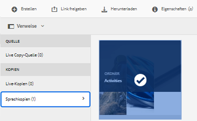

1. Klicken Sie auf **[!UICONTROL Erstellen und übersetzen]**. Wählen Sie aus der Liste **[!UICONTROL Zielsprachen]** die Sprache, für die Sie eine Ordnerstruktur erstellen möchten.

1. Wählen Sie aus der Liste **[!UICONTROL Projekt]** die Option **[!UICONTROL Nur Struktur erstellen]**.

1. Klicken Sie auf **[!UICONTROL Erstellen]**. Die neue Struktur für die Zielsprache wird unter **[!UICONTROL Sprachkopien]** aufgeführt.

   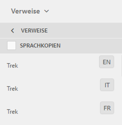

1. Klicken Sie in der Liste auf die Struktur und dann auf **[!UICONTROL In Assets anzeigen]**, um zur Ordnerstruktur in der Zielgruppe zu navigieren.

   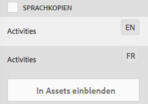

### Erstellen eines neuen Übersetzungsprojekts {#create-a-new-translation-project}

Wenn Sie diese Option verwenden, werden die zu übersetzenden Assets in den Sprachstamm der Sprache kopiert, in die übersetzt werden soll. Je nach gewählten Optionen wird ein Übersetzungsprojekt für die Assets in der Projektekonsole erstellt. Abhängig von den Einstellungen kann das Übersetzungsprojekt manuell gestartet oder automatisch ausgeführt werden, sobald es erstellt wird.

1. Wählen Sie in der Benutzeroberfläche [!DNL Assets] den Quellordner aus, für den Sie eine Sprachkopie erstellen möchten.
1. Öffnen Sie den Bereich **[!UICONTROL Referenzen]** und klicken Sie unter **[!UICONTROL Kopien]** auf **[!UICONTROL Sprachkopien]**.

   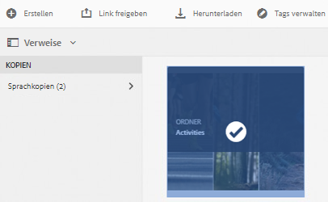

1. Klicken Sie unten auf **[!UICONTROL Erstellen und übersetzen]**.

1. Wählen Sie aus der Liste **[!UICONTROL Zielsprachen]** die Sprache(n), für die Sie eine Ordnerstruktur erstellen möchten.

   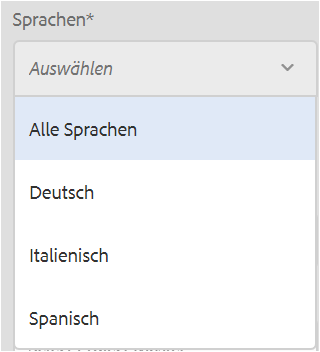

1. Wählen Sie aus der Liste **[!UICONTROL Projekt]** die Option **[!UICONTROL Neues Übersetzungsprojekt erstellen]**.

   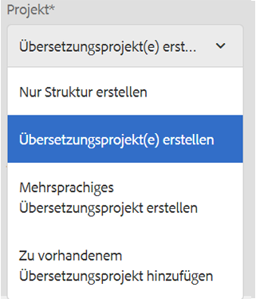

1. Geben Sie im Feld **[!UICONTROL Projekttitel]** einen Namen für das Projekt ein.

   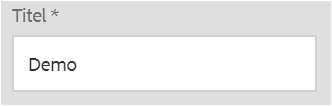

1. Klicken Sie auf **[!UICONTROL Erstellen]**. [!DNL Assets] aus dem Quellordner werden in die Zielordner für die Gebietsschemata kopiert, die Sie in Schritt 4 gewählt haben.

   

1. Um zum Ordner zu navigieren, wählen Sie die Sprachkopie und klicken Sie auf **[!UICONTROL In Assets einblenden]**.

   

1. Navigieren Sie zur Projektekonsole. Der Übersetzungsordner wird in die Projektekonsole kopiert.

   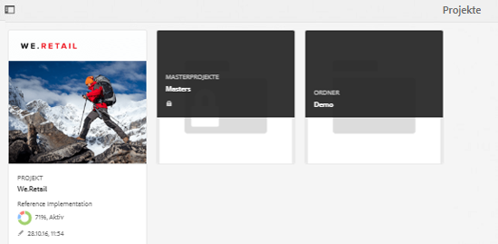

1. Öffnen Sie den Ordner, um das Übersetzungsprojekt anzuzeigen.

   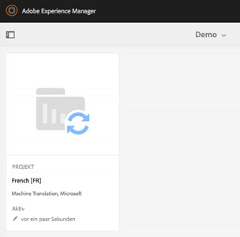

1. Klicken Sie auf das Projekt, um die Detailseite zu öffnen.

   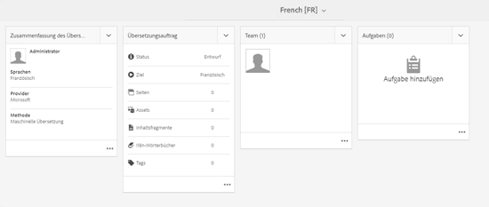

1. Um den Status des Übersetzungsauftrags anzuzeigen, klicken Sie unten auf der Kachel **[!UICONTROL Übersetzungsauftrag]** auf das Auslassungszeichen.

   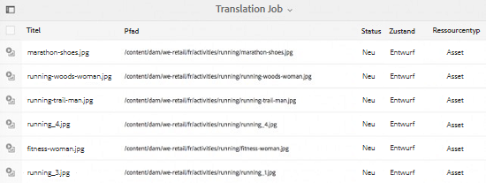

   Weitere Informationen zum Auftragsstatus finden Sie unter [Überwachen des Status eines Übersetzungsauftrags](/help/sites-administering/tc-manage.md#monitoring-the-status-of-a-translation-job).

1. Navigieren Sie zur Benutzeroberfläche [!DNL Assets] und öffnen Sie die Seite [!UICONTROL Eigenschaften] für jedes der übersetzten Assets, um die übersetzten Metadaten Ansicht.

   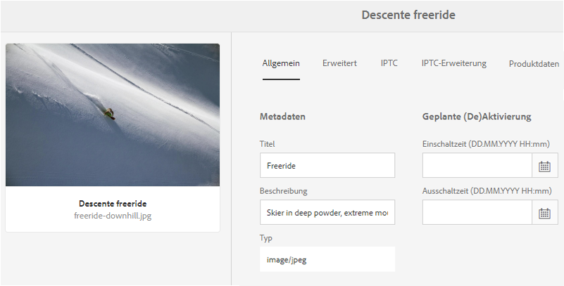

   *Abbildung: Metadaten werden auf der Seite mit den Asset-Eigenschaften übersetzt.*

   >[!NOTE]
   >
   >Diese Funktion ist sowohl für Assets als auch für Ordner verfügbar. Wenn ein Asset anstelle eines Ordners gewählt wurde, wird die gesamte Hierarchie der Ordner bis zum Sprachstamm kopiert, um eine Sprachkopie für das Asset zu erstellen.

### Hinzufügen zu einem vorhandenen Übersetzungsprojekt {#add-to-existing-translation-project}

Wenn Sie diese Option verwenden, wird der Übersetzungs-Workflow für Assets ausgeführt, die Sie zum Quellordner hinzufügen, nachdem bereits ein Übersetzungs-Workflow ausgeführt wurde. Nur die neu hinzugefügten Assets werden in den Zielordner kopiert, der zuvor übersetzte Assets enthält. In diesem Fall wird kein neues Übersetzungsprojekt erstellt.

1. Navigieren Sie in der Benutzeroberfläche [!DNL Assets] zum Quellordner, der nicht übersetzte Assets enthält.
1. Wählen Sie ein Asset, das Sie übersetzen möchten, und wechseln Sie zum Bereich **[!UICONTROL Verweise]**. Im Abschnitt **[!UICONTROL Sprachkopien]** wird die Anzahl der Übersetzungskopien angezeigt, die momentan verfügbar sind.
1. Klicken Sie unter **[!UICONTROL Kopien]** auf **[!UICONTROL Sprachkopien]**. Eine Liste der verfügbaren Übersetzungskopien wird angezeigt.
1. Klicken Sie unten auf **[!UICONTROL Erstellen und übersetzen]**.

1. Wählen Sie aus der Liste **[!UICONTROL Zielsprachen]** die Sprache(n), für die Sie eine Ordnerstruktur erstellen möchten.

1. Wählen Sie aus der Liste **[!UICONTROL Projekt]** die Option **[!UICONTROL Zu vorhandenem Übersetzungsprojekt hinzufügen]**, um den Übersetzungs-Workflow für den Ordner auszuführen.

   >[!NOTE]
   >
   >Wenn Sie die Option **[!UICONTROL Zu vorhandenem Übersetzungsprojekt hinzufügen]** wählen, wird Ihr Übersetzungsprojekt zu einem vorhandenen Projekt hinzugefügt, sofern Ihre Projekteinstellungen genau den Einstellungen des bereits vorhandenen Projekts entsprechen. Anderenfalls wird ein neues Projekt erstellt.

1. Wählen Sie aus der Liste **[!UICONTROL Vorhandenes Übersetzungsprojekt]** ein Projekt, dem das zu übersetzende Asset hinzugefügt werden soll.

1. Klicken Sie auf **[!UICONTROL Erstellen]**. Die zu übersetzenden Assets werden dem Zielordner hinzugefügt. Der aktualisierte Ordner wird unter **[!UICONTROL Sprachkopien]** aufgeführt.

   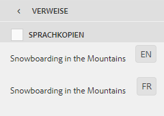

1. Navigieren Sie zur Projektkonsole und öffnen Sie das vorhandene Übersetzungsprojekt, dem Sie Assets hinzugefügt haben.
1. Klicken Sie auf das Übersetzungsprojekt, um die Seite mit den Projektdetails anzuzeigen.

   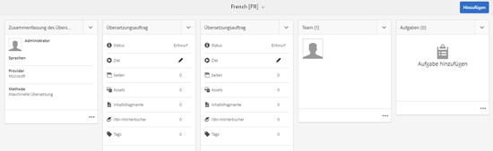

1. Klicken Sie auf das Auslassungszeichen am unteren Rand der Kachel **Übersetzungsauftrag**, um die Elemente im Übersetzungsarbeitsablauf Ansicht. In der Übersetzungsauftragsliste werden auch Einträge für Asset-Metadaten und -Tags aufgeführt. Diese Einträge geben an, dass die Metadaten und Tags für die Assets ebenfalls übersetzt werden.

   >[!NOTE]
   >
   >Wenn Sie den Eintrag für Tags oder Metadaten löschen, werden keine Tags oder Metadaten für die Assets übersetzt.

   >[!NOTE]
   >
   >Wenn das Asset, das Sie zum Übersetzungsauftrag hinzufügen, Teil-Assets enthält, wählen Sie die Teil-Assets und entfernen Sie sie, damit die Übersetzung fehlerfrei fortgesetzt werden kann.

1. Um die Übersetzung der Assets zu starten, klicken Sie auf der Kachel **[!UICONTROL Übersetzungsauftrag]** auf den Pfeil und wählen Sie aus der Liste die Option **[!UICONTROL Start]**.

   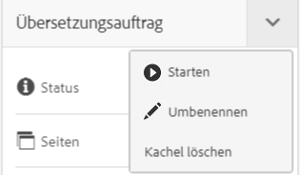

   Eine Meldung informiert Sie darüber, dass mit der Ausführung des Übersetzungsauftrags begonnen wird.

1. Um den Status des Übersetzungsauftrags anzuzeigen, klicken Sie unten auf der Kachel **[!UICONTROL Übersetzungsauftrag]** auf das Auslassungszeichen.

   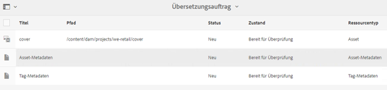

   Weitere Informationen finden Sie unter [Überwachen des Status eines Übersetzungsauftrags](/help/sites-administering/tc-manage.md#monitoring-the-status-of-a-translation-job).

1. Nach Abschluss des Übersetzungsvorgangs ändert sich der Status in „Bereit für Überprüfung“. Navigieren Sie zur Benutzeroberfläche [!DNL Assets] und öffnen Sie die Seite Eigenschaften für jedes der übersetzten Assets, um die übersetzten Metadaten Ansicht.

## Sprachkopien aktualisieren {#update-language-copies}

Führen Sie diesen Workflow aus, um eine weitere Gruppe von Assets zu übersetzen und in eine Sprachkopie für ein bestimmtes Gebietsschema aufzunehmen. In diesem Fall werden die übersetzten Assets zu dem Zielordner hinzugefügt, der bereits zuvor übersetzte Assets enthält. Abhängig von den gewählten Optionen wird ein Übersetzungsprojekt erstellt oder ein vorhandenes Übersetzungsprojekt für die neuen Assets aktualisiert. Der Workflow zum Aktualisieren der Sprachkopien umfasst die folgenden Optionen:

* Erstellen eines neuen Übersetzungsprojekts
* Hinzufügen zu einem vorhandenen Übersetzungsprojekt

### Erstellen eines neuen Übersetzungsprojekts {#create-a-new-translation-project-1}

Wenn Sie diese Option verwenden, wird ein Übersetzungsprojekt für den Satz von Assets erstellt, für die Sie eine Sprachkopie aktualisieren möchten.

1. Wählen Sie in der Benutzeroberfläche [!DNL Assets] den Quellordner aus, in dem Sie ein Asset hinzugefügt haben.
1. Öffnen Sie den Bereich **[!UICONTROL References]** und klicken Sie unter **[!UICONTROL Copies]** auf **[!UICONTROL Sprachkopien]**, um die Liste der Sprachkopien anzuzeigen.
1. Aktivieren Sie das Kontrollkästchen vor **[!UICONTROL Sprachkopien]** und wählen Sie dann den Zielordner aus, der dem entsprechenden Gebietsschema entspricht.

   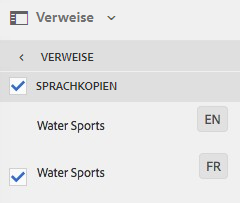

1. Klicken Sie unten auf **[!UICONTROL Sprachkopien aktualisieren]**.

1. Wählen Sie aus der Liste **[!UICONTROL Projekt]** die Option **[!UICONTROL Neues Übersetzungsprojekt erstellen]**.

1. Geben Sie im Feld **[!UICONTROL Projekttitel]** einen Namen für das Projekt ein.

1. Klicken Sie auf **[!UICONTROL Starten]**.
1. Navigieren Sie zur Projektekonsole. Der Übersetzungsordner wird in die Projektekonsole kopiert.

   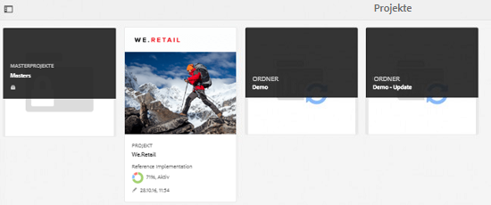

1. Öffnen Sie den Ordner, um das Übersetzungsprojekt anzuzeigen.

   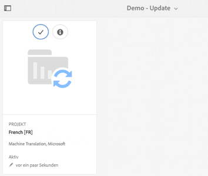

1. Klicken Sie auf das Projekt, um die Detailseite zu öffnen.

   

1. Um die Übersetzung der Assets zu starten, klicken Sie auf der Kachel **[!UICONTROL Übersetzungsauftrag]** auf den Pfeil und wählen Sie aus der Liste die Option **[!UICONTROL Start]**.

   

   Eine Meldung informiert Sie darüber, dass mit der Ausführung des Übersetzungsauftrags begonnen wird.

1. Um den Status des Übersetzungsauftrags anzuzeigen, klicken Sie unten auf der Kachel **[!UICONTROL Übersetzungsauftrag]** auf das Auslassungszeichen.

   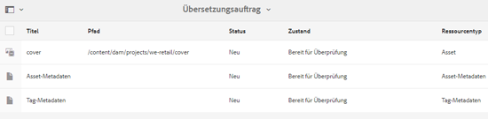

   Weitere Informationen zum Auftragsstatus finden Sie unter [Überwachen des Status eines Übersetzungsauftrags](../sites-administering/tc-manage.md#monitoring-the-status-of-a-translation-job).

1. Navigieren Sie zur Benutzeroberfläche [!DNL Assets] und öffnen Sie die Seite Eigenschaften für jedes der übersetzten Assets, um die übersetzten Metadaten Ansicht.

### Hinzufügen zu einem vorhandenen Übersetzungsprojekt {#add-to-existing-translation-project-1}

Wenn Sie diese Option verwenden, wird die Gruppe der Assets zu einem vorhandenen Übersetzungsprojekt hinzugefügt, um die Sprachkopien für das von Ihnen gewählte Gebietsschema zu aktualisieren.

1. Wählen Sie in der Benutzeroberfläche [!DNL Assets] den Quellordner aus, in dem Sie einen Asset-Ordner hinzugefügt haben.
1. Öffnen Sie den Bereich **[!UICONTROL Referenzen]** und klicken Sie unter **[!UICONTROL Kopien]** auf **[!UICONTROL Sprachkopien]**, um die Liste der Sprachkopien anzuzeigen.

   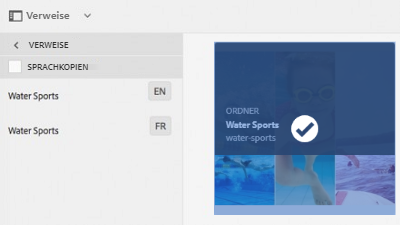

1. Aktivieren Sie das Kontrollkästchen **[!UICONTROL Sprachkopien]**, um alle Sprachkopien auszuwählen. Heben Sie die Auswahl anderer Kopien auf. Nur die Sprachkopien, die den gewünschten Gebietsschemas entsprechen, sollten ausgewählt bleiben.

   

1. Klicken Sie unten auf **[!UICONTROL Sprachkopien aktualisieren]**.

1. Wählen Sie aus der Liste **[!UICONTROL Projekt]** die Option **[!UICONTROL Zu vorhandenem Übersetzungsprojekt hinzufügen]**.

   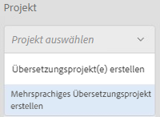

1. Wählen Sie aus der Liste **[!UICONTROL Vorhandenes Übersetzungsprojekt]** ein Projekt, dem das zu übersetzende Asset hinzugefügt werden soll.

1. Klicken Sie auf **[!UICONTROL Starten]**.
1. Führen Sie Schritt 9 bis 14 des Verfahrens [Zu vorhandenem Übersetzungsprojekt hinzufügen](translation-projects.md#add-to-existing-translation-project) aus, um den Vorgang abzuschließen.

## Erstellen temporärer Sprachkopien {#creating-temporary-language-copies}

Wenn Sie einen Übersetzungs-Workflow ausführen, um eine Sprachkopie mit bearbeiteten Versionen der ursprünglichen Assets zu aktualisieren, wird die vorhandene Sprachkopie beibehalten, bis Sie die übersetzten Assets genehmigen. [!DNL Adobe Experience Manager Assets] speichert die neu übersetzten Assets an einem temporären Speicherort und aktualisiert die vorhandene Sprachkopie, nachdem Sie die Assets genehmigt haben. Wenn Sie die Assets ablehnen, bleibt die Sprachkopie unverändert.

1. Klicken Sie auf den Quellstammordner unter **[!UICONTROL Sprachkopien]**, für die Sie bereits eine Sprachkopie erstellt haben, und klicken Sie dann auf **[!UICONTROL In Assets anzeigen]**, um den Ordner in [!DNL Experience Manager Assets] zu öffnen.

   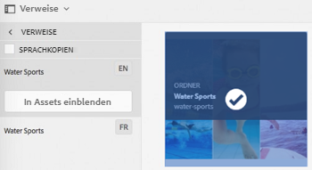

1. Wählen Sie in der Oberfläche [!DNL Assets] ein bereits übersetztes Asset aus und klicken Sie in der Symbolleiste auf **[!UICONTROL Bearbeiten]**, um das Asset im Bearbeitungsmodus zu öffnen.
1. Bearbeiten Sie das Asset und speichern Sie die Änderungen.
1. Führen Sie Schritt 2 bis 14 des Verfahrens [Zu vorhandenem Übersetzungsprojekt hinzufügen](#add-to-existing-translation-project) aus, um die Sprachkopie zu aktualisieren.
1. Klicken Sie auf das Auslassungszeichen unten in der Kachel **[!UICONTROL Übersetzungsauftrag]**. Der Liste der Assets auf der Seite **[!UICONTROL Übersetzungsauftrag]** können Sie den temporären Speicherort der übersetzten Version des Assets entnehmen.

   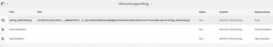

1. Aktivieren Sie das Kontrollkästchen neben **[!UICONTROL Titel]**.
1. Klicken Sie in der Symbolleiste auf **[!UICONTROL Übersetzung annehmen]** ![und dann auf **[!UICONTROL Akzeptieren]** im Dialogfeld, um das übersetzte Asset im Ordner &quot;Zielgruppe&quot;mit der übersetzten Version des bearbeiteten Assets zu überschreiben.](assets/do-not-localize/thumb-up.png)

   >[!NOTE]
   >
   >Um die Aktualisierung der Ziel-Assets durch den Übersetzungs-Workflow zu ermöglichen, akzeptieren Sie das Asset und die Metadaten.

   Klicken Sie auf **[!UICONTROL Übersetzung ablehnen]** , um die ursprünglich übersetzte Version des Assets im Stammordner der Zielgruppe beizubehalten und die bearbeitete Version abzulehnen.

1. Um die übersetzten Metadaten Ansicht, navigieren Sie zur Konsole [!DNL Assets] und öffnen Sie die Seite [!UICONTROL Eigenschaften] für jedes der übersetzten Assets.

## Tipps und Einschränkungen {#tips-limitations}

* Wenn Sie einen Übersetzungs-Workflow für komplexe Assets wie PDF- und [!DNL Adobe InDesign]-Dateien starten, werden deren Teilassets oder Ausgabeformate (sofern vorhanden) nicht zur Übersetzung gesendet.
* Wenn Sie maschinelle Übersetzung verwenden, werden die Asset-Binärdateien nicht übersetzt.
