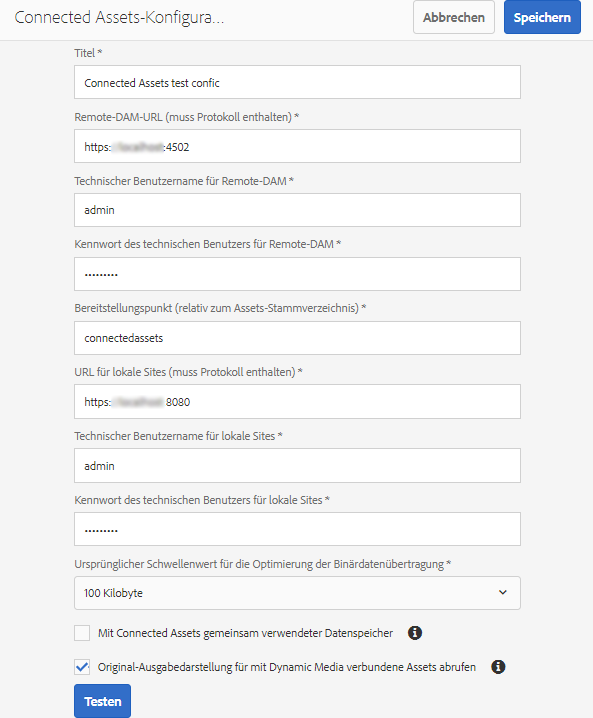
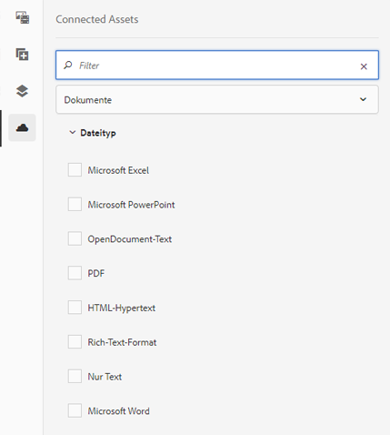
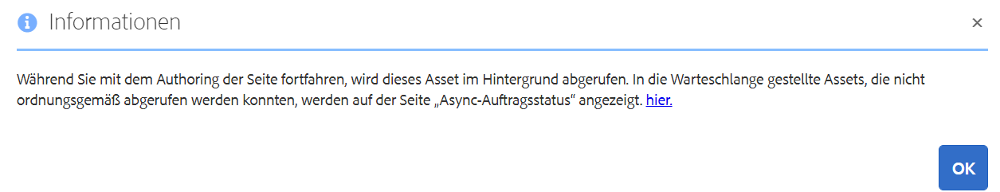

# Verwenden von Connected Assets zum Freigeben von DAM-Assets in [!DNL Experience Manager Sites] {#use-connected-assets-to-share-dam-assets-in-aem-sites}

In großen Unternehmen ist die zur Erstellung von Websites erforderliche Infrastruktur möglicherwiese verteilt. Manchmal befinden sich die Funktionen und digitale Assets zum Erstellen von Webseiten in verschiedenen Bereitstellungen. Es gibt einige Gründe dafür, warum bestehende Bereitstellungen geografisch verteilt sind, die für die Arbeit im Tandem erforderlich sind, oder Akquisitionen, die zu einer heterogenen Infrastruktur führen, die die übergeordnete Firma gemeinsam nutzen möchte.

[!DNL Adobe Experience Manager Sites] bietet Funktionen zum Erstellen von Webseiten, während das Digital Asset Management (DAM)-System ist, das die für Websites erforderlichen Assets bereitstellt. [!DNL Adobe Experience Manager Assets] [!DNL Experience Manager] unterstützt nun den oben genannten Anwendungsfall durch Integration [!DNL Experience Manager Sites] und [!DNL Experience Manager Assets].

## Übersicht über Connected Assets {#overview-of-connected-assets}

When editing pages in Page Editor, the authors can seamlessly search, browse, and embed assets from a different [!DNL Experience Manager Assets] deployment. To do an [!DNL Experience Manager] administrator do a one-time integration of a local deployment of [!DNL Experience Manager Sites] with a different (remote) deployment of [!DNL Experience Manager Assets].

For the [!DNL Sites] authors, the remote assets are available as read-only local assets. Die Funktion unterstützt die nahtlose Suche und die gleichzeitige Verwendung einiger weniger Remote-Assets. Wenn Sie viele Remote-Assets auf einmal für die lokale Bereitstellung verfügbar machen möchten, sollten Sie die Assets als Stapel migrieren. Siehe Migrationshandbuch für [Experience Manager Assets](/help/assets/assets-migration-guide.md).

### Voraussetzungen und unterstützte Bereitstellungen {#prerequisites}

Bevor Sie diese Funktion verwenden oder konfigurieren, stellen Sie Folgendes sicher:

* Die Benutzer sind Teil von entsprechenden Benutzergruppen für jede Bereitstellung.
* Bei Bereitstellungstypen von Adobe Experience Manager ist eines der unterstützten Kriterien erfüllt. [!DNL Experience Manager] 6.5 [!DNL Assets] funktioniert [!DNL Experience Manager] als Cloud-Dienst. Weitere Informationen finden Sie unter [Funktionen für verbundene Assets in Experience Manager als Cloud-Dienst](https://docs.adobe.com/content/help/en/experience-manager-cloud-service/assets/admin/use-assets-across-connected-assets-instances.html).

   |  | [!DNL Experience Manager Sites] als Cloud-Dienst | Experience Manager 6.5 [!DNL Sites] unter AMS | Experience Manager 6.5 [!DNL Sites] vor Ort |
   |---|---|---|---|
   | **[!DNL Experience Manager Assets]als Cloud-Dienst ** | Unterstützt | Unterstützt | Unterstützt |
   | **Experience Manager 6.5[!DNL Assets]unter AMS** | Unterstützt | Unterstützt | Unterstützt |
   | **Experience Manager 6.5[!DNL Assets]vor Ort** | Nicht unterstützt | Nicht unterstützt | Nicht unterstützt |

### Unterstützte Dateiformate {#mimetypes}

Autoren können in der Inhaltssuche nach Bildern und den folgenden Dokumenten suchen und die gesuchten Assets im Seiteneditor verwenden. Documents can be added to the `Download` component and images can be added to the `Image` component. Authors can also add the remote assets in any custom Experience Manager component that extends the default `Download` or `Image` components. Die Liste der unterstützten Formate lautet:

* **Bildformate**: Die Bildformate, die von der [Image-Komponente](https://docs.adobe.com/content/help/en/experience-manager-core-components/using/components/image.html) unterstützt werden, werden von verbundenen Assets unterstützt. [!DNL Dynamic Media] Bilder werden nicht unterstützt.
* **Dokument-Formate**: Siehe Unterstützte [Videoformate](assets-formats.md#supported-document-formats)für verbundene Assets.

### Beteiligte Benutzer und Gruppen {#users-and-groups-involved}

Nachfolgend erfahren Sie mehr über die verschiedenen Rollen, die am Konfigurieren und Verwenden der Funktionen und entsprechenden Benutzergruppen beteiligt sind. Im Anwendungsbeispiel wird eine Website von einem Autor im lokalen Umfang erstellt. Der Remote-Bereich wird für die DAM-Bereitstellung verwendet, bei der die erforderlichen Assets gehostet werden. The [!DNL Sites] author fetches these remote assets.

| Rolle | Anwendungsbereich | Benutzergruppe | Benutzername im Verlauf | Anforderung |
|---|---|---|---|---|
| [!DNL Sites] administrator | Lokal | Experience Manager `administrators` | `admin` | Richten Sie Experience Manager ein, konfigurieren Sie die Integration mit der Remote- [!DNL Assets] Bereitstellung. |
| DAM-Benutzer | Lokal | `Authors` | `ksaner` | Used to view and duplicate the fetched assets at `/content/DAM/connectedassets/`. |
| [!DNL Sites] author | Lokal | `Authors` (mit Lesezugriff auf den Remote-DAM und Zugriff des Autors auf lokale [!DNL Sites]) | `ksaner` | End user are [!DNL Sites] authors who use this integration to improve their content velocity. Die Autoren suchen und durchsuchen Assets in Remote DAM mit der Inhaltssuche und verwenden die erforderlichen Bilder auf lokalen Webseiten. The credentials of `ksaner` DAM user are used. |
| [!DNL Assets] administrator | Remote | Experience Manager `administrators` | `admin` auf Remote Experience Manager | Cross-Origin Resource Sharing (CORS) konfigurieren. |
| DAM-Benutzer | Remote | `Authors` | `ksaner` auf Remote Experience Manager | Autorenrolle bei der Remote Experience Manager-Bereitstellung. Suchen und Durchsuchen von Assets in Connected Assets mit dem Content Finder. |
| DAM-Distributor (technischer Benutzer) | Remote | `Authors` | `ksaner` auf Remote Experience Manager | This user present on the remote deployment is used by Experience Manager local server (not the Site author role) to fetch the remote assets, on behalf of [!DNL Sites] author. Diese Rolle unterscheidet sich von den beiden oben aufgeführten `ksaner`-Rollen und gehört einer anderen Benutzergruppe an. |

## Configure a connection between [!DNL Sites] and [!DNL Assets] deployments {#configure-a-connection-between-sites-and-assets-deployments}

Diese Integration kann von einem Experience Manager-Administrator erstellt werden. Once created, the permissions required to use it are established via user groups that are defined on the [!DNL Sites] deployment and on the DAM deployment.

To configure Connected Assets and local [!DNL Sites] connectivity, follow these steps.

1. Access an existing [!DNL Experience Manager Sites] deployment or create a deployment using the following command:

   1. Führen Sie im Ordner der JAR-Datei den folgenden Befehl auf einem Terminal aus, um jeden Experience Manager-Server zu erstellen.
      `java -XX:MaxPermSize=768m -Xmx4096m -jar <quickstart jar filepath> -r samplecontent -p 4502 -nofork -gui -nointeractive &`

   1. Nach einigen Minuten werden die Experience Manager-Server-Beginn erfolgreich ausgeführt. Consider this [!DNL Experience Manager Sites] deployment as the local machine for web page authoring, say at `https://[local_sites]:4502`.

1. Ensure that the users and roles with local scope exist on the Experience Manager Sites deployment and on the [!DNL Experience Manager Assets] deployment on AMS. Create a technical user on [!DNL Assets] deployment and add to the user group mentioned in [users and groups involved](/help/assets/use-assets-across-connected-assets-instances.md#users-and-groups-involved).

1. Zugriff auf die lokale [!DNL Experience Manager Sites] Bereitstellung unter `https://[local_sites]:4502`. Klicken Sie auf **[!UICONTROL Tools]** > **[!UICONTROL Assets]** > **[!UICONTROL Connected Assets-Konfiguration]** und geben Sie die folgenden Werte ein:

   1. [!DNL Experience Manager Assets] ist `https://[assets_servername_ams]:[port]`.
   1. Anmeldeinformationen eines DAM-Distributors (technischer Benutzer).
   1. In **[!UICONTROL Mount Point]** field, enter the local Experience Manager path where Experience Manager fetches the assets. For example, `remoteassets` folder.
   1. Adjust the values of **[!UICONTROL Original Binary transfer optimization Threshold]** depending on your network. Ein Asset-Wiedergabeformat, dessen Größe diesen Schwellenwert überschreitet, wird asynchron übertragen.
   1. Select **[!UICONTROL Datastore Shared with Connected Assets]**, if you use a datastore to store your assets and the Datastore is the common storage between both Experience Manager deployments. In diesem Fall spielt die Schwellenwertbegrenzung keine Rolle, da sich die tatsächlichen Asset-Binärdateien im Datenspeicher befinden und nicht übertragen werden.
      
   *Abbildung: Eine typische Konfiguration für verbundene Assets.*

1. Da die Assets bereits verarbeitet und die Wiedergabeformate abgerufen wurden, deaktivieren Sie die Workflow-Launcher. Adjust the launcher configurations on the local ([!DNL Experience Manager Sites]) deployment to exclude the `connectedassets` folder, in which the remote assets are fetched.

   1. On [!DNL Experience Manager Sites] deployment, click **[!UICONTROL Tools]** > **[!UICONTROL Workflow]** > **[!UICONTROL Launchers]**.

   1. Suchen Sie nach Launchern mit Workflows wie **[!UICONTROL DAM-Update-Asset]** und **[!UICONTROL DAM-Metadaten-Writeback]**.

   1. Wählen Sie den Workflow-Launcher und klicken Sie in der Aktionsleiste auf **[!UICONTROL Eigenschaften]**. 

   1. Ändern Sie im Eigenschaften-Assistent die **[!UICONTROL Pfad]**-Felder in die folgenden Zuordnungen, um ihre regulären Ausdrücke zu aktualisieren und den Bereitstellungspunkt **[!UICONTROL connectedassets]** auszuschließen.
   | Vorher | Nachher |
   |---|---|
   | `/content/dam(/((?!/subassets).)*/)renditions/original` | `/content/dam(/((?!/subassets)(?!connectedassets).)*/)renditions/original` |
   | `/content/dam(/*/)renditions/original` | `/content/dam(/((?!connectedassets).)*/)renditions/original` |
   | `/content/dam(/*)/jcr:content/metadata` | `/content/dam(/((?!connectedassets).)*/)jcr:content/metadata` |

   >[!NOTE]
   >
   >Alle in der Remote Experience Manager-Bereitstellung verfügbaren Darstellungen werden abgerufen, wenn Autoren ein Asset abrufen. Überspringen Sie diesen Konfigurationsschritt, wenn Sie mehr Wiedergabedarstellungen eines abgerufenen Assets erstellen möchten. The [!UICONTROL DAM Update Asset] workflow gets triggered and creates more renditions. These renditions are available only on the local [!DNL Sites] deployment and not on the remote DAM deployment.

1. Add the [!DNL Experience Manager Sites] instance as one of the **[!UICONTROL Allowed Origins]** on the remote [!DNL Experience Manager Assets] CORS configuration.

   1. Melden Sie sich mit Administratorberechtigungen an. Suchen nach `Cross-Origin`. Öffnen Sie **[!UICONTROL Tools]** > **[!UICONTROL Vorgänge]** > **[!UICONTROL Web-Konsole]**.

   1. Klicken Sie zum Erstellen einer CORS-Konfiguration [!DNL Experience Manager Sites] beispielsweise auf das Symbol  neben der Richtlinie für die Freigabe von **[!UICONTROL Adobe Granite-Ressourcen für mehrere Herkünfte]**.

   1. In the field **[!UICONTROL Allowed Origins]**, input the URL of the local [!DNL Sites], that is, `https://[local_sites]:[port]`. Speichern Sie die Konfiguration.

## Verwenden von Remote-Assets {#use-remote-assets}

Die Websiteautoren verwenden den Content Finder zum Verbinden mit der DAM-Instanz. Die Autoren können die Remote-Assets in einer Komponente suchen, suchen und ziehen. Halten Sie zum Authentifizieren beim Remote-DAM die von Ihrem Administrator bereitgestellten Anmeldeinformationen des DAM-Benutzers bereit.

Autoren können Assets verwenden, die sowohl in lokalen als auch in Remote-DAM-Instanzen in einer einzigen Webseite verfügbar sind. Verwenden Sie den Content Finder, um zwischen der Suche im lokalen und im Remote-DAM zu wechseln.

Es werden nur die Tags von Remote-Assets abgerufen, die ein exaktes entsprechendes Tag mit derselben Taxonomie-Hierarchie aufweisen, die auf der lokalen [!DNL Sites] Instanz verfügbar ist. Alle anderen Tags werden verworfen. Autoren können mithilfe aller Tags, die in der Remote Experience Manager-Bereitstellung vorhanden sind, nach Remote-Assets suchen, da Experience Manager eine Volltextsuche durchführt.

### Beispiel für die Verwendung {#walk-through-of-usage}

Verwenden Sie die oben beschriebenen Einstellungen, um die Funktionsweise der Funktionen im Authoring-Erlebnis zu überprüfen. Verwenden Sie Dokumente oder Bilder Ihrer Wahl in der Remote-DAM-Bereitstellung.

1. Navigate to the [!DNL Assets] user interface on the remote deployment by accessing **[!UICONTROL Assets]** > **[!UICONTROL Files]** from [!DNL Experience Manager] workspace. Alternativ können Sie auch `https://[assets_servername_ams]:[port]/assets.html/content/dam` in einem Browser darauf zugreifen. Laden Sie die Assets Ihrer Wahl hoch.
1. On the [!DNL Sites] instance, in the profile activator in the upper-right corner, click **[!UICONTROL Impersonate as]**. Geben Sie `ksaner` als Benutzernamen ein, wählen Sie die bereitgestellte Option und klicken Sie auf **[!UICONTROL OK]**.
1. Öffnen Sie eine We.Retail-Webseite unter **[!UICONTROL Sites]** > **[!UICONTROL We.Retail]** > **[!UICONTROL us]** > **[!UICONTROL en]**. Bearbeiten Sie die Seite. Sie können auch `https://[aem_server]:[port]/editor.html/content/we-retail/us/en/men.html` in einem Browser auf eine Seite zugreifen, um sie zu bearbeiten.

   Klicken Sie in der oberen linken Ecke der Seite auf **[!UICONTROL Seitenbedienfeld]** ein/aus.

1. Open the [!UICONTROL Assets] tab and click **[!UICONTROL Log in to Connected Assets]**.
1. Provide the credentials -- `ksaner` as user name and `password` as password. This user has authoring permissions on both the [!DNL Experience Manager] deployments.
1. Suchen Sie nach dem Asset, das Sie dem DAM hinzugefügt haben. Die Remote-Assets werden im linken Bereich angezeigt. Filtern Sie nach Bildern oder Dokumenten und weiter nach unterstützten Dokumenttypen. Ziehen Sie die Bilder auf eine `Image` Komponente und die Dokumente auf eine `Download` Komponente.

   The fetched assets are read-only on the local [!DNL Experience Manager Sites] deployment. You can still use the options provided by your [!DNL Experience Manager Sites] components to edit the fetched asset. Die Bearbeitung durch Komponenten erfolgt zerstörungsfrei.

   

   *Abbildung: Optionen zum Filtern von Dokument-Typen und Bildern bei der Suche nach Assets auf Remote-DAM.*

1. Ein Site-Autor wird benachrichtigt, wenn ein Asset asynchron abgerufen wird und wenn eine Abruf-Aufgabe fehlschlägt. Beim oder auch nach dem Authoring können die Autoren detaillierte Informationen zu Abruf-Aufgaben und -Fehlern in der Benutzeroberfläche von [Async-Aufträgen](/help/assets/asynchronous-jobs.md) anzeigen.

   

   *Abbildung: Benachrichtigung zum asynchronen Abrufen von Assets, die im Hintergrund ausgeführt werden.*

1. When publishing a page, [!DNL Experience Manager] displays a complete list of assets that are used in the page. Stellen Sie sicher, dass die Remote-Assets zum Zeitpunkt der Veröffentlichung erfolgreich abgerufen wurden. Informationen zum Überprüfen des Status der einzelnen abgerufenen Assets finden Sie in der Benutzeroberfläche für [Async-Aufträge](/help/assets/asynchronous-jobs.md).

   >[!NOTE]
   >
   >Auch wenn ein oder mehrere Remote-Assets nicht abgerufen wurden, wird die Seite veröffentlicht. Die Komponente, die das Remote-Asset verwendet, wird leer veröffentlicht. The [!DNL Experience Manager] notification area displays notification for errors that show in async jobs page.

>[!CAUTION]
>
>Sobald die abgerufenen Remote-Assets in einer Webseite verwendet werden, können sie von allen Benutzern durchsucht und verwendet werden, die über die Zugriffsberechtigung für den lokalen Ordner verfügen, in dem die abgerufenen Assets gespeichert sind (im obigen Beispiel `connectedassets`). The assets are also searchable and visible in the local repository via [!UICONTROL Content Finder].

Die abgerufenen Assets können wie jedes andere lokale Element verwendet werden. Nur die zugehörigen Metadaten können nicht bearbeitet werden.

## Beschränkungen {#limitations}

**Berechtigungen und Verwalten von Assets**

* Lokale Assets werden nicht mit den ursprünglichen Assets auf der Remote-Bereitstellung synchronisiert. Das Ändern, Löschen oder Widerrufen von Berechtigungen auf der DAM-Bereitstellung wird nicht auf absteigende Hierarchien angewendet.
* Lokale Assets sind schreibgeschützte Kopien. Experience Manager-Komponenten bearbeiten Assets nicht zerstörerisch. Sonstige Änderungen sind nicht zulässig.
* Lokal abgerufene Assets sind nur für Autoren verfügbar. Asset-Update-Workflows können nicht angewendet werden und Metadaten können nicht bearbeitet werden.
* Es werden nur die Bildformate und die aufgelisteten Dokumente unterstützt. [!DNL Dynamic Media] Assets, Inhaltsfragmente und Erlebnisfragmente werden nicht unterstützt.
* Metadatenschemata werden nicht abgerufen.
* All [!DNL Sites] authors have read permissions on the fetched copies, even if they do not have access to the remote DAM deployment.
* Keine API-Unterstützung, um die Integration anzupassen.
* Die Funktion unterstützt die nahtlose Suche und Verwendung von Remote-Assets. Wenn Sie viele Remote-Assets auf einmal für die lokale Bereitstellung verfügbar machen möchten, sollten Sie die Assets migrieren. Weitere Informationen finden Sie im [Handbuch zur Assets-Migration](assets-migration-guide.md).
* Es ist nicht möglich, ein Remote-Asset als Seitenminiaturansicht in der Benutzeroberfläche der [!UICONTROL Seiteneigenschaften] zu verwenden. Sie können eine Miniaturansicht einer Webseite in der Benutzeroberfläche &quot; [!UICONTROL Seiteneigenschaften] &quot;in der [!UICONTROL Miniaturansicht] festlegen, indem Sie auf Bild [!UICONTROL auswählen]klicken.

**Einrichten und Lizenzieren**

* [!DNL Experience Manager Assets] Bereitstellung auf AMS wird unterstützt.
* [!DNL Experience Manager Sites] kann eine Verbindung zu einem einzelnen [!DNL Experience Manager Assets] Repository herstellen.
* A license of [!DNL Experience Manager Assets] working as remote repository.
* One or more licenses of [!DNL Experience Manager Sites] working as local authoring deployment.

**Nutzung**

* Nur die unterstützte Funktion ist die Suche nach Remote-Assets und das Ziehen der Remote-Assets auf der lokalen Seite, um Inhalte zu erstellen.
* Nach 5 Sekunden tritt bei Abrufvorgängen ein Timeout auf. Autoren können beispielsweise bei Netzwerkproblemen Probleme beim Abrufen von Assets haben. Authors can re-attempt by dragging the remote asset from [!UICONTROL Content Finder] to [!UICONTROL Page Editor].
* Simple edits that are non-destructive and the edit supported via the [!DNL Experience Manager] `Image` component, can be done on fetched assets. Assets sind schreibgeschützt.

## Fehlerbehebung bei Problemen {#troubleshoot}

Führen Sie die folgenden Schritte aus, um häufige Fehler zu beheben:

* Wenn Sie über den Content Finder nicht nach Remote-Assets suchen können, überprüfen Sie erneut, dass Sie über die erforderlichen Rollen und Berechtigungen verfügen.
* Ein Asset, das aus einem Remote-DAM abgerufen wurde, kann aus folgenden Gründen nicht auf einer Webseite veröffentlicht werden: Es ist im Remote-Speicher nicht vorhanden, es fehlen die Berechtigungen für den Abruf oder es liegt ein Netzwerkfehler vor. Vergewissern Sie sich, dass das Asset nicht aus dem Remote-DAM entfernt wird oder die Berechtigungen nicht geändert werden. sicherstellen, dass geeignete Voraussetzungen erfüllt sind; Versuchen Sie erneut, das Asset der Seite hinzuzufügen und veröffentlichen Sie es erneut. Überprüfen Sie die [Liste asynchroner Aufträge](/help/assets/asynchronous-jobs.md) auf Fehler beim Abrufen von Assets.
