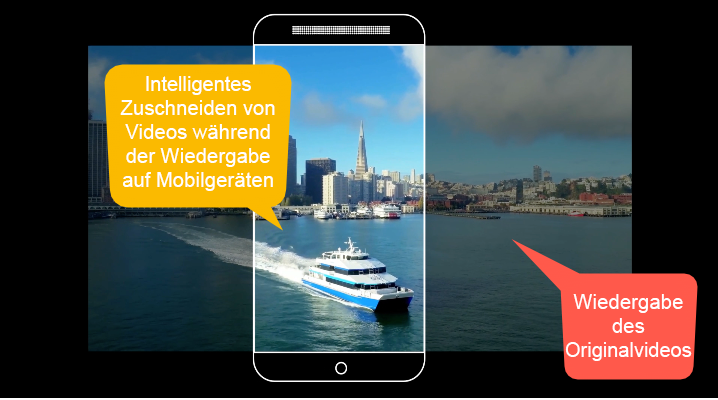
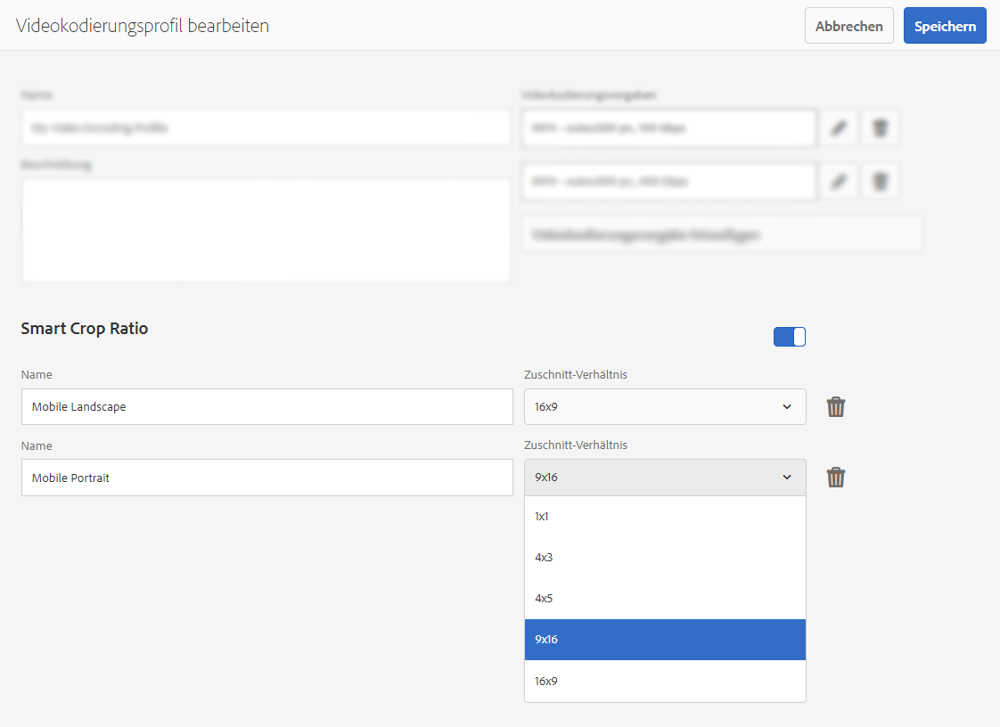
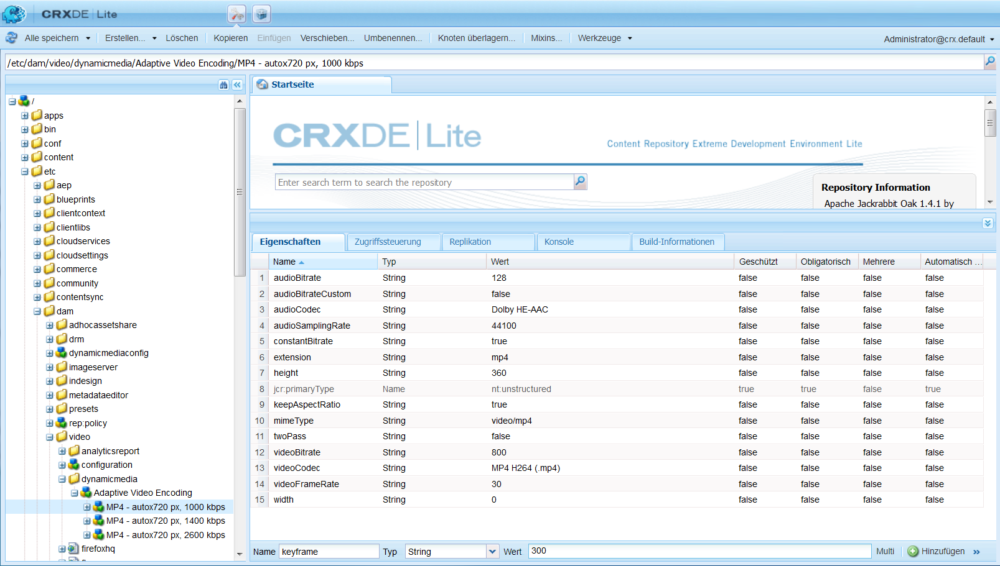
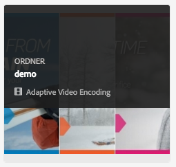
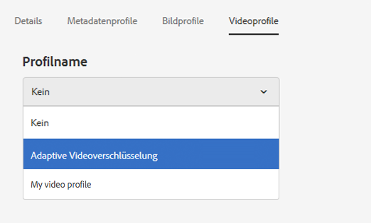
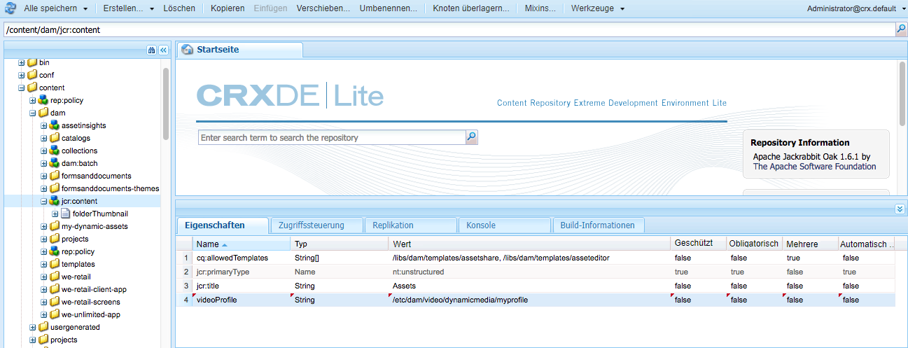

# Videoprofile {#video-profiles}

Dynamic Media enthält bereits das vordefinierte Profil „Adaptive Videoverschlüsselung“. Die Einstellungen in diesem vordefinierten Profil sind so optimiert, dass sie Ihren Kunden Ansichten in bestmöglicher Qualität bieten. Beim Kodieren von primären Videos mithilfe des Profils „Adaptive Videoverschlüsselung“ passt der Video-Player während der Wiedergabe automatisch die Qualität des Video-Streams auf Grundlage der Internet-Verbindungsgeschwindigkeit Ihrer Kunden an. Diese Funktion wird als adaptives Streaming bezeichnet.

Die folgenden weiteren Faktoren wirken sich auf die Qualität Ihrer Videos aus:

* **Auflösung des hochgeladenen primären Videos**

   Wenn das MP4-Video mit einer geringeren Auflösung (wie 240 p oder 360 p) aufgenommen wurde, kann es nicht in High Definition gestreamt werden.

* **Größe des Video-Players**

   Standardmäßig ist die „Breite“ im Profil „Adaptive Videoverschlüsselung“ auf „Automatisch“ gesetzt. Auch bei der Wiedergabe wird die beste Qualität basierend auf der Größe des Players verwendet.

Siehe [Best Practices für Videokodierung](/help/assets/video.md#best-practices-for-encoding-videos).

Informationen hierzu finden Sie auch im Thema über die [Best Practices für die Organisation Ihrer digitalen Assets zur Verwendung von Verarbeitungsprofilen](/help/assets/organize-assets.md).

>[!NOTE]
>
>Um die Metadaten eines Videos und die zugehörigen Videobild-Miniaturansichten zu generieren, muss das Video selbst den Kodierungsprozess in Dynamic Media durchlaufen. In Adobe Experience Manager kodiert der Workflow **[!UICONTROL Dynamic Media-Videokodierung]** Videos, wenn Sie Dynamic Media aktiviert und Video-Cloud Services eingerichtet haben. Dieser Workflow erfasst den Workflow-Prozess und Informationen zu Fehlern. Siehe [Überwachen der Videokodierung und des YouTube Publishing-Fortschritts](/help/assets/video.md#monitoring-video-encoding-and-youtube-publishing-progress). Wenn Sie Dynamic Media aktiviert und Video-Cloud Services eingerichtet haben, wird der Workflow für die **[!UICONTROL Videokodierung mit Dynamic Media]** automatisch beim Hochladen eines Videos wirksam. (Wenn Sie Dynamic Media nicht verwenden, wird der Workflow **[!UICONTROL DAM Update Asset]** wirksam.)
>
>Metadaten sind nützlich, wenn Sie nach Assets suchen. Die Miniaturansichten sind statische Videobilder, die bei der Kodierung generiert werden. Sie sind für das Experience Manager-System erforderlich und werden in der Benutzeroberfläche verwendet, damit Sie Videos in der Kartenansicht, der Suchergebnisansicht und der Asset-Listenansicht visuell identifizieren können. Sie sehen die generierten Miniaturansichten, wenn Sie auf das Ausgabedarstellungs-Symbol (eine Malerpalette) eines kodierten Videos tippen.

Wenn Sie die Erstellung des Videoprofils abgeschlossen haben, wenden Sie es auf einen oder mehrere Ordner an. Siehe [Anwenden eines Videoprofils auf Ordner](#applying-a-video-profile-to-folders).

Informationen zur Definition von erweiterten Verarbeitungsparametern für andere Asset-Typen finden Sie unter [Konfigurieren der Asset-Verarbeitung](/help/assets/config-dms7.md#configuring-asset-processing).

Siehe auch [Profile für die Verarbeitung von Metadaten, Bildern und Videos](processing-profiles.md).

## Vorgaben für adaptive Videoverschlüsselung {#adaptive-video-encoding-presets}

In der folgenden Tabelle werden die empfohlenen Kodierungsprofile für das adaptive Video-Streaming auf Smartphones und Tablets sowie Desktop-Computern angegeben. Sie können diese Vorgaben für Videos mit jedem Seitenverhältnis verwenden.

<table>
 <tbody>
  <tr>
   <td><strong>Videoformat-Codec</strong></td>
   <td><strong>Videogröße – Breite (px)</strong></td>
   <td><strong>Videogröße – Höhe (px)</strong></td>
   <td><strong>Seitenverhältnis beibehalten?</strong></td>
   <td><strong>Video-Bitrate (kBit/s)</strong></td>
   <td><strong>Video-Framerate (FPS)</strong></td>
   <td><strong>Audio-Codec</strong></td>
   <td><strong>Audiobitrate (Kbit/s)</strong></td>
  </tr>
  <tr>
   <td>
MP4 H.264 (mp4)
 </td>
   <td>auto</td>
   <td>360</td>
   <td>Ja</td>
   <td>730</td>
   <td>30</td>
   <td>Dolby HE-AAC</td>
   <td>128</td>
  </tr>
  <tr>
   <td>
MP4 H.264 (mp4)
 </td>
   <td>auto</td>
   <td>540</td>
   <td>Ja</td>
   <td>2000  </td>
   <td>30</td>
   <td>Dolby HE-AAC</td>
   <td>128</td>
  </tr>
  <tr>
   <td>
MP4 H.264 (mp4)
 </td>
   <td>auto</td>
   <td>720  </td>
   <td>Ja</td>
   <td>3000  </td>
   <td>30</td>
   <td>Dolby HE-AAC</td>
   <td>128</td>
  </tr>
 </tbody>
</table>

## Über die Verwendung von smartem Zuschneiden in Videoprofilen {#about-smart-crop-video}

Smartes Zuschneiden für Videos - eine optionale Funktion, die in Videoprofilen verfügbar ist - ist ein Tool, das die Leistungsfähigkeit künstlicher Intelligenz in Adobe Sensei nutzt. Er erkennt und schneidet den Fokus automatisch in jedem adaptiven Video oder progressiven Video, das Sie hochgeladen haben, unabhängig von der Größe ab.

Zu den unterstützten Videoformaten für smartes Zuschneiden gehören MP4, MKV, MOV, AVI, FLV und WMV.

Für die maximal unterstützte Videodateigröße beim smarten Zuschneiden gelten folgende Kriterien:

* Dauer von fünf Minuten.
* 30 Frames pro Sekunde (FPS).
* 300 MB Dateigröße.

Adobe Sensei ist auf 9000 Frames beschränkt. Das heißt: fünf Minuten bei 30 FPS. Wenn Ihr Video eine höhere FPS-Rate aufweist, verringert sich die maximal unterstützte Videodauer entsprechend. Beispielsweise muss ein 60-FPS-Video zweieinhalb Minuten lang sein, damit es von Adobe Sensei und smartem Zuschneiden unterstützt werden kann.

>[!IMPORTANT]
>
>Damit das smarte Zuschneiden für Videos funktioniert, müssen Sie mindestens eine Vorgabe für Videokodierung in Ihr Videoprofil einschließen.

Wenn Sie smartes Zuschneiden für Videos verwenden möchten, erstellen Sie ein Profil für adaptive oder progressive Videoverschlüsselung. Verwenden Sie im Rahmen Ihres Profils das Tool **[!UICONTROL Smart Crop Ratio]**, um vordefinierte Seitenverhältnisse auszuwählen. Nachdem Sie Ihre Vorgaben für die Videokodierung definiert haben, können Sie beispielsweise eine Definition für „Mobiles Querformat“ mit einem Seitenverhältnis von 16x9 und eine Definition für „Mobiles Hochformat“ mit einem Seitenverhältnis von 9x16 hinzufügen. Andere Seiten- oder Zuschnittverhältnisse, unter denen Sie wählen können, sind 1x1, 4x3 und 4x5.

Sie können das smarte Zuschneiden von Videos im Videoprofil über den Schieberegler rechts neben **[!UICONTROL Seitenverhältnis für intelligentes Zuschneiden]** in der Benutzeroberfläche ein- oder ausschalten.

Nachdem Sie Ihr Videoprofil erstellt und gespeichert haben, können Sie es auf die gewünschten Ordner anwenden.

Siehe [Anwenden eines Videoprofils auf bestimmte Ordner](#applying-video-profiles-to-specific-folders) oder [Globales Anwenden eines Videoprofils](#applying-a-video-profile-globally).

Siehe auch [Smartes Zuschneiden für Bilder](image-profiles.md).

## Erstellen eines Videoprofils für adaptives Streaming {#creating-a-video-encoding-profile-for-adaptive-streaming}

Dynamic Media umfasst standardmäßig das vordefinierte Profil „Adaptive Videoverschlüsselung“ (eine Gruppe mit Video-Upload-Einstellungen für MP4 H.264), das für das beste Anzeigeerlebnis optimiert ist. Sie können dieses Profil beim Hochladen von Videos verwenden.

Wenn dieses vordefinierte Profil Ihre Anforderungen jedoch nicht erfüllt, können Sie ein eigenes Profil für die adaptive Videoverschlüsselung erstellen. Wenn Sie die Einstellung **[!UICONTROL Für adaptives Streaming kodieren]** - als Best Practice - verwenden, werden alle dem Profil hinzugefügten Kodierungsvorgaben validiert, um sicherzustellen, dass alle Videos dasselbe Seitenverhältnis aufweisen. Darüber hinaus werden die kodierten Videos als Multi-Bitrate-Set für das Streaming behandelt.

Beachten Sie beim Erstellen des Videokodierungsprofils, dass die meisten Kodierungsoptionen mit den empfohlenen Standardeinstellungen ausgefüllt sind, um Ihnen zu helfen. Wenn Sie jedoch einen anderen Wert als den empfohlenen Standardwert auswählen, kann dies zu einer schlechten Videoqualität während der Wiedergabe und anderen Leistungsproblemen führen.

Daher werden für alle MP4 H.264-Videokodierungsvorgaben im Profil die folgenden Werte validiert, um sicherzustellen, dass sie für alle individuellen Kodierungsvorgaben im Profil gleich sind, sodass adaptives Streaming möglich ist:

* Videoformat-Codec – MP4 H.264 (.mp4)
* Audio-Codec
* Audiobitrate
* Seitenverhältnis beibehalten
* Kodierung mit zwei Durchgängen
* Konstante Bitrate
* H264-Profil
* Audio-Samplingrate

Wenn die Werte nicht identisch sind, können Sie das Profil durchaus im Istzustand erstellen. Adaptives Streaming ist jedoch nicht möglich. Stattdessen kommt es bei Benutzern zu Single-Bitrate-Streaming. Es wird empfohlen, dass Sie die Kodierungseinstellungen so bearbeiten, dass dieselben Werte über individuelle Kodierungsvorgaben hinweg im Profil verwendet werden. (Der Videoprofil-/Vorgabeneditor erzwingt die Parität der adaptiven Videokodierungseinstellungen, wenn **[!UICONTROL Für adaptives Streaming kodieren]** aktiviert ist.)

Siehe auch [Erstellen eines Videokodierungsprofils für progressives Streaming](#creating-a-video-encoding-profile-for-progressive-streaming).

Siehe auch [Best Practices für Videokodierung](/help/assets/video.md#best-practices-for-encoding-videos).

Informationen zur Definition von erweiterten Verarbeitungsparametern für andere Asset-Typen finden Sie unter [Konfigurieren der Asset-Verarbeitung](/help/assets/config-dms7.md#configuring-asset-processing).

**So erstellen Sie ein Videoprofil für adaptives Streaming**:

1. Tippen Sie auf das Experience Manager-Logo und navigieren Sie zu **[!UICONTROL Tools]** > **[!UICONTROL Assets]** > **[!UICONTROL Videoprofile]**.
1. Tippen Sie auf **[!UICONTROL Erstellen]** , um ein Videoprofil hinzuzufügen.

1. Geben Sie einen Namen und eine Beschreibung für das Profil ein.
1. Tippen Sie auf der Seite „Videokodierungsvorgaben erstellen/bearbeiten“ auf **[!UICONTROL Videokodierungsvorgabe hinzufügen]**.
1. Legen Sie auf der Registerkarte **[!UICONTROL Allgemein]** die Video- und Audiooptionen fest.
Tippen Sie auf das Informationssymbol neben den einzelnen Optionen, um zusätzliche Beschreibungen oder empfohlene Einstellungen auf Grundlage des ausgewählten Videoformat-Codecs anzuzeigen.
1. Stellen Sie unter der Überschrift „Videogröße“ sicher, dass **[!UICONTROL Seitenverhältnis beibehalten]** aktiviert ist.
1. Legen Sie die Videoframe-Auflösung in Pixeln fest. Verwenden Sie den Wert **[!UICONTROL Auto]**, um das Seitenverhältnis der Quelle anzupassen (Verhältnis von Breite zu Höhe). Beispielsweise „Auto x 480“ oder „640 x Auto“.

1. Führen Sie einen der folgenden Schritte aus:

   * Geben Sie im Feld **[!UICONTROL Breite]** die Option **[!UICONTROL auto]** ein. Geben Sie im Feld **[!UICONTROL Höhe]** einen Wert in Pixel ein.

   * Tippen Sie zum Visualisieren der Größe des Videos auf das Informationssymbol (i) rechts neben **[!UICONTROL Höhe]**, um die Seite mit der Größenberechnung zu öffnen. Legen Sie mit der **[!UICONTROL Größenberechnung]** die gewünschten Abmessungen des Videos fest (durch das blaue Feld dargestellt). Tippen Sie oben rechts auf **[!UICONTROL X]**, wenn Sie fertig sind.

1. (Optional) Tippen Sie auf die Registerkarte **[!UICONTROL Erweitert]** und stellen Sie sicher, dass das Kontrollkästchen **[!UICONTROL Standardwerte verwenden]** aktiviert ist (empfohlen). Alternativ können Sie erweiterte Video- und Audioeinstellungen anpassen.
1. Tippen Sie oben rechts auf der Seite auf **[!UICONTROL Speichern]**, um die Vorgabe zu speichern.
1. Führen Sie einen der folgenden Schritte aus:
   * Wiederholen Sie Schritt 4 bis 10, um weitere Kodierungsvorgaben zu erstellen. (Das adaptive Video-Streaming erfordert mehrere Videovorgaben.)
   * Fahren Sie mit dem nächsten Schritt fort.

1. (Optional) Gehen Sie wie folgt vor, um den Videos, auf die dieses Profil angewendet wird, smartes Zuschneiden für Videos hinzuzufügen:
   * Tippen Sie auf der Seite „Videoprofil bearbeiten“ rechts neben der Überschrift „Smart Crop Ratio“ auf **[!UICONTROL Neu hinzufügen]**.
   * Geben Sie im Feld &quot;Name&quot;einen Namen für das Zuschnittverhältnis ein, damit Sie es leicht erkennen können.
   * Wählen Sie aus der Dropdown-Liste **[!UICONTROL Zuschnittverhältnis]** das Verhältnis aus, das Sie verwenden möchten.

1. Führen Sie einen der folgenden Schritte aus:

   * Fügen Sie bei Bedarf weitere Zuschnittverhältnisse hinzu.
   * Fahren Sie mit dem nächsten Schritt fort.

1. Tippen Sie oben rechts auf der Seite erneut auf **[!UICONTROL Speichern]**, um das Profil zu speichern.

Sie können das Profil jetzt auf Ordner anwenden, die Videos enthalten. Siehe [Anwenden eines Videoprofils auf Ordner](#applying-a-video-profile-to-folders) oder [Globales Anwenden eines Videoprofils](#applying-a-video-profile-globally).

## Erstellen eines Videoprofils für progressives Streaming {#creating-a-video-encoding-profile-for-progressive-streaming}

Wenn Sie die Option **[!UICONTROL Für adaptives Streaming kodieren]** nicht verwenden, werden alle dem Profil hinzugefügten Kodierungsvorgaben als individuelle Videoausgabedarstellungen für Single-Bitrate-Streaming oder progressive Videowiedergabe behandelt. Außerdem gibt es keine Validierung, um sicherzustellen, dass alle Videoausgabedarstellungen dasselbe Seitenverhältnis aufweisen.

Je nachdem, welchen Modus Sie ausführen, werden die folgenden Videoformat-Codecs unterstützt:

* Dynamic Media-Scene7-Modus: H.264 (.mp4)
* Dynamic Media-Hybridmodus: H.264 (.mp4), WebM

Siehe auch [Erstellen eines Videokodierungsprofils für adaptives Streaming](#creating-a-video-encoding-profile-for-adaptive-streaming).

Siehe auch [Best Practices für Videokodierung](/help/assets/video.md#best-practices-for-encoding-videos).

Informationen zur Definition von erweiterten Verarbeitungsparametern für andere Asset-Typen finden Sie unter [Konfigurieren der Asset-Verarbeitung](/help/assets/config-dms7.md#configuring-asset-processing).

**So erstellen Sie ein Videoprofil für progressives Streaming**:

1. Tippen Sie auf das Experience Manager-Logo und navigieren Sie zu **[!UICONTROL Tools]** > **[!UICONTROL Assets]** > **[!UICONTROL Videoprofile]**.
1. Tippen Sie auf **[!UICONTROL Erstellen]** , um ein Videoprofil hinzuzufügen.
1. Geben Sie einen Namen und eine Beschreibung für das Profil ein.
1. Tippen Sie auf der Seite „Videokodierungsvorgaben erstellen/bearbeiten“ auf **[!UICONTROL Videokodierungsvorgabe hinzufügen]**.
1. Legen Sie auf der Registerkarte **[!UICONTROL Allgemein]** die Video- und Audiooptionen fest.
Tippen Sie auf das Informationssymbol neben den einzelnen Optionen, um zusätzliche Beschreibungen oder empfohlene Einstellungen auf Grundlage des ausgewählten Videoformat-Codecs anzuzeigen.
1. (Optional) Deaktivieren Sie unter der Überschrift „Videogröße“ das Kontrollkästchen **[!UICONTROL Seitenverhältnis beibehalten]**.
1. Gehen Sie folgendermaßen vor:
   * Geben Sie im Feld **[!UICONTROL Breite]** die Option **[!UICONTROL auto]** ein.
   * Geben Sie im Feld **[!UICONTROL Höhe]** einen Wert in Pixel ein.
Tippen Sie zur Visualisierung der Größe des Videos auf das Informationssymbol „Höhe“, um die Seite **[!UICONTROL Größenberechnung]** zu öffnen. Passen Sie die Größe des Videos auf der Seite **[!UICONTROL Größenberechnung]** wunschgemäß weiter an. Wenn Sie damit fertig sind, tippen Sie oben rechts im Dialogfeld auf **[!UICONTROL X]**.
1. (Optional) Führen Sie einen der folgenden Schritte aus:

   * Tippen Sie auf die Registerkarte **[!UICONTROL Erweitert]** und stellen Sie sicher, dass das Kontrollkästchen **[!UICONTROL Standardwerte verwenden]** aktiviert ist (empfohlen).

   * Deaktivieren Sie das Kontrollkästchen **[!UICONTROL Standardwerte verwenden]** und geben Sie die gewünschten Video- und Audioeinstellungen an.
Tippen Sie auf das Informationssymbol neben den einzelnen Optionen, um zusätzliche Beschreibungen oder empfohlene Einstellungen auf Grundlage des ausgewählten Videoformat-Codecs anzuzeigen.

1. Tippen Sie oben rechts auf der Seite auf **[!UICONTROL Speichern]**, um die Vorgabe zu speichern.
1. Führen Sie einen der folgenden Schritte aus:

   * Wiederholen Sie die Schritte 4 bis 9, um weitere Codierungsvorgaben zu erstellen.
   * Fahren Sie mit dem nächsten Schritt fort.

1. (Optional) Gehen Sie wie folgt vor, um den Videos, auf die dieses Profil angewendet wird, smartes Zuschneiden für Videos hinzuzufügen:

   * Tippen Sie auf der Seite „Videoprofil bearbeiten“ rechts neben der Überschrift „Smart Crop Ratio“ auf **[!UICONTROL Neu hinzufügen]**.
   * Geben Sie im Feld &quot;Name&quot;einen Namen für das Zuschnittverhältnis ein, damit Sie es leicht erkennen können.
   * Wählen Sie aus der Dropdown-Liste **[!UICONTROL Zuschnittverhältnis]** das Verhältnis aus, das Sie verwenden möchten.

1. Führen Sie einen der folgenden Schritte aus:

   * Fügen Sie bei Bedarf weitere Zuschnittverhältnisse hinzu.
   * Fahren Sie mit dem nächsten Schritt fort.

1. Tippen Sie oben rechts auf der Seite auf **[!UICONTROL Speichern]**, um das Profil zu speichern.

Sie können das Profil jetzt auf Ordner anwenden, die Videos enthalten. Siehe [Anwenden eines Videoprofils auf Ordner](#applying-a-video-profile-to-folders) oder [Globales Anwenden eines Videoprofils](#applying-a-video-profile-globally).

## Verwenden von benutzerdefinierten Videokodierungsparametern {#using-custom-added-video-encoding-parameters}

Sie können ein vorhandenes Videokodierungsprofil bearbeiten, um erweiterte Videokodierungsparameter zu nutzen, die beim Erstellen oder Bearbeiten eines Videoprofils in Experience Manager nicht in der Benutzeroberfläche vorhanden sind. Fügen Sie Ihrem bestehenden Profil einen oder mehrere erweiterte Parameter hinzu - z. B. minBitrate und maxBitrate .

**So verwenden Sie benutzerdefinierte Videokodierungsparameter:**

1. Tippen Sie auf das Experience Manager-Logo und navigieren Sie zu **[!UICONTROL Tools]** > **[!UICONTROL Allgemein]** > **[!UICONTROL CRXDE Lite]**.
1. Navigieren Sie auf der Seite „CRXDE Lite“ im linken Bereich des Explorers in das folgende Verzeichnis:

   `/conf/global/settings/dam/dm/presets/video/*name_of_video_encoding_profile_to_edit`

1. Geben Sie im Bereich rechts unten auf der Seite auf der Registerkarte „Eigenschaften“ **[!UICONTROL Name]**, **[!UICONTROL Typ]** und **[!UICONTROL Wert]** des zu verwendenden Parameters an.

   Die folgenden erweiterten Parameter sind verfügbar:

<table>
 <tbody>
  <tr>
   <td><strong>Name</strong></td>
   <td><strong>Beschreibung</strong>  </td>
   <td><strong>Typ</strong>  </td>
   <td><strong>Wert</strong></td>
  </tr>
  <tr>
   <td><code>h264Level</code></td>
   <td>Zu verwendende H.264-Stufe für die Kodierung. Normalerweise wird dieser Parameter automatisch anhand der von Ihnen verwendeten Kodierungseinstellungen bestimmt.</td>
   <td><code>String</code></td>
   <td>
10 * H.264-Stufe
 
Zum Beispiel: 3,0 = 30, 1,3 = 13
 
Kein Standardwert.
 </td>
  </tr>
  <tr>
   <td><code>keyframe</code></td>
   <td>Die Zielzahl der Frames zwischen Keyframes. Berechnen Sie diesen Wert, damit alle 2-10 Sekunden ein Keyframe generiert werden kann. Bei 30 Frames pro Sekunde sollte das Keyframe-Intervall zwischen 60 und 300 liegen.    Niedrigere Keyframe-Intervalle verbessern das Verhalten bei Stream-Suche und Stream-Wechsel für adaptive Videoverschlüsselung und können auch die Qualität bei Videos mit viel Bewegung verbessern. Da Keyframes die Größe einer Datei erhöhen, bewirkt ein niedrigeres Keyframe-Intervall in der Regel eine niedrigere Videogesamtqualität bei einer bestimmten Bit-Rate.</td>
   <td><code>String</code></td>
   <td>
Positive Zahl.
 
Der Standardwert ist 300.
 
Der empfohlene Wert für HLS (HTTP Live Streaming) ist 60–90.
 </td>
  </tr>
  <tr>
   <td><code>minBitrate</code></td>
   <td>
Minimale Bit-Rate, um Kodierungen mit variabler Bit-Rate zu ermöglichen (Kbit/s).
 
Dieser Parameter ist nur gültig, wenn bei der Erstellung oder Bearbeitung eines Videokodierungsprofils auf der Registerkarte „Erweitert“ die Option <strong>Konstante Bit-Rate verwenden</strong> deaktiviert ist.
 
Siehe auch <a href="/help/assets/video.md#bitrate">Bit-Rate</a>.
 </td>
   <td><code>String</code></td>
   <td>
Positive Zahl in Kbit/s.
 
Kein Standardwert.
 </td>
  </tr>
  <tr>
   <td><code>maxBitrate</code></td>
   <td>
Maximale Bit-Rate, um Kodierungen mit variabler Bit-Rate zu ermöglichen (Kbit/s).
 
Dieser Parameter ist nur gültig, wenn bei der Erstellung oder Bearbeitung eines Videokodierungsprofils auf der Registerkarte „Erweitert“ die Option <strong>Konstante Bit-Rate verwenden</strong> deaktiviert ist.
 
Siehe auch <a href="/help/assets/video.md#bitrate">Bit-Rate</a>.
 </td>
   <td><code>String</code></td>
   <td>
Positive Zahl in Kbit/s.
 
Kein Standardwert. Der empfohlene Wert entspricht jedoch bis zum Zweifachen der Kodierungs-Bit-Rate.
 </td>
  </tr>
  <tr>
   <td><code>audioBitrateCustom</code></td>
   <td>Setzen Sie den Wert auf <code>true</code>, um eine konstante Bit-Rate für den Audio-Stream zu erzwingen, sofern dies vom Audio-Codec unterstützt wird.</td>
   <td><code>String</code></td>
   <td>
<code>true</code>/<code>false</code>
 
Der Standardwert ist <code>false</code>.
 
Der empfohlene Wert für HLS (HTTP Live Streaming) ist <code>false</code>.
 
 
 </td>
  </tr>
 </tbody>
</table>

1. Tippen Sie in der rechten unteren Ecke der Seite auf **[!UICONTROL Hinzufügen]**.
1. Führen Sie einen der folgenden Schritte aus:

   * Wiederholen Sie die Schritte 3 und 4, um Ihrem Videokodierungsprofil einen weiteren Parameter hinzuzufügen.
   * Tippen Sie in der oberen linken Ecke der Seite auf **[!UICONTROL Alle speichern]**.

1. Tippen Sie oben links auf der Seite &quot;CRXDE Lite&quot;auf das Symbol **[!UICONTROL Zurück Startseite]** , um zum Experience Manager zurückzukehren.

### Bearbeiten von Videoprofilen {#editing-a-video-encoding-profile}

Sie können die Videoprofile bearbeiten, die Sie erstellt haben, um die in diesen Profilen enthaltenen Videovorgaben hinzuzufügen, zu bearbeiten oder zu löschen.

Die Bearbeitung des bereits in Dynamic Media integrierten Profils **[!UICONTROL Adaptive Videokodierung]** ist standardmäßig deaktiviert. Sie können das Profil einfach kopieren und dann unter einem neuen Namen speichern. Dann können Sie die gewünschten Vorgaben im kopierten Profil bearbeiten.

Siehe auch [Best Practices für Videokodierung](/help/assets/video.md#best-practices-for-encoding-videos).

Informationen zur Definition von erweiterten Verarbeitungsparametern für andere Asset-Typen finden Sie unter [Konfigurieren der Asset-Verarbeitung](/help/assets/config-dms7.md#configuring-asset-processing).

**So bearbeiten Sie ein Videoprofil:**

1. Tippen Sie auf das Experience Manager-Logo und navigieren Sie zu **[!UICONTROL Tools]** > **[!UICONTROL Assets]** > **[!UICONTROL Videoprofile]**.
1. Aktivieren Sie auf der Seite „Videoprofile“ einen Videoprofilnamen.
1. Tippen Sie in der Symbolleiste auf **[!UICONTROL Bearbeiten]**.
1. Bearbeiten Sie den Namen und die Beschreibung nach Bedarf auf der Seite „Videokodierungsprofil“.
1. Als Best Practice hat es sich bewährt, das Kontrollkästchen **[!UICONTROL Für adaptives Streaming kodieren]** zu aktivieren.
Tippen Sie auf das Informationssymbol, um eine Beschreibung von adaptivem Streaming anzuzeigen. (Wenn Sie ein progressives Videoprofil nicht bearbeiten möchten, aktivieren Sie dieses Kontrollkästchen nicht.)
1. Unter der Überschrift „Videokodierungsvorgaben“ können Sie die Videokodierungsvorgaben des Profils hinzufügen, bearbeiten oder löschen.

   Tippen Sie neben den einzelnen Optionen auf den Registerkarten **[!UICONTROL Allgemein]** und **[!UICONTROL Erweitert]** auf das Informationssymbol, um zusätzliche Beschreibungen oder empfohlene Einstellungen auf Grundlage des ausgewählten Videoformat-Codecs anzuzeigen.

1. Tippen Sie in der rechten oberen Ecke der Seite auf **[!UICONTROL Speichern]**.

### Kopieren eines Videoprofils {#copying-a-video-encoding-profile}

1. Tippen Sie auf das Experience Manager-Logo und navigieren Sie zu **[!UICONTROL Tools]** > **[!UICONTROL Assets]** > **[!UICONTROL Videoprofile]**.
1. Aktivieren Sie auf der Seite „Videoprofile“ einen Videoprofilnamen.
1. Tippen Sie in der Symbolleiste auf **[!UICONTROL Kopieren]**.
1. Geben Sie auf der Seite „Videokodierungsprofil“ einen neuen Namen für das Profil ein.
1. Als Best Practice hat es sich bewährt, das Kontrollkästchen **[!UICONTROL Für adaptives Streaming kodieren]** zu aktivieren. Tippen Sie auf das Informationssymbol, um eine Beschreibung von adaptivem Streaming anzuzeigen. (Wenn Sie ein progressives Videoprofil kopieren, aktivieren Sie dieses Kontrollkästchen nicht.)

   Wenn im Hybridmodus von Dynamic Media eine WebM-Videovoreinstellung Teil des Videoprofils ist, ist die Option **[!UICONTROL Für adaptives Streaming kodieren]** nicht möglich, da alle Vorgaben das MP4-Format aufweisen müssen.
1. Unter der Überschrift „Videokodierungsvorgaben“ können Sie die Videokodierungsvorgaben des Profils hinzufügen, bearbeiten oder löschen.

   Tippen Sie neben den einzelnen Optionen in den Registerkarten „Allgemein“ und „Erweitert“ auf das Informationssymbol, um die empfohlenen Einstellungen und die Beschreibung anzuzeigen.

1. Tippen Sie in der rechten oberen Ecke der Seite auf **[!UICONTROL Speichern]**.

### Löschen von Videoprofilen {#deleting-a-video-encoding-profile}

1. Tippen Sie auf das Experience Manager-Logo und navigieren Sie zu **[!UICONTROL Tools]** > **[!UICONTROL Assets]** > **[!UICONTROL Videoprofile]**.
1. Aktivieren Sie auf der Seite „Videoprofile“ mindestens einen Videoprofilnamen.
1. Tippen Sie in der Symbolleiste auf **[!UICONTROL Löschen]**.
1. Tippen Sie auf **[!UICONTROL OK]**.

## Anwenden eines Videoprofils auf Ordner     {#applying-a-video-profile-to-folders}

Wenn Sie ein Videoprofil einem Ordner zuweisen, erben automatisch alle Unterordner das Profil vom übergeordneten Ordner. Diese Regel bedeutet, dass Sie einem Ordner nur ein Videoprofil zuweisen können. Daher sollten Sie die Ordnerstruktur sorgfältig planen, in der Sie Assets hochladen, speichern, verwenden und archivieren.

Wenn Sie einem Ordner ein anderes Videoprofil zugewiesen haben, überschreibt das neue das vorherige Profil. Die zuvor vorhandenen Ordner-Assets verbleiben unverändert. Das neue Profil wird auf die Assets angewendet, die dem Ordner später hinzugefügt werden.

Ordner, denen ein Profil zugewiesen ist, werden in der Benutzeroberfläche durch das Erscheinungsbild des Profilnamens im Kartennamen gekennzeichnet.

Sie können Videoprofile auf bestimmte Ordner oder global auf alle Assets anwenden.

Sie können Assets in einem Ordner erneut verarbeiten, der bereits über ein vorhandenes Videoprofil verfügt, das Sie nachträglich geändert haben. Informationen hierzu finden Sie unter [Erneutes Verarbeiten von Assets in einem Ordner nach Bearbeitung des zugehörigen Verarbeitungsprofils](processing-profiles.md#reprocessing-assets).

### Anwenden eines Videoprofils auf bestimmte Ordner {#applying-video-profiles-to-specific-folders}

Sie können ein Videoprofil über das Menü **[!UICONTROL Werkzeuge]** oder, falls Sie sich im Ordner befinden, über **[!UICONTROL Eigenschaften]** auf einen Ordner anwenden. In diesem Abschnitt wird beschrieben, wie Sie Videoprofile auf beide Arten auf Ordner anwenden.

Ordner, denen bereits ein Profil zugewiesen ist, werden durch die Anzeige des Profilnamens direkt unter dem Ordnernamen gekennzeichnet.

Siehe auch [Erneutes Verarbeiten von Assets in einem Ordner nach Bearbeitung des zugehörigen Verarbeitungsprofils](processing-profiles.md#reprocessing-assets).

#### Anwenden von Videoprofilen auf Ordner über die Benutzeroberfläche „Profile“ {#applying-video-profiles-to-folders-by-way-of-the-profiles-user-interface}

1. Tippen Sie auf das Experience Manager-Logo und navigieren Sie zu **[!UICONTROL Tools]** > **[!UICONTROL Assets]** > **[!UICONTROL Videoprofile]**.
1. Wählen Sie ein Videoprofil aus, das Sie auf einen oder mehrere Ordner anwenden möchten.
1. Tippen Sie auf **[!UICONTROL Profil auf Ordner anwenden]** und wählen Sie den Ordner oder mehrere Ordner aus, die Sie zum Empfangen der neu hochgeladenen Assets verwenden möchten. Tippen Sie dann auf **[!UICONTROL Anwenden]**. Ordner, denen bereits ein Profil zugewiesen wurde, sind dadurch gekennzeichnet, dass der Name des Profils direkt unterhalb des Ordnernamens angezeigt wird (solange Sie sich in der **[!UICONTROL Kartenansicht]** befinden).
Sie können [den Fortschritt eines Videoprofil-Verarbeitungsauftrags überwachen](#monitoring-the-progress-of-an-encoding-job).

#### Anwenden eines Videoprofils auf Ordner aus „Eigenschaften“  {#applying-video-profiles-to-folders-from-properties}

1. Tippen oder klicken Sie auf das Experience Manager-Logo und navigieren Sie zu **[!UICONTROL Assets]** und dann zu dem Ordner, auf den Sie ein Videoprofil anwenden möchten.
1. Tippen Sie im Ordner auf das Kontrollkästchen, um es zu aktivieren, und tippen Sie anschließend auf **[!UICONTROL Eigenschaften]**.
1. Wählen Sie auf der Registerkarte **[!UICONTROL Videoprofile]** das Profil aus dem Dropdown-Menü aus und klicken Sie auf **[!UICONTROL Speichern und schließen]**. Ordner, denen bereits ein Profil zugewiesen ist, werden durch die Anzeige des Profilnamens direkt unter dem Ordnernamen gekennzeichnet.

   
Sie können [den Fortschritt eines Videoprofil-Verarbeitungsauftrags überwachen](#monitoring-the-progress-of-an-encoding-job).

### Globales Anwenden eines Videoprofils {#applying-a-video-profile-globally}

Sie können ein Experience Manager nicht nur auf einen Ordner anwenden, sondern auch global anwenden, sodass auf alle Inhalte, die in -Assets in einem beliebigen Ordner hochgeladen werden, das ausgewählte Profil angewendet wird.

Siehe auch [Erneutes Verarbeiten von Assets in einem Ordner nach Bearbeitung des zugehörigen Verarbeitungsprofils](processing-profiles.md#reprocessing-assets).

**So wenden Sie ein Videoprofil global an:**

* Navigieren Sie in CRXDE Lite zum folgenden Knoten: `/content/dam/jcr:content`. Fügen Sie die Eigenschaft `videoProfile:/libs/settings/dam/video/dynamicmedia/<name of video encoding profile>` hinzu und tippen Sie auf **[!UICONTROL Alle speichern]**.

   
* Sie können [den Fortschritt eines Videoprofil-Verarbeitungsauftrags überwachen](#monitoring-the-progress-of-an-encoding-job).

## Überwachen des Fortschritts eines Videoprofil-Verarbeitungsauftrags {#monitoring-the-progress-of-an-encoding-job}

Eine Verarbeitungsanzeige (oder Statusleiste) wird angezeigt, damit Sie den Fortschritt eines Videoprofil-Verarbeitungsauftrags visuell überwachen können.

In der Datei `error.log` können Sie den Fortschritt des Kodierungsauftrags ebenfalls anzeigen. Sie können prüfen, ob die Kodierung abgeschlossen ist oder ob Auftragsfehler angezeigt werden. Der Ordner `error.log` befindet sich im Ordner `logs` , in dem Ihre Instanz von Experience Manager installiert ist.

## Entfernen eines Videoprofils aus Ordnern {#removing-a-video-profile-from-folders}

Wenn Sie ein Videoprofil aus einem Ordner entfernen, erben automatisch alle Unterordner das Entfernen des Profils aus dem übergeordneten Ordner. Die Verarbeitung der Dateien, die in den Ordnern stattgefunden hat, verbleibt jedoch intakt.

Sie können ein Videoprofil aus einem Ordner im Menü **[!UICONTROL Tools]** entfernen. Wenn Sie sich im Ordner befinden, ist dies über die **[!UICONTROL Ordnereinstellungen]** möglich. In diesem Abschnitt werden die beiden Möglichkeiten beschrieben, wie Sie Videoprofile aus Ordnern entfernen können.

### Entfernen von Videoprofilen aus Ordnern über die Benutzeroberfläche „Profile“ {#removing-video-profiles-from-folders-by-way-of-the-profiles-user-interface}

1. Tippen Sie auf das Experience Manager-Logo und navigieren Sie zu **[!UICONTROL Tools]** > **[!UICONTROL Assets]** > **[!UICONTROL Videoprofile]**.
1. Wählen Sie das Videoprofil, das Sie aus einem oder mehreren Ordnern entfernen möchten.
1. Tippen Sie auf **[!UICONTROL Profil aus Ordner(n) entfernen]** und wählen Sie den Ordner oder mehrere Ordner aus, aus denen das Profil entfernt werden soll. Tippen Sie dann auf **[!UICONTROL Fertig]**.

   Sie können sich vergewissern, dass das Videoprofil nicht länger auf einen Ordner angewendet wird, da der Name in diesem Fall nicht mehr unter dem Ordner angezeigt wird.

### Entfernen von Videoprofilen aus Ordnern über „Eigenschaften“ {#removing-video-profiles-from-folders-by-way-of-properties}

1. Tippen Sie auf das Experience Manager-Logo und navigieren Sie zu **[!UICONTROL Assets]** und dann zu dem Ordner, aus dem Sie ein Videoprofil entfernen möchten.
1. Tippen Sie im Ordner auf das Kontrollkästchen, um es zu aktivieren, und tippen Sie anschließend auf **[!UICONTROL Eigenschaften]**.
1. Wählen Sie auf der Registerkarte **[!UICONTROL Videoprofile]** die Option **[!UICONTROL Keine]** aus dem Dropdown-Menü aus und klicken Sie auf **[!UICONTROL Speichern und schließen]**. Ordner, denen bereits ein Profil zugewiesen ist, werden durch die Anzeige des Profilnamens direkt unter dem Ordnernamen gekennzeichnet.
