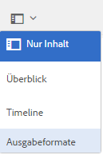
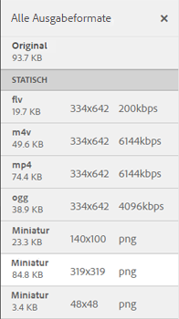

# Videoausgabeformate {#video-renditions}

Adobe Experience Manager Assets generiert Videoausgabeformate für Video-Assets verschiedener Formate wie OGG, FLV usw.

Experience Manager Assets unterstützt statische und dynamische Ausgabeformate (DM-kodierte Ausgabeformate) für Medien-Assets.

Statische Ausgabeformate werden nativ mit FFMPEG (im Systempfad installiert und verfügbar) generiert und im Inhalts-Repository gespeichert.

Die DM-kodierten Ausgabeformate werden im Proxyserver gespeichert und zur Laufzeit bereitgestellt.

Experience Manager Assets bietet Client-seitige Wiedergabefunktion für diese Ausgabedarstellungen.

Um die Ausgabeformate eines bestimmten Video-Assets anzuzeigen, öffnen Sie die Asset-Seite und wählen Sie das Symbol Globale Navigation aus. Wählen Sie dann **[!UICONTROL Ausgabeformate]** aus der Liste aus.

Die Liste der Videoausgabeformate wird im Bedienfeld **[!UICONTROL Ausgabeformate]** angezeigt.

Konfigurieren Sie den Proxyserver für DM-kodierte Ausgabeformate, indem Sie [Cloud-Dienste für Dynamic Media konfigurieren](config-dynamic.md).

Generieren Sie Videoausgabeformate mit gewünschten Parametern, [indem Sie ein entsprechendes Videoprofil erstellen](video-profiles.md).

Nachdem Sie den Proxyserver konfiguriert und Videoprofile erstellt haben, können Sie diese Videovorlage in ein Verarbeitungsprofil aufnehmen und dieses Verarbeitungsprofil auf einen Ordner anwenden.

>[!NOTE]
>
>Die Audiowiedergabe funktioniert nicht für OGG- und WAV-Dateien in Microsoft® Internet Explorer 11. Auf der Asset-Detailseite wird für Assets mit der Erweiterung OGG oder WAV ein Fehler `Invalid Source` angezeigt.
>
>Auf MS® Edge und iPad werden OGG-Dateien nicht abgespielt und es wird ein nicht unterstützter Formatfehler ausgegeben.
