# Video in Dynamic Media {#video}

In diesem Abschnitt wird die Arbeit mit Videos in Dynamic Media beschrieben.

## Schnellstartanleitungen: Videos {#quick-start-videos}

Die folgende schrittweise Workflow-Beschreibung soll Ihnen den schnellen Einstieg in adaptive Videosets in Dynamic Media erleichtern. Nach jedem Schritt gibt es Querverweise zu Themenüberschriften, in denen Sie weitere Informationen finden können.

>[!IMPORTANT]
>
>Bevor Sie mit Videos in Dynamic Media arbeiten, stellen Sie sicher, dass Ihr Adobe Experience Manager-Administrator Dynamic Media-Cloud Services bereits im Dynamic Media - Scene7 -Modus oder Dynamic Media - Hybridmodus aktiviert und konfiguriert hat.
>
>* Siehe [Dynamic Media-Cloud Services konfigurieren](/help/assets/config-dms7.md#configuring-dynamic-media-cloud-services) unter Konfigurieren von Dynamic Media - Scene7-Modus und [Fehlerbehebung für Dynamic Media - Scene7-Modus](/help/assets/troubleshoot-dms7.md).
>
>* Siehe [Konfigurieren von Dynamic Media Cloud Services](/help/assets/config-dynamic.md#configuring-dynamic-media-cloud-services) unter Konfigurieren von Dynamic Media - Hybridmodus .

>
>Derzeit bekanntes Problem bei der Videowiedergabe in Dynamic Media *nur auf Experience Manager 6.5.9.0*:
>
>* Wenn ein veröffentlichtes Video aktualisiert wird, muss es erneut veröffentlicht werden, um Änderungen beim Versand widerzuspiegeln.

>


1. **Konfigurieren Sie Videos in Dynamic Media** anhand der folgenden Schritte:

   * Erstellen Sie ein eigenes Videokodierungsprofil. Alternativ Sie können einfach das vordefinierte Profil für _adaptive Videoverschlüsselung_ verwenden, das mit Dynamic Media geliefert wird.

      * [Erstellen Sie ein Videokodierungsprofil](/help/assets/video-profiles.md#creating-a-video-encoding-profile-for-adaptive-streaming).
      * Erfahren Sie mehr über die [Best Practices für Videokodierung](#best-practices-for-encoding-videos).
   * Verknüpfen Sie das Videoverarbeitungsprofil mit den Ordnern, in die Sie die Primärvideos hochladen.

      * [Anwenden eines Videoprofils auf Ordner](/help/assets/video-profiles.md#applying-a-video-profile-to-folders).
      * Erfahren Sie mehr über die [Best Practices für die Organisation Ihrer digitalen Assets zur Verwendung von Verarbeitungsprofilen](/help/assets/organize-assets.md).
      * Erfahren Sie mehr über [Digitale Assets organisieren](/help/assets/organize-assets.md).
   * Laden Sie die Primärvideos in die Ordner hoch. Wenn Sie dem Ordner Videos hinzufügen, werden diese gemäß dem diesem Ordner zugewiesenen Videoverarbeitungsprofil kodiert.

      * Dynamic Media unterstützt hauptsächlich Kurzformvideos mit einer maximalen Länge von 30 Minuten.
      * Sie können Videodateien mit bis zu 15 GB pro Datei hochladen.
      * [Videos hochladen](/help/assets/managing-video-assets.md#upload-and-preview-video-assets)
      * Weitere Informationen zu [Unterstützten Eingabedateiformaten](/help/assets/assets-formats.md#supported-multimedia-formats)
   * [Fortschritt der Videokodierung](#monitoring-video-encoding-and-youtube-publishing-progress) in der Asset- oder Workflow-Ansicht überwachen


1. **Verwalten Sie die Videos in Dynamic Media** anhand der folgenden Schritte:

   * Video-Assets organisieren und durchsuchen

      * [Organisieren digitaler ](/help/assets/organize-assets.md)
AssetsWeitere Informationen zu  [Best Practices für die Organisation Ihrer digitalen Assets zur Verwendung von Verarbeitungsprofilen](organize-assets.md)

      * [Durchsuchen von Video-Assets ](search-assets.md#custompredicates) oder  [Suchen nach Assets](/help/assets/search-assets.md)
   * Video-Assets vorab anzeigen und veröffentlichen

      * Zeigen Sie das Quellvideo und die kodierten Ausgabedarstellungen des Videos zusammen mit den zugehörigen Miniaturansichten an:
         [Vorschau von ](managing-video-assets.md#upload-and-preview-video-assets) Videos oder Vorschau  [von Assets anzeigen](previewing-assets.md)
         [Videoausgabeformate anzeigen](video-renditions.md)
         [Verwalten von Videoausgabeformaten](manage-assets.md#managing-renditions)

      * [Verwalten von Viewer-Vorgaben](managing-viewer-presets.md)
      * [Veröffentlichen von Assets](publishing-dynamicmedia-assets.md)
   * Mit Videometadaten arbeiten

      * Zeigen Sie die Eigenschaften einer kodierten Videoausgabedarstellung wie Framerate, Audio- und Video-Bitrate und Codec an:
         [Eigenschaften von Videoausgabeformaten anzeigen](video-renditions.md)

      * Bearbeiten Sie die Eigenschaften des Videos, wie den Titel, die Beschreibung, die Tags und die benutzerdefinierten Metadatenfelder:
         [Bearbeiten von Videoeigenschaften](manage-assets.md#editing-properties)

      * [Metadaten für digitale Assets verwalten](metadata.md)
      * [Metadatenschemas](metadata-schemas.md)
   * Videos prüfen, genehmigen und mit Anmerkungen versehen und die vollständige Versionskontrolle behalten

      * [Anmerken von ](managing-video-assets.md#annotate-video-assets) Video-Assets oder  [Anmerkungen zu Assets](manage-assets.md#annotating)

      * [Version erstellen](manage-assets.md#asset-versioning)
      * [Anwenden von Workflows auf ](assets-workflow.md) Assets oder siehe Workflow für ein Asset  [starten](manage-assets.md#starting-a-workflow-on-an-asset)

      * [Ordner-Assets prüfen](bulk-approval.md)
      * [Projekte](../sites-authoring/projects.md)


1. **Veröffentlichen Sie die Videos in Dynamic Media** anhand der folgenden Schritte:

   * Wenn Sie Adobe Experience Manager als Web Content Management-System verwenden, können Sie Ihren Webseiten direkt Videos hinzufügen.

      * [Fügen Sie Ihren Webseiten](adding-dynamic-media-assets-to-pages.md) Videos hinzu.
   * Wenn Sie das Web-Content-Management-System eines Drittanbieters verwenden, können Sie Videos mit Web-Seiten verknüpfen oder darin einbetten.

      * Integrieren von Videos mithilfe der URL:
         [URLs mit Ihrer Webanwendung verknüpfen](linking-urls-to-yourwebapplication.md).

      * Integrieren von Videos mithilfe von Einbettungs-Code auf der Web-Seite:
         [Betten Sie den Video-Viewer auf einer Web-Seite](embed-code.md) ein.
   * [Veröffentlichen Sie Videos in YouTube](#publishing-videos-to-youtube).
   * [Erstellen Sie Videoberichte](#viewing-video-reports).

   * [Hinzufügen von Untertiteln zum Video](#adding-captions-to-video).


## Arbeiten mit Videos in Dynamic Media {#working-with-video-in-dynamic-media}

Video in Dynamic Media ist eine End-to-End-Lösung, mit der Sie hochwertige adaptive Videos für das Streaming auf mehreren Bildschirmen veröffentlichen können, darunter Desktop-, iOS-, Android™-, BlackBerry®- und Windows-Mobilgeräte. Ein adaptives Videoset gruppiert Versionen desselben Videos, die mit unterschiedlichen Bitraten und Formaten kodiert sind, z. B. 400 kBit/s, 800 kBit/s und 1000 kBit/s. Der Desktop-Computer oder das Mobilgerät erkennt die verfügbare Bandbreite.

Auf einem iOS-Mobilgerät wird beispielsweise die Bandbreite 3G, 4G oder WLAN erkannt. Dann wird automatisch das richtig kodierte Video aus den verschiedenen Video-Bitraten im adaptiven Videoset ausgewählt. Das Video wird auf Desktops, Mobilgeräten oder Tablets gestreamt.

Außerdem wird die Videoqualität automatisch geändert, wenn sich die Netzwerkbedingungen am Desktop oder Mobilgerät ändern. Wenn darüber hinaus ein Kunde den Vollbildmodus an einem Desktop aktiviert, reagiert das adaptive Videoset, indem eine bessere Auflösung verwendet wird, um das Anzeigeerlebnis des Kunden zu verbessern. Adaptive Videosets bieten Ihnen bestmögliche Wiedergabe für Kunden, die das Dynamic Media-Video auf unterschiedlichen Bildschirmen und Geräten wiedergeben.

Die Logik, mit der Video-Player bestimmen, welches kodierte Video wiedergegeben oder während der Wiedergabe ausgewählt werden soll, basiert auf dem folgenden Algorithmus:

1. Video-Player lädt das erste Videofragment auf Basis der Bitrate, die am nächsten an dem Wert liegt, der im Player selbst als „erste Bitrate“ festgelegt wurde.
1. Video-Player wechselt auf Basis von Änderungen an der Bandbreitengeschwindigkeit anhand der folgenden Kriterien:

   1. Player wählt den höchsten Bandbreitenstrom aus, der kleiner als die geschätzte Bandbreite oder gleich dieser ist.
   1. Player berücksichtigt nur 80 % der verfügbaren Bandbreite. Beim Wechseln nach oben ist der Player mit nur 70 % konservativer, um Überschätzungen zu vermeiden und sofort zurückzuwechseln.

Detaillierte technische Informationen zum Algorithmus finden Sie unter [https://android.googlesource.com/platform/frameworks/av/+/master/media/libstagefright/httplive/LiveSession.cpp](https://android.googlesource.com/platform/frameworks/av/+/master/media/libstagefright/httplive/LiveSession.cpp)

Für das Verwalten von einzelnen Videos und adaptiven Videosets wird Folgendes unterstützt:

* Hochladen von Videos mit zahlreichen unterstützten Video- und Audioformaten und Kodieren von Videos in das MP4 H.264-Format für die Wiedergabe auf mehreren Bildschirmen Sie können vordefinierte adaptive Videovorgaben oder einzelne Videokodierungsvorgaben verwenden bzw. Ihre eigene Kodierung anpassen, um die Qualität und Größe der Videos zu steuern.

   * Wenn ein adaptives Videoset generiert wird, umfasst es MP4-Videos.
   * **Hinweis**: Master-/Quellvideos werden einem adaptiven Videoset nicht hinzugefügt.

* Videountertitelung in allen HTML5-Video-Viewern
* Organisieren und Durchsuchen von Videos mit kompletter Metadatenunterstützung für die effiziente Verwaltung von Video-Assets
* Bereitstellen von adaptiven Videosets für das Internet, Desktops und Mobilgeräte, einschließlich iPhone, iPad, Android™, BlackBerry® und Windows Phone.

Das adaptive Video-Streaming wird auf verschiedenen iOS-Plattformen unterstützt. Siehe [Dynamic Media Viewers-Referenzhandbuch](https://experienceleague.adobe.com/docs/dynamic-media-developer-resources/library/viewers-aem-assets-dmc/video/c-html5-video-reference.html?lang=de#Video).

Dynamic Media unterstützt die mobile Videowiedergabe für MP4 H.264-Videos. Welche BlackBerry®-Geräte dieses Videoformat unterstützen, können Sie hier einsehen: [Unterstützte Videoformate für BlackBerry®](https://support.blackberry.com/kb/articleDetail?ArticleNumber=000005482).

Windows-Geräte, die dieses Videoformat unterstützen, finden Sie unter: [Unterstützte Medien-Codecs für Windows Phone 8](https://docs.microsoft.com/en-us/windows/uwp/audio-video-camera/supported-codecs)

* Wiedergabe von Videos mit Video-Viewer-Vorgaben aus Dynamic Media, einschließlich der folgenden:

   * Einzelvideo-Viewer
   * Viewer für gemischte Medien, die sowohl Video- als auch Bildinhalte kombinieren

* Konfigurieren von Video-Playern entsprechend Ihren Branding-Anforderungen
* Integrieren von Videos in Websites, mobile Sites oder Mobile Apps mit einer einfachen URL oder mit Integrations-Code

<!-- See [Dynamic video playback](https://s7d9.scene7.com/s7/uvideo.jsp?asset=GeoRetail/Mop_AVS&config=GeoRetail/Universal_Video1&stageSize=640,480) sample. -->

Siehe auch [Viewer für Experience Manager Assets und Dynamic Media Classic](https://experienceleague.adobe.com/docs/dynamic-media-developer-resources/library/viewers-aem-assets-dmc/c-html5-s7-aem-asset-viewers.html?lang=de#viewers-aem-assets-dmc) und [Viewer für Experience Manager-Assets](https://experienceleague.adobe.com/docs/dynamic-media-developer-resources/library/viewers-for-aem-assets-only/c-html5-aem-asset-viewers.html?lang=de#viewers-for-aem-assets-only).

## Best Practice: Verwenden des HTML5-Video-Viewers {#best-practice-using-the-html-video-viewer}

Die HTML5-Video-Viewer-Vorgaben von Dynamic Media sind robuste Video-Player. Sie können sie verwenden, um viele häufige Probleme im Zusammenhang mit der HTML5-Videowiedergabe zu vermeiden. Probleme im Zusammenhang mit Mobilgeräten wie fehlende Bereitstellung von adaptivem Streaming und eingeschränkte Reichweite des Desktop-Browsers.

In Bezug auf die Entwicklung des Players können Sie alle Funktionen des Video-Players mit standardmäßigen Web-Entwicklungs-Tools entwerfen. Sie können beispielsweise die Schaltflächen, die Steuerelemente und den benutzerdefinierten Poster-Hintergrund mit HTML5 und CSS entwerfen, um Ihre Kunden mit einem angepassten Erscheinungsbild anzusprechen.

Auf der Wiedergabeseite des Viewers wird die Videofähigkeit des Browsers automatisch erkannt. Das Video wird dann per HLS (HTTP Live Streaming), also adaptives Videostreaming, bereitgestellt. Wenn diese Bereitstellungsmethoden nicht verfügbar sind, wird stattdessen der progressive HTML5-Download verwendet.

Indem Sie Folgendes in einen einzelnen Player kombinieren:

* Die Möglichkeit, die Wiedergabekomponenten mit HTML5 und CSS zu entwerfen
* eingebettete Wiedergabe
* Verwenden Sie adaptives und progressives Streaming je nach Browserfunktion

Sie erweitern die Reichweite Ihrer Rich-Media-Inhalte auf Desktop- und Mobilbenutzer und sorgen für ein optimiertes Videoerlebnis.

Siehe auch [Über HTML5-Viewer](https://experienceleague.adobe.com/docs/dynamic-media-developer-resources/library/viewers-for-aem-assets-only/c-html5-aem-asset-viewers.html#viewers-for-aem-assets-only).

### Wiedergabe von Videos auf Desktops und mobilen Geräten mit dem HTML5-Video-Viewer {#playback-of-video-on-desktop-computers-and-mobile-devices-using-the-html-video-viewer}

Beim adaptiven Video-Streaming auf Desktop und Mobilgeräten basieren die für den Bit-Ratenwechsel verwendeten Videos auf allen MP4-Videos im adaptiven Videoset.

Die Videowiedergabe erfolgt entweder per HLS oder als progressiver Video-Download. In früheren Versionen von Experience Manager, z. B. 6.0, 6.1 und 6.2, wurden Videos über HTTP gestreamt.

In Experience Manager 6.3 und höheren Versionen werden die Videos nun über HTTPS gestreamt (d. h. HLS), da die DM-Gateway-Service-URL ebenfalls immer HTTPS verwendet. Beachten Sie, dass es bei diesem Standardverhalten keine Auswirkung auf den Kunden gibt. Video-Streaming wird immer über HTTPS ausgeführt, wenn es nicht durch den Browser unterstützt wird. (siehe folgende Tabelle). Daher:

* Wenn Sie eine HTTPS-Website mit HTTPS-Video-Streaming haben, ist das Streaming gut.
* Wenn Sie eine HTTP-Website mit HTTPS-Video-Streaming haben, ist das Streaming gut und es gibt keine Probleme mit gemischten Inhalten im Webbrowser.

HLS ist ein Apple-Standard für adaptives Video-Streaming, der die Wiedergabe automatisch an die Netzwerkbandbreitenkapazität anpasst. Darüber hinaus können Kunden einen beliebigen Punkt im Video „suchen“, ohne auf den Download des restlichen Videos zu warten.

Progressives Video wird bereitgestellt, indem das Video lokal auf ein Desktop-System oder Mobilgerät eines Anwenders heruntergeladen und gespeichert wird.

Die folgende Tabelle beschreibt das Gerät, den Browser und die Wiedergabemethode für Videos auf Desktop-Computern und Mobilgeräten mit Dynamic Media Video Viewer.

<table>
 <tbody>
  <tr>
   <td><strong>Gerät</strong></td>
   <td><strong>Browser</strong></td>
   <td><strong>Videowiedergabemodus</strong></td>
  </tr>
  <tr>
   <td>Desktop</td>
   <td>Internet Explorer 9 und 10</td>
   <td>Progressiver Download.</td>
  </tr>
  <tr>
   <td>Desktop</td>
   <td>Internet Explorer 11+</td>
   <td>Unter Windows 8 und Windows 10 – HTTPS bei Anfragen von HLS erzwingen. Bekannte Einschränkung: HTTP kann in dieser Kombination von Browser/Betriebssystem nicht mit HLS verwendet werden<br /> <br /> Unter Windows 7 – Progressiver Download. Verwendet Standardlogik zur Auswahl von HTTP vs. HTTPS.</td>
  </tr>
  <tr>
   <td>Desktop</td>
   <td>Firefox 23-44</td>
   <td>Progressiver Download.</td>
  </tr>
  <tr>
   <td>Desktop</td>
   <td>Firefox 45 oder höher</td>
   <td>HLS</td>
  </tr>
  <tr>
   <td>Desktop</td>
   <td>Chrome</td>
   <td>HLS</td>
  </tr>
  <tr>
   <td>Desktop</td>
   <td>Safari (Mac)</td>
   <td>HLS</td>
  </tr>
  <tr>
   <td>Mobilgerät</td>
   <td>Chrome (Android™ 6 oder früher)</td>
   <td>Progressiver Download.</td>
  </tr>
  <tr>
   <td>Mobilgerät</td>
   <td>Chrome (Android 7™ oder neuer)</td>
   <td>HLS</td>
  </tr>
  <tr>
   <td>Mobilgerät</td>
   <td>Android™ (Standard-Browser)</td>
   <td>Progressiver Download.</td>
  </tr>
  <tr>
   <td>Mobilgerät</td>
   <td>Safari (iOS)</td>
   <td>HLS</td>
  </tr>
  <tr>
   <td>Mobilgerät</td>
   <td>Chrome (iOS)</td>
   <td>HLS</td>
  </tr>
  <tr>
   <td>Mobilgerät</td>
   <td>BlackBerry®</td>
   <td>HLS</td>
  </tr>
 </tbody>
</table>

## Architektur der Dynamic Media-Videolösung {#architecture-of-dynamic-media-video-solution}

Die folgende Grafik zeigt den allgemeinen Bearbeitungs-Workflow für Videos, die über DMGateway (im Hybridmodus von Dynamic Media) hochgeladen und kodiert sowie für die öffentliche Anzeige verfügbar gemacht werden.


## Hybride Veröffentlichungsarchitektur für Videos {#hybrid-publishing-architecture-for-videos}


## Best Practices für die Kodierung von Videos {#best-practices-for-encoding-videos}

Der Workflow für die **Dynamic Media-Videokodierung** kodiert Videos, wenn Dynamic Media aktiviert und Video-Cloud-Services eingerichtet sind. Dieser Workflow erfasst den Workflow-Prozess und Informationen zu Fehlern. Siehe [Überwachen der Videokodierung und des Veröffentlichungsfortschritts von YouTube](#monitoring-video-encoding-and-youtube-publishing-progress). Wenn Sie Dynamic Media aktiviert und Video-Cloud Services eingerichtet haben, wird der Workflow für die **[!UICONTROL Videokodierung mit Dynamic Media]** automatisch beim Hochladen eines Videos wirksam. (Wenn Sie Dynamic Media nicht verwenden, wird der Workflow **[!UICONTROL DAM Update Asset]** wirksam.)

<!-- DEAD The following are best-practice tips for encoding source video files.

For advice about video encoding, see [Video Encoding Basics](https://www.adobe.com/go/learn_s7_encoding_en).

* [Streaming 101: The Basics — Codecs, Bandwidth, Data Rate, and Resolution](https://www.adobe.com/go/learn_s7_streaming101_en). -->

### Quellvideodateien {#source-video-files}

Verwenden Sie zum Kodieren einer Videodatei eine Quellvideodatei mit der höchstmöglichen Qualität. Verwenden Sie keine zuvor kodierten Videodateien, da diese Dateien bereits komprimiert wurden und die weitere Kodierung zu mangelhafter Videoqualität führen würde.

* Dynamic Media unterstützt Kurzformvideos mit einer maximalen Länge von 30 Minuten.
* Sie können Primärquellen-Videodateien mit bis zu 15 GB hochladen.

Die folgende Tabelle beschreibt die empfohlenen Werte für Größe, Seitenverhältnis und Mindest-Bitrate, die Quellvideos vor der Kodierung aufweisen sollten:

| Größe | Seitenverhältnis | Mindest-Bitrate |
|--- |--- |--- |
| 1.024 X 768 | 4:3 | 4500 kBit/s für die meisten Videos |
| 1.280 X 720 | 16:9 | 3000–6000 kBit/s, je nachdem, wie viel Bewegung im Video vorkommt |
| 1920 X 1080 | 16:9 | 6000–8000 kBit/s, je nachdem, wie viel Bewegung im Video vorkommt |

### Abrufen der Metadaten einer Datei {#obtaining-a-file-s-metadata}

Sie können die Metadaten einer Datei abrufen, indem Sie diese mit einem Videobearbeitungs-Tool anzeigen oder ein Programm verwenden, das zum Abrufen von Metadaten entwickelt wurde. Im Folgenden wird die Nutzung von MediaInfo, eines Drittanbieterprogramms, zum Abrufen der Metadaten einer Videodatei beschrieben:

1. Gehen Sie zu [MediaInfo Download](https://mediaarea.net/en/MediaInfo/Download).
1. Wählen Sie das Installationsprogramm für die GUI-Version aus, laden Sie es herunter und befolgen Sie die Installationsanweisungen.
1. Klicken Sie nach der Installation mit der rechten Maustaste auf die Videodatei (nur Windows) und wählen Sie MediaInfo oder öffnen Sie MediaInfo und ziehen Sie die gewünschte Videodatei in die Anwendung. Alle mit der Videodatei verknüpften Metadaten werden angezeigt, einschließlich Breite, Höhe und fps.

### Seitenverhältnis {#aspect-ratio}

Wenn Sie eine Videokodierungsvorgabe für die Primär-Videodatei auswählen oder erstellen, achten Sie darauf, dass die Vorgabe dasselbe Seitenverhältnis wie die Primär-Videodatei aufweist. Das Seitenverhältnis ist das Verhältnis zwischen Breite und Höhe des Videos.

Um das Seitenverhältnis einer Videodatei zu ermitteln, rufen Sie die Metadaten der Datei ab und notieren Sie die Breite und Höhe der Datei (siehe „Abrufen der Metadaten von Dateien“ oben). Ermitteln Sie das Seitenverhältnis dann anhand der folgenden Formel:

Breite/Höhe = Seitenverhältnis

Anhand der folgenden Tabelle können Sie die Formelergebnisse in gängige Seitenverhältnisoptionen umwandeln:

| Formelergebnis | Seitenverhältnis |
|--- |--- |
| 1,33 | 4:3 |
| 0,75 | 3:4 |
| 1,78 | 16:9 |
| 0,56 | 9:16 |

Beispiel: Ein Video mit einer Breite von 1440 und einer Höhe von 1080 hat ein Seitenverhältnis von 1440:1080 bzw. 1,33. In diesem Fall wählen Sie eine Videokodierungsvorgabe mit einem Seitenverhältnis von 4:3 aus, um die Videodatei zu kodieren.

### Bitrate {#bitrate}

Die Bitrate ist die kodierte Menge an Daten für eine Videowiedergabe von einer einzigen Sekunde Dauer. Die Bitrate wird in Kilobit pro Sekunde (kBit/s) gemessen.

>[!NOTE]
>
>Da alle Codecs verlustreiche Komprimierung verwenden, ist die Bitrate der wichtigste Faktor für die Videoqualität. Bei verlustreicher Komprimierung wird die Datenqualität schlechter, je mehr Sie eine Videodatei komprimieren. Wenn alle anderen Merkmale wie Auflösung, Framerate und Codec gleich sind, gilt daher, dass eine niedrigere Bitrate zu einer niedrigeren Qualität der komprimierten Datei führt.

Sie können zwischen zwei Arten der Bitraten-Kodierung wählen:

* **[!UICONTROL Konstante Bitraten-Kodierung]** (CBR): Während der CBR-Kodierung bleibt die Bitrate oder Anzahl der Bits pro Sekunde während des Kodierungsvorgangs gleich. Die CBR-Kodierung speichert die festgelegte Datenrate für das gesamte Video in Ihrer Einstellung. Die CBR-Kodierung optimiert nicht die Qualität von Mediendateien, spart jedoch Speicherplatz.
Verwenden Sie CBR, wenn Ihr Video im gesamten Video ein ähnliches Bewegungsniveau enthält. CBR wird hauptsächlich zum Streaming von Videoinhalten verwendet. Siehe auch [Verwenden von benutzerdefinierten Videokodierungsparametern](/help/assets/video-profiles.md#using-custom-added-video-encoding-parameters).

* **[!UICONTROL Variable Bit-Ratenkodierung]** (VBR): Die VBR-Kodierung passt die Datenrate nach unten und nach oben an die obere Grenze an. Als Basis dienen die vom Kompressor benötigten Daten. Diese Funktionalität bedeutet, dass die Bitrate der Mediendatei während eines VBR-Kodierungsprozesses je nach der benötigten Bitrate der Mediendateien dynamisch erhöht oder reduziert wird.
VBR benötigt mehr Zeit für die Kodierung, liefert jedoch die besten Ergebnisse. Die Qualität der Mediendatei ist besonders gut. VBR wird meist für die progressive HTTP-Übermittlung von Videoinhalten verwendet.

Verwendung von VBR vs. CRB
Wenn es um die Auswahl von VBR oder CBR geht, wird für Ihre Mediendateien meist VBR empfohlen. VBR bietet Dateien mit besserer Qualität bei wettbewerbsfähigen Bitraten. Verwenden Sie bei VBR auf jeden Fall eine Kodierung mit zwei Durchgängen und stellen Sie die maximale Bitrate so ein, dass sie 1,5-mal größer ist als die Ziel-Video-Bitrate.

Denken Sie bei der Auswahl einer Videokodierungsvorgabe an die Verbindungsgeschwindigkeit des Zielendbenutzers. Wählen Sie eine Vorgabe mit einer Datenrate, die 80 % dieser Geschwindigkeit beträgt. Beispiel: Wenn die Verbindungsgeschwindigkeit des Zielendbenutzers 1000 kBit/s beträgt, hat die optimale Vorgabe eine Videodatenrate von 800 kBit/s.

Diese Tabelle enthält die Datenraten von typischen Verbindungsgeschwindigkeiten.

| Geschwindigkeit (kBit/s) | Verbindungstyp |
|--- |--- |
| 256 | Einwahlverbindung |
| 800 | Typische Mobilverbindung Für diese Verbindung eignet sich eine Datenrate von 400 bis maximal 800 für 3G-Verbindungen. |
| 2.000 | Typische Breitband-Desktop-Verbindung. Für diese Verbindung eignet sich eine Datenrate zwischen 800 und 2.000 kBit/s, wobei die meisten Ziele im Durchschnitt zwischen 1.200 und 1.500 kBit/s aufweisen. |
| 5.000 | Typische Hochbreitband-Desktopverbindung Die Kodierung in diesem oberen Bereich wird nicht empfohlen, da die Videobereitstellung in dieser Geschwindigkeit für die meisten Benutzer nicht verfügbar ist. |

### Auflösung {#resolution}

Die **Auflösung** bezeichnet die Höhe und Breite einer Videodatei in Pixel. Die meisten Quellvideos werden mit hoher Auflösung gespeichert (z. B. 1920 x 1080). Zu Streaming-Zwecken werden Quellvideos in eine niedrigere Auflösung komprimiert (640 x 480 oder weniger).

Auflösung und Datenrate stellen zwei eng miteinander verknüpfte Faktoren der Videoqualität dar. Um dieselbe Videoqualität beizubehalten gilt: Je höher die Anzahl Pixel in einer Videodatei (also je höher die Auflösung), desto höher muss auch die Datenrate sein. Betrachten Sie z. B. die Anzahl Pixel pro Frame in einer Videodatei mit der Auflösung 320 x 240 und einer Datei mit der Auflösung 640 x 480:

| Auflösung | Pixel pro Frame |
|--- |--- |
| 320 x 240 | 76.800 |
| 640 x 480 | 307.200 |

Die Datei mit 640 x 480 enthält viermal so viele Pixel pro Frame. Um dieselbe Datenrate für diese beiden Auflösungen zu erreichen, wenden Sie eine vierfache Komprimierung auf die Datei mit 640 x 480 an, was zu einer schlechteren Videoqualität führen kann. Daher führt eine Videodatenrate von 250 kBit/s zu einer hohen Anzeigequalität bei einer Auflösung von 320 x 240, aber nicht bei einer Auflösung von 640 x 480.

Im Allgemeinen gilt: Je höher die verwendete Datenrate, desto besser sieht Ihr Video aus und je höher die verwendete Auflösung, desto höher muss die Datenrate sein, um die Anzeigequalität aufrechtzuerhalten (im Vergleich zu niedrigeren Auflösungen).

Da Auflösung und Datenrate miteinander verknüpft sind, haben Sie beim Kodieren von Videos zwei Optionen:

* Wählen Sie eine Datenrate und kodieren Sie dann mit der höchsten Auflösung, die mit der gewählten Datenrate eine gute Qualität erzeugt.
* Wählen Sie eine Auflösung und kodieren Sie dann mit der erforderlichen Datenrate, um hohe Videoqualität mit der gewählten Auflösung zu erreichen.

Orientieren Sie sich beim Auswählen (oder Erstellen) einer Videokodierungsvorgabe für die Primär-Videodatei an der folgenden Tabelle, um die richtige Auflösung auszuwählen.

| Auflösung | Höhe (Pixel) | Bildschirmgröße |
|--- |--- |--- |
| 240p | 240 | Winziger Bildschirm |
| 300p | 300 | Kleiner Bildschirm, wie er bei Mobilgeräten typisch ist |
| 360p | 360 | Kleiner Bildschirm |
| 480p | 480 | Mittlerer Bildschirm |
| 720p | 720 | Großer Bildschirm |
| 1.080p | 1.080 | Großer Bildschirm mit High-Definition |

### Fps (Frames pro Sekunde) {#fps-frames-per-second}

In den USA und Japan werden die meisten Videos mit 29,97 Frames pro Sekunde (fps) aufgenommen, in Europa mit 25 fps. Filme werden mit 24 fps aufgenommen.

Wählen Sie eine Videokodierungsvorgabe aus, die der fps-Rate der jeweiligen Primär-Videodatei entspricht. Wenn das Primärvideo beispielsweise 25 fps aufweist, wählen Sie eine Kodierungsvorgabe mit 25 fps. Standardmäßig wird bei jeder benutzerdefinierten Kodierung der fps-Wert der Primär-Videodatei verwendet. Daher müssen Sie die fps-Einstellung nicht explizit angeben, wenn Sie eine Videokodierungsvorgabe erstellen.

### Abmessungen bei der Videokodierung {#video-encoding-dimensions}

Wählen Sie für optimale Ergebnisse Kodierungsabmessungen so aus, dass das Quellvideo ein ganzes Mehrfaches aller kodierten Videos ist.

Um dieses Verhältnis zu berechnen, teilen Sie die Quellbreite durch die kodierte Breite, um das Breitenverhältnis zu ermitteln. Dann teilen Sie die Quellhöhe durch die kodierte Höhe, um das Höhenverhältnis zu ermitteln.

Wenn das resultierende Verhältnis eine Ganzzahl ist, hat das Video die optimale Skalierung. Wenn das errechnete Verhältnis keine Ganzzahl ist, wird die Videoqualität beeinträchtigt, da übrig gebliebene Pixelartefakte auf der Anzeige verbleiben. Dieser Effekt ist am auffälligsten, wenn das Video Text enthält.

Im folgenden Beispiel hat das Quellvideo Abmessungen von 1920 x 1080. Die drei kodierten Videos in der folgenden Tabelle geben die optimalen Kodierungseinstellungen an.

| Videotyp | Breite x Höhe | Breitenverhältnis | Höhenverhältnis |
|--- |--- |--- |--- |
| Quelle | 1920 x 1080 | 1 | 1 |
| Kodiert | 960 x 540 | 2 | 2 |
| Kodiert | 640 x 360 | 3 | 1 |
| Kodiert | 480 x 270 | 4 | 4 |

### Kodiertes Videodateiformat {#encoded-video-file-format}

In Dynamic Media wird empfohlen, MP4 H.264-Videokodierungsvorgaben zu verwenden. Da MP4-Dateien den H.264-Video-Codec nutzen, erhalten Sie damit hohe Videoqualität, aber auch eine komprimierte Dateigröße.

## Veröffentlichen von Videos in YouTube {#publishing-videos-to-youtube}

Sie können On-Premise-Experience Manager-Video-Assets direkt in einem YouTube-Kanal veröffentlichen, den Sie zuvor erstellt haben.

Um Video-Assets in YouTube zu veröffentlichen, richten Sie Experience Manager-Assets mit Tags ein. Diese Tags verknüpfen Sie mit einem YouTube-Kanal. Wenn das Tag eines Video-Assets mit dem Tag eines YouTube-Kanals übereinstimmt, wird das Video auf YouTube veröffentlicht. Die Veröffentlichung auf YouTube erfolgt neben einer normalen Veröffentlichung des Videos, solange ein entsprechendes Tag verwendet wird.

YouTube verwendet eine eigene Kodierung. Daher wird keines der bei der Kodierung von Dynamic Media erstellten Videoausgabedarstellungen, sondern das in Experience Manager hochgeladene Originalvideo in YouTube veröffentlicht. Die Verarbeitung von Videos mit Dynamic Media ist zwar nicht erforderlich, wird aber für den Fall vorausgesetzt, dass eine Viewer-Vorgabe für die Wiedergabe benötigt wird.

Wenn Sie das Videoverarbeitungsprofil umgehen und Videos direkt auf YouTube veröffentlichen, bedeutet das einfach, dass das Video-Asset in Experience Manager Asset keine anzeigbare Miniaturansicht erhält. Das bedeutet auch, dass nicht kodierte Videos in den Ausführungsmodi `dynamicmedia` oder `dynamicmedia_scene7` mit keinem der Dynamic Media-Asset-Typen funktionieren.

Für das Veröffentlichen von Video-Assets auf YouTube-Video-Servern müssen folgende Aufgaben abgeschlossen werden, um eine sichere Server-zu-Server-Authentifizierung mit YouTube zu erlauben.

1. [Google Cloud-Einstellungen konfigurieren](#configuring-google-cloud-settings)
1. [Erstellen eines YouTube-Kanals](#creating-a-youtube-channel)
1. [Tags zur Veröffentlichung hinzufügen](#adding-tags-for-publishing)
1. [Aktivieren des Agenten für die YouTube-Veröffentlichungsreplikation](#enabling-the-youtube-publish-replication-agent)
1. [Einrichten von YouTube in Experience Manager](#setting-up-youtube-in-aem)
1. [(Optional) Automatisieren Sie die Einstellung der standardmäßigen YouTube-Eigenschaften für Ihre hochgeladenen Videos.](#optional-automating-the-setting-of-default-youtube-properties-for-your-uploaded-videos)
1. [Veröffentlichen von Videos in Ihrem YouTube-Kanal](#publishing-videos-to-your-youtube-channel)
1. [(Optional) Überprüfen Sie das in YouTube veröffentlichte Video.](/help/assets/video.md#optional-verifying-the-published-video-on-youtube)
1. [Verknüpfen von YouTube-URLs mit einer Webanwendung](#linking-youtube-urls-to-your-web-application)

Sie können auch [die Veröffentlichung von Videos aufheben, um diese von YouTube zu entfernen](#unpublishing-videos-to-remove-them-from-youtube).

### Google Cloud-Einstellungen konfigurieren {#configuring-google-cloud-settings}

Um Inhalte auf YouTube zu veröffentlichen, benötigen Sie ein Google-Konto. Wenn Sie über ein Gmail-Konto verfügen, besitzen Sie bereits ein Google-Konto. Wenn Sie noch nicht über ein Google-Konto verfügen, können Sie einfach eines erstellen. Sie benötigen das Konto, um Anmeldeinformationen für die Veröffentlichung von Video-Assets auf YouTube zu erhalten. Wenn Sie bereits ein Konto erstellt haben, überspringen Sie diese Aufgabe und fahren Sie direkt mit [Erstellen eines YouTube-Kanals](#creating-a-youtube-channel) fort.

Das mit Google Cloud verwendete Konto und das für YouTube verwendete Google-Konto müssen nicht übereinstimmen.

Google ändert regelmäßig seine Benutzeroberfläche. Daher können die Schritte zum Veröffentlichen von Videos auf YouTube leicht von der folgenden Dokumentation abweichen. Dieser Hinweis gilt auch für YouTube, wenn Sie prüfen möchten, ob Videos hochgeladen wurden.

>[!NOTE]
>
>Zum Zeitpunkt der Veröffentlichung dieses Artikels waren die folgenden Schritte korrekt. Google aktualisiert jedoch regelmäßig ohne vorherige Ankündigung seine Websites. Daher können die Schritte geringfügig abweichen.

So konfigurieren Sie Google Cloud-Einstellungen:

1. Erstellen Sie ein Google-Konto.
   [https://accounts.google.com/SignUp?service=mail](https://accounts.google.com/SignUp?service=mail)

   Wenn Sie bereits über ein Google-Konto verfügen, können Sie zum nächsten Schritt wechseln.

1. Rufen Sie [https://cloud.google.com/](https://cloud.google.com/) auf.
1. Klicken Sie auf der Google Cloud-Seite rechts oben auf **[!UICONTROL Konsole]**.

   Sie müssen sich möglicherweise mit den Anmeldedaten für Ihr Google-Konto **[!UICONTROL Anmelden]**, um die Option **[!UICONTROL Konsole]** anzuzeigen.

1. Klicken Sie auf der Dashboard-Seite rechts neben **[!UICONTROL Google Cloud Platform]** auf die Dropdown-Liste mit den Projekten, um das Dialogfeld zum Auswählen eines Projekts zu öffnen.
1. Tippen Sie im Dialogfeld zum Auswählen eines Projekts auf **[!UICONTROL Neues Projekt]**.

   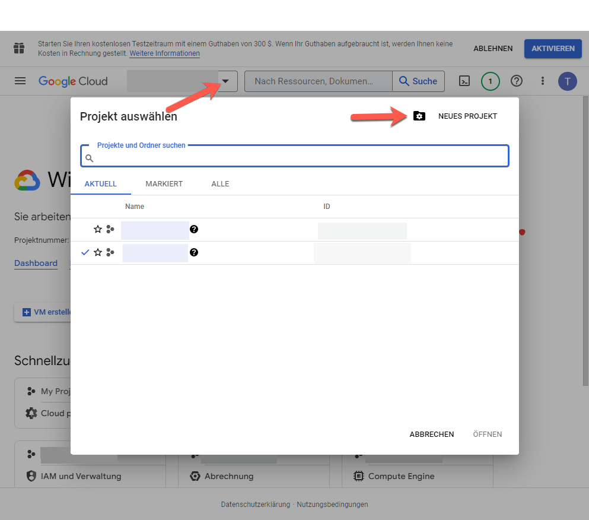

1. Geben Sie im Dialogfeld für das neue Projekt in das Feld für den Projektnamen den Namen Ihres neuen Projekts ein.

   Ihre Projekt-ID basiert auf dem Projektnamen. Wählen Sie daher den Projektnamen sorgfältig. Er kann nach seiner Erstellung nicht geändert werden. Außerdem müssen Sie dieselbe Projekt-ID erneut eingeben, wenn Sie YouTube später in Experience Manager einrichten. erwägen, es aufzuschreiben.

1. Klicken Sie auf **[!UICONTROL Erstellen]**.

1. Nehmen Sie eine der folgenden Aktionen vor:

   * Tippen Sie im Projektdashboard auf der Karte „Einstieg“ auf die Option zum **[!UICONTROL Entdecken und Aktivieren von APIs]**.
   * Tippen Sie im Projektdashboard auf der API-Karte auf die Option zum **[!UICONTROL Aufrufen der API-Übersicht]**.

   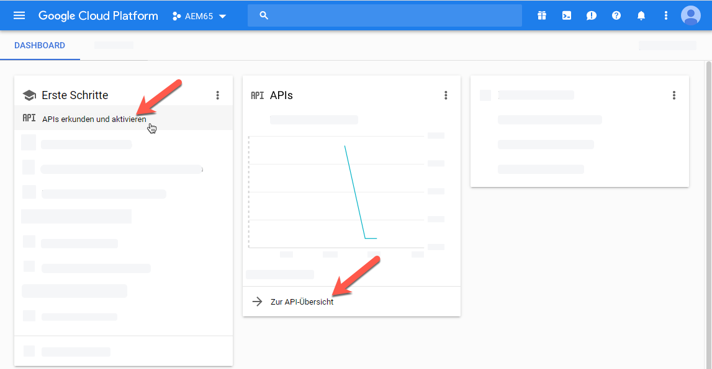

1. Tippen Sie oben auf der Seite mit den APIs und Services auf die Option zum **[!UICONTROL Aktivieren von APIs und Services]**.
1. Tippen Sie in der API-Bibliothek auf der linken Seite unter **[!UICONTROL Kategorie]** auf **[!UICONTROL YouTube]**. Tippen Sie rechts auf der Seite auf **[!UICONTROL YouTube-Daten-API]**.
1. Tippen Sie auf der Seite zur YouTube Data API v3 auf die Option **[!UICONTROL Aktivieren]**.

   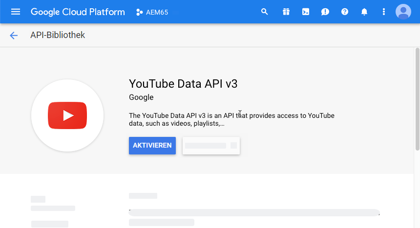

1. Um die API zu verwenden, benötigen Sie Anmeldeinformationen. Klicken Sie bei Bedarf auf **[!UICONTROL Berechtigungen erstellen]**.

   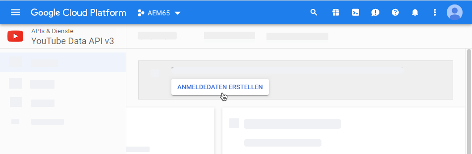

1. Gehen Sie auf der Seite zum **[!UICONTROL Anmeldedaten zu Projekt hinzufügen]** in Schritt 1 wie folgt vor:

   * Wählen Sie in der Dropdown-Liste **[!UICONTROL Welche API verwenden Sie?]** die Option **[!UICONTROL YouTube Data API v3]**.

   * Wählen Sie aus der Dropdown-Liste **[!UICONTROL Von wo wird die API abgerufen?]** die Option **[!UICONTROL Webserver (z. B. node.js, Tomcat)]**

   * Tippen Sie in der Dropdown-Liste **[!UICONTROL Auf welche Daten wird zugegriffen?]** auf die Option **[!UICONTROL Nutzerdaten]**.

   

1. Tippen Sie auf **[!UICONTROL Welche Anmeldedaten brauche ich?]**
1. Geben Sie auf der Seite **[!UICONTROL Anmeldedaten zu Projekt hinzufügen]** in Schritt 2 unter der Überschrift **[!UICONTROL OAuth 2.0-Client-ID generieren]** im Feld „Name“ ggf. einen eindeutigen Namen ein. Sie können auch den von Google angegebenen Standardnamen verwenden.
1. Geben Sie unter der Überschrift **[!UICONTROL Autorisierte JavaScript-Ursprünge]** im Textfeld den folgenden Pfad ein, ersetzen Sie Ihre eigene Domäne und Port-Nummer im Pfad und drücken Sie dann **[!UICONTROL Enter]** , um den Pfad zur Liste hinzuzufügen:

   `https://<servername.domain>:<port_number>`

   Beispiel: `https://1a2b3c.mycompany.com:4321`

   **Hinweis**: Das obige Pfadbeispiel dient nur zu Demonstrationszwecken.

   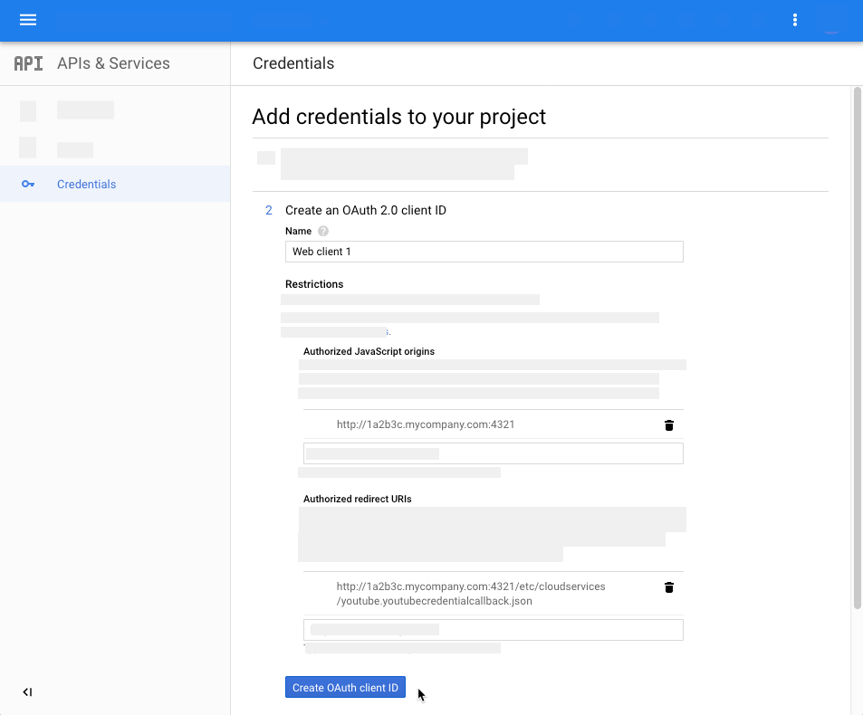

1. Geben Sie unter der Überschrift **[!UICONTROL Autorisierte Weiterleitungs-URIs]** im Textfeld den folgenden Pfad ein, ersetzen Sie Ihre eigene Domain und Port-Nummer im Pfad und drücken Sie dann die **[!UICONTROL Eingabetaste]**, um den Pfad der Liste hinzuzufügen:

   `https://<servername.domain>:<port_number>/etc/cloudservices/youtube.youtubecredentialcallback.json`

   Beispiel: `https://1a2b3c.mycompany.com:4321/etc/cloudservices/youtube.youtubecredentialcallback.json`

   **Hinweis**: Das obige Pfadbeispiel dient nur zu Demonstrationszwecken.

1. Klicken Sie auf **[!UICONTROL OAuth Client-ID erstellen]**.
1. Wählen Sie auf der Seite **[!UICONTROL Anmeldeinformationen zu Projekt hinzufügen]** in Schritt 3 unter der Überschrift **[!UICONTROL OAuth 2.0-Einverständnisbildschirm einrichten]** die derzeit verwendete E-Mail-Adresse für Gmail aus.

   

1. Geben Sie unter der Überschrift **[!UICONTROL Benutzern angezeigter Produktname]** im Textfeld ein, was Sie auf der Zustimmungsseite anzeigen möchten.

   Der Einverständnisbildschirm wird dem Experience Manager-Administrator angezeigt, wenn er sich bei YouTube authentifiziert. Experience Manager kontaktieren YouTube zur Erlaubnis.

1. Klicken Sie auf **[!UICONTROL Weiter]**.
1. Tippen Sie auf der Seite „Anmeldeinformationen zu Ihrem Projekt hinzufügen“ in Schritt 4 unter der Überschrift **[!UICONTROL Anmeldedaten herunterladen]** auf **[!UICONTROL Herunterladen]**.

   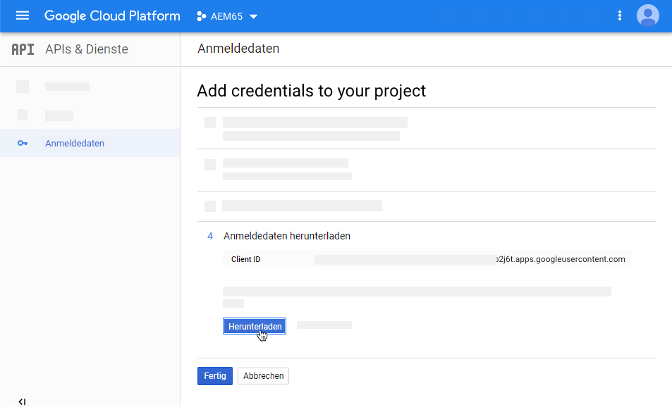

1. Speichern Sie die Datei `client_id.json`.

   Sie benötigen diese heruntergeladene JSON-Datei beim späteren Einrichten von YouTube in Adobe Experience Manager.

1. Klicken Sie auf **[!UICONTROL Fertig]**.

   Melden Sie sich von Ihrem Google-Konto ab. Erstellen Sie jetzt einen YouTube-Kanal.

### Erstellen eines YouTube-Kanals {#creating-a-youtube-channel}

Für das Veröffentlichen von Videos auf YouTube benötigen Sie mindestens einen Kanal. Wenn Sie bereits einen YouTube-Kanal erstellt haben, können Sie diese Aufgabe überspringen und zu [Tags zur Veröffentlichung hinzufügen](/help/assets/video.md#adding-tags-for-publishing) navigieren.

>[!WARNING]
>
>Stellen Sie sicher, dass Sie in YouTube *bereits mindestens einen Kanal eingerichtet haben, bevor Sie* unter YouTube-Einstellungen in Experience Manager Kanäle hinzufügen (siehe [Einrichten von YouTube in Experience Manager](#setting-up-youtube-in-aem) unten). Wenn Sie einen oder mehrere Kanäle nicht einrichten, werden Sie nicht vor nicht vorhandenen Kanälen gewarnt. Beim Hinzufügen eines Kanals wird allerdings weiterhin eine Google-Authentifizierung vorgenommen. Es kann jedoch nicht ausgewählt werden, an welchen Kanal das Video gesendet wird.

**So erstellen Sie einen YouTube-Kanal:**

1. Rufen Sie [https://www.youtube.com](https://www.youtube.com/) auf und melden Sie sich mithilfe Ihrer Google-Kontoanmeldeinformationen an.
1. Klicken Sie in der rechten oberen Ecke der YouTube-Seite auf Ihr Profilbild (kann auch als Buchstabe in einem farbigen Kreis angezeigt werden) und klicken Sie dann auf **[!UICONTROL YouTube settings]** (Zahnradsymbol).
1. Klicken Sie auf der Seite Übersicht unter der Überschrift Zusätzliche Funktionen auf **[!UICONTROL Alle meine Kanäle anzeigen oder einen Kanal erstellen]**.
1. Klicken Sie auf der Seite „Kanal“ auf **[!UICONTROL Neuen Kanal erstellen]**.
1. Geben Sie auf der Seite „Markenkonto“ im Feld „Name Markenkonto“ einen Unternehmensnamen oder den Namen eines anderen beliebigen Kanals ein, in dem Ihre Video-Assets veröffentlicht werden sollen. Klicken Sie dann auf **[!UICONTROL Erstellen]**.

   Merken Sie sich den hier eingegebenen Namen, da Sie ihn bei der Einrichtung von YouTube in Experience Manager erneut eingeben müssen.

1. (Optional) Fügen Sie gegebenenfalls weitere Kanäle hinzu.

   Fügen Sie nun Tags zur Veröffentlichung hinzu.

### Tags zur Veröffentlichung hinzufügen {#adding-tags-for-publishing}

Um Ihre Videos auf YouTube zu veröffentlichen, werden Tags von Experience Manager einem oder mehreren YouTube-Kanälen zugeordnet. Informationen zum Hinzufügen von Tags zur Veröffentlichung finden Sie unter [Verwalten von Tags](/help/sites-administering/tags.md).

Wenn Sie die Standard-Tags in Experience Manager verwenden möchten, können Sie diese Aufgabe überspringen und zu [Aktivieren Sie den YouTube Publish-Replikationsagenten](#enabling-the-youtube-publish-replication-agent) navigieren.

### Aktivieren des YouTube-Agenten für die Veröffentlichungsreplikation {#enabling-the-youtube-publish-replication-agent}

Wenn Sie nach dem Aktivieren des Agenten für die YouTube-Veröffentlichungsreplikation die Verbindung zum Google-Konto testen möchten, tippen Sie auf **[!UICONTROL Verbindung testen]**. Die Verbindungsergebnisse werden auf einer Browser-Registerkarte angezeigt. Wenn Sie YouTube-Kanäle hinzugefügt haben, wird eine Liste dieser Kanäle im Rahmen des Tests angezeigt.

1. Klicken Sie oben links im Experience Manager auf das Experience Manager-Logo und dann in der linken Leiste auf **[!UICONTROL Tools]** > **[!UICONTROL Bereitstellung]** > **[!UICONTROL Replikation]** > **[!UICONTROL Agenten für Autor]**.
1. Klicken Sie auf der Seite &quot;Agenten für Autor&quot;auf **[!UICONTROL YouTube Publish]**.
1. Klicken Sie auf der Symbolleiste rechts neben den Einstellungen auf **[!UICONTROL Bearbeiten]**.
1. Aktivieren Sie das Kontrollkästchen **[!UICONTROL Aktiviert]** , damit Sie den Replikationsagenten aktivieren können.
1. Klicken Sie auf **[!UICONTROL OK]**.

   Richten Sie jetzt YouTube in Experience Manager ein.

### Einrichten von YouTube in Experience Manager {#setting-up-youtube-in-aem}

Mit Experience Manager 6.4 wurde eine neue Methode für die Touch-Benutzeroberfläche eingeführt, um die YouTube-Veröffentlichung in Experience Manager einzurichten. Führen Sie je nach der installierten Experience Manager-Instanz, die Sie verwenden, einen der folgenden Schritte aus:

* Informationen zum Konfigurieren von YouTube in Experience Manager vor 6.4 finden Sie unter [Einrichten von YouTube in Experience Manager vor 6.4](/help/assets/video.md#setting-up-youtube-in-aem-before).
* Informationen zum Konfigurieren von YouTube in Experience Manager 6.4 oder höher finden Sie unter [Einrichten von YouTube in Experience Manager 6.4 und höher](#setting-up-youtube-in-aem-and-later).

#### Einrichten von YouTube in Experience Manager 6.4 und höher {#setting-up-youtube-in-aem-and-later}

1. Melden Sie sich als Administrator bei Ihrer Dynamic Media-Instanz an.
1. Tippen Sie oben links auf das Experience Manager-Logo und dann in der linken Leiste auf **[!UICONTROL Tools]** (Hammersymbol) > **[!UICONTROL Cloud Services]** > **[!UICONTROL YouTube Publishing Configuration]**.
1. Tippen Sie auf **[!UICONTROL global]** (nicht auswählen).

1. Tippen Sie oben rechts auf der globalen Seite auf **[!UICONTROL Erstellen]**.
1. Geben Sie auf der Seite „YouTube-Veröffentlichungskonfiguration erstellen“ unter „Google Cloud Platform-Einstellungen“ im Feld **[!UICONTROL Anwendungsname]** die Google-Projekt-ID ein.

   Sie haben die Projekt-ID bereits während der Konfiguration der Google Cloud-Einstellungen angegeben.
Lassen Sie die Seite YouTube-Konfiguration erstellen geöffnet. gleich wirst du darauf zurückkommen.

   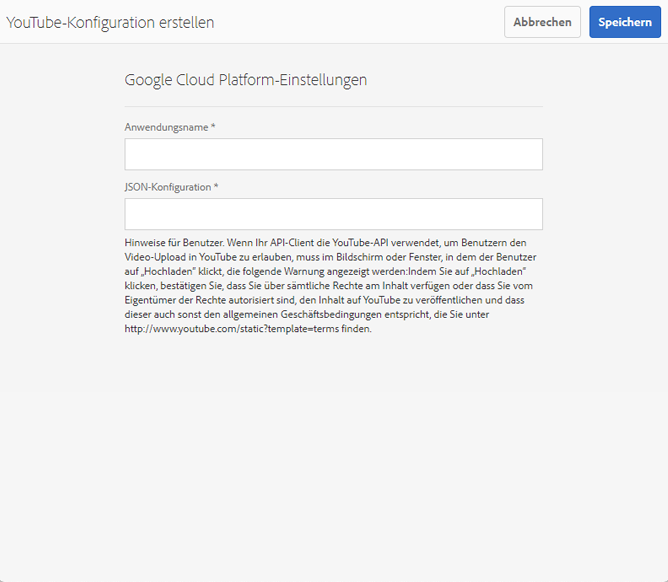

1. Öffnen Sie mithilfe eines Texteditors die JSON-Datei, die Sie zuvor in der Aufgabe [Google Cloud-Einstellungen konfigurieren](/help/assets/video.md#configuring-google-cloud-settings) heruntergeladen und gespeichert haben.
1. Markieren und kopieren Sie den gesamten JSON-Text.
1. Kehren Sie zum Dialogfeld „YouTube-Kontoeinstellungen“ zurück. Fügen Sie im Feld **[!UICONTROL JSON-Konfiguration]** den JSON-Text ein.
1. Tippen Sie oben rechts auf **[!UICONTROL Speichern]**.

   Richten Sie jetzt YouTube-Kanäle in Experience Manager ein.

1. Tippen Sie auf **[!UICONTROL Kanal hinzufügen]**.
1. Geben Sie im Dialogfeld „Kanalname“ den Namen des Kanals ein, den Sie zuvor in der Aufgabe zum **[!UICONTROL Hinzufügen von Kanälen zu YouTube]** erstellt haben.

   Sie können optional eine Beschreibung hinzufügen.

1. Tippen Sie auf **[!UICONTROL Hinzufügen]**.
1. Die YouTube-/Google-Authentifizierung wird angezeigt. Wenn Sie nicht bereits beim Google Cloud-Konto angemeldet sind, überspringen Sie diesen Schritt.

   * Geben Sie den Google-Benutzernamen und das -Kennwort ein, der bzw. das mit der Google-Projekt-ID und dem obigen JSON-Text verknüpft ist.
   * In Abhängigkeit davon, über wie viele Kanäle Ihr Konto verfügt, werden mindestens zwei Elemente angezeigt. Wählen Sie einen Kanal aus. Wählen Sie keine E-Mail-Adresse aus, da es sich hierbei nicht um einen Kanal handelt.
   * Tippen Sie auf der nächsten Seite auf **[!UICONTROL Akzeptieren]**, um Zugriff auf diesen Kanal zu gewähren.

1. Tippen Sie auf **[!UICONTROL Zulassen]**.

   Richten Sie jetzt Tags für die Veröffentlichung ein.

1. **[!UICONTROL Festlegen von Tags für die Veröffentlichung]**: Tippen Sie auf der Seite „Cloud Services“ > „YouTube“ auf das Stiftsymbol, um die Liste der Tags zu bearbeiten, die Sie verwenden möchten.
1. Tippen Sie auf das Dropdownlisten-Symbol (umgekehrtes Caret-Symbol), damit Sie die Liste der verfügbaren Tags in Experience Manager anzeigen können.
1. Tippen Sie auf einen oder mehrere Tags, damit Sie sie hinzufügen können.

   Wählen Sie zum Löschen eines von Ihnen hinzugefügten Tags das Tag aus und tippen Sie auf **[!UICONTROL X]**.

1. Wenn Sie alle gewünschten Tags hinzugefügt haben, tippen Sie auf **[!UICONTROL Speichern]**.

   Nun können Sie Videos in Ihrem YouTube-Kanal veröffentlichen.

#### Einrichten von YouTube in Experience Manager vor 6.4 {#setting-up-youtube-in-aem-before}

1. Melden Sie sich als Administrator bei Ihrer Dynamic Media-Instanz an.

1. Tippen Sie oben links auf das Experience Manager-Logo und dann in der linken Leiste auf **[!UICONTROL Tools]** (Hammersymbol) > **[!UICONTROL Bereitstellung]** > **[!UICONTROL Cloud Services]**.
1. Tippen Sie unter der Überschrift „Services von Dritten“ unter „YouTube“ auf **[!UICONTROL Jetzt konfigurieren]**.
1. Geben Sie im Dialogfeld „Konfiguration erstellen“ einen Titel (obligatorisch) und einen Namen (optional) in die entsprechenden Felder ein.
1. Tippen Sie auf **[!UICONTROL Erstellen]**.
1. Geben Sie im Dialogfeld „YouTube-Kontoeinstellungen“ im Feld **[!UICONTROL Anwendungsname]** die Google-Projekt-ID ein.

   Sie haben die Projekt-ID bereits während der [Konfiguration der Google Cloud-Einstellungen](/help/assets/video.md#configuring-google-cloud-settings) angegeben.
Lassen Sie das Dialogfeld YouTube-Kontoeinstellungen geöffnet. Sie werden gleich darauf zurückkommen.

1. Öffnen Sie die in der vorherigen Aufgabe zum Konfigurieren von Google Cloud-Einstellungen heruntergeladene und gespeicherte JSON-Datei in einem Nur-Text-Editor.
1. Markieren und kopieren Sie den gesamten JSON-Text.
1. Kehren Sie zum Dialogfeld „YouTube-Kontoeinstellungen“ zurück. Fügen Sie im Feld **[!UICONTROL JSON-Konfiguration]** den JSON-Text ein.
1. Tippen Sie auf **[!UICONTROL OK]**.

   Richten Sie jetzt YouTube-Kanäle in Experience Manager ein.

1. Tippen Sie rechts neben **[!UICONTROL Verfügbare Kanäle]** auf **+** (Pluszeichen).
1. Geben Sie im Dialogfeld „Einstellungen für YouTube-Kanal“ im Feld „Titel“ den Namen des Kanals ein, den Sie zuvor in der Aufgabe **[!UICONTROL Hinzufügen von Kanälen zu YouTube]** erstellt haben.

   Sie können optional eine Beschreibung hinzufügen.

1. Tippen Sie auf **[!UICONTROL OK]**.
1. Die YouTube-/Google-Authentifizierung wird angezeigt. Wenn Sie nicht bereits beim Google Cloud-Konto angemeldet sind, überspringen Sie diesen Schritt.

   * Geben Sie den Google-Benutzernamen und das -Kennwort ein, der bzw. das mit der Google-Projekt-ID und dem obigen JSON-Text verknüpft ist.
   * In Abhängigkeit davon, über wie viele Kanäle Ihr Konto verfügt, werden mindestens zwei Elemente angezeigt. Wählen Sie einen Kanal aus. Wählen Sie keine E-Mail-Adresse aus, da es sich hierbei nicht um einen Kanal handelt.
   * Tippen Sie auf der nächsten Seite auf **[!UICONTROL Akzeptieren]**, um Zugriff auf diesen Kanal zu gewähren.

1. Tippen Sie auf **[!UICONTROL Zulassen]**.

   Richten Sie jetzt Tags für die Veröffentlichung ein.

1. **[!UICONTROL Festlegen von Tags für die Veröffentlichung]**: Tippen Sie auf der Seite „Cloud Services“ > „YouTube“ auf das Stiftsymbol, um die Liste der Tags zu bearbeiten, die Sie verwenden möchten.
1. Tippen Sie auf das Dropdownlisten-Symbol (umgekehrtes Caret-Symbol), damit Sie die Liste der verfügbaren Tags in Experience Manager anzeigen können.
1. Tippen Sie auf einen oder mehrere Tags, damit Sie sie hinzufügen können.

   Wählen Sie zum Löschen eines von Ihnen hinzugefügten Tags das Tag aus und tippen Sie auf **X**.

1. Wenn Sie alle gewünschten Tags hinzugefügt haben, tippen Sie auf **[!UICONTROL OK]**.

   Nun können Sie Videos in Ihrem YouTube-Kanal veröffentlichen.

### (Optional) Automatisieren Sie die Einstellung der standardmäßigen YouTube-Eigenschaften für Ihre hochgeladenen Videos. {#optional-automating-the-setting-of-default-youtube-properties-for-your-uploaded-videos}

Sie können optional die Einstellung von YouTube-Eigenschaften beim Hochladen Ihrer Videos automatisieren, indem Sie ein Metadaten-Verarbeitungsprofil in Experience Manager erstellen.

Um das Metadaten-Verarbeitungsprofil zu erstellen, kopieren Sie zunächst die Werte aus den Feldern **[!UICONTROL Feldbezeichnung]**, **[!UICONTROL Zuordnung zu Eigenschaft]** und **[!UICONTROL Auswahl]**, die alle in den Metadatenschemata für Videos enthalten sind. Anschließend erstellen Sie Ihr YouTube-Metadaten-Verarbeitungsprofil, indem Sie ihm diese Werte hinzufügen.

So automatisieren Sie die Einstellung von YouTube-Standardeigenschaften für hochgeladene Videos:

1. Tippen Sie oben links auf das Experience Manager-Logo und klicken Sie dann in der linken Leiste auf **[!UICONTROL Tools]** (Hammersymbol) > **[!UICONTROL Assets]** > **[!UICONTROL Metadatenschemata]**.
1. Klicken Sie auf **[!UICONTROL Standard]**. (Aktiveren Sie nicht das Auswahlfeld links neben „Standard“.)
1. Aktivieren Sie auf der Seite **[!UICONTROL default]** das Kontrollkästchen links von **[!UICONTROL video]** und tippen Sie dann auf **[!UICONTROL Bearbeiten]**.
1. Tippen Sie auf der Seite Metadatenschema-Editor auf die Registerkarte **[!UICONTROL Erweitert]** .
1. Klicken Sie unter der Überschrift „YouTube-Publishing“ auf **[!UICONTROL YouTube-Kategorie]**.
1. Führen Sie auf der Registerkarte **[!UICONTROL Einstellungen]** rechts auf der Seite folgende Schritte aus:

   * Wählen Sie den Wert im Textfeld **[!UICONTROL Zu Eigenschaft zuordnen]** aus und kopieren Sie ihn.
Fügen Sie den kopierten Wert in den geöffneten Texteditor ein. Sie benötigen diesen Wert später, wenn Sie das Metadaten-Verarbeitungsprofil erstellen. Lassen Sie den Texteditor geöffnet.

   * Wählen Sie unter **[!UICONTROL Wahlen]** den Standardwert aus, den Sie verwenden möchten (beispielsweise „Personen und Blogs“ oder „Wissenschaft und Technik“).
Fügen Sie den kopierten Wert in den geöffneten Texteditor ein. Sie benötigen diesen Wert später, wenn Sie das Metadaten-Verarbeitungsprofil erstellen. Lassen Sie den Texteditor geöffnet.

1. Tippen Sie unter der Überschrift YouTube Publishing auf **[!UICONTROL YouTube Privacy]**.
1. Führen Sie auf der Registerkarte **[!UICONTROL Einstellungen]** rechts auf der Seite folgende Schritte aus:

   * Wählen Sie den Wert im Textfeld **[!UICONTROL Zu Eigenschaft zuordnen]** aus und kopieren Sie ihn.
Fügen Sie den kopierten Wert in den geöffneten Texteditor ein. Sie benötigen diesen Wert später, wenn Sie das Metadaten-Verarbeitungsprofil erstellen. Lassen Sie den Texteditor geöffnet.

   * Wählen Sie unter **[!UICONTROL Wahlen]** den Standardwert aus, den Sie verwenden möchten, und kopieren Sie ihn. Beachten Sie, dass unter „Wahlen“ Paare von jeweils zwei Werten vorliegen. Das untere Feld des Wertepaars ist der Standardwert, den Sie kopieren müssen, beispielsweise „Öffentlich“, „Nicht aufgeführt“ oder „Privat“.
Fügen Sie den kopierten Wert in den geöffneten Texteditor ein. Sie benötigen diesen Wert später, wenn Sie das Metadaten-Verarbeitungsprofil erstellen. Lassen Sie den Texteditor geöffnet.

1. Klicken Sie in der rechten oberen Ecke der Seite „Metadatenschema-Editor“ auf **[!UICONTROL Abbrechen]**.
1. Tippen Sie in der linken oberen Ecke von Experience Manager auf das Experience Manager-Logo und tippen Sie dann in der linken Leiste auf **[!UICONTROL Tools]** (Hammersymbol) > **[!UICONTROL Assets]** > **[!UICONTROL Metadatenprofile]**.

1. Klicken Sie auf der Seite „Metadatenprofile“ in der rechten oberen Ecke der Seite auf **[!UICONTROL Erstellen]**.
1. Geben Sie im Dialogfeld „Metadatenprofil hinzufügen“ im Textfeld **[!UICONTROL Profiltitel]** den Namen `YouTube Video` ein. Klicken Sie danach auf **[!UICONTROL Erstellen]**.
1. Klicken Sie auf der Seite „Metadatenprofil-Editor“ auf die Registerkarte **[!UICONTROL Erweitert]**.
1. Fügen Sie die kopierten YouTube-Publishing-Werte dem Profil hinzu, indem Sie folgende Schritte ausführen:

   * Klicken Sie rechts auf der Seite auf die Registerkarte **[!UICONTROL Formular erstellen]**.
   * (Optional) Ziehen Sie die Komponente mit der Beschriftung **[!UICONTROL Bereichs-Kopfzeile]** nach links und legen Sie sie im Formularbereich ab.
   * (Optional) Klicken Sie auf **[!UICONTROL Feldbezeichnung]**, um die Komponente auszuwählen.
   * (Optional) Geben Sie rechts auf der Seite auf der Registerkarte „Einstellungen“ im Textfeld „Feldbezeichnung“ den Text `YouTube Publishing` ein.
   * Klicken Sie auf die Registerkarte **[!UICONTROL Formular erstellen]**. Ziehen Sie dann die Komponente mit der Bezeichnung **[!UICONTROL Mehrwerttext]** und legen Sie sie unter der Überschrift **[!UICONTROL YouTube-Veröffentlichung]** ab, die Sie gerade erstellt haben.

   * Klicken Sie auf **[!UICONTROL Feldbezeichnung]** , damit die Komponente ausgewählt wird.
   * Fügen Sie die zuvor kopierten YouTube-Publishing-Werte („Feldbezeichnung“ und „Zu Eigenschaft zuordnen“) in die entsprechenden Felder des Formulars ein, das sich rechts auf der Seite „Formular bearbeiten“ auf der Registerkarte „Einstellungen“ befindet. Fügen Sie den Wert für „Wahlen“ in das Feld „Standardwert“ ein.

1. Fügen Sie die kopierten YouTube-Datenschutzwerte dem Profil hinzu, indem Sie folgende Schritte ausführen:

   * Klicken Sie rechts auf der Seite auf die Registerkarte **[!UICONTROL Formular erstellen]**.
   * (Optional) Ziehen Sie die Komponente mit der Beschriftung **[!UICONTROL Bereichs-Kopfzeile]** nach links und legen Sie sie im Formularbereich ab.
   * (Optional) Klicken Sie auf **[!UICONTROL Feldbezeichnung]**, um die Komponente auszuwählen.
   * (Optional) Geben Sie rechts auf der Seite auf der Registerkarte „Einstellungen“ im Textfeld „Feldbezeichnung“ den Text `YouTube Privacy` ein.
   * Klicken Sie auf die Registerkarte **[!UICONTROL Formular erstellen]**. Ziehen Sie dann die Komponente mit der Bezeichnung **[!UICONTROL Mehrwerttext]** und legen Sie sie unter der Überschrift **[!UICONTROL YouTube-Datenschutz]** ab, die Sie gerade erstellt haben.

   * Klicken Sie auf **[!UICONTROL Feldbezeichnung]** , damit die Komponente ausgewählt wird.
   * Fügen Sie die zuvor kopierten YouTube-Publishing-Werte („Feldbezeichnung“ und „Zu Eigenschaft zuordnen“) in die entsprechenden Felder des Formulars ein, das sich rechts auf der Seite „Formular bearbeiten“ auf der Registerkarte „Einstellungen“ befindet. Fügen Sie den Wert für „Wahlen“ in das Feld „Standardwert“ ein.

1. Klicken Sie oben rechts auf der Seite auf **[!UICONTROL Speichern]**.
1. Wenden Sie das Metadatenprofil für YouTube Publishing auf die Ordner an, in die Sie Videos hochladen möchten. Sie müssen sowohl das Metadatenprofil als auch das Videoprofil festlegen.

   Siehe [Metadatenprofile](/help/assets/metadata-config.md#metadata-profiles) und [Videoprofile](/help/assets/video-profiles.md).

### Veröffentlichen von Videos in Ihrem YouTube-Kanal {#publishing-videos-to-your-youtube-channel}

Nun verknüpfen Sie die Tags, die Sie den Video-Assets zuvor hinzugefügt haben. Dieser Prozess teilt Experience Manager mit, welche Assets in Ihrem YouTube-Kanal veröffentlicht werden sollen.

>[!NOTE]
>
>Bei Ausführung im Modus Dynamic Media - Scene7 wird die sofortige Veröffentlichung nicht automatisch in YouTube veröffentlicht. Beim Einrichten des Scene7-Modus von Dynamic Media stehen zwei Veröffentlichungsoptionen zur Auswahl: **[!UICONTROL Sofort]** oder **[!UICONTROL Bei Aktivierung]**.
>
>**[!UICONTROL Sofort veröffentlichen]** bedeutet, dass das hochgeladene Asset nach dem Synchronisieren mit IPS automatisch im Bereitstellungssystem veröffentlicht wird. Das gilt zwar für Dynamic Media, aber nicht für YouTube. Um auf YouTube zu veröffentlichen, müssen Sie über die Experience Manager-Autorenumgebung veröffentlichen.

>[!NOTE]
>
>Um Inhalte über YouTube zu veröffentlichen, verwendet Experience Manager den Workflow **[!UICONTROL In YouTube veröffentlichen]**, mit dem Sie den Fortschritt überwachen und Fehlerinformationen anzeigen können.
>
>Siehe [Überwachen der Videokodierung und des Veröffentlichungsfortschritts von YouTube](#monitoring-video-encoding-and-youtube-publishing-progress).
>
>Ausführlichere Fortschrittsinformation können Sie dem YouTube-Protokoll unter „Replikation“ entnehmen. Hinweis: Für die Überwachung solcher Informationen benötigen Sie Administratorzugriff.

**So veröffentlichen Sie Videos in Ihrem YouTube-Kanal:**

1. Gehen Sie in Experience Manager zu einem Video-Asset, das Sie in Ihrem YouTube-Kanal veröffentlichen möchten.
1. Wählen Sie das Video-Asset aus (das adaptive Videoset).
1. Klicken Sie in der Symbolleiste auf **[!UICONTROL Eigenschaften]**.
1. Klicken Sie auf der Registerkarte „Allgemein“ unter der Überschrift „Metadaten“ rechts neben dem Feld „Tags“ auf **[!UICONTROL Auswahl-Dialogfeld öffnen]**.
1. Navigieren Sie auf der Seite „Tags auswählen“ zu den Tags, die Sie verwenden möchten, und wählen Sie ein oder mehrere Tags aus.

   Denken Sie daran, dass die Tags mit dem YouTube-Kanal verknüpft werden müssen.

1. Klicken Sie oben rechts auf **[!UICONTROL Auswählen]**.
1. Klicken Sie in der rechten oberen Ecke der Seite „Eigenschaften“ auf **[!UICONTROL Speichern und schließen]**.
1. Klicken Sie in der Symbolleiste auf **[!UICONTROL Quick Publish]**.

   Weitere Informationen finden Sie im Abschnitt zum [Verwalten von Veröffentlichungen mit Experience Manager Sites](https://experienceleague.adobe.com/docs/experience-manager-learn/sites/page-authoring/publication-management-feature-video-use.html).

   Optional können Sie das veröffentlichte Video in Ihrem YouTube-Kanal überprüfen.

### (Optional) Überprüfen Sie das in YouTube veröffentlichte Video. {#optional-verifying-the-published-video-on-youtube}

Sie können auch den Fortschritt der YouTube-Veröffentlichung (oder des Aufhebens der Veröffentlichung) überwachen.

Siehe [Überwachen der Videokodierung und des Veröffentlichungsfortschritts von YouTube](#monitoring-video-encoding-and-youtube-publishing-progress).

Publishing-Zeiten können abhängig von zahlreichen Faktoren erheblich variieren, einschließlich Format des Primärvideos, Dateigröße und Upload-Datenverkehr. Der Publishing-Prozess kann einige Minuten bis zu mehrere Stunden dauern. Außerdem werden Formate mit höherer Auflösung viel langsamer gerendert. Bei 720p und 1080p beispielsweise dauert es sehr viel länger als bei 480p, bis das Video erscheint.

Wenn nach acht Stunden immer noch eine Statusmeldung mit **[!UICONTROL Hochgeladen (Verarbeitung, bitte warten)]** angezeigt wird, versuchen Sie, das Video von der Site der Adobe zu entfernen und es erneut hochzuladen.

### Verknüpfen von YouTube-URLs mit einer Webanwendung {#linking-youtube-urls-to-your-web-application}

Sie können nach dem Veröffentlichen des Videos eine YouTube-URL-Zeichenfolge abrufen, die durch Dynamic Media generiert wird. Wenn Sie die YouTube-URL kopieren, wird sie in der Zwischenablage abgelegt, sodass Sie sie nach Bedarf in Seiten einer Website oder einem Programm einfügen können.

>[!NOTE]
>
>Die YouTube-URL kann erst kopiert werden, wenn Sie das Video-Asset in YouTube veröffentlicht haben.

**So verknüpfen Sie YouTube-URLs mit einer Web-Anwendung:**

1. Navigieren Sie zum *auf YouTube veröffentlichten* Video-Asset, dessen URL Sie kopieren möchten, und wählen Sie es aus.

   Denken Sie daran, dass YouTube-URLs erst kopiert werden können, *nachdem* Sie die Video-Assets in YouTube *veröffentlicht* haben.

1. Klicken Sie in der Symbolleiste auf **[!UICONTROL Eigenschaften]**.
1. Klicken Sie auf die Registerkarte **[!UICONTROL Erweitert]**.
1. Wählen und kopieren Sie unter der Überschrift „YouTube-Veröffentlichung“ in der YouTube-URL-Liste den URL-Text in Ihren Webbrowser, um das Asset in einer Vorschau anzuzeigen oder der Seite mit den Web-Inhalten hinzuzufügen.

### Rückgängigmachen der Veröffentlichung von Videos, damit sie aus YouTube entfernt werden können {#unpublishing-videos-to-remove-them-from-youtube}

Wenn Sie die Veröffentlichung eines Video-Assets in Experience Manager aufheben, wird das Video aus YouTube entfernt.

>[!CAUTION]
>
>Videos, die Sie direkt in YouTube entfernen, erkennt Experience Manager nicht als gelöscht und verhält sich so, als wären sie auf YouTube weiterhin veröffentlicht. Heben Sie die Veröffentlichung von Video-Assets in YouTube immer über Experience Manager auf.

>[!NOTE]
>
>Um Inhalte aus YouTube zu entfernen, verwendet Experience Manager den Workflow **[!UICONTROL Veröffentlichung auf YouTube rückgängig machen]**, mit dem Sie den Fortschritt überwachen und Fehlerinformationen anzeigen können.
>
>Siehe [Überwachen der Videokodierung und des Veröffentlichungsfortschritts von YouTube](#monitoring-video-encoding-and-youtube-publishing-progress).

**So heben Sie die Veröffentlichung von Videos auf, um sie aus YouTube zu entfernen:**

1. Navigieren Sie zu den Video-Assets, deren Veröffentlichung in Ihrem YouTube-Kanal Sie aufheben möchten.
1. Wählen Sie in einem Asset-Auswahlmodus eines oder mehrere der veröffentlichten Video-Assets aus.
1. Klicken Sie in der Symbolleiste auf **[!UICONTROL Veröffentlichung verwalten]**. Tippen Sie auf das Drei-Punkte-Symbol (. . . in der Symbolleiste, damit **[!UICONTROL Veröffentlichung verwalten]** geöffnet wird.
1. Tippen Sie auf der Seite „Veröffentlichung verwalten“ auf **[!UICONTROL Veröffentlichung rückgängig machen]**.
1. Tippen Sie oben rechts auf der Seite auf **[!UICONTROL Weiter]**.
1. Tippen Sie oben rechts auf der Seite auf **[!UICONTROL Veröffentlichung rückgängig machen]**.

## Überwachen der Videokodierung und des Veröffentlichungsfortschritts von YouTube {#monitoring-video-encoding-and-youtube-publishing-progress}

Wenn Sie ein neues Video in einen Ordner hochladen, auf den die Videokodierung angewendet wurde, oder das Video in YouTube veröffentlichen, können Sie den Fortschritt Ihrer Videokodierung/YouTube-Veröffentlichung überwachen. Der tatsächliche Veröffentlichungsfortschritt bei YouTube ist nur über die Protokolle verfügbar. Sein Fehler oder Erfolg wird jedoch auf zusätzliche Weise aufgelistet, die im folgenden Verfahren beschrieben werden. Darüber hinaus können Sie in einer E-Mail-Benachrichtigung darüber informiert werden, ob ein Workflow zur YouTube-Veröffentlichung oder Videokodierung abgeschlossen oder unterbrochen wurde.

### Fortschritt überwachen {#monitoring-progress}

1. Fortschritt der Videokodierung in Ihrem Asset-Ordner anzeigen:

   * In der Kartenansicht wird der Fortschritt der Videokodierung in Prozent auf dem Asset angezeigt. Falls ein Fehler auftritt, werden diese Informationen ebenfalls für das Asset angezeigt.

   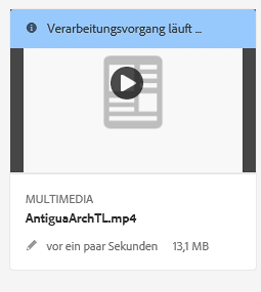

   * In der Listenansicht wird der Fortschritt der Videokodierung in der Spalte **[!UICONTROL Verarbeitungsstatus]** angezeigt. Bei einem Fehler wird die Nachricht in derselben Spalte angezeigt.

   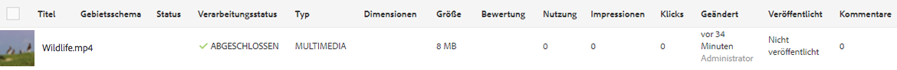

   Diese Spalte wird standardmäßig nicht angezeigt. Um die Spalte zu aktivieren, wählen Sie aus dem Dropdown-Menü **[!UICONTROL Anzeigeeinstellungen]** und fügen Sie die Spalte **[!UICONTROL Verarbeitungsstatus]** hinzu oder tippen bzw. klicken Sie auf **[!UICONTROL Aktualisieren]**.

   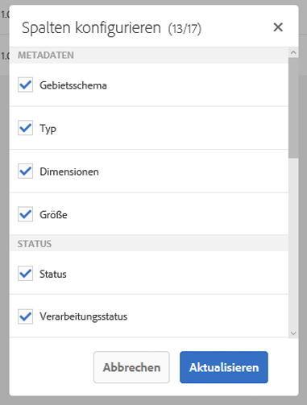

1. Fortschritt in den Asset-Details anzeigen. Wenn Sie auf ein Asset tippen oder klicken, öffnen Sie das Dropdown-Menü und wählen Sie die Option **[!UICONTROL Zeitleistensegment]**. Um die Ergebnisse auf Workflow-Aktivitäten wie Kodierung oder YouTube-Veröffentlichung zu begrenzen, wählen Sie **[!UICONTROL Workflows]**.

   

   Alle Workflow-Informationen, z. B. die Kodierung, werden in der Timeline angezeigt. Bei YouTube-Veröffentlichungen enthält die Workflow-Zeitleistensegment auch den Namen des YouTube-Kanals und die URL zum YouTube-Video. In der Workflow-Zeitleistensegment werden Sie nach der Veröffentlichung auch über eventuelle Fehler benachrichtigt.

   >[!NOTE]
   >
   >Die endgültige Aufzeichnung von Fehlschlag-/Fehlernachrichten kann länger dauern, da für **[!UICONTROL Wiederholungen]**, **[!UICONTROL Wiederholungsverzögerung]** und **[!UICONTROL Zeitüberschreitung]** unter [https://localhost:4502/system/console/configMgr](https://localhost:4502/system/console/configMgr) mehrere Workflow-Konfigurationen vorliegen, beispielsweise:
   >
   >    * Konfiguration der Warteschlange für Apache Sling-Aufträge
   >    * Handler für externe Prozessaufträge im Adobe Granite-Workflow
   >    * Granite-Workflow – Zeitlimit-Warteschlange

   >
   >In diesen Konfigurationen können Sie die Eigenschaften für **[!UICONTROL Wiederholungen]**, **[!UICONTROL Wiederholungsverzögerung]** und **[!UICONTROL Zeitüberschreitung]** anpassen.

1. Informationen zu gestarteten Workflows finden Sie anhand der Workflow-Instanzen unter **[!UICONTROL Tools]** > **[!UICONTROL Workflow]** > **[!UICONTROL Instanzen]**.

   >[!NOTE]
   >
   >Sie benötigen Administratorrechte, um auf das Menü **[!UICONTROL Tools]** zugreifen zu können.

   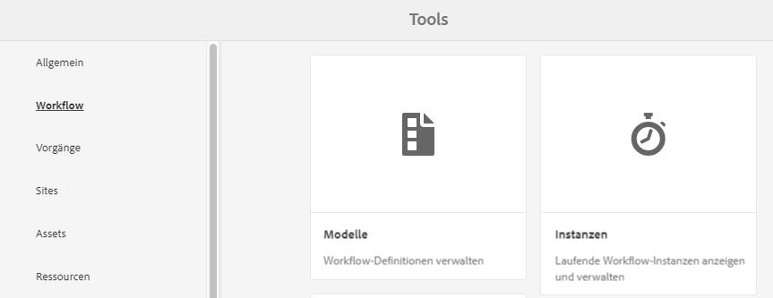

   Wählen Sie die Instanz aus und tippen Sie auf **[!UICONTROL Offener Verlauf]**.

   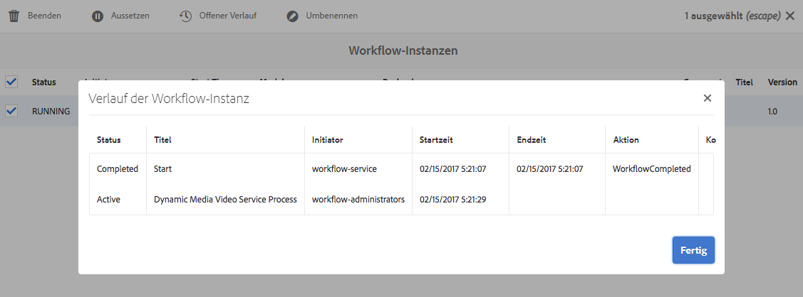

   Im Bereich „Workflow-Instanzen“ können Sie Workflows auch aussetzen, beenden oder umbenennen. Weitere Informationen finden Sie unter [Workflows verwalten](/help/sites-administering/workflows-administering.md).

1. Fehlgeschlagene Aufträge finden Sie unter „Workflowfehler“ unter **[!UICONTROL Tools]** > **[!UICONTROL Workflow]** > **[!UICONTROL Fehler]**. Unter **[!UICONTROL Workflowfehler]** werden alle fehlgeschlagenen Workflowaktivitäten aufgelistet.

   >[!NOTE]
   >
   >Sie benötigen Administratorrechte, um auf das Menü **[!UICONTROL Tools]** zugreifen zu können.

   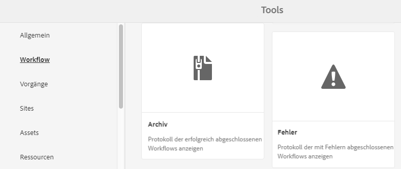

   >[!NOTE]
   >
   >Die endgültige Aufzeichnung von Fehlernachrichten kann länger dauern, da für **[!UICONTROL Wiederholungen]**, **[!UICONTROL Wiederholungsverzögerung]** und **[!UICONTROL Zeitüberschreitung]** unter [https://localhost:4502/system/console/configMgr](https://localhost:4502/system/console/configMgr) mehrere Workflow-Konfigurationen vorliegen, beispielsweise:
   >
   >
   >
   >    * Konfiguration der Warteschlange für Apache Sling-Aufträge
   >    * Handler für externe Prozessaufträge im Adobe Granite-Workflow
   >    * Granite-Workflow – Zeitlimit-Warteschlange

   >
   >
   >In diesen Konfigurationen können Sie die Eigenschaften für **[!UICONTROL Wiederholungen]**, **[!UICONTROL Wiederholungsverzögerung]** und **[!UICONTROL Zeitüberschreitung]** anpassen.

1. Informationen zu abgeschlossenen Workflows finden Sie im Workflow-Archiv, das unter **[!UICONTROL Tools]** > **[!UICONTROL Workflow]** > **[!UICONTROL Archiv]** zur Verfügung steht. Im **[!UICONTROL Workflow-Archiv]** sind alle abgeschlossenen Workflow-Aktivitäten aufgeführt.

   >[!NOTE]
   >
   >Sie benötigen Administratorrechte, um auf das Menü **[!UICONTROL Tools]** zugreifen zu können.

   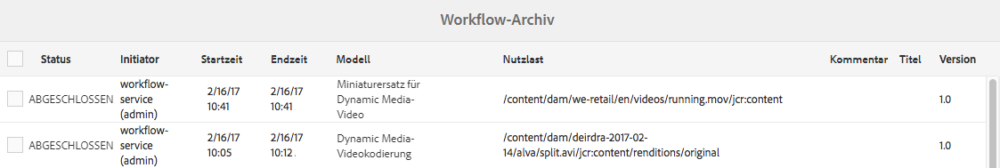

1. Sie erhalten E-Mail-Benachrichtigungen über abgebrochene oder fehlgeschlagene Workflow-Aufträge. Diese E-Mail-Benachrichtigungen können von einem Administrator konfiguriert werden. Siehe [E-Mail-Benachrichtigungen konfigurieren](#configuring-e-mail-notifications).

#### E-Mail-Benachrichtigungen konfigurieren {#configuring-e-mail-notifications}

>[!NOTE]
>
>Sie benötigen Administratorrechte, um auf das Menü **[!UICONTROL Tools]** zugreifen zu können.

Wie Sie Benachrichtigungen konfigurieren, hängt davon ab, ob Sie Benachrichtigungen für Kodierungs- oder YouTube-Veröffentlichungsaufträge benötigen:

* Für Kodierungsaufträge können Sie die Konfigurationsseite für alle E-Mail-Benachrichtigungen des Experience Manager-Workflows unter **[!UICONTROL Tools]** > **[!UICONTROL Vorgänge]** > **[!UICONTROL Web-Konsole]** aufrufen und nach **[!UICONTROL Day CQ Workflow Email Notification Service]** suchen. Siehe [E-Mail-Benachrichtigung in Experience Manager konfigurieren](/help/sites-administering/notification.md). Sie können die Kontrollkästchen für **[!UICONTROL Bei Abbruch benachrichtigen]** oder **[!UICONTROL Bei Abbruch benachrichtigen]** entsprechend aktivieren oder deaktivieren.

* Gehen Sie bei YouTube-Veröffentlichungsaufträgen wie folgt vor:

1. Tippen Sie in Experience Manager auf **[!UICONTROL Tools]** > **[!UICONTROL Workflow]** > **[!UICONTROL Modelle]**.
1. Wählen Sie auf der Seite „Workflow-Modelle“ die Option **[!UICONTROL Auf YouTube veröffentlichen]** und tippen Sie dann in der Symbolleiste auf **[!UICONTROL Bearbeiten]**.
1. Tippen Sie oben rechts auf der Workflow-Seite „Auf YouTube veröffentlichen“ auf **[!UICONTROL Bearbeiten]**.
1. Zeigen Sie mit der Maus auf die Komponente für den YouTube-Upload und tippen Sie einmal, um die Inline-Symbolleiste anzuzeigen.

   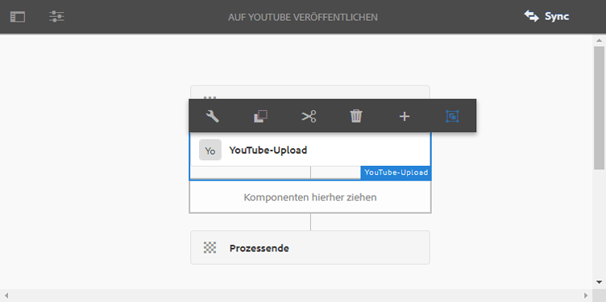

1. Tippen Sie auf der Inline-Symbolleiste auf das Konfigurationssymbol (Schraubschlüssel). Klicken Sie auf die Registerkarte **[!UICONTROL Argumente.]**

   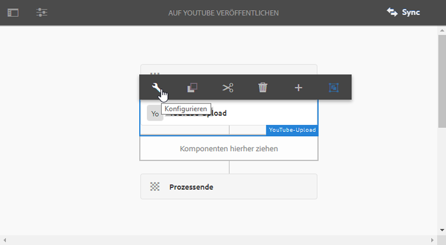

1. Tippen Sie im Dialogfeld „YouTube-Upload-Prozess – Schritteigenschaften“ auf die Registerkarte **[!UICONTROL Argumente]**.

   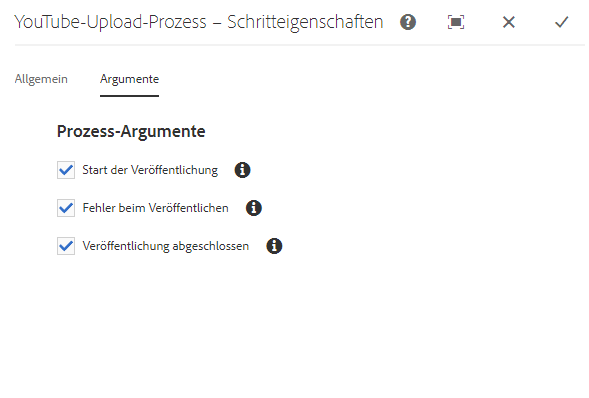

1. Sie können die folgenden Kontrollkästchen aktivieren bzw. deaktivieren:

   * Start der Veröffentlichung
   * Fehler beim Veröffentlichen
   * Veröffentlichung abgeschlossen: enthält Informationen über Kanäle und URLs

   Das Deaktivieren eines Kontrollkästchens bedeutet, dass Sie die angegebene E-Mail-Benachrichtigung nicht vom YouTube-Veröffentlichungs-Workflow erhalten.

   >[!NOTE]
   >
   >Diese E-Mails sind für YouTube spezifisch und eine Ergänzung der generischen Workflow-E-Mail-Benachrichtigungen. Daher können Sie je nach Konfigurationseinstellungen zwei Sätze von E-Mail-Benachrichtigungen erhalten: die allgemeine Benachrichtigung, die im **[!UICONTROL Day CQ Workflow Email Notification Service]** verfügbar ist, und eine speziell für YouTube.

1. Wenn Sie fertig sind, tippen Sie oben rechts im Dialogfeld auf das Symbol **[!UICONTROL Fertig]** (Häkchensymbol).
1. Tippen Sie auf der Workflow-Seite „Auf YouTube veröffentlichen“ auf **[!UICONTROL Synchronisieren]**.

## Anzeigen von Videoberichten {#viewing-video-reports}

>[!NOTE]
>
>Videoberichte sind nur verfügbar, wenn Sie Dynamic Media im Hybridmodus ausführen.

Videoberichte enthalten mehrere aggregierte Metriken für einen bestimmten Zeitraum, anhand derer Sie überwachen können, dass veröffentlichte individuelle und aggregierte Videos die erwartete Leistung zeigen. Die folgenden Top-Metrikdaten werden für alle veröffentlichten Videos auf der gesamten Website aggregiert:

* Videostarts
* Abschlussrate
* Durchschnittliche Zeit im Video
* Gesamtzeit im Video
* Videos pro Besuch

Eine Tabelle mit allen *veröffentlichten* Videos wird ebenfalls angezeigt, damit Sie die am häufigsten angezeigten Videos auf der Website basierend auf insgesamt gestarteten Videos verfolgen können.

Wenn Sie in der Liste auf einen Videonamen tippen, wird der Bericht zur Zielgruppentreue (Abbruch) in Form eines Liniendiagramms angezeigt. Das Diagramm enthält die Anzahl der Ansichten für jeden einzelnen Moment während der Videowiedergabe. Wenn Sie das Video wiedergeben, bewegt sich die vertikale Leiste synchron mit der Zeitanzeige im Player. Abfälle in den Liniendiagrammdaten geben an, wo die Zielgruppe das Video aus Desinteresse abbricht.

Wenn das Video außerhalb von Adobe Experience Manager für Dynamic Media kodiert wurde, sind das Diagramm zur Zielgruppentreue (Abbruch) und die Daten zur Wiedergabe in Prozent in der Tabelle nicht verfügbar.

Siehe auch [Dynamic Media-Cloud Services konfigurieren](/help/assets/config-dynamic.md).

>[!NOTE]
>
>Nachverfolgungs- und Berichtsdaten basierend ausschließlich auf der Nutzung des eigenen Video-Players und der zugehörigen Video-Player-Vorgabe von Dynamic Media. Daher können Sie keine Videos nachverfolgen und in Berichte aufnehmen, die mit anderen Video-Playern wiedergegeben werden.

Wenn Sie die Funktion „Videoberichte“ zum ersten Mal aufrufen, enthält der Bericht standardmäßig Videodaten für den Zeitraum vom ersten Tag des aktuellen Monats bis zum aktuellen Datum. Sie können den standardmäßigen Datumsbereich aber außer Kraft setzen, indem Sie Ihren eigenen Datumsbereich angeben. Wenn Sie „Videoberichte“ das nächste Mal aufrufen, wird der angegebene Datumsbereich verwendet.

Damit Videoberichte ordnungsgemäß funktionieren, wird automatisch eine Report Suite-ID erstellt, wenn Dynamic Media Cloud Services konfiguriert wurde. Gleichzeitig wird die Report Suite-ID an den Veröffentlichungs-Server übergeben, damit sie für die Funktion „URL kopieren“ bei der Asset-Vorschau verfügbar ist. Diese Funktion erfordert jedoch, dass der Veröffentlichungsserver bereits eingerichtet ist. Wenn der Veröffentlichungs-Server nicht eingerichtet ist, können Sie dennoch veröffentlichen, um den Videobericht anzuzeigen. Sie müssen jedoch zur Konfiguration von Dynamic Media Cloud zurückkehren und auf **[!UICONTROL OK]** tippen.

**So zeigen Sie Videoberichte an:**

1. Tippen Sie in der linken oberen Ecke von Experience Manager auf das Experience Manager-Logo und tippen Sie dann in der linken Leiste auf **[!UICONTROL Tools]** (Hammersymbol) > **[!UICONTROL Assets]** > **[!UICONTROL Videoberichte]**.
1. Führen Sie auf der Seite „Videoberichte“ eine der folgenden Aktionen aus:

   * Tippen Sie in der Nähe der oberen rechten Ecke auf das Symbol **Videobericht aktualisieren**.
Verwenden Sie die Option Aktualisieren nur, wenn das Enddatum des Berichts der aktuelle Tag ist. Dadurch wird sichergestellt, dass Sie das Video-Tracking sehen, das seit der letzten Ausführung des Berichts erfolgt ist.

   * Tippen Sie oben rechts auf das Symbol **Datumsauswahl**.
Geben Sie den Anfang und das Ende des Datumsbereichs an, für den Sie Videodaten anzeigen möchten, und tippen Sie dann auf **[!UICONTROL Bericht ausführen]**.

   Im Gruppenfeld „Top-Metriken“ werden verschiedene aggregierte Messungen für alle *veröffentlichten* Videos auf der Site angegeben.

1. Tippen Sie in der Tabelle mit den am häufigsten veröffentlichten Videos auf einen Videonamen, um das Video abzuspielen und den Bericht zur Zielgruppentreue (Abbruch) des Videos anzuzeigen.

### Anzeigen von Videoberichten basierend auf einem Video-Viewer, den Sie mit dem Dynamic Media HTML5 Viewer SDK erstellt haben {#viewing-video-reports-based-on-a-video-viewer-that-you-created-using-the-scene-hmtl-viewer-sdk}

Wenn Sie einen standardmäßig von Dynamic Media bereitgestellten Video-Viewer verwenden oder eine benutzerdefinierte Viewer-Vorgabe basierend auf einem vordefinierten Video-Viewer erstellt haben, sind keine zusätzlichen Schritte erforderlich, um Videoberichte anzuzeigen. Wenn Sie jedoch Ihren eigenen Video-Viewer basierend auf der HTML5 Viewer SDK-API erstellt haben, führen Sie die folgenden Schritte aus, um sicherzustellen, dass Ihr Video-Viewer Tracking-Ereignisse an Dynamic Media-Videoberichte sendet.

Verwenden Sie das [Adobe Dynamic Media Viewer Reference Guide](https://experienceleague.adobe.com/docs/dynamic-media-developer-resources.html?lang=de) und die [HTML5 Viewer SDK API](https://s7d1.scene7.com/s7sdk/3.10/docs/jsdoc/index.html) , um eigene Video-Viewer zu erstellen.

**So zeigen Sie Videoberichte basierend auf einem Video-Viewer an, den Sie mit dem Dynamic Media HTML5 Viewer SDK erstellt haben:**

1. Navigieren Sie zu einem veröffentlichten Video-Asset.
1. Wählen Sie links oben auf der Seite des Assets aus der Dropdown-Liste die Option **[!UICONTROL Viewer]** aus.
1. Wählen Sie eine Video-Viewer-Vorgabe aus und kopieren Sie den Integrations-Code.
1. Suchen Sie im Integrations-Code die folgende Zeile:

   `videoViewer.setParam("config2", "<value>");`

   Der Parameter `config2` aktiviert die Verfolgung in HTML5-Viewern. Er ist außerdem eine firmenspezifische Vorgabe, die die Konfigurationsinformationen für Videoberichte und kundenspezifische Adobe Analytics-Konfigurationen enthält.

   Den richtigen Wert für den Parameter „config2“ finden Sie sowohl im **[!UICONTROL Integrations-Code]** als auch in der Funktion **[!UICONTROL URL kopieren]**. Der in der URL des Befehls **[!UICONTROL URL kopieren]** zu suchende Parameter ist `&config2=<value>`. Der Wert lautet fast immer `companypreset`, kann aber in einigen Fällen auch `companypreset-1`, `companypreset-2` usw. lauten.

1. Fügen Sie im benutzerspezifischen Video-Viewer-Code „AppMeasurementBridge.jsp“ wie folgt zur Viewer-Seite hinzu:

   * Bestimmen Sie zunächst, ob Sie den Parameter `&preset` benötigen.

      Wenn der Parameter `config2` `companypreset` lautet, benötigen Sie *nicht* `&preset=parameter`.

      Wenn `config2` irgendeinen anderen Wert aufweist, setzen Sie den preset-Parameter auf denselben Wert wie den Parameter `config2`. Beispiel: Wenn `config2=companypreset-2` lautet, fügen Sie `&param2=companypreset-2` zur AppMeasurmentBridge.jsp-URL hinzu.

   * Fügen Sie dann das Skript „AppMeasurementBridge.jsp“ hinzu:

      `<script language="javascript" type="text/javascript" src="https://s7d1.scene7.com/s7viewers/AppMeasurementBridge.jsp?company=robindallas&preset=companypreset-2"></script>`

1. Erstellen Sie die TrackingManager-Komponente wie folgt:

   * Nachdem Sie `s7sdk.Util.init();` aufgerufen haben, erstellen Sie eine TrackingManager-Instanz, um Ereignisse zu verfolgen, indem Sie Folgendes hinzufügen:

      `var trackingManager = new s7sdk.TrackingManager();`

   * Verbinden Sie Komponenten mit TrackingManager, indem Sie Folgendes vornehmen:

      Fügen Sie in der Ereignisprozedur `s7sdk.Event.SDK_READY` TrackingManager die nachzuverfolgende Komponente an.

      Wenn die Komponente beispielsweise `videoPlayer` lautet, fügen Sie

      `trackingManager.attach(videoPlayer);`

      hinzu, um die Komponente an den TrackingManager anzuhängen. Verwenden Sie mehrere Tracking-Manager-Komponenten, um mehrere Viewer auf einer Seite zu verfolgen.

   * Erstellen Sie das Objekt „AppMeasurementBridge“, indem Sie Folgendes hinzufügen:

      ```
      var appMeasurementBridge = new AppMeasurementBridge(); appMeasurementBridge.setVideoPlayer(videoPlayer);
      ```

   * Fügen Sie die Nachverfolgungsfunktion hinzu, indem Sie Folgendes hinzufügen:

      ```
      trackingManager.setCallback(appMeasurementBridge.track, 
       appMeasurementBridge);
      ```
   Das appMeasurementBridge-Objekt verfügt über eine integrierte Verfolgungsfunktion. Sie können aber auch Ihre eigene Funktion bereitstellen, um mehrere Tracking-Systeme oder anderen Funktionen zu unterstützen.

<!--    For more information, see *Using the TrackingManager Component* in the *Scene7 HTML5 Viewer SDK User Guide* available for download from [Adobe Developer Connection](https://help.adobe.com/en_US/scene7/using/WSef8d5860223939e2-43dedf7012b792fc1d5-8000.html). -->

## Hinzufügen von Untertiteln oder Untertiteln zu Videos {#adding-captions-to-video}

Sorgen Sie dafür, dass Ihre Videos Märkte auf der ganzen Welt erreichen, indem Sie Untertitel zu einzelnen Videos oder adaptiven Videosets hinzufügen. Wenn Sie Untertitel hinzufügen, müssen Sie die Audiodaten nicht synchronisieren oder Muttersprachler damit beauftragen, Audio in einer anderen Sprache neu aufzuzeichnen. Das Video wird in der Sprache, in der es aufgenommen wurde, wiedergegeben. Fremdsprachliche Untertitel werden angezeigt, sodass auch Nutzer anderer Sprachen den Audioteil verstehen können.

Untertitel bieten zudem eine größere Barrierefreiheit, indem optional zuschaltbare Untertitel für Personen mit Hörbehinderung verwendet werden.

>[!NOTE]
>
>Der verwendete Video-Player muss die Anzeige von Untertiteln unterstützen.

Dynamic Media konvertiert Untertiteldateien in das JSON-Format (JavaScript Object Notation). Diese Konvertierung bedeutet, dass Sie den JSON-Text als verborgenes, aber vollständiges Transkript des Videos einfügen können. Suchmaschinen können dann den Inhalt durchsuchen und indizieren, damit Kunden die Videos leichter finden können und zusätzliche Details zum Videoinhalt erhalten.

Weitere Informationen zur Verwendung der JSON-Funktion in einer URL finden Sie unter [Serve static (non-image) contents](https://experienceleague.adobe.com/docs/dynamic-media-developer-resources/image-serving-api/image-serving-api/c-serving-static-nonimage-contents.html?lang=de#image-serving-api) in der *Dynamic Media Image Serving and Rendering API Help* .

**So fügen Sie einem Video Untertitel hinzu:**

1. Verwenden Sie ein Drittanbieterprogramm bzw. einen Service, um Ihre Untertiteldatei für ein Video zu erstellen.

   Stellen Sie sicher, dass die erstellte Datei dem WebVTT-Standard (Web Video Text Tracks) entspricht. Die Erweiterung der Untertiteldatei lautet .vtt. Weitere Informationen zum WebVTT-Untertitelstandard erhalten Sie auf der folgenden Seite.

   Siehe [WebVTT: The Web Video Text Tracks format](https://w3c.github.io/webvtt/).

   Es gibt sowohl kostenlose als auch Premium-Tools und -Services, die Sie verwenden können, um Untertiteldateien außerhalb von Dynamic Media zu erstellen. Um beispielsweise eine Videountertiteldatei ohne Stile zu erstellen, können Sie das folgende kostenlose Online-Tool für die Erstellung und Bearbeitung von Untertiteln verwenden:

   [WebVTT Caption Maker](https://testdrive-archive.azurewebsites.net/Graphics/CaptionMaker/Default.html)

   Für optimale Ergebnisse verwenden Sie das Tool in Internet Explorer 9 oder höher, Google Chrome oder Safari.

   Fügen Sie im Tool im Feld **[!UICONTROL URL der Videodatei eingeben]** die kopierte URL Ihrer Videodatei ein und klicken Sie dann auf **[!UICONTROL Laden]**. Siehe [Erhalten Sie eine URL für ein Asset](/help/assets/linking-urls-to-yourwebapplication.md#obtaining-a-url-for-an-asset), um die URL zur Videodatei selbst abzurufen, die Sie dann in das Feld **[!UICONTROL URL der Videodatei eingeben]** einfügen können. Internet Explorer, Chrome oder Safari können das Video dann nativ wiedergeben.

   Folgen Sie jetzt auf der Website den Anweisungen auf dem Bildschirm, um Ihre WebVTT-Datei zu erstellen und zu speichern. Wenn Sie fertig sind, kopieren Sie den Inhalt der Untertiteldatei und fügen Sie ihn in einen Texteditor ein. Speichern Sie ihn dann mit der Dateinamenerweiterung `.vtt`.

   >[!NOTE]
   >
   >Für globale Unterstützung von Videountertiteln in verschiedenen Sprachen ist zu beachten, dass der WebVTT-Standard separate .vtt-Dateien und Abrufe für jede Sprache benötigt, die Sie unterstützen möchten.

   Im Allgemeinen möchten Sie die VTT-Untertiteldatei mit demselben Namen wie die Videodatei benennen und sie mit dem Sprachgebietsschema wie -EN, -FR oder -DE anhängen. Dies kann Ihnen helfen, die Generierung von Video-URLs mit Ihrem vorhandenen Web-Content-Management-System zu automatisieren.

1. Laden Sie in Experience Manager Ihre WebVTT-Untertiteldatei in das DAM hoch.
1. Navigieren Sie zum *veröffentlichten* Video-Asset, das Sie mit der hochgeladenen Untertiteldatei verbinden möchten.

   Denken Sie daran, dass URLs erst kopiert werden können, *nachdem* Sie die Assets *veröffentlicht* haben.

   Siehe [Veröffentlichen von Assets](/help/assets/publishing-dynamicmedia-assets.md).

1. Führen Sie einen der folgenden Schritte aus:

   * Zur Wiedergabe des Videos in einem Popup-Fenstertippen Sie auf **[!UICONTROL URL]**. Wählen Sie im Dialogfeld „URL“ die URL aus, kopieren Sie sie in die Zwischenablage und fügen Sie sie dann in einen einfachen Texteditor ein. Hängen Sie die kopierte URL des Videos mit der folgenden Syntax an:

      `&caption=<server_path>/is/content/<path_to_caption.vtt_file,1>`

      Notieren Sie den Wert `,1` am Ende des Untertitelpfads. Unmittelbar nach der Dateinamenerweiterung `.vtt` im Pfad können Sie die Untertitelschaltfläche auf der Video-Player-Leiste optional aktivieren (einschalten) oder deaktivieren (deaktivieren), indem Sie die Einstellung auf `,1` bzw. `,0` festlegen.

   * Um das Video in einem eingebetteten Viewer anzuzeigen, tippen Sie auf **[!UICONTROL Einbettungs-Code]**. Wählen Sie im Dialogfeld „Einbettungs-Code“ den Einbettungs-Code aus, kopieren Sie den Code in die Zwischenablage und fügen Sie ihn dann in einen einfachen Texteditor ein. Hängen Sie den kopierten Einbettungs-Code mit der folgenden Syntax an:

      `videoViewer.setParam("caption","<path_to_caption.vtt_file,1>");`

      Notieren Sie den Wert `,1` am Ende des Untertitelpfads. Unmittelbar nach der Dateinamenerweiterung `.vtt` im Pfad können Sie die Untertitelschaltfläche auf der Video-Player-Leiste optional aktivieren (einschalten) oder deaktivieren (deaktivieren), indem Sie die Einstellung auf `,1` bzw. `,0` festlegen.

## Hinzufügen von Kapitelmarken zu Videos {#adding-chapter-markers-to-video}

Um das Ansehen von und Navigieren in langformatigen Videos zu vereinfachen, können Sie einzelnen Videos oder adaptiven Videosets Kapitelmarken hinzufügen. Wenn ein Benutzer das Video abspielt, kann er auf die Kapitelmarken in der Video-Timeline (auch als Video-Scrubber bezeichnet) klicken, um einfach zu seinem Zielpunkt zu navigieren. Oder sie können sofort zu neuen Inhalten, Demonstrationen und Tutorials springen.

>[!NOTE]
>
>Der verwendete Video-Player muss die Verwendung von Kapitelmarken unterstützen. Dynamic Media-Video-Player unterstützten Kapitelmarken, Video-Player von Drittanbietern jedoch möglicherweise nicht.

Anstelle der Video-Viewer-Vorgabe können Sie gegebenenfalls einen eigenen benutzerdefinierten Video-Viewer mit Kapiteln erstellen und mit Ihrer Marke versehen. Anweisungen zum Erstellen eines eigenen HTML5-Viewers mit Kapitelnavigation finden Sie in der Adobe HTML5 Viewer SDK API unter der Überschrift &quot;Anpassen von Verhaltensweisen mit Modifikatoren&quot;unter den Klassen `s7sdk.video.VideoPlayer` und `s7sdk.video.VideoScrubber`. Weitere Informationen finden Sie in der Dokumentation [HTML5 Viewer SDK API](https://s7d1.scene7.com/s7sdk/3.10/docs/jsdoc/index.html) .

<!-- If desired, you can create and brand your own custom video viewer with chapters instead of using a video viewer preset. For instructions on creating your own HTML5 viewer with chapter navigation, in the Adobe Scene7 Viewer SDK for HTML5 guide, reference the heading “Customizing Behavior Using Modifiers” under the classes `s7sdk.video.VideoPlayer` and `s7sdk.video.VideoScrubber`. The Adobe Scene7 Viewer SDK is available as a download from [Adobe Developer Connection](https://help.adobe.com/en_US/scene7/using/WSef8d5860223939e2-43dedf7012b792fc1d5-8000.html). -->

Die Kapitelliste für Videos wird auf die gleiche Weise erstellt wie Untertitel. Das heißt, Sie erstellen eine WebVTT-Datei. Beachten Sie jedoch, dass diese Datei getrennt von jeder WebVTT-Untertiteldatei sein muss, die Sie auch verwenden. Sie können Untertitel und Kapitel nicht in einer WebVTT-Datei kombinieren.

Orientieren Sie sich bei der Erstellung einer WebVTT-Datei mit Kapitelnavigation am Format des folgenden Beispiels:

### WebVTT-Datei mit Videokapitelnavigation {#webvtt-file-with-video-chapter-navigation}

```xml
WEBVTT
Chapter 1
00:00.000 --> 01:04.364
The bicycle store behind it all.
Chapter 2
01:04.364 --> 02:00.944
Creative Cloud.
Chapter 3
02:00.944 --> 03:02.937
Ease of management for a working solution.
Chapter 4
03:02.937 --> 03:35.000
Cost-efficient access to rapidly evolving technology.
```

Im obigen Beispiel ist `Chapter 1` der Cue-Point-Bezeichner. Diese Angabe ist optional. Die Cue-Point-Zeit `00:00:000 --> 01:04:364` gibt die Start- und Endzeit des Kapitels im Format `00:00:000` an. Die letzten drei Ziffern geben die Millisekunden an und können bei `000` belassen werden. Der Kapiteltitel `The bicycle store behind it all` ist die tatsächliche Beschreibung des Kapitelinhalts. Die Cue-Point-ID, die Cue-Point-Zeit und der Kapiteltitel werden in einem Video-Player-Popup angezeigt, wenn ein Benutzer den Mauszeiger über einen visuellen Cue-Point in der Timeline des Videos bewegt.

Da Sie einen HTML5-Video-Viewer verwenden, stellen Sie sicher, dass die erstellte Kapiteldatei dem WebVTT (Web Video Text Tracks)-Standard entspricht. Die Erweiterung des Kapiteldateinamens lautet `.vtt`. Weitere Informationen zum WebVTT-Untertitelstandard erhalten Sie auf der folgenden Seite.

Siehe [WebVTT: The Web Video Text Tracks format](https://w3c.github.io/webvtt/)

**So fügen Sie die Videokapitelnavigation hinzu:**

1. Speichern Sie die Datei `.vtt` in der UTF8-Kodierung, um Probleme mit der Zeichendarstellung im Text des Kapiteltitels zu vermeiden.

   Grundsätzlich sollte die Kapitel-VTT-Datei denselben Namen haben wie die Videodatei und über den Dateinamenanhang „chapters“ verfügen. Dies kann Ihnen helfen, die Generierung von Video-URLs mit Ihrem vorhandenen Web-Content-Management-System zu automatisieren.
1. Laden Sie die WebVTT-Kapiteldatei in Experience Manager hoch.

   Siehe [Hochladen von Assets](/help/assets/manage-assets.md#uploading-assets).

1. Führen Sie einen der folgenden Schritte aus:

   <table>
     <tbody>
      <tr>
       <td>Zur Wiedergabe des Videos in einem Popup-Fenster</td>
       <td>
       <ol>
       <li>Navigieren Sie zum <i>veröffentlichten</i> Video-Asset, das Sie mit der hochgeladenen Kapiteldatei verbinden möchten. Denken Sie daran, dass URLs erst kopiert werden können, <i>nachdem</i> Sie die Assets <i>veröffentlicht</i> haben. Siehe <a href="/help/assets/publishing-dynamicmedia-assets.md">Veröffentlichen von Assets</a>.</li>
       <li>Klicken oder tippen Sie im Dropdown-Menü auf <strong>Viewer</strong>.</li>
       <li>Tippen oder klicken Sie in der linken Leiste auf den Namen der Video-Viewer-Vorgabe. Auf einer separaten Seite wird eine Vorschau des Videos geöffnet.</li>
       <li>Klicken Sie in der linken Leiste unten auf <strong>URL</strong>.</li>
       <li>Wählen Sie im Dialogfeld „URL“ die URL aus, kopieren Sie sie in die Zwischenablage und fügen Sie sie dann in einen einfachen Texteditor ein.</li>
       <li>Hängen Sie die kopierte URL des Videos mit der folgenden Syntax an, um sie mit der kopierten URL Ihrer Kapiteldatei zu verknüpfen:<br /> <br /> <code>&navigation=<<i>full_copied_URL_path_to_chapter_file</i>.vtt></code><br /> </li>
       </ol> </td>
      </tr>
      <tr>
       <td>Für ein Erlebnis mit eingebettetem Video-Viewer<br /> </td>
       <td>
       <ol>
       <li>Navigieren Sie zum <i>veröffentlichten</i> Video-Asset, das Sie mit der hochgeladenen Kapiteldatei verbinden möchten. Denken Sie daran, dass URLs erst kopiert werden können, <i>nachdem</i> Sie die Assets <i>veröffentlicht</i> haben. Siehe <a href="/help/assets/publishing-dynamicmedia-assets.md">Veröffentlichen von Assets</a>.</li>
       <li>Klicken oder tippen Sie im Dropdown-Menü auf <strong>Viewer</strong>.</li>
       <li>Tippen oder klicken Sie in der linken Leiste auf den Namen der Video-Viewer-Vorgabe. Auf einer separaten Seite wird eine Vorschau des Videos geöffnet.</li>
       <li>Klicken Sie im unteren Bereich der linken Leiste auf <strong>Einbetten</strong>.</li>
       <li>Wählen Sie im Dialogfeld „Einbettungs-Code“ den Einbettungs-Code aus, kopieren Sie den gesamten Code in die Zwischenablage und fügen Sie ihn dann in einen einfachen Texteditor ein.</li>
       <li>Hängen Sie den Einbettungs-Code des Videos mit der folgenden Syntax an, um ihn mittels der kopierten URL mit Ihrer Kapiteldatei zu verknüpfen:<br /> <br /> <code>videoViewer.setParam("navigation","&lt;<i>full_copied_URL_path_to_chapter_file</i>.vtt&gt;"</code></li>
       </ol> </td>
      </tr>
     </tbody>
   </table>

## Informationen zu Videominiaturen im Modus Dynamic Media - Scene7 {#about-video-thumbnails-in-dynamic-media-scene-mode}

Eine Videominiatur ist eine verkleinerte Version eines Videoframes oder eines Bild-Assets, in dem das Video dem Kunden vorgestellt wird. Die Miniaturansicht dient dazu, einen Kunden dazu anzuregen, auf das Video zu klicken.

Alle Videos in Experience Manager müssen über eine zugehörige Miniaturansicht verfügen. Sie können eine Miniaturansicht nicht löschen, ohne sie zu ersetzen. Standardmäßig wird beim Hochladen eines Videos in Experience Manager der erste Frame als Miniaturansicht verwendet. Sie können jedoch die Miniaturansicht anpassen, z. B. für Branding oder visuelle Suche. Wenn Sie eine Videominiatur anpassen, können Sie das Video abspielen und den Frame anhalten, den Sie verwenden möchten. Alternativ können Sie ein Bild-Asset, das Sie bereits hochgeladen haben, und *publish* in Ihrem Digital Asset Manager auswählen.

Ein benutzerdefiniertes Videominiaturbild, das Sie aus einem Video auswählen, wird nicht extrahiert und im DAM als separates und eigenständiges Asset gespeichert. Benutzerdefinierte Videominiaturen, die Sie aus vorhandenen Bild-Assets auswählen, werden hingegen im JCR gespeichert. Der Pfad der ausgewählten Assets wird wie im folgenden Beispiel im Knoten des Video-Assets gespeichert:

`/content/dam/*<folder_name*>/<*video_name*>/jcr:content/manualThumbnail`

Sie können eine Videominiatur erst anpassen, nachdem Sie auf den Ordner, in dem sich das Video befindet, ein Videoprofil angewendet haben.

Weitere Informationen finden Sie im Abschnitt [Informationen zu Videominiaturen im Hybridmodus von Dynamic Media](#about-video-thumbnails-in-dynamic-media-hybrid-mode).

### Hinzufügen einer benutzerdefinierten Videominiatur {#adding-a-custom-video-thumbnail}

Die folgenden Schritte gelten nur, wenn Dynamic Media im Scene7-Modus ausgeführt wird.

**So fügen Sie eine benutzerdefinierte Videominiatur hinzu:**

1. Stellen Sie sicher, dass Sie bereits …

   * einen Ordner für Ihre Video-Assets erstellt,
   * [Anwenden eines Videoprofils auf den Ordner](/help/assets/video-profiles.md#applying-a-video-profile-to-folders).

   * [Ihre Videos in den Ordner hochgeladen haben](/help/assets/managing-video-assets.md#upload-and-preview-video-assets).

1. Navigieren Sie zu einem hochgeladenen Video-Asset, dessen Miniaturbild Sie ändern möchten.
1. Tippen Sie im Asset-Auswahlmodus in der **[!UICONTROL Listen-]** oder **[!UICONTROL Kartenansicht]** auf das Video-Asset.
1. Tippen Sie in der Symbolleiste auf das Symbol **[!UICONTROL Eigenschaften]** (ein Kreis mit einem darin enthaltenen „i“).
1. Tippen Sie auf der Seite „Eigenschaften“ des Videos auf **[!UICONTROL Miniatur ändern]**.
1. Führen Sie auf der Seite „Miniatur ändern“ eine der folgenden Aktionen aus:

   * Wenn Sie einen Frame aus dem Video als neue Miniatur verwenden möchten:

      * Tippen Sie in der Symbolleiste auf **[!UICONTROL Frame aus Video auswählen]**.
      * Tippen Sie auf die Schaltfläche „Abspielen“ und dann auf die Schaltfläche „Pause“, wenn Sie den Frame gefunden haben, den Sie als neue Miniaturansicht des Videos verwenden möchten.
   * Wenn Sie ein Bild-Asset als neue Miniatur verwenden möchten:

      * Tippen Sie in der Symbolleiste auf **[!UICONTROL Miniatur aus Assets wählen]**.
      * Tippen Sie auf **[!UICONTROL Miniatur auswählen]**.
      * Navigieren Sie zu einem zuvor hochgeladenen und veröffentlichten Bild-Asset, das Sie verwenden möchten. Die Größe des Assets wird automatisch geändert, um als Miniaturbild für das Video zu dienen.
      * Wählen Sie das Bild-Asset aus und tippen Sie dann auf **[!UICONTROL Auswählen]**.


1. Tippen Sie auf der Seite „Miniatur ändern“ auf **[!UICONTROL Änderung speichern]**.
1. Klicken Sie oben rechts auf der Seite mit den Videoeigenschaften auf **[!UICONTROL Speichern und schließen]**.

## Informationen zu Videominiaturen im Hybridmodus von Dynamic Media {#about-video-thumbnails-in-dynamic-media-hybrid-mode}

Wählen Sie eine von zehn automatisch von Dynamic Media erstellten Miniaturansichten, die Ihrem Video hinzugefügt werden sollen. Der Videoplayer zeigt die ausgewählte Miniaturansicht an, wenn ein Video-Asset mit der Dynamic Media-Komponente in der Authoring-Umgebung von Experience Manager Sites, Experience Manager Mobile oder Experience Manager Screens verwendet wird. Die Miniaturansicht dient als statisches Bild, das den Inhalt des gesamten Videos repräsentiert und Benutzer dazu anregt, auf die Wiedergabe-Schaltfläche zu klicken.

Basierend auf der Gesamtdauer des Videos erfasst Dynamic Media zehn (standardmäßige) Miniaturansichten. Die Bilder werden bei 1 %, 11 %, 21 %, 31 %, 41 %, 51 %, 61 %, 71 %, 81 % und 91 % im Video erfasst. Die zehn Miniaturansichten bleiben erhalten, sodass Sie die Serie nicht neu generieren müssen, falls Sie zu einem späteren Zeitpunkt eine andere Miniaturansicht auswählen. Sie sehen die zehn Miniaturen in der Vorschau an und wählen jene aus, die Sie mit Ihrem Video verwenden möchten. Wenn Sie die Standardeinstellung ändern möchten, können Sie mit CRXDE Lite das Zeitintervall konfigurieren, in dem Miniaturansichten generiert werden. Beispiel: Sie möchten eine Serie aus nur vier Miniaturansichten mit gleichem Abstand aus Ihrem Video generieren. Dafür konfigurieren Sie das Zeitintervall bei 24 %, 49 %, 74 % und 99 %.

Im Idealfall können Sie Video-Miniaturansichten jederzeit zwischen dem Hochladen und dem Veröffentlichen des Videos auf Ihrer Website hinzufügen.

Sie haben auch die Möglichkeit, statt einer von Dynamic Media generierten Miniaturansicht eine benutzerdefinierte Miniaturansicht hochzuladen, die Ihr Video repräsentiert. Sie können beispielsweise eine benutzerdefinierte Miniaturansicht erstellen, die den Titel Ihres Videos, ein auffälliges öffnendes Bild oder ein bestimmtes aus Ihrem Video erfasstes Bild aufweist. Das benutzerdefinierte Videominiaturbild, das Sie hochladen, muss eine maximale Auflösung von 1280 x 720 Pixel (Mindestbreite von 640 Pixel) und nicht größer als 2 MB sein.

Weitere Informationen finden Sie im Abschnitt [Informationen zu Videominiaturen im Scene7-Modus von Dynamic Media](/help/assets/video.md#about-video-thumbnails-in-dynamic-media-scene-mode).

### Videominiatur hinzufügen {#adding-a-video-thumbnail}

Die folgenden Schritte gelten nur, wenn Dynamic Media im Hybridmodus ausgeführt wird.

**So fügen Sie eine Videominiatur hinzu:**

1. Navigieren Sie zu einem hochgeladenen Video-Asset, dem Sie eine Videominiatur hinzufügen möchten.
1. Tippen Sie im Asset-Auswahlmodus entweder in der Listen- oder in der Kartenansicht auf das Video-Asset.
1. Tippen Sie in der Symbolleiste auf das Symbol **[!UICONTROL Eigenschaften anzeigen]** (ein Kreis mit einem darin enthaltenen „i“).
1. Tippen Sie auf der Seite „Eigenschaften“ des Videos auf **[!UICONTROL Miniatur ändern]**.
1. Tippen Sie auf der Seite „Miniatur ändern“ auf der Symbolleiste auf **[!UICONTROL Frame auswählen]**.

   Dynamic Media generiert eine Reihe von Miniaturbildern aus Ihrem Video, basierend auf dem von Ihnen angepassten Standardzeitintervall oder -intervall.

1. Zeigen Sie die generierten Miniaturansichten in einer Vorschau an und wählen Sie jene aus, die Sie Ihrem Video hinzufügen möchten.
1. Tippen Sie auf **[!UICONTROL Änderungen speichern]**.

   Die Miniaturansicht des Videos wird aktualisiert. Die ausgewählte Miniaturansicht wird verwendet. Wenn Sie die Miniaturansicht zu einem späteren Zeitpunkt wieder ändern möchten, kehren Sie zur Seite **[!UICONTROL Miniatur ändern]** zurück und wählen Sie eine neue Miniaturansicht aus.

   Wenn Sie neue Standardzeitintervalle konfiguriert haben oder ein neues Video hochgeladen haben, um das vorhandene Video zu ersetzen, lassen Sie Dynamic Media die Miniaturansichten neu generieren.

   Siehe [Konfigurieren Sie das standardmäßige Zeitintervall, in dem Videominiaturen generiert werden](#configuring-the-default-time-interval-that-video-thumbnails-are-generated).

#### Konfigurieren des Standardzeitintervalls für die Generierung von Videominiaturen {#configuring-the-default-time-interval-that-video-thumbnails-are-generated}

Wenn Sie das neue Standardzeitintervall konfigurieren und speichern, wird Ihre Änderung automatisch nur auf Videos angewendet, die Sie in Zukunft hochladen. Sie wird nicht automatisch auf die Videos angewendet, die Sie zuvor hochgeladen haben. Für die vorhandenen Videos müssen Sie die Miniaturansichten neu generieren.

Siehe [Videominiatur hinzufügen](#adding-a-video-thumbnail).

**So konfigurieren Sie das standardmäßige Zeitintervall, in dem Videominiaturen generiert werden:**

1. Tippen Sie in Experience Manager auf **[!UICONTROL Tools]** > **[!UICONTROL Allgemein]** > **[!UICONTROL CRXDE Lite]**.

1. Navigieren Sie auf der Seite &quot;CRXDE Lite&quot;im Verzeichnisbereich auf der linken Seite zu `o etc/dam/imageserver/configuration/jcr:content/settings.`

   Wenn das Ordnerbedienfeld nicht sichtbar ist, tippen Sie links neben der Registerkarte Startseite auf das Symbol >> .

1. Tippen Sie im rechten unteren Rand der Registerkarte „Eigenschaften“ zweimal auf `thumbnailtime`.
1. Verwenden Sie im Dialogfeld **[!UICONTROL Miniaturansicht bearbeiten]** die Textfelder, um Intervallwerte als Prozentwerte einzugeben.

   * Tippen Sie auf das Pluszeichen (+), wenn Sie ein oder mehrere Intervallwertfelder hinzufügen möchten. Scrollen Sie bei Bedarf zum unteren Rand des Dialogfelds, um das Symbol anzuzeigen.
   * Tippen Sie auf das Minuszeichen (-) rechts neben einem Intervallwertfeld, wenn Sie es aus der Liste löschen möchten.
   * Tippen Sie auf das Symbol mit dem Nach-oben-Pfeil und das Symbol mit dem Nach-unten-Pfeil, wenn Sie die Intervallwerte neu anordnen möchten.

1. Tippen Sie auf **[!UICONTROL OK]** und kehren Sie zur Registerkarte Eigenschaften zurück.
1. Tippen Sie oben links auf der Seite &quot;CRXDE Lite&quot;auf **[!UICONTROL Alle speichern]** und tippen Sie dann auf das Symbol &quot;Zurück zur Startseite&quot;oben links, um zum Experience Manager zurückzukehren.

   Siehe [Videominiatur hinzufügen](#adding-a-video-thumbnail).

### Hinzufügen einer benutzerdefinierten Videominiatur {#adding-a-custom-video-thumbnail-1}

Die folgenden Schritte gelten nur, wenn Dynamic Media im Hybridmodus ausgeführt wird.

**So fügen Sie eine benutzerdefinierte Videominiatur hinzu:**

1. Navigieren Sie zu einem hochgeladenen Video-Asset, dem Sie eine benutzerdefinierte Videominiatur hinzufügen möchten.
1. Tippen Sie im Asset-Auswahlmodus entweder in der Listen- oder in der Kartenansicht auf das Video-Asset.
1. Tippen Sie in der Symbolleiste auf das Symbol **[!UICONTROL Eigenschaften anzeigen]** (ein Kreis mit einem darin enthaltenen „i“).
1. Tippen Sie auf der Seite „Eigenschaften“ des Videos auf **[!UICONTROL Miniatur ändern]**.
1. Tippen Sie auf der Seite „Miniatur ändern“ auf der Symbolleiste auf **[!UICONTROL Neue Miniatur hochladen]**.
1. Navigieren Sie zu einem Miniaturbild, das Sie verwenden möchten, wählen Sie es aus und tippen Sie dann auf **[!UICONTROL Öffnen]** , um mit dem Hochladen des Bildes in Experience Manager zu beginnen. Denken Sie nach dem Hochladen daran, das Bild zu veröffentlichen.
1. Tippen Sie nach dem Hochladen und Veröffentlichen des Bildes auf der Seite „Miniatur ändern“ auf **[!UICONTROL Änderungen speichern]**.

   Die benutzerdefinierte Miniaturansicht wird Ihrem Video hinzugefügt. 
