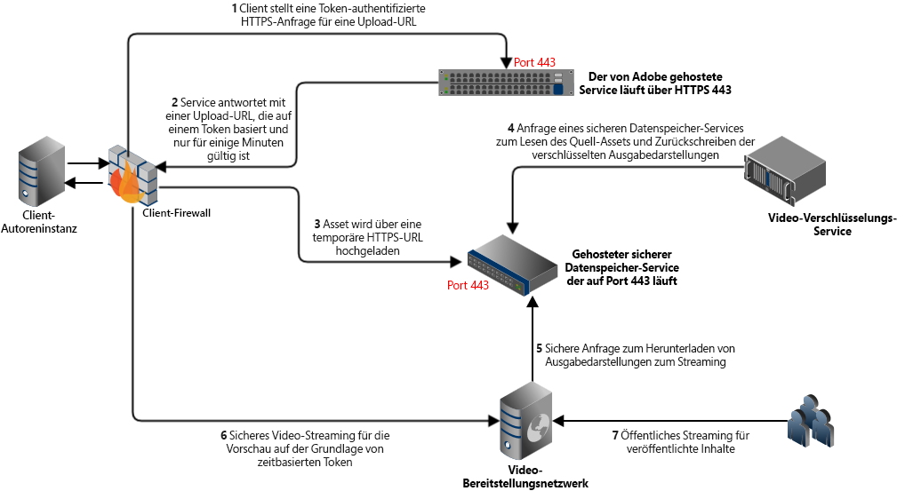

# Video in Dynamic Media {#video}

In diesem Abschnitt wird die Arbeit mit Videos in Dynamic Media beschrieben.

## Schnellstartanleitungen: Videos {#quick-start-videos}

Die folgende schrittweise Workflow-Beschreibung soll Ihnen den schnellen Einstieg in adaptive Videosets in Dynamic Media erleichtern. Nach jedem Schritt finden Sie Querverweise auf Themenüberschriften, unter denen Sie weitere Informationen erhalten.

>[!IMPORTANT]
>
>Stellen Sie vor dem Arbeiten mit Videos in Dynamic Media sicher, dass Ihre bzw. Ihr Adobe Experience Manager-Admin Dynamic Media Cloud Services bereits im Dynamic Media-Scene7-Modus oder im Dynamic Media- Hybridmodus aktiviert und konfiguriert hat.
>
>* Siehe [Konfiguration von Dynamic Media Cloud Services](/help/assets/config-dms7.md#configuring-dynamic-media-cloud-services) in „Konfigurieren des Dynamic Media-Scene7-Modus“ und [Fehlerbehebung im Dynamic Media-Scene7-Modus](/help/assets/troubleshoot-dms7.md).
>
>* Siehe [Konfigurieren von Dynamic Media-Cloud-Services](/help/assets/config-dynamic.md#configuring-dynamic-media-cloud-services) unter „Konfigurieren des Dynamic Media-Hybridmodus“.
>
>Derzeit bekanntes Problem bei der Videowiedergabe in Dynamic Media *nur in Experience Manager 6.5.9.0*:
>
>* Wenn ein veröffentlichtes Video aktualisiert wird, muss es erneut veröffentlicht werden, um Änderungen beim Versand widerzuspiegeln.
>


1. **Konfigurieren Sie Videos in Dynamic Media** anhand der folgenden Schritte:

   * Erstellen Sie ein eigenes Videokodierungsprofil. Alternativ Sie können einfach das vordefinierte Profil für _adaptive Videoverschlüsselung_ verwenden, das mit Dynamic Media geliefert wird.

      * [Erstellen eines Videokodierungsprofils](/help/assets/video-profiles.md#creating-a-video-encoding-profile-for-adaptive-streaming)
      * Erfahren Sie mehr über die [Best Practices für Videokodierung](#best-practices-for-encoding-videos).
   * Verknüpfen Sie das Videoverarbeitungsprofil mit den Ordnern, in die Sie die Primärvideos hochladen.

      * [Anwenden eines Videoprofils auf Ordner](/help/assets/video-profiles.md#applying-a-video-profile-to-folders).
      * Erfahren Sie mehr über die [Best Practices für die Organisation Ihrer digitalen Assets zur Verwendung von Verarbeitungsprofilen](/help/assets/organize-assets.md).
      * Weitere Informationen zum [Organisieren digitaler Assets](/help/assets/organize-assets.md)
   * Laden Sie die Primärvideos in die Ordner hoch. Wenn Sie dem Ordner Videos hinzufügen, werden diese gemäß dem diesem Ordner zugewiesenen Videoverarbeitungsprofil kodiert.

      * Dynamic Media unterstützt hauptsächlich Kurzvideos mit einer maximalen Länge von 30 Minuten und einer Mindestauflösung von 25 x 25.
      * Sie können Videodateien mit bis zu 15 GB pro Datei hochladen.
      * [Videos hochladen](/help/assets/managing-video-assets.md#upload-and-preview-video-assets)
      * Weitere Informationen zu [Unterstützten Eingabedateiformaten](/help/assets/assets-formats.md#supported-multimedia-formats)
   * [Fortschritt der Videokodierung](#monitoring-video-encoding-and-youtube-publishing-progress) in der Asset- oder Workflow-Ansicht überwachen


1. **Verwalten Sie die Videos in Dynamic Media** anhand der folgenden Schritte:

   * Video-Assets organisieren und durchsuchen

      * [Digitale Assets organisieren](/help/assets/organize-assets.md)
Weitere Informationen zu [Best Practices für die Organisation Ihrer digitalen Assets zur Verwendung von Verarbeitungsprofilen](organize-assets.md)

      * [Nach Video-Assets suchen](search-assets.md#custompredicates) oder [Assets suchen](/help/assets/search-assets.md)
   * Video-Assets vorab anzeigen und veröffentlichen

      * Zeigen Sie das Quellvideo und die kodierten Ausgabedarstellungen des Videos zusammen mit den zugehörigen Miniaturen an:
         [Vorschau von Videos anzeigen](managing-video-assets.md#upload-and-preview-video-assets) oder [Vorschau von Assets anzeigen](previewing-assets.md)
         [Videoausgabedarstellungen anzeigen](video-renditions.md)
         [Verwalten von Videoausgabedarstellungen](manage-assets.md#managing-renditions)

      * [Verwalten von Viewer-Vorgaben](managing-viewer-presets.md)
      * [Veröffentlichen von Assets](publishing-dynamicmedia-assets.md)
   * Arbeiten mit Videometadaten

      * So zeigen Sie die Eigenschaften einer kodierten Videoausgabedarstellung (beispielsweise Framerate, Audio- und Video-Bitrate und Codec) an:
         [Anzeigen der Eigenschaften von Videoausgabedarstellungen](video-renditions.md)

      * So bearbeiten Sie die Eigenschaften von Videos, beispielsweise Titel, Beschreibung, Tags und benutzerdefinierte Metadatenfelder:
         [Bearbeiten von Videoeigenschaften](manage-assets.md#editing-properties)

      * [Verwalten von Metadaten für digitale Assets](metadata.md)
      * [Metadatenschemata](metadata-schemas.md)
   * Videos prüfen, genehmigen und mit Anmerkungen versehen und die vollständige Versionskontrolle behalten

      * [Anmerkungen zu Videos](managing-video-assets.md#annotate-video-assets) oder [Anmerkungen zu Assets](manage-assets.md#annotating)

      * [Version erstellen](manage-assets.md#asset-versioning)
      * [Workflows auf Assets anwenden](assets-workflow.md) oder [Workflows für ein Asset starten](manage-assets.md#starting-a-workflow-on-an-asset)

      * [Prüfen von Ordner-Assets](bulk-approval.md)
      * [Projekte](../sites-authoring/projects.md)


1. **Veröffentlichen Sie die Videos in Dynamic Media** anhand der folgenden Schritte:

   * Wenn Sie Adobe Experience Manager als Web Content Management-System verwenden, können Sie Ihren Webseiten direkt Videos hinzufügen.

      * [Hinzufügen von Videos zu Ihren Web-Seiten](adding-dynamic-media-assets-to-pages.md).
   * Wenn Sie das Web-Content-Management-System eines Drittanbieters verwenden, können Sie Videos mit Web-Seiten verknüpfen oder darin einbetten.

      * Integrieren von Videos mithilfe der URL:
         [Verknüpfen von URLs mit Ihrer Web-Anwendung](linking-urls-to-yourwebapplication.md).

      * Integrieren von Videos mithilfe von Einbettungs-Code auf der Web-Seite:
         [Einbetten des Video-Viewer auf einer Web-Seite](embed-code.md).
   * [Veröffentlichen von Videos auf YouTube](#publishing-videos-to-youtube).
   * [Erzeugen von Videoberichten](#viewing-video-reports).

   * [Hinzufügen von Untertiteln zu Videos](#adding-captions-to-video).


## Arbeiten mit Video in Dynamic Media {#working-with-video-in-dynamic-media}

„Video in Dynamic Media“ ist eine Komplettlösung, die das Veröffentlichen von qualitativ hochwertigen adaptiven Videos für das Streaming auf mehreren Bildschirmen vereinfacht, einschließlich Desktop und iOS-, Android-, BlackBerry®- und Windows-Mobilgeräten. Ein adaptives Videoset umfasst Versionen desselben Videos, die mit unterschiedlichen Bit-Raten und Formaten kodiert wurden, wie 400 kBit/s, 800 kBit/s und 1.000 kBit/s. Der Desktop-Computer oder das Mobilgerät erkennt die verfügbare Bandbreite.

Auf einem iOS-Mobilgerät wird beispielsweise die Bandbreite 3G, 4G oder WLAN erkannt. Dann wird automatisch das richtig kodierte Video aus den verschiedenen Video-Bitraten im adaptiven Videoset ausgewählt. Das Video wird auf Desktops, Mobilgeräten oder Tablets gestreamt.

Außerdem wird die Videoqualität automatisch geändert, wenn sich die Netzwerkbedingungen am Desktop oder Mobilgerät ändern. Wenn ein Kunde auf einem Desktop in den Vollbildmodus wechselt, antwortet das adaptive Videoset mit einer besseren Auflösung, wodurch das Anzeigeerlebnis des Kunden verbessert wird. Adaptive Videosets bieten Ihnen bestmögliche Wiedergabe für Kunden, die das Dynamic Media-Video auf unterschiedlichen Bildschirmen und Geräten wiedergeben.

Die Logik, mit der Video-Player bestimmen, welches kodierte Video wiedergegeben oder während der Wiedergabe ausgewählt werden soll, basiert auf dem folgenden Algorithmus:

1. Video-Player lädt das erste Videofragment auf Basis der Bitrate, die am nächsten an dem Wert liegt, der im Player selbst als „erste Bitrate“ festgelegt wurde.
1. Video-Player wechselt auf Basis von Änderungen an der Bandbreitengeschwindigkeit anhand der folgenden Kriterien:

   1. Player wählt den höchsten Bandbreitenstrom aus, der kleiner als die geschätzte Bandbreite oder gleich dieser ist.
   1. Player berücksichtigt nur 80 % der verfügbaren Bandbreite. Beim Wechseln nach oben ist der Player mit nur 70 % konservativer, um Überschätzungen zu vermeiden und sofort zurückzuwechseln.

Detaillierte technische Informationen zum Algorithmus finden Sie unter [https://android.googlesource.com/platform/frameworks/av/+/master/media/libstagefright/httplive/LiveSession.cpp](https://android.googlesource.com/platform/frameworks/av/+/master/media/libstagefright/httplive/LiveSession.cpp)

Für das Verwalten von einzelnen Videos und adaptiven Videosets wird Folgendes unterstützt:

* Hochladen von Videos aus zahlreichen unterstützten Video- und Audioformaten und Kodieren von Videos in das MP4 H.264-Format zur Wiedergabe auf mehreren Bildschirmen. Sie können vordefinierte adaptive Videovorgaben oder einzelne Videokodierungsvorgaben verwenden bzw. Ihre eigene Kodierung anpassen, um die Qualität und Größe der Videos zu steuern.

   * Wenn ein adaptives Videoset generiert wird, umfasst es MP4-Videos.
   * **Hinweis**: Übergeordnete/Quellvideos werden einem adaptiven Videoset nicht hinzugefügt.

* Videountertitelung in allen HTML5-Video-Viewern
* Organisieren und Durchsuchen von Videos mit kompletter Metadatenunterstützung für die effiziente Verwaltung von Video-Assets
* Stellen Sie adaptive Videosets im Internet sowie für Desktops und Mobilgeräte bereit, einschließlich iPhone, iPad, Android™, BlackBerry® und Windows Phone.

Das adaptive Video-Streaming wird auf verschiedenen iOS-Plattformen unterstützt. Siehe [Dynamic Media Viewers-Referenzhandbuch](https://experienceleague.adobe.com/docs/dynamic-media-developer-resources/library/viewers-aem-assets-dmc/video/c-html5-video-reference.html?lang=de#video).

Dynamic Media unterstützt die mobile Videowiedergabe für MP4 H.264-Videos. Welche BlackBerry®-Geräte dieses Videoformat unterstützen, können Sie hier einsehen: [Unterstützte Videoformate für BlackBerry®](https://support.blackberry.com/kb/articleDetail?ArticleNumber=000005482).

Welche Windows-Geräte dieses Videoformat unterstützen, können Sie hier einsehen: [Unterstützte Medien-Codecs für Windows Phone 8](https://learn.microsoft.com/en-us/windows/uwp/audio-video-camera/supported-codecs)


* Wiedergabe von Videos mit Video-Viewer-Vorgaben aus Dynamic Media, einschließlich der folgenden:

   * Einzelvideo-Viewer
   * Viewer für gemischte Medien, die sowohl Video- als auch Bildinhalte kombinieren

* Konfigurieren von Video-Playern entsprechend Ihren Branding-Anforderungen
* Integrieren von Videos in Websites, mobile Sites oder Mobile Apps mit einer einfachen URL oder mit Integrations-Code

<!-- See [Dynamic video playback](https://s7d9.scene7.com/s7/uvideo.jsp?asset=GeoRetail/Mop_AVS&config=GeoRetail/Universal_Video1&stageSize=640,480) sample. -->

Siehe auch [Viewer für Experience Manager Assets und Dynamic Media Classic](https://experienceleague.adobe.com/docs/dynamic-media-developer-resources/library/viewers-aem-assets-dmc/c-html5-s7-aem-asset-viewers.html?lang=de#viewers-aem-assets-dmc) und [Viewer nur für Experience Manager-Assets](https://experienceleague.adobe.com/docs/dynamic-media-developer-resources/library/viewers-for-aem-assets-only/c-html5-aem-asset-viewers.html?lang=de#viewers-for-aem-assets-only).

## Best Practice: Verwenden des HTML5-Video-Viewers {#best-practice-using-the-html-video-viewer}

Die Dynamic Media HTML5-Video-Viewer-Vorgaben sind robuste Video-Player. Sie können sie verwenden, um viele häufige Probleme im Zusammenhang mit der HTML5-Videowiedergabe zu vermeiden. Probleme im Zusammenhang mit Mobilgeräten wie fehlende Bereitstellung von adaptivem Bitrate-Streaming und eingeschränkte Reichweite des Desktop-Browsers.

Auf der Entwurfsseite des Players können Sie die Funktionen des Videoplayers mit standardmäßigen Webentwicklungstools entwerfen. Sie können beispielsweise die Schaltflächen, die Steuerelemente und den benutzerdefinierten Poster-Hintergrund mit HTML5 und CSS entwerfen, um Ihre Kunden mit einem angepassten Erscheinungsbild anzusprechen.

Auf der Wiedergabeseite des Viewers erkennt er automatisch die Videofunktion des Browsers. Anschließend wird das Video mit HLS (HTTP Live Streaming) oder DASH (Dynamic Adaptive Streaming über HTTP) bereitgestellt, das auch als Streaming mit adaptiver Bitrate bezeichnet wird. Wenn diese Bereitstellungsmethoden nicht verfügbar sind, wird stattdessen der progressive HTML5-Download verwendet.

Indem Sie Folgendes in einen einzelnen Player kombinieren:

* Die Möglichkeit, die Wiedergabekomponenten mit HTML5 und CSS zu entwerfen
* eingebettete Wiedergabe
* Verwenden Sie adaptives und progressives Streaming je nach Browserfunktion

Sie können die Reichweite Ihrer Rich-Media-Inhalte sowohl auf Desktop- als auch auf Mobilgeräte ausdehnen und ein optimiertes Videoerlebnis sicherstellen.

Siehe auch [Über HTML5-Viewer](https://experienceleague.adobe.com/docs/dynamic-media-developer-resources/library/viewers-for-aem-assets-only/c-html5-aem-asset-viewers.html?lang=de#viewers-for-aem-assets-only).

### Wiedergabe von Videos auf Desktops und mobilen Geräten mit dem HTML5-Video-Viewer {#playback-of-video-on-desktop-computers-and-mobile-devices-using-the-html-video-viewer}

Beim adaptiven Video-Streaming auf Desktop und Mobilgeräten basieren die für den Bit-Ratenwechsel verwendeten Videos auf allen MP4-Videos im adaptiven Videoset.

Die Videowiedergabe erfolgt entweder über DASH oder HLS oder über einen progressiven Videodownload. In früheren Versionen von Experience Manager, z. B. 6.0, 6.1 und 6.2, wurden Videos über HTTP gestreamt.

In Experience Manager 6.3 und höher werden Videos jetzt über HTTPS gestreamt (d. h. DASH oder HLS), da die DM-Gateway-Dienst-URL immer auch HTTPS verwendet. Beachten Sie, dass es bei diesem Standardverhalten keine Auswirkung auf den Kunden gibt. Das heißt, das Video-Streaming erfolgt immer über HTTPS, es sei denn, es wird vom Browser nicht unterstützt. (siehe folgende Tabelle). Daher:

* Wenn Sie eine HTTPS-Website mit HTTPS-Video-Streaming haben, ist das Streaming gut.
* Wenn Sie eine HTTP-Website mit HTTPS-Video-Streaming haben, ist das Streaming gut und es gibt keine Probleme mit gemischten Inhalten im Webbrowser.

DASH ist der internationale Standard und HLS ist ein Apple-Standard. Beide werden für adaptives Video-Streaming verwendet. Außerdem passen beide Technologien die Wiedergabe automatisch an die Netzwerkbandbreitenkapazität an. Darüber hinaus können Kundinnen und Kunden einen beliebigen Punkt im Video „suchen“, ohne auf den Download des restlichen Videos zu warten.

Progressives Video wird bereitgestellt, indem das Video lokal auf dem Desktop-System oder Mobilgerät eines Benutzers heruntergeladen und gespeichert wird.

Die folgende Tabelle beschreibt das Gerät, den Browser und die Wiedergabemethode für Videos auf Desktop-Computern und Mobilgeräten mit Dynamic Media Video Viewer.

<table>
 <tbody>
  <tr>
   <td><strong>Gerät</strong></td>
   <td><strong>Browser</strong></td>
   <td><strong>Videowiedergabemodus</strong></td>
  </tr>
  <tr>
   <td>Desktop</td>
   <td>Internet Explorer 9 und 10</td>
   <td>Progressiver Download.</td>
  </tr>
  <tr>
   <td>Desktop</td>
   <td>Internet Explorer 11+</td>
   <td>Windows 8 und Windows 10 - HTTPS bei Anforderung von DASH* oder HLS erzwingen. Bekannte Einschränkung: HTTP unter DASH* oder HLS funktioniert in dieser Kombination aus Browser und Betriebssystem nicht<br /> <br /> Unter Windows 7 - Progressiver Download. Verwendet Standardlogik zur Auswahl von HTTP vs. HTTPS.</td>
  </tr>
  <tr>
   <td>Desktop</td>
   <td>Firefox 23-44</td>
   <td>Progressiver Download.</td>
  </tr>
  <tr>
   <td>Desktop</td>
   <td>Firefox 45 oder höher</td>
   <td>DASH*- oder HLS-Streaming mit adaptiver Bitrate.</td>
  </tr>
  <tr>
   <td>Desktop</td>
   <td>Chrome</td>
   <td>DASH*- oder HLS-Streaming mit adaptiver Bitrate.</td>
  </tr>
  <tr>
   <td>Desktop</td>
   <td>Safari (Mac)</td>
   <td>HLS Streaming adaptiver Bitraten.</td>
  </tr>
  <tr>
   <td>Mobilgerät</td>
   <td>Chrome (Android™ 6 oder früher)</td>
   <td>Progressiver Download.</td>
  </tr>
  <tr>
   <td>Mobilgerät</td>
   <td>Chrome (Android 7™ oder neuer)</td>
   <td>DASH*- oder HLS-Streaming mit adaptiver Bitrate.</td>
  </tr>
  <tr>
   <td>Mobilgerät</td>
   <td>Android™ (Standard-Browser)</td>
   <td>Progressiver Download.</td>
  </tr>
  <tr>
   <td>Mobilgerät</td>
   <td>Safari (iOS)</td>
   <td>HLS Streaming adaptiver Bitraten.</td>
  </tr>
  <tr>
   <td>Mobilgerät</td>
   <td>Chrome (iOS)</td>
   <td>HLS Streaming adaptiver Bitraten.</td>
  </tr>
  <tr>
   <td>Mobilgerät</td>
   <td>BlackBerry®</td>
   <td>DASH*- oder HLS-Streaming mit adaptiver Bitrate./td&gt;
  </tr>
 </tbody>
</table>

>[!IMPORTANT]
>
>*Um DASH für Ihre Videos zu verwenden, muss es zunächst vom technischen Support von Adobe für Ihr Konto aktiviert werden. Siehe [DASH in Ihrem Konto aktivieren](#enable-dash).

## Architektur der Dynamic Media-Videolösung {#architecture-of-dynamic-media-video-solution}

Die folgende Grafik zeigt den allgemeinen Bearbeitungs-Workflow für Videos, die über DMGateway (im Hybridmodus von Dynamic Media) hochgeladen und kodiert sowie für die öffentliche Anzeige verfügbar gemacht werden.



## Hybride Veröffentlichungsarchitektur für Videos {#hybrid-publishing-architecture-for-videos}


## Best Practices für die Kodierung von Videos {#best-practices-for-encoding-videos}

Der Workflow für die **Dynamic Media-Videokodierung** kodiert Videos, wenn Dynamic Media aktiviert und Video-Cloud-Services eingerichtet sind. Dieser Workflow erfasst den Verlauf der Workflow-Prozesse und Informationen zu Fehlern. Siehe [Überwachen der Videokodierung und des YouTube-Veröffentlichungs-Fortschritts](#monitoring-video-encoding-and-youtube-publishing-progress). Wenn Sie Dynamic Media aktiviert und Video-Cloud Services eingerichtet haben, wird der Workflow für die **[!UICONTROL Videokodierung mit Dynamic Media]** automatisch beim Hochladen eines Videos wirksam. (Wenn Sie Dynamic Media nicht verwenden, wird der Workflow **[!UICONTROL DAM Update Asset]** wirksam.)

<!-- DEAD The following are best-practice tips for encoding source video files.

For advice about video encoding, see [Video Encoding Basics](https://www.adobe.com/go/learn_s7_encoding_en).

* [Streaming 101: The Basics — Codecs, Bandwidth, Data Rate, and Resolution](https://www.adobe.com/go/learn_s7_streaming101_en). -->

### Quellvideodateien {#source-video-files}

Verwenden Sie zum Kodieren einer Videodatei eine Quellvideodatei mit der höchstmöglichen Qualität. Verwenden Sie keine zuvor kodierten Videodateien, da diese Dateien bereits komprimiert wurden und die weitere Kodierung zu mangelhafter Videoqualität führen würde.

* Dynamic Media unterstützt hauptsächlich Kurzvideos mit einer maximalen Länge von 30 Minuten und einer Mindestauflösung von 25 x 25.
* Sie können Videodateien mit einer Größe von bis zu 15 GB als Primärquelle hochladen.

Die folgende Tabelle beschreibt die empfohlenen Werte für Größe, Seitenverhältnis und Mindest-Bitrate, die Quellvideos vor der Kodierung aufweisen sollten:

| Größe | Seitenverhältnis | Mindest-Bitrate |
|--- |--- |--- |
| 1.024 X 768 | 4:3 | 4500 kBit/s für die meisten Videos |
| 1.280 X 720 | 16:9 | 3000–6000 kBit/s, je nachdem, wie viel Bewegung im Video vorkommt |
| 1920 X 1080 | 16:9 | 6000–8000 kBit/s, je nachdem, wie viel Bewegung im Video vorkommt |

### Abrufen der Metadaten von Dateien {#obtaining-a-file-s-metadata}

Sie können die Metadaten einer Datei abrufen, indem Sie die Metadaten mithilfe eines Video-Bearbeitungswerkzeugs anzeigen oder eine Anwendung zum Abrufen von Metadaten verwenden. Im Folgenden finden Sie Anweisungen zur Verwendung von MediaInfo, einer Drittanbieteranwendung, um die Metadaten einer Videodatei abzurufen:

1. Gehen Sie zu [MediaInfo Download](https://mediaarea.net/de/MediaInfo/Download).
1. Wählen Sie das Installationsprogramm für die GUI-Version aus, laden Sie es herunter und befolgen Sie die Installationsanweisungen.
1. Klicken Sie nach der Installation mit der rechten Maustaste auf die Videodatei (nur Windows) und wählen Sie MediaInfo oder öffnen Sie MediaInfo und ziehen Sie die gewünschte Videodatei in die Anwendung. Alle mit der Videodatei verknüpften Metadaten werden angezeigt, einschließlich Breite, Höhe und fps.

### Seitenverhältnis {#aspect-ratio}

Wenn Sie eine Videokodierungsvorgabe für die Primär-Videodatei auswählen oder erstellen, achten Sie darauf, dass die Vorgabe dasselbe Seitenverhältnis wie die Primär-Videodatei aufweist. Das Seitenverhältnis ist das Verhältnis zwischen Breite und Höhe des Videos.

Um das Seitenverhältnis einer Videodatei zu ermitteln, rufen Sie die Metadaten der Datei ab und notieren Sie die Breite und Höhe der Datei (siehe Abrufen der Metadaten einer Datei oben). Verwenden Sie dann diese Formel, um das Seitenverhältnis zu ermitteln:

Breite/Höhe = Seitenverhältnis

Anhand der folgenden Tabelle können Sie die Formelergebnisse in gängige Seitenverhältnisoptionen umwandeln:

| Formelergebnis | Seitenverhältnis |
|--- |--- |
| 1,33 | 4:3 |
| 0,75 | 3:4 |
| 1,78 | 16:9 |
| 0,56 | 9:16 |

Beispiel: Ein Video mit einer Breite von 1440 und einer Höhe von 1080 hat ein Seitenverhältnis von 1440:1080 bzw. 1,33. In diesem Fall wählen Sie eine Videokodierungsvorgabe mit einem Seitenverhältnis von 4:3 aus, um die Videodatei zu kodieren.

### Bitrate {#bitrate}

Die Bitrate ist die kodierte Menge an Daten für eine Videowiedergabe von einer einzigen Sekunde Dauer. Die Bitrate wird in Kilobit pro Sekunde (kBit/s) gemessen.

>[!NOTE]
>
>Da alle Codecs verlustreiche Komprimierung verwenden, ist die Bitrate der wichtigste Faktor für die Videoqualität. Bei verlustreicher Komprimierung wird die Datenqualität schlechter, je mehr Sie eine Videodatei komprimieren. Wenn alle anderen Merkmale wie Auflösung, Framerate und Codec gleich sind, gilt daher, dass eine niedrigere Bitrate zu einer niedrigeren Qualität der komprimierten Datei führt.

Sie können zwischen zwei Arten der Bitraten-Kodierung wählen:

* **[!UICONTROL Konstante Bitraten-Kodierung]** (CBR): Während der CBR-Kodierung bleibt die Bitrate oder Anzahl der Bits pro Sekunde während des Kodierungsvorgangs gleich. Die CBR-Kodierung speichert die festgelegte Datenrate für das gesamte Video in Ihrer Einstellung. Die CBR-Kodierung optimiert nicht die Qualität von Mediendateien, spart jedoch Speicherplatz.
Verwenden Sie CBR, wenn Ihr Video im gesamten Video ein ähnliches Bewegungsniveau enthält. CBR wird hauptsächlich zum Streaming von Videoinhalten verwendet. Siehe auch [Verwenden von benutzerdefinierten Videokodierungsparametern](/help/assets/video-profiles.md#using-custom-added-video-encoding-parameters).

* **[!UICONTROL Variable Bitratenkodierung]** (VBR) - Die VBR-Kodierung passt die Datenrate nach unten und nach oben an die von Ihnen festgelegte Obergrenze an, basierend auf den vom Kompressor benötigten Daten. Diese Funktionalität bedeutet, dass die Bitrate der Mediendatei während eines VBR-Kodierungsprozesses je nach der benötigten Bitrate der Mediendateien dynamisch erhöht oder reduziert wird.
VBR benötigt mehr Zeit für die Kodierung, liefert jedoch die besten Ergebnisse. Die Qualität der Mediendatei ist besonders gut. VBR wird meist für die progressive HTTP-Übermittlung von Videoinhalten verwendet.

Verwendung von VBR vs. CRB
Wenn es um die Auswahl von VBR oder CBR geht, wird für Ihre Mediendateien meist VBR empfohlen. VBR bietet Dateien mit besserer Qualität bei wettbewerbsfähigen Bitraten. Verwenden Sie bei VBR auf jeden Fall eine Kodierung mit zwei Durchgängen und stellen Sie die maximale Bitrate so ein, dass sie 1,5-mal größer ist als die Ziel-Video-Bitrate.

Denken Sie bei der Auswahl einer Videokodierungsvorgabe an die Verbindungsgeschwindigkeit des Zielendbenutzers. Wählen Sie eine Vorgabe mit einer Datenrate, die 80 % dieser Geschwindigkeit beträgt. Wenn die Verbindungsgeschwindigkeit des Zielendbenutzers beispielsweise 1000 kBit/s beträgt, ist die beste Vorgabe eine mit einer Videodatenrate von 800 kBit/s.

Diese Tabelle enthält die Datenraten von typischen Verbindungsgeschwindigkeiten.

| Geschwindigkeit (kBit/s) | Verbindungstyp |
|--- |--- |
| 256 | Einwahlverbindung |
| 800 | Typische Mobilverbindung Für diese Verbindung eignet sich eine Datenrate von 400 bis maximal 800 für 3G-Verbindungen. |
| 2.000 | Typische Breitband-Desktop-Verbindung. Für diese Verbindung eignet sich eine Datenrate zwischen 800 und 2.000 kBit/s, wobei die meisten Ziele im Durchschnitt zwischen 1.200 und 1.500 kBit/s aufweisen. |
| 5.000 | Typische Hochbreitband-Desktopverbindung Die Kodierung in diesem oberen Bereich wird nicht empfohlen, da die Videobereitstellung in dieser Geschwindigkeit für die meisten Benutzer nicht verfügbar ist. |

### Auflösung {#resolution}

**Auflösung** beschreibt die Höhe und Breite einer Videodatei in Pixel. Die meisten Quellvideos werden mit hoher Auflösung gespeichert (z. B. 1920 x 1080). Zu Streaming-Zwecken werden Quellvideos in eine kleinere Auflösung komprimiert (640 x 480 oder weniger).

Auflösung und Datenrate stellen zwei eng miteinander verknüpfte Faktoren der Videoqualität dar. Um dieselbe Videoqualität beizubehalten gilt: Je höher die Anzahl Pixel in einer Videodatei (also je höher die Auflösung), desto höher muss auch die Datenrate sein. Betrachten Sie z. B. die Anzahl Pixel pro Frame in einer Videodatei mit der Auflösung 320 x 240 und einer Datei mit der Auflösung 640 x 480:

| Auflösung | Pixel pro Frame |
|--- |--- |
| 320 x 240 | 76.800 |
| 640 x 480 | 307.200 |

Die Datei mit 640 x 480 enthält viermal so viele Pixel pro Frame. Um dieselbe Datenrate für diese beiden Auflösungen zu erreichen, wenden Sie eine vierfache Komprimierung auf die Datei mit 640 x 480 an, was zu einer schlechteren Videoqualität führen kann. Daher führt eine Videodatenrate von 250 kBit/s zu einer hohen Anzeigequalität bei einer Auflösung von 320 x 240, aber nicht bei einer Auflösung von 640 x 480.

Im Allgemeinen gilt: Je höher die verwendete Datenrate, desto besser sieht das Video aus, und je höher die verwendete Auflösung, desto höher ist die benötigte Datenrate, um die Anzeigequalität aufrechtzuerhalten (im Vergleich zu niedrigeren Auflösungen).

Da Auflösung und Datenrate miteinander verknüpft sind, haben Sie beim Kodieren von Videos zwei Optionen:

* Wählen Sie eine Datenrate aus und kodieren Sie dann mit der höchsten Auflösung, die mit der gewählten Datenrate gut aussieht.
* Wählen Sie eine Auflösung und kodieren Sie dann mit der erforderlichen Datenrate, um hohe Videoqualität mit der gewählten Auflösung zu erreichen.

Orientieren Sie sich beim Auswählen (oder Erstellen) einer Videokodierungsvorgabe für die Primär-Videodatei an der folgenden Tabelle, um die richtige Auflösung auszuwählen.

| Auflösung | Höhe (Pixel) | Bildschirmgröße |
|--- |--- |--- |
| 240p | 240 | Winziger Bildschirm |
| 300p | 300 | Kleiner Bildschirm, wie er bei Mobilgeräten typisch ist |
| 360p | 360 | Kleiner Bildschirm |
| 480p | 480 | Mittlerer Bildschirm |
| 720p | 720 | Großer Bildschirm |
| 1.080p | 1.080 | Großer Bildschirm mit High-Definition |

### Fps (Frames pro Sekunde) {#fps-frames-per-second}

In den USA und Japan werden die meisten Videos mit 29,97 Frames pro Sekunde (fps) aufgenommen, in Europa mit 25 fps. Filme werden mit 24 fps aufgenommen.

Wählen Sie eine Videokodierungsvorgabe aus, die der fps-Rate der jeweiligen Primär-Videodatei entspricht. Wenn das Primärvideo beispielsweise 25 fps aufweist, wählen Sie eine Kodierungsvorgabe mit 25 fps. Standardmäßig verwendet die benutzerdefinierte Kodierung die fps-Werte der Primär-Videodatei. Daher müssen Sie die fps-Einstellung nicht explizit angeben, wenn Sie eine Videokodierungsvorgabe erstellen.

### Abmessungen bei der Videokodierung {#video-encoding-dimensions}

Wählen Sie für optimale Ergebnisse Kodierungsabmessungen so aus, dass das Quellvideo ein ganzes Mehrfaches aller kodierten Videos ist.

Um dieses Verhältnis zu berechnen, teilen Sie die Quellbreite durch die kodierte Breite, um das Breitenverhältnis zu ermitteln. Dann teilen Sie die Quellhöhe durch die kodierte Höhe, um das Höhenverhältnis zu ermitteln.

Wenn das resultierende Verhältnis eine Ganzzahl ist, hat das Video die optimale Skalierung. Wenn das errechnete Verhältnis keine Ganzzahl ist, wird die Videoqualität beeinträchtigt, da übrig gebliebene Pixelartefakte auf der Anzeige verbleiben. Dieser Effekt ist am auffälligsten, wenn das Video Text enthält.

Im folgenden Beispiel hat das Quellvideo Abmessungen von 1920 x 1080. Die drei kodierten Videos in der folgenden Tabelle geben die optimalen Kodierungseinstellungen an.

| Videotyp | Breite x Höhe | Breitenverhältnis | Höhenverhältnis |
|--- |--- |--- |--- |
| Quelle | 1920 x 1080 | 1 | 1 |
| Kodiert | 960 x 540 | 2 | 2 |
| Kodiert | 640 x 360 | 3 | 3 |
| Kodiert | 480 x 270 | 4 | 4 |

### Kodiertes Videodateiformat {#encoded-video-file-format}

In Dynamic Media wird empfohlen, MP4 H.264-Videokodierungsvorgaben zu verwenden. Da MP4-Dateien den H.264-Video-Codec nutzen, erhalten Sie damit hohe Videoqualität, aber auch eine komprimierte Dateigröße.

### DASH in Ihrem Konto aktivieren {#enable-dash}

DASH (Digital Adaptive Streaming über HTTP) ist der internationale Standard für Video-Streaming und wird in verschiedenen Video-Viewern auf breiter Front verwendet. Wenn DASH in Ihrem Konto aktiviert ist, können Sie entweder DASH oder HLS für adaptives Video-Streaming auswählen. Sie können auch beide Optionen beim automatischen Wechseln zwischen Playern wählen, wenn **[!UICONTROL auto]** als Wiedergabetyp in der Viewer-Vorgabe ausgewählt ist.

Zu den wichtigsten Vorteilen der Aktivierung von DASH in Ihrem Konto zählen die folgenden:

* DASH-Stream-Video für adaptives Bitrate-Streaming verpacken. Diese Methode führt zu einer höheren Effizienz der Bereitstellung. Adaptives Streaming gewährleistet das beste Anzeigeerlebnis für Ihre Kunden.
* Browseroptimiertes Streaming mit Dynamic Media-Playern wechselt zwischen HLS und DASH-Streaming, um eine optimale Servicequalität zu gewährleisten. Der Videoplayer wechselt automatisch zu HLS, wenn ein Safari-Browser verwendet wird.
* Sie können Ihre bevorzugte Streaming-Methode (HLS oder DASH) konfigurieren, indem Sie die Video-Viewer-Vorgabe bearbeiten.
* Optimierte Videokodierung stellt sicher, dass während der Aktivierung der DASH-Funktion kein zusätzlicher Speicher verwendet wird. Für HLS und DASH wird ein einziger Satz von Videokodierungen erstellt, um die Kosten für die Videospeicherung zu optimieren.
* Hilft Ihnen, die Bereitstellung von Videos für Ihre Kunden leichter zugänglich zu machen.
* Rufen Sie die Streaming-URL auch über APIs ab.

   >[!IMPORTANT]
   >
   >Die Aktivierung von DASH in Ihrem Konto ist derzeit nur in Asien-Pazifik und Nordamerika verfügbar. in Kürze in Europa, im Nahen Osten und in Afrika vorkommen.

Die Aktivierung von DASH in Ihrem Konto erfordert zwei Schritte:

* Konfigurieren von Dynamic Media für die Verwendung von DASH, was Sie einfach selbst tun können.
* Konfigurieren von Experience Manager 6.5 für die Verwendung von DASH, das mithilfe eines von Ihnen erstellten und gesendeten Adobe-Support-Falles durchgeführt wird.

**So aktivieren Sie DASH in Ihrem Konto:**

1. **Konfigurieren von Dynamic Media** - Navigieren Sie in Dynamic Media unter Experience Manager 6.5 zu [https://localhost:4502/system/console/configMgr](https://localhost:4502/system/console/configMgr).
1. Suchen Sie nach **AEM Assets Dynamic Media Video Advanced Streaming** Feature Flag.
1. Aktivieren Sie das Kontrollkästchen, um DASH zu aktivieren.
1. Wählen Sie **[!UICONTROL Speichern]** aus.
1. **Experience Manager 6.5 konfigurieren** - [Verwenden Sie die Admin Console, um mit der Erstellung eines neuen Support-Falles zu beginnen.](https://helpx.adobe.com/de/enterprise/using/support-for-experience-cloud.html).
1. Befolgen Sie die Anweisungen, um einen Support-Fall zu erstellen, und stellen Sie dabei sicher, dass Sie die folgenden Informationen bereitstellen:

   * Name des Hauptansprechpartners, E-Mail, Telefon.
   * Name Ihres Dynamic Media-Kontos.
   * Geben Sie an, dass DASH in Experience Manager 6.5 aktiviert werden soll.

1. Der Adobe-Support fügt Sie basierend auf der Reihenfolge, in der Anfragen gesendet werden, zur DASH-Kundenwarteschlange hinzu.
1. Wenn Adobe zur Bearbeitung Ihrer Anfrage bereit ist, kontaktiert der Kundensupport Sie, um ein Zieldatum für die DASH-Aktivierung zu koordinieren und festzulegen.
1. Nach Abschluss werden Sie durch den Support benachrichtigt.
1. Erstellen Sie Ihre [Video-Viewer-Vorgabe](/help/assets/managing-viewer-presets.md#creating-a-new-viewer-preset) wie gewohnt.

## Anzeigen von Videoberichten {#viewing-video-reports}

>[!NOTE]
>
>Videoberichte sind nur verfügbar, wenn Sie Dynamic Media im Hybridmodus ausführen.

Videoberichte zeigen mehrere aggregierte Metriken über einen bestimmten Zeitraum an, damit Sie überwachen können, dass *veröffentlicht* einzelne und aggregierte Videos funktionieren erwartungsgemäß. Die folgenden Top-Metrikdaten werden für alle veröffentlichten Videos auf der gesamten Website aggregiert:

* Videostarts
* Abschlussrate
* Durchschnittliche Zeit im Video
* Gesamtzeit im Video
* Videos pro Besuch

Eine Tabelle mit allen *veröffentlichten* Videos wird ebenfalls angezeigt, damit Sie die am häufigsten angezeigten Videos auf der Website basierend auf insgesamt gestarteten Videos verfolgen können.

Wenn Sie auf einen Videonamen in der Liste tippen, wird der Bericht zur Zielgruppenerfassung (Abbruch) des Videos in Form eines Liniendiagramms angezeigt. Das Diagramm zeigt die Anzahl der Ansichten für einen bestimmten Zeitpunkt während der Videowiedergabe an. Beim Abspielen des Videos wird die vertikale Leiste mit der Zeitanzeige im Player synchronisiert. Drops in den Liniendiagrammdaten geben an, wo Ihre Zielgruppe aus Desinteresse abfällt.

Wenn das Video außerhalb von Adobe Experience Manager für Dynamic Media kodiert wurde, sind das Diagramm zur Zielgruppentreue (Abbruch) und die Daten zur Wiedergabe in Prozent in der Tabelle nicht verfügbar.

Informationen hierzu finden Sie im Abschnitt zum [Konfigurieren der Dynamic Media Cloud Services](/help/assets/config-dynamic.md).

>[!NOTE]
>
>Tracking- und Berichtsdaten basieren ausschließlich auf der Verwendung des eigenen Video-Players und der zugehörigen Video-Player-Vorgabe von Dynamic Media. Daher können Sie keine Videos nachverfolgen und in Berichte aufnehmen, die mit anderen Video-Playern wiedergegeben werden.

Wenn Sie die Funktion „Videoberichte“ zum ersten Mal aufrufen, enthält der Bericht standardmäßig Videodaten für den Zeitraum vom ersten Tag des aktuellen Monats bis zum aktuellen Datum. Sie können den standardmäßigen Datumsbereich aber außer Kraft setzen, indem Sie Ihren eigenen Datumsbereich angeben. Wenn Sie „Videoberichte“ das nächste Mal aufrufen, wird der angegebene Datumsbereich verwendet.

Damit Videoberichte ordnungsgemäß funktionieren, wird automatisch eine Report Suite-ID erstellt, wenn Dynamic Media Cloud Services konfiguriert wurde. Gleichzeitig wird die Report Suite-ID an den Veröffentlichungs-Server übergeben, damit sie für die Funktion „URL kopieren“ bei der Asset-Vorschau verfügbar ist. Diese Funktionalität erfordert jedoch, dass der Veröffentlichungs-Server bereits eingerichtet ist. Wenn der Veröffentlichungs-Server nicht eingerichtet ist, können Sie dennoch veröffentlichen, um den Videobericht anzuzeigen. Sie müssen jedoch zur Konfiguration von Dynamic Media Cloud zurückkehren und auf **[!UICONTROL OK]** tippen.

**So zeigen Sie Videoberichte an:**

1. Tippen Sie in der linken oberen Ecke von Experience Manager auf das Experience Manager-Logo und tippen Sie dann in der linken Leiste auf **[!UICONTROL Tools]** (Hammersymbol) > **[!UICONTROL Assets]** > **[!UICONTROL Videoberichte]**.
1. Führen Sie auf der Seite „Videoberichte“ eine der folgenden Aktionen aus:

   * Tippen Sie in der Nähe der oberen rechten Ecke auf das Symbol **Videobericht aktualisieren**.
Aktualisieren Sie nur dann, wenn das Enddatum des Berichts der aktuelle Tag ist. Dadurch wird sichergestellt, dass Sie das Video-Tracking sehen, das seit der letzten Ausführung des Berichts vorgenommen wurde.

   * Tippen Sie oben rechts auf das Symbol **Datumsauswahl**.
Geben Sie den Anfang und das Ende des Datumsbereichs an, für den Sie Videodaten anzeigen möchten, und tippen Sie dann auf **[!UICONTROL Bericht ausführen]**.

   Im Gruppenfeld „Top-Metriken“ werden verschiedene aggregierte Messungen für alle *veröffentlichten* Videos auf der Site angegeben.

1. Tippen Sie in der Tabelle mit den am häufigsten veröffentlichten Videos auf einen Videonamen, um das Video abzuspielen und auch den Bericht zur Zielgruppenbindung (Abbruch) des Videos anzuzeigen.

### Anzeigen von Videoberichten basierend auf einem Video-Viewer, den Sie mit dem Dynamic Media HTML5 Viewer-SDK erstellt haben {#viewing-video-reports-based-on-a-video-viewer-that-you-created-using-the-scene-hmtl-viewer-sdk}

Wenn Sie einen von Dynamic Media bereitgestellten vorkonfigurierten Video-Viewer verwenden oder eine benutzerdefinierte Viewer-Vorgabe anhand eines vorkonfigurierten Video-Viewers erstellt haben, müssen Sie keine zusätzlichen Schritte ausführen, um Videoberichte anzuzeigen. Wenn Sie aber anhand der HTML5 Viewer-SDK-API einen eigenen Video-Viewer erstellt haben, gehen Sie wie folgt vor, um sicherzustellen, dass der Video-Viewer Tracking-Ereignisse an die Funktion „Videoberichte“ von Dynamic Media sendet.

Verwenden Sie das [Adobe Dynamic Media-Viewer-Referenzhandbuch](https://experienceleague.adobe.com/docs/dynamic-media-developer-resources.html?lang=de) und die [HTML5-Viewer-SDK-API](https://s7d1.scene7.com/s7sdk/3.10/docs/jsdoc/index.html), um Ihre eigenen Video-Viewer zu erstellen.

**So zeigen Sie Videoberichte basierend auf einem Video-Viewer an, den Sie mit dem Dynamic Media HTML5 Viewer-SDK erstellt haben:**

1. Navigieren Sie zu einem veröffentlichten Video-Asset.
1. Wählen Sie links oben auf der Seite des Assets aus der Dropdown-Liste die Option **[!UICONTROL Viewer]** aus.
1. Wählen Sie eine Video-Viewer-Vorgabe aus und kopieren Sie den Integrations-Code.
1. Suchen Sie im Integrations-Code die folgende Zeile:

   `videoViewer.setParam("config2", "<value>");`

   Der Parameter `config2` aktiviert die Verfolgung in HTML5-Viewern. Er ist außerdem eine firmenspezifische Vorgabe, die die Konfigurationsinformationen für Videoberichte und kundenspezifische Adobe Analytics-Konfigurationen enthält.

   Den richtigen Wert für den Parameter „config2“ finden Sie sowohl im **[!UICONTROL Integrations-Code]** als auch in der Funktion **[!UICONTROL URL kopieren]**. Der in der URL des Befehls **[!UICONTROL URL kopieren]** zu suchende Parameter ist `&config2=<value>`. Der Wert lautet fast immer `companypreset`, kann aber in einigen Fällen auch `companypreset-1`, `companypreset-2` usw. lauten.

1. Fügen Sie im benutzerspezifischen Video-Viewer-Code „AppMeasurementBridge.jsp“ wie folgt zur Viewer-Seite hinzu:

   * Bestimmen Sie zunächst, ob Sie den Parameter `&preset` benötigen.

      Wenn der `config2`-Parameter `companypreset` lautet, benötigen Sie `&preset=parameter` *nicht*.

      Wenn `config2` irgendeinen anderen Wert aufweist, setzen Sie den preset-Parameter auf denselben Wert wie den Parameter `config2`. Beispiel: Wenn `config2=companypreset-2` lautet, fügen Sie `&param2=companypreset-2` zur AppMeasurmentBridge.jsp-URL hinzu.

   * Fügen Sie dann das Skript „AppMeasurementBridge.jsp“ hinzu:

      `<script language="javascript" type="text/javascript" src="https://s7d1.scene7.com/s7viewers/AppMeasurementBridge.jsp?company=robindallas&preset=companypreset-2"></script>`

1. Erstellen Sie die TrackingManager-Komponente wie folgt:

   * Erstellen Sie nach dem Aufruf von `s7sdk.Util.init();` eine TrackingManager-Instanz, um Ereignisse zu verfolgen. Fügen Sie dazu Folgendes hinzu:

      `var trackingManager = new s7sdk.TrackingManager();`

   * Verbinden Sie Komponenten mit TrackingManager, indem Sie Folgendes vornehmen:

      Fügen Sie in der Ereignisprozedur `s7sdk.Event.SDK_READY` TrackingManager die nachzuverfolgende Komponente an.

      Wenn die Komponente beispielsweise `videoPlayer` lautet, fügen Sie

      `trackingManager.attach(videoPlayer);`

      hinzu, um die Komponente an den TrackingManager anzuhängen. Um mehrere Viewer auf einer Seite zu verfolgen, verwenden Sie mehrere TrackingManager-Komponenten.

   * Erstellen Sie das Objekt „AppMeasurementBridge“, indem Sie Folgendes hinzufügen:

      ```
      var appMeasurementBridge = new AppMeasurementBridge(); appMeasurementBridge.setVideoPlayer(videoPlayer);
      ```

   * Fügen Sie die Nachverfolgungsfunktion hinzu, indem Sie Folgendes hinzufügen:

      ```
      trackingManager.setCallback(appMeasurementBridge.track, 
       appMeasurementBridge);
      ```
   Das appMeasurementBridge-Objekt verfügt über eine integrierte Verfolgungsfunktion. Sie können aber auch Ihre eigene Funktion bereitstellen, um mehrere Tracking-Systeme oder anderen Funktionen zu unterstützen.

<!--    For more information, see *Using the TrackingManager Component* in the *Scene7 HTML5 Viewer SDK User Guide* available for download from [Adobe Developer Connection](https://help.adobe.com/en_US/scene7/using/WSef8d5860223939e2-43dedf7012b792fc1d5-8000.html). -->

## Hinzufügen von Untertiteln zu Videos {#adding-captions-to-video}

Sorgen Sie dafür, dass Ihre Videos Märkte auf der ganzen Welt erreichen, indem Sie Untertitel zu einzelnen Videos oder adaptiven Videosets hinzufügen. Durch das Hinzufügen von Untertiteln vermeiden Sie die Notwendigkeit, die Audiowiedergabe vorzunehmen oder Muttersprachler zu verwenden, um die Audiowiedergabe für jede Sprache neu zu erfassen. Das Video wird in der Sprache, in der es aufgenommen wurde, wiedergegeben. Fremdsprachliche Untertitel werden angezeigt, sodass auch Nutzer anderer Sprachen den Audioteil verstehen können.

Verdeckte Untertitel ermöglichen auch einen besseren Zugang für Personen, die taub oder schwerhörig sind.

>[!NOTE]
>
>Der verwendete Video-Player muss die Anzeige von Untertiteln unterstützen.

Weitere Informationen finden Sie unter [Barrierefreiheit in Dynamic Media](/help/assets/accessibility-dm.md).

Dynamic Media konvertiert Untertiteldateien in das JSON-Format (JavaScript Object Notation). Diese Konvertierung bedeutet, dass Sie den JSON-Text als verborgenes, aber vollständiges Transkript des Videos einfügen können. Suchmaschinen können dann den Inhalt durchsuchen und indizieren, um die Videos leichter auffindbar zu machen und Kunden zusätzliche Details zum Videoinhalt zu geben.

Weitere Informationen zur Verwendung der JSON-Funktion in einer URL erhalten Sie unter [Statische Inhalte (keine Bilder) bereitstellen](https://experienceleague.adobe.com/docs/dynamic-media-developer-resources/image-serving-api/image-serving-api/c-serving-static-nonimage-contents.html?lang=de#image-serving-api) in der *API-Hilfe für die Bereitstellung und das Rendern von Bildern in Dynamic Media*.

**So fügen Sie einem Video Untertitel hinzu:**

1. Verwenden Sie ein Drittanbieterprogramm bzw. einen Service, um Ihre Untertiteldatei für ein Video zu erstellen.

   Stellen Sie sicher, dass die erstellte Datei dem WebVTT-Standard (Web Video Text Tracks) entspricht. Die Erweiterung der Untertiteldatei lautet .vtt. Weitere Informationen zum WebVTT-Untertitelstandard erhalten Sie auf der folgenden Seite.

   Siehe [WebVTT: The Web Video Text Tracks format](https://w3c.github.io/webvtt/).

   Es gibt sowohl kostenlose als auch Premium-Tools und -Services, die Sie verwenden können, um Untertiteldateien außerhalb von Dynamic Media zu erstellen. Um beispielsweise eine Videountertiteldatei ohne Stile zu erstellen, können Sie das folgende kostenlose Online-Tool für die Erstellung und Bearbeitung von Untertiteln verwenden:

   [WebVTT Caption Maker](https://testdrive-archive.azurewebsites.net/Graphics/CaptionMaker/Default.html)

   Für optimale Ergebnisse verwenden Sie das Tool in Internet Explorer 9 oder höher, Google Chrome oder Safari.

   Fügen Sie im Tool im Feld **[!UICONTROL URL der Videodatei eingeben]** die kopierte URL Ihrer Videodatei ein und klicken Sie dann auf **[!UICONTROL Laden]**. Lesen Sie [Erhalten einer URL für ein Asset](/help/assets/linking-urls-to-yourwebapplication.md#obtaining-a-url-for-an-asset), um die URL für die Videodatei zu erhalten, die Sie dann in das Feld **[!UICONTROL URL der Videodatei eingeben]** einfügen können. Internet Explorer, Chrome oder Safari können das Video dann nativ wiedergeben.

   Folgen Sie jetzt auf der Website den Anweisungen auf dem Bildschirm, um Ihre WebVTT-Datei zu erstellen und zu speichern. Wenn Sie fertig sind, kopieren Sie den Inhalt der Untertiteldatei und fügen Sie ihn in einen Texteditor ein. Speichern Sie ihn dann mit der Dateierweiterung `.vtt`.

   >[!NOTE]
   >
   >Für globale Unterstützung von Videountertiteln in verschiedenen Sprachen ist zu beachten, dass der WebVTT-Standard separate .vtt-Dateien und Abrufe für jede Sprache benötigt, die Sie unterstützen möchten.

   Im Allgemeinen sollte die VTT-Untertiteldatei denselben Namen haben wie die Videodatei, an den jedoch ein Kürzel für die Sprache wie -EN, -FR oder -DE angehängt ist. Dies kann Ihnen helfen, die Generierung von Video-URLs mit Ihrem vorhandenen Web-Content-Management-System zu automatisieren.

1. Laden Sie in Experience Manager Ihre WebVTT-Untertiteldatei in das DAM hoch.
1. Navigieren Sie zum *veröffentlichten* Video-Asset, das Sie mit der hochgeladenen Untertiteldatei verbinden möchten.

   Denken Sie daran, dass URLs erst kopiert werden können, *nachdem* Sie die Assets *veröffentlicht* haben.

   Siehe [Veröffentlichen von Assets](/help/assets/publishing-dynamicmedia-assets.md).

1. Führen Sie einen der folgenden Schritte aus:

   * Zur Wiedergabe des Videos in einem Popup-Fenstertippen Sie auf **[!UICONTROL URL]**. Wählen Sie im Dialogfeld „URL“ die URL aus, kopieren Sie sie in die Zwischenablage und fügen Sie sie dann in einen einfachen Texteditor ein. Hängen Sie die kopierte URL des Videos mit der folgenden Syntax an:

      `&caption=<server_path>/is/content/<path_to_caption.vtt_file,1>`

      Notieren Sie den Wert `,1` am Ende des Untertitelpfads. Unmittelbar im Anschluss an die Dateierweiterung `.vtt` haben Sie bei der Angabe des Pfads die Möglichkeit, die Schaltfläche für Untertitel durch Festlegen von `,1` bzw. `,0` in der Video-Player-Leiste zu aktivieren (einschalten) oder zu deaktivieren (ausschalten).

   * Um das Video in einem eingebetteten Viewer anzuzeigen, tippen Sie auf **[!UICONTROL Einbettungs-Code]**. Wählen Sie im Dialogfeld „Einbettungs-Code“ den Einbettungs-Code aus, kopieren Sie den Code in die Zwischenablage und fügen Sie ihn dann in einen einfachen Texteditor ein. Hängen Sie den kopierten Einbettungs-Code mit der folgenden Syntax an:

      `videoViewer.setParam("caption","<path_to_caption.vtt_file,1>");`

      Notieren Sie den Wert `,1` am Ende des Untertitelpfads. Unmittelbar im Anschluss an die Dateierweiterung `.vtt` haben Sie bei der Angabe des Pfads die Möglichkeit, die Schaltfläche für Untertitel durch Festlegen von `,1` bzw. `,0` in der Video-Player-Leiste zu aktivieren (einschalten) oder zu deaktivieren (ausschalten).

## Hinzufügen von Kapitelmarken zu Videos {#adding-chapter-markers-to-video}

Um das Ansehen von und Navigieren in langformatigen Videos zu vereinfachen, können Sie einzelnen Videos oder adaptiven Videosets Kapitelmarken hinzufügen. Wenn ein Benutzer das Video abspielt, kann er auf die Kapitelmarken in der Video-Zeitleiste (auch als Video-Scrubber bezeichnet) klicken, um einfach zu seinem Zielpunkt zu navigieren. Oder er kann sofort zu neuen Inhalten, Demonstrationen und Tutorials springen.

>[!NOTE]
>
>Der verwendete Video-Player muss die Verwendung von Kapitelmarken unterstützen. Dynamic Media-Video-Player unterstützten Kapitelmarken, Video-Player von Drittanbietern jedoch möglicherweise nicht.

Anstelle der Video-Viewer-Vorgabe können Sie gegebenenfalls einen eigenen benutzerdefinierten Video-Viewer mit Kapiteln erstellen und mit Ihrer Marke versehen. Anweisungen zum Erstellen eigener HTML5-Viewer mit Kapitelnavigation finden Sie in der Adobe HTML5 Viewer SDK API unter der Überschrift „Anpassen des Verhaltens mit Modifikatoren“ unter den Klassen `s7sdk.video.VideoPlayer` und `s7sdk.video.VideoScrubber`. Siehe die Dokumentation zur [HTML5-Viewer-SDK-API](https://s7d1.scene7.com/s7sdk/3.10/docs/jsdoc/index.html).

<!-- If desired, you can create and brand your own custom video viewer with chapters instead of using a video viewer preset. For instructions on creating your own HTML5 viewer with chapter navigation, in the Adobe Scene7 Viewer SDK for HTML5 guide, reference the heading "Customizing Behavior Using Modifiers" under the classes `s7sdk.video.VideoPlayer` and `s7sdk.video.VideoScrubber`. The Adobe Scene7 Viewer SDK is available as a download from [Adobe Developer Connection](https://help.adobe.com/en_US/scene7/using/WSef8d5860223939e2-43dedf7012b792fc1d5-8000.html). -->

Die Kapitelliste für Videos wird auf die gleiche Weise erstellt wie Untertitel. Das heißt, Sie erstellen eine WebVTT-Datei. Diese Datei muss jedoch getrennt von der verwendeten WebVTT-Untertiteldatei erstellt werden. Untertitel und Kapitel dürfen nicht in derselben WebVTT-Datei enthalten sein.

Orientieren Sie sich bei der Erstellung einer WebVTT-Datei mit Kapitelnavigation am Format des folgenden Beispiels:

### WebVTT-Datei mit Videokapitelnavigation {#webvtt-file-with-video-chapter-navigation}

```xml
WEBVTT
Chapter 1
00:00.000 --> 01:04.364
The bicycle store behind it all.
Chapter 2
01:04.364 --> 02:00.944
Creative Cloud.
Chapter 3
02:00.944 --> 03:02.937
Ease of management for a working solution.
Chapter 4
03:02.937 --> 03:35.000
Cost-efficient access to rapidly evolving technology.
```

Im obigen Beispiel ist `Chapter 1` der Cue-Point-Bezeichner. Diese Angabe ist optional. Die Cue-Point-Zeit `00:00:000 --> 01:04:364` gibt die Start- und Endzeit des Kapitels im Format `00:00:000` an. Die letzten drei Ziffern geben die Millisekunden an und können bei `000` belassen werden. Der Kapiteltitel von `The bicycle store behind it all` ist die tatsächliche Beschreibung des Kapitelinhalts. Die Cue-Point-ID, die Cue-Point-Zeit und der Kapiteltitel werden in einem Video-Player-Popup angezeigt, wenn ein Benutzer den Mauszeiger über einen visuellen Cue-Point in der Video-Timeline bewegt.

Da Sie einen HTML5-Video-Viewer verwenden, stellen Sie sicher, dass die erstellte Kapiteldatei dem WebVTT (Web Video Text Tracks)-Standard entspricht. Die Erweiterung des Kapiteldateinamens lautet `.vtt`. Weitere Informationen zum WebVTT-Untertitelstandard erhalten Sie auf der folgenden Seite.

Siehe [WebVTT: The Web Video Text Tracks format](https://w3c.github.io/webvtt/)

**So fügen Sie die Videokapitelnavigation hinzu:**

1. Speichern Sie die `.vtt`-Datei mit UTF-8-Kodierung, um Problemen mit der Zeichendarstellung im Text der Kapiteltitel vorzubeugen.

   Grundsätzlich sollte die Kapitel-VTT-Datei denselben Namen haben wie die Videodatei und über den Dateinamenanhang „chapters“ verfügen. Dies kann Ihnen helfen, die Generierung von Video-URLs mit Ihrem vorhandenen Web-Content-Management-System zu automatisieren.
1. Laden Sie die WebVTT-Kapiteldatei in Experience Manager hoch.

   Siehe [Hochladen von Assets](/help/assets/manage-assets.md#uploading-assets).

1. Führen Sie einen der folgenden Schritte aus:

   <table>
     <tbody>
      <tr>
       <td>Zur Wiedergabe des Videos in einem Popup-Fenster</td>
       <td>
       <ol>
       <li>Navigieren Sie zum <i>veröffentlichten</i> Video-Asset, das Sie mit der hochgeladenen Kapiteldatei verbinden möchten. Denken Sie daran, dass URLs erst kopiert werden können, <i>nachdem</i> Sie die Assets <i>veröffentlicht</i> haben. Siehe <a href="/help/assets/publishing-dynamicmedia-assets.md">Veröffentlichen von Assets</a>.</li>
       <li>Klicken oder tippen Sie im Dropdown-Menü auf <strong>Viewer</strong>.</li>
       <li>Tippen oder klicken Sie in der linken Leiste auf den Namen der Video-Viewer-Vorgabe. Auf einer separaten Seite wird eine Vorschau des Videos geöffnet.</li>
       <li>Klicken Sie in der linken Leiste unten auf <strong>URL</strong>.</li>
       <li>Wählen Sie im Dialogfeld „URL“ die URL aus, kopieren Sie sie in die Zwischenablage und fügen Sie sie dann in einen einfachen Texteditor ein.</li>
       <li>Hängen Sie die kopierte URL des Videos mit der folgenden Syntax an, um sie mit der kopierten URL Ihrer Kapiteldatei zu verknüpfen:<br /> <br /> <code>&navigation=<<i>full_copied_URL_path_to_chapter_file</i>.vtt></code><br /> </li>
       </ol> </td>
      </tr>
      <tr>
       <td>Für ein Erlebnis mit eingebettetem Video-Viewer<br /> </td>
       <td>
       <ol>
       <li>Navigieren Sie zum <i>veröffentlichten</i> Video-Asset, das Sie mit der hochgeladenen Kapiteldatei verbinden möchten. Denken Sie daran, dass URLs erst kopiert werden können, <i>nachdem</i> Sie die Assets <i>veröffentlicht</i> haben. Siehe <a href="/help/assets/publishing-dynamicmedia-assets.md">Veröffentlichen von Assets</a>.</li>
       <li>Klicken oder tippen Sie im Dropdown-Menü auf <strong>Viewer</strong>.</li>
       <li>Tippen oder klicken Sie in der linken Leiste auf den Namen der Video-Viewer-Vorgabe. Auf einer separaten Seite wird eine Vorschau des Videos geöffnet.</li>
       <li>Klicken Sie im unteren Bereich der linken Leiste auf <strong>Einbetten</strong>.</li>
       <li>Wählen Sie im Dialogfeld „Einbettungs-Code“ den Einbettungs-Code aus, kopieren Sie den gesamten Code in die Zwischenablage und fügen Sie ihn dann in einen einfachen Texteditor ein.</li>
       <li>Hängen Sie den Einbettungs-Code des Videos mit der folgenden Syntax an, um ihn mittels der kopierten URL mit Ihrer Kapiteldatei zu verknüpfen:<br /> <br /> <code>videoViewer.setParam("navigation","&lt;<i>full_copied_URL_path_to_chapter_file</i>.vtt&gt;"</code></li>
       </ol> </td>
      </tr>
     </tbody>
   </table>

## Informationen zu Videominiaturen im Dynamic Media-Scene7-Modus {#about-video-thumbnails-in-dynamic-media-scene-mode}

Eine Videominiatur ist eine verkleinerte Version eines Videoframes oder eines Bild-Assets, in dem das Video dem Kunden vorgestellt wird. Das Miniaturbild soll Kunden dazu motivieren, auf das Video zu klicken.

Alle Videos in Experience Manager müssen ein zugehöriges Miniaturbild enthalten. Sie können ein Miniaturbild nicht löschen, ohne es zu ersetzen. Wenn Sie ein Video in Experience Manager hochladen, wird standardmäßig der erste Frame als Miniaturansicht verwendet. Sie können jedoch die Miniaturansicht anpassen, z. B. für Branding oder visuelle Suche. Wenn Sie eine Videominiatur anpassen, können Sie das Video abspielen und bei dem Frame anhalten, den Sie verwenden möchten. Sie können auch ein Bild-Asset auswählen, das Sie bereits in Ihrem Digital Asset Manager hochgeladen und *veröffentlicht* haben.

Hinweis: Benutzerdefinierte Videominiaturbilder, die Sie aus Videos auswählen, werden nicht extrahiert und als separate Assets im DAM gespeichert. Eine benutzerdefinierte Videominiatur, die Sie aus einem vorhandenen Bild-Asset auswählen, wird jedoch im JCR gespeichert. Der Pfad des ausgewählten Assets wird wie im folgenden Beispielpfad unter dem Knoten des Video-Assets gespeichert:

`/content/dam/*<folder_name*>/<*video_name*>/jcr:content/manualThumbnail`

Die Möglichkeit, eine Videominiatur anzupassen, ist erst verfügbar, nachdem Sie ein Videoprofil auf den Ordner angewendet haben, in dem sich das Video befindet.

Siehe auch [Informationen zu Videominiaturen in Dynamic Media - Hybridmodus](#about-video-thumbnails-in-dynamic-media-hybrid-mode).

### Hinzufügen einer benutzerdefinierten Videominiatur {#adding-a-custom-video-thumbnail}

Die folgenden Schritte gelten nur, wenn Dynamic Media im Scene7-Modus ausgeführt wird.

**So fügen Sie eine benutzerdefinierte Videominiatur hinzu:**

1. Vergewissern Sie sich, dass Sie bereits Folgendes getan haben:

   * Ordner für Video-Assets erstellt.
   * [ein Videoprofil auf den Ordner angewendet](/help/assets/video-profiles.md#applying-a-video-profile-to-folders) und

   * [Hochladen der Videos in den Ordner](/help/assets/managing-video-assets.md#upload-and-preview-video-assets).

1. Navigieren Sie zu einem hochgeladenen Video-Asset, dessen Miniaturbild Sie ändern möchten.
1. Im Asset-Auswahlmodus können Sie **[!UICONTROL Listenansicht]** oder **[!UICONTROL Kartenansicht]** tippen Sie auf das Video-Asset.
1. Tippen Sie in der Symbolleiste auf das Symbol **[!UICONTROL Eigenschaften]** (ein Kreis mit einem darin enthaltenen „i“).
1. Tippen Sie auf der Seite &quot;Eigenschaften&quot;des Videos auf **[!UICONTROL Miniatur ändern]**.
1. Führen Sie auf der Seite &quot;Miniaturansicht ändern&quot;einen der folgenden Schritte aus:

   * So verwenden Sie einen Frame aus dem Video als neue Miniaturansicht:

      * Tippen Sie in der Symbolleiste auf **[!UICONTROL Frame aus Video auswählen]**.
      * Tippen Sie auf die Schaltfläche „Abspielen“ und dann auf die Schaltfläche „Pause“, wenn Sie den Frame gefunden haben, den Sie als neue Miniaturansicht des Videos verwenden möchten.
   * So verwenden Sie ein Bild-Asset als neue Miniatur:

      * Tippen Sie in der Symbolleiste auf **[!UICONTROL Auswählen einer Miniatur aus Assets]**.
      * Tippen **[!UICONTROL Miniaturansicht auswählen]**.
      * Navigieren Sie zu einem zuvor hochgeladenen und veröffentlichten Bild-Asset, das Sie verwenden möchten. Das Asset wird automatisch skaliert, damit es als Miniaturbild für das Video verwendet werden kann.
      * Wählen Sie das Bild-Asset aus und tippen Sie dann auf **[!UICONTROL Auswählen]**.


1. Tippen Sie auf der Seite &quot;Miniatur ändern&quot;auf **[!UICONTROL Änderung speichern]**.
1. Tippen Sie auf der Seite &quot;Eigenschaften&quot;des Videos oben rechts auf **[!UICONTROL Speichern und schließen]**.

## Informationen zu Videominiaturen in Dynamic Media - Hybridmodus {#about-video-thumbnails-in-dynamic-media-hybrid-mode}

Wählen Sie eine von zehn automatisch von Dynamic Media erstellten Miniaturansichten, die Ihrem Video hinzugefügt werden sollen. Der Video-Player zeigt die ausgewählte Miniatur, wenn ein Video-Asset mit der Dynamic Media-Komponente in der Authoring-Umgebung von Experience Manager Sites, Experience Manager Mobile oder Experience Manager Screens verwendet wird. Die Miniaturansicht dient als statisches Bild, das den Inhalt des gesamten Videos repräsentiert und Benutzer dazu anregt, auf die Wiedergabe-Schaltfläche zu klicken.

Basierend auf der Gesamtdauer des Videos erstellt Dynamic Media zehn (standardmäßige) Miniaturansichten. Die Bilder werden bei 1 %, 11 %, 21 %, 31 %, 41 %, 51 %, 61 %, 71 %, 81 % und 91 % im Video aufgenommen. Die zehn Miniaturansichten bleiben bestehen, d. h., wenn Sie später eine andere Miniaturansicht auswählen, müssen Sie die Serie nicht neu generieren. Sie zeigen die zehn Miniaturansichten in der Vorschau an und wählen dann die Miniaturansicht aus, die Sie für Ihr Video verwenden möchten. Wenn Sie die Standardeinstellung ändern möchten, können Sie mit CRXDE Lite das Zeitintervall konfigurieren, in dem Miniaturansichten generiert werden. Wenn Sie beispielsweise nur eine Reihe von vier Miniaturansichten mit gleichmäßigem Abstand aus Ihrem Video generieren möchten, können Sie das Intervall auf 24 %, 49 %, 74 % und 99 % konfigurieren.

Idealerweise können Sie eine Videominiatur jederzeit hinzufügen, nachdem Sie Ihr Video hochgeladen haben, aber bevor Sie das Video auf Ihrer Website veröffentlichen.

Wenn Sie es vorziehen, können Sie eine benutzerdefinierte Miniaturansicht hochladen, um Ihr Video darzustellen, anstatt eine von Dynamic Media generierte Miniaturansicht zu verwenden. Sie können beispielsweise eine benutzerdefinierte Miniaturansicht mit dem Titel Ihres Videos, einem ansprechenden Eröffnungsbild oder einem spezifischen Bild, das Sie aus Ihrem Video aufgenommen haben, erstellen. Das benutzerdefinierte Videominiaturbild, die Sie hochladen, sollte eine maximale Auflösung von 1280 x 720 Pixeln (Mindestbreite von 640 Pixeln) haben und nicht größer als 2 MB sein.

Weitere Informationen finden Sie im Abschnitt [Informationen zu Videominiaturen im Scene7-Modus von Dynamic Media](/help/assets/video.md#about-video-thumbnails-in-dynamic-media-scene-mode).

### Hinzufügen einer Videominiatur {#adding-a-video-thumbnail}

Die folgenden Schritte gelten nur, wenn Dynamic Media im Hybridmodus ausgeführt wird.

**So fügen Sie eine Videominiatur hinzu:**

1. Navigieren Sie zum hochgeladenen Video-Asset, dem Sie eine Videominiaturansicht hinzufügen möchten.
1. Tippen Sie im Asset-Auswahlmodus in der Listenansicht oder in der Kartenansicht auf das Video-Asset.
1. Tippen Sie in der Symbolleiste auf **[!UICONTROL Eigenschaften anzeigen]** -Symbol (ein Kreis mit einem &quot;i&quot; darin).
1. Tippen Sie auf der Seite &quot;Eigenschaften&quot;des Videos auf **[!UICONTROL Miniatur ändern]**.
1. Tippen Sie auf der Seite &quot;Miniatur ändern&quot;in der Symbolleiste auf **[!UICONTROL Frame auswählen]**.

   Dynamic Media generiert eine Serie von Miniaturansichten aus Ihrem Video, die auf dem Standardzeitintervall oder dem angepassten Zeitintervall basiert.

1. Zeigen Sie die generierten Miniaturansichten in der Vorschau an und wählen Sie dann die Miniaturansicht aus, die Sie zum Video hinzufügen möchten.
1. Tippen **[!UICONTROL Änderung speichern]**.

   Das Miniaturbild des Videos wird aktualisiert und verwendet nun die ausgewählte Miniaturansicht. Wenn Sie sich später entscheiden, das Miniaturbild zu ändern, können Sie zum **[!UICONTROL Miniatur ändern]** und wählen Sie eine neue Seite aus.

   Wenn Sie neue Standardzeitintervalle konfiguriert oder ein neues Video hochgeladen haben, das das vorhandene Video ersetzt, lassen Sie Dynamic Media die Miniaturen neu generieren.

   Siehe [Konfigurieren des Standardzeitintervalls für die Generierung von Videominiaturansichten](#configuring-the-default-time-interval-that-video-thumbnails-are-generated).

#### Konfigurieren des Standardzeitintervalls für die Generierung von Videominiaturansichten {#configuring-the-default-time-interval-that-video-thumbnails-are-generated}

Wenn Sie das neue Standardzeitintervall konfigurieren und speichern, gilt Ihre Änderung automatisch nur für Videos, die Sie in der Zukunft hochladen. Die neue Standardeinstellung wird nicht automatisch auf Videos angewendet, die Sie zuvor hochgeladen haben. Für vorhandene Videos müssen Sie die Miniaturansichten neu generieren.

Siehe [Hinzufügen von Videominiaturansichten](#adding-a-video-thumbnail).

**So konfigurieren Sie das Standardzeitintervall, in dem Videominiaturansichten generiert werden:**

1. Tippen Sie in Experience Manager auf **[!UICONTROL Tools]** > **[!UICONTROL Allgemein]** > **[!UICONTROL CRXDE Lite]**.

1. Navigieren Sie auf der CRXDE Lite-Seite im Verzeichnisbereich links zu `o etc/dam/imageserver/configuration/jcr:content/settings.`.

   Wenn der Verzeichnisbereich nicht angezeigt wird, tippen Sie links neben der Registerkarte „Startseite“ auf das Symbol >>.

1. Tippen Sie im rechten unteren Rand der Registerkarte „Eigenschaften“ zweimal auf `thumbnailtime`.
1. Geben Sie im Dialogfeld **[!UICONTROL Zeit der Miniaturansicht bearbeiten]** in den Textfeldern Intervalle als Prozentwerte ein.

   * Tippen Sie auf das Pluszeichen (+), um ein oder mehrere Intervallwertfelder hinzuzufügen. Scrollen Sie bei Bedarf zum unteren Rand des Dialogfelds, um das Symbol anzuzeigen.
   * Tippen Sie rechts neben dem Intervallwertfeld auf das Minuszeichen (-), um es aus der Liste zu löschen.
   * Tippen Sie auf die Pfeile nach oben und unten, um die Intervallwerte neu anzuordnen.

1. Tippen Sie auf **[!UICONTROL OK]**, um zur Registerkarte „Eigenschaften“ zurückzukehren.
1. Tippen Sie in der linken oberen Ecke der Seite „CRXDE Lite“ auf **[!UICONTROL Alle speichern]** und tippen Sie dann auf das Symbol „Zurück zur Startseite“, um zu Experience Manager zurückzukehren.

   Siehe [Hinzufügen von Videominiaturansichten](#adding-a-video-thumbnail).

### Hinzufügen einer benutzerdefinierten Videominiatur {#adding-a-custom-video-thumbnail-1}

Die folgenden Schritte gelten nur, wenn Dynamic Media im Hybridmodus ausgeführt wird.

**So fügen Sie eine benutzerdefinierte Videominiatur hinzu:**

1. Navigieren Sie zum hochgeladenen Video-Asset, dem Sie eine benutzerdefinierte Videominiatur hinzufügen möchten.
1. Tippen Sie im Asset-Auswahlmodus in der Listenansicht oder in der Kartenansicht auf das Video-Asset.
1. Tippen Sie in der Symbolleiste auf **[!UICONTROL Eigenschaften anzeigen]** -Symbol (ein Kreis mit einem &quot;i&quot; darin).
1. Tippen Sie auf der Seite &quot;Eigenschaften&quot;des Videos auf **[!UICONTROL Miniatur ändern]**.
1. Tippen Sie auf der Seite &quot;Miniatur ändern&quot;in der Symbolleiste auf **[!UICONTROL Neue Miniatur hochladen]**.
1. Navigieren Sie zu einem Miniaturbild, das Sie verwenden möchten, wählen Sie es aus und tippen Sie dann auf **[!UICONTROL Öffnen]** , um mit dem Hochladen des Bildes in Experience Manager zu beginnen. Vergewissern Sie sich nach dem Hochladen, dass Sie das Bild veröffentlichen.
1. Nachdem Sie das Bild erfolgreich hochgeladen und veröffentlicht haben, tippen Sie auf der Seite &quot;Miniatur ändern&quot;auf **[!UICONTROL Änderungen speichern]**.

   Die benutzerdefinierte Miniaturansicht wird Ihrem Video hinzugefügt. 

## Ändern der Dynamic Media-URL für Dynamic Media-Assets {#manifest-urls}

In Dynamic Media verarbeitete Videos können über vordefinierte Viewer sowie durch direkten Zugriff auf die Manifest-URLs und die Wiedergabe über eigene benutzerdefinierte Viewer verwendet werden. Im Folgenden finden Sie die API zum Abrufen von Manifest-URLs für ein Video.

### Über die getVideoManifestURI-API

Die `getVideoManifestURI`API wird über c bereitgestellt`q-scene7-api:com.day.cq.dam.scene7.api` und kann verwendet werden, um die folgenden Manifest-URLs zu generieren:

```java
/**   
* Returns the manifest url for videos 
* @param resource video resource 
* @param manifestType type of video streaming manifest being requested 
* @param onlyIfPublished return a manifest only if the video is published 
* @return the manifest url for videos 
* 
* @throws Exception 
*/
@Nullable 
String getVideoManifestURI(Resource resource, ManifestType manifestType, boolean onlyIfPublished) throws Exception;
```

#### getVideoManifestURI-API-Parameter

Diese API akzeptiert die folgenden drei Parameter:

| Parameter | Beschreibung |
| --- | --- |
| `resource` | Die Ressource, die dem Video entspricht, das von Dynamic Media aufgenommen wurde. |
| `manifestType` | Kann `ManifestType.DASH` oder `ManifestType.HLS` |
| `onlyIfPublished` | Auf true gesetzt, wenn der Manifesturi nur generiert wird, wenn er veröffentlicht ist und auf der Bereitstellungsebene verfügbar ist. |

Um die Manifest-URLs für Videos mit der oben genannten Methode abzurufen, fügen Sie eine [Videokodierungsprofil](/help/assets/video-profiles.md#creating-a-video-encoding-profile-for-adaptive-streaming) in den Ordner &quot;Videos hochladen&quot;. Dynamic Media verarbeitet diese Videos basierend auf den Kodierungen in der Videokodierungsdatei, die dem Ordner zugewiesen wurde. Jetzt können Sie die oben genannte API aufrufen, um Manifest-URLs für die hochgeladenen Videos abzurufen.

### Fehlerszenarien

Die API gibt bei Fehlern null zurück. Ausnahmen werden in Experience Manager-Fehlerprotokollen protokolliert. Alle protokollierten Fehler beginnen mit `Could not generate Video Manifest URI`. In den folgenden Szenarien können solche Fehler auftreten:

* Ein `IllegalArgumentException` wird für eine der folgenden Aktionen protokolliert:

   * Die `resource` übergebener Parameter ist null.
   * Die `resource` weitergegeben wird, ist kein Video.
   * Die `manifestType` übergebener Parameter ist null.
   * Die `onlyIfPublished` als &quot;true&quot;übergeben wird, das Video jedoch nicht veröffentlicht wird.
   * Das Video wurde nicht mit einem adaptiven Videoset aus Dynamic Media aufgenommen.

* `IOException` wird protokolliert, wenn ein Problem beim Herstellen einer Verbindung mit Dynamic Media besteht.
* `UnsupportedOperationException` wird protokolliert, wenn ein `manifestType` übergebener Parameter `ManifestType.DASH`, während das Video nicht im DASH-Format verarbeitet wurde.

Im Folgenden finden Sie ein Beispiel der oben genannten API mit Servlets, die in *HTTPWhiteBoard* Spezifikation. Wählen Sie jede Registerkarte für die Codesyntax aus.

>[!BEGINTABS]

>[!TAB Abhängigkeit in pom.xml hinzufügen]

+++**Abhängigkeit in pom.xml hinzufügen**

```java
dependency> 
     <groupId>com.day.cq.dam</groupId> 
     <artifactId>cq-scene7-api</artifactId> 
     <version>5.12.64</version> 
     <scope>provided</scope> 
</dependency> 
```

+++

>[!TAB Beispiel-Servlet]

+++**Beispiel-Servlet**

```java
@Component
        service = Servlet.class 
) 
@HttpWhiteboardServletPattern(value = ManifestServlet.SERVLET_PATTERN) 
@HttpWhiteboardContextSelect(value = Constants.SERVLET_CONTEXT_SELECTOR) 
public class ManifestServlet extends HttpServlet { 

   private static final Logger LOGGER = LoggerFactory.getLogger(ManifestServlet.class); 

   private final ObjectMapper objectMapper; 

    @Reference 
    private Scene7Service scene7Service; 

   public static final String SERVLET_PATTERN = Constants.VIDEO_API_PREFIX + "/manifestUrl"; 

   public ManifestServlet() {
         this.objectMapper = new ObjectMapper(); 
         objectMapper.setSerializationInclusion(JsonInclude.Include.NON_NULL); 
   }

   @Override 

   protected void doGet(HttpServletRequest request, HttpServletResponse response) throws IOException {
        final ResourceResolver resolver = getResourceResolver(request); 
        String assetPath = request.getParameter("assetPath"); 
        String manifest = request.getParameter("manifestType"); 
        String onlyIfPublished = request.getParameter("onlyIfPublished"); 
        Resource resource = resolver.getResource(assetPath); 
        response.setCharacterEncoding(StandardCharsets.UTF_8.toString()); 
        response.setContentType("application/json"); 
        if(resource == null) { 
            LOGGER.info("could not retrieve the resource from JCR"); 
            error("could not retrieve the resource from JCR", response); 
            return; 
        }

        String manifestUri = null; 

        try{ 
            ManifestType manifestType =  ManifestType.DASH; 
            if(manifest != null) { 
                manifestType = ManifestType.valueOf(manifest); 
            } 
            manifestUri = scene7Service.getVideoManifestURI(resource, manifestType, onlyIfPublished != null); 
            objectMapper.writeValue(response.getWriter(), new ManifestUrl(manifestUri)); 
            response.setContentType("application/json"); 
        } catch (Exception e) { 
            LOGGER.error(e.getMessage(), e); 
            error(String.format("Unable to get the manifest url for %s. %s", assetPath, e.getMessage()), response); 
        } 
    } 

    private ResourceResolver getResourceResolver(HttpServletRequest request) { 
        Object rr = request.getAttribute(AuthenticationSupport.REQUEST_ATTRIBUTE_RESOLVER); 
        if (!(rr instanceof ResourceResolver)) { 
            throw new IllegalStateException( 
                    "The request does not seem to have been created via Apache Sling's authentication mechanism."); 
        } else { 
            return (ResourceResolver) rr; 
        } 
    } 

    private void error(String errorMessage, HttpServletResponse response) throws IOException { 
        ManifestUrl errorManifest = new ManifestUrl(null); 
        errorManifest.setErrorMessage(errorMessage); 
        response.setStatus(HttpServletResponse.SC_INTERNAL_SERVER_ERROR); 
        objectMapper.writeValue(response.getWriter(), errorManifest); 
    } 
} 
```

+++

>[!TAB Response-Klasse für Servlet]

+++**Response-Klasse für Servlet**

```java
public class ManifestUrl extends VideoResponse { 
     String manifestUrl; 
     public ManifestUrl(String manifestUrl) { 
         this.manifestUrl = manifestUrl; 
     } 
     public String getManifestUrl() { 
         return manifestUrl; 
     } 
} 

public abstract class VideoResponse { 
     String errorString; 

     public String getErrorString() { 
         return errorString; 
     } 

     public void setErrorMessage(String errorString) { 
         this.errorString = errorString; 
     } 
} 
```

+++

>[!TAB Konstantendatei, auf die im Servlet verwiesen wird]

+++**Konstantendatei, auf die im Servlet verwiesen wird**

```java
public final class Constants { 

     private Constants() { 
     } 

     public static final String VIDEO_API_PREFIX = "/dynamicmedia/video"; 
     public static final String SERVLET_CONTEXT_SELECTOR = "(" + HttpWhiteboardConstants.HTTP_WHITEBOARD_CONTEXT_NAME + "=" + 
             DMSampleApiHttpContext.CONTEXT_NAME + ")"; 

 } 
```

+++

>[!TAB ServletContext]

+++**ServletContext**

Stellen Sie das obige Servlet mithilfe eines `servletContext`. Im Folgenden finden Sie ein Beispiel für `servletContext`.

```java
public class DMSampleApiHttpContext extends ServletContextHelper { 

 public static final String CONTEXT_NAME = "com.adobe.dmSample"; 
 public static final String CONTEXT_PATH = "/dmSample"; 

 private final MimeTypeService mimeTypeService; 

 private final AuthenticationSupport authenticationSupport; 

 /** 
  * Constructs a new context that will use the given dependencies. 
  * 
  * @param mimeTypeService Used when providing mime type of requests. 
  * @param authenticationSupport Used to authenticate requests with sling. 
  */ 
 @Activate 
 public DMSampleApiHttpContext(@Reference final MimeTypeService mimeTypeService, 
                               @Reference final AuthenticationSupport authenticationSupport) { 
     this.mimeTypeService = mimeTypeService; 
     this.authenticationSupport = authenticationSupport; 
 } 

 // ---------- HttpContext interface ---------------------------------------- 
 /** 
  * Returns the MIME type as resolved by the <code>MimeTypeService</code> or 
  * <code>null</code> if the service is not available. 
  */ 
 @Override 
 public String getMimeType(String name) { 
     MimeTypeService mtservice = mimeTypeService; 
     if (mtservice != null) { 
         return mtservice.getMimeType(name); 
     } 
     return null; 
 } 

 /** 
  * Returns the real context path that is used to mount this context. 
  * @param req servlet request 
  * @return the context path 
  */ 
 public static String getRealContextPath(HttpServletRequest req) { 
     final String path = req.getContextPath(); 
     if (path.equals(CONTEXT_PATH)) { 
         return ""; 
     } 
     return path.substring(CONTEXT_PATH.length()); 
 } 

 /** 
  * Returns a request wrapper that transforms the context path back to the original one 
  * @param req request 
  * @return the request wrapper 
  */ 
 public static HttpServletRequest createContextPathAdapterRequest(HttpServletRequest req) { 
     return new HttpServletRequestWrapper(req) { 

         @Override 
         public String getContextPath() { 
             return getRealContextPath((HttpServletRequest) getRequest()); 
         } 

     }; 

 } 

 /** 
  * Always returns <code>null</code> because resources are all provided 
  * through individual endpoint implementations. 
  */ 
 @Override 
 public URL getResource(String name) { 
     return null; 
 } 

 /** 
  * Tries to authenticate the request using the 
  * <code>SlingAuthenticator</code>. If the authenticator or the Repository 
  * is missing this method returns <code>false</code> and sends a 503/SERVICE 
  * UNAVAILABLE status back to the client. 
  */ 
 @Override 
 public boolean handleSecurity(HttpServletRequest request, 
                               HttpServletResponse response) throws IOException { 

     final AuthenticationSupport authenticator = this.authenticationSupport; 
     if (authenticator != null) { 
         return authenticator.handleSecurity(createContextPathAdapterRequest(request), response); 
     } 

     // send 503/SERVICE UNAVAILABLE, flush to ensure delivery 
     response.sendError(HttpServletResponse.SC_SERVICE_UNAVAILABLE, 
             "AuthenticationSupport service missing. Cannot authenticate request."); 
     response.flushBuffer(); 

     // terminate this request now 
     return false; 
 } 
}
```

+++

>[!ENDTABS]

### Verwenden des Beispiel-Servlets

Sie rufen das Servlet auf, indem Sie eine `GET` Vorgang `/dmSample/dynamicmedia/video/manifestUrl`. Die folgenden Abfrageparameter werden übergeben:

| Abfrageparameter | Beschreibung |
| --- | --- |
| `assetPath` | Obligatorisch. Der Pfad zum Video, für das `manifestUrl` generiert wird. |
| `manifestType` | Optional. Der Parameter kann DASH oder HLS sein. Wenn sie nicht übergeben wird, wird standardmäßig DASH verwendet. |
| `onlyIfPublished` | Optional. Wenn die Variable `manifestUrl` wird nur zurückgegeben, wenn das Video veröffentlicht wurde. |

Gehen wir in diesem Beispiel von der folgenden Einrichtung aus:

* Die Firma ist `samplecompany`.
* Die Autoreninstanz lautet `http://sample-aem-author.com`.
* Der Ordner `/content/dam/video-example` ein Videokodierungsprofil angewendet hat.
* Das Video `scenery.mp4` in den Ordner hochgeladen wird `/content/dam/video-example`.

Sie können das Servlet wie folgt aufrufen:

| Typ | Beschreibung |
| :--- | --- |
| HLS | `http://sample-aem-author.com/dmSample/dynamicmedia/video/manifestUrl?manifestType=HLS&assetPath=/content/dam/video-example/scenery.mp4`<br><br>Falls die DASH-Bereitstellung aktiviert ist:<br>`{"manifestUrl":"https://s7d1.scene7.com/is/content/samplecompany/scenery-AVS.m3u8?packagedStreaming=true"}`<br><br>Wenn die DASH-Bereitstellung deaktiviert ist:<br>`{"manifestUrl":"https://s7d1.scene7.com/is/content/samplecompany/scenery-AVS.m3u8"}` |
| DASH | `http://sample-aem-author.com/dmSample/dynamicmedia/video/manifestUrl?manifestType=DASH&assetPath=/content/dam/video-example/scenery.mp4`<br><br>Falls die DASH-Bereitstellung aktiviert ist:<br>`{"manifestUrl":"https://s7d1.scene7.com/is/content/samplecompany/scenery-AVS.mpd"}`<br><br>Wenn die DASH-Bereitstellung deaktiviert ist:<br>`{}` |
| Fehler: Asset-Pfad ist falsch | `http://sample-aem-author.com/dmSample/dynamicmedia/video/manifestUrl?manifestType=DASH&assetPath=/content/dam/video-example/scennnnnnery.mp4`<br><br>`{"errorString":"could not retrieve the resource from JCR"}` |


