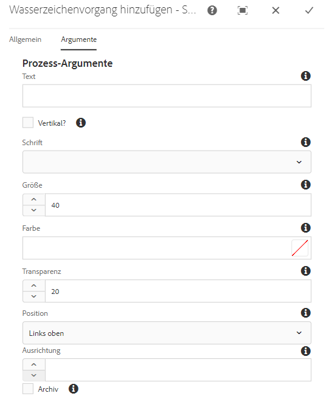

# Digitale Assets mit Wasserzeichen versehen {#watermarking}

[!DNL Adobe Experience Manager Assets] ermöglicht es Ihnen, Assets ein digitales Wasserzeichen hinzuzufügen, mit dem Benutzer die Authentizität und das Urheberrecht der Assets überprüfen können. [!DNL Experience Manager Assets] unterstützt die Verwendung von Text als Wasserzeichen auf PNG- und JPEG-Dateien.

To be able to apply watermark on assets, add the watermarking step in the [!UICONTROL DAM Update Asset] workflow.

1. Rufen Sie die [!DNL Experience Manager] Benutzeroberfläche auf und gehen Sie zu **[!UICONTROL Werkzeuge]** > **[!UICONTROL Workflow]** > **[!UICONTROL Modelle]**.
1. From the **[!UICONTROL Workflow Models]** page, select the **[!UICONTROL DAM Update Asset]** workflow and click **[!UICONTROL Edit]**.

1. From the side panel, drag the **[!UICONTROL Add Watermark]** step to the [!UICONTROL DAM Update Asset] workflow.

   ![Ziehen Sie den [!UICONTROL HinzufügenWasserzeichenschritt] und fügen Sie ihn zum [!UICONTROL DAM Update Asset] -Arbeitsablauf](assets/add_watermark_step_aem_assets.png)2 hinzu
   *Abbildung: Ziehen Sie den[!UICONTROL Hinzufügen Wasserzeichen]-Schritt und fügen Sie ihn zum Arbeitsablauf[!UICONTROL DAM-Aktualisierung des Assets]hinzu.*

   >[!NOTE]
   >
   >Place the [!UICONTROL Add Watermark] step anywhere before the [!UICONTROL Process Thumbnail] step.

1. Öffnen Sie den Schritt **[!UICONTROL Wasserzeichen hinzufügen]**, um seine Eigenschaften anzuzeigen.
1. Geben Sie auf die Registerkarte **[!UICONTROL Argumente]** gültige Werte in den verschiedenen Feldern an: „Text“, „Schriftart“, „Farbe“, „Position“, „Ausrichtung“ usw. Um die Änderungen zu bestätigen, klicken Sie auf **[!UICONTROL Fertig]**.

   

   *Abbildung: Geben Sie die Argumente im Schritt Wasserzeichen hinzufügen in[!DNL Assets]an.*

1. Save the **[!UICONTROL DAM Update Asset]** workflow with the watermark step.
1. From the [!DNL Assets] user interface, upload a sample asset. Das Wasserzeichen wird mit den Werten für Schriftgröße, Farbe usw. an der in den obigen Schritten konfigurierten Position angezeigt.

Um PDF-Dokumente programmgesteuert oder mit dynamischen Informationen zu versehen, sollten Sie das [Experience Manager Dokument Services](/help/forms/using/overview-aem-document-services.md) -Angebot in Betracht ziehen.
