# Arbeiten mit Selektoren {#working-with-selectors}

Beim Arbeiten mit einem interaktiven Bild, interaktiven Videos oder Karussellbannern wählen Sie Assets sowie Sites und Produkte für Hotspots und Imagemaps zum Verknüpfen aus. Wenn Sie mit Bildsets, Rotationssets und Multimediasets arbeiten, wählen Sie mit dem Asset-Selektor Assets aus.

Dieses Thema befasst sich damit, wie die Produkt-, Site- und Asset-Selektoren verwendet werden, einschließlich der Möglichkeit, in den Selektoren zu suchen, zu filtern und zu sortieren.

Sie greifen auf die Selektoren beim Erstellen von Karussellsets, beim Hinzufügen von Hotspots und Imagemaps und beim Erstellen interaktiver Videos und Bilder zu.

In diesem Karussellbanner verwenden Sie beispielsweise den Produktselektor, wenn Sie einen Hotspot oder eine Imagemap mit einer Schnellansichtsseite verknüpfen. Verwenden Sie den Site-Selektor, wenn Sie einen Hotspot oder eine Imagemap mit einem Hyperlink verknüpfen. Verwenden Sie beim Erstellen einer Folie die Asset-Auswahl.

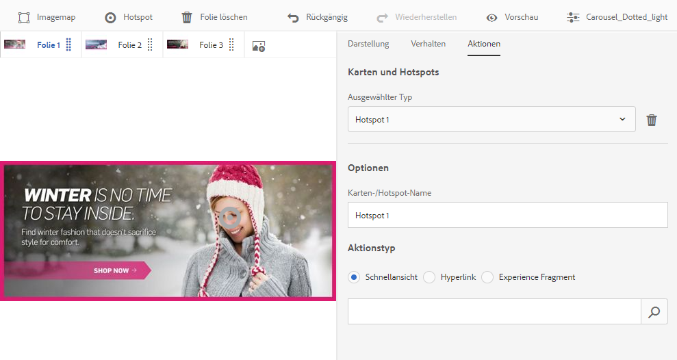

Wenn Sie auswählen (statt dies manuell einzugeben), wo sich Hotspots oder Imagemaps befinden sollen, verwenden Sie den Selektor. Der Website-Selektor funktioniert nur, wenn Sie Experience Manager Sites-Kunde sind. Der Produktselektor erfordert außerdem Experience Manager Commerce.

## Auswählen von Produkten {#selecting-products}

Verwenden Sie den Produktselektor, um ein Produkt auszuwählen, wenn Sie möchten, dass ein Hotspot oder eine Imagemap eine Schnellansicht zu einem bestimmten Produkt in Ihrem Produktkatalog zur Verfügung zu stellt.

1. Gehen Sie zum Karussellset, interaktiven Bild oder interaktiven Video und tippen oder klicken Sie auf die Registerkarte **[!UICONTROL Aktionen]** (nur verfügbar, wenn Sie einen Hotspot oder eine Imagemap definiert haben).

   Der Produktselektor befindet sich im Bereich **[!UICONTROL Aktionstyp]**.

   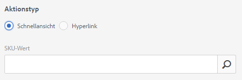

1. Tippen Sie auf das Symbol **[!UICONTROL Produktselektor]** (Lupe) und gehen Sie zu einem Produkt im Katalog.

   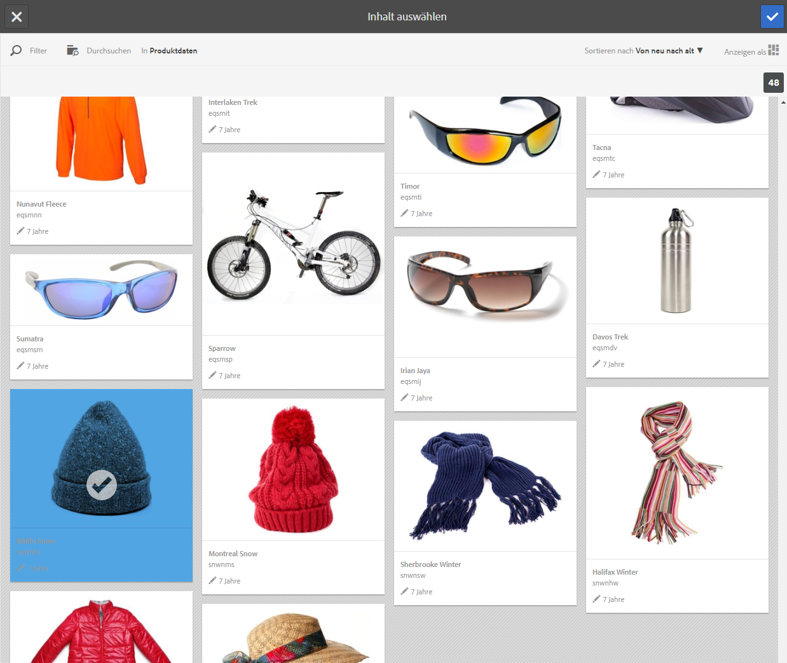

   Filtern Sie nach Keyword oder Tag, indem Sie auf **[!UICONTROL Filter]** tippen und Keywords eingeben oder Tags oder beides auswählen.

   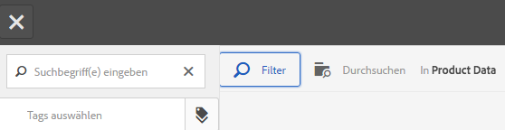

   Ändern Sie, wo Experience Manager nach Produktdaten sucht, indem Sie auf **[!UICONTROL Durchsuchen]** tippen und zu einem anderen Ordner navigieren.

   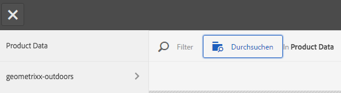

   Tippen Sie auf **[!UICONTROL Sortieren]** durch , um zu ändern, ob der Experience Manager von neu nach alt oder von alt nach neu sortiert.

   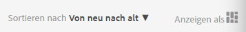

   Tippen Sie auf **[!UICONTROL Anzeigen als]**, um zu ändern, wie Sie Produkte anzeigen (**[!UICONTROL Listenansicht]** oder **[!UICONTROL Kartenansicht]**).

   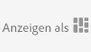

1. Nachdem das Produkt ausgewählt wurde, wird das Feld mit dem Produktminiaturbild und dem Namen ausgefüllt.

   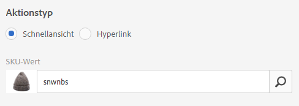

1. Im **[!UICONTROL Vorschaumodus]** können Sie auf den Hotspot oder die Imagemap tippen und sehen, wie die Schnellansicht aussieht.

   

## Auswählen von Sites {#selecting-sites}

Verwenden Sie den Site-Selektor, um eine Webseite auszuwählen, wenn Sie möchten, dass ein Hotspot oder eine Imagemap mit einer Webseite verknüpft wird, die in Experience Manager-Sites verwaltet wird.

1. Gehen Sie zum Karussellset, interaktiven Bild oder interaktiven Video und tippen oder klicken Sie auf die Registerkarte **[!UICONTROL Aktionen]** (nur verfügbar, wenn Sie einen Hotspot oder eine Imagemap definiert haben).

   Der Site-Selektor befindet sich im Bereich **[!UICONTROL Aktionstyp]**.

   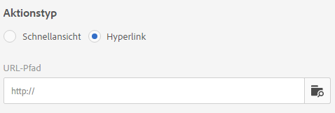

1. Tippen Sie auf das Symbol **[!UICONTROL Site-Selektor]** (Ordner mit Lupe) und navigieren Sie zu einer Seite in Ihren Experience Manager-Sites, mit der Sie den Hotspot oder die Imagemap verknüpfen möchten.

   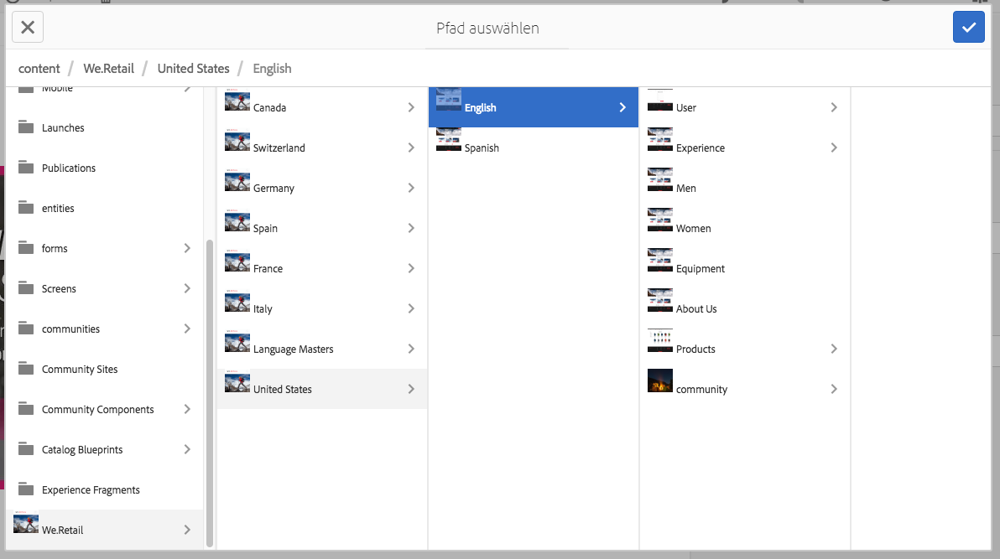

1. Nachdem die Site ausgewählt wurde, wird das Feld mit dem Pfad ausgefüllt.

   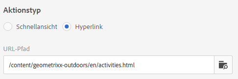

1. Wenn Sie im **[!UICONTROL Vorschaumodus]** auf den Hotspot oder die Imagemap tippen, gehen Sie zur Seite der Experience Manager-Website, die Sie angegeben haben.

## Wählen von Assets {#selecting-assets}

Verwenden Sie diesen Selektor, um Bilder zur Verwendung in Karussellbannern, interaktiven Videos, Bildsets, gemischten Mediensets und Rotationssets auszuwählen. In interaktiven Videos ist der Asset-Selektor verfügbar, wenn Sie auf **[!UICONTROL Assets auswählen]** auf der Registerkarte **[!UICONTROL Inhalt]** tippen. In Karussellsets ist der Asset-Selektor verfügbar, wenn Sie Folie erstellen. In Bildsets, gemischten Mediensets und Rotationssets ist der Asset-Selektor verfügbar, wenn Sie ein neues Bildset, gemischtes Medienset oder Rotationsset erstellen.

Weitere Informationen finden Sie unter [Asset-Auswahl](search-assets.md#assetpicker).

1. Gehen Sie zum Karussellset und erstellen Sie eine Folie. Sie können auch zum interaktiven Video navigieren, zur Registerkarte **[!UICONTROL Inhalt]** wechseln und Assets auswählen. Erstellen Sie alternativ ein gemischtes Medienset, Bildset oder Rotationsset.
1. Tippen Sie auf das Symbol **[!UICONTROL Asset-Selektor]** (Ordner mit Lupe) und gehen Sie zu einem Asset.

   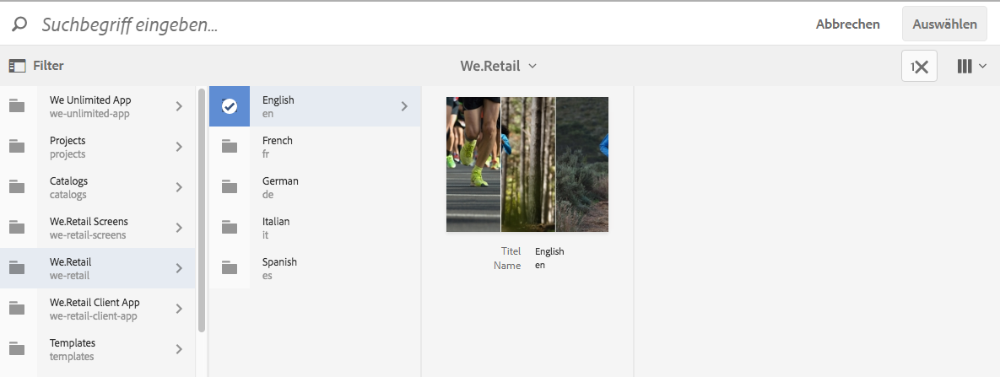

   Sie können auch nach Keyword oder Tag filtern, indem Sie auf **[!UICONTROL Filter]** tippen und Keywords und/oder Kriterien hinzufügen.

   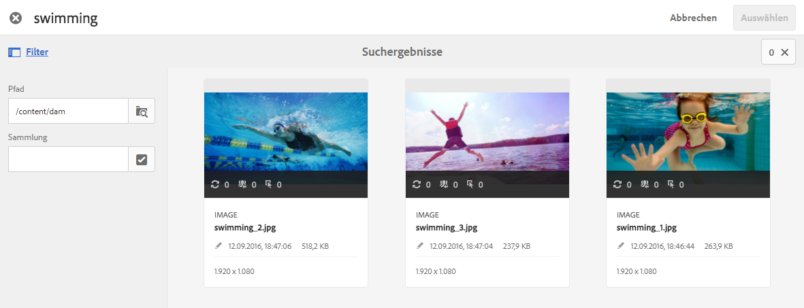

   Ändern Sie, wo Experience Manager nach Assets suchen, indem Sie zu einem anderen Ordner im Feld **[!UICONTROL Pfad]** navigieren.

   Tippen Sie auf **[!UICONTROL Sammlung]**, um nur in Sammlungen nach Assets zu suchen.

   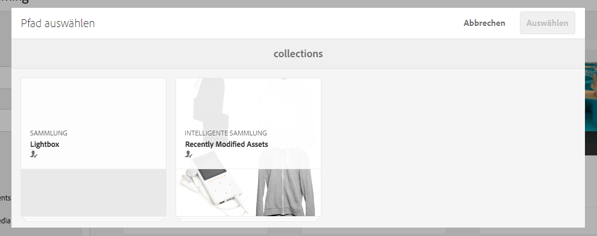

   Tippen Sie auf **[!UICONTROL Anzeigen als]**, um zu ändern, wie Sie Produkte anzeigen (**[!UICONTROL Listenansicht]**, **[!UICONTROL Spaltenansicht]** oder **[!UICONTROL Kartenansicht]**).

   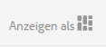

1. Wählen Sie das Asset aus, indem Sie auf das Häkchen tippen. Das Asset wird angezeigt.

   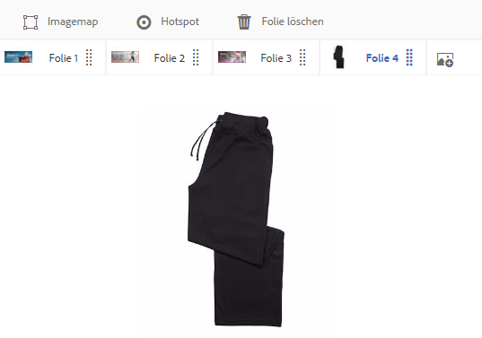
