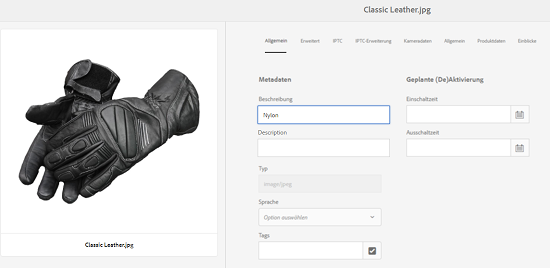
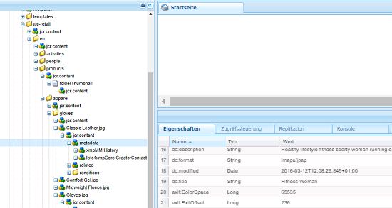
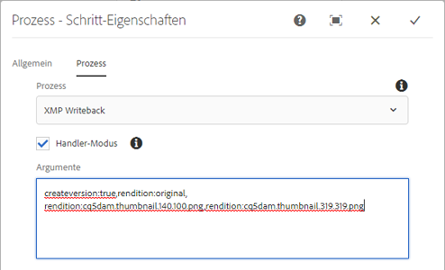

# XMP-Writeback in Ausgabedarstellungen {#xmp-writeback-to-renditions}

Diese XMP Funktion für die Rückgabe von Metadaten in [!DNL Adobe Experience Manager Assets] repliziert die Änderungen an den Darstellungen des ursprünglichen Assets. Wenn Sie die Metadaten für ein Asset aus Assets ändern oder das Asset hochladen, werden die Änderungen zunächst im Metadaten-Knoten in der Asset-Hierarchie gespeichert.

Mit der XMP-Writeback-Funktion können Sie die Metadatenänderungen in alle oder nur in bestimmte Ausgabedarstellungen des Assets kopieren. Die Funktion schreibt nur die Metadateneigenschaften zurück, die den Namensraum `jcr` verwenden, d. h., eine Eigenschaft mit dem Namen `dc:title` wird zurückgeschrieben, eine Eigenschaft mit dem Namen `mytitle` jedoch nicht.

Stellen Sie sich vor, Sie ändern die Eigenschaft [!UICONTROL Titel] des Assets `Classic Leather` in `Nylon`.

In diesem Fall speichert [!DNL Experience Manager Assets] die Änderungen an der Eigenschaft **[!UICONTROL Title]** im Parameter `dc:title` für die in der Asset-Hierarchie gespeicherten Asset-Metadaten.

[!DNL Experience Manager Assets] propagiert jedoch nicht automatisch Änderungen der Metadaten an den Darstellungen eines Assets. Siehe [Aktivieren XMP Schreibens](#enable-xmp-writeback).

## Aktivieren XMP Schreibback {#enable-xmp-writeback}

Um Metadatenänderungen beim Hochladen des Assets in die Ausgabeformate zu propagieren, bearbeiten Sie die Konfiguration **[!UICONTROL Adobe CQ DAM Rendition Maker]** in Configuration Manager.

1. Um Configuration Manager zu öffnen, rufen Sie `https://[aem_server]:[port]/system/console/configMgr` auf.
1. Öffnen Sie die Konfiguration **[!UICONTROL Adobe CQ DAM Rendition Maker]**.
1. Wählen Sie die Option **[!UICONTROL XMP propagieren]** aus und speichern Sie die Änderungen.

   

## Aktivieren von XMP-Writeback für bestimmte Ausgabeformate {#enabling-xmp-writeback-for-specific-renditions}

Damit die Funktion XMP Writeback Metadatenänderungen zur Auswahl von Darstellungen weiterleiten kann, geben Sie diese Darstellungen im Arbeitsablaufschritt XMP Writeback-Prozess für [!UICONTROL DAM Metadata WriteBack] an. Standardmäßig ist dieser Schritt mit dem ursprünglichen Format konfiguriert.

Führen Sie folgende Schritte durch, damit die XMP-Writeback-Funktion Metadaten in die Ausgabeformat-Miniaturansichten „140.100.png“ und „319.319.png“ übertragen.

1. Navigieren Sie in der Benutzeroberfläche des Experience Managers zu **[!UICONTROL Tools]** > **[!UICONTROL Workflow]** > **[!UICONTROL Modelle]**.
1. Öffnen Sie über die Seite „Modelle“ das Workflow-Modell **[!UICONTROL DAM-Metadaten-Writeback]**.
1. Öffnen Sie auf der Eigenschaftsseite **[!UICONTROL DAM-Metadaten-Writeback]** den Schritt **[!UICONTROL XMP-Writeback-Vorgang]**.
1. Klicken Sie im Dialogfeld [!UICONTROL Schritt-Eigenschaften] auf die Registerkarte **[!UICONTROL Prozess]**.
1. Fügen Sie im Feld **Argumente** `rendition:cq5dam.thumbnail.140.100.png,rendition:cq5dam.thumbnail.319.319.png` hinzu und klicken Sie auf **[!UICONTROL OK]**.

   

1. Speichern Sie die Änderungen.
1. Um die Pyramiden-TIFF-Darstellungen für [!DNL Dynamic Media]-Bilder mit den neuen Attributen neu zu generieren, fügen Sie den Schritt **[!UICONTROL Dynamic Media Process Image Assets]** zum Arbeitsablauf [!UICONTROL DAM Metadata Writeback] hinzu.

   PTIFF-Ausgabedarstellung werden nur lokal in einer Dynamic Media Hybrid-Implementierung erstellt und gespeichert.

1. Speichern Sie den Workflow.

Die Metadatenänderungen werden in die Ausgabeformate „thumbnail.140.100.png“ und „thumbnail.319.319.png“ des Elements und nicht auf die anderen Ausgabeformate übertragen.

>[!NOTE]
>
>XMP Probleme mit der Schreibmaschine in 64-Bit Linux finden Sie unter [Aktivieren XMP Schreibback auf 64-Bit RedHat Linux](https://helpx.adobe.com/experience-manager/kb/enable-xmp-write-back-64-bit-redhat.html).
>
>Die unterstützten Plattformen finden Sie unter [XMP Voraussetzungen für die Metadaten-Rückgabe](/help/sites-deploying/technical-requirements.md#requirements-for-aem-assets-xmp-metadata-write-back).

## Filtern von XMP-Metadaten {#filtering-xmp-metadata}

[!DNL Experience Manager Assets] unterstützt das Filtern von Eigenschaften/Knoten in Blockierungsliste und Zulassungsliste für XMP Metadaten, die aus Asset-Binärdateien gelesen und bei der Erfassung von Assets in JCR gespeichert werden.

Bei der Filterung über eine Blockierungsliste können Sie alle XMP-Metadateneigenschaften importieren – mit Ausnahme der Eigenschaften, für die ein Ausschluss angegeben ist. Jedoch ist der Name der zu filternden Knoten für Elementtypen wie INDD-Dateien mit enormen Mengen an XMP-Metadaten (z. B. 1.000 Knoten mit 10.000 Eigenschaften) nicht immer bereits im Voraus bekannt. Wenn beim Filtern mit einer Blockierungsliste eine große Anzahl von Assets mit zahlreichen XMP Metadaten importiert werden kann, kann die [!DNL Experience Manager]-Bereitstellung auf Stabilitätsprobleme stoßen, z. B. verstopfte Beobachtungswarteschlangen.

Durch Filtern von XMP-Metadaten über die Zulassungsliste wird dieses Problem behoben, indem Sie die zu importierenden XMP-Eigenschaften definieren können. Auf diese Weise werden andere/unbekannte XMP-Eigenschaften ignoriert. Aus Gründen der Abwärtskompatibilität können Sie einige dieser Eigenschaften dem Filter hinzufügen, der eine Blockierungsliste verwendet.

>[!NOTE]
>
>Die Filterung funktioniert nur für aus XMP-Quellen in Asset-Binärdateien abgeleitete Eigenschaften. Bei Eigenschaften, die aus XMP-fremden Quellen wie EXIF- und IPTC-Formaten abgeleitet wurden, funktioniert die Filterung nicht. Beispielsweise wird das Datum der Asset-Erstellung in der Eigenschaft `CreateDate` in EXIF TIFF gespeichert. Experience Manager speichert diesen Wert in einem Metadatenfeld mit dem Namen `exif:DateTimeOriginal`. Da es sich um eine andere Quelle als XMP handelt, funktioniert die Filterung nicht bei dieser Eigenschaft.

1. Um Configuration Manager zu öffnen, rufen Sie `https://[aem_server]:[port]/system/console/configMgr` auf.
1. Öffnen Sie die Konfiguration **[!UICONTROL Adobe CQ DAM XmpFilter]**.
1. Um die Filterfunktion mit einer Zulassungsliste anzuwenden, klicken Sie auf **[!UICONTROL Zulassungsliste auf XMP-Eigenschaften anwenden]** und geben Sie die Eigenschaften an, die in das Feld **[!UICONTROL Zulässige XML-Namen für XMP-Filterfunktion]** importiert werden sollen.

   

1. Um blockierte XMP nach dem Anwenden der Filterung über die Zulassungsliste zu filtern, geben Sie diese im Feld **[!UICONTROL Blockierte XML-Namen für die XMP Filterung]** an.

   >[!NOTE]
   >
   >Die Option **[!UICONTROL Blockierungsliste auf XMP-Eigenschaften anwenden]** ist standardmäßig ausgewählt. Mit anderen Worten, das Filtern über eine Blockierungsliste ist standardmäßig aktiviert. Um eine solche Filterung zu deaktivieren, brechen Sie die Auswahl der Option **[!UICONTROL Blockierungsliste auf XMP Eigenschaften anwenden]** ab.

1. Speichern Sie die Änderungen.
