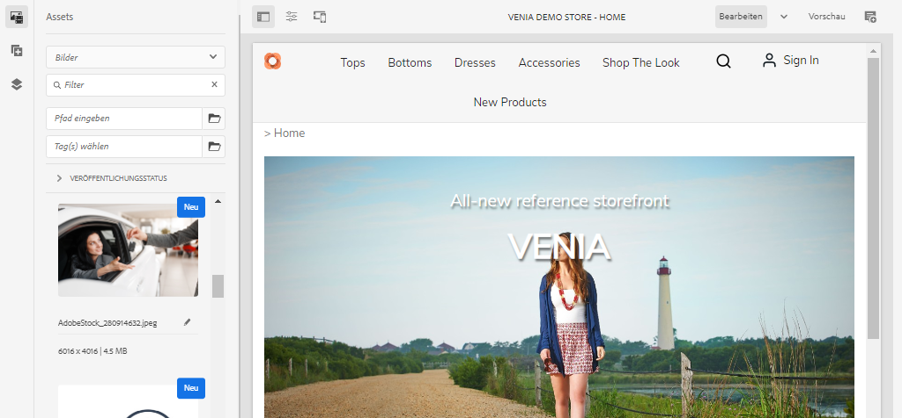
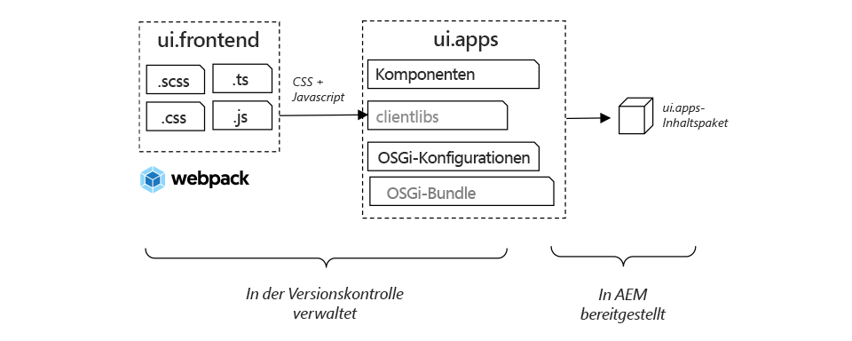
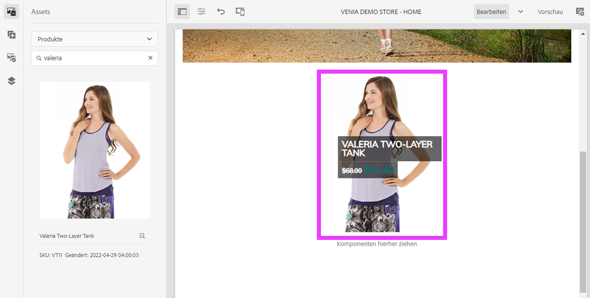
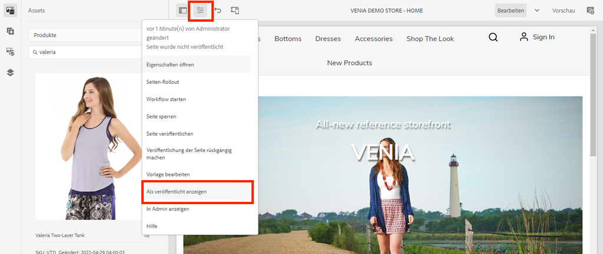
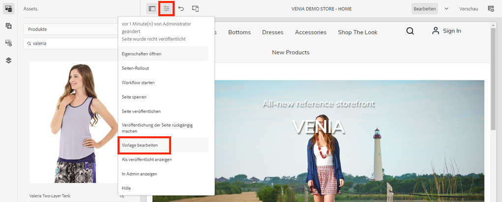
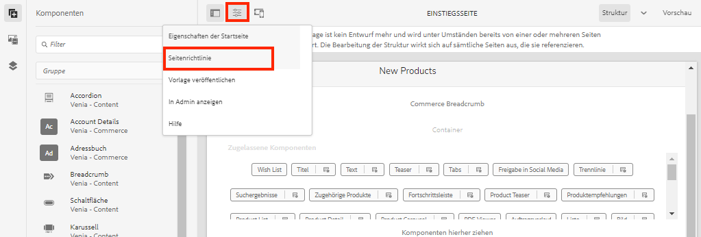
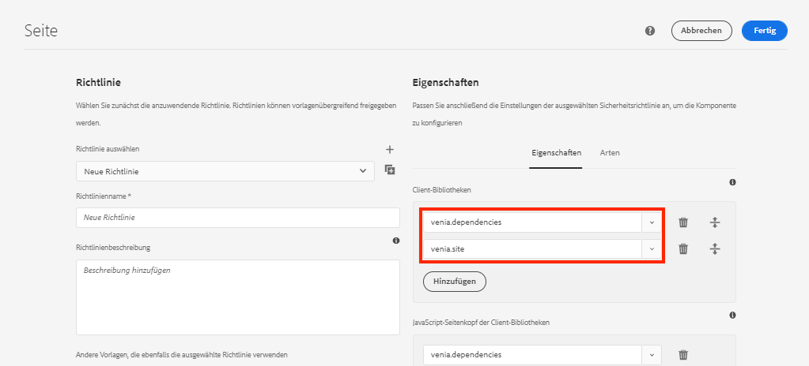

# Stile für AEM CIF-Kernkomponenten festlegen {#style-aem-cif-core-components}

Das [CIF-Venia-Projekt](https://github.com/adobe/aem-cif-guides-venia) ist eine Referenz-Code-Basis für die Verwendung von [CIF-Kernkomponenten](https://github.com/adobe/aem-core-cif-components). In diesem Tutorial werden Sie sich das Venia-Referenzprojekt ansehen und erfahren, wie von AEM CIF-Kernkomponenten verwendete CSS- und JavaScript-Dateien organisiert werden. Außerdem erstellen Sie mithilfe von CSS einen neuen Stil, um den Standardstil der Komponente **Produkt-Teaser** zu aktualisieren.

>[!TIP]
>
> Verwenden Sie den [AEM-Projektarchetyp](https://github.com/adobe/aem-project-archetype), wenn Sie Ihre eigene Commerce-Implementierung starten.

## Was Sie erstellen werden

In diesem Tutorial wird ein neuer Stil für die Produkt-Teaser-Komponente implementiert, der einer Karte ähnlich ist. Das im Tutorial erworbene Wissen kann auf andere CIF-Kernkomponenten angewendet werden.


## Voraussetzungen {#prerequisites}

Zum Absolvieren dieses Tutorials ist eine lokale Entwicklungsumgebung erforderlich. Dazu gehört eine laufende Instanz von AEM, die konfiguriert und mit einer Adobe Commerce-Instanz verbunden ist. Überprüfen Sie die Anforderungen und Schritte für [Einrichten einer lokalen Entwicklung mit AEM](../develop.md).

## Venia-Projekt klonen {#clone-venia-project}

Wir werden das [Venia-Projekt](https://github.com/adobe/aem-cif-guides-venia) klonen und dann die Standardstile überschreiben.

>[!NOTE]
>
> **Sie können auch ein vorhandenes Projekt** nutzen (basierend auf dem AEM-Projektarchetyp mit enthaltenem CIF) und diesen Abschnitt überspringen.

1. Führen Sie folgenden git-Befehl aus, um das Projekt zu klonen:

   ```shell
   $ git clone git@github.com:adobe/aem-cif-guides-venia.git
   ```

1. Erstellen Sie das Projekt und stellen Sie es in einer lokalen Instanz von AEM bereit:

   ```shell
   $ cd aem-cif-guides-venia/
   $ mvn clean install -PautoInstallPackage,cloud
   ```

1. Fügen Sie die erforderlichen OSGi-Konfigurationen hinzu, um Ihre AEM-Instanz mit einer Adobe Commerce-Instanz zu verbinden, oder fügen Sie die Konfigurationen dem neu erstellten Projekt hinzu.

1. An diesem Punkt sollten Sie über eine funktionierende Version einer Storefront verfügen, die mit einer Adobe Commerce-Instanz verbunden ist. Navigieren Sie zur Seite `US` > `Home` unter: [http://localhost:4502/editor.html/content/venia/us/en.html](http://localhost:4502/editor.html/content/venia/us/en.html).

   Sie sollten sehen, dass die Storefront derzeit im Venia-Design erscheint. Wenn Sie das Hauptmenü der Storefront erweitern, sollten verschiedene Kategorien angezeigt werden, was darauf hinweist, dass die Verbindung mit Adobe Commerce funktioniert.

   

## Client-Bibliotheken und ui.frontend-Modul {#introduction-to-client-libraries}

Die CSS- und JavaScript-Dateien, die für das Rendern der Designs/Stile der Storefront verantwortlich sind, werden in AEM von einem [Client-Bibliothek](/help/sites-developing/clientlibs.md) oder clientlibs für kurze Zeit. Client-Bibliotheken bieten ein Verfahren zum Organisieren von CSS- und JavaScript-Dateien im Code eines Projekts und zum anschließenden Bereitstellen auf der Seite.

Markenspezifische Stile können auf AEM CIF-Kernkomponenten angewendet werden, indem das von diesen Client-Bibliotheken verwaltete CSS hinzugefügt und überschrieben wird. Kenntnisse dazu, wie Client-Bibliotheken strukturiert sind und auf der Seite eingeschlossen werden, sind von entscheidender Bedeutung.

Das [ui.frontend](https://docs.adobe.com/content/help/de-DE/experience-manager-core-components/using/developing/archetype/uifrontend.html) ist ein dediziertes [webpack](https://webpack.js.org/)-Projekt für die Verwaltung aller Frontend-Assets eines Projekts. Dadurch können Frontend-Entwickler eine beliebige Zahl von Sprachen und Technologien wie [TypeScript](https://www.typescriptlang.org/), [Sass](https://sass-lang.com/) und vieles mehr nutzen.

Das `ui.frontend`-Modul ist ebenfalls ein Maven-Modul und mit dem größeren Projekt durch Einsatz eines NPM-Moduls (dem [aem-clientlib-generator](https://github.com/wcm-io-frontend/aem-clientlib-generator)) integriert. Während eines Builds wird die `aem-clientlib-generator` kopiert die kompilierten CSS- und JavaScript-Dateien in eine Client-Bibliothek im `ui.apps` -Modul.



*Kompilierte CSS- und JavaScript-Dateien werden aus dem `ui.frontend` in das `ui.apps` -Modul als Client-Bibliothek während eines Maven-Builds*

## Teaser-Stil aktualisieren {#ui-frontend-module}

Nehmen Sie als Nächstes eine kleine Änderung am Teaser-Stil vor, um zu sehen, wie das `ui.frontend`-Modul und die Client-Bibliotheken funktionieren. Verwenden Sie [eine IDE Ihrer Wahl](https://docs.adobe.com/content/help/de-DE/experience-manager-learn/cloud-service/local-development-environment-set-up/development-tools.html#set-up-the-development-ide), um das Venia-Projekt zu importieren. Die verwendeten Screenshots stammen aus der [Visual Studio Code-IDE](https://docs.adobe.com/content/help/de-DE/experience-manager-learn/cloud-service/local-development-environment-set-up/development-tools.html#microsoft-visual-studio-code).

1. Navigieren Sie zum Modul **ui.frontend** und erweitern Sie es. Erweitern Sie dann die Ordnerhierarchie zu: `ui.frontend/src/main/styles/commerce`:

   

   Beachten Sie, dass sich unter dem Ordner mehrere Sass-Dateien (`.scss`) befinden. Dies sind Commerce-spezifische Stile für die einzelnen Commerce-Komponenten.

1. Öffnen Sie die Datei `_productteaser.scss`.

1. Aktualisieren Sie die `.item__image`-Regel und ändern Sie die Rahmenregel:

   ```scss
   .item__image {
       border: #ea00ff 8px solid; /* <-- modify this rule */
       display: block;
       grid-area: main;
       height: auto;
       opacity: 1;
       transition-duration: 512ms;
       transition-property: opacity, visibility;
       transition-timing-function: ease-out;
       visibility: visible;
       width: 100%;
   }
   ```

   Mit der obigen Regel sollte der Produkt-Teaser-Komponente ein dicker rosa Rahmen hinzugefügt werden.

1. Öffnen Sie ein neues Terminal-Fenster und navigieren Sie zum Ordner `ui.frontend`:

   ```shell
   $ cd <project-location>/aem-cif-guides-venia/ui.frontend
   ```

1. Führen Sie folgenden Maven-Befehl aus:

   ```shell
   $ mvn clean install
   ...
   [INFO] ------------------------------------------------------------------------
   [INFO] BUILD SUCCESS
   [INFO] ------------------------------------------------------------------------
   [INFO] Total time:  29.497 s
   [INFO] Finished at: 2020-08-25T14:30:44-07:00
   [INFO] ------------------------------------------------------------------------
   ```

   Prüfen Sie die Terminal-Ausgabe. Sie werden sehen, dass der Maven-Befehl mehrere NPM-Skripte ausgeführt hat, darunter auch `npm run build`. Der `npm run build`-Befehl ist in der `package.json`-Datei definiert und führt dazu, dass das webpack-Projekt kompiliert und die Erstellung der Client-Bibliothek ausgelöst wird.

1. Prüfen Sie die Datei `ui.frontend/dist/clientlib-site/site.css`:

   

   Die Datei ist die kompilierte und minimierte Version aller Sass-Dateien in dem Projekt.

   >[!NOTE]
   >
   > Dateien wie diese werden von der Quell-Code-Verwaltung ignoriert, da sie während der Build-Zeit erstellt werden sollten.

1. Prüfen Sie die Datei `ui.frontend/clientlib.config.js`.

   ```js
   /* clientlib.config.js*/
   ...
   // Config for `aem-clientlib-generator`
   module.exports = {
       context: BUILD_DIR,
       clientLibRoot: CLIENTLIB_DIR,
       libs: [
           {
               ...libsBaseConfig,
               name: 'clientlib-site',
               categories: ['venia.site'],
               dependencies: ['venia.dependencies', 'aem-core-cif-react-components'],
               assets: {
   ...
   ```

   Dies ist die Konfigurationsdatei für [aem-clientlib-generator](https://github.com/wcm-io-frontend/aem-clientlib-generator) und bestimmt, wo und wie die kompilierten CSS- und JavaScript-Dateien in eine AEM-Client-Bibliothek umgewandelt werden.

1. Überprüfen Sie im `ui.apps`-Modul die Datei: `ui.apps/src/main/content/jcr_root/apps/venia/clientlibs/clientlib-site/css/site.css`:

   

   Dadurch wird die `site.css` in die `ui.apps` Projekt. Es ist jetzt Teil einer Client-Bibliothek mit dem Namen `clientlib-site` mit einer Kategorie von `venia.site`. Sobald die Datei Teil des `ui.apps`-Moduls ist, kann sie in AEM bereitgestellt werden.

   >[!NOTE]
   >
   > Dateien wie diese werden von der Quell-Code-Verwaltung ebenfalls ignoriert, da sie zur Build-Zeit erstellt werden sollten.

1. Überprüfen Sie anschließend die anderen vom Projekt erstellten Client-Bibliotheken:

   

   Diese Client-Bibliotheken werden nicht vom `ui.frontend`-Modul verwaltet. Stattdessen enthalten sie CSS- und JavaScript-Abhängigkeiten, die von Adobe bereitgestellt werden. Die Definition für diese Client-Bibliotheken finden Sie im Abschnitt `.content.xml` Datei unterhalb jedes Ordners.

   **clientlib-base** – Dies ist eine leere Client-Bibliothek, die die erforderlichen Abhängigkeiten von [AEM-Kernkomponenten](https://docs.adobe.com/content/help/de-DE/experience-manager-core-components/using/introduction.html) einfach einbettet. Die Kategorie lautet `venia.base`.

   **clientlib-cif** – Dies ist ebenfalls eine leere Client-Bibliothek, die die erforderlichen Abhängigkeiten von [AEM CIF-Kernkomponenten](https://github.com/adobe/aem-core-cif-components) einfach einbettet. Die Kategorie lautet `venia.cif`.

   **clientlib-grid** – Dies umfasst die CSS, die zur Aktivierung der Funktion „Responsives Raster“ von AEM erforderlich sind. Durch Verwendung des AEM-Rasters wird der [Layout-Modus](/help/sites-authoring/responsive-layout.md) im AEM-Editor aktiviert und erhalten Inhaltsautoren die Möglichkeit, die Größe von Komponenten zu ändern. Die Kategorie lautet `venia.grid` und ist in der `venia.base`-Bibliothek eingebettet.

1. Überprüfen Sie die Dateien `customheaderlibs.html` und `customfooterlibs.html` unter `ui.apps/src/main/content/jcr_root/apps/venia/components/page`:

   

   Diese Skripte enthalten die Bibliotheken **venia.base** und **venia.cif** als Bestandteil aller Seiten.

   >[!NOTE]
   >
   > Nur die Basisbibliotheken sind als Teil der Seitenskripte „hartkodiert“. `venia.site` ist nicht in diesen Dateien enthalten, sondern für mehr Flexibilität Bestandteil der Seitenvorlage. Dies wird später überprüft.

1. Erstellen Sie das gesamte Projekt aus dem Terminal und stellen Sie es in einer lokalen Instanz von AEM bereit:

   ```shell
   $ cd aem-cif-guides-venia/
   $ mvn clean install -PautoInstallPackage,cloud
   ```

## Produkt-Teaser erstellen {#author-product-teaser}

Nachdem die Codeaktualisierungen bereitgestellt wurden, fügen Sie der Startseite der Site mit den AEM Authoring-Tools eine neue Instanz der Produkt-Teaser-Komponente hinzu. So können wir die aktualisierten Stile anzeigen.

1. Öffnen Sie eine neue Registerkarte im Browser und navigieren Sie zur **Startseite** der Site: [http://localhost:4502/editor.html/content/venia/us/en.html](http://localhost:4502/editor.html/content/venia/us/en.html).

1. Erweitern Sie die Asset-Suche (die Seitenleiste) im Modus **Bearbeitung**. Wechseln Sie im Asset-Filter zu **Produkte**.

   

1. Ziehen Sie ein neues Produkt auf die Startseite im Haupt-Layout-Container:

   

   Sie sollten sehen, dass der Produkt-Teaser basierend auf der zuvor erstellten CSS-Regeländerung nun einen rosa Rahmen aufweist.

## Client-Bibliotheken auf der Seite überprüfen {#verify-client-libraries}

Überprüfen Sie dann, ob die Client-Bibliotheken auf der Seite enthalten sind.

1. Navigieren Sie zur **Startseite** der Site: [http://localhost:4502/editor.html/content/venia/us/en.html](http://localhost:4502/editor.html/content/venia/us/en.html).

1. Wählen Sie das Menü **Seiteninformationen** und klicken Sie auf **Als veröffentlicht anzeigen**:

   

   Dadurch wird die Seite geöffnet, ohne dass das AEM-Autoren-JavaScript geladen wird (so, wie die Seite auf der veröffentlichten Site angezeigt würde). Beachten Sie, dass an die URL der Abfrageparameter `?wcmmode=disabled` angehängt ist. Bei der Entwicklung von CSS und JavaScript empfiehlt es sich, diesen Parameter zu verwenden, um die Seite zu vereinfachen, ohne dass AEM Autor etwas davon hat.

1. Wenn Sie die Seitenquelle anzeigen, sollten Sie in der Lage sein, mehrere enthaltene Client-Bibliotheken zu identifizieren:

   ```html
   <!DOCTYPE html>
   <html lang="en-US">
   <head>
       ...
       <link rel="stylesheet" href="/etc.clientlibs/venia/clientlibs/clientlib-base.min.css" type="text/css">
       <link rel="stylesheet" href="/etc.clientlibs/venia/clientlibs/clientlib-site.min.css" type="text/css">
   </head>
   ...
       <script type="text/javascript" src="/etc.clientlibs/venia/clientlibs/clientlib-site.min.js"></script>
       <script type="text/javascript" src="/etc.clientlibs/core/wcm/components/commons/site/clientlibs/container.min.js"></script>
       <script type="text/javascript" src="/etc.clientlibs/venia/clientlibs/clientlib-base.min.js"></script>
   <script type="text/javascript" src="/etc.clientlibs/core/cif/clientlibs/common.min.js"></script>
   <script type="text/javascript" src="/etc.clientlibs/venia/clientlibs/clientlib-cif.min.js"></script>
   </body>
   </html>
   ```

   Client-Bibliotheken, die auf der Seite bereitgestellt werden, sind mit dem Präfix `/etc.clientlibs` versehen und werden über einen [Proxy](/help/sites-developing/clientlibs.md) bereitgestellt, um zu verhindern, dass in `/apps` oder `/libs` vertrauliche Daten angezeigt werden.

   Achten Sie auf `venia/clientlibs/clientlib-site.min.css` und `venia/clientlibs/clientlib-site.min.js`. Dies sind die kompilierten CSS- und JavaScript-Dateien, die vom `ui.frontend`-Modul abgeleitet wurden.

## Einschließen von Client-Bibliotheken mit Seitenvorlagen {#client-library-inclusion-pagetemplates}

Es gibt mehrere Optionen zum Einschließen einer Client-seitigen Bibliothek. Sehe Sie sich zunächst an, wie das generierte Projekt die `clientlib-site`-Bibliotheken über [Seitenvorlagen](/help/sites-developing/templates.md) enthält.

1. Navigieren Sie im AEM-Editor zur **Startseite** der Site: [http://localhost:4502/editor.html/content/venia/us/en.html](http://localhost:4502/editor.html/content/venia/us/en.html).

1. Wählen Sie das Menü **Seiteninformationen** und klicken Sie auf **Vorlage bearbeiten**:

   

   Dadurch wird die Vorlage für die **Landingpage** geöffnet, auf der die **Startseite** basiert.

   >[!NOTE]
   >
   > Um alle verfügbaren Vorlagen aus dem AEM-Startbildschirm anzuzeigen, navigieren Sie zu **Tools** > **Allgemein** > **Vorlagen**.

1. Wählen Sie in der oberen linken Ecke das Symbol **Seiteninformationen** und klicken Sie auf **Seitenrichtlinie**.

   

1. Dadurch wird die Seitenrichtlinie für die Landingpage-Vorlage geöffnet:

   

   Auf der rechten Seite sehen Sie eine Liste der Client-Bibliotheken **categories** wird auf allen Seiten, die diese Vorlage verwenden, enthalten sein.

   * `venia.dependencies` – Stellt beliebige Anbieterbibliotheken bereit, auf die `venia.site` angewiesen ist.
   * `venia.site` – Dies ist die Kategorie für `clientlib-site`, die das `ui.frontend`-Modul generiert.

   Beachten Sie, dass andere Vorlagen dieselbe Richtlinie verwenden. **Inhaltsseite**, **Landingpage** usw. Durch die Wiederverwendung derselben Richtlinie können wir sicherstellen, dass auf allen Seiten dieselben Client-Bibliotheken enthalten sind.

   Der Vorteil einer Nutzung von Vorlagen und Seitenrichtlinien zur Verwaltung des Einschließens von Client-Bibliotheken besteht darin, dass Sie die Richtlinie je nach Vorlage ändern können. Möglicherweise verwalten Sie zwei verschiedene Marken innerhalb derselben AEM-Instanz. Jede Marke weist ihren eigenen Stil oder ihr eigenes *Design* auf, doch sind die Basisbibliotheken und der Code identisch. Ein weiteres Beispiel: Wenn Sie über eine größere Client-Bibliothek verfügen, die Sie nur auf bestimmten Seiten anzeigen möchten, können Sie eine Einzelseitenrichtlinie nur für diese Vorlage erstellen.

## Lokale Webpack-Entwicklung {#local-webpack-development}

In der vorherigen Übung wurde eine Sass-Datei im `ui.frontend` und nach dem Erstellen eines Maven-Builds werden die Änderungen in AEM bereitgestellt. Als Nächstes werden wir uns mit der Nutzung eines webpack-Dev-Servers zur raschen Entwicklung der Frontend-Stile befassen.

Der webpack-Dev-Server dient als Proxy für Bilder und einige der CSS/JavaScript-Dateien aus der lokalen Instanz von AEM, erlaubt es dem Entwickler jedoch, die Stile und JavaScript im `ui.frontend`-Modul zu ändern.

1. Navigieren Sie im Browser zur **Startseite** und dann zu **Als veröffentlicht anzeigen**: [http://localhost:4502/content/venia/us/en.html?wcmmode=disabled](http://localhost:4502/content/venia/us/en.html?wcmmode=disabled).

1. Zeigen Sie den Quell-Code der Seite an und **kopieren** Sie den rohen HTML-Code der Seite.

1. Kehren Sie zur IDE Ihrer Wahl zurück und öffnen Sie unter dem `ui.frontend`-Modul die folgende Datei: `ui.frontend/src/main/static/index.html`.

   

1. Überschreiben Sie den Inhalt von `index.html` und **fügen** Sie den im vorherigen Schritt kopierten HTML-Code ein.

1. Suchen Sie nach den Einbeziehungen für `clientlib-site.min.css` sowie `clientlib-site.min.js` und **entfernen** Sie sie.

   ```html
   <head>
       <!-- remove this link -->
       <link rel="stylesheet" href="/etc.clientlibs/venia/clientlibs/clientlib-base.min.css" type="text/css">
       ...
   </head>
   <body>
       ...
        <!-- remove this link -->
       <script type="text/javascript" src="/etc.clientlibs/venia/clientlibs/clientlib-site.min.js"></script>
   </body>
   ```

   Sie werden entfernt, da sie die kompilierte Version der vom `ui.frontend`-Modul generierten CSS- und JavaScript-Dateien darstellen. Lassen Sie die anderen Client-Bibliotheken in Ruhe, da sie von der laufenden AEM-Instanz als Proxy übermittelt werden.

1. Öffnen Sie ein neues Terminal-Fenster und navigieren Sie zum Ordner `ui.frontend`. Führen Sie den Befehl `npm start` aus:

   ```shell
   $ cd ui.frontend
   $ npm start
   ```

   Damit wird der webpack-Dev-Server auf [http://localhost:8080/](http://localhost:8080/) gestartet.

   >[!CAUTION]
   >
   > Wenn Sie einen Sass-bezogenen Fehler erhalten, stoppen Sie den Server und führen Sie den Befehl `npm rebuild node-sass` aus; wiederholen Sie dann die oben genannten Schritte. Dies kann vorkommen, wenn Sie eine andere Version von `npm` und `node` im Projekt angegeben `aem-cif-guides-venia/pom.xml`.

1. Navigieren Sie mit demselben Browser als angemeldeter AEM-Instanz in einer neuen Registerkarte zu [http://localhost:8080/](http://localhost:8080/). Über den webpack-Dev-Server sollte die Venia-Startseite angezeigt werden:

   

   Lassen Sie den webpack-Dev-Server laufen. Er wird in der nächsten Übung erneut verwendet.

## Kartenstil für den Produkt-Teaser implementieren {#update-css-product-teaser}

Ändern Sie anschließend die Sass-Dateien im `ui.frontend`-Modul, um für den Produkt-Teaser einen kartenähnlichen Stil zu implementieren. Der webpack-Dev-Server dient dazu, die Änderungen schnell anzuzeigen.

Kehren Sie zur IDE und zum erstellten Projekt zurück.

1. Öffnen Sie im Modul **ui.frontend** die Datei `_productteaser.scss` unter `ui.frontend/src/main/styles/commerce/_productteaser.scss` erneut.

1. Nehmen Sie folgende Änderungen am Rahmen des Produkt-Teasers vor:

   ```diff
       .item__image {
   -       border: #ea00ff 8px solid;
   +       border-bottom: 1px solid #c0c0c0;
           display: block;
           grid-area: main;
           height: auto;
           opacity: 1;
           transition-duration: 512ms;
           transition-property: opacity, visibility;
           transition-timing-function: ease-out;
           visibility: visible;
           width: 100%;
       }
   ```

   Speichern Sie die Änderungen. Der webpack-Dev-Server sollte mit den neuen Stilen automatisch aktualisiert werden.

1. Fügen Sie dem Produkt-Teaser einen Schlagschatten sowie abgerundete Ecken hinzu.

   ```scss
    .item__root {
        position: relative;
        box-shadow: 0 4px 8px 0 rgba(0,0,0,0.2);
        transition: 0.3s;
        border-radius: 5px;
        float: left;
        margin-left: 12px;
        margin-right: 12px;
   }
   
   .item__root:hover {
      box-shadow: 0 8px 16px 0 rgba(0,0,0,0.2);
   }
   ```

1. Aktualisieren Sie den Produktnamen so, dass er unten im Teaser angezeigt wird, und ändern Sie die Textfarbe.

   ```css
   .item__name {
       color: #000;
       display: block;
       float: left;
       font-size: 22px;
       font-weight: 900;
       line-height: 1em;
       padding: 0.75em;
       text-transform: uppercase;
       width: 75%;
   }
   ```

1. Aktualisieren Sie den Produktpreis so, dass er ebenfalls unten im Teaser angezeigt wird, und ändern Sie die Textfarbe.

   ```css
   .price {
       color: #000;
       display: block;
       float: left;
       font-size: 18px;
       font-weight: 900;
       padding: 0.75em;
       padding-bottom: 2em;
       width: 25%;
   
       ...
   ```

1. Aktualisieren Sie die Medienabfrage unten, um den Namen und Preis in Bildschirmen, die kleiner als **992 Pixel** sind, zu stapeln.

   ```css
   @media (max-width: 992px) {
       .productteaser .item__name {
           font-size: 18px;
           width: 100%;
       }
       .productteaser .item__price {
           font-size: 14px;
           width: 100%;
       }
   }
   ```

   Der Kartenstil sollte sich nun im webpack-Dev-Server widerspiegeln:

   

   Die Änderungen wurden jedoch noch nicht in AEM bereitgestellt. Sie können die [Lösungsdatei hier](../assets/style-cif-component/_productteaser.scss) herunterladen.

1. Stellen Sie die Aktualisierungen über ein Befehlszeilen-Terminal mithilfe Ihrer Maven-Kenntnisse in AEM bereit:

   ```shell
   $ cd aem-cif-guides-venia/
   $ mvn clean install -PautoInstallPackage,cloud
   ```

   >[!NOTE]
   >Es gibt zusätzliche [IDE-Einstellungen und -Tools](https://docs.adobe.com/content/help/de-DE/experience-manager-learn/foundation/development/set-up-a-local-aem-development-environment.html#set-up-an-integrated-development-environment), die Projektdateien direkt mit einer lokalen AEM-Instanz synchronisieren können, ohne dass ein vollständiger Maven-Build erforderlich ist.

## Aktualisierten Produkt-Teaser anzeigen {#view-updated-product-teaser}

Nachdem der Code für das Projekt in AEM bereitgestellt wurde, sollten wir die Änderungen am Produkt-Teaser nun sehen können.

1. Kehren Sie zu Ihrem Browser zurück und aktualisieren Sie die Startseite: [http://localhost:4502/editor.html/content/venia/us/en.html](http://localhost:4502/editor.html/content/venia/us/en.html). Sie sollten erkennen, dass die aktualisierten Produkt-Teaser-Stile angewendet worden sind.

   

1. Experimentieren Sie, indem Sie zusätzliche Produkt-Teaser hinzufügen. Mit dem Layout-Modus können Sie die Breite und den Versatz der Komponenten ändern, um mehrere Teaser in einer Zeile anzuzeigen.

   

## Fehlerbehebung {#troubleshooting}

Sie können in [CRXDE-Lite](http://localhost:4502/crx/de/index.jsp) prüfen, ob die aktualisierte CSS-Datei bereitgestellt wurde: [http://localhost:4502/crx/de/index.jsp#/apps/venia/clientlibs/clientlib-site/css/site.css](http://localhost:4502/crx/de/index.jsp#/apps/venia/clientlibs/clientlib-site/css/site.css)

Bei der Bereitstellung neuer CSS- und/oder JavaScript-Dateien muss sichergestellt werden, dass der Browser keine veralteten Dateien bereitstellt. Das können Sie vermeiden, indem Sie den Browsercache leeren oder eine neue Browser-Sitzung starten.

Außerdem versucht AEM, Client-Bibliotheken für höhere Leistung zwischenzuspeichern. Gelegentlich werden nach einer Code-Implementierung die älteren Dateien bereitgestellt. Mit dem [Tool zur Neuerstellung von Client-Bibliotheken](http://localhost:4502/libs/granite/ui/content/dumplibs.rebuild.html) können Sie den Cache der Client-Bibliothek von AEM manuell invalidieren. *Die Invalidierung des Cache ist die bevorzugte Methode, wenn Sie vermuten, dass AEM eine alte Version einer Client-Bibliothek zwischengespeichert hat. Die Neuerstellung von Bibliotheken ist ineffizient und zeitaufwendig.*

## Herzlichen Glückwunsch {#congratulations}

Sie haben gerade den Stil Ihrer ersten AEM CIF-Kernkomponente festgelegt und dafür einen webpack-Entwicklungs-Server verwendet.

## Bonusaufgabe {#bonus-challenge}

Verwenden Sie das [AEM-Stilsystem](/help/sites-authoring/style-system.md), um zwei Stile einzurichten, die von einem Inhaltsautor aktiviert bzw. deaktiviert werden können. [Entwickeln mit dem Stilsystem](https://docs.adobe.com/content/help/de-DE/experience-manager-learn/getting-started-wknd-tutorial-develop/style-system.html) umfasst detaillierte Schritte und Informationen dazu, wie es funktioniert.


## Zusätzliche Ressourcen {#additional-resources}

* [AEM-Projektarchetyp](https://github.com/adobe/aem-project-archetype)
* [AEM-CIF-Kernkomponenten](https://github.com/adobe/aem-core-cif-components)
* [Lokale AEM-Entwicklungsumgebung einrichten](https://docs.adobe.com/content/help/de-DE/experience-manager-learn/cloud-service/local-development-environment-set-up/overview.html)
* [Client-seitige Bibliotheken](/help/sites-developing/clientlibs.md)
* [Erste Schritte mit AEM Sites](https://docs.adobe.com/content/help/de-DE/experience-manager-learn/getting-started-wknd-tutorial-develop/overview.html)
* [Entwickeln mit dem Stilsystem](https://docs.adobe.com/content/help/en/experience-manager-learn/getting-started-wknd-tutorial-develop/style-system.html)
