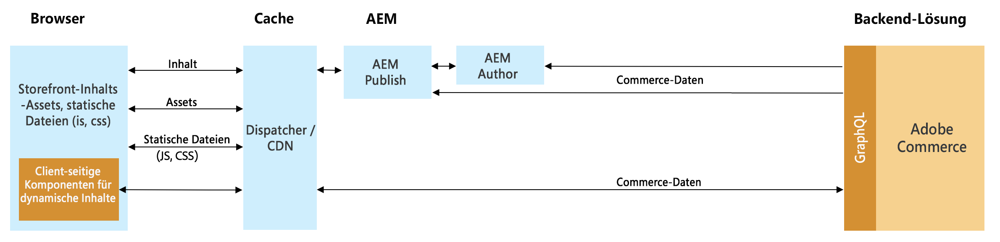
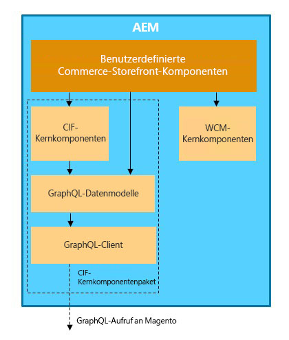

# Integration von AEM und Adobe Commerce (Magento) mithilfe des Commerce Integration Framework {#aem-commerce-framework}

Der Experience Manager und Adobe Commerce werden mithilfe des Commerce Integration Framework (CIF) nahtlos integriert. CIF ermöglicht AEM direkten Zugriff auf die Commerce-Instanz und deren direkte Kommunikation mit der Commerce-Instanz mithilfe von Adobe Commerce [GraphQL-APIs](https://devdocs.magento.com/guides/v2.4/graphql/).

>[!NOTE]
>
> Zur Unterstützung der GraphQL-API ist mindestens die Version 2.3.5 erforderlich. Bestimmte Funktionen werden nur von neueren Versionen oder nur von der Adobe Commerce-Edition unterstützt.

## Architekturüberblick {#overview}

Die Gesamtarchitektur sieht wie folgt aus:

In CIF werden serverseitige und Client-seitige Kommunikationsmuster unterstützt.
Server-seitige API-Aufrufe werden mithilfe des integrierten, generischen [GraphQL-Client](https://github.com/adobe/commerce-cif-graphql-client) in Kombination mit [Satz generierter Datenmodelle](https://github.com/adobe/commerce-cif-magento-graphql) für das Commerce-GraphQL-Schema. Darüber hinaus können alle GraphQL-Abfragen oder Mutationen im GQL-Format verwendet werden.

Bei Client-seitigen Komponenten, die mit [React](https://reactjs.org/) erstellt werden, kommt der [Apollo-Client](https://www.apollographql.com/docs/react/) zum Einsatz.

## Architektur mit den AEM CIF-Kernkomponenten {#cif-core-components}

[AEM CIF-Kernkomponenten](https://github.com/adobe/aem-core-cif-components) folgen sehr ähnlichen Design-Mustern und Best Practices wie die [AEM WCM-Kernkomponenten](https://github.com/adobe/aem-core-wcm-components).

Die Geschäftslogik und Backend-Kommunikation mit Adobe Commerce für die AEM CIF-Kernkomponenten werden in Sling-Modellen implementiert. Falls es notwendig ist, diese Logik an projektspezifische Anforderungen anzupassen, kann das Delegationsmuster für Sling-Modelle verwendet werden.

>[!TIP]
>
>Die Seite [Anpassen von AEM CIF-Kernkomponenten](../customizing/customize-cif-components.md) enthält ein detailliertes Beispiel und Best Practices zur Anpassung von CIF-Kernkomponenten.

Innerhalb von Projekten können AEM CIF-Kernkomponenten und benutzerdefinierte Projektkomponenten den konfigurierten Client für einen mit einer AEM-Seite verknüpften Adobe Commerce-Store über eine Sling-kontextsensible Konfiguration abrufen.
