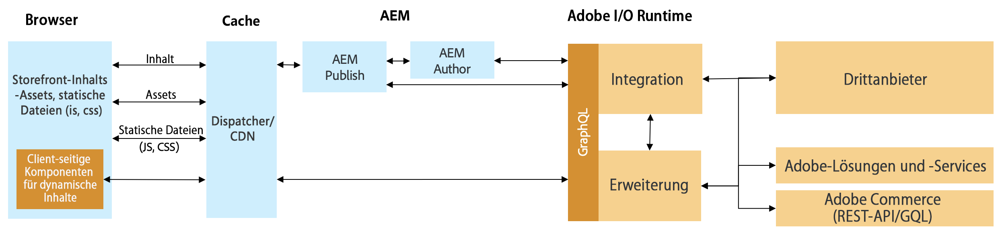

# Handelsintegration von AEM und Drittanbietern mithilfe des Commerce Integration Framework {#aem-third-party}

Die Integration von Lösungen außerhalb von Adobe Commerce ist ein häufiges Szenario für CIF. Drittanbieterlösungen mit verschiedenen APIs und Schemas werden über eine Integrationsschicht verbunden.

## Architektur {#architecture}

Die Gesamtarchitektur sieht wie folgt aus:

Diese Integrationsschicht dient der Zuordnung von Drittanbieter-APIs und -Schemas zu den unterstützten Adobe Commerce GraphQL-APIs und -Schemas außerhalb des Experience Managers. Dank dieser Kapselung können die Integrationslogik und -systeme aktualisiert werden, ohne den Code in Experience Manager zu ändern.

## Lösungsanforderungen für eine Integration

Da Experience Manager Daten bei Bedarf abruft, sind für den Produktkatalog Echtzeit-APIs erforderlich.

>[!TIP]
>
>Wenn keine Echtzeit-APIs verfügbar sind, sollte für die Integration ein externer Produkt-Cache mit APIs verwendet werden. Beispiel: [Magento open-source](https://business.adobe.com/products/magento/open-source.html).

Es ist nicht erforderlich, das vollständige GraphQL-Schema zu implementieren, sondern nur die Objekte des Schemas, um die gewünschten Anwendungsfälle zu ermöglichen.

## Backend-Anwendungsfälle

CIF erweitert Experience Manager mit Echtzeit-Produktkatalogzugriff und Tools für das Erlebnis-Management. Diese nahtlose Integration ermöglicht es Autoren, bei Bedarf über eingebettete Benutzeroberflächen auf Commerce-Daten zuzugreifen, ohne den Inhaltskontext verlassen zu müssen.

Die Integration von Produktkatalog-APIs ist erforderlich, um diese Anwendungsfälle zu entsperren.

## Frontend-Anwendungsfälle

[CIF-Kernkomponenten AEM](https://github.com/adobe/aem-core-cif-components) Daten über die CIF-unterstützten Adobe Commerce-APIs abrufen und austauschen. Um Komponenten wiederzuverwenden, müssen die entsprechenden APIs implementiert werden.

Die Empfehlung für leistungskritische clientseitige Komponenten besteht darin, direkt mit der Drittanbieterlösung zu kommunizieren, um Latenzzeiten zu vermeiden.

## Entwickeln einer Integration {#develop-integration}

Wir empfehlen, [Adobe I/O Runtime](https://www.adobe.io/apis/experienceplatform/runtime.html) für die Integrationsschicht. Sie ist im CIF-Add-on für Dritte enthalten. Da sie mit einem Microservice-artigen Ansatz arbeitet, ist sie gut geeignet, einfach mehrere Lösungen zu integrieren.

Die [Referenzimplementierung](https://github.com/adobe/commerce-cif-graphql-integration-reference) ist ein guter Ausgangspunkt für die Erstellung der Integration in Ihre Commerce-Lösung. Sie unterstützt zwar GraphQL, kann aber auch mit jeder anderen Art von API wie REST integriert werden.

Diese Integrationsschicht ist nicht erforderlich, wenn eine Drittanbieterschicht verfügbar ist (z. B. Mulesoft) oder die Integration auf der Drittanbieterlösung aufbaut.

## Vordefinierte Connectoren {#connectors}

Connectoren bieten einen guten Start für Projekte. Sie enthalten eine spezifische Verbindung für Commerce-Lösungen und eine standardmäßige API-Zuordnung. Diese Connectoren werden von Drittanbietern erstellt und nicht von Adobe gepflegt. Bitte wenden Sie sich zur Information an den jeweiligen Partner.

* [SAP Commerce](https://github.com/diconium/commerce-cif-graphql-integration-hybris), erstellt von Diconium
* [Commercetools](https://github.com/diconium/commerce-cif-graphql-integration-commercetool), erstellt von Diconium

>[!TIP]
>
>Obwohl Connectoren Projekten helfen, die Commerce-Integration zu beschleunigen, sind sie nicht Plug-in-Play. Enterprise Commerce-Lösungen sind in der Regel stark angepasst und erfordern eine benutzerdefinierte Integration. Es sind gute Kenntnisse der Commerce-Plattform, der Adobe Commerce GraphQL-Schemata und der Adobe I/O Runtime erforderlich.
