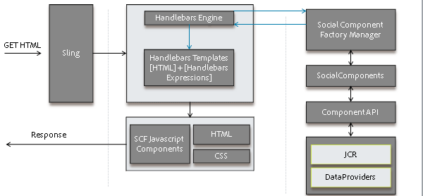

# Aktivitäts-Streams-Funktion {#activity-streams-feature}

## Einführung {#introduction}

The activities of a signed in community member, such as posting to a forum or blog, are collected into a stream which may be filtered and displayed in various ways through configuration of the `Activity Streams` component.

Diese Verfolgungsmöglichkeit bietet eine zusätzliche Art der Aktivitätenansicht, mit der Community-Mitglieder interessanten Beiträgen oder den Aktivitäten anderer Mitglieder folgen können.

Das Dokument beschreibt:

* Hinzufügen der Aktivität Streams-Komponente zu einer AEM-Site
* Konfigurationseinstellungen für die Aktivität Streams-Komponente

### Hinzufügen von Aktivitäts-Streams zu einer Seite {#adding-activity-streams-to-a-page}

If it is desired to add an `Activity Streams` component to a page in author mode, use the component browser to locate

* `Communities / Activity Streams`

und ziehen Sie die Komponente an die gewünschte Stelle auf einer Seite, auf der Aktivitäts-Streams angezeigt werden sollen.

For necessary information, visit [Communities Components Basics](/help/communities/basics.md).

When the [required client-side libraries](/help/communities/essentials-activities.md#essentials-for-client-side) are included, this is how the `Activity Streams` component will appear :

### Konfigurieren von Aktivitäts-Streams {#configuring-activity-streams}

Select the placed `Activity Streams` component to access and select the `Configure` icon which opens the edit dialog.

Auf der Registerkarte **Benutzeraktivitäten** können Sie festlegen, welche Aktivitäten angezeigt werden sollen:

* **Maximale Anzahl von Aktivitäten**

   Die Anzahl der anzuzeigenden Aktivitäten

* **Stream-Ressourcenpfad**

   Leer lassen, um standardmäßig die Community-Site oder Community-Gruppe zu verwenden. Mit dem Stream-Ressourcenpfad wird die Aktivitätenquelle festgelegt. Standardmäßig ist das Feld leer.

* **Ansicht der Benutzeraktivitäten anzeigen**

   Wenn diese Option aktiviert ist, enthält die Seite &quot;Aktivitäten&quot;eine Registerkarte, auf der die Aktivitäten der Filter basieren, die vom aktuellen Mitglied innerhalb der Community generiert wurden. Diese Option ist standardmäßig aktiviert.

* **Ansicht aller Aktivitäten anzeigen**

   Wenn diese Option aktiviert ist, enthält die Seite &quot;Aktivitäten&quot;eine Registerkarte, die alle in der Community generierten Aktivitäten enthält, auf die das aktuelle Mitglied Zugriff hat. Diese Option ist standardmäßig aktiviert.

* **Follower-Ansicht anzeigen**

   Wenn diese Option aktiviert ist, enthält die Seite &quot;Aktivitäten&quot;eine Registerkarte, auf der die Aktivitäten der Filter basieren, die vom aktuellen Member ausgeführt werden. Diese Option ist standardmäßig aktiviert.

### FOLGENDE Ansicht {#following-view}

Komponenten müssen konfiguriert werden, um Folgendes zu aktivieren. Folgende Funktionen sind zulässig: [Blog](/help/communities/blog-feature.md), [Forum](/help/communities/forum.md), [QnA](/help/communities/working-with-qna.md), [Kalender](/help/communities/calendar.md), [Dateibibliothek](/help/communities/file-library.md)undKommentare.

Über die Schaltfläche &quot; **Folgen** &quot;können Sie Einträgen wie Aktivitäten, [Benachrichtigungen](/help/communities/notifications.md)oder [Abonnement](/help/communities/subscriptions.md)folgen. Bei jeder Auswahl der Schaltfläche &quot; **Folgen** &quot;können Sie eine Auswahl ein- oder ausschalten. Die `Email Subscriptions` Auswahl ist nur bei der Konfiguration vorhanden.

Wenn eine der folgenden Methoden ausgewählt ist, wird der Text der Schaltfläche in **Folgendem** geändert. Aus praktischen Gründen ist es möglich, alle Methoden `Unfollow All` zu deaktivieren.

Die Schaltfläche **Folgen** wird angezeigt

* beim Anzeigen des Profils eines anderen Mitglieds
* auf einer Hauptseite mit Funktionen wie Foren, QnA und Blogs

   * folgt allen Aktivitäten für diese allgemeine Funktion

* für einen bestimmten Eintrag, z. B. ein Forenthema, eine Frage zur Beantwortung einer Frage oder einen Blog-Artikel

   * folgt allen Aktivitäten für diesen spezifischen Eintrag

### Zusätzliche Informationen {#additional-information}

Weitere Informationen finden Sie auf der Entwickler-Seite [Aktivitäts-Streams-Grundlagen](/help/communities/essentials-activities.md).
