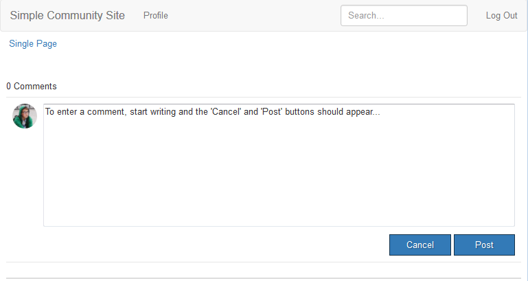

# Clientlibs hinzufügen{#add-clientlibs}

## Hinzufügen eines ClientLibraryFolder (clientlibs) {#add-a-clientlibraryfolder-clientlibs}

Erstellen Sie einen ClientLibraryFolder-Namen, `clientlibs`der die JS- und CSS-Dateien enthält, die zum Rendern der Seiten Ihrer Site verwendet werden.

Der `categories`Eigenschaftswert, der dieser Client-Bibliothek gegeben wird, ist der Bezeichner, der verwendet wird, um diese clientlib direkt von einer Inhaltsseite einzubeziehen oder sie in andere clientlibs einzubetten.

1. using **CRXDE Lite**, expand `/etc/designs`

1. Rechtsklick `an-scf-sandbox` und Auswahl `Create Node`

   * Name : `clientlibs`
   * Typ : `cq:ClientLibraryFolder`

1. click **OK**


Geben Sie auf der Registerkarte &quot; **Eigenschaften** &quot;für den neuen `clientlibs` Knoten die Eigenschaft **`categories`** ein:

* Name:**Kategorien**
* Typ:**String**
* Wert: **apps.an-scf-sandbox**
* click **Add**
* click **Save All**

Hinweis: dem Kategoriewert &quot;apps&quot;voranstellen. ist eine Konvention, die &#39;besitzende Anwendung&#39; als im Ordner /apps, nicht als /libs identifiziert.  WICHTIG: Fügen Sie Platzhalter `js.tx`zu und**`css.tx`**t Dateien hinzu. (Es handelt sich nicht offiziell um cq:ClientLibraryFolder ohne diese.)

1. right click **`/etc/designs/an-scf-sandbox/clientlibs`**
1. wählen Sie Datei **erstellen...**
1. **enter** Name: `css.txt`
1. wählen Sie Datei **erstellen...**
1. **enter** Name: `js.txt`
1. click **Save All**


Die erste Zeile der Dateien &quot;css.txt&quot;und &quot;js.txt&quot;identifiziert den Basisort, von dem aus die folgenden Dateilisten zu finden sind.

Versuchen Sie, den Inhalt von &quot;css.txt&quot;auf

```
#base=.
 style.css
```

Erstellen Sie dann eine Datei unter clientlibs mit dem Namen style.css und stellen Sie den Inhalt auf

`body {`

`background-color: #b0c4de;`

`}`

### SCF Clientlibs einbetten {#embed-scf-clientlibs}

Geben Sie auf der Registerkarte **Eigenschaften** für den `clientlibs` Knoten die Eigenschaft mit mehreren Werten **embed** ein. Dadurch werden die erforderlichen [clientseitigen Bibliotheken (clientlibs) für SCF-Komponenten](/help/communities/client-customize.md#clientlibs-for-scf)eingebettet. Für dieses Tutorial werden viele clientlibs hinzugefügt, die für die Communities-Komponenten erforderlich sind.

**Beachten Sie** , dass dies der gewünschte Ansatz für eine Produktionssite sein kann oder nicht, da es Hinweise zur Bequemlichkeit im Vergleich zur Größe/Geschwindigkeit der für jede Seite heruntergeladenen clientlibs gibt.

Wenn Sie nur eine Funktion auf einer Seite verwenden, könnten Sie die vollständige clientlib dieser Funktion direkt auf der Seite einfügen, z. B. &lt;% ui:includeClientLib categories=cq.social.hbs.forum&quot; %>

In diesem Fall, einschließlich aller und so die einfacheren SCF clientlibs, die Autor clientlibs sind bevorzugt werden:

* Name : **`embed`**
* Typ : **`String`**
* Klick **`Multi`**
* Wert: **`cq.social.scf`***&lt;enter> öffnet ein Dialogfenster und klickt auf **[+] **nach jedem Eintrag, um die folgenden clientlib-Kategorien hinzuzufügen:*

   * **`cq.ckeditor`**
   * **`cq.social.author.hbs.comments`**
   * **`cq.social.author.hbs.forum`**
   * **`cq.social.author.hbs.rating`**
   * **`cq.social.author.hbs.reviews`**
   * **`cq.social.author.hbs.voting`**
   * click **OK**

* click **Save All**


So `/etc/designs/an-scf-sandbox/clientlibs` sollte es nun im Repository erscheinen:


### Clientlibs in PlayPage-Vorlage einschließen {#include-clientlibs-in-playpage-template}

Ohne Einbeziehung der Kategorie &quot; `apps.an-scf-sandbox` ClientLibraryFolder&quot;auf der Seite sind die SCF-Komponenten nicht funktionsfähig oder gestylt, da die erforderlichen JavaScript(s) und Stile(s) nicht verfügbar sind.

Beispielsweise wird die Komponente &quot;SCF-Kommentare&quot;ohne Einbeziehung der clientlibs unformatiert angezeigt:



Sobald apps.an-scf-sandbox clientlibs enthalten ist, wird die Komponente &quot;SCF-Kommentare&quot;mit einem Stil angezeigt:


Die Include-Anweisung gehört zum <head><meta http-equiv="Content-Type" content="text/html; charset=UTF-8"> Abschnitt <html> script. Die Standardeinstellung **`foundation head.jsp`** enthält ein Skript, das überlagert werden kann: **`headlibs.jsp`**.

**Kopieren Sie &quot;headlibs.jsp&quot;und schließen Sie clientlibs ein:**

1. using **CRXDE Lite**, select **`/libs/foundation/components/page/headlibs.jsp`**

1. Klicken Sie mit der rechten Maustaste und wählen Sie **Kopieren ** (oder wählen Sie Kopieren aus der Symbolleiste)
1. auswählen**`/apps/an-scf-sandbox/components/playpage`**
1. Klicken Sie mit der rechten Maustaste und wählen Sie **Einfügen **(oder wählen Sie Einfügen in der Symbolleiste aus)
1. Doppelklicken **`headlibs.jsp`** zum Öffnen
1. an das Dateiende folgende Zeile anhängen
   **`<ui:includeClientLib categories="apps.an-scf-sandbox"/>`**

1. click **Save All**

```xml
<%@ page session="false" %><%
%><%@include file="/libs/foundation/global.jsp" %><%
%><ui:includeClientLib categories="cq.foundation-main"/><%
%>
<cq:include script="/libs/cq/cloudserviceconfigs/components/servicelibs/servicelibs.jsp"/>
<% currentDesign.writeCssIncludes(pageContext); %>
<ui:includeClientLib categories="apps.an-scf-sandbox"/>
```

Laden Sie Ihre Website in den Browser und sehen Sie, ob der Hintergrund kein Schatten von Blau ist.

[https://localhost:4502/content/an-scf-sandbox/en/play.html](https://localhost:4502/content/an-scf-sandbox/en/play.html)


### Bisher sparen Sie Ihre Arbeit {#saving-your-work-so-far}

An dieser Stelle gibt es eine minimalistische Sandbox, und es könnte sich lohnen, als Paket zu speichern, sodass Sie beim Abspielen, wenn Ihr Repository beschädigt wird und Sie von vorn beginnen möchten, Ihren Server ausschalten, den Ordner crx-quickstart/ umbenennen oder löschen, Ihren Server einschalten, das gespeicherte Paket hochladen und installieren können und diese grundlegendsten Schritte nicht wiederholen müssen.

Dieses Paket gibt es im Tutorial [Erstellen einer Beispielseite](/help/communities/create-sample-page.md) für diejenigen, die nicht warten können, einfach zu springen und spielen!...

So erstellen Sie ein Paket:

* Klicken Sie in CRXDE Lite auf das Symbol [Paket](https://localhost:4502/crx/packmgr/)
* click **Create Package**

   * Paketname: an-scf-sandbox-minimal-pkg
   * Version: 0,1
   * Gruppe: &lt;Als Standard beibehalten>
   * click **OK**

* click **Edit**

   * **Filter **Registerkarte

      * click **Add filter**
      * Stammpfad: &lt;browse to** /apps/an-scf-sandbox**>
      * click **Done**
      * click **Add filter**
      * Stammpfad: &lt;suchen Sie nach **/etc/designs/an-scf-sandbox**>
      * click **Done**
      * click **Add filter**
      * Stammpfad: &lt;Durchsuchen zu **/content/an-scf-sandbox**>
      * click **Done**
   * click **Save**


* click **Build**

Jetzt können Sie &quot; **Herunterladen** &quot;auswählen, um es auf der Festplatte zu speichern und Paket **an anderer Stelle** hochzuladen, sowie **Mehr > Replizieren** wählen, um die Sandbox an eine Instanz im Veröffentlichungsmodus von localhost zu verschieben, um den Bereich Ihrer Sandbox zu erweitern.