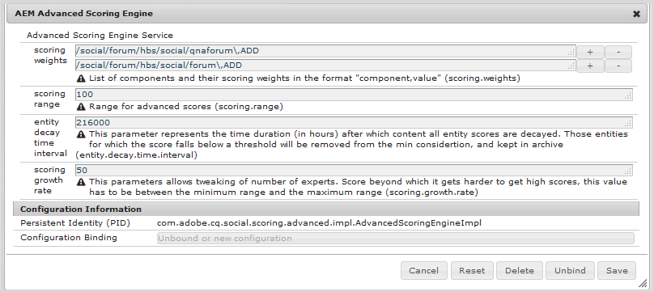

# Erweiterte Scoring- und Badges{#advanced-scoring-and-badges}

## Übersicht {#overview}

Die erweiterte Bewertung ermöglicht die Vergabe von Abzeichen, um Mitglieder als Experten zu identifizieren. Bei der erweiterten Auswertung werden Punkte anhand der von einem Mitglied erstellten Menge *und* Qualität des Inhalts zugewiesen, während bei der einfachen Auswertung Punkte einfach auf der Grundlage der erstellten Inhaltsmenge zugewiesen werden.

Dieser Unterschied beruht auf der Scoring-Engine, die zur Berechnung der Werte verwendet wird. Die grundlegende Scoring-Engine wendet einfache Mathematik an. Die erweiterte Scoring-Engine ist ein adaptiver Algorithmus, der aktive Mitglieder belohnt, die wertvolle und relevante Inhalte beisteuern, die durch die natürliche Sprachverarbeitung (NLP) eines Themas abgeleitet werden.

Neben der Inhaltsrelevanz berücksichtigen die Scoring-Algorithmen Mitgliederaktivitäten wie Abstimmung und Prozentsatz der Antworten. Während die grundlegende Bewertung sie quantitativ beinhaltet, verwendet die erweiterte Auswertung sie algorithmisch.

Daher benötigt die erweiterte Scoring-Engine genügend Daten, um die Analyse sinnvoll zu gestalten. Die Erfolgsschwelle für die Expertenaktivität wird ständig neu bewertet, da sich der Algorithmus kontinuierlich an die Menge und Qualität der erstellten Inhalte anpasst. Es gibt auch ein Konzept von *decay* für ältere Beiträge eines Mitglieds. Wenn ein Expertenmitglied nicht mehr an der Materie teilnimmt, in der er einen Expertenstatus erlangt hat, könnte es an einem bestimmten Punkt (siehe [Konfiguration der Scoring-Engine](#configurable-scoring-engine)) seinen Status als Experte verlieren.

Die Einrichtung der erweiterten Auswertung ist praktisch identisch mit der grundlegenden Auswertung:

* Grundlegende und erweiterte Scoring- und Badging-Regeln werden [auf Inhalte](/help/communities/implementing-scoring.md#apply-rules-to-content) auf die gleiche Weise angewendet.

   * Einfache und erweiterte Scoring- und Badging-Regeln können auf denselben Inhalt angewendet werden.

* [Die Aktivierung von Abzeichen für ](/help/communities/implementing-scoring.md#enable-badges-for-component) Komponenten ist generisch.

Bei der Einrichtung der Scoring- und Badging-Regeln gibt es folgende Unterschiede:

* Konfigurierbare erweiterte Scoring-Engine
* Erweiterte Scoring-Regeln:

   * `scoringType` auf `advanced` festlegen
   * Erfordert `stopwords`

* Erweiterte Badging-Regeln:

   * `badgingType` auf `advanced` festlegen
   * `badgingLevels` auf die  **Anzahl der zu vergebenden Expertenebenen**
   * Erfordert das `badgingPaths`-Array von Badges anstelle von Schwellenwerten für Array-Zuordnungspunkten zu Badges.

>[!NOTE]
>
>Um erweiterte Scoring- und Badging-Funktionen zu verwenden, installieren Sie das [Expertenerkennungspaket](https://www.adobeaemcloud.com/content/marketplace/marketplaceProxy.html?packagePath=/content/companies/public/adobe/packages/cq640/social/cq-social-expert-identification-pkg).

## Konfigurierbare Scoring-Engine {#configurable-scoring-engine}

Die erweiterte Scoring-Engine bietet eine OSGi-Konfiguration mit Parametern, die sich auf den erweiterten Scoring-Algorithmus auswirken.



* **Scoring-Gewichtungen**

   Geben Sie für ein Thema das Verb an, dem bei der Berechnung des Ergebnisses die höchste Priorität eingeräumt werden soll. Es können ein oder mehrere Themen eingegeben werden, jedoch auf **ein Verb pro Thema** beschränkt. Siehe [Themen und Verben](/help/communities/implementing-scoring.md#topics-and-verbs).
Wird als `topic,verb` mit Escapezeichen eingegeben. Beispiel:
   `/social/forum/hbs/social/forum\,ADD`
Standardmäßig ist das ADD-Verb für QnA- und Forenkomponenten festgelegt.

* **Scoring-Bereich**

   Der Bereich für erweiterte Bewertungen wird durch diesen Wert (maximal mögliche Punktzahl) und 0 (niedrigstmögliche Punktzahl) definiert.

   Der Standardwert ist 100, sodass der Scoring-Bereich zwischen 0 und 100 liegt.

* **Zeitintervall für Entitätsverfall**

   Dieser Parameter stellt die Anzahl der Stunden dar, nach denen alle Entitätsbewertungen veraltet sind. Dies ist erforderlich, um alte Inhalte nicht mehr in Bewertungen für eine Community-Site aufzunehmen.

   Der Standardwert ist 216000 Stunden (~24 Jahre).

* **Scoring-**
WachstumsrateDies gibt den Wert zwischen 0 und dem Scoring-Bereich an, über den das Wachstum hinausgeht, um die Anzahl der Experten zu begrenzen.

   Der Standardwert ist 50.

## Erweiterte Scoring-Regeln {#advanced-scoring-rules}

Bei der grundlegenden Bewertung ist die zum Verdienen eines Abzeichens erforderliche Menge bekannt.

Bei der erweiterten Auswertung wird die benötigte Menge ständig angepasst, basierend auf der Menge an Qualitätsdaten innerhalb des Systems. Die Auswertung wird kontinuierlich so berechnet, dass sie einer Glockenkurve ähnelt.

Wenn ein Mitglied ein Expertenabzeichen für ein Thema erhält, das nicht mehr aktiv ist, besteht die Möglichkeit, dass es aufgrund des Verfalls im Laufe der Zeit sein Abzeichen verliert.

### scoringType {#scoringtype}

Eine Scoring-Regel ist ein Satz von Scoring-Unterregeln, von denen jede den Wert `scoringType` deklariert.

Um die erweiterte Scoring-Engine aufzurufen, sollte `scoringType`auf `advanced` eingestellt sein.

Siehe [Scoring-Unterregeln](/help/communities/implementing-scoring.md#scoring-sub-rules).


### Stoppwörter {#stopwords}

Das erweiterte Scoring-Paket installiert einen Konfigurationsordner, der eine stopwords -Datei enthält:

* `/libs/settings/community/scoring/configuration/stopwords`

Der erweiterte Scoring-Algorithmus verwendet die Liste der in der Stoppwörter-Datei enthaltenen Wörter, um häufig verwendete englische Wörter zu identifizieren, die bei der Inhaltsverarbeitung ignoriert werden.

Es ist nicht zu erwarten, dass diese Datei geändert wird.

Wenn die Stoppwörter-Datei fehlt, gibt die erweiterte Scoring-Engine einen Fehler aus.

## Erweiterte Badging-Regeln {#advanced-badging-rules}

Die Eigenschaften der erweiterten Badging-Regel unterscheiden sich von den Eigenschaften der [grundlegenden Badging-Regel](/help/communities/implementing-scoring.md#badging-rules).

Anstatt Punkte mit einem Badge-Bild zu verknüpfen, ist es nur erforderlich, die Anzahl der zulässigen Experten und das zu vergebende Badge-Bild zu identifizieren.


<table>
 <tbody>
  <tr>
   <th>Eigenschaft</th>
   <th>Typ</th>
   <th>Wert Beschreibung</th>
  </tr>
  <tr>
   <td>badgingPath</td>
   <td>Zeichenfolge[]</td>
   <td><em>(Erforderlich)</em> Eine mehrwertige Zeichenfolge von Badge-Bildern bis zur Anzahl der badgingLevels. Die Badge-Bildpfade müssen so angeordnet sein, dass der erste an den höchsten Fachmann vergeben wird. Wenn es weniger Abzeichen gibt, als durch badgingLevels angegeben, füllt das letzte Abzeichen im Array den Rest des Arrays aus. Beispieleintrag:<br /> <code>/libs/settings/community/badging/images/expert-badge/jcr:content/expert.png</code></td>
  </tr>
  <tr>
   <td>badgingLevels</td>
   <td>Long</td>
   <td><em>(Optional)</em> Gibt den Umfang des zu vergebenden Fachwissens an. Wenn es beispielsweise einen <code>expert </code>und einen <code>almost expert</code> (zwei Abzeichen) geben sollte, sollte der Wert auf 2 gesetzt werden. BadgingLevel sollte mit der Anzahl der von Experten verwendeten Badge-Bilder übereinstimmen, die für die badgingPath -Eigenschaft aufgelistet sind. Der Standardwert ist 1.</td>
  </tr>
  <tr>
   <td>badgingType</td>
   <td>Zeichenfolge</td>
   <td><em>(Erforderlich)</em> Identifiziert die Scoring-Engine als "Basis"oder "Erweitert". Auf "Erweitert"gesetzt, andernfalls ist der Standardwert "Standard".</td>
  </tr>
  <tr>
   <td>scoringRules</td>
   <td>Zeichenfolge[]</td>
   <td><em>(Optional)</em> Eine Zeichenfolge mit mehreren Werten, um die Badging-Regel auf die von den aufgelisteten Scoring-Regeln identifizierten Scoring-Ereignisse zu beschränken.<br /> Beispieleintrag: <br /> <code>/libs/settings/community/scoring/rules/adv-comments-scoring</code><br /> Der Standardwert ist keine Einschränkung.</td>
  </tr>
 </tbody>
</table>

## Einbezogene Regeln und Zeichen {#included-rules-and-badge}

### Include Badge {#included-badge}

Diese Beta-Version beinhaltet ein belohnungsbasiertes Expertenabzeichen:

* `expert`

   `/libs/settings/community/badging/images/expert-badge/jcr:content/expert.png`


Damit das Expertenabzeichen als Belohnung für Aktivitäten angezeigt wird, stellen Sie Folgendes sicher:

* `Badges` für die Funktion aktiviert sind, z. B. eine Forum- oder QnA-Komponente.

* Erweiterte Scoring- und Badging-Regeln werden auf die Seite (oder den Vorgänger) angewendet, auf der die Komponente platziert wird

Siehe Grundlegende Informationen für:

* [Aktivieren von Abzeichen für eine Komponente](/help/communities/implementing-scoring.md#enableforcomponent)
* [Regeln anwenden](/help/communities/implementing-scoring.md#applytopage)

### Einbezogene Scoring-Regeln und Unterregeln {#included-scoring-rules-and-sub-rules}

In der Beta-Version sind zwei erweiterte Scoring-Regeln für die [Forenfunktion](/help/communities/functions.md#forum-function) enthalten (jeweils eine für die Foren- und Kommentarkomponenten der Forumsfunktion):

1. `/libs/settings/community/scoring/rules/adv-comments-scoring`

   ```
   subRules[] =
   /libs/settings/community/scoring/rules/sub-rules/adv-comments-rule
   /libs/settings/community/scoring/rules/sub-rules/adv-voting-rule-owner
   /libs/settings/community/scoring/rules/sub-rules/adv-voting-rule
   ```

1. `/libs/settings/community/scoring/rules/adv-forums-scoring`

   ```
   subRules[] =
   /libs/settings/community/scoring/rules/sub-rules/adv-forums-rule
   /libs/settings/community/scoring/rules/sub-rules/adv-comments-rule
   /libs/settings/community/scoring/rules/sub-rules/adv-voting-rule-owner
   ```

**Anmerkungen:**

* Die Knoten `rules` und `sub-rules` weisen den Typ `cq:Page` auf.
* `subRules` ist ein Attribut vom Typ `[]` String im  `jcr:content` Knoten der Regel.
* `sub-rules` kann für verschiedene Scoring-Regeln freigegeben werden.
* `rules` sollte sich in einem Repository-Speicherort mit Leseberechtigung für alle befinden.
* Regelnamen müssen unabhängig vom Speicherort eindeutig sein.

### Einbezogene Badging-Regeln {#included-badging-rules}

In der Version sind zwei erweiterte Badging-Regeln enthalten, die den [erweiterten Foren und Kommentar-Scoring-Regeln](#included-scoring-rules-and-sub-rules) entsprechen.

* `/libs/settings/community/badging/rules/adv-comments-badging`
* `/libs/settings/community/badging/rules/adv-forums-badging`

**Anmerkungen:**

* `rules` -Knoten sind vom Typ cq:Page.
* `rules` sollte sich in einem Repository-Speicherort mit Leseberechtigung für alle befinden.
* Regelnamen müssen unabhängig vom Speicherort eindeutig sein.
