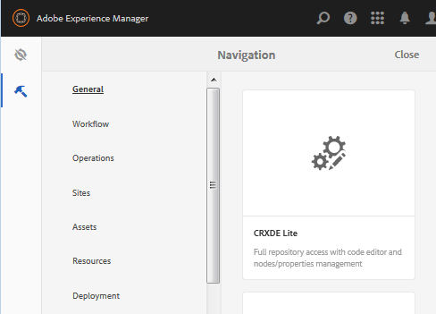

# Erstellen einer SCF-Sandbox  {#create-an-scf-sandbox}

Ab AEM 6.1 Communities ist es am einfachsten, eine Sandbox schnell zu erstellen, eine Community-Site zu erstellen. Siehe [Erste Schritte mit AEM Communities](getting-started.md).

Ein weiteres nützliches Tool für Entwickler ist die [Handbuch zu Community-Komponenten](components-guide.md), die die Erforschung und schnelle Prototypisierung von Communities-Komponenten und -Funktionen ermöglicht.

Die Erstellung einer Website kann nützlich sein, um die Struktur einer AEM Website zu verstehen, die Community-Funktionen enthalten kann, und gleichzeitig einfache Seiten bereitstellen, auf denen Sie die Arbeit mit der [Social Component Framework (SCF)](scf.md).

Dieses Tutorial richtet sich in erster Linie an Entwickler, die neu bei AEM sind und an der Verwendung von SCF-Komponenten interessiert sind. Er führt durch die Erstellung einer SCF-Sandbox-Site, ähnlich dem Tutorial für [So erstellen Sie eine vollständig vorgestellte Internet-Website](../../help/sites-developing/website.md) , das sich auf Site-Strukturen wie Navigation, Logo, Suche, Symbolleiste und Auflistung untergeordneter Seiten konzentriert.

Die Entwicklung erfolgt auf einer Autoreninstanz, während das Experimentieren mit der Site auf einer Veröffentlichungsinstanz am besten ist.

Die Schritte in diesem Tutorial sind:

* [Einrichten der Website-Struktur](setup-website.md)
* [Erste Sandbox-Anwendung](initial-app.md)
* [Anfänglicher Sandbox-Inhalt](initial-content.md)
* [Entwickeln von Sandbox-Anwendungen](develop-app.md)
* [Clientlibs hinzufügen](add-clientlibs.md)
* [Entwickeln von Sandbox-Inhalten](develop-content.md)

>[!CAUTION]
>
>In diesem Tutorial wird keine Community-Site mit den Funktionen erstellt, die mit der [Communities Sites-Konsole](sites-console.md). In diesem Tutorial wird beispielsweise nicht beschrieben, wie Anmelden, [Social-Anmeldung](social-login.md), Nachrichten, Profile usw.
>
>Wenn eine einfache Community-Site bevorzugt wird, folgen Sie dem [Erstellen einer Beispielseite](create-sample-page.md) Tutorial.

## Voraussetzungen {#prerequisites}

In diesem Tutorial wird davon ausgegangen, dass eine AEM Autoreninstanz und eine AEM Veröffentlichungsinstanz installiert sind, die über Folgendes verfügt: [neueste Version](deploy-communities.md#latest-releases) der Gemeinschaften.

Im Folgenden finden Sie einige hilfreiche Links für Entwickler, die mit der AEM-Plattform neu sind:

* [Erste Schritte](../../help/sites-deploying/deploy.md#getting-started): für die Bereitstellung AEM Instanzen.

   * [Grundlagen](../../help/sites-developing/the-basics.md): für Entwickler von Websites und Funktionen.
   * [Erste Schritte für Autoren](../../help/sites-authoring/first-steps.md): für die Bearbeitung von Seiteninhalten.

## Verwenden der CRXDE Lite-Entwicklungsumgebung {#using-crxde-lite-development-environment}

AEM Entwickler verbringen einen Großteil ihrer Zeit im [CRXDE Lite](../../help/sites-developing/developing-with-crxde-lite.md) Entwicklungsumgebung auf einer Autoreninstanz. CRXDE Lite bietet einen weniger eingeschränkten Zugriff auf das CRX-Repository. Klassische UI-Tools und Touch-optimierte UI-Konsolen bieten einen strukturierteren Zugriff auf bestimmte Bereiche des CRX-Repositorys.

Nach der Anmeldung mit Administratorrechten gibt es verschiedene Möglichkeiten, auf die CRXDE Lite zuzugreifen:

1. Wählen Sie in der globalen Navigation die Option Navigation aus. **[!UICONTROL Tools > CRXDE Lite]**.

   

2. Aus dem [Startseite der klassischen Benutzeroberfläche](http://localhost:4502/welcome.html), scrollen Sie nach unten und klicken Sie auf **[!UICONTROL CRXDE Lite]** im rechten Bereich.

   

3. Direktes Durchsuchen zu `CRXDE Lite`: `<server>:<port>/crx/de`

   Beispiel für eine lokale Autoreninstanz: [http://localhost:4502/crx/de](http://localhost:4502/crx/de)

Um mit CRXDE Lite zu arbeiten, müssen Sie sich mit Entwickler- oder Administratorrechten anmelden. Für die standardmäßige localhost-Instanz können Sie sich mit

* `username: admin`
* `password: admin`

**Beachten Sie** dass bei dieser Anmeldung eine Zeitüberschreitung eintritt und Sie sich regelmäßig erneut anmelden müssen, indem Sie den Pulldown am rechten Ende der Symbolleiste von CRXDe Lite verwenden.

Wenn Sie nicht angemeldet sind, können Sie nicht im JCR-Repository navigieren oder Bearbeitungs-/Speichervorgänge durchführen.

***Im Zweifelsfall melden Sie sich erneut an!***

