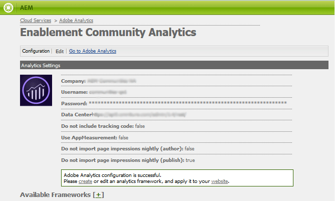

# Analytics Configuration for Communities - Funktionen {#analytics-configuration-for-communities-features}

## Überblick {#overview}

Adobe Analytics und Adobe Experience Manager (AEM) sind beide Lösungen von Adobe Marketing Cloud.

Adobe Analytics kann für AEM Communities konfiguriert werden, sodass Ereignis, die von einem Mitglied mit unterstützten Communities-Funktionen interagieren, an Adobe Analytics gesendet werden, von dem aus Berichte generiert werden.

Wenn beispielsweise ein Mitglied einer Community-Site für die Aktivierung eine Videoressource Ansicht, die ihm zugewiesen wurde, sendet der Ressourcenplayer Ereignis einschließlich Video Heartbeat-Daten an Analytics. Auf der Community-Site können Administratoren verschiedene Berichte zur Wiedergabe des Videos sehen.

Darüber hinaus sind Analysen erforderlich für:

* In der Umgebung &quot;Veröffentlichen&quot;:

   * Berichte zu [Trends in der Community](/help/communities/trends.md)
   * Zulassen der Sortierung von Site-Besuchern nach &quot;am meisten angezeigt&quot;, &quot;am aktivsten&quot;, &quot;am meisten gefällt&quot;
   * Ansicht zählt auf UGC-Listen

* Umgebung des Verfassers:

   * Anzeigen von Beitragsdaten in der [Mitgliederverwaltungskonsole](/help/communities/members.md) (Ansichten, Beiträge, Follower, &quot;Gefällt mir&quot;-Klicks)
   * Trendzusammenfassung, Video Heartbeat und Videogerät für [Berichte über die Aktivierung der Ressourcen](/help/communities/reports.md)

Zu den unterstützten Communities-Funktionen gehören:

* [Aktivierungsressourcen](/help/communities/resources.md)
* [Forum](/help/communities/forum.md)
* [Frage und Antwort](/help/communities/working-with-qna.md)
* [Blog](/help/communities/blog-feature.md)
* [Dateibibliothek](/help/communities/file-library.md)
* [Kalender](/help/communities/calendar.md)

In diesem Abschnitt der Dokumentation wird beschrieben, wie Sie eine Analytics Report Suite mit Communities-Funktionen verbinden. Die grundlegenden Schritte sind:

1. [Replizieren Sie den Verschlüsselungsschlüssel](#replicate-the-crypto-key) , um sicherzustellen, dass Verschlüsselung/Entschlüsselung in allen AEM-Instanzen korrekt ausgeführt wird.
1. Vorbereitung einer Adobe Analytics [Report Suite](#adobe-analytics-report-suite-for-video-reporting)
1. AEM Analytics [Cloud-Dienst](#aem-analytics-cloud-service-configuration) und - [Framework erstellen](#aem-analytics-framework-configuration)

1. [Aktivieren von Analytics](#enable-analytics-for-a-community-site) für eine Community-Site
1. [**Überprüfen **](#verify-analytics-to-aem-variable-mapping)der Variablenzuordnung von Analytics zu AEM
1. Identifizieren Sie den [primären Herausgeber.](#primary-publisher)
1. [Veröffentlichen](#publish-community-site-and-analytics-cloud-service) der Community-Site
1. Konfigurieren des [Imports von Berichtsdaten](#obtaining-reports-from-analytics) aus Adobe Analytics auf die Community-Site

## Voraussetzungen {#prerequisites}

Um die Funktionen von Analytics für Communities zu konfigurieren, müssen Sie mit Ihrem Kundenbetreuer zusammenarbeiten, um ein Adobe Analytics-Konto und eine [Report Suite](#adobe-analytics-report-suite-for-video-reporting)einzurichten. Nach der Festlegung sollten folgende Informationen verfügbar sein:

* **Name der Firma**

   Die Firma, die mit dem Adobe Analytics-Konto verknüpft ist.

* **User Name**

   Der Benutzername für die Anmeldung des Benutzers, der zur Verwaltung des Analytics-Kontos berechtigt ist (sollte Web Service Access-Berechtigungen enthalten).

* **Kennwort**

   Das Anmeldekennwort des autorisierten Benutzers.

* **Analytics Rechenzentrum**

   Die URL des Analytics-Rechenzentrums für das Konto.

* **Report Suite**

   Der Name der verwendeten Analytics-Report Suite.

## Adobe Analytics Report Suite for Video Berichte {#adobe-analytics-report-suite-for-video-reporting}

Mithilfe des [Report Suite Manager](https://docs.adobe.com/content/help/en/analytics/admin/manage-report-suites/new-report-suite/new-report-suite.html)des Adobe Marketing Cloud können Analytics-Report Suites so konfiguriert werden, dass eine Community-Site Berichte für Communities-Funktionen bereitstellen kann.

Durch die Anmeldung bei [Adobe Experience Cloud](https://docs.adobe.com/content/help/en/analytics/analyze/analysis-workspace/home.html) mit [Firmen- und Benutzername](/help/communities/analytics.md#prerequisites)können Sie eine neue oder vorhandene Report Suite für folgende Aufgaben konfigurieren:

* [11 Konversionsvariablen](https://docs.adobe.com/content/help/en/analytics/admin/admin-tools/conversion-variables/conversion-var-admin.html) (eVars)

   * **`evar1`** durch **`evar11`** Aktivierung

   * Kann vorhandene eVars wiederverwenden (umbenennen) oder neue erstellen, die für Communities-Funktionen verwendet werden können

* [7 Erfolgserlebnisse](https://docs.adobe.com/content/help/en/analytics/admin/admin-tools/success-events/success-event.html) (Ereignis)

   * **`event1`** durch **`event7`** Aktivierung

   * type **`Counter`**

      * not **`Counter (no subrelations)`**
   * Kann vorhandene Ereignis wiederverwenden (umbenennen) oder neue erstellen, die für Communities-Funktionen verwendet werden können

   <!--
    NOTE TO WRITER: The following link was broken, so I replaced it. Check for accuracy https://marketing.adobe.com/resources/help/en_US/sc/appmeasurement/hbvideo/video_analytics_config.html 
    -->

* [Videomanagement](https://docs.adobe.com/content/help/en/media-analytics/using/media-overview.html)

   * Video Berichte Console

      * Aktivieren `Video Core`
      * Wählen Sie Speichern aus
   * Video-Core-Messkonsole

      * Wählen Sie nun eine der folgenden Optionen aus `Use Solution Variables`
      * Wählen Sie Speichern aus


Wenn Sie eine **neue Report Suite** verwenden, beachten Sie, dass eine neue Report Suite möglicherweise nur 4 eVars und 6 Ereignis-Variablen enthält, während für Communities 11 eVars und 7 Ereignis Vars erforderlich sind.

Wenn Sie eine **vorhandene Report Suite** verwenden, müssen Sie die Variablenzuordnung [ggf.](#modifying-analytics-variable-mapping) ändern, bevor Sie das Analytics-Framework für eine Community-Site aktivieren. Wenden Sie sich an Ihren Kundenbetreuer, wenn Sie Bedenken hinsichtlich der Variablen für Communities haben.

>[!CAUTION]
>
>**Wenn Sie eine vorhandene Report Suite verwenden, die bereits Variablen in**
>
>* **`evar1`** bis **`evar11`**
   >
   >
* **`event1`** bis **`event7`**
>
>
**Bevor die Community-Site veröffentlicht wird,** müssen Sie die bereits vorhandene Zuordnung wiederherstellen, indem Sie die AEM-Variablen verschieben, die automatisch den Analytics-Variablen zugeordnet wurden, wenn Analytics für eine Community-Site aktiviert wurde.
>
>Informationen zum Wiederherstellen der bereits vorhandenen Zuordnung und Verschieben von AEM-Variablen in andere Analytics-Variablen finden Sie im Abschnitt zum [Ändern der Analytics-Variablenzuordnung](#modifying-analytics-variable-mapping).
>
>Andernfalls kann es zu nicht wiederherstellbaren Datenverlusten kommen.

### Video Heartbeat Analytics {#video-heartbeat-analytics}

Wenn Video Heartbeat Analytics lizenziert ist, `Marketing Cloud Org Id` wird ein Element zugewiesen.

So aktivieren Sie Video Heartbeat Berichte nach der [Konfiguration der Analytics Report Suite für Video Berichte](#adobe-analytics-report-suite-for-video-reporting):

* Erstellen eines [Analytics Cloud-Dienstes](#aem-analytics-cloud-service-configuration)
* Aktivieren von [Analytics für eine Community-Site](#enable-analytics-for-a-community-site)
* Verknüpfen Sie die `Marketing Cloud Org Id` Datei mit der Community-Site.

Die `Marketing Cloud Org Id` Variable kann zum Zeitpunkt der [Community-Site-Erstellung](/help/communities/sites-console.md#enablement) oder später eingegeben werden, indem die Eigenschaften der Community-Site [geändert](/help/communities/sites-console.md#modifying-site-properties) werden. [](#aem-analytics-cloud-service-configuration)


Wenn Video Heartbeat Analytics aktiviert ist, instanziiert der JavaScript-(JS-)Code für den Videoplayer den Video Heartbeat Library-Code (auch in JS), der die gesamte Logik zum Senden von Videostatusaktualisierungen an die Analytics-Videoverfolgungsserver alle 10 Sekunden (nicht konfigurierbar) verarbeitet und schließlich einen kumulativen Bericht der Videositzung an die wichtigsten Analytics-Server sendet.

Ist diese Option nicht aktiviert, wird der Video Heartbeat-Code nie instanziiert und nur die Videoverfolgung und die Verfolgung der Wiederaufnahme-Position bleiben zum Berichte auf SRP beschränkt.

## AEM Analytics Cloud Service-Konfiguration {#aem-analytics-cloud-service-configuration}

So erstellen Sie eine neue Analytics-Integration, die Adobe Analytics mit der AEM-Community-Site integriert, unter Verwendung der Standardbenutzeroberfläche in der Autoreninstanz:

* Aus globaler Navigation: **[!UICONTROL Werkzeuge > Bereitstellung > Cloud Service]**
* Scroll-down to **[!UICONTROL Adobe Analytics]**
* Wählen Sie **[!UICONTROL Konfigurationen jetzt]** konfigurieren oder Konfigurationen **[!UICONTROL anzeigen]**


### Dialogfeld &quot;Konfiguration erstellen&quot; {#create-configuration-dialog}

* Klicken Sie auf `[+]` das Symbol neben **[!UICONTROL Verfügbare Konfigurationen]** , um eine neue Konfiguration zu erstellen.

Im Dialogfeld &quot;Konfiguration erstellen&quot;wird die Konfiguration durch die eingegebenen Werte identifiziert.


* **Titel**

   (Erforderlich) Ein Anzeigentitel für die Konfiguration.
Geben Sie z. B. *Enablement Community Analytics ein.*

* **Name**

   (Optional) Wenn kein Name angegeben ist, wird standardmäßig ein gültiger Knotenname verwendet, der aus dem Titel abgeleitet wurde.
For example, enter *communities*

* **Vorlage**

   Wählen Sie nun eine der folgenden Optionen aus `Adobe Analytics Configuration`

* Wählen Sie **Erstellen**

   * Startet die Konfigurationsseite und öffnet `Analytics Settings` das Dialogfeld

### Dialogfeld &quot;Analytics-Einstellungen&quot; {#analytics-settings-dialog}

Die erste Erstellung einer neuen Analytics-Konfiguration führt zur Anzeige der Konfiguration und zu einem neuen Dialogfeld für die Eingabe der Analytics-Einstellungen. Dieser Dialog erfordert die [erforderlichen Kontoinformationen](#prerequisites) , die vom Kundenbetreuer eingeholt werden.


* **Unternehmen**

   Die Firma, die mit dem Adobe Analytics-Konto verknüpft ist.

* **Benutzername**

   Der Anmeldename des Benutzers, der zur Verwaltung des Analytics-Kontos berechtigt ist.

* **Kennwort**

   Das Anmeldekennwort des autorisierten Benutzers.

* **Datenzentrum**

   Wählen Sie das Analytics-Rechenzentrum, in dem die Report Suite gehostet wird.

* **Kein Verfolgungs-Tag zur Seite hinzufügen**

   Als Standard beibehalten (deaktiviert).

* **AppMeasurement verwenden**

   Als Standard beibehalten (deaktiviert).

* **Nachts keine Seitenimpressionen importieren (verfassen)**

   Als Standard beibehalten (deaktiviert).

* **Nachts keine Seitenimpressionen importieren (veröffentlichen)**

   Als Standard beibehalten (deaktiviert).

So speichern Sie die Einstellungen:

* Select **Connect to Analytics**

   * Wenn dies nicht erfolgreich ist,

      * Stellen Sie sicher, dass die Einträge keine Leerzeichen am Anfang enthalten.
      * Testen Sie ein anderes Rechenzentrum.
      * Wenden Sie sich an Ihren Kundenbetreuer.

* Wählen Sie **OK** aus.

   

### Framework erstellen {#create-framework}

Nach der erfolgreichen Konfiguration der grundlegenden Verbindung mit Adobe Analytics müssen Sie ein Framework für die Community-Site erstellen oder bearbeiten. Der Zweck des Frameworks ist die Zuordnung von AEM-Variablen (Communities feature) zu Analytics-Variablen (Report Suite).

* Klicken Sie auf `[+]` das Symbol neben **[!UICONTROL Verfügbare Frameworks]** , um ein neues Framework zu erstellen.

   

* **Titel**

   (Erforderlich) Ein Anzeigentitel für das FrameworkGeben Sie z. B. *Enablement Community Framework* ein.

* **Name**

   (Optional) Wenn kein Name angegeben ist, wird standardmäßig ein gültiger Knotenname verwendet, der aus dem Titel abgeleitet wurde.
For example, enter *communities*.

* *Vorlage*

   Wählen Sie nun eine der folgenden Optionen aus `Adobe Analytics Framework`.

* Wählen Sie **Erstellen**.

Das Erstellen des Analytics-Frameworks öffnet das Framework für die Konfiguration.

## AEM Analytics Framework-Konfiguration {#aem-analytics-framework-configuration}

Der Zweck des Frameworks ist die Zuordnung von AEM-Variablen zu Analytics-Variablen (eVars und Ereignissen). Die für die Zuordnung verfügbaren Analytics-Variablen werden in der Report Suite [definiert](#adobe-analytics-report-suite-for-video-reporting).


### Report Suite auswählen {#select-report-suite}

Wählen Sie die Report Suite aus, die für Video Berichte eingerichtet wurde.

Wenn eine Report Suite noch nicht erstellt oder nicht ordnungsgemäß eingerichtet wurde, lesen Sie den vorherigen Abschnitt:
[Adobe Analytics Report Suite for Video Berichte](#adobe-analytics-report-suite-for-video-reporting)

Der Sidekick ist nicht erforderlich und kann minimiert werden, sodass er den Zugriff auf die Report Suites-Einstellungen nicht behindert.

#### Report Suites Dialogfeld vor und nach Auswahl von &quot;Hinzufügen Element&quot; {#report-suites-dialog-before-and-after-selecting-add-item}


1. Wählen Sie **Hinzufügen Element +**.

   Es werden zwei Dropdownfelder angezeigt.

1. Choose a `Report suite.`

   Die mit dem Firmen-Konto verknüpften Report Suites stehen zur Auswahl zur Verfügung.

1. Wählen Sie **Ja** im angezeigten Dialogfeld aus:

   ```
   Load default server settings?
    Do you want to load the default server settings and overwrite current values in the Server section?
   ```

1. Choose a `Run Mode`.

1. Wählen Sie **Veröffentlichen**.


Der Dienst und das Framework für Analytics sind nun abgeschlossen. Die Zuordnungen werden definiert, sobald eine Community-Site mit diesem Analytics-Dienst erstellt wurde.

## Analytics für eine Community-Site aktivieren {#enable-analytics-for-a-community-site}

### Für neue Community-Site aktivieren {#enable-for-new-community-site}

Hinzufügen des Analytics Cloud-Dienstes beim [Erstellen einer neuen Community-Site](/help/communities/sites-console.md):

* In Schritt 3 unter der Registerkarte &quot; [ANALYTICS&quot;](/help/communities/sites-console.md#analytics):
   * Aktivieren Sie das Kontrollkästchen &quot;Analytics **** aktivieren&quot;.
   * Wählen Sie das Framework aus dem Dropdown-Feld.

* Optional können Sie zur Analytics-Rahmenkonfiguration zurückkehren, um die Variablenzuordnungen anzupassen.

### Für bestehende Community-Site aktivieren {#enable-for-existing-community-site}

Hinzufügen des Analytics Cloud-Dienstes zu einer [bestehenden Community-Site](/help/communities/sites-console.md#modifying-site-properties):

* Navigieren Sie zur Konsole **Communities > Sites** .
* Wählen Sie das Symbol &quot;Site bearbeiten&quot;der Community-Site aus.
* Wählen Sie die EINSTELLUNGEN.
* Abschnitt Analytics:
   * Aktivieren Sie das Kontrollkästchen &quot;Analytics **** aktivieren&quot;.
   * Wählen Sie das Framework aus der Dropdownliste.

* Optional können Sie zur Analytics-Rahmenkonfiguration zurückkehren, um die Variablenzuordnungen anzupassen.

### Aktivieren für benutzerdefinierte Sites {#enable-for-customized-sites}

Damit die Analytics-Verfolgung und der-Import für eine Community-Site ordnungsgemäß funktionieren, muss ein Seitenelement mit den Attributen &quot;class&quot;und &quot;href&quot;vorhanden sein. `scf-js-site-title` Nur ein solches Element sollte auf der Seite vorhanden sein, wie es in einem nicht geänderten `sitepage.hbs` Skript für eine Community-Site der Fall ist. Der Wert von `siteUrl` wird extrahiert und als *Sitepfad* an Adobe Analytics gesendet.

```xml
# present in default sitepage.hbs
# only one scf-js-site-title class should be included
# this example sets it to be hidden as it serves no visual purpose
<div
    class="navbar-brand scf-js-site-title"
    href="{{siteUrl}}.html"
    style="visibility: hidden;"
>
</div>
```

Stellen Sie bei einer **benutzerdefinierten Community-Site** , die das `sitepage.hbs` Skript überlagert, sicher, dass das Element vorhanden ist. Die `siteUrl` Variable wird festgelegt, wenn sie auf dem Server wiedergegeben wird, bevor sie an den Client gesendet wird.

Für eine **generische AEM-Site** , die Communities-Komponenten enthält, aber nicht mit dem [Site-Erstellungsassistenten](/help/communities/sites-console.md)erstellt wurde, muss das Element hinzugefügt werden. Der Wert des href sollte der Pfad zur Site sein. Wenn der Site-Pfad beispielsweise `/content/my/company/en`ist, verwenden Sie:

```xml
<div
    class="navbar-brand scf-js-site-title"
    href="/content/my/company/en.html"
    style="visibility: hidden;"
>
</div>
```

## Analytics für Communities - Funktionen {#analytics-for-communities-features}

Analytics wird automatisch für mehrere Communities-Funktionen verwendet.

Die [OSGi-Konfiguration](/help/sites-deploying/configuring-osgi.md)der Autorenkonfiguration `AEM Communities Analytics Component Configuration`enthält eine Auflistung der Komponenten, die für Analytics instrumentiert wurden. Die automatische Zuordnung von Variablen wird von den aufgeführten Komponenten bestimmt.

Wenn neue benutzerdefinierte Komponenten erstellt werden, die für Analytics instrumentiert werden, sollten sie dieser Liste konfigurierter Komponenten hinzugefügt werden.

### Komponentenkonfiguration {#component-configuration}


>[!NOTE]
>
>Die Protokoll-Komponenten werden zur Implementierung der Blog-Funktion verwendet.


### Analytics zu AEM-Variablen zugeordnet {#mapped-analytics-to-aem-variables}

Sobald die Community-Site mit aktiviertem Analytics und aktiviertem Cloud-Konfigurationsframework gespeichert wurde, werden die AEM-Variablen automatisch den Analytics eVars und Ereignissen zugeordnet, die mit &quot;evar1&quot;bzw. &quot;Ereignis1&quot;beginnen, und um 1 erhöht.

Wenn Sie eine vorhandene Report Suite verwenden, die eine der Variablen in evar1 bis evar11 und Ereignis1 bis Ereignis7 zugeordnet hat, müssen Sie die AEM-Variablen [neu zuordnen und die ursprüngliche Zuordnung wiederherstellen](#modifying-analytics-variable-mapping) .

Im Folgenden finden Sie ein Beispiel für Standardzuordnungen nach dem [Einstieg](/help/communities/getting-started-enablement.md):


#### Zuordnung der mit jedem Ereignis gesendeten eVars {#map-of-evars-sent-with-each-event}

<table>
 <tbody>
  <tr>
   <td><strong> </strong></td>
   <td><strong>Aktivierungsressource<br /><br /> -Typ</strong></td>
   <td><strong>Site<br /> Title</strong></td>
   <td><strong>Funktionstyp<br /></strong></td>
   <td><strong>Gruppentitel<br /></strong></td>
   <td><strong>Group<br /> Path</strong></td>
   <td><strong>UGC<br /> -Typ</strong></td>
   <td><strong>UGC<br /> -Titel</strong></td>
   <td><strong>Benutzer<br /> (Mitglied)</strong></td>
   <td><strong>UGC<br /> -Pfad</strong></td>
   <td><strong>Site<br /> -Pfad</strong></td>
  </tr>
  <tr>
   <td><strong> </strong></td>
   <td><strong>eVar1</strong></td>
   <td><strong>eVar2</strong></td>
   <td><strong>eVar3</strong></td>
   <td><strong>eVar4</strong></td>
   <td><strong>eVar5</strong></td>
   <td><strong>eVar6</strong></td>
   <td><strong>eVar7</strong></td>
   <td><strong>eVar8</strong></td>
   <td><strong>eVar9</strong></td>
   <td><strong>eVar10</strong></td>
  </tr>
  <tr>
   <td><strong>Ereignis1<br /> -Ressourcenwiedergabe</strong></td>
   <td><em>(eine)</em></td>
   <td><em>-</em></td>
   <td><em>-</em></td>
   <td><em>-</em></td>
   <td><em>-</em></td>
   <td><em>-</em></td>
   <td><em>-</em></td>
   <td><em>-</em></td>
   <td><em>(i)</em></td>
   <td><em>-</em></td>
  </tr>
  <tr>
   <td><strong>Ereignis2<br /> SCFView</strong></td>
   <td><em>(eine)</em></td>
   <td><em>(b)</em></td>
   <td><em>(c)</em></td>
   <td><em>(d)</em></td>
   <td><em>(E)</em></td>
   <td><em>(f)</em></td>
   <td><em>(g)</em></td>
   <td><em>(h)</em></td>
   <td><em>(i)</em></td>
   <td><em>j)</em></td>
  </tr>
  <tr>
   <td><strong>Ereignis3<br /> SCFCreate (Post)</strong></td>
   <td><em>-</em></td>
   <td><em>(b)</em></td>
   <td><em>(c)</em></td>
   <td><em>(d)</em></td>
   <td><em>(E)</em></td>
   <td><em>(f)</em></td>
   <td><em>(g)</em></td>
   <td><em>(h)</em></td>
   <td><em>(i)</em></td>
   <td><em>j)</em></td>
  </tr>
  <tr>
   <td><strong>Ereignis4<br /> SCFFollow</strong></td>
   <td><em>-</em></td>
   <td><em>(b)</em></td>
   <td><em>(c)</em></td>
   <td><em>(d)</em></td>
   <td><em>(E)</em></td>
   <td><em>(f)</em></td>
   <td><em>(g)</em></td>
   <td><em>(h)</em></td>
   <td><em>(i)</em></td>
   <td><em>j)</em></td>
  </tr>
  <tr>
   <td><strong>Ereignis5<br /> SCFVoteUp</strong></td>
   <td><em>-</em></td>
   <td><em>(b)</em></td>
   <td><em>(c)</em></td>
   <td><em>(d)</em></td>
   <td><em>(E)</em></td>
   <td><em>(f)</em></td>
   <td><em>(g)</em></td>
   <td><em>(h)</em></td>
   <td><em>(i)</em></td>
   <td><em>j)</em></td>
  </tr>
  <tr>
   <td><strong>Ereignis6<br /> SCFVoteDown</strong></td>
   <td><em>-</em></td>
   <td><em>(b)</em></td>
   <td><em>(c)</em></td>
   <td><em>(d)</em></td>
   <td><em>(E)</em></td>
   <td><em>(f)</em></td>
   <td><em>(g)</em></td>
   <td><em>(h)</em></td>
   <td><em>(i)</em></td>
   <td><em>j)</em></td>
  </tr>
  <tr>
   <td><strong>Ereignis7<br /> SCFRate</strong></td>
   <td><em>-</em></td>
   <td><em>(b)</em></td>
   <td><em>(c)</em></td>
   <td><em>(d)</em></td>
   <td><em>(E)</em></td>
   <td><em>(f)</em></td>
   <td><em>(g)</em></td>
   <td><em>(h)</em></td>
   <td><em>(i)</em></td>
   <td><em>j)</em></td>
  </tr>
 </tbody>
</table>

**Beispiele für eVar-Werte:**

* *[MIME-Typ](https://www.iana.org/assignments/media-types)*: video/mp4
* *[Community-Site-Titel](/help/communities/sites-console.md#step13asitetemplate)*: Geometrixx Communities
* *[Community-Funktionsname](/help/communities/functions.md)*: Forum
* *[Community-Gruppenname](/help/communities/creating-groups.md#creating-a-new-group)*: Wandern
* *Pfad zu Community-Gruppeninhalten*: `/content/sites/<site name>/en/groups/hiking`
* *[UGC component resourceType](/help/communities/essentials.md)*:`social/forum/components/hbs/topic`
* *UGC-Komponententitel*: Wanderthemen
* *login (authorizedId)*: `aaron.mcdonald@mailinator.com`
* *SRP-Pfad zu UGC*: `/content/usergenerated/asi/.../forum/jmtz-topic3`
oder *der Pfad der Komponente, der folgen* soll: `/content/sites/<site name>/en/jcr:content/content/primary/forum`
*Pfad zum Inhalt* der Community-Site: `/content/sites/<site name>/en`

* Analytics-Variablenzuordnung ändern {#modifying-analytics-variable-mapping}*`/content/sites/<site name>/en`

### Die Zuordnung von Analytics eVars und Ereignissen zu AEM-Variablen ist in der Framework-Konfiguration sichtbar, nachdem Analytics für eine Community-Site aktiviert wurde.{#modifying-analytics-variable-mapping}

Nachdem Analytics aktiviert wurde und bevor die Community-Site veröffentlicht wird, kann die Zuordnung im Framework geändert werden, indem die gewünschte Analytics-eVar oder das gewünschte Ereignis aus der linken Leiste gezogen und in die entsprechende Zeile in der Zuordnungstabelle eingefügt wird.

Um Duplikat-Zuordnungen zu vermeiden, müssen Sie die ersetzte Analytics-eVar oder das ersetzte Ereignis aus der Zeile entfernen, indem Sie den Mauszeiger darüber halten und das X auswählen, das rechts neben dem Analytics-Variablenelement angezeigt wird.

Wenn Communities-eVars und -Ereignis Zuordnungen überschreiben, die bereits in der Report Suite vorhanden waren, weisen Sie zur Vermeidung von Datenverlusten die AEM-Variablen für Communities-Funktionen anderen Analytics-eVars oder -Ereignissen zu und stellen Sie die ursprünglichen Zuordnungen wieder her.

[!CAUTION]

>Es ist wichtig zu bleiben, bevor die Community-Site mit aktiviertem Analytics [veröffentlicht](#publishing-the-community-site) wird, da sonst das Risiko des Datenverlusts besteht.
>
>Beispiel Schritt 1: Ziehen von Analytics evar14 in die Zuordnungstabelle {#example-step-dragging-analytics-evar-into-mapping-table}](#publishing-the-community-site)

#### 

Beispiel Schritt 2: Auswahl von &quot;x&quot; zum Entfernen der ersetzten evar11 {#example-step-selecting-x-to-remove-replaced-evar}](assets/chlimage_1-275.png)

#### 

Beispiel Schritt 3: AEM var eventData.siteId wurde der Analytics evar14 zugeordnet {#example-step-aem-var-eventdata-siteid-remapped-to-analytics-evar}](assets/chlimage_1-276.png)

#### 

Veröffentlichen der Community-Site {#publishing-the-community-site}](assets/chlimage_1-277.png)

## Analytics zu AEM-Variablenzuordnung überprüfen {#verify-analytics-to-aem-variable-mapping}

### Es ist sinnvoll, die Variablenzuordnung zu überprüfen, bevor die Community-Site veröffentlicht wird, auf der auch der Analytics Cloud-Dienst und das Framework veröffentlicht werden.{#verify-analytics-to-aem-variable-mapping}

Siehe Abschnitte:

[Analytics zu AEM-Variablen zugeordnet](#mapped-analytics-to-aem-variables)

* [Analytics-Variablenzuordnung ändern](#modifying-analytics-variable-mapping)
* [!CAUTION]](#modifying-analytics-variable-mapping)

>**Wenn Sie eine vorhandene Report Suite verwenden, die bereits Variablen in**
>
>**`evar1`** bis **`evar11`****
>
>* **`event1`** bis **`event7`**
   >
   >
* **Bevor die Community-Site veröffentlicht wird,** müssen Sie die bereits vorhandene Zuordnung wiederherstellen und die AEM-Variablen für Communities, die automatisch zugeordnet wurden (als Analytics für die Community-Site aktiviert wurde), an andere Analytics-Variablen verschieben. Diese Neuzuordnung sollte für alle Communities-Komponenten einheitlich sein.**`event7`**
>
>
**Andernfalls kann es zu nicht wiederherstellbaren Datenverlusten kommen.**
>
>Primär Publisher {#primary-publisher}

### Wenn es sich bei der gewählten Bereitstellung um eine [Veröffentlichungsfarm](/help/communities/topologies.md#tarmk-publish-farm)handelt, muss eine AEM-Veröffentlichungsinstanz als primärer Herausgeber für die Abfrage von Adobe Analytics für Berichtsdaten identifiziert werden, die in [SRP](/help/communities/working-with-srp.md)geschrieben werden sollen.

Standardmäßig identifiziert die `AEM Communities Publisher Configuration` OSGi-Konfiguration die Veröffentlichungsinstanz als primären Herausgeber, sodass sich alle Instanzen im Veröffentlichungsmodus in einer Veröffentlichungsfarm selbst als Primär identifizieren.](/help/communities/topologies.md#tarmk-publish-farm)[](/help/communities/working-with-srp.md)

Daher müssen Sie die Konfiguration in allen sekundären Instanzen im Veröffentlichungsmodus bearbeiten, um das Kontrollkästchen **Primär Publisher** deaktivieren zu können.

Spezifische Anweisungen finden Sie im Abschnitt zum primären Herausgeber unter [Bereitstellen von Communities](/help/communities/deploy-communities.md#primary-publisher).

[!CAUTION]](/help/communities/deploy-communities.md#primary-publisher)

>[!CAUTION]Es ist wichtig, dass der primäre Herausgeber so konfiguriert ist, dass keine Abfrage von mehreren Instanzen im Veröffentlichungsmodus durchgeführt wird.
>
>Crypto-Schlüssel replizieren {#replicate-the-crypto-key}

### Die Adobe Analytics-Anmeldeinformationen werden verschlüsselt. Um die Replizierung oder Übertragung verschlüsselter Analysedaten zwischen Autoren und Herausgebern zu erleichtern, müssen alle AEM-Instanzen denselben primären Verschlüsselungsschlüssel verwenden.{#replicate-the-crypto-key}

Befolgen Sie dazu die Anweisungen unter Crypto-Schlüssel [replizieren](/help/communities/deploy-communities.md#replicate-the-crypto-key).

Veröffentlichen der Community-Site und des Analytics-Cloud Service {#publish-community-site-and-analytics-cloud-service}](/help/communities/deploy-communities.md#replicate-the-crypto-key)

### Sobald der Analytics Cloud-Dienst für eine Community-Site aktiviert wurde und die [Zuordnung von Analytics zu AEM-Variablen erforderlichenfalls angepasst](#mapped-analytics-to-aem-variables)wurde, muss die Konfiguration der Veröffentlichungskonfiguration repliziert werden, indem die Community-Site [veröffentlicht](/help/communities/sites-console.md#publishing-the-site)(erneut)wird.

Berichte von Analytics abrufen {#obtaining-reports-from-analytics}](#mapped-analytics-to-aem-variables)[](/help/communities/sites-console.md#publishing-the-site)

## Berichtsverwaltung {#report-management}

### Die [OSGi-Konfiguration](/help/sites-deploying/configuring-osgi.md)des Autors und des primären Herausgebers `AEM Communities Analytics Report Management`wird zur Abfrage von Analytics verwendet.

Beim Autor werden die Abfragen für Echtzeitberichte verwendet.[](/help/sites-deploying/configuring-osgi.md)`AEM Communities Analytics Report Management`

Beim primären Herausgeber werden die Abfragen verwendet, um Informationen zur Vorbereitung des Analytics-Datenimports des Berichts bereitzustellen.

Das Zeitintervall der Abfrage ist standardmäßig auf 10 Sekunden eingestellt.

Report Importer {#report-importer}

### Sobald eine Analytics-aktivierte Community-Site veröffentlicht wurde, kann die [OSGi-Konfiguration](/help/sites-deploying/configuring-osgi.md)des primären Herausgebers konfiguriert werden, `AEM Communities Analytics Report Importer`um das Standard-Abfrageintervall für die Konfigurationen festzulegen, die in CRXDE nicht einzeln konfiguriert sind.

Das Abfrageintervall steuert die Häufigkeit von Anfragen an Adobe Analytics, die in [SRP](/help/communities/working-with-srp.md)abgerufen und gespeichert werden sollen.`AEM Communities Analytics Report Importer`

Wenn die Daten als &quot;Big Data&quot;kategorisiert werden können, kann eine häufigere Abfrage zu einer hohen Belastung der Community-Site führen.[](/help/communities/working-with-srp.md)

Das **Importintervall** für die Standardabfrage ist auf 12 Stunden eingestellt.


Komponentenberichtsanpassung {#component-report-customization}](assets/chlimage_1-278.png)

### Zur Anpassung der zu verfolgenden Metriken werden derzeit Knoten im Repository erstellt, die Zeiträume definieren, für die ein Bericht zu dieser Metrik erstellt werden soll.{#component-report-customization}

Das Forumthema ist derzeit das einzige Beispiel für diese Anpassung:

Melden Sie sich beim primären Herausgeber mit Administratorrechten an.

* Navigate to [CRXDE Lite](/help/sites-developing/developing-with-crxde-lite.md). For example, [https://localhost:4503/crx/de[#$tu263].
* 

* Beachten Sie die erstellten Zeiträume:`/content/sites/engage/en/jcr:content),`**`analytics/reportConfigs/social_forum_components_hbs_topic`**

* `last30Days`

   * `last90Days`
   * `thisYear`
   * Beachten Sie die `total`Node.

* Das Ändern der **`interval`** Eigenschaft setzt das Report Importer-Intervall außer Kraft.

   * Der Wert wird in Sekunden und auf 4 Stunden (14400 Sekunden) festgelegt.**`interval`**
   * 

Benutzerdaten in Analytics verwalten {#manage-user-data-in-analytics}](assets/chlimage_1-279.png)

## Adobe Analytics stellt APIs bereit, mit denen Sie auf Benutzerdaten zugreifen, sie exportieren und löschen können. Weitere Informationen finden Sie unter Zugriff [senden und Anforderungen[#$tu275]löschen.


## Adobe Experience Cloud: [Hilfe und Referenz zu Analytics[#$tu278]

* 
* AEM: [Analytics with External Providers](/help/sites-administering/external-providers.md)
* AEM: [Analytics with External Providers](/help/sites-administering/external-providers.md)
