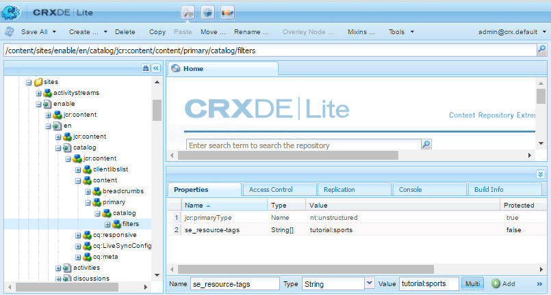

# Analytics-Konfiguration für Communities-Funktionen{#analytics-configuration-for-communities-features}

## Überblick {#overview}

Adobe Analytics und Adobe Experience Manager (AEM) sind beide Lösungen der Adobe Marketing Cloud.

Adobe Analytics kann für AEM Communities konfiguriert werden, sodass bei der Interaktion eines Mitglieds mit unterstützten Communities-Funktionen Ereignisse an Adobe Analytics gesendet werden, aus denen Berichte generiert werden.

Wenn ein Mitglied einer Community-Site für eine Aktivierung beispielsweise eine Videoressource anzeigt, die ihm zugewiesen ist, sendet der Ressourcenplayer Ereignisse, einschließlich Video Heartbeat-Daten. Auf der Community-Site können Administratoren verschiedene Berichte zur Wiedergabe des Videos sehen.

Darüber hinaus sind Analysen erforderlich für:

* in der Veröffentlichungsumgebung:

   * Berichterstattung über [Trends in der Community](/help/communities/trends.md)
   * Site-Besuchern erlauben, nach &quot;am meisten angezeigt&quot;, &quot;am aktivsten&quot;, &quot;am meisten gefällt&quot; zu sortieren
   * Anzahl der Ansichten in UGC-Listen

* in der Autorenumgebung:

   * Anzeige von Beitragsdaten in der [Mitgliederverwaltungskonsole](/help/communities/members.md) (Ansichten, Beiträge, folgt, &quot;Gefällt mir&quot;-Klicks)
   * Trendzusammenfassung, Video Heartbeat und Video-Gerät für [Berichte über die Aktivierung von Ressourcen](/help/communities/reports.md)

Zu den unterstützten Communities-Funktionen gehören:

* [Ressourcen aktivieren](/help/communities/resources.md)
* [Forum](/help/communities/forum.md)
* [Frage und Antwort](/help/communities/working-with-qna.md)
* [blog](/help/communities/blog-feature.md)
* [Dateibibliothek](/help/communities/file-library.md)
* [calendar](/help/communities/calendar.md)

In diesem Abschnitt der Dokumentation wird beschrieben, wie Sie eine Analytics-Report Suite mit Communities-Funktionen verbinden. Die grundlegenden Schritte sind:

1. [Replizieren Sie den Verschlüsselungsschlüssel](#replicate-the-crypto-key) , um sicherzustellen, dass Verschlüsselung/Entschlüsselung in allen AEM-Instanzen korrekt ausgeführt wird.
1. Vorbereitung einer Adobe Analytics- [Report Suite](#adobe-analytics-report-suite-for-video-reporting)
1. AEM Analytics- [Cloud-Dienst](#aem-analytics-cloud-service-configuration) und - [Framework erstellen](#aem-analytics-framework-configuration)

1. [Aktivieren von Analytics](#enable-analytics-for-a-community-site) für eine Community-Site
1. [**Überprüfen **](#verify-analytics-to-aem-variable-mapping)der Zuordnung von Analytics zu AEM-Variablen
1. Identifizieren Sie den [primären Herausgeber.](#primary-publisher)
1. [Veröffentlichen](#publish-community-site-and-analytics-cloud-service) der Community-Site
1. Konfigurieren des [Imports von Berichtsdaten](#obtaining-reports-from-analytics) aus Adobe Analytics auf die Community-Site

## Voraussetzungen {#prerequisites}

Zur Konfiguration der Funktionen von Analytics für Communities müssen Sie mit Ihrem Kundenbetreuer zusammenarbeiten, um ein Adobe Analytics-Konto und eine Adobe Analytics- [Report Suite](#adobe-analytics-report-suite-for-video-reporting)einzurichten. Nach der Festlegung sollten folgende Informationen verfügbar sein:

* Unternehmen, das mit dem Adobe Analytics-Konto verknüpft ist
* Benutzername: der Benutzername für den Benutzer, der zur Verwaltung des Analytics-Kontos berechtigt ist (sollte Web Service Access-Berechtigungen enthalten)

* Kennwort, das Anmeldekennwort für den autorisierten Benutzer
* Analytics Data Center die URL des Analytics-Rechenzentrums für das Konto
* Report Suite der Name der zu verwendenden Analytics Report Suite

## Adobe Analytics Report Suite für Videoberichte {#adobe-analytics-report-suite-for-video-reporting}

Mithilfe des [Report Suite Manager](https://marketing.adobe.com/resources/help/en_US/reference/new_report_suite.html)der Adobe Marketing Cloud können Analytics-Report Suites so konfiguriert werden, dass eine Community-Site Berichte für Communities-Funktionen bereitstellen kann.

Durch die Anmeldung bei der [Adobe Marketing Cloud](https://marketing.adobe.com/resources/help/en_US/analytics/getting-started/analytics-navigation.html) mit [Firmenname und Benutzername](/help/communities/analytics.md#prerequisites)können Sie eine neue oder vorhandene Report Suite so konfigurieren, dass sie Folgendes aufweist:

* [11 Konversionsvariablen](https://marketing.adobe.com/resources/help/en_US/reference/conversion_var_admin.html) (eVars)

   * **`evar1`** durch **`evar11`** Aktivierung

   * kann vorhandene eVars wiederverwenden (umbenennen) oder neue erstellen, die für Communities-Funktionen verwendet werden können

* [7 Erfolgsereignisse](https://marketing.adobe.com/resources/help/en_US/reference/success_event.html) (Ereignisse)

   * **`event1`** durch **`event7`** Aktivierung

   * Typ **`Counter`**

      * not **`Counter (no subrelations)`**
   * kann bestehende Ereignisse wiederverwenden (umbenennen) oder neue Ereignisse erstellen, die für Communities-Funktionen verwendet werden können


* [Videomanagement](https://marketing.adobe.com/resources/help/en_US/sc/appmeasurement/hbvideo/video_analytics_config.html)

   * Videoberichterstellungskonsole

      * freischalten `Video Core`
      * Wählen Sie Save aus.
   * Video-Core-Messkonsole

      * auswählen `Use Solution Variables`
      * Wählen Sie Save aus.


Wenn Sie eine **neue Report Suite** verwenden, beachten Sie, dass eine neue Report Suite möglicherweise nur 4 eVars und 6 Ereignisvariablen hat, während für Communities 11 eVars und 7 Ereignisvariablen erforderlich sind.

Wenn Sie eine **vorhandene Report Suite** verwenden, müssen Sie die Variablenzuordnung[ ggf. ](#modifying-analytics-variable-mapping)ändern, bevor Sie das Analytics-Framework für eine Community-Site aktivieren. Wenden Sie sich an Ihren Kundenbetreuer, wenn Sie Bedenken hinsichtlich der Variablen für Communities haben.

>[!CAUTION]
>
>**Bei Verwendung einer vorhandenen Report Suite, die bereits Variablen in**
>
>* **`evar1`** through **`evar11`**
   >
   >
* **`event1`** through **`event7`**
>
>
**Bevor die Community-Site veröffentlicht wird,** müssen Sie die bereits vorhandene Zuordnung wiederherstellen, indem Sie die AEM-Variablen verschieben, die automatisch Analytics-Variablen zugeordnet wurden, wenn Analytics für eine Community-Site aktiviert wurde.
>
>Informationen zum Wiederherstellen der bereits vorhandenen Zuordnung und Verschieben von AEM-Variablen in andere Analytics-Variablen finden Sie im Abschnitt zum [Ändern der Analytics-Variablenzuordnung](#modifying-analytics-variable-mapping).
>
>Andernfalls kann es zu nicht wiederherstellbaren Datenverlusten kommen.

### Video Heartbeat Analytics {#video-heartbeat-analytics}

Wenn Video Heartbeat Analytics lizenziert ist, `Marketing Cloud Org Id` wird eine zugewiesen.

So aktivieren Sie die Video Heartbeat-Berichterstellung nach der [Konfiguration der Analytics Report Suite für die Videoberichte](#adobe-analytics-report-suite-for-video-reporting):

* einen [Analytics-Cloud-Dienst erstellen](#aem-analytics-cloud-service-configuration)
* Aktivieren von [Analytics für eine Community-Site](#enable-analytics-for-a-community-site)
* die `Marketing Cloud Org Id` mit der Community-Site verbinden

Die `Marketing Cloud Org Id` Variable kann zum Zeitpunkt der [Community-Site-Erstellung](/help/communities/sites-console.md#enablement) oder später eingegeben werden, indem die Eigenschaften der Community-Site [geändert](/help/communities/sites-console.md#modifying-site-properties) werden. [](#aem-analytics-cloud-service-configuration)


Wenn Video Heartbeat Analytics aktiviert ist, instanziiert der JavaScript-Code (JS) für den Videoplayer den Video Heartbeat Library-Code (auch in JS), der alle Logik zum Senden von Videostatusaktualisierungen an die Analytics-Videoverfolgungsserver alle 10 Sekunden (nicht konfigurierbar) verarbeitet und schließlich einen kumulativen Bericht der Videositzung an die Analytics-Hauptserver sendet.

Ist diese Option nicht aktiviert, wird der Video Heartbeat-Code nie instanziiert, und nur die Videoverfolgung und die Verfolgung der Wiederaufnahme-Position werden zur Berichterstellung auf SRP beibehalten.

## Konfiguration des AEM Analytics Cloud-Dienstes {#aem-analytics-cloud-service-configuration}

Um eine neue Analytics-Integration zu erstellen, die Adobe Analytics mit der AEM-Community-Site integriert, verwenden Sie die Standard-Benutzeroberfläche in der Autoreninstanz:

* aus der globalen Navigation: **Werkzeuge, Bereitstellung, Cloud-Dienste**
* scroll down to **Adobe Analytics**
* entweder Konfigurationen **konfigurieren** oder **anzeigen**


### Dialogfeld &quot;Konfiguration erstellen&quot; {#create-configuration-dialog}

* Klicken Sie auf **[+]** neben **Verfügbare Konfigurationen** , um eine neue Konfiguration zu erstellen.

Im Dialogfeld &quot;Konfiguration erstellen&quot;wird die Konfiguration durch die eingegebenen Werte identifiziert.


* **Titel**(erforderlich) Ein Anzeigentitel für die Konfiguration.
Beispiel: *Enablement Community Analytics eingeben*

* **Name**(optional) Wenn nicht angegeben, wird standardmäßig ein gültiger Knotenname verwendet, der aus dem Titel abgeleitet wurde.
For example, enter *communities*

* *Vorlage* auswählen `Adobe Analytics Configuration`

* Wählen Sie **Erstellen**

   * startet Konfigurationsseite und öffnet `Analytics Settings` Dialogfeld

### Dialogfeld &quot;Analytics-Einstellungen&quot; {#analytics-settings-dialog}

Bei der ersten Erstellung einer neuen Analytics-Konfiguration wird die Konfiguration angezeigt und es wird ein neues Dialogfeld für die Eingabe der Analytics-Einstellungen angezeigt. Dieser Dialog erfordert die [erforderlichen Kontoinformationen](#prerequisites) , die vom Kundenbetreuer erhalten wurden.


* **Unternehmen**, das mit dem Adobe Analytics-Konto verknüpft ist

* **Benutzername** der Anmeldename des Benutzers, der zur Verwaltung des Analytics-Kontos berechtigt ist

* **Kennwort** für den autorisierten Benutzer

* **Rechenzentrum** wählt das Analytics-Rechenzentrum aus, in dem die Report Suite gehostet wird

* **Fügen Sie kein Verfolgungs-Tag hinzu, um die Seite** standardmäßig zu verlassen (deaktiviert)

* **AppMeasurement** leave als Standard verwenden (deaktiviert)

* **Seitenimpressionen nicht nachts importieren (Autor)** als Standard beibehalten (deaktiviert)

* **Seitenimpressionen nicht nachts importieren (veröffentlichen)** als Standard beibehalten (deaktiviert)

So speichern Sie die Einstellungen:

* select **Connect to Analytics**

   * falls nicht erfolgreich,

      * Überprüfen Sie, ob Einträge keine führenden Leerzeichen enthalten.
      * ein anderes Rechenzentrum ausprobieren
      * Kontakt zu Ihrem Kundenbetreuer

* Wählen Sie **OK** aus.


### Framework erstellen {#create-framework}

Nach der erfolgreichen Konfiguration der grundlegenden Verbindung mit Adobe Analytics müssen Sie ein Framework für die Community-Site erstellen oder bearbeiten. Der Zweck des Frameworks besteht darin, Variablen der Funktion Communities (AEM) Analytics (Report Suite)-Variablen zuzuordnen.

* Klicken Sie auf `[+]` das Symbol neben **Verfügbare Frameworks** , um ein neues Framework zu erstellen.


* **Titel**(erforderlich) Ein Anzeigentitel für das FrameworkGeben Sie z. B. *Enablement Community Framework ein.*

* **Name**(optional) Wenn nicht angegeben, wird standardmäßig ein gültiger Knotenname verwendet, der aus dem Titel abgeleitet wurde.
For example, enter *communities*

* *Vorlage* auswählen `Adobe Analytics Framework`

* Wählen Sie **Erstellen**

Das Erstellen des Analytics-Frameworks öffnet das Framework für die Konfiguration.

## Konfiguration des AEM Analytics-Frameworks {#aem-analytics-framework-configuration}

Der Zweck des Frameworks ist die Zuordnung von AEM-Variablen zu Analytics-Variablen (eVars und Ereignisse). Die für die Zuordnung verfügbaren Analytics-Variablen werden in der Report Suite [definiert](#adobe-analytics-report-suite-for-video-reporting).


### Report Suite auswählen {#select-report-suite}

Wählen Sie die Report Suite aus, die für die Videoberichte eingerichtet wurde.

Wenn eine Report Suite noch nicht erstellt oder nicht ordnungsgemäß eingerichtet wurde, lesen Sie den vorherigen Abschnitt:
Report Suite[für Videoberichte in Adobe Analytics](#adobe-analytics-report-suite-for-video-reporting)

Der Sidekick ist nicht erforderlich und kann minimiert werden, sodass er den Zugriff auf die Report Suites-Einstellungen nicht behindert.

#### Report Suites Dialogfeld vor und nach Auswahl von &quot;Element hinzufügen&quot; {#report-suites-dialog-before-and-after-selecting-add-item}


1. Wählen Sie Element **hinzufügen +.**
Es werden zwei Dropdownfelder angezeigt.

1. Wählen Sie `Report suite.`die Report Suites aus, die mit dem Unternehmenskonto verknüpft sind.

1. Wählen Sie **Ja **im angezeigten Dialogfeld aus:

   ```
   Load default server settings?
    Do you want to load the default server settings and overwrite current values in the Server section?
   ```

1. Choose a `Run Mode`
1. Select **publish**


Der Dienst und das Framework für Analytics sind nun abgeschlossen. Die Zuordnungen werden definiert, sobald eine Community-Site mit diesem Analytics-Dienst erstellt wurde.

## Aktivieren von Analytics für eine Community-Site {#enable-analytics-for-a-community-site}

### Für neue Community-Site aktivieren {#enable-for-new-community-site}

So fügen Sie beim [Erstellen einer neuen Community-Site](/help/communities/sites-console.md)den Analytics-Cloud-Dienst hinzu:

* In Schritt 3 unter der Registerkarte &quot; [ANALYTICS&quot;](/help/communities/sites-console.md#analytics):
   * Aktivieren Sie das Kontrollkästchen **Analytics** aktivieren.
   * Wählen Sie das Framework aus der Dropdownliste.

* Optional können Sie zur Analytics-Framework-Konfiguration zurückkehren, um die Variablenzuordnungen anzupassen.

### Für bestehende Community-Site aktivieren {#enable-for-existing-community-site}

Hinzufügen des Analytics-Cloud-Dienstes zu einer [bestehenden Community-Site](/help/communities/sites-console.md#modifying-site-properties):

* Navigieren Sie zur **Communities, Sites** Console.
* Wählen Sie das Symbol &quot;Site bearbeiten&quot;der Community-Site aus.
* Wählen Sie die EINSTELLUNGEN.
* Im Abschnitt Analytics:
   * Aktivieren Sie das Kontrollkästchen **Analytics** aktivieren.
   * Wählen Sie das Framework aus der Dropdownliste.

* Optional können Sie zur Analytics-Framework-Konfiguration zurückkehren, um die Variablenzuordnungen anzupassen.

### Aktivieren für benutzerdefinierte Sites {#enable-for-customized-sites}

Damit Analytics-Verfolgung und -Import für eine Community-Site ordnungsgemäß funktionieren, muss ein Seitenelement mit den Attributen `scf-js-site-title` class und href vorhanden sein. Nur ein solches Element sollte auf der Seite vorhanden sein, wie es in einem nicht geänderten `sitepage.hbs` Skript für eine Community-Site der Fall ist. Der Wert von `siteUrl` wird extrahiert und als *Sitepfad* an Adobe Analytics gesendet.

```xml
# present in default sitepage.hbs
# only one scf-js-site-title class should be included
# this example sets it to be hidden as it serves no visual purpose
<div
    class="navbar-brand scf-js-site-title"
    href="{{siteUrl}}.html"
    style="visibility: hidden;"
>
</div>
```

Stellen Sie bei einer **benutzerdefinierten Community-Site** , die das `sitepage.hbs` Skript überlagert, sicher, dass das Element vorhanden ist. Die `siteUrl`Variable wird festgelegt, wenn sie auf dem Server wiedergegeben wird, bevor sie an den Client gesendet wird.

Für eine **generische AEM-Site** , die Communities-Komponenten enthält, aber nicht mit dem [Site-Erstellungsassistenten](/help/communities/sites-console.md)erstellt wurde, muss das Element hinzugefügt werden. Der Wert des href sollte der Pfad zur Site sein. Wenn der Site-Pfad beispielsweise `/content/my/company/en`ist, verwenden Sie:

```xml
<div
    class="navbar-brand scf-js-site-title"
    href="/content/my/company/en.html"
    style="visibility: hidden;"
>
</div>
```

## Funktionen von Analytics für Communities {#analytics-for-communities-features}

Analytics wird automatisch für mehrere Communities-Funktionen verwendet.

Die [OSGi-Konfiguration](/help/sites-deploying/configuring-osgi.md)der Autorenumgebung `AEM Communities Analytics Component Configuration`enthält eine Liste der Komponenten, die für Analytics instrumentiert wurden. Die automatische Zuordnung von Variablen wird von den aufgeführten Komponenten bestimmt.

Wenn neue benutzerdefinierte Komponenten erstellt werden, die für Analytics instrumentiert werden, sollten sie dieser Liste der konfigurierten Komponenten hinzugefügt werden.

### Komponentenkonfiguration {#component-configuration}


>[!NOTE]
>
>Die Journalkomponenten werden zur Implementierung der Blog-Funktion verwendet.

### Analytics AEM-Variablen zugeordnet {#mapped-analytics-to-aem-variables}

Sobald die Community-Site mit aktiviertem Analytics und aktiviertem Cloud-Konfigurationsframework gespeichert wurde, werden die AEM-Variablen automatisch den Analytics-eVars und -Ereignissen zugeordnet, die mit &quot;evar1&quot;bzw. &quot;event1&quot;beginnen und um 1 inkrementiert werden.

Wenn Sie eine vorhandene Report Suite verwenden, die eine der Variablen in evar1 bis evar11 und event1 bis event7 zugeordnet hat, müssen Sie die AEM-Variablen [neu zuordnen und die ursprüngliche Zuordnung wiederherstellen](#modifying-analytics-variable-mapping) .

Im Folgenden finden Sie ein Beispiel für Standardzuordnungen nach dem [Einstieg](/help/communities/getting-started-enablement.md):


#### Zuordnung der mit jedem Ereignis gesendeten eVars {#map-of-evars-sent-with-each-event}

<table>
 <tbody>
  <tr>
   <td><strong> </strong></td>
   <td><strong>Aktivierungsressource<br /><br /> -Typ</strong></td>
   <td><strong>Site<br /> -Titel</strong></td>
   <td><strong>Funktionstyp<br /></strong></td>
   <td><strong>Gruppentitel<br /></strong></td>
   <td><strong>Group<br /> Path</strong></td>
   <td><strong>UGC<br /> -Typ</strong></td>
   <td><strong>UGC<br /> -Titel</strong></td>
   <td><strong>Benutzer<br /> (Mitglied)</strong></td>
   <td><strong>UGC<br /> -Pfad</strong></td>
   <td><strong>Site<br /> -Pfad</strong></td>
  </tr>
  <tr>
   <td><strong> </strong></td>
   <td><strong>eVar1</strong></td>
   <td><strong>eVar2</strong></td>
   <td><strong>eVar3</strong></td>
   <td><strong>eVar4</strong></td>
   <td><strong>eVar5</strong></td>
   <td><strong>eVar6</strong></td>
   <td><strong>eVar7</strong></td>
   <td><strong>eVar8</strong></td>
   <td><strong>eVar9</strong></td>
   <td><strong>eVar10</strong></td>
  </tr>
  <tr>
   <td><strong>event1<br /> -Ressourcenwiedergabe</strong></td>
   <td><em>(eine)</em></td>
   <td><em>-</em></td>
   <td><em>-</em></td>
   <td><em>-</em></td>
   <td><em>-</em></td>
   <td><em>-</em></td>
   <td><em>-</em></td>
   <td><em>-</em></td>
   <td><em>(i)</em></td>
   <td><em>-</em></td>
  </tr>
  <tr>
   <td><strong>event2<br /> SCFView</strong></td>
   <td><em>(eine)</em></td>
   <td><em>(b)</em></td>
   <td><em>(c)</em></td>
   <td><em>(d)</em></td>
   <td><em>(E)</em></td>
   <td><em>(f)</em></td>
   <td><em>(g)</em></td>
   <td><em>(h)</em></td>
   <td><em>(i)</em></td>
   <td><em>j)</em></td>
  </tr>
  <tr>
   <td><strong>event3<br /> SCFCreate (Post)</strong></td>
   <td><em>-</em></td>
   <td><em>(b)</em></td>
   <td><em>(c)</em></td>
   <td><em>(d)</em></td>
   <td><em>(E)</em></td>
   <td><em>(f)</em></td>
   <td><em>(g)</em></td>
   <td><em>(h)</em></td>
   <td><em>(i)</em></td>
   <td><em>j)</em></td>
  </tr>
  <tr>
   <td><strong>event4<br /> SCFFollow</strong></td>
   <td><em>-</em></td>
   <td><em>(b)</em></td>
   <td><em>(c)</em></td>
   <td><em>(d)</em></td>
   <td><em>(E)</em></td>
   <td><em>(f)</em></td>
   <td><em>(g)</em></td>
   <td><em>(h)</em></td>
   <td><em>(i)</em></td>
   <td><em>j)</em></td>
  </tr>
  <tr>
   <td><strong>event5<br /> SCFVoteUp</strong></td>
   <td><em>-</em></td>
   <td><em>(b)</em></td>
   <td><em>(c)</em></td>
   <td><em>(d)</em></td>
   <td><em>(E)</em></td>
   <td><em>(f)</em></td>
   <td><em>(g)</em></td>
   <td><em>(h)</em></td>
   <td><em>(i)</em></td>
   <td><em>j)</em></td>
  </tr>
  <tr>
   <td><strong>event6<br /> SCFVoteDown</strong></td>
   <td><em>-</em></td>
   <td><em>(b)</em></td>
   <td><em>(c)</em></td>
   <td><em>(d)</em></td>
   <td><em>(E)</em></td>
   <td><em>(f)</em></td>
   <td><em>(g)</em></td>
   <td><em>(h)</em></td>
   <td><em>(i)</em></td>
   <td><em>j)</em></td>
  </tr>
  <tr>
   <td><strong>event7<br /> SCFRate</strong></td>
   <td><em>-</em></td>
   <td><em>(b)</em></td>
   <td><em>(c)</em></td>
   <td><em>(d)</em></td>
   <td><em>(E)</em></td>
   <td><em>(f)</em></td>
   <td><em>(g)</em></td>
   <td><em>(h)</em></td>
   <td><em>(i)</em></td>
   <td><em>j)</em></td>
  </tr>
 </tbody>
</table>

**Beispiele für eVar-Werte:**

* *a)[MIME-Typ](https://www.iana.org/assignments/media-types)*:video/mp4
* *b) Titel der[Gemeinschaftssite](/help/communities/sites-console.md#step13asitetemplate)*: Geometrixx Communities
* *c)[Community-Funktionsname](/help/communities/functions.md)*: Forum
* *d)[Gemeinschaftsgruppenname](/help/communities/creating-groups.md#creating-a-new-group)*: Wandern
* *e) Pfad zu Community-Gruppeninhalten*: /content/sites/community/de/groups/wandern
* *(f)[UGC component resourceType](/help/communities/essentials.md)*: social/forum/components/hbs/topic
* *g) UGC-Komponententitel*: Wanderthemen
* *(h) login (authorizedId)*: aaron.mcdonald@mailinator.com
* *i) SRP-Pfad zu UGC*: /content/usergenerated/asi/.../forum/jmtz-topic3oder *der Pfad der zu folgenden* Komponente: /content/sites/groups/de/jcr:content/content/primary/forum

* *j) Pfad zum Inhalt* der Community-Site: /content/sites/community/de

### Ändern der Analytics-Variablenzuordnung {#modifying-analytics-variable-mapping}

Die Zuordnung von Analytics-eVars und -Ereignissen zu AEM-Variablen ist in der Framework-Konfiguration sichtbar, nachdem Analytics für eine Community-Site aktiviert wurde.

Nachdem Analytics aktiviert wurde und bevor die Community-Site veröffentlicht wird, kann die Zuordnung im Framework geändert werden, indem die gewünschte Analytics-eVar oder das gewünschte Analytics-Ereignis aus der linken Leiste gezogen und in die entsprechende Zeile der Zuordnungstabelle eingefügt wird.

Um doppelte Zuordnungen zu vermeiden, müssen Sie die ersetzte Analytics-eVar oder das ersetzte Analytics-Ereignis aus der Zeile entfernen, indem Sie den Mauszeiger darüber halten und das X auswählen, das rechts neben dem Analytics-Variablenelement angezeigt wird.

Wenn Communities-eVars und -Ereignisse Zuordnungen überschreiben, die bereits in der Report Suite vorhanden waren, weisen Sie zur Vermeidung von Datenverlusten die AEM-Variablen für Communities-Funktionen anderen Analytics-eVars oder -Ereignissen zu und stellen Sie die ursprünglichen Zuordnungen wieder her.

>[!CAUTION]
>
>Bevor die Community-Site mit aktivierter Analytics [veröffentlicht](#publishing-the-community-site) wird, müssen Sie unbedingt eine Aktualisierung vornehmen. Andernfalls besteht das Risiko eines Datenverlusts.

#### Beispiel Schritt 1: Ziehen von Analytics evar14 in die Tabelle {#example-step-dragging-analytics-evar-into-mapping-table}


#### Beispiel Schritt 2: Auswahl von &quot;x&quot; zum Entfernen der ersetzten evar11 {#example-step-selecting-x-to-remove-replaced-evar}



#### Beispiel Schritt 3: AEM var eventData.siteId wird Analytics evar14 zugeordnet {#example-step-aem-var-eventdata-siteid-remapped-to-analytics-evar}


## Veröffentlichen der Community-Site {#publishing-the-community-site}

### Zuordnung von Analytics zu AEM-Variablen überprüfen {#verify-analytics-to-aem-variable-mapping}

Es ist sinnvoll, die Variablenzuordnung vor der Veröffentlichung der Community-Site zu überprüfen, die auch den Analytics-Cloud-Dienst und das Analytics-Framework veröffentlicht.

Siehe Abschnitte:

* [Analytics AEM-Variablen zugeordnet](#mapped-analytics-to-aem-variables)
* [Ändern der Analytics-Variablenzuordnung](#modifying-analytics-variable-mapping)

>[!CAUTION]
>
>**Bei Verwendung einer vorhandenen Report Suite, die bereits Variablen in**
>
>* **`evar1`** through **`evar11`**
   >
   >
* **`event1`** through **`event7`**
>
>
**Bevor die Community-Site veröffentlicht wird,** müssen Sie die bereits vorhandene Zuordnung wiederherstellen und die AEM-Variablen für Communities, die automatisch zugeordnet wurden (als Analytics für die Community-Site aktiviert wurde), an andere Analytics-Variablen verschieben. Diese Neuzuordnung sollte für alle Communities-Komponenten einheitlich sein.
>
>Andernfalls kann es zu nicht wiederherstellbaren Datenverlusten kommen.

### Herausgeber {#primary-publisher}

Wenn es sich bei der gewählten Bereitstellung um eine [Veröffentlichungsfarm](/help/communities/topologies.md#tarmk-publish-farm)handelt, muss eine AEM-Veröffentlichungsinstanz als primärer Herausgeber für die Abfrage von Adobe Analytics für die Berichtdaten identifiziert werden, die in [SRP](/help/communities/working-with-srp.md)geschrieben werden sollen.

Standardmäßig identifiziert die `AEM Communities Publisher Configuration` OSGi-Konfiguration die Veröffentlichungsinstanz als primären Herausgeber, sodass sich alle Instanzen im Veröffentlichungsmodus in einer Veröffentlichungsfarm selbst als Primär identifizieren.

Daher müssen Sie die Konfiguration in allen sekundären Instanzen im Veröffentlichungsmodus bearbeiten, um das Kontrollkästchen &quot; **Primärer Herausgeber** &quot;zu deaktivieren.

Spezifische Anweisungen finden Sie im Abschnitt zum primären Herausgeber unter [Bereitstellen von Communities](/help/communities/deploy-communities.md#primary-publisher).

>[!CAUTION]
>
>Es ist wichtig, dass der primäre Herausgeber so konfiguriert ist, dass keine Abfrage von mehreren Instanzen im Veröffentlichungsmodus durchgeführt wird.

### Crypto-Schlüssel replizieren {#replicate-the-crypto-key}

Die Adobe Analytics-Anmeldeinformationen werden verschlüsselt. Um die Replizierung oder Übertragung verschlüsselter Analysedaten zwischen Autoren und Herausgebern zu erleichtern, müssen alle AEM-Instanzen denselben Master-Verschlüsselungsschlüssel verwenden.

Befolgen Sie dazu die Anweisungen unter Crypto-Schlüssel [replizieren](/help/communities/deploy-communities.md#replicate-the-crypto-key).

### Community-Site und Analytics-Cloud-Dienst veröffentlichen {#publish-community-site-and-analytics-cloud-service}

Nachdem der Analytics-Cloud-Dienst für eine Community-Site aktiviert wurde und die [Zuordnung von Analytics zu AEM-Variablen erforderlichenfalls angepasst](#mapped-analytics-to-aem-variables)wurde, muss die Konfiguration in der Veröffentlichungsumgebung repliziert werden, indem die Community-Site[veröffentlicht ](/help/communities/sites-console.md#publishing-the-site)(erneut)veröffentlicht wird.

## Abrufen von Berichten aus Analytics {#obtaining-reports-from-analytics}

### Berichtsverwaltung {#report-management}

Die [OSGi-Konfiguration](/help/sites-deploying/configuring-osgi.md)des Autors und des primären Herausgebers `AEM Communities Analytics Report Management`wird zur Abfrage von Analytics verwendet.

Beim Autor werden die Abfragen für Echtzeitberichte erstellt.

Beim primären Herausgeber werden die Abfragen verwendet, um Informationen zur Vorbereitung des Analytics-Datenimports des Berichts bereitzustellen.

Das Abfrageintervall beträgt standardmäßig 10 Sekunden.

### Report Importer {#report-importer}

Sobald eine für Analytics aktivierte Community-Site veröffentlicht wurde, kann die [OSGi-Konfiguration](/help/sites-deploying/configuring-osgi.md)des primären Herausgebers konfiguriert werden, `AEM Communities Analytics Report Importer`um das Standard-Abfrageintervall für die Konfigurationen festzulegen, die in CRXDE nicht einzeln konfiguriert sind.

Das Abfrageintervall steuert die Häufigkeit von Anfragen an Adobe Analytics, damit Daten abgerufen und in [SRP](/help/communities/working-with-srp.md)gespeichert werden.

Wenn die Daten als &quot;Big Data&quot;kategorisiert werden können, kann eine häufigere Abfrage zu einer hohen Belastung der Community-Site führen.

Das **Importintervall** für die Standardabfrage ist auf 12 Stunden eingestellt.


### Komponentenberichtsanpassung {#component-report-customization}

Zur Anpassung der zu verfolgenden Metriken werden derzeit Knoten im Repository erstellt, die Zeiträume definieren, für die ein Bericht zu dieser Metrik erstellt werden soll.

Das Forumthema ist derzeit das einzige Beispiel für diese Anpassung:

* Melden Sie sich beim primären Herausgeber mit Administratorrechten an.
* Navigate to [CRXDE Lite](/help/sites-developing/developing-with-crxde-lite.md). For example, [https://localhost:4503/crx/de](https://localhost:4503/crx/de).

* Navigieren Sie unter dem Knoten jcr:content im Sprachstamm (z. B. `/content/sites/engage/en/jcr:content),`zu der für die Analytics-Berichterstellung konfigurierten Komponente).
Beispiel: **`analytics/reportConfigs/social_forum_components_hbs_topic`**

* Beachten Sie die erstellten Zeiträume:

   * `last30Days`
   * `last90Days`
   * `thisYear`

* Beachten Sie die `total`Node.

   * Durch das Ändern der **`interval`**Eigenschaft wird das Report Importer-Intervall außer Kraft gesetzt.
   * Der Wert wird in Sekunden und auf 4 Stunden (14400 Sekunden) festgelegt.


## Benutzerdaten in Analytics verwalten {#manage-user-data-in-analytics}

Adobe Analytics bietet APIs, mit denen Sie auf Benutzerdaten zugreifen, sie exportieren und löschen können. Weitere Informationen finden Sie unter Zugriff [senden und Anforderungen](https://marketing.adobe.com/resources/help/en_US/analytics/gdpr/gdpr_submit_access_delete.html)löschen.

## Ressourcen {#resources}

* Adobe Marketing Cloud: Hilfe und Referenz zu [Analytics](https://marketing.adobe.com/resources/help/en_US/reference/)
* AEM: [Integrating with Adobe Analytics](/help/sites-administering/adobeanalytics.md)
* AEM: [Analytics with External Providers](/help/sites-administering/external-providers.md)

