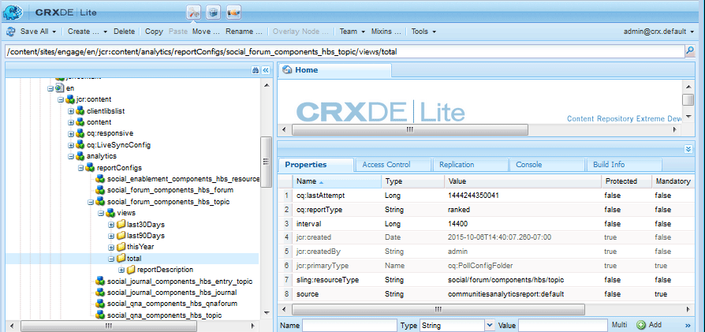

# Analytics-Konfiguration für Communities-Funktionen {#analytics-configuration-for-communities-features}

## Übersicht {#overview}

Adobe Analytics und Adobe Experience Manager (AEM) sind beide Lösungen von Adobe Marketing Cloud.

Adobe Analytics kann für AEM Communities so konfiguriert werden, dass bei der Interaktion eines Mitglieds mit unterstützten Communities-Funktionen Ereignisse an Adobe Analytics gesendet werden, aus denen Berichte generiert werden.

Wenn beispielsweise ein Mitglied einer Community-Aktivierungswebsite eine ihm zugewiesene Videoressource anzeigt, sendet der Ressourcen-Player Ereignisse an Analytics, einschließlich Video Heartbeat-Daten. Auf der Community-Site können Administratoren verschiedene Berichte zur Videowiedergabe sehen.

Außerdem ist die Analyse erforderlich für:

* In der Veröffentlichungsumgebung:

   * Berichte zu Community [Trends](/help/communities/trends.md)
   * Ermöglicht Besuchern der Site die Sortierung nach &quot;am häufigsten angesehen&quot;, &quot;am aktivsten&quot;, &quot;am beliebtesten&quot;
   * Anzeigen von Zählungen in benutzergenerierten Listen

* In der Autorenumgebung:

   * Anzeige der Beitragsdaten in der [Mitgliederverwaltungskonsole](/help/communities/members.md) (Ansichten, Beiträge, folgt, Gefällt mir)
   * Trendzusammenfassung, Video Heartbeat und Videogerät für Aktivierungsressource [Berichte](/help/communities/reports.md)

Zu den unterstützten Communities-Funktionen gehören:

* [Aktivierungsressourcen](/help/communities/resources.md)
* [Forum](/help/communities/forum.md)
* [Frage und Antwort](/help/communities/working-with-qna.md)
* [Blog](/help/communities/blog-feature.md)
* [Dateibibliothek](/help/communities/file-library.md)
* [Kalender](/help/communities/calendar.md)

In diesem Abschnitt der Dokumentation wird beschrieben, wie Sie eine Analytics Report Suite mit Communities-Funktionen verbinden. Die grundlegenden Schritte sind:

1. [Replizieren Sie den ](#replicate-the-crypto-key) Schlüssel &quot;crypto&quot;, um sicherzustellen, dass Verschlüsselung/Entschlüsselung auf allen AEM korrekt ausgeführt wird.
1. Vorbereiten einer Adobe Analytics [Report Suite](#adobe-analytics-report-suite-for-video-reporting)
1. Erstellen Sie einen AEM Analytics [Cloud Service](#aem-analytics-cloud-service-configuration) und [Framework](#aem-analytics-framework-configuration)

1. [Aktivieren von ](#enable-analytics-for-a-community-site) Analytics für eine Community-Site
1. [****](#verify-analytics-to-aem-variable-mapping) VerifyAnalytics AEM Variablenzuordnung
1. Identifizieren Sie [den primären Herausgeber](#primary-publisher).
1. [](#publish-community-site-and-analytics-cloud-service) Community-Site veröffentlichen
1. [Import von Berichtsdaten](#obtaining-reports-from-analytics) von Adobe Analytics zur Community-Site konfigurieren

## Voraussetzungen {#prerequisites}

Um die Funktionen von Analytics for Communities zu konfigurieren, müssen Sie sich an Ihren Kundenbetreuer wenden, um ein Adobe Analytics-Konto und die [Report Suite](#adobe-analytics-report-suite-for-video-reporting) einzurichten. Nach der Feststellung sollten folgende Informationen verfügbar sein:

* **Unternehmensname**

   Das Unternehmen, das mit dem Adobe Analytics-Konto verknüpft ist.

* **User Name**

   Der Anmeldename des Benutzers, der zur Verwaltung des Analytics-Kontos berechtigt ist
(sollte Zugriffsberechtigungen für Webdienste enthalten).

* **Kennwort**

   Das Anmeldekennwort für den autorisierten Benutzer.

* **Analytics Data Center**

   Die URL des Analytics-Rechenzentrums für das Konto.

* **Report Suite**

   Der Name der verwendeten Analytics-Report Suite.

## Adobe Analytics Report Suite für Videoberichte {#adobe-analytics-report-suite-for-video-reporting}

Mithilfe des [Report Suite Manager](https://docs.adobe.com/content/help/en/analytics/admin/manage-report-suites/new-report-suite/new-report-suite.html) der Adobe Marketing Cloud können Analytics-Report Suites so konfiguriert werden, dass eine Community-Site möglicherweise Berichte für Communities-Funktionen bereitstellt.

Durch Anmeldung bei [Adobe Experience Cloud](https://docs.adobe.com/content/help/en/analytics/analyze/analysis-workspace/home.html) mit [Firmenname und Benutzername](/help/communities/analytics.md#prerequisites) ist es möglich, eine neue oder vorhandene Report Suite so zu konfigurieren, dass sie Folgendes aufweist:

* [11 Konversionsvariablen](https://docs.adobe.com/content/help/en/analytics/admin/admin-tools/conversion-variables/conversion-var-admin.html)  (eVars)

   * **`evar1`** durch  **`evar11`** aktiviert

   * Kann vorhandene eVars wiederverwenden (umbenennen) oder neue erstellen, die für Communities-Funktionen verwendet werden können

* [7 Erfolgsereignisse](https://docs.adobe.com/content/help/en/analytics/admin/admin-tools/success-events/success-event.html)  (Ereignisse)

   * **`event1`** durch  **`event7`** aktiviert

   * type **`Counter`**

      * not **`Counter (no subrelations)`**
   * Kann vorhandene Ereignisse wiederverwenden (umbenennen) oder neue erstellen, die für Communities-Funktionen verwendet werden können


* [Videomanagement](https://docs.adobe.com/content/help/en/media-analytics/using/media-overview.html)

   * Videoberichterkonsole

      * Aktivieren `Video Core`
      * Wählen Sie Speichern aus
   * Video Core Measurement Console

      * Wählen Sie nun eine der folgenden Optionen aus `Use Solution Variables`
      * Wählen Sie Speichern aus


Wenn Sie eine **neue Report Suite** verwenden, beachten Sie, dass eine neue Report Suite möglicherweise nur 4 eVars und 6 Ereignisvariablen hat, während für Communities 11 eVars und 7 Ereignisvariablen erforderlich sind.

Bei Verwendung einer **vorhandenen Report Suite** kann es erforderlich sein, [die Variablenzuordnung](#modifying-analytics-variable-mapping) zu ändern, bevor das Analytics-Framework für eine Community-Site aktiviert wird.

Wenden Sie sich an Ihren Kundenbetreuer, wenn Sie Fragen zu den Communities-Variablen haben.

>[!CAUTION]
>
>**Bei Verwendung einer vorhandenen Report Suite, die bereits Variablen in**
>
>* **`evar1`** bis **`evar11`**
   >
   >
* **`event1`** bis **`event7`**
>
>
**Bevor die Community-Site veröffentlicht wird, müssen Sie**  die bereits vorhandene Zuordnung wiederherstellen, indem Sie die AEM Variablen verschieben, die automatisch Analytics-Variablen zugeordnet waren, als Analytics für eine Community-Site aktiviert wurde.
>
>Informationen zum Wiederherstellen der bereits vorhandenen Zuordnung und Verschieben AEM Variablen in andere Analytics-Variablen finden Sie im Abschnitt [Ändern der Analytics-Variablenzuordnung](#modifying-analytics-variable-mapping).
>
>Andernfalls kann es zu nicht wiederherstellbaren Datenverlusten kommen.

### Video Heartbeat Analytics {#video-heartbeat-analytics}

Wenn Video Heartbeat Analytics lizenziert ist, wird ein `Marketing Cloud Org Id` zugewiesen.

So aktivieren Sie die Video Heartbeat-Berichterstellung nach der Konfiguration der Analytics Report Suite für Videoberichte](#adobe-analytics-report-suite-for-video-reporting):[

* Erstellen eines [Analytics-Cloud-Service](#aem-analytics-cloud-service-configuration)
* [Analytics für eine Community-Site](#enable-analytics-for-a-community-site) aktivieren
* Verknüpfen Sie `Marketing Cloud Org Id` mit der Community-Site.

Der `Marketing Cloud Org Id` kann zum Zeitpunkt der [Erstellung der Community-Site](/help/communities/sites-console.md#enablement) oder neuer durch [Ändern der Eigenschaften der Community-Site](/help/communities/sites-console.md#modifying-site-properties) eingegeben werden. [](#aem-analytics-cloud-service-configuration)


Wenn Video Heartbeat Analytics aktiviert ist, instanziiert der JavaScript-Code (JS) für den Videoplayer den Video Heartbeat Library-Code (auch in JS), der alle Logiken zum Senden von Videostatusaktualisierungen an die Analytics-Video-Tracking-Server alle 10 Sekunden (nicht konfigurierbar) verarbeitet und schließlich einen kumulativen Bericht der Videositzung an die Analytics-Hauptserver sendet.

Wenn dies nicht aktiviert ist, wird der Video Heartbeat-Code nie instanziiert und nur das Video-Fortschritts- und das Tracking der Wiederaufnahmeposition wird zur Berichterstellung in SRP persistiert.

## Analytics Cloud-Dienstkonfiguration AEM {#aem-analytics-cloud-service-configuration}

So erstellen Sie eine neue Analytics-Integration, die Adobe Analytics mit der AEM Community-Site integriert, mithilfe der standardmäßigen Benutzeroberfläche in der Autoreninstanz:

* Über die globale Navigation: **[!UICONTROL Tools]** > **[!UICONTROL Bereitstellung]** > **[!UICONTROL Cloud Services]**
* Scrollen Sie nach unten zu **[!UICONTROL Adobe Analytics]**
* Wählen Sie **[!UICONTROL Jetzt konfigurieren]** oder **[!UICONTROL Konfigurationen anzeigen]** aus.


### Dialogfeld &quot;Konfiguration erstellen&quot; {#create-configuration-dialog}

* Klicken Sie auf das Symbol `[+]` neben **[!UICONTROL Verfügbare Konfigurationen]**, um eine neue Konfiguration zu erstellen.

Im Dialogfeld &quot;Konfiguration erstellen&quot;geben die eingegebenen Werte die Konfiguration an.


* **Titel**

   (Erforderlich) Ein Anzeigetitel für die Konfiguration.
Geben Sie beispielsweise *Community Analytics aktivieren* ein.

* **Name**

   (Optional) Wenn kein Name angegeben wird, wird standardmäßig ein gültiger Knotenname verwendet, der aus dem Titel abgeleitet wurde.
Geben Sie beispielsweise *communities* ein.

* **Vorlage**

   Wählen Sie nun eine der folgenden Optionen aus `Adobe Analytics Configuration`

* Wählen Sie **Erstellen**

   * Startet die Konfigurationsseite und öffnet das Dialogfeld `Analytics Settings`

### Dialogfeld &quot;Analytics-Einstellungen&quot; {#analytics-settings-dialog}

Die erste Erstellung einer neuen Analytics-Konfiguration führt zur Anzeige der Konfiguration und eines neuen Dialogfelds für die Eingabe der Analytics-Einstellungen. Für dieses Dialogfeld sind die [erforderlichen Kontoinformationen](#prerequisites) erforderlich, die vom Kundenbetreuer abgerufen wurden.


* **Unternehmen**

   Das Unternehmen, das mit dem Adobe Analytics-Konto verknüpft ist.

* **Benutzername**

   Der Anmeldename des Benutzers, der zur Verwaltung des Analytics-Kontos berechtigt ist.

* **Kennwort**

   Das Anmeldekennwort für den autorisierten Benutzer.

* **Rechenzentrum**

   Wählen Sie das Analytics-Rechenzentrum aus, in dem die Report Suite gehostet wird.

* **Kein Verfolgungs-Tag zur Seite hinzufügen**

   Behalten Sie die Standardeinstellung bei (deaktiviert).

* **AppMeasurement verwenden**

   Behalten Sie die Standardeinstellung bei (deaktiviert).

* **Nachts keine Seitenimpressionen importieren (verfassen)**

   Behalten Sie die Standardeinstellung bei (deaktiviert).

* **Nachts keine Seitenimpressionen importieren (veröffentlichen)**

   Behalten Sie die Standardeinstellung bei (deaktiviert).

So speichern Sie die Einstellungen:

* Wählen Sie **Verbindung zu Analytics**

   * Wenn dies nicht erfolgreich war,

      * Vergewissern Sie sich, dass die Einträge keine führenden Leerzeichen enthalten.
      * Probieren Sie ein anderes Rechenzentrum aus.

* Wählen Sie **OK** aus.

   

### Framework erstellen {#create-framework}

Nach erfolgreicher Konfiguration der Basisverbindung mit Adobe Analytics muss ein Framework für die Community-Site erstellt oder bearbeitet werden. Der Zweck des Frameworks besteht darin, Communities-Funktionsvariablen (AEM) Analytics-Variablen (Report Suite) zuzuordnen.

* Klicken Sie auf das Symbol `[+]` neben **[!UICONTROL Verfügbare Frameworks]**, um ein neues Framework zu erstellen.

   

* **Titel**

   (Erforderlich) Ein Anzeigetitel für das Framework
Geben Sie beispielsweise *Community-Framework aktivieren* ein.

* **Name**

   (Optional) Wenn kein Name angegeben wird, wird standardmäßig ein gültiger Knotenname verwendet, der aus dem Titel abgeleitet wurde.
Geben Sie beispielsweise *communities* ein.

* *Vorlage*

   Wählen Sie nun eine der folgenden Optionen aus `Adobe Analytics Framework`.

* Wählen Sie **Erstellen**.

Durch Erstellen des Analytics-Frameworks wird das Framework zur Konfiguration geöffnet.

## AEM Analytics-Framework-Konfiguration {#aem-analytics-framework-configuration}

Das Framework dient der Zuordnung AEM Variablen zu Analytics-Variablen (eVars und Ereignisse). Die für die Zuordnung verfügbaren Analytics-Variablen sind [definiert in der Report Suite](#adobe-analytics-report-suite-for-video-reporting).


### Report Suite auswählen {#select-report-suite}

Wählen Sie die Report Suite aus, die für Videoberichte eingerichtet wurde.

Wenn eine Report Suite noch nicht erstellt oder nicht ordnungsgemäß eingerichtet wurde, lesen Sie den vorherigen Abschnitt:
[Adobe Analytics Report Suite für Videoberichte](#adobe-analytics-report-suite-for-video-reporting)

Der Sidekick ist nicht erforderlich und kann minimiert werden, damit der Zugriff auf die Report Suites-Einstellungen nicht behindert wird.

#### Dialogfeld &quot;Report Suites&quot;vor und nach der Auswahl von &quot;Element hinzufügen&quot; {#report-suites-dialog-before-and-after-selecting-add-item}


1. Wählen Sie **Element hinzufügen +** aus.

   Es werden zwei Dropdown-Felder angezeigt.

1. Wählen Sie eine `Report suite.`

   Die mit dem Unternehmenskonto verknüpften Report Suites stehen zur Auswahl zur Verfügung.

1. Wählen Sie **Ja** im sich öffnenden Dialogfeld aus:

   ```
   Load default server settings?
    Do you want to load the default server settings and overwrite current values in the Server section?
   ```

1. Wählen Sie eine `Run Mode`.

1. Wählen Sie **Veröffentlichen**.


Der Analytics-Cloud-Service und das -Framework sind jetzt abgeschlossen. Die Zuordnungen werden definiert, sobald eine Community-Site mit diesem Analytics-Dienst erstellt wurde.

## Aktivieren von Analytics für eine Community-Site {#enable-analytics-for-a-community-site}

### Aktivieren für neue Community-Site {#enable-for-new-community-site}

So fügen Sie den Analytics-Cloud-Dienst hinzu, während [eine neue Community-Site](/help/communities/sites-console.md) erstellt wird:

* In Schritt 3 unter der Registerkarte [ANALYTICS](/help/communities/sites-console.md#analytics):
   * Aktivieren Sie das Kontrollkästchen **Analytics** aktivieren .
   * Wählen Sie das Framework aus der Dropdown-Liste aus.

* Kehren Sie optional zur Analytics-Framework-Konfiguration zurück, um die Variablenzuordnungen anzupassen.

### Aktivieren für bestehende Community-Site {#enable-for-existing-community-site}

So fügen Sie den Analytics-Cloud-Service zu einer [vorhandenen Community-Site](/help/communities/sites-console.md#modifying-site-properties) hinzu:

* Navigieren Sie zur Konsole **Communities > Sites** .
* Wählen Sie das Symbol Site bearbeiten der Community-Site aus.
* Wählen Sie EINSTELLUNGEN aus.
* Im Abschnitt Analytics :
   * Aktivieren Sie das Kontrollkästchen **Analytics** aktivieren .
   * Wählen Sie das Framework aus der Dropdown-Liste aus.

* Kehren Sie optional zur Analytics-Framework-Konfiguration zurück, um die Variablenzuordnungen anzupassen.

### Aktivieren für benutzerdefinierte Sites {#enable-for-customized-sites}

Damit das Analytics-Tracking und -Import für eine Community-Site ordnungsgemäß funktionieren, muss ein Seitenelement mit den Attributen `scf-js-site-title` class und href vorhanden sein. Nur ein solches Element sollte auf der Seite vorhanden sein, wie es beispielsweise in einem unveränderten `sitepage.hbs`-Skript für eine Community-Site vorhanden ist. Der Wert von `siteUrl` wird extrahiert und als *Sitepfad* an Adobe Analytics gesendet.

```xml
# present in default sitepage.hbs
# only one scf-js-site-title class should be included
# this example sets it to be hidden as it serves no visual purpose
<div
    class="navbar-brand scf-js-site-title"
    href="{{siteUrl}}.html"
    style="visibility: hidden;"
>
</div>
```

Stellen Sie bei einer **benutzerdefinierten Community-Site**, die das Skript `sitepage.hbs` überlagert, sicher, dass das Element vorhanden ist. Die Variable `siteUrl` wird festgelegt, wenn sie auf dem Server gerendert wird, bevor sie an den Client gesendet wird.

Für eine **generische AEM-Site**, die Communities-Komponenten enthält, aber nicht mit dem [Website-Erstellungsassistenten](/help/communities/sites-console.md) erstellt wird, muss das Element hinzugefügt werden. Der Wert von href sollte der Pfad zur Site sein. Wenn der Sitepfad beispielsweise `/content/my/company/en` lautet, verwenden Sie:

```xml
<div
    class="navbar-brand scf-js-site-title"
    href="/content/my/company/en.html"
    style="visibility: hidden;"
>
</div>
```

## Funktionen von Analytics for Communities {#analytics-for-communities-features}

Analytics wird automatisch für verschiedene Communities-Funktionen verwendet.

Die [OSGi-Konfiguration](/help/sites-deploying/configuring-osgi.md) der Autorenumgebung `AEM Communities Analytics Component Configuration` enthält eine Liste der Komponenten, die für Analytics instrumentiert wurden. Die automatische Zuordnung von Variablen wird durch die aufgeführten Komponenten bestimmt.

Wenn neue benutzerdefinierte Komponenten erstellt werden, die für Analytics instrumentiert werden, sollten sie dieser Liste der konfigurierten Komponenten hinzugefügt werden.

### Komponentenkonfiguration {#component-configuration}


>[!NOTE]
>
>Die Journalkomponenten werden verwendet, um die Blogfunktion zu implementieren.

### Analytics AEM Variablen zugeordnet {#mapped-analytics-to-aem-variables}

Sobald die Community-Site mit aktiviertem Analytics und dem ausgewählten Cloud-Konfigurations-Framework gespeichert wurde, werden die AEM Variablen automatisch den Analytics-eVars und -Ereignissen zugeordnet, die mit evar1 bzw. event1 beginnen, und die Anzahl wird um 1 erhöht.

Wenn Sie eine vorhandene Report Suite verwenden, die eine der Variablen in evar1 bis evar11 und event1 bis event7 zugeordnet hat, müssen Sie die AEM Variablen [neu zuordnen](#modifying-analytics-variable-mapping) und die ursprüngliche Zuordnung wiederherstellen.

Im Folgenden finden Sie ein Beispiel für Standardzuordnungen nach dem [Tutorial für die ersten Schritte](/help/communities/getting-started-enablement.md):


#### Zuordnung der mit jedem Ereignis gesendeten eVars {#map-of-evars-sent-with-each-event}

<table>
 <tbody>
  <tr>
   <td><strong> </strong></td>
   <td><strong>Aktivierung<br /> Ressource<br /> Typ</strong></td>
   <td><strong>Site<br /> Titel</strong></td>
   <td><strong>Funktion<br /> Typ</strong></td>
   <td><strong>Gruppe<br /> Titel</strong></td>
   <td><strong>Gruppe<br /> Pfad</strong></td>
   <td><strong>UGC<br /> Typ</strong></td>
   <td><strong>UGC<br /> Titel</strong></td>
   <td><strong>Benutzer<br /> (Mitglied)</strong></td>
   <td><strong>UGC<br /> Pfad</strong></td>
   <td><strong>Site<br /> Pfad</strong></td>
  </tr>
  <tr>
   <td><strong> </strong></td>
   <td><strong>eVar1</strong></td>
   <td><strong>eVar2</strong></td>
   <td><strong>eVar3</strong></td>
   <td><strong>eVar4</strong></td>
   <td><strong>eVar5</strong></td>
   <td><strong>eVar6</strong></td>
   <td><strong>eVar7</strong></td>
   <td><strong>eVar8</strong></td>
   <td><strong>eVar9</strong></td>
   <td><strong>eVar10</strong></td>
  </tr>
  <tr>
   <td><strong>event1<br /> Resource Play</strong></td>
   <td><em>(eine)</em></td>
   <td><em>-</em></td>
   <td><em>-</em></td>
   <td><em>-</em></td>
   <td><em>-</em></td>
   <td><em>-</em></td>
   <td><em>-</em></td>
   <td><em>-</em></td>
   <td><em>(i)</em></td>
   <td><em>-</em></td>
  </tr>
  <tr>
   <td><strong>event2<br /> SCFView</strong></td>
   <td><em>(eine)</em></td>
   <td><em>(b)</em></td>
   <td><em>(c)</em></td>
   <td><em>(d)</em></td>
   <td><em>(E)</em></td>
   <td><em>(f)</em></td>
   <td><em>(g)</em></td>
   <td><em>(h)</em></td>
   <td><em>i)</em></td>
   <td><em>j)</em></td>
  </tr>
  <tr>
   <td><strong>event3<br /> SCFCreate (Post)</strong></td>
   <td><em>-</em></td>
   <td><em>b)</em></td>
   <td><em>c)</em></td>
   <td><em>d)</em></td>
   <td><em>(E)</em></td>
   <td><em>f)</em></td>
   <td><em>g)</em></td>
   <td><em>h)</em></td>
   <td><em>i)</em></td>
   <td><em>j)</em></td>
  </tr>
  <tr>
   <td><strong>event4<br /> SCFFollow</strong></td>
   <td><em>-</em></td>
   <td><em>b)</em></td>
   <td><em>c)</em></td>
   <td><em>d)</em></td>
   <td><em>(E)</em></td>
   <td><em>f)</em></td>
   <td><em>g)</em></td>
   <td><em>h)</em></td>
   <td><em>i)</em></td>
   <td><em>j)</em></td>
  </tr>
  <tr>
   <td><strong>event5<br /> SCFVoteUp</strong></td>
   <td><em>-</em></td>
   <td><em>b)</em></td>
   <td><em>c)</em></td>
   <td><em>d)</em></td>
   <td><em>(E)</em></td>
   <td><em>f)</em></td>
   <td><em>g)</em></td>
   <td><em>h)</em></td>
   <td><em>i)</em></td>
   <td><em>j)</em></td>
  </tr>
  <tr>
   <td><strong>event6<br /> SCFVoteDown</strong></td>
   <td><em>-</em></td>
   <td><em>b)</em></td>
   <td><em>c)</em></td>
   <td><em>d)</em></td>
   <td><em>(E)</em></td>
   <td><em>f)</em></td>
   <td><em>g)</em></td>
   <td><em>h)</em></td>
   <td><em>i)</em></td>
   <td><em>j)</em></td>
  </tr>
  <tr>
   <td><strong>event7<br /> SCFRate</strong></td>
   <td><em>-</em></td>
   <td><em>b)</em></td>
   <td><em>c)</em></td>
   <td><em>d)</em></td>
   <td><em>(E)</em></td>
   <td><em>f)</em></td>
   <td><em>g)</em></td>
   <td><em>h)</em></td>
   <td><em>i)</em></td>
   <td><em>j)</em></td>
  </tr>
 </tbody>
</table>

**Beispiele für eVar :**

* *[MIME-Typ](https://www.iana.org/assignments/media-types)*: video/mp4
* *[Community-Site-Titel](/help/communities/sites-console.md#step13asitetemplate)*: Geometrixx
* *[Community-Funktionsname](/help/communities/functions.md)*: Forum
* *[Community-Gruppenname](/help/communities/creating-groups.md#creating-a-new-group)*: Wandern
* *Pfad zu Community-Gruppeninhalten*:  `/content/sites/<site name>/en/groups/hiking`
* *[UGC component resourceType](/help/communities/essentials.md)*:  `social/forum/components/hbs/topic`
* *UGC-Komponententitel*: Wanderthemen
* *login (authorizableId)*:  `aaron.mcdonald@mailinator.com`
* *SRP-Pfad zu UGC*:  `/content/usergenerated/asi/.../forum/jmtz-topic3`
oder 
*Pfad der zu folgenden* Komponente:  `/content/sites/<site name>/en/jcr:content/content/primary/forum`

* *Pfad zum Inhalt* der Community-Site:  `/content/sites/<site name>/en`

### Ändern der Analytics-Variablenzuordnung {#modifying-analytics-variable-mapping}

Die Zuordnung von Analytics-eVars und -Ereignissen zu AEM Variablen ist in der Framework-Konfiguration sichtbar, nachdem Analytics für eine Community-Site aktiviert wurde.

Nachdem Analytics aktiviert wurde und bevor die Community-Site veröffentlicht wird, kann die Zuordnung im Framework geändert werden, indem die gewünschte Analytics-eVar oder das gewünschte Ereignis aus der linken Leiste gezogen und in die entsprechende Zeile in der Zuordnungstabelle verschoben wird.

Um doppelte Zuordnungen zu vermeiden, müssen Sie die ersetzte Analytics-eVar oder das ersetzte Analytics-Ereignis aus der Zeile entfernen, indem Sie den Mauszeiger darüber bewegen und das &quot;X&quot;auswählen, das rechts neben dem Analytics-Variablenelement angezeigt wird.

Wenn Community-eVars und -Ereignisse Zuordnungen überschreiben, die bereits in der Report Suite vorhanden waren, weisen Sie zur Vermeidung von Datenverlust die AEM Variablen für Communities-Funktionen anderen Analytics-eVars oder -Ereignissen zu und stellen Sie die ursprünglichen Zuordnungen wieder her.

>[!CAUTION]
>
>Es ist wichtig, dass Sie eine Verknüpfung vornehmen, bevor die Community-Site [veröffentlicht](#publishing-the-community-site) ist und Analytics aktiviert ist. Andernfalls besteht das Risiko eines Datenverlusts.

#### Beispiel: Schritt 1: Ziehen von Analytics evar14 in die Zuordnungstabelle {#example-step-dragging-analytics-evar-into-mapping-table}


#### Beispiel: Schritt 2: Auswahl von &quot;x&quot;zum Entfernen der ersetzten evar11 {#example-step-selecting-x-to-remove-replaced-evar}


#### Beispiel: Schritt 3: AEM var eventdata.siteId wurde der Analytics-eVar14 zugeordnet {#example-step-aem-var-eventdata-siteid-remapped-to-analytics-evar}


## Veröffentlichen der Community-Site {#publishing-the-community-site}

### Überprüfen der Zuordnung von Analytics zu AEM Variablen {#verify-analytics-to-aem-variable-mapping}

Es ist ratsam, die Variablenzuordnung vor der Veröffentlichung der Community-Site zu überprüfen, auf der auch der Analytics-Cloud-Service und das -Framework veröffentlicht werden.

Siehe Abschnitte:

* [Analytics AEM Variablen zugeordnet](#mapped-analytics-to-aem-variables)
* [Ändern der Analytics-Variablenzuordnung](#modifying-analytics-variable-mapping)

>[!CAUTION]
>
>**Bei Verwendung einer vorhandenen Report Suite, die bereits Variablen in**
>
>* **`evar1`** bis **`evar11`**
   >
   >
* **`event1`** bis **`event7`**
>
>
**Bevor die Community-Site veröffentlicht wird, muss**  die bereits vorhandene Zuordnung wiederhergestellt und die Communities-AEM-Variablen, die automatisch zugeordnet wurden (als Analytics für die Community-Site aktiviert wurde), in andere Analytics-Variablen verschoben werden. Diese Neuzuordnung sollte für alle Communities-Komponenten einheitlich sein.
>
>Andernfalls kann es zu nicht wiederherstellbaren Datenverlusten kommen.

### Primärer Herausgeber {#primary-publisher}

Wenn es sich bei der ausgewählten Bereitstellung um eine [Veröffentlichungsfarm](/help/communities/topologies.md#tarmk-publish-farm) handelt, muss eine AEM Veröffentlichungsinstanz als primärer Herausgeber für die Abfrage von Adobe Analytics für Berichtsdaten identifiziert werden, die in [SRP](/help/communities/working-with-srp.md) geschrieben werden sollen.

Standardmäßig identifiziert die OSGi-Konfiguration `AEM Communities Publisher Configuration` die Veröffentlichungsinstanz als primären Herausgeber, sodass sich alle Veröffentlichungsinstanzen in einer Veröffentlichungsfarm selbst als primär identifizieren.

Daher müssen Sie die Konfiguration in allen sekundären Veröffentlichungsinstanzen bearbeiten, um das Kontrollkästchen **Primär Publisher** zu deaktivieren.

Spezifische Anweisungen finden Sie im Abschnitt für den primären Herausgeber von [Bereitstellen von Communities](/help/communities/deploy-communities.md#primary-publisher).

>[!CAUTION]
>
>Es ist wichtig, dass der primäre Herausgeber so konfiguriert ist, dass die Abfrage von mehreren Veröffentlichungsinstanzen verhindert wird.

### Replizieren des Crypto-Schlüssels {#replicate-the-crypto-key}

Die Adobe Analytics-Anmeldeinformationen werden verschlüsselt. Um die Replikation oder Übertragung verschlüsselter Analytics-Anmeldeinformationen zwischen Autor und Herausgebern zu erleichtern, müssen alle AEM Instanzen denselben Primärverschlüsselungsschlüssel verwenden.

Befolgen Sie dazu die Anweisungen unter [Replizieren Sie den Crypto-Schlüssel](/help/communities/deploy-communities.md#replicate-the-crypto-key).

### Community-Site und Analytics Cloud-Dienst veröffentlichen {#publish-community-site-and-analytics-cloud-service}

Sobald der Analytics-Cloud-Service für eine Community-Site aktiviert wurde und, falls erforderlich, die [Zuordnung von Analytics zu AEM Variablen angepasst wurde](#mapped-analytics-to-aem-variables), muss die Konfiguration in der Veröffentlichungsumgebung repliziert werden, indem [ (erneut) die Community-Site](/help/communities/sites-console.md#publishing-the-site) veröffentlicht wird.

## Abrufen von Berichten aus Analytics {#obtaining-reports-from-analytics}

### Berichtverwaltung {#report-management}

Die [OSGi-Konfiguration](/help/sites-deploying/configuring-osgi.md), `AEM Communities Analytics Report Management` des Autors und des primären Herausgebers wird zur Abfrage von Analytics verwendet.

Beim Autor werden die Abfragen für Echtzeitberichte erstellt.

Beim primären Herausgeber werden die Abfragen verwendet, um Informationen bei der Vorbereitung des Analytics-Datenimports durch Report Importer bereitzustellen.

Das Abfrageintervall beträgt standardmäßig 10 Sekunden.

### Report Importer {#report-importer}

Sobald eine für Analytics aktivierte Community-Site veröffentlicht wurde, kann die [OSGi-Konfiguration des primären Herausgebers](/help/sites-deploying/configuring-osgi.md), `AEM Communities Analytics Report Importer` so konfiguriert werden, dass das standardmäßige Abrufintervall für die Konfigurationen festgelegt wird, die in CRXDE nicht einzeln konfiguriert sind.

Das Abrufintervall steuert die Häufigkeit von Anforderungen an Adobe Analytics, damit Daten abgerufen und in [SRP](/help/communities/working-with-srp.md) gespeichert werden.

Wenn die Daten als &quot;Big Data&quot;kategorisiert werden können, kann eine häufigere Abfrage eine große Belastung für die Community-Site verursachen.

Die Standardabfrage **Importintervall** ist auf 12 Stunden festgelegt.


### Anpassung von Komponentenberichten {#component-report-customization}

Derzeit werden zur Anpassung der zu verfolgenden Metriken Knoten im Repository erstellt, die Zeiträume definieren, für die ein Bericht zu dieser Metrik erstellt werden soll.

Das Forenthema ist derzeit das einzige Beispiel für diese Anpassung:

* Melden Sie sich beim primären Herausgeber mit Administratorrechten an.
* Navigieren Sie zu [CRXDE Lite](/help/sites-developing/developing-with-crxde-lite.md). Beispiel: [https://localhost:4503/crx/de](https://localhost:4503/crx/de).

* Navigieren Sie unter dem Knoten jcr:content des Sprachstamms (z. B. `/content/sites/engage/en/jcr:content),`zur für die Analytics-Berichterstellung konfigurierten Komponente.
Beispiel: **`analytics/reportConfigs/social_forum_components_hbs_topic`**

* Beachten Sie die erstellten Zeiträume:

   * `last30Days`
   * `last90Days`
   * `thisYear`

* Beachten Sie den Knoten `total`.

   * Durch das Ändern der Eigenschaft **`interval`** wird das Report Importer-Intervall überschrieben.
   * Der Wert wird in Sekunden angegeben und auf 4 Stunden (14400 Sekunden) festgelegt.



## Benutzerdaten in Analytics verwalten {#manage-user-data-in-analytics}

Adobe Analytics bietet APIs, mit denen Sie auf Benutzerdaten zugreifen, diese exportieren und löschen können. Weitere Informationen finden Sie unter [Zugriffs- und Löschanfragen senden](https://docs.adobe.com/content/help/en/analytics/admin/data-governance/gdpr-submit-access-delete.html).

## Ressourcen {#resources}

* Adobe Experience Cloud: [Analytics-Hilfe und -Referenz](https://docs.adobe.com/content/help/en/analytics/landing/home.html)
* AEM: [Integration mit Adobe Analytics](/help/sites-administering/adobeanalytics.md)
* AEM: [Analytics mit externen Anbietern](/help/sites-administering/external-providers.md)
