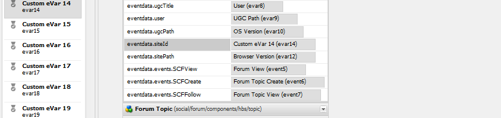

# Analytics-Konfiguration für Communities-Funktionen {#analytics-configuration-for-communities-features}

## Überblick {#overview}

Adobe Analytics und Adobe Experience Manager (AEM) sind beide Lösungen von Adobe Marketing Cloud.

Adobe Analytics kann für AEM Communities konfiguriert werden, sodass Ereignis, die von einem Mitglied mit unterstützten Communities-Funktionen interagieren, an Adobe Analytics gesendet werden, von dem aus Berichte generiert werden.

Wenn beispielsweise ein Mitglied einer Community-Site für die Aktivierung eine Videoressource Ansicht, die ihm zugewiesen wurde, sendet der Ressourcenplayer Ereignis einschließlich Video Heartbeat-Daten an Analytics. Auf der Community-Site können Administratoren verschiedene Berichte zur Wiedergabe des Videos sehen.

Darüber hinaus sind Analysen erforderlich für:

* In der Umgebung &quot;Veröffentlichen&quot;:

   * Berichte zu Community [Trends](/help/communities/trends.md)
   * Zulassen der Sortierung von Site-Besuchern nach &quot;am meisten angezeigt&quot;, &quot;am aktivsten&quot;, &quot;am meisten gefällt&quot;
   * Ansicht zählt auf UGC-Listen

* Umgebung des Verfassers:

   * Anzeigen von Beitragsdaten in der [Members Management Console](/help/communities/members.md) (Ansichten, Beiträge, folgt, &quot;Gefällt mir&quot;-Klicks)
   * Trendzusammenfassung, Video Heartbeat und Videogerät für die Aktivierungsressource [reports](/help/communities/reports.md)

Zu den unterstützten Communities-Funktionen gehören:

* [Aktivierungsressourcen](/help/communities/resources.md)
* [Forum](/help/communities/forum.md)
* [Frage und Antwort](/help/communities/working-with-qna.md)
* [Blog](/help/communities/blog-feature.md)
* [Dateibibliothek](/help/communities/file-library.md)
* [Kalender](/help/communities/calendar.md)

In diesem Abschnitt der Dokumentation wird beschrieben, wie Sie eine Analytics-Report Suite mit Communities-Funktionen verbinden. Die grundlegenden Schritte sind:

1. [Replizieren Sie den kryptographischen ](#replicate-the-crypto-key) Schlüssel, um sicherzustellen, dass Verschlüsselung/Entschlüsselung in allen AEM korrekt ausgeführt wird.
1. Vorbereitung einer Adobe Analytics [Report Suite](#adobe-analytics-report-suite-for-video-reporting)
1. Erstellen eines AEM Analytics [Cloud-Dienstes](#aem-analytics-cloud-service-configuration) und [Framework](#aem-analytics-framework-configuration)

1. [Aktivieren von ](#enable-analytics-for-a-community-site) Analytics für eine Community-Site
1. [****](#verify-analytics-to-aem-variable-mapping) VerifyAnalytics zu AEM Variablenzuordnung
1. Identifizieren Sie [den primären Herausgeber](#primary-publisher).
1. [Community-Site ](#publish-community-site-and-analytics-cloud-service) veröffentlichen
1. [Importieren von Berichtsdaten](#obtaining-reports-from-analytics) von Adobe Analytics zur Community-Site konfigurieren

## Voraussetzungen {#prerequisites}

Zur Konfiguration der Funktionen von Analytics für Communities müssen Sie mit Ihrem Kundenbetreuer zusammenarbeiten, um ein Adobe Analytics-Konto und [Report Suite](#adobe-analytics-report-suite-for-video-reporting) einzurichten. Nach der Festlegung sollten folgende Informationen verfügbar sein:

* **Unternehmensname**

   Die Firma, die mit dem Adobe Analytics-Konto verknüpft ist.

* **User Name**

   Der Anmeldename des Benutzers, der zur Verwaltung des Analytics-Kontos berechtigt ist
(sollte Web Service Access-Berechtigungen beinhalten).

* **Kennwort**

   Das Anmeldekennwort des autorisierten Benutzers.

* **Analytics Data Center**

   Die URL des Analytics-Rechenzentrums für das Konto.

* **Report Suite**

   Der Name der verwendeten Analytics-Report Suite.

## Adobe Analytics Report Suite für Video-Berichte {#adobe-analytics-report-suite-for-video-reporting}

Mithilfe des [Report Suite Manager](https://docs.adobe.com/content/help/en/analytics/admin/manage-report-suites/new-report-suite/new-report-suite.html) der Adobe Marketing Cloud können Analytics-Report Suites so konfiguriert werden, dass eine Community-Site zur Bereitstellung von Berichten für Communities-Funktionen aktiviert werden kann.

Durch die Anmeldung bei [Adobe Experience Cloud](https://docs.adobe.com/content/help/en/analytics/analyze/analysis-workspace/home.html) mit [Firmen- und Benutzername](/help/communities/analytics.md#prerequisites) ist es möglich, eine neue oder vorhandene Report Suite zu konfigurieren, die Folgendes aufweist:

* [11 Umrechnungsvariablen](https://docs.adobe.com/content/help/en/analytics/admin/admin-tools/conversion-variables/conversion-var-admin.html) (eVars)

   * **`evar1`** durch  **`evar11`** aktiviert

   * Kann vorhandene eVars wiederverwenden (umbenennen) oder neue erstellen, die für Communities-Funktionen verwendet werden können

* [7 Erfolgserlebnisse](https://docs.adobe.com/content/help/en/analytics/admin/admin-tools/success-events/success-event.html)  (Ereignis)

   * **`event1`** durch  **`event7`** aktiviert

   * type **`Counter`**

      * not **`Counter (no subrelations)`**
   * Kann vorhandene Ereignis wiederverwenden (umbenennen) oder neue erstellen, die für Communities-Funktionen verwendet werden können


* [Videomanagement](https://docs.adobe.com/content/help/en/media-analytics/using/media-overview.html)

   * Video Berichte Console

      * Aktivieren `Video Core`
      * Wählen Sie Speichern aus
   * Video-Core-Messkonsole

      * Wählen Sie nun eine der folgenden Optionen aus `Use Solution Variables`
      * Wählen Sie Speichern aus


Wenn Sie eine **neue Report Suite** verwenden, beachten Sie, dass eine neue Report Suite möglicherweise nur 4 eVars und 6 Ereignis-Variablen hat, während für Communities 11 eVars und 7 Ereignis vars erforderlich sind.

Wenn Sie eine **vorhandene Report Suite** verwenden, müssen Sie möglicherweise [die Variablenzuordnung](#modifying-analytics-variable-mapping) ändern, bevor Sie das Analytics-Framework für eine Community-Site aktivieren.

Wenden Sie sich an Ihren Kundenbetreuer, wenn Sie Bedenken hinsichtlich der Variablen für Communities haben.

>[!CAUTION]
>
>**Wenn Sie eine vorhandene Report Suite verwenden, die bereits Variablen in**
>
>* **`evar1`** bis **`evar11`**
   >
   >
* **`event1`** bis **`event7`**
>
>
**Bevor die Community-Site veröffentlicht wird, müssen** Sie die bereits vorhandene Zuordnung wiederherstellen, indem Sie die AEM Variablen verschieben, die automatisch Analytics-Variablen zugeordnet wurden, wenn Analytics für eine Community-Site aktiviert wurde.
>
>Informationen zum Wiederherstellen der bereits vorhandenen Zuordnung und Verschieben AEM Variablen in andere Analytics-Variablen finden Sie im Abschnitt [Ändern der Analytics-Variablenzuordnung](#modifying-analytics-variable-mapping).
>
>Andernfalls kann es zu nicht wiederherstellbaren Datenverlusten kommen.

### Video Heartbeat Analytics {#video-heartbeat-analytics}

Wenn Video Heartbeat Analytics lizenziert ist, wird ein `Marketing Cloud Org Id` zugewiesen.

So aktivieren Sie Video Heartbeat Berichte nach der Konfiguration der Analytics Report Suite für Video Berichte](#adobe-analytics-report-suite-for-video-reporting):[

* Erstellen eines [Analytics-Cloud-Dienstes](#aem-analytics-cloud-service-configuration)
* [Analytics für eine Community-Site](#enable-analytics-for-a-community-site) aktivieren
* Verknüpfen Sie `Marketing Cloud Org Id` mit der Community-Site.

Das `Marketing Cloud Org Id` kann zum Zeitpunkt der [Community-Site-Erstellung](/help/communities/sites-console.md#enablement) oder höher eingegeben werden, indem [die Eigenschaften der Community-Site geändert werden. [](#aem-analytics-cloud-service-configuration)](/help/communities/sites-console.md#modifying-site-properties)


Wenn Video Heartbeat Analytics aktiviert ist, instanziiert der JavaScript-(JS-)Code für den Videoplayer den Video Heartbeat Library-Code (auch in JS), der alle Logik zum Senden von Videostatusaktualisierungen an die Analytics-Videoverfolgungsserver alle 10 Sekunden (nicht konfigurierbar) verarbeitet und schließlich einen kumulativen Bericht der Videositzung an die Analytics-Hauptserver sendet.

Ist diese Option nicht aktiviert, wird der Video Heartbeat-Code nie instanziiert und nur die Videoverfolgung und die Verfolgung der Wiederaufnahme-Position bleiben zum Berichte auf SRP beschränkt.

## AEM Analytics Cloud-Dienstkonfiguration {#aem-analytics-cloud-service-configuration}

So erstellen Sie eine neue Analytics-Integration, die Adobe Analytics mit der AEM Community-Site integriert, mithilfe der Standard-Benutzeroberfläche in der Autoreninstanz:

* Aus globaler Navigation: **[!UICONTROL Tools]** > **[!UICONTROL Bereitstellung]** > **[!UICONTROL Cloud Services]**
* Blättern Sie nach unten zu **[!UICONTROL Adobe Analytics]**
* Wählen Sie **[!UICONTROL Jetzt konfigurieren]** oder **[!UICONTROL Konfigurationen anzeigen]**


### Konfigurationsdialogfeld {#create-configuration-dialog} erstellen

* Klicken Sie auf das Symbol `[+]` neben **[!UICONTROL Verfügbare Konfigurationen]**, um eine neue Konfiguration zu erstellen.

Im Dialogfeld &quot;Konfiguration erstellen&quot;wird die Konfiguration durch die eingegebenen Werte identifiziert.


* **Titel**

   (Erforderlich) Ein Anzeigentitel für die Konfiguration.
Geben Sie z. B. *Aktivieren von Community Analytics* ein

* **Name**

   (Optional) Wenn kein Name angegeben ist, wird standardmäßig ein gültiger Knotenname verwendet, der aus dem Titel abgeleitet wurde.
Geben Sie beispielsweise *Communities* ein.

* **Vorlage**

   Wählen Sie nun eine der folgenden Optionen aus `Adobe Analytics Configuration`

* Wählen Sie **Erstellen**

   * Startet die Konfigurationsseite und öffnet das Dialogfeld `Analytics Settings`

### Dialogfeld für Analytics-Einstellungen {#analytics-settings-dialog}

Bei der ersten Erstellung einer neuen Analytics-Konfiguration wird die Konfiguration angezeigt und es wird ein neues Dialogfeld für die Eingabe der Analytics-Einstellungen angezeigt. Für dieses Dialogfeld sind die [erforderlichen Kontoinformationen](#prerequisites) erforderlich, die vom Kundenbetreuer abgerufen werden.


* **Unternehmen**

   Die Firma, die mit dem Adobe Analytics-Konto verknüpft ist.

* **Benutzername**

   Der Anmeldename des Benutzers, der zur Verwaltung des Analytics-Kontos berechtigt ist.

* **Kennwort**

   Das Anmeldekennwort des autorisierten Benutzers.

* **Rechenzentrum**

   Wählen Sie das Analytics-Rechenzentrum, in dem die Report Suite gehostet wird.

* **Kein Verfolgungs-Tag zur Seite hinzufügen**

   Als Standard beibehalten (deaktiviert).

* **AppMeasurement verwenden**

   Als Standard beibehalten (deaktiviert).

* **Nachts keine Seitenimpressionen importieren (verfassen)**

   Als Standard beibehalten (deaktiviert).

* **Nachts keine Seitenimpressionen importieren (veröffentlichen)**

   Als Standard beibehalten (deaktiviert).

So speichern Sie die Einstellungen:

* Wählen Sie **Verbindung zu Analytics**

   * Wenn dies nicht erfolgreich ist,

      * Stellen Sie sicher, dass die Einträge keine Leerzeichen am Anfang enthalten.
      * Testen Sie ein anderes Rechenzentrum.

* Wählen Sie **OK** aus.

   

### Framework erstellen {#create-framework}

Nach erfolgreicher Konfiguration der Basisverbindung mit Adobe Analytics muss ein Framework für die Community-Site erstellt oder bearbeitet werden. Der Zweck des Frameworks besteht darin, Variablen der Funktion Communities (AEM) Analytics (Report Suite)-Variablen zuzuordnen.

* Klicken Sie auf das Symbol `[+]` neben **[!UICONTROL Verfügbare Frameworks]**, um ein neues Framework zu erstellen.

   

* **Titel**

   (Erforderlich) Ein Anzeigentitel für das Framework
Geben Sie beispielsweise *Aktivieren des Community-Frameworks* ein.

* **Name**

   (Optional) Wenn kein Name angegeben ist, wird standardmäßig ein gültiger Knotenname verwendet, der aus dem Titel abgeleitet wurde.
Geben Sie beispielsweise *Communities* ein.

* *Vorlage*

   Wählen Sie nun eine der folgenden Optionen aus `Adobe Analytics Framework`.

* Wählen Sie **Erstellen**.

Das Erstellen des Analytics-Frameworks öffnet das Framework für die Konfiguration.

## AEM Analytics-Framework-Konfiguration {#aem-analytics-framework-configuration}

Der Zweck des Frameworks ist die Zuordnung AEM Variablen zu Analytics-Variablen (eVars und Ereignis). Die für die Zuordnung verfügbaren Analytics-Variablen sind [definiert in der Report Suite](#adobe-analytics-report-suite-for-video-reporting).


### Report Suite {#select-report-suite} auswählen

Wählen Sie die Report Suite aus, die für Video Berichte eingerichtet wurde.

Wenn eine Report Suite noch nicht erstellt oder nicht ordnungsgemäß eingerichtet wurde, lesen Sie den vorherigen Abschnitt:
[Adobe Analytics Report Suite für Video-Berichte](#adobe-analytics-report-suite-for-video-reporting)

Der Sidekick ist nicht erforderlich und kann minimiert werden, sodass er den Zugriff auf die Report Suites-Einstellungen nicht behindert.

#### Dialogfeld &quot;Report Suites&quot;vor und nach Auswahl von &quot;Hinzufügen Element&quot; {#report-suites-dialog-before-and-after-selecting-add-item}


1. Wählen Sie **Hinzufügen Element +**.

   Es werden zwei Dropdownfelder angezeigt.

1. Wählen Sie ein `Report suite.`

   Die mit dem Firmen-Konto verknüpften Report Suites stehen zur Auswahl zur Verfügung.

1. Wählen Sie **Ja** in dem sich öffnenden Dialogfeld aus:

   ```
   Load default server settings?
    Do you want to load the default server settings and overwrite current values in the Server section?
   ```

1. Wählen Sie ein `Run Mode`.

1. Wählen Sie **Veröffentlichen**.


Der Dienst und das Framework für Analytics sind nun abgeschlossen. Die Zuordnungen werden definiert, sobald eine Community-Site mit diesem Analytics-Dienst erstellt wurde.

## Aktivieren von Analytics für eine Community-Site {#enable-analytics-for-a-community-site}

### Für neue Community-Site aktivieren {#enable-for-new-community-site}

So fügen Sie beim [Erstellen einer neuen Community-Site](/help/communities/sites-console.md) den Analytics-Cloud-Dienst hinzu:

* In Schritt 3 unter der Registerkarte [ANALYTICS](/help/communities/sites-console.md#analytics):
   * Aktivieren Sie das Kontrollkästchen **Analytics** aktivieren.
   * Wählen Sie das Framework aus dem Dropdown-Feld.

* Optional können Sie zur Analytics-Framework-Konfiguration zurückkehren, um die Variablenzuordnungen anzupassen.

### Für bestehende Community-Site aktivieren {#enable-for-existing-community-site}

So fügen Sie einen Analytics-Cloud-Dienst zu einer [bestehenden Community-Site](/help/communities/sites-console.md#modifying-site-properties) hinzu:

* Navigieren Sie zur Konsole **Communities > Sites**.
* Wählen Sie das Symbol &quot;Site bearbeiten&quot;der Community-Site aus.
* Wählen Sie die EINSTELLUNGEN.
* Im Abschnitt Analytics:
   * Aktivieren Sie das Kontrollkästchen **Analytics** aktivieren.
   * Wählen Sie das Framework aus der Dropdownliste.

* Optional können Sie zur Analytics-Framework-Konfiguration zurückkehren, um die Variablenzuordnungen anzupassen.

### Aktivieren für benutzerdefinierte Sites {#enable-for-customized-sites}

Damit Analytics-Verfolgung und -Import für eine Community-Site ordnungsgemäß funktionieren, muss ein Seitenelement mit den Attributen `scf-js-site-title` und href vorhanden sein. Nur ein solches Element sollte auf der Seite vorhanden sein, wie es in einem nicht geänderten `sitepage.hbs`-Skript für eine Community-Site der Fall ist. Der Wert von `siteUrl` wird extrahiert und als *Sitepfad* an Adobe Analytics gesendet.

```xml
# present in default sitepage.hbs
# only one scf-js-site-title class should be included
# this example sets it to be hidden as it serves no visual purpose
<div
    class="navbar-brand scf-js-site-title"
    href="{{siteUrl}}.html"
    style="visibility: hidden;"
>
</div>
```

Stellen Sie bei einer **benutzerdefinierten Community-Site**, die das Skript `sitepage.hbs` überlagert, sicher, dass das Element vorhanden ist. Die Variable `siteUrl` wird festgelegt, wenn sie auf dem Server wiedergegeben wird, bevor sie an den Client gesendet wird.

Für eine **generische AEM Site**, die Communities-Komponenten enthält, aber nicht mit dem [Site-Erstellungsassistenten](/help/communities/sites-console.md) erstellt wurde, muss das Element hinzugefügt werden. Der Wert des href sollte der Pfad zur Site sein. Wenn der Sitepfad beispielsweise `/content/my/company/en` lautet, verwenden Sie:

```xml
<div
    class="navbar-brand scf-js-site-title"
    href="/content/my/company/en.html"
    style="visibility: hidden;"
>
</div>
```

## Analytics für Communities-Funktionen {#analytics-for-communities-features}

Analytics wird automatisch für mehrere Communities-Funktionen verwendet.

Die Authoring-Umgebung [OSGi configuration](/help/sites-deploying/configuring-osgi.md), `AEM Communities Analytics Component Configuration` enthält eine Auflistung der Komponenten, die für Analytics instrumentiert wurden. Die automatische Zuordnung von Variablen wird von den aufgeführten Komponenten bestimmt.

Wenn neue benutzerdefinierte Komponenten erstellt werden, die für Analytics instrumentiert werden, sollten sie dieser Liste konfigurierter Komponenten hinzugefügt werden.

### Komponentenkonfiguration {#component-configuration}


>[!NOTE]
>
>Die Protokoll-Komponenten werden zur Implementierung der Blog-Funktion verwendet.

### Analytics AEM Variablen {#mapped-analytics-to-aem-variables} zugeordnet

Sobald die Community-Site mit aktiviertem Analytics und aktiviertem Cloud-Konfigurationsframework gespeichert wurde, werden die AEM automatisch den Analytics-eVars und -Ereignissen zugeordnet, die mit &quot;evar1&quot;bzw. &quot;Ereignis1&quot;beginnen und um 1 inkrementiert werden.

Wenn Sie eine vorhandene Report Suite verwenden, die eine der Variablen in evar1 bis evar11 und Ereignis1 bis Ereignis7 zugeordnet hat, müssen Sie die AEM &lt; a0/>neu zuordnen und die ursprüngliche Zuordnung wiederherstellen.[](#modifying-analytics-variable-mapping)

Im Folgenden finden Sie ein Beispiel für Standardzuordnungen nach dem Einstieg-Lernprogramm [](/help/communities/getting-started-enablement.md):


#### Zuordnung der mit jedem Ereignis {#map-of-evars-sent-with-each-event} gesendeten eVars

<table>
 <tbody>
  <tr>
   <td><strong> </strong></td>
   <td><strong>Aktivierung<br /> Ressource<br /> Typ</strong></td>
   <td><strong>Site<br /> Titel</strong></td>
   <td><strong>Funktion<br /> Typ</strong></td>
   <td><strong>Gruppe<br /> Titel</strong></td>
   <td><strong>Gruppe<br /> Pfad</strong></td>
   <td><strong>UGC<br /> Typ</strong></td>
   <td><strong>UGC<br /> Titel</strong></td>
   <td><strong>Benutzer<br /> (Mitglied)</strong></td>
   <td><strong>UGC<br /> Pfad</strong></td>
   <td><strong>Site<br /> Pfad</strong></td>
  </tr>
  <tr>
   <td><strong> </strong></td>
   <td><strong>eVar1</strong></td>
   <td><strong>eVar2</strong></td>
   <td><strong>eVar3</strong></td>
   <td><strong>eVar4</strong></td>
   <td><strong>eVar5</strong></td>
   <td><strong>eVar6</strong></td>
   <td><strong>eVar7</strong></td>
   <td><strong>eVar8</strong></td>
   <td><strong>eVar9</strong></td>
   <td><strong>eVar10</strong></td>
  </tr>
  <tr>
   <td><strong>Ereignis1<br /> Ressourcenwiedergabe</strong></td>
   <td><em>(eine)</em></td>
   <td><em>-</em></td>
   <td><em>-</em></td>
   <td><em>-</em></td>
   <td><em>-</em></td>
   <td><em>-</em></td>
   <td><em>-</em></td>
   <td><em>-</em></td>
   <td><em>(i)</em></td>
   <td><em>-</em></td>
  </tr>
  <tr>
   <td><strong>Ereignis2<br /> SCFView</strong></td>
   <td><em>(eine)</em></td>
   <td><em>(b)</em></td>
   <td><em>(c)</em></td>
   <td><em>(d)</em></td>
   <td><em>(E)</em></td>
   <td><em>(f)</em></td>
   <td><em>(g)</em></td>
   <td><em>(h)</em></td>
   <td><em>i)</em></td>
   <td><em>j)</em></td>
  </tr>
  <tr>
   <td><strong>Ereignis3<br /> SCFCreate (Post)</strong></td>
   <td><em>-</em></td>
   <td><em>b)</em></td>
   <td><em>c)</em></td>
   <td><em>d)</em></td>
   <td><em>(E)</em></td>
   <td><em>f)</em></td>
   <td><em>g)</em></td>
   <td><em>h)</em></td>
   <td><em>i)</em></td>
   <td><em>j)</em></td>
  </tr>
  <tr>
   <td><strong>Ereignis4<br /> SCFFollow</strong></td>
   <td><em>-</em></td>
   <td><em>b)</em></td>
   <td><em>c)</em></td>
   <td><em>d)</em></td>
   <td><em>(E)</em></td>
   <td><em>f)</em></td>
   <td><em>g)</em></td>
   <td><em>h)</em></td>
   <td><em>i)</em></td>
   <td><em>j)</em></td>
  </tr>
  <tr>
   <td><strong>Ereignis5<br /> SCFVoteUp</strong></td>
   <td><em>-</em></td>
   <td><em>b)</em></td>
   <td><em>c)</em></td>
   <td><em>d)</em></td>
   <td><em>(E)</em></td>
   <td><em>f)</em></td>
   <td><em>g)</em></td>
   <td><em>h)</em></td>
   <td><em>i)</em></td>
   <td><em>j)</em></td>
  </tr>
  <tr>
   <td><strong>Ereignis6<br /> SCFVoteDown</strong></td>
   <td><em>-</em></td>
   <td><em>b)</em></td>
   <td><em>c)</em></td>
   <td><em>d)</em></td>
   <td><em>(E)</em></td>
   <td><em>f)</em></td>
   <td><em>g)</em></td>
   <td><em>h)</em></td>
   <td><em>i)</em></td>
   <td><em>j)</em></td>
  </tr>
  <tr>
   <td><strong>Ereignis7<br /> SCFRate</strong></td>
   <td><em>-</em></td>
   <td><em>b)</em></td>
   <td><em>c)</em></td>
   <td><em>d)</em></td>
   <td><em>(E)</em></td>
   <td><em>f)</em></td>
   <td><em>g)</em></td>
   <td><em>h)</em></td>
   <td><em>i)</em></td>
   <td><em>j)</em></td>
  </tr>
 </tbody>
</table>

**Beispiele für eVar:**

* *[MIME-Typ](https://www.iana.org/assignments/media-types)*: video/mp4
* *[Community-Site-Titel](/help/communities/sites-console.md#step13asitetemplate)*: Geometrixx
* *[Community-Funktionsname](/help/communities/functions.md)*: Forum
* *[Community-Gruppenname](/help/communities/creating-groups.md#creating-a-new-group)*: Wandern
* *Pfad zu Community-Gruppeninhalten*:  `/content/sites/<site name>/en/groups/hiking`
* *[UGC component resourceType](/help/communities/essentials.md)*:  `social/forum/components/hbs/topic`
* *UGC-Komponententitel*: Wanderthemen
* *login (authorizedId)*:  `aaron.mcdonald@mailinator.com`
* *SRP-Pfad zu UGC*:  `/content/usergenerated/asi/.../forum/jmtz-topic3`
oder 
*Komponentenpfad*:  `/content/sites/<site name>/en/jcr:content/content/primary/forum`

* *Pfad zum Inhalt* der Community-Site:  `/content/sites/<site name>/en`

### Ändern der Analytics-Variablenzuordnung {#modifying-analytics-variable-mapping}

Die Zuordnung von Analytics-eVars und -Ereignissen zu AEM Variablen ist in der Framework-Konfiguration sichtbar, nachdem Analytics für eine Community-Site aktiviert wurde.

Nachdem Analytics aktiviert wurde und bevor die Community-Site veröffentlicht wird, kann die Zuordnung im Framework geändert werden, indem die gewünschte Analytics-eVar oder das gewünschte Analytics-Ereignis aus der linken Leiste gezogen und in die entsprechende Zeile der Zuordnungstabelle eingefügt wird.

Um Duplikat-Zuordnungen zu vermeiden, müssen Sie die ersetzte Analytics-eVar oder das ersetzte Analytics-Ereignis aus der Zeile entfernen, indem Sie den Mauszeiger darüber halten und das X auswählen, das rechts neben dem Analytics-Variablenelement angezeigt wird.

Wenn Communities-eVars und -Ereignis Zuordnungen überschreiben, die bereits in der Report Suite vorhanden waren, weisen Sie zur Vermeidung von Datenverlusten die AEM Variablen für Communities anderen Analytics-eVars oder -Ereignissen zu und stellen Sie die ursprünglichen Zuordnungen wieder her.

>[!CAUTION]
>
>Es ist wichtig zu bleiben, bevor die Community-Site [published](#publishing-the-community-site) mit aktivierter Analytics-Funktion ist. Andernfalls besteht das Risiko eines Datenverlusts.

#### Beispiel Schritt 1: Ziehen von Analytics evar14 in die Zuordnungstabelle {#example-step-dragging-analytics-evar-into-mapping-table}


#### Beispiel Schritt 2: Auswahl von &quot;x&quot; zum Entfernen der ersetzten evar11 {#example-step-selecting-x-to-remove-replaced-evar}


#### Beispiel Schritt 3: AEM var eventData.siteId wurde Analytics evar14 {#example-step-aem-var-eventdata-siteid-remapped-to-analytics-evar}



## Veröffentlichen der Community-Site {#publishing-the-community-site}

### Analytics auf AEM Variablenzuordnung {#verify-analytics-to-aem-variable-mapping} überprüfen

Es ist sinnvoll, die Variablenzuordnung vor der Veröffentlichung der Community-Site zu überprüfen, die auch den Analytics-Cloud-Dienst und das Analytics-Framework veröffentlicht.

Siehe Abschnitte:

* [Analytics AEM Variablen zugeordnet](#mapped-analytics-to-aem-variables)
* [Ändern der Analytics-Variablenzuordnung](#modifying-analytics-variable-mapping)

>[!CAUTION]
>
>**Wenn Sie eine vorhandene Report Suite verwenden, die bereits Variablen in**
>
>* **`evar1`** bis **`evar11`**
   >
   >
* **`event1`** bis **`event7`**
>
>
**Bevor die Community-Site veröffentlicht wird, müssen** Sie dann die bereits vorhandene Zuordnung wiederherstellen und die Communities AEM Variablen verschieben, die automatisch zugeordnet wurden (als Analytics für die Community-Site aktiviert wurde), zu anderen Analytics-Variablen. Diese Neuzuordnung sollte für alle Communities-Komponenten einheitlich sein.
>
>Andernfalls kann es zu nicht wiederherstellbaren Datenverlusten kommen.

### Primär Publisher {#primary-publisher}

Wenn die gewählte Bereitstellung eine [Veröffentlichungsfarm](/help/communities/topologies.md#tarmk-publish-farm) ist, muss eine AEM Veröffentlichungsinstanz als primärer Herausgeber für die Abfrage von Adobe Analytics identifiziert werden, damit Berichtsdaten in [SRP](/help/communities/working-with-srp.md) geschrieben werden.

Standardmäßig identifiziert die OSGi-Konfiguration die Veröffentlichungsinstanz als primären Herausgeber, sodass alle Veröffentlichungsinstanzen in einer Veröffentlichungsfarm sich selbst als Primär identifizieren.`AEM Communities Publisher Configuration`

Daher müssen Sie die Konfiguration in allen sekundären Veröffentlichungsinstanzen bearbeiten, um die Markierung des Kontrollkästchens **Primär Publisher** aufzuheben.

Spezifische Anweisungen finden Sie im Abschnitt zum primären Herausgeber von [Bereitstellen von Communities](/help/communities/deploy-communities.md#primary-publisher).

>[!CAUTION]
>
>Es ist wichtig, dass der primäre Herausgeber so konfiguriert ist, dass keine Abfrage von mehreren Instanzen im Veröffentlichungsmodus durchgeführt wird.

### Crypto-Schlüssel {#replicate-the-crypto-key} replizieren

Die Adobe Analytics-Anmeldeinformationen werden verschlüsselt. Um die Replizierung oder Übertragung verschlüsselter Analysedaten zwischen Autoren und Herausgebern zu erleichtern, müssen alle AEM Instanzen denselben primären Verschlüsselungsschlüssel verwenden.

Befolgen Sie dazu die Anweisungen unter [Crypto-Schlüssel](/help/communities/deploy-communities.md#replicate-the-crypto-key) replizieren.

### Community-Site und Analytics Cloud-Dienst veröffentlichen {#publish-community-site-and-analytics-cloud-service}

Nachdem der Analytics-Cloud-Dienst für eine Community-Site aktiviert wurde und die [Zuordnung von Analytics zu AEM Variablen gegebenenfalls angepasst wurde, muss die Konfiguration der Veröffentlichungsvariablen durch [(re)Veröffentlichen der Community-Site](/help/communities/sites-console.md#publishing-the-site) repliziert werden.](#mapped-analytics-to-aem-variables)

## Abrufen von Berichten aus Analytics {#obtaining-reports-from-analytics}

### Berichtsverwaltung {#report-management}

Die [OSGi-Konfiguration](/help/sites-deploying/configuring-osgi.md), `AEM Communities Analytics Report Management` des Autors und des primären Herausgebers wird zur Abfrage von Analytics verwendet.

Beim Autor werden die Abfragen für Echtzeitberichte verwendet.

Beim primären Herausgeber werden die Abfragen verwendet, um Informationen zur Vorbereitung des Analytics-Datenimports des Berichts bereitzustellen.

Das Zeitintervall der Abfrage ist standardmäßig auf 10 Sekunden eingestellt.

### Report Importer {#report-importer}

Nachdem eine für Analytics aktivierte Community-Site veröffentlicht wurde, kann die [OSGi-Konfiguration des primären Herausgebers](/help/sites-deploying/configuring-osgi.md), `AEM Communities Analytics Report Importer` konfiguriert werden, um das Standard-Abfrageintervall für die Konfigurationen festzulegen, die nicht einzeln in CRXDE konfiguriert sind.

Das Abfrageintervall steuert die Häufigkeit von Anfragen an Adobe Analytics, nach denen Daten abgerufen und in [SRP](/help/communities/working-with-srp.md) gespeichert werden sollen.

Wenn die Daten als &quot;Big Data&quot;kategorisiert werden können, kann eine häufigere Abfrage eine große Belastung für die Community-Site bedeuten.

Die Standardabfrage **Importintervall** ist auf 12 Stunden eingestellt.


### Anpassung des Komponentenberichts {#component-report-customization}

Zur Anpassung der zu verfolgenden Metriken werden derzeit Knoten im Repository erstellt, die Zeiträume definieren, für die ein Bericht zu dieser Metrik erstellt werden soll.

Das Forumthema ist derzeit das einzige Beispiel für diese Anpassung:

* Melden Sie sich beim primären Herausgeber mit Administratorrechten an.
* Navigieren Sie zu [CRXDE Lite](/help/sites-developing/developing-with-crxde-lite.md). Beispiel: [https://localhost:4503/crx/de](https://localhost:4503/crx/de).

* Navigieren Sie unter dem Knoten jcr:content des Sprachstamms (z. B. `/content/sites/engage/en/jcr:content),`zu der für Analytics Berichte konfigurierten Komponente.
Beispiel: **`analytics/reportConfigs/social_forum_components_hbs_topic`**

* Beachten Sie die erstellten Zeiträume:

   * `last30Days`
   * `last90Days`
   * `thisYear`

* Beachten Sie die Node `total`.

   * Durch das Ändern der Eigenschaft **`interval`** wird das Report Importer-Intervall außer Kraft gesetzt.
   * Der Wert wird in Sekunden und auf 4 Stunden (14400 Sekunden) festgelegt.


## Benutzerdaten in Analytics verwalten{#manage-user-data-in-analytics}

Adobe Analytics stellt APIs bereit, mit denen Sie auf Benutzerdaten zugreifen, sie exportieren und löschen können. Weitere Informationen finden Sie unter [Anforderungen senden und Löschen](https://docs.adobe.com/content/help/en/analytics/admin/data-governance/gdpr-submit-access-delete.html).

## Ressourcen {#resources}

* Adobe Experience Cloud: [Hilfe und Referenz zu Analytics](https://docs.adobe.com/content/help/en/analytics/landing/home.html)
* AEM: [Integration mit Adobe Analytics](/help/sites-administering/adobeanalytics.md)
* AEM: [Analysen mit externen Anbietern](/help/sites-administering/external-providers.md)
