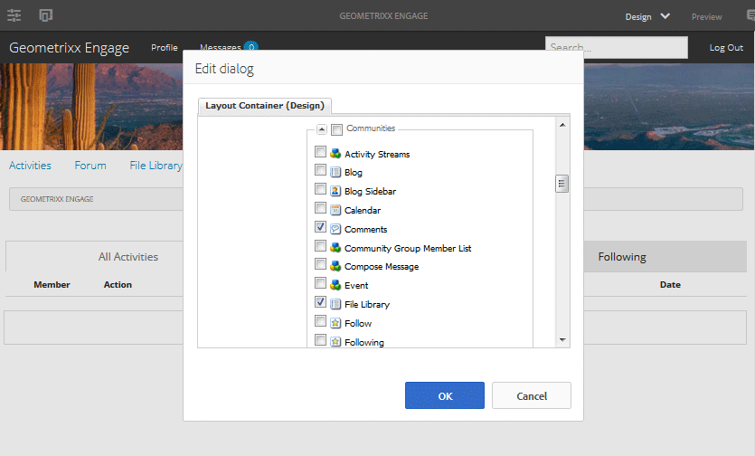

# Grundlagen zu Communities-Komponenten {#communities-components-basics}

## Übersicht {#overview}

Im Abschnitt &quot;Authoring&quot;der Dokumentation wird beschrieben, wie Sie im Bearbeitungsmodus für Autoren Communities-Funktionen zu AEM Sites hinzufügen und Komponentenkonfigurationen beschreiben.

Komponenten können mithilfe einer AEM-Instanz und der interaktiven [Handbuch zu Community-Komponenten](components-guide.md).

## Zugreifen auf Communities-Komponenten {#accessing-communities-components}

Wenn beim Erstellen von Seiteninhalten die zugrunde liegende Vorlage Änderungen am Design der Seite zulässt, ist es möglich, Komponenten zu aktivieren, die im Komponenten-Browser nicht bereits als Teil des Site-Designs verfügbar sind.

Die verfügbaren Communities-Komponenten werden aufgelistet [here](author-communities.md#available-communities-components).

>[!NOTE]
>
>Allgemeine Informationen zum Authoring finden Sie unter [Kurzanleitung zum Erstellen von Seiten](../../help/sites-authoring/qg-page-authoring.md).
>
>Wenn Sie nicht mit AEM vertraut sind, lesen Sie die Dokumentation unter [grundlegende Handhabung](../../help/sites-authoring/basic-handling.md).

### Aufrufen des Designmodus {#entering-design-mode}

Wenn eine **Communities** -Komponente nicht im Komponenten-Browser gefunden werden (Sidekick), muss `Design Mode` , um weitere Communities-Komponenten hinzuzufügen. [Erforderliche clientseitige Bibliotheken](#required-clientlibs) (clientlibs) hinzugefügt werden.

Weitere Informationen finden Sie unter [Konfigurieren von Komponenten im Designmodus](../../help/sites-authoring/default-components-designmode.md).

Im Folgenden finden Sie Bilder zur Auswahl einiger Communities-Komponenten und deren Anzeige im Komponenten-Browser:

Die ausgewählten Komponenten sind jetzt im Komponenten-Browser verfügbar:

## Erforderliche Clientlibs {#required-clientlibs}

[Client-seitige Bibliotheken](../../help/sites-developing/clientlibs.md) (clientlibs) sind für die ordnungsgemäße Funktion (JavaScript) und Formatierung (CSS) einer Komponente erforderlich.

Wenn Sie einer Seite eine Communities-Komponente hinzufügen und das Ergebnis ein Fehler oder ein unerwartetes Erscheinungsbild ist, sollten Sie zunächst die erforderlichen Clientlibs für die Communities-Komponente hinzufügen. Weitere Informationen finden Sie unter [Clientlibs für Communities-Komponenten](clientlibs.md).

### Beispiel: Ursprünglich platzierte Bewertungen ohne Client-Bibliotheken... {#example-initially-placed-reviews-without-client-libraries}

### ... Und mit Client-Bibliotheken {#and-with-client-libraries}

## Tagging {#tagging}

Viele Communities-Funktionen können so konfiguriert werden, dass Mitglieder Inhalte taggen können, die in der Veröffentlichungsumgebung eingegeben (veröffentlicht) wurden.

Wenn Tagging zulässig ist, kann die Konfiguration der Community-Site so festgelegt sein, dass die Namespaces, die Mitgliedern in der Veröffentlichungsumgebung angezeigt werden, beschränkt werden. Siehe [Community-Sites-Konsole](sites-console.md#tagging).

Funktionen, die Tagging ermöglichen: [Blog](blog-feature.md), [calendar](calendar.md), [Dateibibliothek](file-library.md), [Forum](forum.md)

Funktionen, die Tags verwenden: [suchen](search.md), [Social Tag Cloud](tagcloud.md)

Für Informationen zur Bearbeitung:

* [Verwenden von Tags](../../help/sites-authoring/tags.md)

Für Verwaltungsinformationen:

* Erstellen von Tag-Namespaces (Taxonomie): [Verwalten von Tags](../../help/sites-administering/tags.md)
* Community-Site-Konfiguration: siehe [TAGGING](sites-console.md#tagging)
* [Tagging benutzergenerierter Inhalte](../../help/sites-authoring/tags.md)

Für Entwicklerinformationen:

* [AEM-Tagging-Framework](../../help/sites-developing/framework.md)
* [Tagging-Grundlagen](tag.md)
