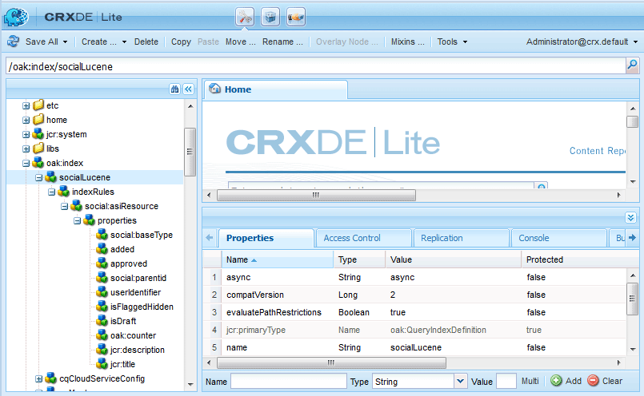

# Blogfunktion {#blog-feature}

## Einführung {#introduction}

Die Blogfunktion für AEM Communities wurde von einer Erstellungsaktivität in eine richtige Community-Aktivität umgewandelt, die in der Veröffentlichungsumgebung stattfindet.

Die Blogfunktion unterstützt die Bereitstellung von Community-Informationen in einem Aufzeichnungsformat. Blog-Einträge werden in der Umgebung &quot;Veröffentlichen&quot;von autorisierten Mitgliedern (registrierte, angemeldete Benutzer) vorgenommen.

Die Blogfunktion bietet Folgendes:

* Erstellung von Blogartikeln und -kommentaren in der Veröffentlichungsumgebung
* Bearbeiten von Rich-Text
* Inline-Bilder (mit Drag-and-Drop-Unterstützung)
* Eingebetteter Inhalt in sozialen Netzwerken ([Unterstützung von oEmbed](/help/communities/blog-developer-basics.md#allowing-rich-media))
* Entwurfsmodus
* Geplantes Veröffentlichen
* Erstellen im Auftrag (ein [privilegiertes Mitglied](/help/communities/users.md#privileged-members-group) kann Inhalte im Namen eines anderen Community-Mitglieds erstellen)
* [In-Kontext- und Massenmoderation](/help/communities/moderate-ugc.md) von Blogartikeln und -kommentaren

In diesem Abschnitt der Dokumentation wird Folgendes beschrieben::

* Hinzufügen der Blog-Funktion zu einer AEM-Site
* Konfigurationseinstellungen für Blog-Komponenten

>[!NOTE]
>
>Die Komponenten `Journal`und `Journal Sidebar` sind mit `Blog` und `Blog Sidebar`.
>
>Die Blogfunktion in AEM 6.0 und älteren Versionen wurde eingestellt. Sie beruhte auf einer Vorlage und beschränkte das Verfassen von Inhalten ausschließlich auf die Autorenumgebung.

## Hinzufügen von Blog-Komponenten zu einer Seite {#adding-blog-components-to-a-page}

Wenn Sie im Autorenmodus einen Blog zu einer Seite hinzufügen möchten, suchen Sie im Komponentenbrowser nach

* `Communities / Blog`
* `Communities / Blog Sidebar`

und ziehen Sie die Elemente an die jeweilige Position auf der Seite, auf der das Blog angezeigt werden soll.

For necessary information, visit [Communities Components Basics](/help/communities/basics.md).

When the [required client-side libraries](/help/communities/blog-developer-basics.md#essentials-for-client-side) are included, this is how the `Blog`component will appear :

Und wie das `Blog Sidebar` aussehen wird:

### Konfigurieren eines Blogs {#configuring-blog}

Select the placed `Blog` component to access and select the `Configure` icon which opens the edit dialog.

 

#### Registerkarte „Settings“{#settings-tab}

Geben Sie auf der Registerkarte **Einstellungen** die grundlegenden Eigenschaften des Blogs an:

* **Anhangminiatur zulassen**

   Wenn diese Option aktiviert ist, wird eine Miniaturansicht des angehängten Bildes erstellt.

* **Max. Anhangminiaturgröße**

   Maximale Größe (in Pixel) des Miniaturbilds der Anlage. Der Standardwert ist 800 x 800.

* **Minimale Bildgröße für Miniaturansicht**

   Mindestgröße (in Byte) des Bildes für die Erstellung von Miniaturbildern für Inline-Bilder. Der Standardwert ist 100000 Byte (100 KB).

* **Max. Miniaturgröße**

   Maximale Größe (in Pixel) des Miniaturbilds für Inline-Bild. Der Standardwert ist 800 x 800.

* **Privilegierte Mitglieder zulassen**

   Wenn diese Option aktiviert ist, dürfen nur Privilegierte Mitglieder Inhalte erstellen.

* **Zugelassene privilegierte Mitglieder**

   Hinzufügen die privilegierten Mitglieder, die Inhalte erstellen dürfen.

* **Benutzergenerierte Inhalte im Autoren-Bearbeitungsmodus blockieren**

   Wenn diese Option aktiviert ist, wird der vom Benutzer erstellte Inhalt bei der Bearbeitung im Autorenmodus blockiert.

* **Journaltitel**

   Der Blog-Titel, der auf der Seite angezeigt werden soll.

>[!NOTE]
>
>Mit dem Protokoll-Titel wird automatisch eine URL für den Blog erstellt.
>Maximal 50 Zeichen (mit 5 zusätzlichen Zeichen zur Eindeutigkeit) werden aus dem hier angegebenen Protokoll-Titel verwendet, um eine URL für den Blog zu erstellen.

* **Journalbeschreibung**

   Die Blog-Beschreibung.

* **Themen pro Seite**

   Definiert die Anzahl der Blog-Einträge/Kommentare pro Seite. Der Standardwert lautet 10.

* **Moderiert**

   Wenn diese Option aktiviert ist, muss die Veröffentlichung von Blog-Einträgen und Kommentaren genehmigt werden, bevor sie auf einer veröffentlichten Site erscheinen. Die Standardeinstellung ist deaktiviert.

* **Geschlossen**

   Wenn diese Option aktiviert ist, wird der Blog für neue Blog-Einträge und Kommentare geschlossen. Diese Option ist standardmäßig deaktiviert.

* **Rich-Text-Editor**

   Wenn diese Option aktiviert ist, können Blog-Einträge und Kommentare mit Markup eingegeben werden. Diese Option ist standardmäßig aktiviert.

* **Tagging zulassen**

   If checked, allow members to add tag labels to their post (see **Tag field** tab). Diese Option ist standardmäßig deaktiviert.

* **Datei-Uploads zulassen**

   Wenn diese Option aktiviert ist, können Sie zulassen, dass dem Blog-Eintrag oder -Kommentar Dateianlagen hinzugefügt werden. Diese Option ist standardmäßig deaktiviert.

* **Max. Dateigröße**

   Relevant nur, wenn `Allow File Uploads` aktiviert. Mit diesem Feld lässt sich die Größe (in Byte) der hochgeladenen Dateien beschränken. Der Standardwert ist 104857600 (10 MB).

* **Zulässige Dateitypen**

   Relevant nur, wenn `Allow File Uploads` aktiviert. Eine kommagetrennte Liste der zulässigen Dateierweiterungen inklusive Punkt. Beispiel: .jpg, .jpeg., png, .doc, .docx, .pdf. Wurden Dateitypen festgelegt, können Dateien nicht angegebenen Typs nicht hochgeladen werden. Die Standardeinstellung ist nicht angegeben, sodass alle Dateitypen zulässig sind.

* **Maximale Dateigröße für Bildanhang**

   Relevant nur, wenn &quot;Datei-Uploads zulassen&quot;aktiviert ist. Die maximal zulässige Anzahl von Bytes einer Bilddatei. Der Standardwert ist 2097152 (2 MB).

* **Antworten zulassen**

   Wenn diese Option aktiviert ist, lassen Sie Antworten auf Kommentare zu, die im Blog-Eintrag veröffentlicht wurden. Diese Option ist standardmäßig deaktiviert.

* **Abstimmung zulassen**

   Wenn diese Option aktiviert ist, fügen Sie die Funktion &quot;Abstimmung&quot;in einen Blog-Eintrag ein. Diese Option ist standardmäßig deaktiviert.

* **Benutzern das Löschen von Anmerkungen und Themen ermöglichen**

   Wenn diese Option aktiviert ist, können Sie Mitgliedern gestatten, die von ihnen veröffentlichten Kommentare und Blog-Einträge zu löschen. Der Standardwert ist** **nicht markiert.

* **Folgende zulassen**

   Wenn diese Option aktiviert ist, fügen Sie die folgende Funktion für Blog-Artikel hinzu, mit der Mitglieder über neue Beiträge [benachrichtigt](/help/communities/notifications.md) werden können. Diese Option ist standardmäßig deaktiviert.

* **E-Mail-Abonnements zulassen**

   Wenn diese Option aktiviert ist, können Sie den Mitgliedern per E-Mail ([Abonnement](/help/communities/subscriptions.md)) eine Benachrichtigung über neue Beiträge erlauben. Muss überprüft `Allow Following` und [E-Mail konfiguriert](/help/communities/email.md)werden. Diese Option ist standardmäßig deaktiviert.

* **Abzeichen anzeigen**

   Wenn diese Option aktiviert ist, zeigen Sie verdiente und zugewiesene [Abzeichen](/help/communities/implementing-scoring.md) mit dem Blog-Eintrag eines Mitglieds an. Diese Option ist standardmäßig deaktiviert.

* **Keine Antworten auf der Listenseite erhalten**

* **Feature-Inhalt zulassen**

   Wenn diese Option aktiviert ist, kann die Idee als [spezieller Inhalt](/help/communities/featured.md)identifiziert werden. Diese Option ist standardmäßig deaktiviert.

* **Erwähnung aktivieren**

   Wenn diese Option aktiviert ist, können Benutzer der registrierten Community andere registrierte Mitglieder identifizieren (mit Vorname, Nachname, Benutzername) und sie mit einem Tag versehen, das die übliche @user-name-Syntax verwendet. Die getaggten Benutzer erhalten Benachrichtigungen über ihre Erwähnungen.

* **Max. Erwähnungen**

   Schränken Sie die maximale Anzahl an Erwähnungen ein, die in einem Beitrag zulässig sind. Der Standardwert ist 10.

* **UI-Erwähnungsmuster**

   Geben Sie die zulässige Musterzeichenfolge an, um den registrierten Benutzer in einem Beitrag zu taggen (@Erwähnung). Beispiel: ~{{familyName}}{{vorname}}.

#### Registerkarte &quot;Benutzermoderation&quot; {#user-moderation-tab}

Geben Sie auf der Registerkarte **Benutzermoderation** die Moderationseinstellungen an:

* **Posts ablehnen**

   Wenn diese Option aktiviert ist, können Moderatoren vertrauenswürdiger Mitglieder Beiträge verweigern und verhindern, dass der Beitrag im öffentlichen Forum erscheint. Diese Option ist standardmäßig deaktiviert.

* **Themen schließen/erneut öffnen**

   Wenn diese Option aktiviert ist, können Moderatoren mit vertrauenswürdigen Mitgliedern ein Thema schließen, um weitere Änderungen und Kommentare vorzunehmen, und ein Thema erneut öffnen. Diese Option ist standardmäßig deaktiviert.

* **Posts kennzeichnen**

   Wenn diese Option aktiviert ist, können Sie Mitgliedern gestatten, die Themen oder Kommentare anderer als unangemessen zu kennzeichnen. Diese Option ist standardmäßig deaktiviert**.**

* **Liste mit Kenn-zeichnungsgründen**

   Wenn diese Option aktiviert ist, können die Mitglieder aus einer Dropdown-Liste auswählen, aus welchem Grund sie ein Thema oder einen Kommentar als unangemessen kennzeichnen. Diese Option ist standardmäßig deaktiviert.

* **Grund für benutzerdefinierte Kennzeichnung**

   Wenn diese Option aktiviert ist, können Sie Mitgliedern gestatten, einen eigenen Grund für die Kennzeichnung eines Themas oder Kommentars als unangemessen einzugeben. Diese Option ist standardmäßig deaktiviert**.**

* **Schwellenwert für Moderation**

   Geben Sie an, wie oft ein Thema oder Kommentar von Mitgliedern gekennzeichnet werden muss, bevor Moderatoren benachrichtigt werden. Der Standardwert ist 1 (einmal).

* **Kennzeichnungslimit**

   Geben Sie an, wie oft ein Thema oder Kommentar markiert werden muss, bevor er aus der öffentlichen Ansicht ausgeblendet wird. Bei einem Wert von -1 wird das gekennzeichnete Thema oder der gekennzeichnete Kommentar nie ausgeblendet. In allen anderen Fällen muss der Wert größer als der oder gleich dem „Schwellenwert für Moderation“ sein. Der Standardwert ist 5.

#### Tag-Feld, Registerkarte {#tag-field-tab}

Auf der Registerkarte **Tag-Feld** können Sie angeben, welche Tags verwendet werden dürfen, wenn die Option **Tagging zulassen** auf der Registerkarte **Einstellungen** aktiviert wurde:

* **Zulässige Namespaces**

   Relevant, wenn auf der Registerkarte **Einstellungen **geprüft `Allow Tagging` wird. Die verwendbaren Tags sind auf die ausgewählten Namespace-Kategorien beschränkt. Die Liste der Namensraum umfasst &quot;Standard-Tags&quot;(den standardmäßigen Namensraum) sowie &quot;Alle Tags einschließen&quot;. Standardmäßig ist die Option nicht aktiviert, es sind also alle Namespaces zulässig.

* **Empfehlungsgrenze**

   Geben Sie die Anzahl der Tags ein, die als Vorschlag für das Mitglied angezeigt werden sollen, das im Forum veröffentlicht wird. Der Wert -1 bedeutet keine Beschränkungen. Der Standardwert ist 0.

### Konfigurieren einer Blog-Seitenleiste {#configuring-blog-sidebar}

When you double-click the `Blog Sidebar` component, an edit dialog opens up.

Auf der Registerkarte **Journal-Sidebar-Einstellungen** können Sie das Datumsformat für Archive festlegen und angeben, welche Eintragstypen in der Seitenleiste aufgeführt werden sollen:

* **Datumsformat**

   Das Format, das für die Anzeige von Archiven von Blog-Einträgen verwendet wird. In diesem Format finden sich Platzhalter, die der Java-Konvention folgen.

   * JJJJ: lange Jahresangabe, z. B. 2015
   * JJ: kurze Jahresangabe, z. B. 15
   * MMMMM: vollständiger Monat, z. B. Juni
   * MMM: abgekürzter Monat, z. B. Jun
   * MM: Monatszahl, z. B. 06
   Der Standardwert ist &quot;yyyy MMMMM&quot;, der z. B. &quot;Juni 2015&quot;anzeigen würde.

* **Ansichtstyp**

   Titel und Typ der Blog-Einträge, die in der Seitenleiste angezeigt werden sollen. Die können aus folgenden Kategorien wählen:

   * Autoren
   * Kategorien
   * Archive

* **Blopg-Komponentenpfad**

   *(Optional)* Der Speicherort der Blog-Ressource, aus der Blog-Artikel aufgelistet werden sollen. Wenn Sie das Feld leer lassen, verwenden Sie die Komponente von resourceType `social/journal/components/hbs/journal` , die auf derselben Seite angezeigt wird.

   * Beispiel: `/content/sites/engage/en/blog/jcr:content/content/primary/blog`

* **Empfehlungsgrenze**

   Die Anzahl der anzuzeigenden Blog-Artikel. Der Wert -1 bedeutet keine Begrenzung. Der Standardwert ist -1.

## Site-Besuchererlebnis {#site-visitor-experience}

In der Veröffentlichungsumgebung wird bei der Blogfunktion der neueste Blogartikel angezeigt, gefolgt von älteren Einträgen, die absteigend nach Erstellungsdatum sortiert sind. Blog-Seitenleisten ermöglichen es Besuchern der Site, einen Filter anzuwenden, um die Auswahl der anzuzeigenden Artikel einzuschränken.

Dem Blogartikel folgt ein Link, über den Kommentare gelesen oder verfasst werden können.

Wurde ein Blogartikel ausgewählt, werden der Artikel sowie zugehörige Kommentare eingeblendet (falls aktiviert).

Die Verfügbarkeit weiterer Optionen hängt davon ab, ob der Site-Besucher Moderator, Administrator, Community-Mitglied, privilegiertes Mitglied oder anonymer Besucher ist.

### Arbeiten mit Artikeln {#working-with-articles}

Beim Erstellen eines neuen Blog-Artikels haben Sie folgende Möglichkeiten:

1. Sofort veröffentlichen
1. Einen Entwurf veröffentlichen
1. An einem geplanten Datum und zu einer geplanten Uhrzeit veröffentlichen

Die Blogartikel erscheinen auf der entsprechenden Registerkarte („Veröffentlicht“, „Entwürfe“ oder „Geplant“) und können von Mitgliedern bei der Veröffentlichung bearbeitet werden.

#### Moderatoren und Administratoren {#moderators-and-administrators}

Verfügt der angemeldete Benutzer über Moderator- oder Administratorrechte, kann er [Moderationsaufgaben](/help/communities/moderate-ugc.md) für alle Blogartikel und Komponenten des Blogs durchführen (je nach Berechtigungen durch die Konfiguration der Komponente).

#### Mitglieder {#members}

When the signed in user is a community member or [privileged member](/help/communities/users.md#privileged-members-group) (depending on configuration), they are able to select `New Article` to create and post a new blog article.

Insbesondere können sie

* Erstellen eines neuen Blog-Artikels
* Posten Sie einen neuen Blog-Artikel im Auftrag eines anderen Mitglieds
* Posten eines Kommentars zu einem Blog-Artikel
* Bearbeiten Sie einen eigenen Blog-Artikel oder -Kommentar
* Löschen Sie einen eigenen Blog-Artikel oder -Kommentar
* Markieren von Blog-Artikeln oder -Kommentaren anderer Benutzer

 

#### Anonym {#anonymous}

Nicht angemeldete Besucher können veröffentlichte Blogartikel und Kommentare lediglich lesen und übersetzen (falls unterstützt), jedoch keine eigenen Artikel oder Kommentare hinzufügen und keine Artikel und Kommentare anderer Benutzer kennzeichnen.

## Zusätzliche Informationen {#additional-information}

Weitere Informationen finden Sie auf der Entwickler-Seite [Blog-Grundlagen](/help/communities/blog-developer-basics.md).

Informationen zur Moderation von Blogartikeln und Kommentaren finden Sie unter [Moderation benutzergenerierter Inhalte](/help/communities/moderate-ugc.md).

Informationen zum Tagging von Blogartikeln und Kommentaren finden Sie unter [Tagging benutzergenerierter Inhalte](/help/communities/tag-ugc.md).

Informationen zur Übersetzung von Blogartikeln und Kommentaren finden Sie unter [Übersetzung benutzergenerierter Inhalte](/help/communities/translate-ugc.md).
