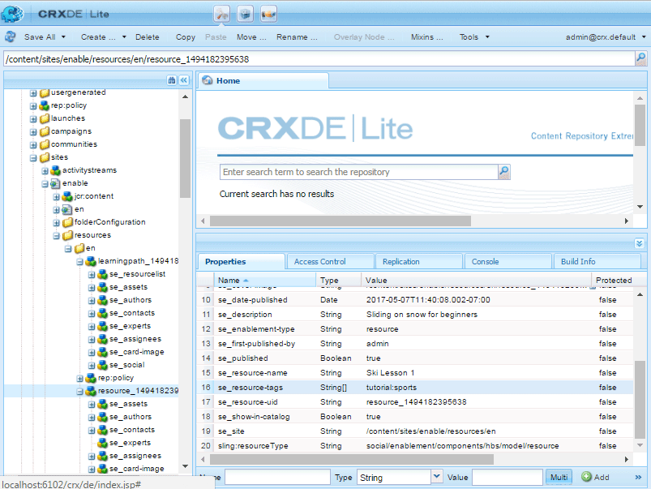

# Kataloggrundlagen {#catalog-essentials}

Auf dieser Seite finden Sie die wichtigsten Informationen zum Arbeiten mit der Katalogfunktion von Community-Seiten für die Aktivierung.

Mit der Katalogfunktion können Community-Mitglieder, die in einer Community-Site enthalten sind, die in einem Katalog aufgelisteten Aktivierungsressourcen durchsuchen und auswählen.

Die Komponente [ `enablement catalog`](catalog.md) ermöglicht Community-Mitgliedern den Zugriff auf einen Katalog von [Aktivierungsressourcen](resources.md). Die Verwendung AEM Tags ist ein wichtiger Bestandteil der Verwaltung des Erscheinungsbilds von Aktivierungsressourcen in einem Katalog.

Siehe [Tagging von Aktivierungsressourcen](tag-resources.md).

## Grundlagen für Client-seitige {#essentials-for-client-side}

<table>
 <tbody>
  <tr>
   <td> <strong>resourceType</strong></td>
   <td>social/enable/components/hbs/catalog</td>
  </tr>
  <tr>
   <td> <a href="scf.md#add-or-include-a-communities-component"><strong>einschließen</strong></a></td>
   <td>Nein</td>
  </tr>
  <tr>
   <td> <a href="clientlibs.md"><strong>clientllibs</strong></a></td>
   <td>cq.social.enablement.hbs.breadcrumbs  cq.social.enablement.hbs.catalog  cq.social.enablement.hbs.resource  cq.social.enablement.hbs.learning.path</td>
  </tr>
  <tr>
   <td> <strong>templates</strong></td>
   <td> /libs/social/enablement/components/hbs/catalog/catalog.hbs  </td>
  </tr>
  <tr>
   <td> <strong>css</strong></td>
   <td> /libs/social/enablement/components/hbs/catalog/clientlibs/catalog.css</td>
  </tr>
  <tr>
   <td><strong> properties</strong></td>
   <td>Siehe <a href="catalog.md">Katalogfunktion</a></td>
  </tr>
 </tbody>
</table>

## Grundlagen für serverseitige {#essentials-for-server-side}

### Katalogfunktion {#catalog-function}

Eine Community-Site-Struktur, die die [Katalogfunktion](functions.md#catalog-function) enthält, enthält eine konfigurierte `enablement catalog`-Komponente.

### Vorfilter {#pre-filters}

Wenn einer Community-Site eine Katalogfunktion hinzugefügt wurde, können Sie die Aktivierungsressourcen und Lernpfade, die im Katalog angezeigt werden, einschränken, indem Sie einen Vorfilter angeben. Dies geschieht durch Festlegen von Eigenschaften in der Instanz der Katalogressource für die Site.

Verwenden Sie das Beispiel des [Aktivierungs-Tutorials](getting-started-enablement.md):

* Beim Autor
* Verwenden von [CRXDE](../../help/sites-developing/developing-with-crxde-lite.md)

   * Beispiel: [https://&lt;server>:&lt;port>/crx/de](http://localhost:4502/crx/de)

* Navigieren Sie zur Katalogressource auf der Katalogseite.

   * Beispiel: `/content/sites/enable/en/catalog/jcr:content/content/primary/catalog`

* Knoten für untergeordnete Filter hinzufügen

   * Wählen Sie den Knoten `catalog`aus
   * Wählen Sie **[!UICONTROL Knoten erstellen]**

      * Name: `filters`
      * Typ: `nt:unstructured`
      * Wählen Sie **[!UICONTROL Alle speichern]**

* Fügen Sie die Eigenschaft `se_resource-tags` zum Knoten `filters` hinzu.

   * Wählen Sie den Knoten `filters` aus.
   * Hinzufügen einer Eigenschaft &quot;Multi&quot;

      * Name: `se_resource-tags`
      * Typ: String
      * Wert: *&lt;enter a [TagID](#pre-filter-tagids)*
         * Wählen Sie **[!UICONTROL Multi]**
         * Wählen Sie **[!UICONTROL Hinzufügen]**

            * Wählen Sie im Popup-Dialogfeld `+` aus, um zusätzliche Tag-IDs vor dem Filter hinzuzufügen.

* Veröffentlichen Sie die Community-Site erneut.

#### Tag-IDs vor dem Filter {#pre-filter-tagids}

Der Vorfilter [TagIDs](../../help/sites-developing/framework.md#tagid) muss genau mit den Tags übereinstimmen, die auf die Aktivierungsressourcen angewendet werden. Diese sind im Ordner `resources` der Site als Werte der Eigenschaft `se_resource-tags` sichtbar.

### Referenz-APIs {#reference-apis}

* [Aktivierungs-API](https://helpx.adobe.com/experience-manager/6-5/sites/developing/using/reference-materials/javadoc/com/adobe/cq/social/enablement/client/api/package-summary.html)

* [Reporting-API](https://helpx.adobe.com/experience-manager/6-5/sites/developing/using/reference-materials/javadoc/com/adobe/cq/social/enablement/client/reporting/api/package-summary.html)

* [Reporting-Analytics-API](https://helpx.adobe.com/experience-manager/6-5/sites/developing/using/reference-materials/javadoc/com/adobe/cq/social/enablement/client/reporting/analytics/api/package-summary.html)
