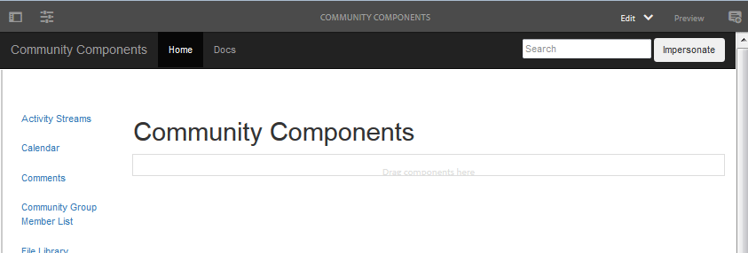

# Handbuch der Community-Komponenten  {#community-components-guide}

Das Handbuch zu Community-Komponenten ist ein interaktives Entwicklungstool für das [Social Component Framework (SCF)](scf.md). Es bietet eine Liste der verfügbaren AEM Communities-Komponenten oder der komplexeren Funktionen, die aus mehreren Komponenten erstellt wurden.

Neben grundlegenden Informationen für jede Komponente ermöglicht das Handbuch Experimente mit der Funktionsweise der SCF-Komponenten/-Funktionen und deren Konfiguration oder Anpassung.

Informationen zu Entwicklungsgrundlagen für die einzelnen Komponenten finden Sie unter [Funktionen und Komponenten-Grundlagen](essentials.md).

## Erste Schritte {#getting-started}

Das Handbuch ist für Entwicklungs-Installationen von Autoren- (localhost:4502) und Veröffentlichungsinstanzen (localhost:4503) vorgesehen.

Auf die Website &quot;Community-Komponenten&quot;können Sie unter

* [https://&lt;server>:&lt;port>/content/community-components/en.html](http://localhost:4502/content/community-components/en.html)

Die Interaktionen mit den Communities-Komponenten variieren je nach:

* Der Server (Autor oder Veröffentlichung).
* Gibt an, ob der Site-Besucher angemeldet ist.
* Bei Anmeldung werden die dem Mitglied zugewiesenen Berechtigungen zugewiesen.
* Gibt an, ob das standardmäßige SRP [JSRP](jsrp.md) verwendet wird.

Um beim Autor in den Bearbeitungsmodus zu wechseln, fügen Sie entweder `editor.html` oder `cf#` als erstes Pfadsegment nach dem Servernamen ein:

* Standard-Benutzeroberfläche:

   [https://&lt;server>:&lt;port>/editor.html/content/community-components/en.html](http://localhost:4502/editor.html/content/community-components/en.html)

* Klassische Benutzeroberfläche:

   [https://&lt;server>:&lt;port>/cf#/content/community-components/en.html](http://localhost:4502/cf#/content/community-components/en.html)

>[!NOTE]
>
>Beim Autor im Bearbeitungsmodus sind die Links auf einer Seite nicht aktiv.
>
>Um zu einer Komponentenseite zu navigieren, wählen Sie zunächst den Vorschaumodus aus, um die Links zu aktivieren.
>
>Kehren Sie bei angezeigter Komponentenseite im Browser zum Bearbeitungsmodus zurück, um das Bearbeitungsdialogfeld der Komponente zu öffnen.
>
>Allgemeine Informationen zum Authoring finden Sie in der [Kurzanleitung zum Erstellen von Seiten](../../help/sites-authoring/qg-page-authoring.md).
>
>Wenn Sie nicht mit AEM vertraut sind, lesen Sie die Dokumentation zu [Grundlegender Umgang](../../help/sites-authoring/basic-handling.md).

### Startseite {#home-page}

Das Handbuch enthält eine Liste von SCF-Komponenten, die links auf der Seite für die Vorschau und das Prototyping verfügbar sind.

Komponentenleitfaden, wie in einer Autoreninstanz im Bearbeitungsmodus angezeigt:

## Komponentenseiten {#component-pages}

Wählen Sie eine Komponente aus der Liste auf der linken Seite der Seite aus.

Der Hauptteil des Handbuchs wird angezeigt:

1. Titel: Der Name der ausgewählten Komponente
1. [Client-seitige Bibliotheken](#client-side-libraries): Liste einer oder mehrerer erforderlicher Kategorien
1. [Inclusible](scf.md#add-or-include-a-communities-component): Wenn die Komponente dynamisch eingeschlossen werden kann, kann der Status im Bearbeitungsmodus des Autors umgeschaltet werden:

   * Wenn hinzugefügt, wird folgender Text angezeigt: &quot;Diese Komponente wird über ihren par -Knoten einbezogen.&quot;
   * Wenn enthalten, lautet der angezeigte Text: &quot;Diese Komponente wird dynamisch einbezogen.&quot;
   * Wenn nicht eingeschlossen, wird kein Text angezeigt

1. Beispielkomponente oder -funktion: eine aktive Instanz der Komponente oder Funktion. Wenn eine Komponente geändert werden soll, kann sie durch Änderungen an den Vorlagen, CSS und Daten, die im Tab-Abschnitt bereitgestellt werden, geändert werden.

>[!NOTE]
>
>Nachdem Sie eine Auswahl auf der linken Seite getroffen haben, wird die Komponente unten angezeigt, anstatt neben der Liste der Komponenten, wenn das Browser-Fenster zu eng ist.

### Autoreninteraktionen {#author-interactions}

Wenn Sie das Handbuch in einer Autoreninstanz verwenden, ist es möglich, die Konfiguration einer Komponente durch Öffnen des Dialogfelds zu erleben. Informationen für Entwickler finden Sie im Abschnitt [Komponenten- und Funktionsgrundlagen](essentials.md) der Dokumentation, während die Dialogeinstellungen für Autoren im Abschnitt [Communities-Komponenten](author-communities.md) beschrieben werden.

Im Komponentenleitfaden für die Community-Komponenten werden einige Einstellungen des Komponentendialogfelds mit dem Umschalter-Status [Inclusible](scf.md#add-or-include-a-communities-component) überlagert. Um zwischen der Verwendung der vorhandenen Ressource oder einer dynamisch eingeschlossenen Ressource umzuschalten, wählen Sie im Bearbeitungsmodus sowohl die Komponente als auch den einschließbaren Text aus und doppelklicken Sie, um das Bearbeitungsdialogfeld zu öffnen:

Auf der Registerkarte **Vorlagen** :

* **Untergeordnete Komponente mit sling:include einschließen**

   Wenn diese Option deaktiviert ist, verwendet das Komponentenleitfaden die vorhandene Ressource im Repository (einen jcr-Knoten, der einem par -Knoten untergeordnet ist).

   * angezeigter Text: &quot;Diese Komponente wird über ihren par -Knoten einbezogen.&quot;

   Wenn diese Option aktiviert ist, verwendet das Komponentenleitfaden Sling, um eine Komponente des resourceType des untergeordneten Knotens (nicht vorhandene Ressource) dynamisch einzuschließen.

   * angezeigter Text: &quot;Diese Komponente wird dynamisch einbezogen.&quot;

   Diese Option ist standardmäßig deaktiviert.

### Veröffentlichungsinteraktionen {#publish-interactions}

Bei Verwendung des Handbuchs in einer Veröffentlichungsinstanz ist es möglich, die Komponenten und Funktionen als Site-Besucher (nicht angemeldet) und als Mitglieder mit verschiedenen Berechtigungen beim Anmelden zu erleben.

>[!NOTE]
>
>Beachten Sie: Wenn das SRP standardmäßig auf [JSRP](jsrp.md) festgelegt ist, ist in der Veröffentlichungsinstanz eingegebener UGC nur bei der Veröffentlichung sichtbar und *nicht* ist in der Konsole [Moderation](moderate-ugc.md) in der Autoreninstanz sichtbar.

## Client-seitige Bibliotheken {#client-side-libraries}

Die für jede Komponente aufgelisteten Client-seitigen Bibliotheken (clientlibs) sind die *required*, die referenziert werden sollen, wenn die Komponente auf einer Seite platziert wird. Die clientlibs bieten eine Möglichkeit, den Download von JavaScript und CSS zu verwalten und zu optimieren, die zum Rendern der Komponente im Browser verwendet werden.

Weitere Informationen finden Sie unter [Clientlibs für Communities-Komponenten](clientlibs.md).

## Personifikation {#impersonation}

Verwenden Sie in der Autoreninstanz, in der häufig ein Benutzer als Administrator oder Entwickler angemeldet ist, das Textfeld links neben der Schaltfläche **[!UICONTROL Identität annehmen]**, um die Komponente als ein anderer Benutzer angemeldet zu haben. Geben Sie dann entweder den Benutzernamen ein oder wählen Sie aus der Pulldown-Liste aus und klicken Sie dann auf die Schaltfläche. Klicken Sie auf Wiederherstellen , um den Identitätswechsel zu signalisieren und zu beenden.

Die Veröffentlichungsinstanz muss nicht stellvertretend agieren. Verwenden Sie einfach den Link Anmelden/Abmelden , um verschiedene Benutzer zu imitieren, z. B. [Demobenutzer](tutorials.md#demo-users).

## Anpassung {#customization}

Wenn diese Option aktiviert ist, steht jede SCF-Komponente für die Prototypisierung möglicher Anpassungen zur Verfügung, indem die Vorlage, CSS und Daten der Komponente vorübergehend geändert werden.

### Aktivieren der Anpassung {#enabling-customization}

>[!NOTE]
>
>**Dieses Tool ist schreibgeschützt**. An Vorlagen, CSS oder Daten vorgenommene Änderungen werden nicht im Repository gespeichert.

Um schnell mit Anpassungen zu experimentieren, muss die `scg:showIde`Eigenschaft zum JCR-Knoten der Inhaltsseite der Komponente hinzugefügt und auf &quot;true&quot;gesetzt werden.

Verwenden der Kommentarkomponente als Beispiel für die Autoren- oder Veröffentlichungsinstanz, die mit Administratorrechten angemeldet ist:

1. Navigieren Sie zu [CRXDE Lite](../../help/sites-developing/developing-with-crxde-lite.md)

   Beispiel: [http://localhost:4503/crx/de](http://localhost:4503/crx/de)

1. Wählen Sie den Knoten `jcr:content` der Komponente aus.

   Beispiel: `/content/community-components/en/comments/jcr:content`

1. Eigenschaft hinzufügen

   * **Name** `scg:showIde`
   * **Typ** `String`
   * **Wert** `true`

1. Wählen Sie **[!UICONTROL Alle speichern]**
1. Laden Sie die Seite &quot;Kommentare&quot;im Handbuch erneut.

   [http://localhost:4503/content/community-components/en/comments.html](http://localhost:4503/content/community-components/en/comments.html)

1. Beachten Sie, dass es jetzt 3 Registerkarten für Vorlagen, CSS und Daten gibt.

### Registerkarte &quot;Vorlagen&quot;{#templates-tab}

Wählen Sie den Tab Vorlagen aus, um die mit der Komponente verknüpften Vorlagen anzuzeigen.

Mit dem Vorlagen-Editor können lokale Bearbeitungen kompiliert und auf die Beispielkomponenteninstanz oben auf der Seite angewendet werden, ohne dass sich dies auf die Komponente im Repository auswirkt.

Wenn Sie die Kompilierung auf lokalen Bearbeitungen ausführen, werden alle Fehler hervorgehoben, indem Sie einen Punkt in der Rinne platzieren und den Text rot markieren.

### CSS-Registerkarte {#css-tab}

Wählen Sie die Registerkarte CSS aus, um die mit der Komponente verknüpfte CSS anzuzeigen.

Wenn eine Komponente aus mehreren Komponenten zusammengesetzt ist, können einige CSS unter einer der anderen Komponenten aufgeführt sein.

Mit dem CSS-Editor kann das CSS geändert und auf die Beispielkomponenteninstanz oben auf der Seite angewendet werden.

Es kann eine Regel ausgewählt werden, um die Teile des DOM mithilfe dieser Regel hervorzuheben, indem Sie neben der Regel in der Rinne auf klicken.

### Registerkarte &quot;Daten&quot; {#data-tab}

Wählen Sie die Registerkarte Daten aus, um die Endpunktdaten .social.json anzuzeigen. Diese Daten können bearbeitet werden und werden auf die Beispielkomponenteninstanz angewendet.

Syntaxfehler können im Rinnstein markiert und im Editor hervorgehoben werden.
