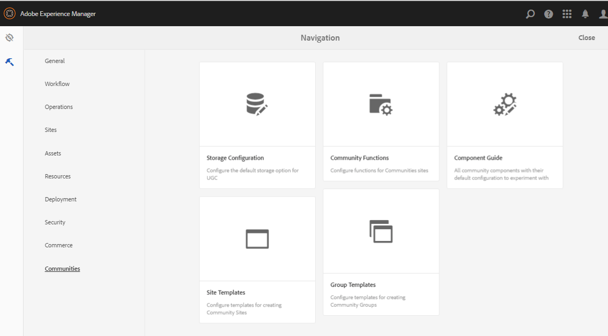

# Erstellen einer Beispielseite {#create-a-sample-page}

Ab AEM 6.1 Communities ist es am einfachsten, eine Beispielseite zu erstellen, indem eine einfache Community-Site erstellt wird, die aus einer Page-Funktion besteht.

Dazu gehört eine parsys-Komponente, mit der Sie [Komponenten für die Bearbeitung aktivieren können](basics.md#accessing-communities-components).

Eine weitere Option zur Erforschung von Beispielkomponenten ist die Verwendung der im [Community Components Guide](components-guide.md) dargestellten Funktionen.

## Erstellen einer Community-Site {#create-a-community-site}

Dies ähnelt dem Erstellen einer neuen Website, die unter [Erste Schritte mit AEM Communities](getting-started.md) beschrieben wird.

Der Hauptunterschied besteht darin, dass dieses Tutorial eine neue Community-Site-Vorlage erstellt, die nur die [Seitenfunktion](functions.md#page-function) enthält, um eine einfache Community-Site zu erstellen, die frei von anderen Funktionen ist (außer den vorab verkabelten Funktionen, die für alle Community-Sites grundlegend sind).

### Neue Site-Vorlage erstellen {#create-new-site-template}

Erstellen Sie zunächst eine einfache [Community-Site-Vorlage](sites.md).

Wählen Sie in der globalen Navigation einer Autoreninstanz **[!UICONTROL Tools]** > **[!UICONTROL Communities]** > **[!UICONTROL Site-Vorlagen]** aus.

* Wählen Sie nun eine der folgenden Optionen aus `Create button`
* GRUNDLEGENDE INFORMATIONEN

   * `Name`: Einzelseitenvorlage
   * `Description`: Eine Vorlage, die aus einer einzelnen Seitenfunktion besteht.
   * Wählen Sie nun eine der folgenden Optionen aus `Enabled`

* STRUKTUR

   * Ziehen Sie eine `Page`-Funktion in den Vorlagen-Builder
   * Geben Sie für Details zur Konfigurationsfunktion ein.

      * `Title`: Einzelseite
      * `URL`: page

* Wählen Sie **`Save`** für die Konfiguration aus.
* Wählen Sie **`Save`** für die Site-Vorlage aus.

### Neue Community-Site erstellen {#create-new-community-site}

Erstellen Sie nun eine neue Community-Site basierend auf der einfachen Site-Vorlage.

Wählen Sie nach der Erstellung der Site-Vorlage in der globalen Navigation **[!UICONTROL Communities > Sites]** aus.

* Symbol **`Create`** auswählen

* Schritt `1 - Site Template`

   * `Title`: Einfache Community-Site
   * `Description`: Eine Community-Site, die aus einer einzelnen Seite zum Experimentieren besteht.
   * `Community Site Root: (leave blank)`
   * `Community Site Base Language: English`
   * `Name`: Beispiel

      * url = http://localhost:4502/content/sites/sample

      * `Template`: Auswählen  `Single Page Template`

      

* Wählen Sie nun eine der folgenden Optionen aus `Next`
* Schritt `2 - Design`

   * Entwurf auswählen

* Wählen Sie nun eine der folgenden Optionen aus `Next`
* Wählen Sie nun eine der folgenden Optionen aus `Next`

   (Alle Standardeinstellungen akzeptieren)

* Wählen Sie nun eine der folgenden Optionen aus `Create`

   

## Veröffentlichen der Site {#publish-the-site}

Wählen Sie in der Konsole [Community-Sites](sites-console.md) das Veröffentlichungssymbol aus, um die Site zu veröffentlichen, standardmäßig http://localhost:4503.

## Öffnen Sie die Site auf der Autoreninstanz im Bearbeitungsmodus {#open-the-site-on-author-in-edit-mode}

Wählen Sie das Symbol zum Öffnen der Site aus, um die Site im Bearbeitungsmodus anzuzeigen.

Die URL lautet [http://localhost:4502/editor.html/content/sites/sample/en.html](http://localhost:4502/editor.html/content/sites/sample/en.html)

Auf der einfachen Startseite können Sie sehen, was über die Community-Funktionen und -Vorlagen vorab verkabelt ist, und mit dem Hinzufügen und Konfigurieren von Community-Komponenten spielen.

## Site zur Veröffentlichung anzeigen {#view-site-on-publish}

Öffnen Sie nach dem Veröffentlichen der Seite die Seite in der [Veröffentlichungsinstanz](http://localhost:4503/content/sites/sample/en.html), um mit den Funktionen als anonymer Site-Besucher, angemeldeter Mitglied oder Administrator zu experimentieren. Der in der Autorenumgebung angezeigte Link Administration wird in der Veröffentlichungsumgebung nur angezeigt, wenn sich ein Administrator anmeldet.
