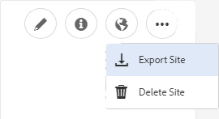

# Verfassen einer Community-Site{#author-a-new-community-site}

## Community-Site erstellen {#create-a-community-site}

Verwenden Sie die Autoreninstanz, um eine Community-Site zu erstellen. In AEM Autoreninstanz:

1. Melden Sie sich mit Administratorrechten an.
1. Navigieren Sie von der globalen Navigation zu **[!UICONTROL Communities]** > **[!UICONTROL Sites]**.

Die Communities Sites-Konsole bietet einen Assistenten, der Sie durch die Schritte zum Erstellen einer Community-Site führt. Es ist möglich, mit dem Schritt `Next` oder mit `Back` zum vorherigen Schritt fortzufahren, bevor die Site im letzten Schritt übergeben wird.

So erstellen Sie eine Community-Site:

* Wählen Sie die Schaltfläche `Create` aus.

### Schritt 1: Site-Vorlage {#step-site-template}

Geben Sie im Schritt [Site-Vorlage ](/help/communities/sites-console.md#step2013asitetemplate) einen Titel, eine Beschreibung und den Namen für die URL ein und wählen Sie eine Community-Site-Vorlage aus, z. B.:

* **Community-Site-Titel**: `Getting Started Tutorial`
* **Community-Site-Beschreibung**: `A site for engaging with the community.`
* **Community-Site-Stamm**: (Leer für Standardstamm `/content/sites` lassen)
* **Cloud-Konfigurationen**: (Lassen Sie das Feld leer, wenn keine Cloud-Konfigurationen angegeben sind) Geben Sie den Pfad zu den angegebenen Cloud-Konfigurationen an.
* **Community-Site-Basissprache**: (Lassen Sie die Sprache unberührt für eine einzelne Sprache: Englisch) Verwenden Sie die Dropdownliste, um eine *oder mehrere* Basissprachen aus den verfügbaren Sprachen - Deutsch, Italienisch, Französisch, Japanisch, Spanisch, Portugiesisch (Brasilien), Chinesisch (Traditionell) und Chinesisch (vereinfacht) auszuwählen. Eine Community-Site wird für jede hinzugefügte Sprache erstellt und befindet sich im selben Site-Ordner, der den Best Practices folgt, die unter [Übersetzen von Inhalten für mehrsprachige Sites](/help/sites-administering/translation.md) beschrieben werden. Die Stammseite jeder Site enthält eine untergeordnete Seite mit dem Namen des Sprachcodes einer der ausgewählten Sprachen, z. B. &quot;en&quot;für Englisch oder &quot;fr&quot;für Französisch.

* **Community-Site-Name**: interagieren

   * Überprüfen Sie den Namen, da er nach der Erstellung der Site nicht einfach geändert werden kann.
   * Die ursprüngliche URL wird unter dem Community-Site-Namen angezeigt
   * Hängen Sie für eine gültige URL einen Basissprachcode an + &quot;.html&quot;.
   * *Beispiel*, https://localhost:4502/content/sites/ `engage/en.html`

* **Vorlage**: Zum Auswählen `Reference Site` nach unten ziehen

* Wählen Sie **Weiter** aus.

### Schritt 2: Design {#step-design}

Der Schritt &quot;Design&quot;wird in zwei Abschnitten zur Auswahl des Designs und des Branding-Banners vorgestellt:

#### SITE-THEMA DER GEMEINSCHAFT {#community-site-theme}

Wählen Sie den gewünschten Stil aus, den Sie auf die Vorlage anwenden möchten. Wenn diese Option aktiviert ist, wird das Design mit einem Häkchen überlagert.

#### GEMEINSCHAFTLICHE SITE-BRANCHE {#community-site-branding}

(Optional) Laden Sie ein Bannerbild hoch, das auf den Seiten der Site angezeigt werden soll. Das Banner wird an den linken Rand des Browsers zwischen dem Community-Site-Header und den Navigationslinks fixiert. Die Bannerhöhe wird auf 120 Pixel zugeschnitten. Die Größe des Banners kann nicht an die Breite des Browsers und die Höhe von 120 Pixel angepasst werden.

Wählen Sie **Weiter** aus.

### Schritt 3: Einstellungen {#step-settings}

Im Schritt Einstellungen gibt es vor der Auswahl von `Next` sieben Abschnitte, die Zugriff auf Konfigurationen bieten, die Benutzerverwaltung, Tagging, Moderation, Gruppenverwaltung, Analyse und Übersetzung umfassen.

#### User Management {#user-management}

Aktivieren Sie alle Kontrollkästchen für [Benutzerverwaltung](/help/communities/sites-console.md#user-management)

* So können sich Site-Besucher selbstregistrieren
* So können Besucher der Site die Site anzeigen, ohne sich anzumelden
* So können Mitglieder Nachrichten von anderen Community-Mitgliedern senden und empfangen
* So lassen Sie die Anmeldung mit Facebook statt der Registrierung und Erstellung eines Profils zu
* So lassen Sie die Anmeldung mit Twitter statt der Registrierung und Erstellung eines Profils zu

>[!NOTE]
>
>Für eine Produktionsumgebung ist es erforderlich, benutzerdefinierte Facebook- und Twitter-Anwendungen zu erstellen. Siehe [Anmeldung in sozialen Netzwerken mit Facebook und Twitter](/help/communities/social-login.md).

#### TAGGING {#tagging}

Die Tags, die auf Community-Inhalte angewendet werden, werden durch die Auswahl AEM Namespaces gesteuert, die zuvor über die [Tagging-Konsole](/help/sites-administering/tags.md#tagging-console) definiert wurden (z. B. den [Tutorial-Namespace](/help/communities/setup.md#create-tutorial-tags)).

Die Suche nach Namespaces ist mit der Typvorsuche einfach. Zum Beispiel:

* Typ `tut`
* Klicken Sie auf `Tutorial`

#### ROLLEN {#roles}

[Community-Mitgliederrollen](/help/communities/users.md) werden über die Einstellungen im Abschnitt &quot;Rollen&quot;zugewiesen.

Damit ein Community-Mitglied (oder eine Gruppe von Mitgliedern) die Site als Community-Manager erleben kann, verwenden Sie die Typvorsuche und wählen Sie den Mitglied- oder Gruppennamen aus den Optionen in der Dropdown-Liste aus.

Zum Beispiel:

* Typ `q`
* Quinn Harper auswählen

>[!NOTE]
>
>Der [Tunnel-Dienst](https://helpx.adobe.com/experience-manager/6-3/help/communities/deploy-communities.html#tunnel-service-on-author) ermöglicht die Auswahl von Mitgliedern und Gruppen, die nur in der Veröffentlichungsumgebung vorhanden sind.

#### MODERATION {#moderation}

Akzeptieren Sie die globalen Standardeinstellungen für [Moderation](/help/communities/sites-console.md#moderation) benutzergenerierter Inhalte (UGC).

#### ANALYTICS {#analytics}

Wenn Adobe Analytics lizenziert ist und ein Analytics Cloud-Dienst und -Framework konfiguriert wurden, können Sie Analytics aktivieren und das Framework auswählen.

Siehe [Analytics-Konfiguration für Communities-Funktionen](/help/communities/analytics.md).

#### ÜBERSETZUNG {#translation}

Die [Übersetzungseinstellungen](/help/communities/sites-console.md#translation) geben die Basissprache für die Site an, ob UGC übersetzt werden kann und in welche Sprache, falls ja.

* Aktivieren Sie **Maschinelle Übersetzung zulassen** .
* Behalten Sie die für die Übersetzung ausgewählten Standardsprachen beim standardmäßigen Dienst für maschinelle Übersetzung bei.
* Behalten Sie den standardmäßigen Übersetzungsanbieter und die Konfiguration bei
* Ein globaler Store ist nicht erforderlich, da es keine Sprachkopien gibt
* Wählen Sie **Gesamte Seite übersetzen** aus.
* Behalten Sie die Standardpersistenzoption bei

### Schritt 4: Erstellen der Communities-Site {#step-create-communities-site}

Wählen Sie **Erstellen.**

Nach Abschluss des Vorgangs wird der Ordner für die neue Site in der Konsole Communities - Sites angezeigt.

## Publish auf der Community-Site {#publish-the-community-site}

Die erstellte Site sollte über die Konsole Communities - Sites verwaltet werden. Dieselbe Konsole, von der aus neue Sites erstellt werden können.

Nachdem Sie den Ordner der Community-Site ausgewählt haben, um ihn zu öffnen, halten Sie den Mauszeiger über das Site-Symbol, sodass vier Aktionssymbole angezeigt werden:

Bei Auswahl des vierten Ellipsensymbols (Weitere Aktionen) werden die Optionen &quot;Site exportieren&quot;und &quot;Site löschen&quot;angezeigt.

Von links nach rechts sind sie:

* **Site öffnen**

  Wenn Sie das Stiftsymbol auswählen, wird die Community-Site im Bearbeitungsmodus &quot;Autor&quot;geöffnet, in dem Sie Seitenkomponenten hinzufügen oder konfigurieren können.

* **Site bearbeiten**

  Wenn Sie das Eigenschaftensymbol auswählen, wird die Community-Site zum Ändern von Eigenschaften wie dem Titel oder zum Ändern des Designs geöffnet.

* **Publish-Site**

  Durch Auswahl des Weltsymbols wird die Community-Site veröffentlicht (z. B. wenn Ihr Veröffentlichungsserver auf Ihrem lokalen Computer ausgeführt wird, ist standardmäßig localhost:4503 eingestellt).

* **Site exportieren**

  Durch Auswahl des Exportsymbols wird ein Paket der Community-Site erstellt, das sowohl im [Package Manager](/help/sites-administering/package-manager.md) gespeichert als auch heruntergeladen wird. UGC ist nicht im Site-Paket enthalten.

* **Site löschen**

  Durch Auswahl des Löschsymbols wird die Community-Site aus **[!UICONTROL Communities > Sites-Konsole]** gelöscht. Durch diese Aktion werden alle mit der Site verknüpften Elemente entfernt, z. B. benutzergenerierte Inhalte, Benutzergruppen, Assets und Datenbankdatensätze.

>[!NOTE]
>
>Wenn Sie nicht den standardmäßigen Port 4503 für die Veröffentlichungsinstanz verwenden, bearbeiten Sie den standardmäßigen Replikationsagenten, um die Anschlussnummer auf den richtigen Wert festzulegen.
>
>In der Autoreninstanz über das Hauptmenü:
>
>1. Navigieren Sie zum Menü **[!UICONTROL Tools]** > **[!UICONTROL Vorgänge]** > **[!UICONTROL Replikation]** .
>1. Wählen Sie **[!UICONTROL Agenten für Autor]** aus.
>1. Wählen Sie **[!UICONTROL Standardagent (publish)]** aus.
>1. Wählen Sie neben **[!UICONTROL Einstellungen]** die Option **[!UICONTROL Bearbeiten]** aus.
>1. Wählen Sie im Popup-Dialogfeld für Agenteneinstellungen die Registerkarte **[!UICONTROL Transport]** aus.
>1. Ändern Sie in URI die Portnummer 4503 in die gewünschte Portnummer. Beispiel für die Verwendung von Port 6103: https://localhost:6103/bin/receive?sling:authRequestLogin=1
>1. Wählen Sie **[!UICONTROL OK]** aus.
>1. (Optional) Wählen Sie **[!UICONTROL Löschen]** oder **[!UICONTROL Wiederholen erzwingen]** aus, um die Replikationswarteschlange zurückzusetzen.

### Publish auswählen {#select-publish}

Nachdem Sie sichergestellt haben, dass der Veröffentlichungsserver ausgeführt wird, wählen Sie das Weltsymbol aus, um die Community-Site zu veröffentlichen.

Wenn die Community-Site erfolgreich veröffentlicht wurde, erscheint kurz eine Meldung &quot;Site veröffentlicht&quot;.

### Neue Community-Benutzergruppen {#new-community-user-groups}

Zusammen mit der neuen Community-Site werden neue Benutzergruppen erstellt, die über die entsprechenden Berechtigungen für verschiedene Verwaltungsfunktionen verfügen. Weitere Informationen finden Sie unter [Benutzergruppen für Community-Sites](/help/communities/users.md#usergroupsforcommunitysites).

Für diese neue Community-Site werden die vier neuen Benutzergruppen unter dem Site-Namen &quot;engage&quot;in Schritt 1 in der [Gruppenkonsole](/help/communities/members.md) (globale Navigation: Communities, Gruppen) angezeigt:

* Community-Manager einbinden
* Community-Engage-Gruppenadministratoren
* Community-Engage-Mitglieder
* Community-Moderatoren einbinden
* Community-Interaktion mit privilegierten Mitgliedern
* Community Engage Site Content Manager

[Aaron McDonald](/help/communities/tutorials.md#demo-users) ist Mitglied von

* Community-Manager einbinden
* Community-Moderatoren einbinden
* Community-Engage-Mitglieder (indirekt als Mitglied der Gruppe Moderatoren )

#### https://localhost:4503/content/sites/engage/en.html {#http-localhost-content-sites-engage-en-html}

## Authentifizierungsfehler konfigurieren {#configure-for-authentication-error}

Nachdem eine Site konfiguriert und zur Veröffentlichung gepusht wurde, konfigurieren Sie die Anmelde-Zuordnung](/help/communities/sites-console.md#configure-for-authentication-error) ( `Adobe Granite Login Selector Authentication Handler`) in der Veröffentlichungsinstanz. [ Der Vorteil besteht darin, dass bei nicht korrekter Eingabe der Anmeldedaten der Authentifizierungsfehler die Anmeldeseite der Community-Site mit einer Fehlermeldung erneut anzeigt.

Fügen Sie eine `Login Page Mapping` als

* `/content/sites/engage/en/signin:/content/sites/engage/en`

## Optionale Schritte {#optional-steps}

### Standardstartseite ändern {#change-the-default-home-page}

Wenn Sie zur Veranschaulichung mit der Veröffentlichungs-Site arbeiten, kann es nützlich sein, die standardmäßige Startseite auf die neue Site zu ändern.

Dazu müssen Sie [CRXDE](https://localhost:4503/crx/de) Lite verwenden, um die Tabelle [resource-mapping](/help/sites-deploying/resource-mapping.md) in der Veröffentlichungsinstanz zu bearbeiten.

Erste Schritte:

1. Melden Sie sich in der Veröffentlichungsinstanz mit Administratorrechten an.
1. Navigieren Sie zu [https://localhost:4503/crx/de](https://localhost:4503/crx/de).
1. Erweitern Sie im Projektbrowser den Wert `/etc/map.`
1. Wählen Sie den Knoten `http` aus:

   * Wählen Sie **Knoten erstellen:**

      * **Name** localhost.4503
(verwenden Sie *nicht* &#39;:&#39;)

      * **Typ** [sling:Mapping](https://sling.apache.org/documentation/the-sling-engine/mappings-for-resource-resolution.html)

1. Mit neu erstelltem `localhost.4503` -Knoten ausgewählt:

   * Eigenschaft hinzufügen:

   * **Name** sling:match
      * **Typ** Zeichenfolge
      * **Wert** localhost.4503/$
(muss mit &#39;$&#39; char enden)

   * Eigenschaft hinzufügen:

      * **Name** sling:internalRedirect
      * **Typ** Zeichenfolge
      * **Wert** /content/sites/engage/en.html

1. Wählen Sie **Alle speichern.**
1. (Optional) Löschen Sie den Browser-Verlauf.
1. Navigieren Sie zu https://localhost:4503/.

   * Ankunft unter https://localhost:4503/content/sites/engage/en.html

>[!NOTE]
>
>Um zu deaktivieren, setzen Sie dem Eigenschaftswert `sling:match` einfach das Präfix &quot;x&quot;- `xlocalhost.4503/$` - und **Alle speichern** voran.

#### Fehlerbehebung: Fehler beim Speichern der Zuordnung {#troubleshooting-error-saving-map}

Wenn Änderungen nicht gespeichert werden können, stellen Sie sicher, dass der Knotenname &quot;`localhost.4503`&quot; mit einem Punkt-Trennzeichen und nicht &quot;`localhost:4503`&quot;mit einem Doppelpunkt-Trennzeichen ist, da &quot;`localhost`kein gültiges Namespace-Präfix ist.

#### Fehlerbehebung: Fehler bei Umleitung {#troubleshooting-fail-to-redirect}

Der &quot;**$**&quot; am Ende der Zeichenfolge des regulären Ausdrucks `sling:match`ist wichtig, sodass nur `https://localhost:4503/` zugeordnet wird. Andernfalls wird der Umleitungswert jedem Pfad vorangestellt, der nach der URL server:port vorhanden sein könnte. Wenn AEM also versucht, zur Anmeldeseite umzuleiten, schlägt dies fehl.

### Ändern der Site {#modify-the-site}

Nachdem die Site zum ersten Mal erstellt wurde, können Autoren das Symbol [Site öffnen](/help/communities/sites-console.md#authoring-site-content) verwenden, um standardmäßige AEM zu erstellen.

Darüber hinaus können Administratoren das Symbol [Site bearbeiten](/help/communities/sites-console.md#modifying-site-properties) verwenden, um Eigenschaften der Site zu ändern, z. B. den Titel.

Denken Sie nach jeder Änderung an &quot;**Speichern**&quot;und wiederholen Sie **Publish**&quot;die Site.

>[!NOTE]
>
>Wenn Sie nicht mit AEM vertraut sind, lesen Sie die Dokumentation zu [Grundlegender Umgang](/help/sites-authoring/basic-handling.md) und eine [Kurzanleitung zum Erstellen von Seiten](/help/sites-authoring/qg-page-authoring.md).
