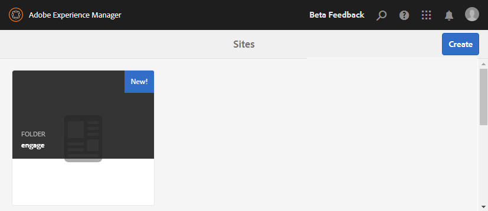

# Erstellen einer Community-Site{#author-a-new-community-site}

## Erstellen einer Community-Site {#create-a-community-site}

Verwenden Sie die Autoreninstanz, um eine Community-Site zu erstellen. In der AEM-Autoreninstanz:

1. Melden Sie sich mit Administratorrechten an.
1. Navigieren Sie in der globalen Navigation zu **[!UICONTROL Communities]** > **[!UICONTROL Sites]**.

Die Communities-Sites-Konsole bietet einen Assistenten, der Sie durch die Schritte zum Erstellen einer Community-Site führt. Es ist möglich, mit dem `Next` Schritt fortzufahren oder zum vorherigen Schritt `Back`, bevor die Site im letzten Schritt übergeben wird.

So erstellen Sie eine Community-Site:

* Klicken Sie auf die Schaltfläche `Create` .

### Schritt 1: Site-Vorlage {#step-site-template}

Geben Sie [ Schritt „Site-](/help/communities/sites-console.md#step2013asitetemplate)&quot; einen Titel, eine Beschreibung und den Namen für die URL ein und wählen Sie eine Community-Site-Vorlage aus, z. B.:

* **Community-Site-Titel**: `Getting Started Tutorial`
* **Community-Site-Beschreibung**: `A site for engaging with the community.`
* **Community-Website-**: (leer lassen für standardmäßige `/content/sites`)
* **Cloud-Konfigurationen**: (Lassen Sie das Feld leer, wenn keine Cloud-Konfigurationen angegeben sind) geben Sie den Pfad zu den angegebenen Cloud-Konfigurationen an.
* **Basissprache der Community**: (Für eine einzelne Sprache nicht ändern: Englisch) Verwenden Sie die Dropdown-Liste, um eine *oder mehrere* Basissprachen aus den verfügbaren Sprachen auszuwählen: Deutsch, Italienisch, Französisch, Japanisch, Spanisch, Portugiesisch (Brasilien), Chinesisch (Traditionell) und Chinesisch (Vereinfacht). Für jede hinzugefügte Sprache wird eine Community-Website erstellt, die im selben Site-Ordner vorhanden ist. Befolgen Sie dazu die Best Practice unter [Übersetzen von Inhalten für mehrsprachige Sites](/help/sites-administering/translation.md). Die Stammseite jeder Site enthält eine untergeordnete Seite mit dem Namen einer der ausgewählten Sprachen, z. B. „en“ für Englisch oder „fr“ für Französisch.

* **Community-Site-Name**: Engage

   * Überprüfen Sie den Namen , da er nach der Erstellung der Site nicht einfach geändert werden kann
   * Die anfängliche URL wird unter dem Namen der Community-Site angezeigt
   * Hängen Sie für eine gültige URL einen Basissprachcode + &quot;.html“ an
   * *Beispiel*, https://localhost:4502/content/sites/ `engage/en.html`

* **Vorlage**: Pulldown zur Auswahl von `Reference Site`

* Wählen Sie **Weiter** aus.

### Schritt 2: Entwurf {#step-design}

Der Schritt Design wird in zwei Abschnitten zur Auswahl des Designs und des Branding-Banners vorgestellt:

#### COMMUNITY-WEBSITE-DESIGN {#community-site-theme}

Wählen Sie den gewünschten Stil aus, den Sie auf die Vorlage anwenden möchten. Wenn diese Option aktiviert ist, wird das Design mit einem Häkchen überlagert.

#### COMMUNITY-WEBSITE-BRANDING {#community-site-branding}

(Optional) Laden Sie ein Bannerbild hoch, das auf den Seiten der Site angezeigt werden soll. Das Banner wird an den linken Rand des Browsers zwischen der Kopfzeile der Community-Site und den Navigations-Links angeheftet. Die Bannerhöhe wird auf 120 Pixel zugeschnitten. Es gibt keine Größenanpassung des Banners an die Breite des Browsers und die Höhe von 120 Pixel.

Wählen Sie **Weiter** aus.

### Schritt 3: Einstellungen {#step-settings}

Im Schritt Einstellungen gibt es vor der Auswahl von `Next` sieben Abschnitte, die Zugriff auf Konfigurationen bieten, die Benutzerverwaltung, Tagging, Moderation, Gruppenverwaltung, Analysen und Übersetzung umfassen.

#### User Management {#user-management}

Aktivieren Sie alle Kontrollkästchen für [Benutzerverwaltung](/help/communities/sites-console.md#user-management)

* So erlauben Sie Besuchenden der Website die Selbstregistrierung
* So können Besuchende der Site die Site anzeigen, ohne sich anzumelden
* So können Mitglieder Nachrichten von anderen Community-Mitgliedern senden und empfangen
* So lassen Sie die Anmeldung bei Facebook zu, anstatt ein Profil zu registrieren und zu erstellen
* So lassen Sie die Anmeldung mit Twitter zu, anstatt ein Profil zu registrieren und zu erstellen

>[!NOTE]
>
>Für eine Produktionsumgebung ist es erforderlich, benutzerdefinierte Facebook- und Twitter-Anwendungen zu erstellen. Siehe [Social-Anmeldung mit Facebook und Twitter](/help/communities/social-login.md).

#### TAGGING {#tagging}

Die Tags, die auf Community-Inhalte angewendet werden, werden durch die Auswahl von AEM-Namespaces gesteuert, die zuvor über die [Tagging-Konsole](/help/sites-administering/tags.md#tagging-console) definiert wurden (z. B. [Tutorial-Namespace](/help/communities/setup.md#create-tutorial-tags)).

Das Suchen von Namespaces ist mithilfe der Suche mit automatischer Textvervollständigung einfach. Zum Beispiel:

* Typ `tut`
* Klicken Sie auf `Tutorial`

#### ROLLEN {#roles}

[Community-Mitgliedsrollen](/help/communities/users.md) werden über die Einstellungen im Abschnitt Rollen zugewiesen.

Damit ein Community-Mitglied (oder eine Gruppe von Mitgliedern) die Website als Community-Manager erleben kann, verwenden Sie die Suche mit automatischer Textvervollständigung und wählen Sie den Mitglied- oder Gruppennamen aus den Optionen in der Dropdown-Liste aus.

Zum Beispiel:

* Typ `q`
* Quinn Harper auswählen

>[!NOTE]
>
>[Tunneldienst](https://helpx.adobe.com/experience-manager/6-3/help/communities/deploy-communities.html#tunnel-service-on-author) Ermöglicht die Auswahl von Mitgliedern und Gruppen, die nur in der Veröffentlichungsumgebung vorhanden sind.

#### MÄSSIGUNG {#moderation}

Akzeptieren Sie die globalen Standardeinstellungen für [Moderieren](/help/communities/sites-console.md#moderation) benutzergenerierte Inhalte (User-Generated Content, UGC).

#### ANALYTICS {#analytics}

Wenn Adobe Analytics lizenziert und ein Analytics Cloud-Service sowie ein Framework konfiguriert wurden, können Sie Analytics aktivieren und das Framework auswählen.

Siehe [Analytics-Konfiguration für Communities-](/help/communities/analytics.md).

#### ÜBERSETZUNG {#translation}

In [Übersetzungseinstellungen](/help/communities/sites-console.md#translation) geben Sie die Basissprache für die Website an und ob und in welche Sprache UGC übersetzt werden darf.

* Aktivieren Sie **Maschinelle Übersetzung zulassen**
* Lassen Sie die Standardsprachen für die Übersetzung durch den standardmäßigen Service für maschinelle Übersetzung ausgewählt
* Standard-Übersetzungsanbieter und -Konfiguration beibehalten
* Es ist kein globaler Store erforderlich, da keine Sprachkopien vorhanden sind
* Wählen Sie **Gesamte Seite übersetzen**
* Standard-Persistenzoption belassen

### Schritt 4: Communities-Site erstellen {#step-create-communities-site}

Wählen Sie **Erstellen.**

Wenn der Vorgang abgeschlossen ist, wird der Ordner für die neue Site in der Communities - Sites -Konsole angezeigt.

## Publish - die Community-Site {#publish-the-community-site}

Die erstellte Site sollte über die Communities - Sites -Konsole verwaltet werden, über dieselbe Konsole, über die auch neue Sites erstellt werden können.

Nachdem Sie den Ordner der Community-Site zum Öffnen ausgewählt haben, bewegen Sie den Mauszeiger über das Site-Symbol, sodass vier Aktionssymbole angezeigt werden:

Bei Auswahl des vierten Ellipsensymbols (Weitere Aktionen) werden die Optionen Website exportieren und Site löschen angezeigt.

Von links nach rechts sind sie:

* **Site öffnen**

  Wenn Sie auf das Stiftsymbol klicken, wird die Community-Site im Autorenbearbeitungsmodus geöffnet, wo Sie Seitenkomponenten hinzufügen oder konfigurieren können.

* **Website bearbeiten**

  Wenn Sie das Eigenschaftensymbol auswählen, wird die Community-Site zur Bearbeitung von Eigenschaften wie dem Titel oder zum Ändern des Designs geöffnet.

* **Publish-Site**

  Wenn Sie das Welt -Symbol auswählen, wird die Community-Site veröffentlicht (z. B. wenn Ihr Veröffentlichungs-Server auf Ihrem lokalen Computer ausgeführt wird, dann standardmäßig auf localhost:4503).

* **Website exportieren**

  Durch Auswahl des Symbols „Exportieren“ wird ein Paket der Community-Site erstellt, das sowohl im [Package Manager“ gespeichert ](/help/sites-administering/package-manager.md) heruntergeladen wird. UGC ist nicht im Site-Paket enthalten.

* **Site löschen**

  Durch Auswahl des Löschsymbols wird die Community-Site aus der **[!UICONTROL Communities > Sites -Konsole]** gelöscht. Diese Aktion entfernt alle mit der Site verbundenen Elemente wie benutzergenerierten Inhalt, Benutzergruppen, Assets und Datenbankdatensätze.

>[!NOTE]
>
>Wenn Sie den Standard-Port 4503 für die Veröffentlichungsinstanz nicht verwenden, bearbeiten Sie den Standardreplikationsagenten, um die Port-Nummer auf den richtigen Wert festzulegen.
>
>Auf der Autoreninstanz über das Hauptmenü:
>
>1. Navigieren Sie **[!UICONTROL Menü]** > **[!UICONTROL Vorgänge]** > **[!UICONTROL Replikation]** .
>1. Wählen Sie **[!UICONTROL Agenten für Autor]** aus.
>1. Wählen Sie **[!UICONTROL Standardagent (publish)]** aus.
>1. Klicken Sie neben **[!UICONTROL Einstellungen]** auf **[!UICONTROL Bearbeiten]**.
>1. Wählen Sie im Popup-Dialogfeld für die Agenteneinstellungen die Registerkarte **[!UICONTROL Transport]** aus.
>1. Ändern Sie im URI die Portnummer 4503 in die gewünschte Portnummer. Um beispielsweise Port 6103 zu verwenden: https://localhost:6103/bin/receive?sling:authRequestLogin=1
>1. Wählen Sie **[!UICONTROL OK]** aus.
>1. (Optional) Wählen Sie **[!UICONTROL Löschen]** oder **[!UICONTROL Wiederholen erzwingen]**, um die Replikationswarteschlange zurückzusetzen.

### Publish auswählen {#select-publish}

Nachdem Sie sichergestellt haben, dass der Veröffentlichungsserver ausgeführt wird, wählen Sie das Symbol Welt aus, um die Community-Site zu veröffentlichen.

Wenn die Community-Site erfolgreich veröffentlicht wurde, wird kurz die Meldung „Site veröffentlicht“ angezeigt.

### Neue Community-Benutzergruppen {#new-community-user-groups}

Neben der neuen Community-Site werden neue Benutzergruppen erstellt, die über die entsprechenden Berechtigungen für verschiedene Verwaltungsfunktionen verfügen. Weitere Informationen finden Sie unter [Benutzergruppen für Community-Sites](/help/communities/users.md#usergroupsforcommunitysites).

Für diese neue Community-Site werden unter dem Site-Namen „engage“ in Schritt 1 die vier neuen Benutzergruppen in der [Gruppen-Konsole“ angezeigt ](/help/communities/members.md)globale Navigation: Communities, Gruppen):

* Community-Manager einbinden
* Community Engage-Gruppenadministratoren
* Community-Engage-Mitglieder
* Community-Moderatoren engagieren
* Community Engage Privileged Members
* Community Engage Site Content Manager

[Aaron McDonald](/help/communities/tutorials.md#demo-users) ist Mitglied von

* Community-Manager einbinden
* Community-Moderatoren engagieren
* Community Engage-Mitglieder (indirekt als Mitglied der Moderatorengruppe)

#### https://localhost:4503/content/sites/engage/en.html {#http-localhost-content-sites-engage-en-html}

## Authentifizierungsfehler konfigurieren {#configure-for-authentication-error}

Nachdem eine Site konfiguriert und zur Veröffentlichung gepusht wurde, konfigurieren [Anmeldezuordnung konfigurieren](/help/communities/sites-console.md#configure-for-authentication-error) ( `Adobe Granite Login Selector Authentication Handler`) auf der Veröffentlichungsinstanz. Der Vorteil besteht darin, dass bei nicht korrekter Eingabe der Anmeldeinformationen der Authentifizierungsfehler die Anmeldeseite der Community-Site mit einer Fehlermeldung erneut anzeigt.

`Login Page Mapping` hinzufügen als

* `/content/sites/engage/en/signin:/content/sites/engage/en`

## Optionale Schritte {#optional-steps}

### Ändern der Standard-Startseite {#change-the-default-home-page}

Bei der Arbeit mit der Veröffentlichungs-Site zu Demonstrationszwecken kann es nützlich sein, die standardmäßige Startseite in die neue Site zu ändern.

Dazu müssen Sie [CRXDE](https://localhost:4503/crx/de) Lite verwenden, um die Tabelle [resource-mapping](/help/sites-deploying/resource-mapping.md) bei der Veröffentlichung zu bearbeiten.

Erste Schritte:

1. Melden Sie sich in der Veröffentlichungsinstanz mit Administratorrechten an.
1. Navigieren Sie zu [https://localhost:4503/crx/de](https://localhost:4503/crx/de).
1. Erweitern Sie im Projektbrowser `/etc/map.`
1. Wählen Sie den `http` Knoten aus:

   * Wählen Sie **Knoten erstellen:**

      * **Name** localhost.4503
(*verwenden* &#39;:&#39;)

      * **type** [sling:mapping](https://sling.apache.org/documentation/the-sling-engine/mappings-for-resource-resolution.html)

1. Bei ausgewähltem neu erstellten `localhost.4503`-Knoten:

   * Eigenschaft hinzufügen:

   * **Name** sling:match
      * **type** Zeichenfolge
      * **Value** localhost.4503/$
(muss mit &quot;$&quot; enden)

   * Eigenschaft hinzufügen:

      * **Name** sling:internalRedirect
      * **type** Zeichenfolge
      * **value** /content/sites/engage/en.html

1. Wählen Sie **Alle speichern.**
1. (Optional) Löschen des Navigationsverlaufs.
1. Navigieren Sie zu https://localhost:4503/ .

   * Ankunft bei https://localhost:4503/content/sites/engage/en.html

>[!NOTE]
>
>Zur Deaktivierung setzen Sie einfach ein „x“ - &quot;`xlocalhost.4503/$`&quot; vor den Wert der `sling:match`-Eigenschaft und **Alle speichern**.

#### Fehlerbehebung: Fehler beim Speichern der Zuordnung {#troubleshooting-error-saving-map}

Wenn Änderungen nicht gespeichert werden können, stellen Sie sicher, dass der Knotenname mit einem Punkttrennzeichen `localhost.4503` und nicht mit einem Doppelpunkt-Trennzeichen `localhost:4503` ist, da `localhost` kein gültiges Namespace-Präfix ist.

#### Fehlerbehebung: Weiterleitung fehlgeschlagen {#troubleshooting-fail-to-redirect}

Das &quot;**$**&quot; am Ende des regulären Ausdrucks (`sling:match`) ist wichtig, damit nur `https://localhost:4503/` zugeordnet wird. Andernfalls wird der Umleitungswert jedem Pfad vorangestellt, der möglicherweise nach dem „server:port“-Eintrag in der URL vorhanden ist. Wenn AEM versucht, zur Anmeldeseite umzuleiten, schlägt dies fehl.

### Ändern der Site {#modify-the-site}

Nachdem die Site anfänglich erstellt wurde, können Autorinnen und Autoren das Symbol [Site öffnen](/help/communities/sites-console.md#authoring-site-content) verwenden, um standardmäßige AEM-Authoring-Aktivitäten durchzuführen.

Darüber hinaus können Admins das Symbol [Site bearbeiten](/help/communities/sites-console.md#modifying-site-properties) verwenden, um Eigenschaften der Site zu ändern, z. B. den Titel.

Denken Sie nach jeder Änderung daran **die Website zu** und erneut **&#x200B;**&#x200B;Publish.

>[!NOTE]
>
>Wenn Sie nicht mit AEM vertraut sind, lesen Sie die Dokumentation unter [Grundlegende Handhabung](/help/sites-authoring/basic-handling.md) und eine [Kurzanleitung zur Seitenbearbeitung](/help/sites-authoring/qg-page-authoring.md).
