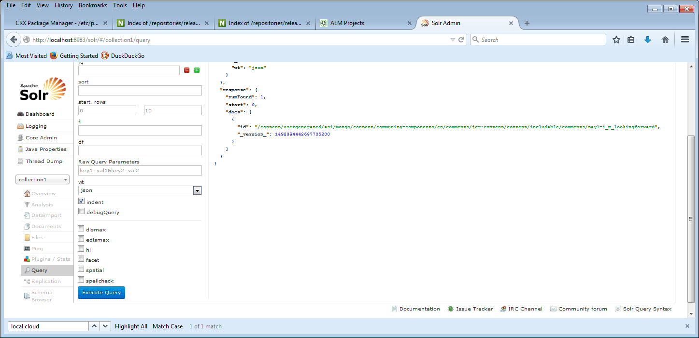

# Einrichten von MongoDB für Demo {#how-to-setup-mongodb-for-demo}

## Einführung {#introduction}

In diesem Tutorial wird beschrieben, wie Sie [MSRP](msrp.md) für *eine Author*-Instanz und *eine Publish*-Instanz einrichten.

Mit diesem Setup ist der Community-Inhalt sowohl in der Autoren- als auch in der Veröffentlichungsumgebung verfügbar, ohne dass benutzergenerierte Inhalte weitergeleitet oder rückwärts repliziert werden müssen.

Diese Konfiguration eignet sich für *produktionsfremde) Umgebungen* z. B. für Entwicklung und/oder Demonstration.

**Eine *Produktions*Umgebung sollte:**

* Ausführen von MongoDB mit einem Replikationssatz
* Verwenden von Solr Cloud
* Mehrere Publisher-Instanzen enthalten

## MongoDB {#mongodb}

### Installieren von MongoDB {#install-mongodb}

* MongoDB von [https://www.mongodb.com/ herunterladen](https://www.mongodb.com/)

   * Wahl des Betriebssystems:

      * Linux®
      * Mac 10.8
      * Windows 7

   * Auswahl der Version:

      * Verwenden Sie mindestens Version 2.6

* Standardkonfiguration

   * Befolgen Sie die MongoDB-Installationsanweisungen.
   * Für mongod konfigurieren:

      * Keine Notwendigkeit, Mongos oder Sharing zu konfigurieren.

   * Der installierte MongoDB-Ordner heißt &lt;mongo-install>.
   * Der definierte Datenordnerpfad heißt &lt;mongo-dbpath>.

* MongoDB kann auf demselben Host wie AEM oder remote ausgeführt werden.

### MongoDB starten {#start-mongodb}

* &lt;mongo-install>/bin/mongod —dbpath &lt;mongo-dbpath>

Dadurch wird ein MongoDB-Server mit dem Standard-Port 27017 gestartet.

* Erhöhen Sie für Mac ulimit mit start arg &#39;ulimit -n 2048&#39;

>[!NOTE]
>
>Wenn MongoDB gestartet wird (*),* AEM, **Neustart** alle **AEM**-Instanzen, damit sie ordnungsgemäß eine Verbindung zu MongoDB herstellen.

### Demo-Produktionsoption: MongoDB-Replikat-Set einrichten {#demo-production-option-setup-mongodb-replica-set}

Die folgenden Befehle sind ein Beispiel für das Einrichten eines Replikationssatzes mit drei Knoten auf localhost:

* `bin/mongod --port 27017 --dbpath data --replSet rs0&`
* `bin/mongo`

   * `cfg = {"_id": "rs0","version": 1,"members": [{"_id": 0,"host": "127.0.0.1:27017"}]}`
   * `rs.initiate(cfg)`

* `bin/mongod --port 27018 --dbpath data1 --replSet rs0&`
* `bin/mongod --port 27019 --dbpath data2 --replSet rs0&`
* `bin/mongo`

   * `rs.add("127.0.0.1:27018")`
   * `rs.add("127.0.0.1:27019")`
   * `rs.status()`

## Solr {#solr}

### Installieren von Solr {#install-solr}

* Laden Sie Solr von [Apache Lucene](https://archive.apache.org/dist/lucene/solr/) herunter:

   * Geeignet für jedes Betriebssystem.
   * Solr-Version 7.0.
   * Solr erfordert Java™ 1.7 oder höher.

* Standardkonfiguration

   * Solr-Einrichtung &#39;example&#39; befolgen.
   * Es ist kein Service erforderlich.
   * Der installierte Solr-Ordner heißt &lt;solr-install>.

### Konfigurieren von Solr für AEM Communities {#configure-solr-for-aem-communities}

Um eine Solr-Sammlung für MSRP für die Demo zu konfigurieren, müssen zwei Entscheidungen getroffen werden (wählen Sie die Links zur Hauptdokumentation aus, um weitere Details zu erhalten):

1. Führen Sie Solr im Standalone- oder [SolrCloud-Modus](msrp.md#solrcloudmode) aus.
1. Installieren Sie [Standard](msrp.md#installingstandardmls) oder [erweiterte](msrp.md#installingadvancedmls) mehrsprachige Suche (MLS).

### Eigenständiges Solr {#standalone-solr}

Die Methode zum Ausführen von Solr kann je nach Version und Installationsart unterschiedlich sein. Die [ Dokumentation ](https://archive.apache.org/dist/lucene/solr/ref-guide/) das Solr-Referenzhandbuch.

Um das Beispiel zu vereinfachen, starten Sie Solr mit Version 4.10 im eigenständigen Modus:

* CD zu &lt;solrinstall>/example
* java™ -jar start.jar

Dieser Prozess startet einen Solr-HTTP-Server mit dem Standard-Port 8983. Sie können zur Solr-Konsole gehen, um eine Solr-Konsole zum Testen aufzurufen.

* Standard-Solr-Konsole: [http://localhost:8983/solr/](http://localhost:8983/solr/)

>[!NOTE]
>
>Wenn die Solr-Konsole nicht verfügbar ist, überprüfen Sie die Protokolle unter &lt;solrinstall>/example/logs. Überprüfen Sie, ob SOLR versucht, eine Bindung an einen bestimmten Host-Namen herzustellen, der nicht aufgelöst werden kann (z. B. „user-macbook-pro„).
>
Wenn ja, aktualisieren Sie `etc/hosts` Datei mit einem neuen Eintrag für diesen Hostnamen (z. B. 127.0.0.1 user-macbook-pro), um Solr ordnungsgemäß zu starten.

### SolrCloud {#solrcloud}

Um ein einfaches (nicht produktives) SolrCloud-Setup auszuführen, starten Sie Solr wie folgt:

* `java -Dbootstrap_confdir=./solr/collection1/conf -Dbootstrap_conf=true -DzkRun -jar start.jar`

## MongoDB als Common Store identifizieren {#identify-mongodb-as-common-store}

Starten Sie die Autoren- und Veröffentlichungs-AEM-Instanzen, falls erforderlich.

Wenn AEM vor dem Start von MongoDB ausgeführt wurde, müssen die AEM-Instanzen neu gestartet werden.

Folgen Sie den Anweisungen auf der Hauptdokumentationsseite: [MSRP - MongoDB Common Store](msrp.md)

## Testen {#test}

Um den gemeinsamen Speicher von MongoDB zu testen und zu überprüfen, posten Sie einen Kommentar zur Veröffentlichungsinstanz, zeigen Sie ihn auf der Autoreninstanz an und zeigen Sie den benutzergenerierten Inhalt in MongoDB und Solr an:

1. Navigieren Sie auf der Veröffentlichungsinstanz zur Seite [Handbuch für Community](http://localhost:4503/content/community-components/en/comments.html) und wählen Sie die Komponente Kommentare aus.
1. Anmelden, um einen Kommentar zu posten:
1. Geben Sie Text in das Textfeld Kommentar ein und klicken Sie auf **[!UICONTROL Veröffentlichen]**

   

1. Sehen Sie sich einfach den Kommentar auf der [Autoreninstanz](http://localhost:4502/content/community-components/en/comments.html) an (wahrscheinlich noch als Admin / Admin angemeldet).

   

   Hinweis: Es gibt zwar JCR-Knoten unter *asipath* auf der Autoreninstanz, diese Knoten sind jedoch für das SCF-Framework bestimmt. Der eigentliche UGC befindet sich nicht im JCR, sondern in MongoDB.

1. Den UGC in MongoDB anzeigen **[!UICONTROL Communities]** > **[!UICONTROL Sammlungen]** > **[!UICONTROL Inhalte]**

   

1. UGC in Solr anzeigen:

   * Navigieren Sie zum Solr-Dashboard: [http://localhost:8983/solr/](http://localhost:8983/solr/).
   * Benutzer `core selector` auf `collection1`.
   * Wählen Sie `Query`.
   * Wählen Sie `Execute Query`.

   

## Fehlerbehebung {#troubleshooting}

### Kein benutzergenerierter Inhalt wird angezeigt {#no-ugc-appears}

1. Stellen Sie sicher, dass MongoDB installiert ist und ordnungsgemäß ausgeführt wird.

1. Stellen Sie sicher, dass MSRP als Standardanbieter konfiguriert wurde:

   * Rufen Sie auf allen Autoren- und Veröffentlichungs-AEM[Instanzen die Speicherkonfigurationskonsole erneut auf ](srp-config.md) überprüfen Sie das AEM-Repository:

   * Wenn [/etc/socialconfig](http://localhost:4502/crx/de/index.jsp#/etc/socialconfig/) im JCR keinen &quot;[&quot;-](http://localhost:4502/crx/de/index.jsp#/etc/socialconfig/srpc) enthält, bedeutet dies, dass der Speicheranbieter JSRP ist.
   * Wenn der srpc-Knoten vorhanden ist und den Knoten [defaultConfiguration](http://localhost:4502/crx/de/index.jsp#/etc/socialconfig/srpc/defaultconfiguration) enthält, sollten die Eigenschaften der defaultConfiguration festlegen, dass MSRP der Standardanbieter ist.

1. Stellen Sie sicher, dass AEM neu gestartet wurde, nachdem MSRP ausgewählt wurde.
