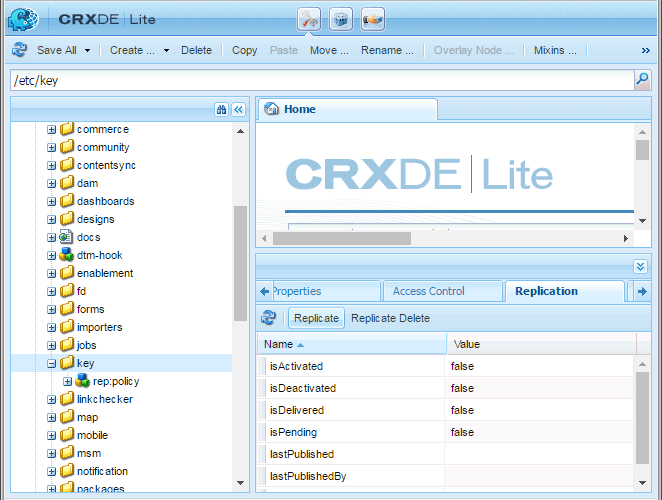

# Bereitstellen von Communities {#deploying-communities}

## Voraussetzungen {#prerequisites}

* [AEM 6.5 Platform](/help/sites-deploying/deploy.md)

* AEM Communities-Lizenz

* Optionale Lizenzen für:

   * [Adobe Analytics für Communities-Funktionen](/help/communities/analytics.md)
   * [MongoDB für MSRP](/help/communities/msrp.md)
   * [Adobe Cloud für ASRP](/help/communities/asrp.md)

## Checkliste für die Installation {#installation-checklist}

**Für die  [AEM Plattform](/help/sites-deploying/deploy.md#what-is-aem)**

* Installieren Sie die neuesten [AEM 6.5 Updates](#aem64updates)

* Wenn Sie nicht die Standardanschlüsse verwenden (4502, 4503), dann [konfigurieren Sie die Replikationsagenten](#replication-agents-on-author)
* [Replizieren des Kryptoschlüssels](#replicate-the-crypto-key)
* Wenn die Globalisierung unterstützt wird, [Einrichten der automatisierten Übersetzung](/help/sites-administering/translation.md)
(Beispiel-Setup wird für die Entwicklung bereitgestellt)

**Für die  [Communities-Funktion](/help/communities/overview.md)**

* Wenn Sie eine [Veröffentlichungsfarm](/help/sites-deploying/recommended-deploys.md#tarmk-farm) bereitstellen, [identifizieren Sie den primären Herausgeber](#primary-publisher)

* [Tunneldienst aktivieren](#tunnel-service-on-author)
* [Social-Anmeldung aktivieren](/help/communities/social-login.md#adobe-granite-oauth-authentication-handler)
* [Konfigurieren Sie Analytics](/help/communities/analytics.md)
* Einrichten eines [Standard-E-Mail-Diensts](/help/communities/email.md)
* Identifizieren Sie die Auswahl für [freigegebenen UGC-Speicher](/help/communities/working-with-srp.md) (**SRP**).

   * Wenn MongoDB SRP [(MSRP)](/help/communities/msrp.md)

      * [MongoDB installieren und konfigurieren](/help/communities/msrp.md#mongodb-configuration)
      * [Solr konfigurieren](/help/communities/solr.md)
      * [MSRP auswählen](/help/communities/srp-config.md)
   * Wenn relationale Datenbank SRP [(DSRP)](/help/communities/dsrp.md)

      * [JDBC-Treiber für MySQL installieren](#jdbc-driver-for-mysql)
      * [MySQL für DSRP installieren und konfigurieren](/help/communities/dsrp-mysql.md)
      * [Solr konfigurieren](/help/communities/solr.md)
      * [DSRP auswählen](/help/communities/srp-config.md)
   * Wenn Adobe SRP [(ASRP)](/help/communities/asrp.md)

      * Wenden Sie sich zur Bereitstellung an Ihren Kundenbetreuer
      * [ASRP auswählen](/help/communities/srp-config.md)
   * If JCR SRP [(JSRP)](/help/communities/jsrp.md)

      * Kein freigegebener benutzergenerierter Speicher :

         * UGC wird nie repliziert
         * UGC ist nur in AEM Instanz oder Cluster sichtbar, in dem sie eingegeben wurde

         * Der Standardwert ist JSRP
   Für die **[Aktivierungsfunktion](/help/communities/overview.md#enablement-community)**

   * [Installieren und Konfigurieren von FFmpeg](/help/communities/ffmpeg.md)
   * [JDBC-Treiber für MySQL installieren](#jdbc-driver-for-mysql)
   * [AEM Communities SCORM-Engine installieren](#scorm-package)
   * [MySQL zur Aktivierung installieren und konfigurieren](/help/communities/mysql.md)


## Neueste Versionen {#latest-releases}

AEM 6.5 Communities GA umfasst Communities-Pakete. Informationen zu Updates für AEM 6.5 [Communities](/help/release-notes/release-notes.md#experiencemanagercommunities) finden Sie unter [AEM 6.5 Versionshinweise](/help/release-notes/release-notes.md#communities-release-notes.html).

### AEM 6.5 Updates {#aem-updates}

Ab AEM 6.4 werden Aktualisierungen an Communities als Teil von AEM Cumulative Fix Packs und Service Packs bereitgestellt.

Die neuesten Updates zu AEM 6.5 finden Sie unter [Adobe Experience Manager 6.4 Cumulative Fix Packs and Service Packs](https://experienceleague.adobe.com/docs/experience-manager-release-information/aem-release-updates/aem-releases-updates.html?lang=de).

### Versionsverlauf {#version-history}

Wie AEM 6.4 und höher sind AEM Communities-Funktionen und Hotfixes Teil von AEM Communities Cumulative Fix Packs und Service Packs. Es gibt daher keine separaten Feature Packs.

### JDBC-Treiber für MySQL {#jdbc-driver-for-mysql}

Zwei Communities-Funktionen verwenden eine MySQL-Datenbank:

* Für [enable](/help/communities/enablement.md): Aufzeichnen von SCORM-Aktivitäten und -Lernenden
* Für [DSRP](/help/communities/dsrp.md): Speichern benutzergenerierter Inhalte (UGC)

Der MySQL-Connector muss separat abgerufen und installiert werden.

Die erforderlichen Schritte sind:

1. Laden Sie das ZIP-Archiv von [https://dev.mysql.com/downloads/connector/j/](https://dev.mysql.com/downloads/connector/j/) herunter.

   * Version muss >= 5.1.38 sein.

1. Extrahieren Sie mysql-connector-java-&lt;version>-bin.jar (bundle) aus dem Archiv
1. Verwenden Sie die Web-Konsole, um das Bundle zu installieren und zu starten:

   * Beispiel: https://localhost:4502/system/console/bundles
   * Wählen Sie nun eine der folgenden Optionen aus **`Install/Update`**
   * Durchsuchen... , um das aus dem heruntergeladenen ZIP-Archiv extrahierte Bundle auszuwählen.
   * Überprüfen Sie, ob der JDBC-Treiber der Oracle Corporation für MySQLcom.mysql.jdbc *aktiv ist, und starten Sie ihn gegebenenfalls (oder überprüfen Sie die Protokolle).*

1. Wenn Sie nach der Konfiguration von JDBC in einer vorhandenen Bereitstellung installieren, binden Sie JDBC erneut an den neuen Connector, indem Sie die JDBC-Konfiguration von der Web-Konsole aus speichern:
   * Beispiel: https://localhost:4502/system/console/configMgr
   * Suchen Sie die `Day Commons JDBC Connections Pool`-Konfiguration
   * Zum Öffnen auswählen
   * Wählen Sie nun eine der folgenden Optionen aus `Save`

1. Wiederholen Sie die Schritte 3 und 4 für alle Autoren- und Veröffentlichungsinstanzen.

Weitere Informationen zur Installation von Bundles finden Sie auf der Seite [Web-Konsole](/help/sites-deploying/web-console.md) .

#### Beispiel : MySQL Connector Bundle installiert {#example-installed-mysql-connector-bundle}


### SCORM-Paket {#scorm-package}

Das Shareable Content Object Reference Model (SCORM) ist eine Sammlung von Standards und Spezifikationen für E-Learning. SCORM definiert auch, wie Inhalte in eine übertragbare ZIP-Datei gepackt werden können.

Die AEM Communities SCORM-Engine ist für die Funktion [Aktivierung](/help/communities/overview.md#enablement-community) erforderlich. Scorm-Pakete werden in AEM 6.5 Communities unterstützt:

* [cq-social-scorm-package, Version 2.3.7](https://experience.adobe.com/#/downloads/content/software-distribution/en/aem.html?package=%2Fcontent%2Fsoftware-distribution%2Fen%2Fdetails.html%2Fcontent%2Fdam%2Faem%2Fpublic%2Fadobe%2Fpackages%2Fcq640%2Fsocial%2Fscorm%2Fcq-social-scorm-2017-pkg) , die die  [SCORM 2017.1](https://rusticisoftware.com/blog/scorm-engine-2017-released/) -Engine enthält.

**So installieren Sie ein SCORM-Paket**

1. Installieren Sie das [cq-social-scorm-package, Version 2.3.7](https://experience.adobe.com/#/downloads/content/software-distribution/en/aem.html?package=%2Fcontent%2Fsoftware-distribution%2Fen%2Fdetails.html%2Fcontent%2Fdam%2Faem%2Fpublic%2Fadobe%2Fpackages%2Fcq640%2Fsocial%2Fscorm%2Fcq-social-scorm-2017-pkg) aus Package Share.
1. Laden Sie `/libs/social/config/scorm/database_scormengine_data.sql` aus der CQ-Instanz herunter und führen Sie es auf dem mysql-Server aus, um ein aktualisiertes scormEngineDB-Schema zu erstellen.
1. Fügen Sie `/content/communities/scorm/RecordResults` in der Eigenschaft &quot;Excluded Paths&quot;im CSRF-Filter von `https://<hostname>:<port>/system/console/configMgr` für Herausgeber hinzu.


#### SCORM-Protokollierung {#scorm-logging}

Wie installiert, werden alle Aktivierungsaktivitäten ausführlich in der Systemkonsole protokolliert.

Bei Bedarf kann die Protokollebene für das `RusticiSoftware.*`-Paket auf WARN gesetzt werden.

Informationen zum Arbeiten mit Protokollen finden Sie unter [Arbeiten mit Auditdatensätzen und Protokolldateien](/help/sites-deploying/monitoring-and-maintaining.md#working-with-audit-records-and-log-files).

### AEM erweiterte MLS {#aem-advanced-mls}

Damit die SRP-Sammlung (MSRP oder DSRP) erweiterte mehrsprachige Suche (MLS) unterstützen kann, sind zusätzlich zu einem benutzerdefinierten Schema und einer Solr-Konfiguration neue Solr-Plug-ins erforderlich. Alle erforderlichen Elemente werden in einer herunterladbaren ZIP-Datei zusammengefasst.

Der erweiterte MLS-Download (auch als &quot;Phasetwo&quot;bezeichnet) ist im Adobe-Repository verfügbar:

* AEM-SOLR-MLS-phasetwo

   Informationen zum Abrufen des erweiterten MLS-Pakets finden Sie unter [AEM Erweiterte MLS](deploy-communities.md#aem-advanced-mls) im Abschnitt &quot;Bereitstellung&quot;der Dokumentation.

   * Version 1.2.40, 6. April 2016
   * AEM-SOLR-MLS-phasetwo-1.2.40.zip herunterladen

Weitere Informationen und Installationsinformationen finden Sie unter [Solr-Konfiguration](/help/communities/solr.md) für SRP.

### Über Links zur Paketfreigabe {#about-links-to-package-share}

**In Adobe AEM Cloud sichtbare Pakete**

Die Links zu Paketen auf dieser Seite erfordern keine laufende Instanz von AEM, da sie Paketfreigabe auf `adobeaemcloud.com` ermöglichen. Während die Pakete sichtbar sind, dient die Schaltfläche `Install` zur Installation der Pakete auf einer Adobe-gehosteten Site. Wenn Sie eine Installation auf einer lokalen AEM-Instanz durchführen möchten, wird die Auswahl von `Install` zu einem Fehler führen.

**Installieren auf einer lokalen AEM-Instanz**

Um die Pakete zu installieren, die in `adobeaemcloud.com` auf einer lokalen AEM-Instanz sichtbar sind, muss das Paket zunächst auf eine lokale Festplatte heruntergeladen werden:

* Wählen Sie die Registerkarte **Assets** .
* Wählen Sie **Download auf Festplatte** aus.

Verwenden Sie auf der lokalen AEM-Instanz den Package Manager (z. B. [https://localhost:4502/crx/packmgr/](https://localhost:4502/crx/packmgr/)), um das lokale AEM Package-Repository hochzuladen.

Alternativ dazu wird beim Zugriff auf das Paket über die Paketfreigabe von der lokalen AEM-Instanz (z. B. [https://localhost:4502/crx/packageshare/](https://localhost:4502/crx/packageshare/)) die Schaltfläche `Download` in das Package-Repository der lokalen AEM-Instanz heruntergeladen.

Sobald Sie sich im Package-Repository der lokalen AEM-Instanz befinden, installieren Sie das Package mit Package Manager.

Weitere Informationen finden Sie unter [Arbeiten mit Paketen](/help/sites-administering/package-manager.md#package-share).

## Empfohlene Bereitstellungen {#recommended-deployments}

In AEM Communities wird ein gemeinsamer Speicher zum Speichern benutzergenerierter Inhalte (UGC) verwendet und häufig als [Speicherressourcenanbieter (SRP)](/help/communities/working-with-srp.md) bezeichnet. Die empfohlene Implementierung konzentriert sich auf die Auswahl einer SRP-Option für den gemeinsamen Speicher.

Der gemeinsame Speicher unterstützt die Moderation von und die Analyse von UGC in der Veröffentlichungsumgebung, während gleichzeitig die Notwendigkeit der [Replikation](/help/communities/sync.md) von UGC entfällt.

* [Community-Inhaltsspeicher](/help/communities/working-with-srp.md) : beschreibt die SRP-Speicheroptionen für AEM Communities

* [Empfohlene Topologien](/help/communities/topologies.md) : beschreibt die je nach Anwendungsfall und SRP-Auswahl zu verwendende Topologie

## Aktualisieren {#upgrading}

Bei der Aktualisierung von früheren Versionen von AEM auf die AEM 6.5-Plattform ist es wichtig, [Aktualisierung auf AEM 6.5](/help/sites-deploying/upgrade.md) zu lesen.

Lesen Sie neben der Aktualisierung der Plattform [Aktualisieren auf AEM Communities 6.5](/help/communities/upgrade.md) , um mehr über Communities-Änderungen zu erfahren.

## Konfigurationen {#configurations}

### Primärer Herausgeber {#primary-publisher}

Wenn es sich bei der ausgewählten Bereitstellung um eine [Veröffentlichungsfarm](/help/communities/topologies.md#tarmk-publish-farm) handelt, muss eine AEM Veröffentlichungsinstanz als **`primary publisher`** für Aktivitäten identifiziert werden, die nicht auf allen Instanzen auftreten sollten, z. B. Funktionen, die auf **Benachrichtigungen** oder **Adobe Analytics** basieren.

Standardmäßig ist die OSGi-Konfiguration `AEM Communities Publisher Configuration` mit dem Kontrollkästchen **`Primary Publisher`** konfiguriert, sodass sich alle Veröffentlichungsinstanzen in einer Veröffentlichungsfarm selbst als Primär identifizieren.

Daher ist es erforderlich, die Konfiguration für alle sekundären Veröffentlichungsinstanzen **zu bearbeiten, um das Kontrollkästchen **`Primary Publisher`**zu deaktivieren.**


Für alle anderen (sekundären) Veröffentlichungsinstanzen in einer Veröffentlichungsfarm:

* Anmelden mit Administratorrechten
* Zugriff auf die [Web-Konsole](/help/sites-deploying/configuring-osgi.md)

   * Beispiel: [https://localhost:4503/system/console/configMgr](https://localhost:4503/system/console/configMgr)

* Suchen Sie nach `AEM Communities Publisher Configuration` .
* Bearbeiten-Symbol auswählen
* Deaktivieren Sie das Kontrollkästchen **Primär Publisher** .
* Wählen Sie **Speichern** aus

### Replikationsagenten auf der Autoreninstanz {#replication-agents-on-author}

Die Replikation wird für Site-Inhalte verwendet, die in der Veröffentlichungsumgebung erstellt werden, z. B. Community-Gruppen, sowie für die Verwaltung von Mitgliedern und Mitgliedergruppen aus der Autorenumgebung mithilfe des [Tunneldienstes](#tunnel-service-on-author).

Stellen Sie für den primären Herausgeber sicher, dass die [Replikationsagenten-Konfiguration](/help/sites-deploying/replication.md) den Veröffentlichungsserver und den autorisierten Benutzer richtig identifiziert. Der standardmäßig autorisierte Benutzer `admin,` verfügt bereits über die entsprechenden Berechtigungen (ist Mitglied von `Communities Administrators`).

Damit andere Benutzer über die entsprechenden Berechtigungen verfügen können, müssen sie als Mitglied der Benutzergruppe `administrators` hinzugefügt werden (auch ein Mitglied von `Communities Administrators`).

Es gibt zwei Replikationsagenten in der Autorenumgebung, für die die Transportkonfiguration korrekt konfiguriert werden muss.

* Zugriff auf die Replikationskonsole auf der Autoreninstanz

   * Navigieren Sie von der globalen Navigation zu **[!UICONTROL Tools]** > **[!UICONTROL Bereitstellung]** > **[!UICONTROL Replikation]** > **[!UICONTROL Agenten für Autor]**

* Gehen Sie für beide Agenten genauso vor:

   * **Standardagent (publish)**
   * **Agenten für Rückwärtsreplikation (Rückwärts veröffentlichen)**

      1. Wählen Sie den Agenten aus
      1. Wählen Sie **edit**
      1. Wählen Sie die Registerkarte **Transport** aus.
      1. Wenn `4503` nicht portiert wird, bearbeiten Sie den **URI**, um den richtigen Port anzugeben.

      1. Wenn kein Benutzer `admin` ist, bearbeiten Sie die **Benutzer** und **Kennwort**, um ein Mitglied der Benutzergruppe `administrators` anzugeben.

Die folgenden Abbildungen zeigen die Ergebnisse einer Änderung des Ports von 4503 auf 6103 durch:

#### Standardagent (publish) {#default-agent-publish}


#### Agenten für Rückwärtsreplikation (Rückwärts veröffentlichen) {#reverse-replication-agent-publish-reverse}


### Tunnel-Dienst auf Autoreninstanz {#tunnel-service-on-author}

Wenn Sie die Autorenumgebung für [Sites erstellen](/help/communities/sites-console.md), [Siteeigenschaften ändern](/help/communities/sites-console.md#modifying-site-properties) oder [Community-Mitglieder verwalten](/help/communities/members.md), müssen Sie auf Mitglieder (Benutzer) zugreifen, die in der Veröffentlichungsumgebung registriert sind, nicht auf Benutzer, die in der Autorenumgebung registriert sind.

Der Tunneldienst stellt diesen Zugriff mithilfe des Replikationsagenten auf der Autoreninstanz bereit.

So aktivieren Sie den Tunneldienst:

* Melden Sie sich mit Administratorrechten für Ihre Autoreninstanz an.
* Wenn der Herausgeber nicht localhost:4503 ist oder der Transportbenutzer nicht `admin` ist,
dann [den Replikationsagenten](#replication-agents-on-author) konfigurieren

* Zugriff auf die [Web-Konsole](/help/sites-deploying/configuring-osgi.md)

   * Beispiel: [https://localhost:4502/system/console/configMgr](https://localhost:4502/system/console/configMgr)

* Suchen Sie nach `AEM Communities Publish Tunnel Service` .
* Bearbeiten-Symbol auswählen
* Aktivieren Sie das Kontrollkästchen **enable** .
* Wählen Sie **Speichern** aus

   

### Replizieren des Crypto-Schlüssels {#replicate-the-crypto-key}

Es gibt zwei Funktionen von AEM Communities, für die alle AEM Serverinstanzen dieselben Verschlüsselungsschlüssel verwenden müssen. Dies sind [Analytics](/help/communities/analytics.md) und [ASRP](/help/communities/asrp.md).

Ab AEM 6.3 wird das Schlüsselmaterial im Dateisystem und nicht mehr im Repository gespeichert.

Um das Schlüsselmaterial von der Autoreninstanz in alle anderen Instanzen zu kopieren, müssen Sie Folgendes tun:

* Greifen Sie auf die AEM-Instanz zu, normalerweise eine Autoreninstanz, die das zu kopierende Schlüsselmaterial enthält

   * Suchen Sie das Bundle `com.adobe.granite.crypto.file` im lokalen Dateisystem,
Beispiel:

      * `<author-aem-install-dir>/crx-quickstart/launchpad/felix/bundle21`
      * Die `bundle.info`-Datei identifiziert das Bundle
   * Navigieren Sie zum Datenordner,
Beispiel:

      * `<author-aem-install-dir>/crx-quickstart/launchpad/felix/bundle21/data`

      * Kopieren Sie die Dateien hmac und primary .


* Für jede AEM-Instanz

   * Navigieren Sie zum Datenordner,
Beispiel:

      * `<publish-aem-install-dir>/crx-quickstart/launchpad/felix/bundle21/data`
   * Fügen Sie die beiden zuvor kopierten Dateien ein.
   * Es ist erforderlich, [das Granite Crypto Bundle](#refresh-the-granite-crypto-bundle) zu aktualisieren, wenn die Ziel-AEM-Instanz derzeit ausgeführt wird.


>[!CAUTION]
>
>Wenn bereits eine andere Sicherheitsfunktion konfiguriert wurde, die auf den Verschlüsselungsschlüsseln basiert, kann die Replikation der Verschlüsselungsschlüssel die Konfiguration beschädigen. Hilfe erhalten Sie bei [Wenden Sie sich an die Kundenunterstützung](https://helpx.adobe.com/de/marketing-cloud/contact-support.html).

#### Repository-Replikation {#repository-replication}

Das Schlüsselmaterial, das wie bei AEM 6.2 und früher im Repository gespeichert ist, kann beibehalten werden, indem die folgende Systemeigenschaft beim ersten Start jeder AEM Instanz (durch die das anfängliche Repository erstellt wird) angegeben wird:

* `-Dcom.adobe.granite.crypto.file.disable=true`

>[!NOTE]
>
>Es ist wichtig zu überprüfen, ob der [Replikationsagent auf author](#replication-agents-on-author) korrekt konfiguriert ist.

Mit dem im Repository gespeicherten Schlüsselmaterial wird der Crypto-Schlüssel vom Autor auf andere Instanzen wie folgt repliziert:

Verwenden von [CRXDE Lite](/help/sites-developing/developing-with-crxde-lite.md):

* Navigieren Sie zu [https://&lt;server>:&lt;port>/crx/de](https://localhost:4502/crx/de)
* Wählen Sie nun eine der folgenden Optionen aus `/etc/key`
* Registerkarte `Replication` öffnen
* Wählen Sie nun eine der folgenden Optionen aus `Replicate`

* [Aktualisieren des Granite Crypto-Bundles](#refresh-the-granite-crypto-bundle)

   

#### Aktualisieren des Granite Crypto-Bundles {#refresh-the-granite-crypto-bundle}

* Rufen Sie in jeder Veröffentlichungsinstanz die [Web-Konsole](/help/sites-deploying/configuring-osgi.md) auf.

   * Beispiel: [https://&lt;server>:&lt;port>/system/console/bundles](https://localhost:4503/system/console/bundles)

* Suchen Sie nach `Adobe Granite Crypto Support` bundle (com.adobe.granite.crypto).
* Wählen Sie **Aktualisieren**

   

* Nach einem Moment sollte ein **Erfolgsdialogfeld** angezeigt werden:
   `Operation completed successfully.`

### Apache HTTP Server {#apache-http-server}

Stellen Sie bei Verwendung des Apache HTTP-Servers sicher, dass Sie den richtigen Servernamen für alle relevanten Einträge verwenden.

Achten Sie insbesondere darauf, in der `RedirectMatch` den richtigen Servernamen zu verwenden, nicht `localhost`.

#### Beispiel für httpd.conf {#httpd-conf-sample}

```shell
<IfModule alias_module>
     # XAMPP does not have a favicon; this prevents any 404 errors which may arise.
     Redirect 404 /favicon.ico
     <Location /favicon.ico>
         ErrorDocument 404 "No favicon"
     </Location>

    # Return from "Sign Out" generates response header directing you to "/", generating a 404 error
    # The RedirectMatch resolves it correctly when modified for the target Community Site :
    RedirectMatch ^/$ https://[server name]/content/sites/engage/en.html
 ...
 </IfModule>
```

### Dispatcher {#dispatcher}

Informationen zur Verwendung eines Dispatchers finden Sie unter:

* AEM [Dokumentation zum Dispatcher](https://helpx.adobe.com/experience-manager/dispatcher/using/dispatcher.html)
* [Installieren des Dispatchers](https://helpx.adobe.com/experience-manager/dispatcher/using/dispatcher-install.html)
* [Konfigurieren des Dispatchers für Communities](/help/communities/dispatcher.md)
* [Bekannte Probleme](/help/communities/troubleshooting.md#dispatcher-refetch-fails)

## Communities-Dokumentation zu ähnlichen Themen {#related-communities-documentation}

* Unter [Communities-Sites verwalten](/help/communities/administer-landing.md) erfahren Sie mehr darüber, wie Sie Community-Sites erstellen, Community-Site-Vorlagen bearbeiten, Community-Inhalte moderieren, Mitglieder verwalten und Messaging-Systeme konfigurieren können.

* Besuchen Sie [Communities entwickeln](/help/communities/communities.md) , um mehr über das Social-Komponenten-Framework (SCF) zu erfahren und Communities-Komponenten und -Funktionen anzupassen.

* Besuchen Sie [Erstellen von Communities-Komponenten](/help/communities/author-communities.md) , um zu erfahren, wie Sie Communities-Komponenten erstellen und konfigurieren.
