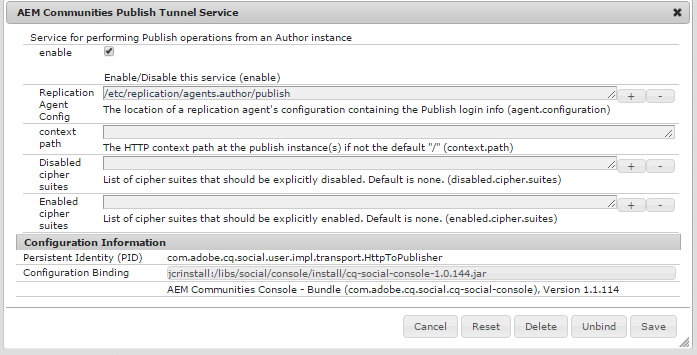

# Bereitstellen von Communities {#deploying-communities}

## Voraussetzungen {#prerequisites}

* [AEM 6.5-Plattform](/help/sites-deploying/deploy.md)

* AEM Communities-Lizenz

* Optionale Lizenzen für:

   * [Funktionen von Adobe Analytics for Communities](/help/communities/analytics.md)
   * [MongoDB für MSRP](/help/communities/msrp.md)
   * [Adobe Cloud für ASRP](/help/communities/asrp.md)

## Installations-Checkliste {#installation-checklist}

**Für die [AEM-Plattform](/help/sites-deploying/deploy.md#what-is-aem)**

* Installieren Sie die neuesten [AEM 6.5-Updates](#aem64updates)

* Wenn Sie die Standard-Ports (4502, 4503) nicht verwenden, [ Sie „Replikationsagenten konfigurieren](#replication-agents-on-author)
* [Replizieren des Kryptoschlüssels](#replicate-the-crypto-key)
* Wenn Sie die Globalisierung unterstützen[ richten Sie eine automatisierte Übersetzung ](/help/sites-administering/translation.md)
(Beispiel-Setup wird für die Entwicklung bereitgestellt)

**Für die Funktion [Communities](/help/communities/overview.md)**

* Wenn Sie eine [Veröffentlichungsfarm“ bereitstellen](/help/sites-deploying/recommended-deploys.md#tarmk-farm) [identifizieren Sie den primären Herausgeber](#primary-publisher)

* [Aktivieren des Tunneldienstes](#tunnel-service-on-author)
* [Social-Media-Anmeldung aktivieren](/help/communities/social-login.md#adobe-granite-oauth-authentication-handler)
* [Konfigurieren von Adobe Analytics](/help/communities/analytics.md)
* Einrichten eines [Standard-E-Mail-Service](/help/communities/email.md)
* Identifizieren der Auswahl für [freigegebenen UGC-Speicher](/help/communities/working-with-srp.md) (**SRP**)

   * Wenn MongoDB SRP [(MSRP)](/help/communities/msrp.md)

      * [Installieren und Konfigurieren von MongoDB](/help/communities/msrp.md#mongodb-configuration)
      * [Konfigurieren von Solr](/help/communities/solr.md)
      * [MSRP auswählen](/help/communities/srp-config.md)

   * Wenn relationale Datenbank SRP [(DSRP)](/help/communities/dsrp.md)

      * [Installieren des JDBC-Treibers für MySQL](#jdbc-driver-for-mysql)
      * [Installieren und Konfigurieren von MySQL für DSRP](/help/communities/dsrp-mysql.md)
      * [Konfigurieren von Solr](/help/communities/solr.md)
      * [DSRP auswählen](/help/communities/srp-config.md)

   * Wenn Adobe SRP [(ASRP)](/help/communities/asrp.md)

      * Bereitstellung gemeinsam mit Ihrem Kundenbetreuer
      * [ASRP auswählen](/help/communities/srp-config.md)

   * IF JCR SRP [(JSRP)](/help/communities/jsrp.md)

      * Kein freigegebener UGC-Speicher (benutzergenerierter Inhalt) :

         * UGC wird nie repliziert
         * UGC ist nur auf der AEM-Instanz oder dem Cluster sichtbar, in der bzw. dem er eingegeben wurde

         * Der Standardwert ist JSRP

## Aktuelle Versionen {#latest-releases}

AEM 6.5 Communities-GA umfasst Communities-Paket. Weitere Informationen zu Updates für AEM 6.5 [Communities](/help/release-notes/release-notes.md#experiencemanagercommunities) finden Sie in den Versionshinweisen zu [AEM 6.5](/help/release-notes/release-notes.md#communities-release-notes.html).

### AEM 6.5-Aktualisierungen {#aem-updates}

Ab AEM 6.4 werden Communities-Updates im Rahmen von AEM Cumulative Fix Packs und Service Packs bereitgestellt.

Die neuesten Aktualisierungen zu AEM 6.5 finden Sie unter [Adobe Experience Manager 6.4 Cumulative Fix Packs and Service Packs](https://experienceleague.adobe.com/de/docs/experience-manager-release-information/aem-release-updates/aem-releases-updates).

### Versionsverlauf {#version-history}

Wie bei AEM 6.4 und höher sind Funktionen und Hotfixes von AEM Communities Teil der Cumulative Fix Packs und Service Packs von AEM Communities. Es gibt daher keine separaten Feature Packs.

### JDBC-Treiber für MySQL {#jdbc-driver-for-mysql}

Eine Communities-Funktion verwendet eine MySQL-Datenbank:

* Für [DSRP](/help/communities/dsrp.md): Speichern von UGC

Der MySQL-Connector muss separat bezogen und installiert werden.

Die erforderlichen Schritte sind:

1. Laden Sie das ZIP-Archiv von [https://dev.mysql.com/downloads/connector/j/ herunter](https://dev.mysql.com/downloads/connector/j/)

   * Version muss >= 5.1.38 sein

1. Extrahieren Sie mysql-connector-java-&lt;version>-bin.jar (bundle) aus dem Archiv
1. Verwenden Sie die Web-Konsole, um das Bundle zu installieren und zu starten:

   * Beispiel: https://localhost:4502/system/console/bundles
   * Klicken Sie auf **`Install/Update`**
   * Durchsuchen… , um das aus dem heruntergeladenen ZIP-Archiv extrahierte Paket auszuwählen.
   * Überprüfen Sie, ob der JDBC-Treiber der *Oracle Corporation für MySQLcom.mysql.jdbc* aktiv ist, und starten Sie ihn, falls nicht (oder überprüfen Sie die Protokolle)

1. Wenn die Installation auf einer vorhandenen Bereitstellung erfolgt, nachdem JDBC konfiguriert wurde, binden Sie JDBC erneut an den neuen Connector, indem Sie die JDBC-Konfiguration über die Web-Konsole erneut speichern:
   * Beispiel: https://localhost:4502/system/console/configMgr
   * Suchen `Day Commons JDBC Connections Pool` Konfiguration
   * Zum Öffnen auswählen
   * Klicken Sie auf `Save`

1. Wiederholen Sie die Schritte 3 und 4 für alle Autoren- und Veröffentlichungsinstanzen

Weitere Informationen zum Installieren von Bundles finden Sie auf der Seite [Web-Konsole](/help/sites-deploying/web-console.md).

#### Beispiel : Installiertes MySQL-Connector-Bundle {#example-installed-mysql-connector-bundle}


### AEM Advanced MLS {#aem-advanced-mls}

Für die SRP-Erfassung (MSRP oder DSRP) zur Unterstützung der erweiterten mehrsprachigen Suche (MLS) sind neue Solr-Plug-ins sowie ein benutzerdefiniertes Schema und eine Solr-Konfiguration erforderlich. Alle erforderlichen Elemente werden in eine herunterladbare ZIP-Datei gepackt.

Der erweiterte MLS-Download (auch als `phasetwo` bezeichnet) ist im Adobe-Repository verfügbar:

* AEM-SOLR-MLS-phasetwo

  Informationen zum Abrufen des erweiterten MLS-Pakets finden Sie unter [AEM Advanced MLS](deploy-communities.md#aem-advanced-mls) im Abschnitt Bereitstellen der Dokumentation.

   * Version 1.2.40, 6. April 2016
   * AEM-SOLR-MLS-phasetwo-1.2.40.zip herunterladen

Weitere Informationen und Installationsinformationen finden Sie unter [Solr-Konfiguration](/help/communities/solr.md) für SRP.

### Über Links zu Package Share {#about-links-to-package-share}

**Pakete sichtbar in der Adobe-AEM-Cloud**

Die Links zu Paketen auf dieser Seite erfordern keine laufende Instanz von AEM, da sie zu Package Share auf `adobeaemcloud.com` gehören. Während die Pakete angezeigt werden können, ist die Schaltfläche `Install` für die Installation der Pakete auf einer gehosteten Adobe-Site. Wenn eine Installation auf einer lokalen AEM-Instanz beabsichtigt wird, führt die Auswahl von `Install` zu einem Fehler.

**Installation auf einer lokalen AEM-Instanz**

Um die in `adobeaemcloud.com` sichtbaren Pakete auf einer lokalen AEM-Instanz zu installieren, muss das Paket zunächst auf eine lokale Festplatte heruntergeladen werden:

* Registerkarte **Assets** auswählen
* Wählen Sie **Auf Datenträger herunterladen**

Verwenden Sie auf der lokalen AEM-Instanz Package Manager (z. B. [https://localhost:4502/crx/packmgr/](https://localhost:4502/crx/packmgr/)), um das Paket-Repository der lokalen AEM hochzuladen.

Alternativ können Sie über Package Share von der lokalen AEM-Instanz aus auf das Paket zugreifen (z. B. [https://localhost:4502/crx/packageshare/](https://localhost:4502/crx/packageshare/)). Dann lädt die Schaltfläche `Download` das Paket-Repository der lokalen AEM-Instanz herunter.

Verwenden Sie Package Manager , um das Paket zu installieren, sobald es sich im Paket-Repository der lokalen AEM-Instanz befindet.

Weitere Informationen finden Sie unter [Arbeiten mit Paketen](/help/sites-administering/package-manager.md#package-share).

## Empfohlene Bereitstellungen {#recommended-deployments}

In AEM Communities wird ein Common Store zum Speichern von UGC verwendet und häufig als „Speicherressourcenanbieter[ bezeichnet](/help/communities/working-with-srp.md). Die empfohlene Bereitstellung konzentriert sich auf die Auswahl einer SRP-Option für den allgemeinen Speicher.

Der Common Store unterstützt die Moderation und Analyse von benutzergenerierten Inhalten in der Publishing-Umgebung, sodass keine [ (Replikation) ](/help/communities/sync.md) benutzergenerierten Inhalten mehr erforderlich ist.

* [Community-](/help/communities/working-with-srp.md): Erläutert die SRP-Speicheroptionen für AEM Communities

* [Empfohlene Topologien](/help/communities/topologies.md) : Erläutert die je nach Anwendungsfall und SRP-Auswahl zu verwendende Topologie

## Aktualisieren {#upgrading}

Beim Upgrade von früheren AEM-Versionen auf die AEM 6.5-Plattform ist es wichtig, Folgendes zu lesen [Upgrade auf AEM 6.5](/help/sites-deploying/upgrade.md).

Lesen Sie neben dem Upgrade der -Plattform auch [Upgrade auf AEM Communities 6.5](/help/communities/upgrade.md), um mehr über Änderungen an Communities zu erfahren.

## Konfigurationen {#configurations}

### Primärer Herausgeber {#primary-publisher}

Wenn es sich bei der Bereitstellung um [Veröffentlichungsfarm](/help/communities/topologies.md#tarmk-publish-farm) handelt, muss eine AEM-Veröffentlichungsinstanz als **`primary publisher`** für Aktivitäten identifiziert werden, die nicht auf allen Instanzen auftreten sollten. Beispielsweise Funktionen, die auf **Benachrichtigungen** oder **Adobe Analytics** basieren.

Standardmäßig ist die `AEM Communities Publisher Configuration` OSGi-Konfiguration so konfiguriert, dass das Kontrollkästchen **`Primary Publisher`** aktiviert ist, sodass alle Veröffentlichungsinstanzen in einer Veröffentlichungsfarm sich selbst als primär identifizieren.

Daher müssen Sie die Konfiguration **allen sekundären Veröffentlichungsinstanzen bearbeiten,** das Kontrollkästchen **`Primary Publisher`** zu deaktivieren.


Für alle anderen (sekundären) Veröffentlichungsinstanzen in einer Veröffentlichungsfarm gilt:

* Mit Administratorrechten anmelden
* Zugreifen auf die [Web-Konsole](/help/sites-deploying/configuring-osgi.md)

   * Beispiel: [https://localhost:4503/system/console/configMgr](https://localhost:4503/system/console/configMgr)

* Suchen des `AEM Communities Publisher Configuration`
* Wählen Sie das Bearbeitungssymbol aus
* Deaktivieren Sie das Kontrollkästchen **Primärer Publisher**.
* Wählen Sie **Speichern** aus

### Replikationsagenten in der Autoreninstanz {#replication-agents-on-author}

Die Replikation wird für Site-Inhalte verwendet, die in der Veröffentlichungsumgebung erstellt wurden, z. B. Community-Gruppen, und zum Verwalten von Mitgliedern und Mitgliedergruppen aus der Autorenumgebung mithilfe des [Tunnelservice](#tunnel-service-on-author).

Stellen Sie für den primären Herausgeber sicher, dass [Konfiguration des Replikationsagenten](/help/sites-deploying/replication.md) den Veröffentlichungsserver und den autorisierten Benutzer korrekt identifiziert. Der standardmäßige autorisierte Benutzer, `admin,` bereits über die entsprechenden Berechtigungen verfügt (ist Mitglied von `Communities Administrators`).

Damit andere Benutzende über die entsprechenden Berechtigungen verfügen, müssen sie als Mitglied der Benutzergruppe `administrators` (auch Mitglied von `Communities Administrators`) hinzugefügt werden.

In der Autorenumgebung gibt es zwei Replikationsagenten, für die die Transportkonfiguration korrekt konfiguriert werden muss.

* Zugriff auf die Replikationskonsole in der Autoreninstanz

   * Navigieren Sie in der globalen Navigation zu **[!UICONTROL Tools]** > **[!UICONTROL Bereitstellung]** > **[!UICONTROL Replikation]** > **[!UICONTROL Agenten für Autor]**

* Führen Sie für beide Agenten dasselbe Verfahren durch:

   * **Standardagent (publish)**
   * **Rückwärtsreplikationsagent (Rückwärtsveröffentlichung)**

      1. Agent auswählen
      1. Wählen Sie **Bearbeiten**
      1. Wählen Sie die Registerkarte **Transport** aus
      1. Wenn es sich nicht um Port `4503` handelt, bearbeiten Sie **URI**, um den richtigen Port anzugeben

      1. Wenn es sich nicht um `admin` handelt, bearbeiten Sie **Benutzer** und **Kennwort**, um ein Mitglied der `administrators` Benutzergruppe anzugeben

Die folgenden Abbildungen zeigen die Ergebnisse der Änderung des Ports von 4503 auf 6103 durch:

#### Standardagent (publish) {#default-agent-publish}


#### Rückwärtsreplikationsagent (Rückwärtsveröffentlichung) {#reverse-replication-agent-publish-reverse}


### Tunneldienst auf der Autoreninstanz {#tunnel-service-on-author}

Wenn Sie die Autorenumgebung zum [Erstellen von Sites](/help/communities/sites-console.md), [Ändern von Site-](/help/communities/sites-console.md#modifying-site-properties) oder [Verwalten von Community-](/help/communities/members.md) verwenden, ist es erforderlich, auf in der Veröffentlichungsumgebung registrierte Mitglieder (Benutzer) zuzugreifen, nicht auf in der Autorenumgebung registrierte Benutzer.

Der Tunnel-Service ermöglicht diesen Zugriff mithilfe des Replikationsagenten auf der Autoreninstanz.

So aktivieren Sie den Tunneldienst:

* Melden Sie sich mit Administratorrechten bei Ihrer Autoreninstanz an.
* Wenn der Herausgeber nicht localhost:4503 oder der Transport-Benutzer nicht `admin` ist,
Konfigurieren [ dann den Replikationsagenten](#replication-agents-on-author)

* Zugreifen auf die [Web-Konsole](/help/sites-deploying/configuring-osgi.md)

   * Beispiel: [https://localhost:4502/system/console/configMgr](https://localhost:4502/system/console/configMgr)

* Suchen des `AEM Communities Publish Tunnel Service`
* Wählen Sie das Bearbeitungssymbol aus
* Markieren Sie das **Aktivieren**
* Wählen Sie **Speichern** aus

  

### Replizieren des Crypto-Schlüssels {#replicate-the-crypto-key}

Es gibt zwei Funktionen von AEM Communities, bei denen alle AEM-Serverinstanzen dieselben Verschlüsselungsschlüssel verwenden müssen. Diese sind [Analytics](/help/communities/analytics.md) und [ASRP](/help/communities/asrp.md).

Ab AEM 6.3 wird das Schlüsselmaterial im Dateisystem und nicht mehr im Repository gespeichert.

Um das Schlüsselmaterial aus der Autoreninstanz in alle anderen Instanzen zu kopieren, ist Folgendes erforderlich:

* Greifen Sie auf die AEM-Instanz zu - normalerweise eine Autoreninstanz -, die das zu kopierende Schlüsselmaterial enthält

   * Suchen Sie das `com.adobe.granite.crypto.file` im lokalen Dateisystem,
Beispiel:

      * `<author-aem-install-dir>/crx-quickstart/launchpad/felix/bundle21`
      * Die `bundle.info` identifiziert das Bundle

   * Navigieren Sie zum Ordner „data“,
Beispiel:

      * `<author-aem-install-dir>/crx-quickstart/launchpad/felix/bundle21/data`

      * Kopieren Sie die hmac- und primären Knotendateien

* Für jede Ziel-AEM-Instanz

   * Navigieren Sie zum Ordner „data“,
Beispiel:

      * `<publish-aem-install-dir>/crx-quickstart/launchpad/felix/bundle21/data`

   * Fügen Sie die beiden zuvor kopierten Dateien ein
   * Es ist erforderlich, das [-Bundle zu aktualisieren](#refresh-the-granite-crypto-bundle) wenn die Ziel-AEM-Instanz ausgeführt wird

>[!CAUTION]
>
>Wenn bereits eine andere Sicherheitsfunktion konfiguriert wurde, die auf den Kryptoschlüsseln basiert, kann das Replizieren der Kryptoschlüssel die Konfiguration beschädigen. Wenn Sie Hilfe benötigen[ wenden Sie sich an die ](https://experienceleague.adobe.com/?lang=de&amp;support-solution=General&amp;support-tab=home#support).

#### Repository-Replikation {#repository-replication}

Das Schlüsselmaterial kann wie bei AEM 6.2 und früheren Versionen im Repository gespeichert werden. Geben Sie die beim ersten Start jeder AEM-Instanz (die das anfängliche Repository erstellt) `-Dcom.adobe.granite.crypto.file.disable=true` Systemeigenschaft an.

>[!NOTE]
>
>Stellen Sie sicher[ dass der Replikationsagent auf der Autoreninstanz ](#replication-agents-on-author) ist.

Mit dem im Repository gespeicherten Schlüsselmaterial wird die Methode zum Replizieren des Kryptoschlüssels von der Autoreninstanz auf andere Instanzen wie folgt festgelegt:

Verwendet [CRXDE Lite](/help/sites-developing/developing-with-crxde-lite.md):

* Navigieren Sie zu [https://&lt;server>:&lt;port>/crx/de](https://localhost:4502/crx/de)
* Klicken Sie auf `/etc/key`
* `Replication` öffnen
* Klicken Sie auf `Replicate`

* [Aktualisieren Sie das Granite-Crypto-Bundle](#refresh-the-granite-crypto-bundle)

  

#### Aktualisieren Sie das Granite-Crypto-Bundle . {#refresh-the-granite-crypto-bundle}

* Greifen Sie auf jeder Veröffentlichungsinstanz auf die [Web-Konsole](/help/sites-deploying/configuring-osgi.md) zu

   * Beispiel: [https://&lt;server>:&lt;port>/system/console/bundles](https://localhost:4503/system/console/bundles)

* Suchen Sie `Adobe Granite Crypto Support` Bundle (com.adobe.granite.crypto)
* Wählen Sie **Aktualisieren** aus

  

* Nach einem Moment sollte **Dialogfeld**Erfolg“ angezeigt werden:
  `Operation completed successfully.`

### Apache HTTP-Server {#apache-http-server}

Wenn Sie den Apache-HTTP-Server verwenden, stellen Sie sicher, dass Sie den richtigen Server-Namen für alle relevanten Einträge verwenden.

Achten Sie insbesondere darauf, im `RedirectMatch` den richtigen Server-Namen, nicht `localhost`, zu verwenden.

#### Beispiel für httpd.conf {#httpd-conf-sample}

```shell
<IfModule alias_module>
     # XAMPP does not have a favicon; this prevents any 404 errors which may arise.
     Redirect 404 /favicon.ico
     <Location /favicon.ico>
         ErrorDocument 404 "No favicon"
     </Location>

    # Return from "Sign Out" generates response header directing you to "/", generating a 404 error
    # The RedirectMatch resolves it correctly when modified for the target Community Site :
    RedirectMatch ^/$ https://[server name]/content/sites/engage/en.html
 ...
 </IfModule>
```

### Dispatcher {#dispatcher}

Wenn Sie eine Dispatcher verwenden, lesen Sie Folgendes:

* AEM-[Dispatcher](https://experienceleague.adobe.com/de/docs/experience-manager-release-information/aem-release-updates/aem-releases-updates)Dokumentation
* [Installieren des Dispatchers](https://experienceleague.adobe.com/en/docs/experience-manager-dispatcher/using/getting-started/dispatcher-install)
* [Konfigurieren von Dispatcher für Communities](/help/communities/dispatcher.md)
* [Bekannte Probleme](/help/communities/troubleshooting.md#dispatcher-refetch-fails)

## Verwandte Communities-Dokumentation {#related-communities-documentation}

* Unter [Verwalten von Communities-Sites](/help/communities/administer-landing.md) erfahren Sie mehr über das Erstellen einer Community-Site, das Konfigurieren von Community-Site-Vorlagen, das Moderieren von Community-Inhalten, das Verwalten von Mitgliedern und das Konfigurieren von Nachrichten.

* Unter [Entwicklung von Communities](/help/communities/communities.md) können Sie sich mit dem Social Component Framework (SCF) vertraut machen und Communities-Komponenten und -Funktionen anpassen.

* Unter [Authoring von Communities-Komponenten](/help/communities/author-communities.md) erfahren Sie, wie Sie Communities-Komponenten verwenden und konfigurieren können.
