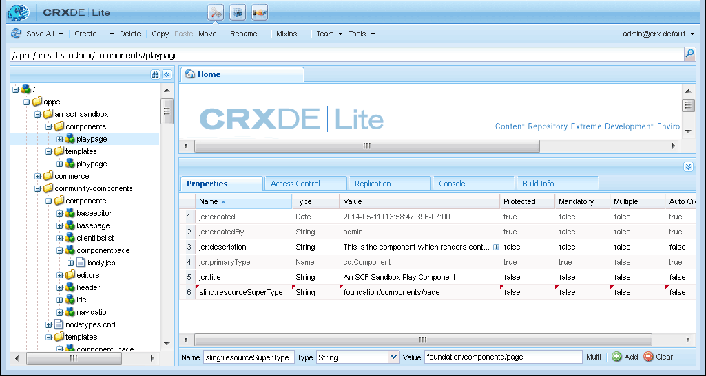

# Entwickeln von Sandbox-Anwendungen {#develop-sandbox-application}

In diesem Abschnitt kann die Anwendung jetzt, da die Vorlage im Abschnitt [Initial Application](initial-app.md) eingerichtet wurde und die ersten Seiten im Abschnitt [Initialinhalt](initial-content.md) erstellt wurden, mithilfe von Foundation-Skripten entwickelt werden, einschließlich der Möglichkeit, das Authoring mit Communities-Komponenten zu aktivieren. Am Ende dieses Abschnitts wird die Website funktionieren.

## Verwenden von Foundation-Seitenskripten {#using-foundation-page-scripts}

Das Standardskript, das erstellt wird, wenn die Komponente, die die PayPage-Vorlage rendert, hinzugefügt wurde, wird geändert, um die head.jsp der Foundation-Seite und eine lokale body.jsp einzuschließen.

### Super Resource Type {#super-resource-type}

Der erste Schritt besteht darin, dem Knoten `/apps/an-scf-sandbox/components/playpage` eine Eigenschaft vom Typ resource super hinzuzufügen, damit er die Skripte und Eigenschaften des Supertyps übernimmt.

Verwenden von CRXDE Lite:

1. Wählen Sie den Knoten `/apps/an-scf-sandbox/components/playpage` aus.
1. Geben Sie auf der Registerkarte &quot;Eigenschaften&quot;eine neue Eigenschaft mit den folgenden Werten ein:

   Name: `sling:resourceSuperType`

   Typ: `String`

   Wert: `foundation/components/page`

1. Klicken Sie auf die grüne Schaltfläche **[!UICONTROL +Add]**.
1. Klicken Sie auf **[!UICONTROL Alle speichern]**.

   

### Kopf- und Textskripte {#head-and-body-scripts}

1. Navigieren Sie im Explorer-Bereich **CRXDE Lite** zu `/apps/an-scf-sandbox/components/playpage` und doppelklicken Sie auf die Datei `playpage.jsp` , um sie im Bearbeitungsfenster zu öffnen.

   `/apps/an-scf-sandbox/components/playpage/playpage.jsp`

   ```xml
   <%--
   
     An SCF Sandbox Play Component component.
   
     This is the component which renders content for An SCF Sandbox page.
   
   --%><%
   %><%@include file="/libs/foundation/global.jsp"%><%
   %><%@page session="false" %><%
   %><%
    // TODO add your code here
   %>
   ```

1. Da Sie Skript-Tags zum Öffnen/Schließen kennen, ersetzen Sie &quot; // TODO ...&quot;. mit Skripten für die Kopf- und Körperteile von &lt;html>.

   Mit dem Supertyp `foundation/components/page` wird jedes Skript, das nicht in diesem Ordner definiert ist, in ein Skript im Ordner `/apps/foundation/components/page` aufgelöst (sofern vorhanden), andernfalls in ein Skript im Ordner `/libs/foundation/components/page`.

   `/apps/an-scf-sandbox/components/playpage/playpage.jsp`

   ```xml
   <%--
   
       An SCF Sandbox Play Component component: playpage.jsp
   
     This is the component which renders content for An SCF Sandbox page.
   
   --%><%
   %><%@include file="/libs/foundation/global.jsp"%><%
   %><%@page session="false" %>
   <html>
     <cq:include script="head.jsp"/>
     <cq:include script="body.jsp"/>
   </html>
   ```

1. Das Foundation-Skript `head.jsp` muss nicht überlagert werden, aber das Foundation-Skript `body.jsp` ist leer.

   Überlagern Sie zum Einrichten für die Bearbeitung `body.jsp` mit einem lokalen Skript und fügen Sie ein Absatzsystem (parsys) in den Text ein:

   1. Navigieren Sie zu `/apps/an-scf-sandbox/components`.
   1. Wählen Sie den Knoten `playpage` aus.
   1. Klicken Sie mit der rechten Maustaste und wählen Sie `Create > Create File...` aus.

      * Name: **body.jsp**
   1. Klicken Sie auf **[!UICONTROL Alle speichern]**.

   Öffnen Sie `/apps/an-scf-sandbox/components/playpage/body.jsp` und fügen Sie Folgendes ein:

   ```xml
   <%--
   
       An SCF Sandbox Play Component component: body.jsp
   
     This is the component which renders content for An SCF Sandbox page.
   
   --%><%
   %><%@include file="/libs/foundation/global.jsp"%><%
   %><%@page session="false" %>
   <body>
       <h2>Community Play</h2>
       <cq:include path="par" resourceType="foundation/components/parsys" />
   </body>
   ```

1. Klicken Sie auf **[!UICONTROL Alle speichern]**.

**Zeigen Sie die Seite in einem Browser im Bearbeitungsmodus an:**

* Standardbenutzeroberfläche: [http://localhost:4502/editor.html/content/an-scf-sandbox/en/play.html](http://localhost:4502/editor.html/content/an-scf-sandbox/en/play.md)

Sie sollten nicht nur die Überschrift **Community Play** sehen, sondern auch die Benutzeroberfläche zum Bearbeiten von Seiteninhalten.

Das seitliche Bedienfeld &quot;Assets/Komponente&quot;wird angezeigt, wenn das seitliche Bedienfeld geöffnet ist und das Fenster breit genug ist, um sowohl den Seiteninhalt als auch den Seiteninhalt anzuzeigen.


* Klassische Benutzeroberfläche: [http://localhost:4502/cf#/content/an-scf-sandbox/en/play.html](http://localhost:4502/cf#/content/an-scf-sandbox/en/play.html)

Im Folgenden wird gezeigt, wie die Wiedergabeseite in der klassischen Benutzeroberfläche einschließlich des Content Finders (cf) angezeigt wird:


## Communities-Komponenten {#communities-components}

Um Communities-Komponenten für das Authoring zu aktivieren, befolgen Sie die folgenden Anweisungen:

* [Auf Communities-Komponenten zugreifen](basics.md#accessing-communities-components)

Beginnen Sie für diese Sandbox mit den folgenden **Communities**-Komponenten (aktivieren Sie durch Aktivieren des Kontrollkästchens):

* Kommentare
* Forum
* Bewertung
* Reviews
* Bewertungszusammenfassung (Anzeige)
* Abstimmung

Wählen Sie außerdem die Komponenten **[!UICONTROL Allgemein]** aus, z. B.

* Bild
* Tabelle
* Text
* Titel (Foundation)

>[!NOTE]
>
>Die für die Seitenpar aktivierten Komponenten werden im Repository als Wert der Eigenschaft `components` der
>
>`/etc/designs/an-scf-sandbox/jcr:content/playpage/par` node.

## Landingpage {#landing-page}

In einer mehrsprachigen Umgebung würde die Stammseite ein Skript enthalten, das die Anfrage vom Client analysiert, um die bevorzugte Sprache zu bestimmen.

In diesem einfachen Beispiel wird die Stammseite statisch so eingestellt, dass sie zur englischen Seite weitergeleitet wird, die in Zukunft als Haupt-Landingpage mit einem Link zur Wiedergabeseite entwickelt werden kann.

Ändern Sie die Browser-URL in die Stammseite: [http://localhost:4502/editor.html/content/an-scf-sandbox.html](https://locahost:4502/editor.html/content/an-scf-sandbox.html)

* Symbol Seiteninformationen auswählen
* Wählen Sie **[!UICONTROL Eigenschaften öffnen]**
* Auf der Registerkarte ERWEITERT

   * Navigieren Sie für den Umleitungs-Eintrag zu **[!UICONTROL Websites]** > **[!UICONTROL SCF Sandbox Site]** > **[!UICONTROL SCF Sandbox]**
   * Klicken Sie auf **[!UICONTROL OK]**

* Klicken Sie auf **[!UICONTROL OK]**

Sobald die Site veröffentlicht wurde, wird das Browsen zur Stammseite in einer Veröffentlichungsinstanz zur englischen Seite weitergeleitet.

Der letzte Schritt vor dem Abspielen mit den SCF-Communities-Komponenten besteht darin, einen Client-Bibliotheksordner (clientlibs) hinzuzufügen .... [Hinzufügen von ClientLibs](add-clientlibs.md)
