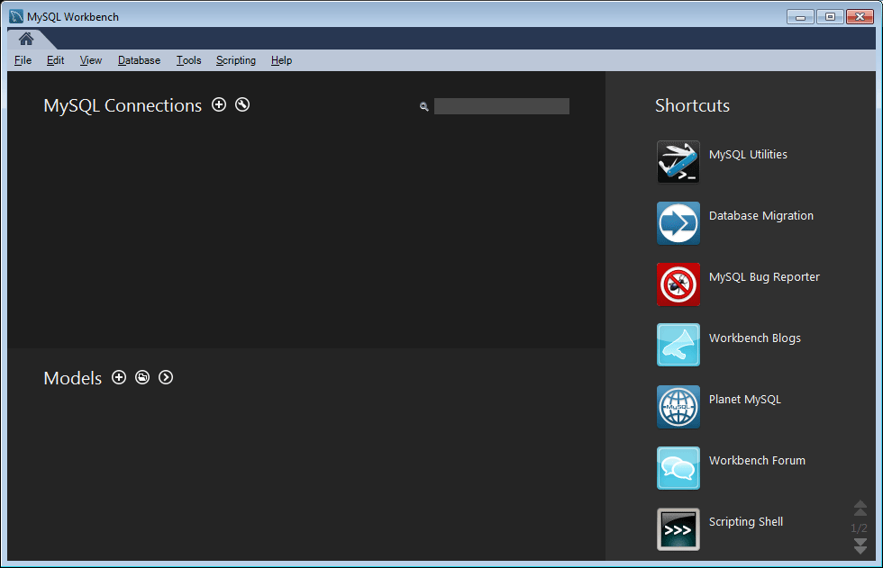

# MySQL-Konfiguration für DSRP {#mysql-configuration-for-dsrp}

MySQL ist eine relationale Datenbank, mit der benutzergenerierte Inhalte (UGC) gespeichert werden können.

Diese Anweisungen beschreiben, wie eine Verbindung zum MySQL-Server hergestellt und die UGC-Datenbank eingerichtet wird.

## Voraussetzungen {#requirements}

* [Neueste Communities Feature Pack](deploy-communities.md#latestfeaturepack)
* [JDBC-Treiber für MySQL](deploy-communities.md#jdbc-driver-for-mysql)
* Eine relationale Datenbank:

   * [MySQL ](https://dev.mysql.com/downloads/mysql/) serverCommunity Server Version 5.6 oder höher

      * Kann auf demselben Host ausgeführt werden wie AEM oder remote ausgeführt werden
   * [MySQL-Workbench](https://dev.mysql.com/downloads/tools/workbench/)

## MySQL {#installing-mysql} installieren

 MySQL sollte gemäß den Anweisungen für das Zielgruppe OS heruntergeladen und installiert werden.

### Tabellennamen in Kleinbuchstaben {#lower-case-table-names}

Da bei SQL nicht zwischen Groß- und Kleinschreibung unterschieden wird, müssen bei Betriebssystemen, bei denen die Groß-/Kleinschreibung beachtet wird, alle Tabellennamen in Kleinbuchstaben eingestellt werden.

So geben Sie beispielsweise alle Tabellennamen in Kleinbuchstaben unter Linux an:

* Datei `/etc/my.cnf` bearbeiten
* Fügen Sie im Abschnitt `[mysqld]` die folgende Zeile hinzu:

   `lower_case_table_names = 1`

### UTF8-Zeichensatz {#utf-character-set}

Um eine bessere mehrsprachige Unterstützung zu bieten, muss der UTF8-Zeichensatz verwendet werden.

Ändern Sie MySQL so, dass UTF8 als Zeichensatz verwendet wird:

* mysql > SET NAMES &#39;utf8&#39;;

Ändern Sie die MySQL-Datenbank in UTF8:

* Datei `/etc/my.cnf` bearbeiten
* Fügen Sie im Abschnitt `[client]` die folgende Zeile hinzu:

   `default-character-set=utf8`

* Fügen Sie im Abschnitt `[mysqld]` die folgende Zeile hinzu:

   `character-set-server=utf8`

## MySQL Workbench {#installing-mysql-workbench} installieren

MySQL Workbench bietet eine Benutzeroberfläche zum Ausführen von SQL-Skripten, die das Schema und die Ausgangsdaten installieren.

MySQL Workbench sollte gemäß den Anweisungen für das Zielgruppe OS heruntergeladen und installiert werden.

## Communities-Verbindung {#communities-connection}

Wenn MySQL Workbench zum ersten Mal gestartet wird, werden, sofern sie nicht bereits für andere Zwecke verwendet werden, noch keine Verbindungen angezeigt:

### Neue Verbindungseinstellungen {#new-connection-settings}

1. Wählen Sie das Symbol `+` rechts von `MySQL Connections`.
1. Geben Sie im Dialogfeld `Setup New Connection` die für Ihre Plattform geeigneten Werte ein

   Zu Demonstrationszwecken mit der Autorinstanz AEM MySQL auf demselben Server:

   * Verbindungsname: `Communities`
   * Verbindungsmethode: `Standard (TCP/IP)`
   * Hostname: `127.0.0.1`
   * Benutzername: `root`
   * Passwort: `no password by default`
   * Standard-Schema: `leave blank`

1. Wählen Sie `Test Connection`, um die Verbindung zum ausgeführten MySQL-Dienst zu überprüfen

**Hinweise**:

* Der Standardanschluss ist `3306`
* Der ausgewählte Verbindungsname wird als Datenquellenname in der JDBC OSGi-Konfiguration [eingegeben](#configurejdbcconnections)

#### Neue Communities-Verbindung {#new-communities-connection}

## Datenbank-Setup {#database-setup}

Öffnen Sie die Communities-Verbindung, um die Datenbank zu installieren.

### Abrufen des SQL-Skripts {#obtain-the-sql-script}

Das SQL-Skript wird aus dem AEM Repository abgerufen:

1. Zur CRXDE Lite navigieren

   * Beispiel: [http://localhost:4502/crx/de](http://localhost:4502/crx/de)

1. Wählen Sie den Ordner /libs/social/config/datastore/dsrp/Schema
1. Download `init-schema.sql`

   

Eine Möglichkeit zum Herunterladen des Schemas besteht darin,

* Wählen Sie den Knoten `jcr:content` für die SQL-Datei aus.
* Beachten Sie, dass der Wert für die `jcr:data`-Eigenschaft ein Link zur Ansicht ist.

* Wählen Sie den Link &quot;Ansicht&quot;, um die Daten in einer lokalen Datei zu speichern

### Erstellen der DSRP-Datenbank {#create-the-dsrp-database}

Gehen Sie wie folgt vor, um die Datenbank zu installieren. Der Standardname der Datenbank ist `communities`.

Wenn der Datenbankname im Skript geändert wird, müssen Sie ihn auch in der [JDBC-Konfiguration](#configurejdbcconnections) ändern.

#### Schritt 1: Öffnen Sie die SQL-Datei {#step-open-sql-file}

In der MySQL-Workbench

* Wählen Sie im Pulldown-Menü Datei die Option **[!UICONTROL SQL Script öffnen]**
* Wählen Sie das heruntergeladene Skript `init_schema.sql`

#### Schritt 2: execute SQL Script {#step-execute-sql-script}

Wählen Sie im Fenster Workbench für die in Schritt 1 geöffnete Datei das `lightening (flash) icon` aus, um das Skript auszuführen.

In der folgenden Abbildung steht die `init_schema.sql`-Datei zur Ausführung bereit:

#### Aktualisieren {#refresh}

Nachdem das Skript ausgeführt wurde, müssen Sie den Abschnitt `SCHEMAS` von `Navigator` aktualisieren, damit die neue Datenbank angezeigt wird. Verwenden Sie das Aktualisierungssymbol rechts neben &quot;SCHEMAS&quot;:

## JDBC-Verbindung konfigurieren {#configure-jdbc-connection}

Die OSGi-Konfiguration für **Day Commons JDBC Connections Pool** konfiguriert den MySQL JDBC-Treiber.

Alle Veröffentlichungs- und Autoreninstanzen sollten auf denselben MySQL-Server verweisen AEM.

Wenn MySQL auf einem Server ausgeführt wird, der sich von AEM unterscheidet, muss der Hostname des Servers anstelle von &quot;localhost&quot;im JDBC-Connector angegeben werden.

* Auf jeder Instanz im Autorenmodus und AEM im Veröffentlichungsmodus.
* Mit Administratorberechtigungen angemeldet.
* Greifen Sie auf die [Webkonsole](../../help/sites-deploying/configuring-osgi.md) zu.

   * Beispiel: [http://localhost:4502/system/console/configMgr](http://localhost:4502/system/console/configMgr)

* Suchen Sie nach `Day Commons JDBC Connections Pool`
* Klicken Sie auf das Symbol `+`, um eine neue Verbindungskonfiguration zu erstellen.

   

* Geben Sie die folgenden Werte ein:

   * **[!UICONTROL JDBC-Treiberklasse]**: `com.mysql.jdbc.Driver`
   * **[!UICONTROL JDBC-Verbindungs-URI]**: `jdbc:mysql://localhost:3306/communities?characterEncoding=UTF-8`

      Geben Sie den Server anstelle von localhost an, wenn der MySQL-Server nicht identisch mit &quot;this&quot; AEM Server *Communities* der Standarddateiname (Schema) ist.

   * **[!UICONTROL Benutzername]**: `root`

      Oder geben Sie den konfigurierten Benutzernamen für den MySQL-Server ein, wenn nicht &quot;root&quot;.

   * **[!UICONTROL Kennwort]**:

      Löschen Sie dieses Feld, wenn für MySQL kein Kennwort festgelegt wurde,

      Geben Sie andernfalls das konfigurierte Kennwort für den MySQL-Benutzernamen ein.

   * **[!UICONTROL Name]** der Datenquelle: Name, der für die  [MySQL-Verbindung](#new-connection-settings) eingegeben wurde, z. B. &quot;Communities&quot;.

* Wählen Sie **[!UICONTROL Speichern]** aus

