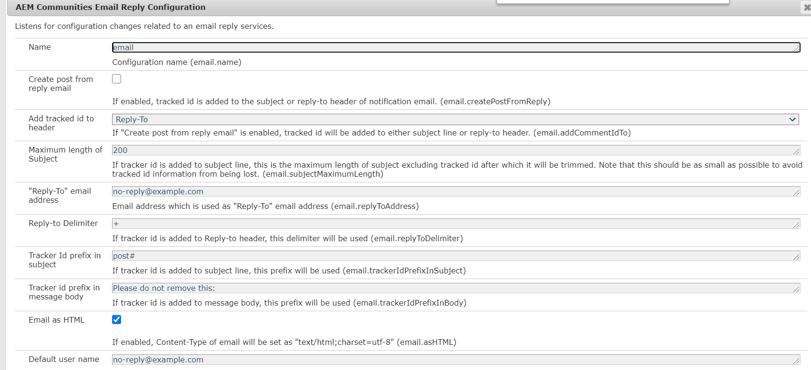
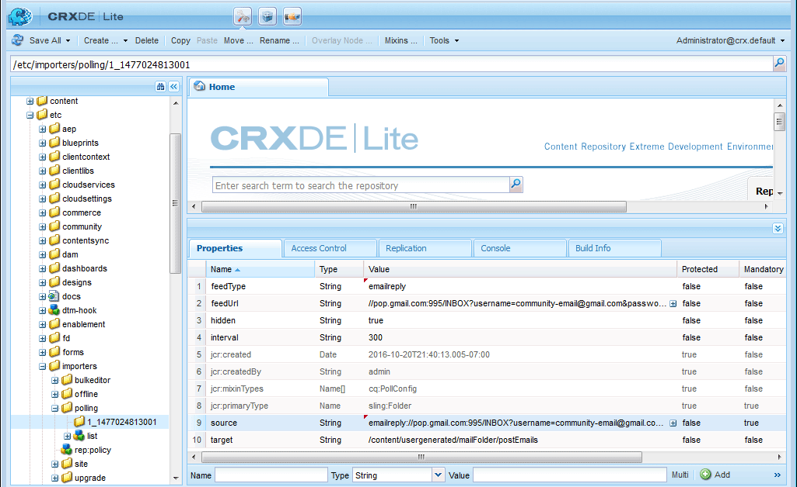

# E-Mail konfigurieren {#configuring-email}

AEM Communities verwendet E-Mail für:

* [Communities-Benachrichtigungen](notifications.md)
* [Communities-Abonnements](subscriptions.md)

Standardmäßig ist die E-Mail-Funktion nicht funktionsfähig, da sie die Spezifikation eines SMTP-Servers und SMTP-Benutzers erfordert.

>[!CAUTION]
>
>E-Mail für Benachrichtigungen und Abonnements darf nur auf der [primärer Herausgeber](deploy-communities.md#primary-publisher).

## Standard-E-Mail-Dienstkonfiguration {#default-mail-service-configuration}

Der Standard-E-Mail-Dienst ist sowohl für Benachrichtigungen als auch für Abonnements erforderlich.

* Melden Sie sich mit Administratorrechten beim primären Herausgeber an und greifen Sie auf die [Web-Konsole](../../help/sites-deploying/configuring-osgi.md):

   * Beispiel: [http://localhost:4503/system/console/configMgr](http://localhost:4503/system/console/configMgr)

* Suchen Sie die `Day CQ Mail Service`.
* Wählen Sie das Bearbeitungssymbol aus.

Dies basiert auf der Dokumentation für [Konfigurieren von E-Mail-Benachrichtigungen](../../help/sites-administering/notification.md), jedoch mit einem Unterschied in diesem Feld `"From" address` is *not* erforderlich und sollte leer gelassen werden.

Beispiel: (nur zu Veranschaulichungszwecken mit Werten gefüllt):

* **[!UICONTROL Hostname des SMTP-Servers]**

  *(Erforderlich)* Der zu verwendende SMTP-Server.

* **[!UICONTROL SMTP-Server-Anschluss]**

  *(Erforderlich)* Der SMTP-Server-Port muss 25 oder höher sein.

* **[!UICONTROL SMTP-Benutzer]**

  *(Erforderlich)* Der SMTP-Benutzer.

* **[!UICONTROL SMTP-Kennwort]**

  *(Erforderlich)* Das Kennwort des SMTP-Benutzers.

* **[!UICONTROL &quot;Von&quot;-Adresse]**

  Leer lassen
* **[!UICONTROL SMTP SSL verwenden]**

  Wenn diese Option aktiviert ist, wird eine sichere E-Mail gesendet. Stellen Sie sicher, dass der Port auf 465 oder wie für einen SMTP-Server erforderlich eingestellt ist.
* **[!UICONTROL Debug-E-Mail]**

  Wenn diese Option aktiviert ist, ermöglicht dies die Protokollierung von SMTP-Serverinteraktionen.

## AEM Communities-E-Mail-Konfiguration {#aem-communities-email-configuration}

Einmal die [Standard-E-Mail-Dienst](#default-mail-service-configuration) konfiguriert ist, werden die beiden vorhandenen Instanzen der `AEM Communities Email Reply Configuration` Die in der Version enthaltene OSGi-Konfiguration wird funktionsfähig.

Nur die Instanz für Abonnements muss weiter konfiguriert werden, wenn E-Mail-Antworten zugelassen werden.

1. [Email](#configuration-for-notifications) instance:

   Bei Benachrichtigungen, die keine Antwort-E-Mail unterstützen und nicht geändert werden sollten.

1. [Subscriptions-email](#configuration-for-subscriptions) instance:

   Erfordert eine Konfiguration, um die Erstellung von Beiträgen aus einer Antwort-E-Mail vollständig zu aktivieren.

So greifen Sie auf die Communities-E-Mail-Konfigurationsinstanzen zu:

* Melden Sie sich mit Administratorrechten beim primären Herausgeber an und greifen Sie auf die [Web-Konsole](../../help/sites-deploying/configuring-osgi.md)

   * Beispiel: [http://localhost:4503/system/console/configMgr](http://localhost:4503/system/console/configMgr)

* Suchen `AEM Communities Email Reply Configuration`.

### Konfiguration für Benachrichtigungen {#configuration-for-notifications}

Die Instanz von `AEM Communities Email Reply Configuration` Die OSGi-Konfiguration mit der E-Mail &quot;Name&quot;ist die Benachrichtigungsfunktion. Diese Funktion enthält keine E-Mail-Antwort.

Ändern Sie diese Konfiguration nicht.

* Suchen Sie die `AEM Communities Email Reply Configuration`.
* Wählen Sie das Bearbeitungssymbol aus.
* Stellen Sie sicher, dass **Name** is `email`.

* Stellen Sie sicher, dass **Beitrag aus Antwort-E-Mail erstellen** is `unchecked`.

### Konfiguration für Abonnements {#configuration-for-subscriptions}

Bei Communities-Abonnements ist es möglich, die Möglichkeit für ein Mitglied zu aktivieren oder zu deaktivieren, Inhalte zu posten, indem es auf eine E-Mail antwortet.

* Suchen Sie die `AEM Communities Email Reply Configuration`.
* Wählen Sie das Bearbeitungssymbol aus.
* Stellen Sie sicher, dass **Name** is `subscriptions-email`.

  

* **[!UICONTROL Name]**

  *(Erforderlich)* `subscriptions-email`. Nicht bearbeiten.

* **[!UICONTROL Beitrag aus Antwort-E-Mail erstellen]**

  Wenn diese Option aktiviert ist, kann der Empfänger einer Abonnement-E-Mail Inhalte durch Senden einer Antwort posten. Die Option Standard ist aktiviert.
* **[!UICONTROL Getrackte ID zur Kopfzeile hinzufügen]**

  Der Standardwert ist `Reply-To`.

* **[!UICONTROL Maximale Länge des Betreffs]**

  Wenn die Tracker-ID zur Betreffzeile hinzugefügt wird, ist dies die maximale Länge des Betreffs, ausgenommen die verfolgte ID, nach der sie abgeschnitten wird. Dies sollte so klein wie möglich sein, um zu verhindern, dass getrackte ID-Informationen verloren gehen. Der Standardwert lautet 200.

* **[!UICONTROL E-Mail-Adresse &quot;Antwort an&quot;]**

  Adresse, die als &quot;Antwort&quot;-E-Mail-Adresse verwendet wird. Der Standardwert ist `no-reply@example.com`.

* **[!UICONTROL Antwort an Trennzeichen]**

  Wenn die Tracker-ID zur Kopfzeile Antwort hinzugefügt wird, wird dieses Trennzeichen verwendet. Der Standardwert ist `+` (Pluszeichen).

* **[!UICONTROL Tracker-ID-Präfix im Betreff]**

  Wenn die Tracker-ID der Betreffzeile hinzugefügt wird, wird dieses Präfix verwendet. Der Standardwert ist `post#`.

* **[!UICONTROL Tracker-ID-Präfix im Nachrichtentext]**

  Wenn die Tracker-ID zum Nachrichtentext hinzugefügt wird, wird dieses Präfix verwendet. Der Standardwert ist `Please do not remove this:`.

* **[!UICONTROL E-Mail als HTML]**: Ist diese Option aktiviert, wird der Inhaltstyp der E-Mail auf `"text/html;charset=utf-8"`. Die Option Standard ist aktiviert.

* **[!UICONTROL Standardbenutzername]**

  Dieser Name wird für Benutzer ohne Namen verwendet. Der Standardwert ist `no-reply@example.com`.

* **[!UICONTROL Vorlagen-Stammpfad]**

  Die E-Mail wird mithilfe einer Vorlage erstellt, die in diesem Stammverzeichnis gespeichert ist. Der Standardwert ist `/etc/community/templates/subscriptions-email`.

## Abruf-Importtool konfigurieren {#configure-polling-importer}

Damit die E-Mail in das Repository geladen werden kann, muss ein Abruf-Importtool konfiguriert und die Eigenschaften im Repository manuell konfiguriert werden.

### Neuen Abruf-Importtool hinzufügen {#add-new-polling-importer}

* Melden Sie sich mit Administratorrechten beim primären Herausgeber an und navigieren Sie zur Abruf-Importtool-Konsole:

  Beispiel: [http://localhost:4503/etc/importers/polling.html](http://localhost:4503/etc/importers/polling.html)

* Klicken Sie auf **[!UICONTROL Hinzufügen]**

  

* **[!UICONTROL Typ]**

  *(Erforderlich)* Nach unten zur Auswahl ziehen `POP3 (over SSL)`.

* **[!UICONTROL URL]**

  *(Erforderlich)* Der ausgehende Mail-Server. Zum Beispiel: `pop.gmail.com:995/INBOX?username=community-emailgmail.com&password=****`.

* **[!UICONTROL Import in Pfad]**&amp;ast;

  *(Erforderlich)* Legen Sie `/content/usergenerated/mailFolder/postEmails`
durch Navigation zum `postEmails`Ordner und auswählen **OK**.

* **[!UICONTROL Intervall in Sekunden aktualisieren]**

  *(Optional)* Der für den Standard-E-Mail-Dienst konfigurierte Mailserver weist möglicherweise Anforderungen in Bezug auf den Wert des Aktualisierungsintervalls auf. Gmail erfordert beispielsweise möglicherweise ein Intervall von `300`.

* **[!UICONTROL Anmeldung]**

  *(Optional)*

* **[!UICONTROL Kennwort]**

  *(Optional)*

* Wählen Sie **[!UICONTROL OK]** aus.

### Anpassen des Protokolls für den neuen Abruf-Importtool {#adjust-protocol-for-new-polling-importer}

Sobald die neue Abruffunktion gespeichert wurde, müssen die Eigenschaften des E-Mail-Importtools für Abonnements weiter geändert werden, um das Protokoll von `POP3` nach `emailreply`.

Verwenden [CRXDE Lite](../../help/sites-developing/developing-with-crxde-lite.md):

* Melden Sie sich mit Administratorrechten beim primären Herausgeber an und navigieren Sie zu [https://&lt;server>:&lt;port>/crx/de/index.jsp#/etc/importers/olling](http://localhost:4503/crx/de/index.jsp#/etc/importers/polling).
* Wählen Sie die neu erstellte Konfiguration aus und ändern Sie die folgenden Eigenschaften:

   * **feedType**: Replace `pop3s` mit **`emailreply`**
   * **source**: Quellprotokoll ersetzen `pop3s://` mit **`emailreply://`**

Die roten Dreiecke geben die geänderten Eigenschaften an. Achten Sie darauf, die Änderungen zu speichern:

* Klicken Sie auf **[!UICONTROL Alle speichern]**.
