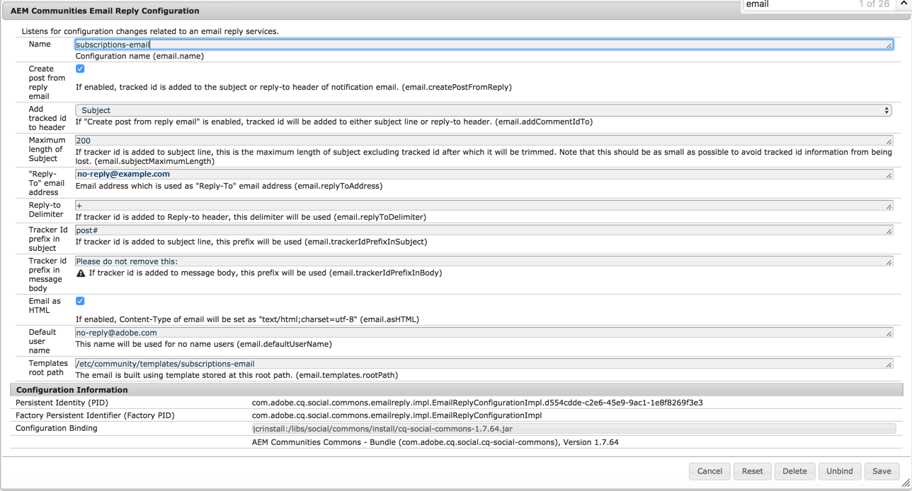

# Konfigurieren der E-Mail {#configuring-email}

AEM Communities verwendet E-Mail für:

* [Communities-Benachrichtigungen](notifications.md)
* [Communities Abonnements](subscriptions.md)

Standardmäßig funktioniert die E-Mail-Funktion nicht, da sie die Angabe eines SMTP-Servers und SMTP-Benutzers erfordert.

>[!CAUTION]
>
>E-Mail für Benachrichtigungen und Abonnement muss nur für den [primären Herausgeber](deploy-communities.md#primary-publisher)konfiguriert werden.

## Standardkonfiguration für den Mail-Dienst {#default-mail-service-configuration}

Der Standard-E-Mail-Dienst ist sowohl für Benachrichtigungen als auch für Abonnement erforderlich.

* Melden Sie sich mit Administratorrechten beim primären Herausgeber an und greifen Sie auf die [Web-Konsole](../../help/sites-deploying/configuring-osgi.md)zu:

   * For example, [http://localhost:4503/system/console/configMgr](http://localhost:4503/system/console/configMgr)

* Suchen Sie die `Day CQ Mail Service`.
* Wählen Sie das Bearbeitungssymbol aus.

Dies basiert auf der Dokumentation zum [Konfigurieren der E-Mail-Benachrichtigung](../../help/sites-administering/notification.md), allerdings ist das Feld `"From" address` nicht ** erforderlich und sollte leer bleiben.

Beispiel (nur mit Werten zur Veranschaulichung gefüllt):

* **[!UICONTROL Hostname des SMTP-Servers]**

   *(Erforderlich)* Der zu verwendende SMTP-Server.

* **[!UICONTROL SMTP-Serveranschluss]**

   *(Erforderlich)* Der SMTP-Serveranschluss muss mindestens 25 betragen.

* **[!UICONTROL SMTP-Benutzer]**

   *(Erforderlich)* Der SMTP-Benutzer.

* **[!UICONTROL SMTP-Kennwort]**

   *(Erforderlich)* Das Kennwort des SMTP-Benutzers.

* **[!UICONTROL &quot;Von&quot;-Adresse]**

   Leer lassen
* **[!UICONTROL SMTP mit SSL]**

   Wenn diese Option aktiviert ist, wird sichere E-Mail gesendet. Stellen Sie sicher, dass der Anschluss auf 465 oder wie für den SMTP-Server erforderlich eingestellt ist.
* **[!UICONTROL Debug-E-Mail]**

   Wenn diese Option aktiviert ist, wird die Protokollierung von SMTP-Serverinteraktionen aktiviert.

## AEM Communities-E-Mail-Konfiguration {#aem-communities-email-configuration}

Sobald der [Standard-E-Mail-Dienst](#default-mail-service-configuration) konfiguriert ist, funktionieren die beiden in der Version enthaltenen Instanzen der `AEM Communities Email Reply Configuration` OSGi-Konfiguration.

Nur die Instanz für Abonnement muss weiter konfiguriert werden, wenn eine Antwort per E-Mail zulässig ist.

1. [E-Mail](#configuration-for-notifications) -Instanz:

   Bei Benachrichtigungen, die keine Antwort-E-Mail unterstützen und nicht geändert werden sollten.

1. [Abonnements-E-Mail](#configuration-for-subscriptions) -Instanz:

   Erfordert eine Konfiguration, um die Erstellung eines Beitrags aus einer Antwort-E-Mail vollständig zu aktivieren.

So rufen Sie die Communities-E-Mail-Konfigurationsinstanzen auf:

* Melden Sie sich mit Administratorrechten beim primären Herausgeber an und greifen Sie auf die [Web-Konsole zu](../../help/sites-deploying/configuring-osgi.md)

   * For example, [http://localhost:4503/system/console/configMgr](http://localhost:4503/system/console/configMgr)

* Suchen Sie `AEM Communities Email Reply Configuration`.

### Konfiguration für Benachrichtigungen {#configuration-for-notifications}

Die Instanz der `AEM Communities Email Reply Configuration` OSGi-Konfiguration mit der E-Mail-Adresse Name ist die Benachrichtigungsfunktion. Diese Funktion umfasst keine E-Mail-Antwort.

Diese Konfiguration sollte nicht geändert werden.

* Suchen Sie die `AEM Communities Email Reply Configuration`.
* Wählen Sie das Bearbeitungssymbol aus.
* Überprüfen Sie, ob der **Name** `email`lautet.

* Vergewissern Sie sich, dass **Beitrag aus Antwort-E-Mail** erstellen `unchecked`ist.

### Konfiguration für Abonnement {#configuration-for-subscriptions}

Bei Communities-Abonnements ist es möglich, die Möglichkeit zu aktivieren oder zu deaktivieren, dass ein Mitglied Inhalte per E-Mail posten kann.

* Suchen Sie die `AEM Communities Email Reply Configuration`.
* Wählen Sie das Bearbeitungssymbol aus.
* Überprüfen Sie, ob der **Name** `subscriptions-email`lautet.

   

* **[!UICONTROL Name]**

   *(Erforderlich)* `subscriptions-email`. Nicht bearbeiten.

* **[!UICONTROL Beitrag aus Antwort-E-Mail erstellen]**

   Wenn diese Option aktiviert ist, kann der Empfänger der Abonnement-E-Mail Inhalte veröffentlichen, indem er eine Antwort sendet. Diese Option ist standardmäßig aktiviert.
* **[!UICONTROL hinzufügen verfolgt ID in Kopfzeile]**

   Der Standardwert ist `Reply-To`.

* **[!UICONTROL Maximale Länge des Betreffs]**

   Wenn der Betreffzeile eine Tracker-ID hinzugefügt wird, ist dies die maximale Länge des Betreffs, mit Ausnahme der verfolgten ID, nach der sie abgeschnitten wird. Beachten Sie, dass dies so klein wie möglich sein sollte, damit verfolgte ID-Informationen nicht verloren gehen. Der Standardwert ist 200.

* **[!UICONTROL E-Mail-Adresse &quot;Antwort an&quot;]**

   Adresse, die als E-Mail-Adresse für Antworten verwendet wird. Der Standardwert ist `no-reply@example.com`.

* **[!UICONTROL Antwort-zu-Trennzeichen]**

   Wenn die Tracker-ID der Antwort-zu-Kopfzeile hinzugefügt wird, wird dieses Trennzeichen verwendet. Der Standardwert ist `+` (Pluszeichen).

* **[!UICONTROL Präfix der Tracker-ID im Betreff]**

   Wenn der Betreffzeile eine Tracker-ID hinzugefügt wird, wird dieses Präfix verwendet. Der Standardwert ist `post#`.

* **[!UICONTROL Präfix der Tracker-ID im Nachrichtentext]**

   Wenn dem Nachrichtentext eine Tracker-ID hinzugefügt wird, wird dieses Präfix verwendet. Der Standardwert ist `Please do not remove this:`.

* **[!UICONTROL E-Mail als HTML]**: Wenn diese Option aktiviert ist, wird der Content-Type der E-Mail als `"text/html;charset=utf-8"`. Diese Option ist standardmäßig aktiviert.

* **[!UICONTROL Standardbenutzername]**

   Dieser Name wird für Benutzer ohne Namen verwendet. Der Standardwert ist `no-reply@example.com`.

* **[!UICONTROL Stammpfad der Vorlagen]**

   Die E-Mail wird mithilfe der Vorlage erstellt, die in diesem Stammverzeichnis gespeichert ist. Der Standardwert ist `/etc/community/templates/subscriptions-email`.

## Abruf-Importer konfigurieren {#configure-polling-importer}

Damit die E-Mail in das Repository geladen werden kann, müssen Sie einen Abrufimporteur konfigurieren und seine Eigenschaften im Repository manuell konfigurieren.

### hinzufügen neuer Abruf-Importer {#add-new-polling-importer}

* Melden Sie sich mit Administratorberechtigungen beim primären Herausgeber an und navigieren Sie zur Abstimmungs-Importer-Konsole:

   Beispiel: [http://localhost:4503/etc/importers/polling.html](http://localhost:4503/etc/importers/polling.html)

* Auswählen **[!UICONTROL Hinzufügen]**

   

* **[!UICONTROL Typ]**

   *(Erforderlich)* Ziehen Sie zur Auswahl nach unten `POP3 (over SSL)`.

* **[!UICONTROL URL]**

   *(Erforderlich)* Der ausgehende Mail-Server. Beispiel: `pop.gmail.com:995/INBOX?username=community-emailgmail.com&password=****`.

* **[!UICONTROL In Pfad]**&amp;ast importieren;

   *(Erforderlich)* Legen Sie die Einstellung `/content/usergenerated/mailFolder/postEmails`fest, indem Sie zum `postEmails`Ordner navigieren und **OK** wählen.

* **[!UICONTROL Intervall in Sekunden aktualisieren]**

   *(Optional)* Der für den Standard-E-Mail-Dienst konfigurierte E-Mail-Server verfügt möglicherweise über Anforderungen hinsichtlich des Zeitintervalls für die Aktualisierung. So kann beispielsweise für Google Mail ein Intervall von `300`erforderlich sein.

* **[!UICONTROL Anmeldung]**

   *(Optional)*

* **[!UICONTROL Kennwort]**

   *(Optional)*

* Wählen Sie **[!UICONTROL OK]** aus.

### Anpassen des Protokolls für den neuen Abruf-Importer {#adjust-protocol-for-new-polling-importer}

Nachdem die neue Abrufkonfiguration gespeichert wurde, müssen Sie die Eigenschaften des Abonnement E-Mail-Importeurs weiter ändern, um das Protokoll von `POP3` in zu ändern `emailreply`

Using [CRXDE Lite](../../help/sites-developing/developing-with-crxde-lite.md):

* Melden Sie sich mit Administratorrechten beim primären Herausgeber an und navigieren Sie zu [https://&lt;server>: /crx/de/index.jsp#/etc/importing/polling](http://localhost:4503/crx/de/index.jsp#/etc/importers/polling).
* Wählen Sie die neu erstellte Konfiguration aus und ändern Sie die folgenden Eigenschaften:

   * **feedType**: Ersetzen `pop3s` durch **`emailreply`**
   * **source**: Quellprotokoll ersetzen `pop3s://` durch **`emailreply://`**

Die roten Dreiecke geben die geänderten Eigenschaften an. Speichern Sie die Änderungen unbedingt:

* Select **[!UICONTROL Save All]**.

