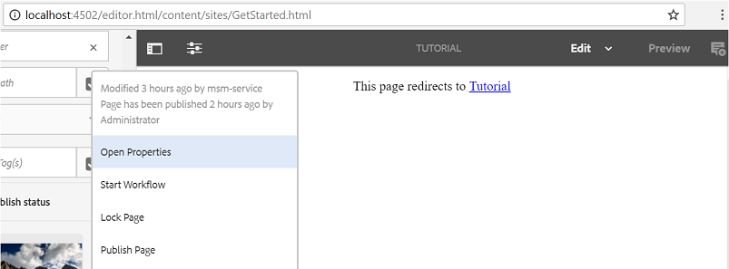

# Erleben Sie die veröffentlichte Site {#experience-the-published-site}

**[⇐ Erstellen und Zuweisen von Aktivierungsressourcen](resource.md)**

## Navigieren Sie zur neuen Site auf der Veröffentlichungsinstanz {#browse-to-new-site-on-publish}

Nachdem die neu erstellte Community-Site und ihre Aktivierungsressourcen und der Lernpfad veröffentlicht wurden, können Sie die Seite &quot;Aktivierungstutorial&quot;nutzen.

Beginnen Sie mit dem Durchsuchen der URL, die beim Erstellen der Site angezeigt wird, aber auf dem Veröffentlichungsserver, z. B.

* Autoren-URL = [http://localhost:4502/content/sites/enable/en.html](http://localhost:4502/content/sites/enable/en.html)
* Veröffentlichungs-URL = [http://localhost:4503/content/sites/enable/en.html](http://localhost:4503/content/sites/enable/en.html)

Wenn die Standardstartseite [festgelegt wurde](enablement-create-site.md#changethedefaulthomepage), sollten Sie einfach zu [http://localhost:4503/](http://localhost:4503/) navigieren, um die Site zu starten.

Bei der ersten Ankunft auf der veröffentlichten Site wäre der Site-Besucher in der Regel nicht bereits angemeldet und anonym.

**http://localhost:4503/content/sites/enable/en.html**

## Anonymer Site-Besucher {#anonymous-site-visitor}

Einem anonymen Site-Besucher wird sofort die Anmeldeseite für diese private Aktivierungs-Community-Site angezeigt. Beachten Sie, dass es keine Option gibt, sich selbst zu registrieren oder sich bei Facebook oder Twitter anzumelden.

Beachten Sie, dass auf dieser Homepage vier Menüpunkte angezeigt werden: `Assignments, Ski Catalog, What's New` und `Discussions`, aber keine kann ohne Anmeldung erreicht werden.

>[!NOTE]
>
>Es ist möglich, anonymen Zugriff auf eine Aktivierungs-Site zu gewähren, ohne dass Besucher der Site sich selbst registrieren können.
>
>Wenn eine Aktivierungsressource auf `show in catalog` und `allow anonymous access` festgelegt ist, können anonyme Site-Besucher Ressourcen im Katalog anzeigen.

### Verhindern des anonymen Zugriffs auf JCR {#prevent-anonymous-access-on-jcr}

Durch eine bekannte Einschränkung wird der Community-Site-Inhalt anonymen Besuchern über JCR-Inhalt und JSON bereitgestellt, obwohl **[!UICONTROL Anonymen Zugriff zulassen]** für den Site-Inhalt deaktiviert ist. Dieses Verhalten kann jedoch mithilfe von Sling-Einschränkungen als Problemumgehung gesteuert werden.

Gehen Sie wie folgt vor, um den Inhalt Ihrer Community-Site vor dem Zugriff anonymer Benutzer durch jcr-Inhalte und JSON zu schützen:

1. Wechseln Sie in AEM Autoreninstanz zu https://&lt;Host>:&lt;Port>/editor.html/content/site/&lt;Site-Name>.html.

   >[!NOTE]
   >
   >Gehen Sie nicht zur lokalisierten Site.

1. Navigieren Sie zu **[!UICONTROL Seiteneigenschaften]**.

   

1. Navigieren Sie zur Registerkarte **[!UICONTROL Erweitert]**.
1. Aktivieren Sie **[!UICONTROL Authentifizierungspflicht]**.

   

1. Fügen Sie den Pfad der Anmeldeseite hinzu. Beispiel: `/content/......./GetStarted`.
1. Veröffentlichen Sie die Seite.

## Teilnehmer {#enrolled-member}

Dieses Erlebnis setzt voraus, dass Benutzer `Riley Taylor` und `Sidney Croft` [created](enablement-setup.md#publishcreateenablementmembers) und  dem Lernpfad *Ski-Lektionen* durch ihre Mitgliedschaft in der Gruppe *Community-Ski-Klasse* zugewiesen sind.

Anmelden mit

* `Username: riley`
* `Password: password`

Wenn das Benutzerprofil nicht durch Selbstregistrierung erstellt wurde und sich ein Mitglied zum ersten Mal anmeldet, wird seine Profilseite angezeigt, sodass es nach Bedarf überprüft und geändert werden kann.

Wenn sich das Mitglied das nächste Mal anmeldet, wird die durch das erste Menüelement identifizierte Startseite angezeigt.

### Zuweisungen {#assignments}

Auf der Seite &quot;Zuweisungen&quot;werden dem Mitglied alle Lernpfade und Aktivierungsressourcen angezeigt, die ihm spezifisch zugewiesen sind.

Jede Zuweisung bietet grundlegende Informationen zu:

* Der Zuweisungstyp
* Ob es sich um eine neue Zuweisung handelt
* Der Name
* Für die Art der Zuweisung relevante Angaben
* Ansprechpartner, Experte und Autor für die Zuweisung (falls vorhanden)

Der Zuweisungstyp wird durch ein Symbol oben links auf der Karte angezeigt. Das Bild einer Straße ist für einen Lernpfad mit der Anzahl der enthaltenen Aktivierungsressourcen.

Wenn Sie *Ski-Lektionen* auswählen, werden die beiden Aktivierungsressourcen angezeigt, auf die vom Lernpfad verwiesen wird.

Wenn Sie *Ski-Lektion 1* auswählen, wird die Detailseite der Aktivierungsressource geöffnet.

Auf der Detailseite kann das Mitglied die Lektion lernen, [rate](rating.md) und [Kommentare](comments.md) hinzufügen. Jede Mitgliederaktivität wird im Abschnitt Neue Funktionen der Site angezeigt.

Interaktionen mit der Aktivierungsressource werden im Abschnitt Bericht beschrieben, auf den in der Autorenumgebung zugegriffen werden kann.

### Ski-Katalog {#ski-catalog}

Die Seite Ski-Katalog ist der Katalog der Aktivierungsressourcen, die mit Tags aus dem Namespace `Tutorial` markiert sind. Die beiden Ressourcen *Ski-Lektion* werden mit dem Tag `Skiing` getaggt. Wenn also andere Tags als `All` oder `Tutorial: Sports / Skiing` ausgewählt sind, wird nichts angezeigt.

Wenn einem Mitglied weder direkt noch über einen Lernpfad Aktivierungsressourcen zugewiesen wurden, ist es möglich, mit Aktivierungsressourcen in einem Katalog zu interagieren und Feedback über Kommentare und Bewertungen zu geben.

### Diskussionen {#discussions}

Neben der Bewertung und Kommentaren zu Aktivierungsressourcen ([bei Aktivierung](enablement-create-site.md#step33asettings)) enthält die Community-Site-Vorlage, aus der `Enablement Tutorial` erstellt wurde, die [Forumsfunktion](functions.md#forum-function) (Titel ist `Discussions)`.

Wählen Sie den Link `Discussions`aus und posten Sie ein Thema.

Melden Sie sich ab und melden Sie sich als Sidney Croft (Sidney/Passwort) an und antworten Sie auf die Frage sowie Folgen Sie dem Thema.

Beachten Sie, dass es neben der Inline-Moderation Optionen gibt, um das Thema in sozialen Medien zu teilen oder das Thema per E-Mail zu versenden.

### Neue Funktionen {#what-s-new}

Das Menüelement `What's New` ist der Titel der [Aktivitäts-Stream-Funktion](functions.md#activity-stream-function) in der Struktur dieser Community-Site.

Wählen Sie noch als Sidney angemeldet den Link `What's New` aus, um die Aktivität anzuzeigen.

## Vertrauenswürdige Community-Mitglieder {#trusted-community-member}

Dieses Erlebnis setzt voraus, dass ` [Quinn Harper](enablement-setup.md#publishcreateenablementmembers)` die Rollen [moderator](enablement-create-site.md#moderation) und [resource contact](resource.md#settings) zugewiesen wurden.

Anmelden mit

* `Username: quinn`
* `Password: password`

Nach der Anmeldung erscheint ein neues Menüelement, `Administration`, das erscheint, da dem Mitglied die Rolle des Moderators zugewiesen wurde.

Die Startseite wird durch das erste Menüelement Zuweisungen identifiziert. Quinn ist der Ansprechpartner für Moderator und Aktivierungsressource und wurde nicht in Aktivierungsressourcen oder Lernpfaden eingeschrieben, sodass nichts angezeigt werden kann.

### Administration {#administration}

Was es gibt, ist die Aktivität der beiden Lernenden, `Riley Taylor` und `Sidney Croft`. Durch Auswahl des Links `Administration` für den Zugriff auf die Moderationskonsole kann Quinn die [Massenmoderationskonsole](moderation.md) verwenden, um ihre Beiträge zu moderieren.

Wenn Sie das Symbol für das seitliche Bedienfeld auswählen, werden die Filter geöffnet, die für die Suche nach Community-Inhalten verwendet werden.

Wenn Sie den Mauszeiger über eine Kommentarkarte bewegen, werden Moderationsaktionen angezeigt.

## Berichte zur Autoreninstanz {#reports-on-author}

Es gibt zwei Möglichkeiten, auf die Berichterstellung für Lernende und Aktivierungsressourcen zuzugreifen.

Navigieren Sie auf der Autoreninstanz zu **Communities, [Ressourcenkonsole](resources.md)**, wo die Aktivierungsressourcen verwaltet werden, und nach Auswahl einer Community-Site ist es möglich, Berichte für

* Alle Aktivierungsressourcen und Lernpfade
* Eine spezifische Aktivierungsressource oder ein Lernpfad

Navigieren Sie zu **Communities, [Berichtskonsole](reports.md)** und generieren Sie Berichte gemäß:

* Zuweisung zu Aktivierungsressourcen und Lernpfaden
* Beiträge auf einer Community-Site über einen bestimmten Zeitraum
* Ansichten (Site-Besuche) einer Community-Site über einen bestimmten Zeitraum

* Beiträge und Ansichten können sich auf alle Inhalte oder auf bestimmte Inhalte beziehen:

   * Forum
   * Forumthema
   * Frage und Antwort
   * Frage
   * Blog
   * Blog-Artikel
   * Kalender
   * Kalenderereignis

### Ressourcenkonsole {#resources-console}

Mit ein wenig Aktivität und Interaktion mit den Ressourcen auf der Veröffentlichungsinstanz lohnt es sich, die Berichte auf der Autoreninstanz anzuzeigen.

* Melden Sie sich beim Autor mit Administratorrechten an.
* Navigieren Sie vom Hauptmenü zu **[!UICONTROL Communities]** > **[!UICONTROL Ressourcen]**.
* Wählen Sie die Site `Enablement Tutorial` aus.
* Wählen Sie das Symbol `Report` aus, um eine Zusammenfassung aller Ressourcen anzuzeigen.
* Wählen Sie eine Ressource und dann das `Report`-Symbol für einen Bericht zu dieser Ressource aus.

Beachten Sie, dass es wahrscheinlich zu früh ist, Daten aus Adobe Analytics anzuzeigen, die zwischen 1 und 12 Stunden dauern können. Die grundlegende SCORM-Berichterstellung ist jedoch bereits verfügbar.

#### Bericht über die Ressourcen für Ski-Lektionen {#ski-lessons-resource-report}

#### Bericht über Ski-Lektionen-Benutzer {#ski-lessons-user-report}

* Wählen Sie **[!UICONTROL Communities > Ressourcen]**

* Karte öffnen `Enablement Tutorial`
* Karte öffnen `Ski Lessons`
* Wählen Sie nun eine der folgenden Optionen aus `Report > User Report`

### Berichte-Konsole {#reports-console}

Die Berichte-Konsole ermöglicht die Erstellung von Berichten für

* **** Zuweisungen für jede Aktivierungs-Community-Site
* **** Ansichten für jede Community-Site
* **** Beiträge für jede Community-Site

Für Zuweisungsberichte:

* Melden Sie sich beim Autor mit Administratorrechten an.
* Navigieren Sie zu **[!UICONTROL Communities]** > **[!UICONTROL Berichte]** > **[!UICONTROL Zuweisungsbericht]**.
* Wählen Sie eine **[!UICONTROL Site]** aus dem Pulldown-Menü aus (wählen Sie `Enablement Tutorial` aus).

* Wählen Sie **[!UICONTROL Gruppe]** (wählen Sie `Community Ski Class` aus)

* Wählen Sie eine **[!UICONTROL Zuweisung]** aus (wählen Sie `Ski Lessons` aus).

* Wählen Sie **[!UICONTROL Generate]**

Für Berichte zu Ansichten:

* Melden Sie sich beim Autor mit Administratorrechten an.
* Navigieren Sie zu **[!UICONTROL Communities]** > **[!UICONTROL Berichte]** > **[!UICONTROL Bericht &quot;Ansichten&quot;]**.
* Wählen Sie eine **Site** aus dem Pulldown-Menü aus (wählen Sie `Enablement Tutorial` aus).

* Wählen Sie **[!UICONTROL Content-Typ]** (wählen Sie `all` aus).

* Wählen Sie einen **[!UICONTROL Datumsbereich]** aus (wählen Sie `Last 7 days` aus).

* Wählen Sie **[!UICONTROL Generate]** aus.

**[⇐ Erstellen und Zuweisen von Aktivierungsressourcen](resource.md)**
