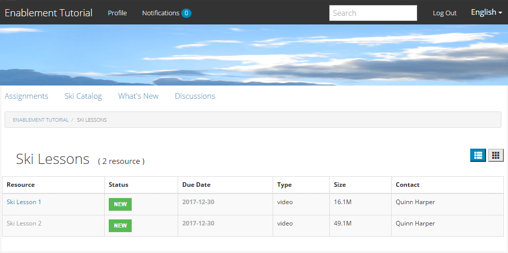
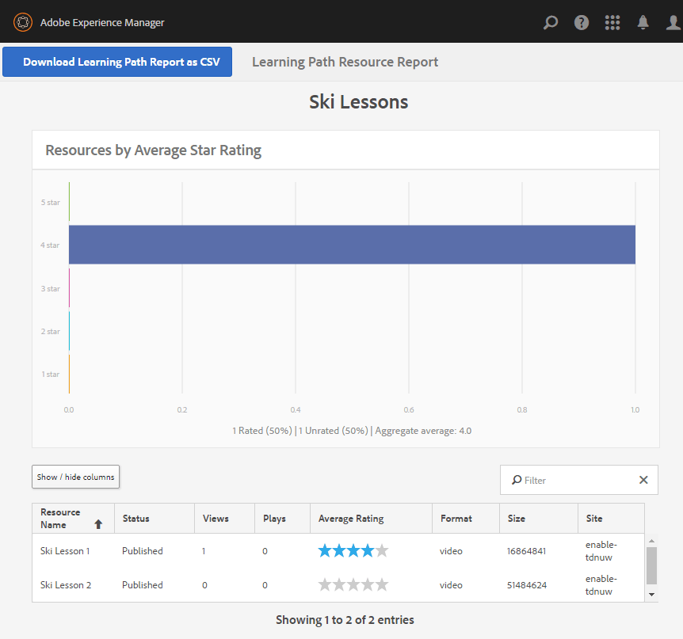

# Erleben Sie die veröffentlichte Site {#experience-the-published-site}

**[⇐ Erstellen und Zuweisen von Aktivierungsressourcen](resource.md)**

## Neue Site bei der Veröffentlichung suchen {#browse-to-new-site-on-publish}

Nachdem die neu erstellte Community-Site und ihre Aktivierungsressourcen und der Lernpfad veröffentlicht wurden, ist es möglich, die Seite &quot;Aktivierungsübungen&quot;zu erleben.

Beginnen Sie damit, zu der URL zu navigieren, die beim Erstellen der Site angezeigt wird, jedoch auf dem Veröffentlichungsserver, z.

* Autor-URL = [http://localhost:4502/content/sites/enable/en.html](http://localhost:4502/content/sites/enable/en.html)
* Veröffentlichungs-URL = [http://localhost:4503/content/sites/enable/en.html](http://localhost:4503/content/sites/enable/en.html)

Wenn die [Standard-Startseite festgelegt](enablement-create-site.md#changethedefaulthomepage)wurde, sollte die Site einfach zu [http://localhost:4503/](http://localhost:4503/) navigieren.

Bei der ersten Ankunft auf der veröffentlichten Site wäre der Site-Besucher normalerweise nicht bereits angemeldet und anonym.

**http://localhost:4503/content/sites/enable/en.html**

## Anonymer Site-Besucher {#anonymous-site-visitor}

Ein anonymer Site-Besucher wird sofort mit der Anmeldeseite für diese private Community-Site zur Aktivierung angezeigt. Beachten Sie, dass es keine Möglichkeit gibt, sich bei Facebook oder Twitter selbst zu registrieren oder sich anzumelden.

Beachten Sie, dass diese Startseite vier Menüelemente enthält: `Assignments, Ski Catalog, What's New` und `Discussions`, jedoch kann keine erreicht werden, ohne sich anzumelden.

>[!NOTE]
>
>Es ist möglich, anonymen Zugriff auf eine Aktivierungs-Site zu gewähren, ohne dass Site-Besucher sich selbst registrieren können.
>
>Wenn eine Aktivierungsressource auf `show in catalog` `allow anonymous access`und festgelegt ist, können anonyme Site-Besucher Ansichten im Katalog ausführen.

### Anonymen Zugriff auf JCR verhindern {#prevent-anonymous-access-on-jcr}

Durch eine bekannte Einschränkung wird der Inhalt der Community-Site anonymen Besuchern durch jcr-Inhalte und json zugänglich gemacht, obwohl der anonyme Zugriff **[!UICONTROL für den Site-Inhalt deaktiviert]** ist. Dieses Verhalten kann jedoch mithilfe von Sling-Beschränkungen als Behelfslösung gesteuert werden.

Gehen Sie wie folgt vor, um den Inhalt Ihrer Community-Site vor dem Zugriff durch anonyme Benutzer durch jcr-Inhalte und json zu schützen:

1. Wechseln Sie in AEM Autoreninstanz zu https://&lt;Host>:&lt;Port>/editor.html/content/site/.html.

   >[!NOTE]
   >
   >Gehen Sie nicht zur lokalisierten Site.

1. Gehen Sie zu **[!UICONTROL Seiteneigenschaften]**.

   

1. Navigieren Sie zur Registerkarte **[!UICONTROL Erweitert]**.
1. Enable **[!UICONTROL Authentication Requirement]**.

   

1. hinzufügen den Pfad der Anmeldeseite. Beispiel: `/content/......./GetStarted`.
1. Veröffentlichen Sie die Seite.

## Eingeschriebenes Mitglied {#enrolled-member}

Diese Erfahrung beruht darauf, dass Benutzer `Riley Taylor` und `Sidney Croft` durch ihre Mitgliedschaft in der [Community Ski Class](enablement-setup.md#publishcreateenablementmembers) -Gruppe [erstellt](resource.md#settings) und dem *Ski Lektionen* -Lernpfad *zugewiesen* werden.

Anmelden mit

* `Username: riley`
* `Password: password`

Wenn das Profil nicht durch Selbstregistrierung erstellt wurde, wird bei der ersten Anmeldung eines Mitglieds dessen Profil angezeigt, sodass es überprüft und ggf. geändert werden kann.

Wenn sich das Mitglied das nächste Mal anmeldet, wird die durch das erste Menüelement identifizierte Startseite angezeigt.

### Zuweisungen {#assignments}

Auf der Seite &quot;Zuweisungen&quot;werden dem Mitglied alle Lernpfade und Aktivierungsressourcen angezeigt, die ihm speziell zugewiesen wurden.

Jede Zuweisung bietet grundlegende Informationen zu:

* Der Typ der Zuweisung
* Ob es sich um eine neue Zuweisung handelt
* Der Name
* Für die Art der Zuweisung relevante Details
* Aufgabenkontakt, Experte und Autor (falls vorhanden)

Der Zuweisungstyp wird durch ein Symbol in der oberen linken Ecke der Karte angezeigt. Das Bild einer Straße ist für einen Lernpfad mit der Anzahl der enthaltenen Aktivierungsressourcen gedacht.

Wenn Sie *Skiunterricht* auswählen, werden die beiden Aktivierungsressourcen angezeigt, auf die der Lernpfad verweist.

Wenn Sie *Skiunterricht 1* auswählen, wird die Seite mit den Details zur Aktivierung der Ressource geöffnet.

Auf der Seite &quot;Details&quot;kann das Mitglied lernen, die Lektion [bewerten](rating.md) und [Kommentare](comments.md)hinzufügen. Jede Aktivität eines Mitglieds wird im Abschnitt Neue Funktionen der Site angezeigt.

Interaktionen mit der Aktivierungsressource werden im Berichtsabschnitt vermerkt, auf den in der Autorendatei zugegriffen werden kann.

### Skikatalog {#ski-catalog}

Die Seite &quot;Skizze&quot;enthält den Katalog der Aktivierungsressourcen, die mit Tags des `Tutorial` Namensraums versehen sind. Die beiden *Ski-Lektionen* -Ressourcen sind mit dem `Skiing` Tag versehen, sodass, wenn keine anderen Tags ausgewählt `All` oder `Tutorial: Sports / Skiing` ausgewählt sind, nichts angezeigt wird.

Wenn einem Mitglied weder direkt noch über einen Lernpfad Ressourcen für die Aktivierung zugewiesen wurden, ist es möglich, mit den in einem Katalog befindlichen Ressourcen für die Aktivierung zu interagieren und Feedback über Kommentare und Bewertungen bereitzustellen.

### Diskussionen {#discussions}

Neben der Bewertung und dem Kommentar zu ([wenn aktiviert](enablement-create-site.md#step33asettings)) Aktivierungsressourcen enthält die Community-Site-Vorlage, aus der `Enablement Tutorial` erstellt wurde, die [Forumsfunktion](functions.md#forum-function) (Titel ist `Discussions)`).

Wählen Sie den `Discussions`Link aus und veröffentlichen Sie ein Thema.

Melden Sie sich ab und melden Sie sich als Sidney Croft (Sidney / Passwort) an und beantworten Sie die Frage sowie Folgen Sie dem Thema.

Beachten Sie, dass es neben der Inline-Moderation Optionen gibt, das Thema in sozialen Medien freizugeben oder das Thema per E-Mail zu versenden.

### Neue Funktionen {#what-s-new}

Der `What's New` Menüpunkt ist der Titel der [Aktivität-Stream-Funktion](functions.md#activity-stream-function) in der Struktur dieser Community-Site.

Wählen Sie den `What's New` Link noch als Sidney angemeldet, um die Aktivität anzuzeigen.

## Vertrauenswürdiger Community-Mitglied {#trusted-community-member}

Dieses Erlebnis setzt voraus, dass die Rollen des ` [Quinn Harper](enablement-setup.md#publishcreateenablementmembers)` Moderators [und des](enablement-create-site.md#moderation) Ressourcenkontakts zugewiesen wurden.

Anmelden mit

* `Username: quinn`
* `Password: password`

Nach der Anmeldung wird ein neuer Menüpunkt angezeigt, `Administration`der angezeigt wird, weil dem Mitglied die Rolle des Moderators zugewiesen wurde.

Die Startseite wird durch den ersten Menüpunkt Zuweisungen gekennzeichnet. Quinn ist der Ansprechpartner für Moderator- und Aktivierungsressourcen und wurde nicht in Aktivierungsressourcen oder Lernpfaden eingeschrieben. Es ist daher nichts anzuzeigen.

### Administration {#administration}

Was es gibt, ist Aktivität durch die beiden Lernenden, `Riley Taylor` und `Sidney Croft`. Durch Auswahl des `Administration` Links für den Zugriff auf die Moderationskonsole kann Quinn die [Massenmoderationskonsole](moderation.md) verwenden, um ihre Beiträge zu moderieren.

Wenn Sie das Symbol für das Seitenbedienfeld auswählen, werden die Filter geöffnet, die zum Durchsuchen von Community-Inhalten verwendet werden.

Wenn Sie den Mauszeiger über eine Kommentarkarte bewegen, werden Moderationsaktionen angezeigt.

## Berichte zum Autor {#reports-on-author}

Es gibt zwei Möglichkeiten, auf Berichte für Lernende zuzugreifen und Ressourcen zu aktivieren.

Navigieren Sie beim Autor zur **Communities, zur[Ressourcenkonsole](resources.md)**, in der die Aktivierungsressourcen verwaltet werden, und nach Auswahl einer Community-Site können Sie Berichte für

* Alle Aktivierungsressourcen und Lernpfade
* Eine spezifische Aktivierungsressource oder ein Lernpfad

Navigieren Sie zur **Communities-,[Reports-Konsole](reports.md)** und generieren Sie Berichte wie folgt:

* Zuweisung zu aktivierenden Ressourcen und Lernpfaden
* Beiträge zu einer Community-Site über einen bestimmten Zeitraum
* Ansichten (Site-Besuche) einer Community-Site über einen bestimmten Zeitraum

* Beiträge und Ansichten können für alle Inhalte oder für bestimmte Inhalte verwendet werden:

   * Forum
   * Forumthema
   * Frage und Antwort
   * Frage
   * Blog
   * Blog-Artikel
   * Kalender
   * Kalenderereignis

### Ressourcenkonsole {#resources-console}

Mit ein wenig Aktivität und Interaktion mit den Ressourcen bei der Veröffentlichung lohnt es sich, die Berichte zum Autor anzuzeigen.

* Melden Sie sich beim Autor mit Administratorrechten an.
* Navigieren Sie vom Hauptmenü zu **[!UICONTROL Communities]** > **[!UICONTROL Resources]**.
* Wählen Sie die `Enablement Tutorial` Site aus.
* Klicken Sie auf das `Report` Symbol für eine Zusammenfassung aller Ressourcen.
* Wählen Sie eine Ressource und dann das `Report` Symbol für einen Bericht in dieser Ressource aus.

Beachten Sie, dass es wahrscheinlich zu früh ist, Daten aus Adobe Analytics anzuzeigen, die bis zu 12 Stunden dauern können. Es ist jedoch bereits ein einfacher SCORM-Berichte verfügbar.

#### Bericht über die Ressourcen für Skifahrten {#ski-lessons-resource-report}

#### Bericht &quot;Skilehrer&quot; {#ski-lessons-user-report}

* Wählen Sie **[!UICONTROL Communities > Ressourcen]**

* Karte öffnen `Enablement Tutorial`
* Karte öffnen `Ski Lessons`
* Wählen Sie nun eine der folgenden Optionen aus `Report > User Report`

### Berichte-Konsole {#reports-console}

Die Konsole &quot;Berichte&quot;ermöglicht die Erstellung von Berichten über

* **Zuweisungen** für eine beliebige Community-Site für eine Aktivierung
* **Ansichten** für jede Community-Site
* **Beiträge** für jede Community-Site

Für Zuweisungsberichte:

* Melden Sie sich beim Autor mit Administratorrechten an.
* Navigieren Sie zu **[!UICONTROL Communities]** > **[!UICONTROL Berichte]** > **[!UICONTROL Zuweisungsbericht]**.
* Wählen Sie eine **[!UICONTROL Site]** aus dem Pulldown-Menü aus (wählen Sie `Enablement Tutorial`).

* Gruppe **[!UICONTROL auswählen]** (auswählen `Community Ski Class`)

* Wählen Sie eine **[!UICONTROL Zuweisung]** aus (wählen Sie `Ski Lessons`)

* Wählen Sie **[!UICONTROL Generieren]**

Für Berichte zu Ansichten:

* Melden Sie sich beim Autor mit Administratorrechten an.
* Navigieren Sie zu **[!UICONTROL Communities]** > **[!UICONTROL Berichte]** > **[!UICONTROL Ansichten-Bericht]**.
* Wählen Sie eine **Site** aus dem Pulldown-Menü aus (wählen Sie `Enablement Tutorial`).

* Wählen Sie **[!UICONTROL Inhaltstyp]** (wählen Sie `all`).

* Wählen Sie einen **[!UICONTROL Datumsbereich]** aus (wählen Sie `Last 7 days`).

* Wählen Sie **[!UICONTROL Generieren]**.

**[⇐ Erstellen und Zuweisen von Aktivierungsressourcen](resource.md)**
