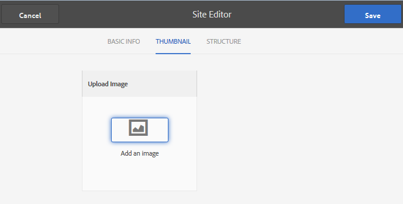

# Leader-Funktion {#leaderboard-feature}

## Einführung {#introduction}

Die `Leaderboard` Komponente bietet die Möglichkeit, einen Eindruck davon zu erhalten, wie Mitglieder innerhalb der Gemeinschaft interagieren, indem sie Mitglieder nach Punkten (Basis-Scoring) oder ihrem Fachwissen (Advanced Scoring) einstufen.

Bevor Sie die Komponente &quot;Lederboard&quot;auf eine Seite einfügen, müssen Sie die Bewertung und Abzeichen der [Communities konfigurieren](/help/communities/implementing-scoring.md).

In diesem Abschnitt der Dokumentation wird Folgendes beschrieben:

* Hinzufügen der `Leaderboard` Komponente zu einer [Community-Site](/help/communities/overview.md#community-sites)
* Configuration settings for the `Leaderboard` component

### Adding a Leaderboard to a Page {#adding-a-leaderboard-to-a-page}

To add a `Leaderboard` component to a page in author mode, locate the component

* `Communities / Leaderboard`

und ziehen Sie die Komponente an die gewünschte Stelle auf der Seite.

For necessary information, visit [Communities Components Basics](/help/communities/basics.md).

Bei der ursprünglichen Platzierung auf einer Community-Site wird die Komponente wie folgt angezeigt:

### Leaderboard konfigurieren {#configuring-leaderboard}

Select the placed `Leaderboard` component to access and select the `Configure` icon which opens the edit dialog.

 

#### Registerkarte „Settings“{#settings-tab}

Geben Sie auf der Registerkarte &quot; **Einstellungen** &quot;an, welche Informationen zum Mitglied angezeigt werden sollen:

* **Anzeigename**

   Ein beschreibender Name, der für die Pinnwand angezeigt werden soll und die Regeln zum Anzeigen von Abzeichen und Ergebnissen widerspiegelt.
Der Standardwert ist `Leaderboard`, wenn nichts eingegeben wurde.

* **Abzeichen**

   Wenn diese Option aktiviert ist, wird eine Spalte für Symbole mit Zeichen in die Lederboard aufgenommen.
Diese Option ist standardmäßig deaktiviert.

* **Abzeichenname**

   Wenn diese Option aktiviert ist, wird eine Spalte für den Namen des Kennzeichens in die Lederboard aufgenommen.
Diese Option ist standardmäßig deaktiviert.

* **Avatar verwenden**

   Wenn diese Option aktiviert ist, wird das Avatarbild des Mitglieds neben dem Namen des Mitglieds mit dem Profil des Mitglieds verknüpft.
Diese Option ist standardmäßig deaktiviert.

#### Registerkarte &quot;Regeln&quot; {#rules-tab}

Auf der Registerkarte &quot; **Regeln** &quot;finden Sie die Community-Site und die zugehörigen Scoring- und Badging-Regeln.

* **Speicherort für Regel**

   (Erforderlich) Speicherort, an dem die Regel für Bewertung/Abzeichen konfiguriert ist.

* **Bewertungsregel**

   (Erforderlich) Spezifische Regel, die die anzuzeigenden Werte generiert.

* **Abzeichenregel**

   (Erforderlich) Spezifische Regel, die das anzuzeigende Zeichen generiert.

* **Anzeigelimit**

   Anzahl der Mitglieder, die pro Seite angezeigt werden sollen. Der Standardwert ist 10.

### Beispiel: Hauptplatine der Teilnehmer {#example-participants-leaderboard}

Dieser Bericht des Lederboards beruht auf der Anwendung grundlegender Bewertungsregeln.

Konfiguration der Leaderboard-Komponenten:

* Registerkarte &quot;Einstellungen&quot;:

   * Anzeigename = `Participation Board`
   * `checked`:

      * Abzeichen
      * Abzeichenname
      * Avatar verwenden

* Registerkarte Regeln:

   * Speicherort für Regel = `/content/sites/<site name>/jcr:content`
   * Bewertungsregel = `/libs/settings/community/scoring/rules/forums-scoring`
   * Abzeichenregel = `/libs/settings/community/badging/rules//reference-badging`
   * Anzeigelimit = `10`

### Beispiel: Expert Leaderboard {#example-experts-leaderboard}

Dieser Bericht des Lederboards ist das Ergebnis der Anwendung erweiterter Bewertungsregeln.

Konfiguration der Leaderboard-Komponenten:

* Registerkarte &quot;Einstellungen&quot;:

   * Anzeigename = `Expertise Board`
   * `checked`:

      * Abzeichen
      * Avatar verwenden

* Registerkarte Regeln:

   * Speicherort für Regel = `/content/sites/<site name>/jcr:content`
   * Bewertungsregel = `/libs/settings/community/scoring/rules/adv-forums-scoring`
   * Abzeichenregel = `/libs/settings/community/badging/rules/adv-forums-badging`
   * Anzeigelimit = `10`

### Zusätzliche Informationen {#additional-information}

More information may be found on the [Leaderboard Essentials](/help/communities/leaderboard.md) page for developers.

Anweisungen zum Erstellen von Regeln finden Sie auf der Seite &quot;Bewertung [und Abzeichen](/help/communities/implementing-scoring.md) für Administratoren&quot;.
