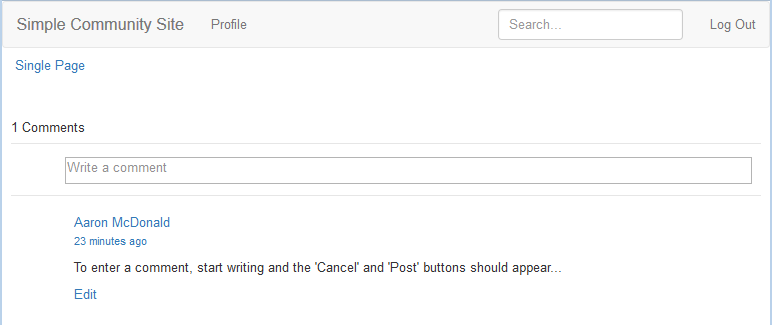

# Erscheinungsbild ändern (HBS) {#alter-the-appearance-hbs}

Nachdem die Komponenten für das benutzerdefinierte Kommentarsystem im Anwendungsverzeichnis (/apps) vorhanden sind, wobei ein resourceSuperType auf das standardmäßige Kommentarsystem verweist und das benutzerdefinierte Modell/die benutzerdefinierte Ansicht registriert ist, können Sie die Implementierung ändern.

Für eine einfache Demonstration, eine visuelle Funktion, wird der Avatar des angemeldeten Benutzers entfernt, der einen Kommentar veröffentlicht.

>[!NOTE]
>
>Um die Erweiterung zu verwenden, muss die Instanz des Kommentar-Systems auf einer Website, auf die sich die Auswirkungen auswirken sollen (/content), seinen resourceType als benutzerdefiniertes Kommentarsystem festlegen.

## HBS-Skripte ändern {#modify-the-hbs-scripts}

Verwenden [CRXDE Lite](/help/sites-developing/developing-with-crxde-lite.md):

* Öffnen [/apps/custom/components/comments/comment/**comment.hbs**](https://localhost:4502/crx/de/index.jsp#/apps/custom/components/comments/comment/comment.hbs)

   * Kommentieren Sie das Tag aus, das den Avatar für einen Kommentar-Beitrag enthält (~ Zeile 21):

      ```
        <!--
         <</img>
         -->
      ```

* Öffnen [/apps/custom/components/comments/**comments.hbs**](https://localhost:4502/crx/de/index.jsp#/apps/custom/components/comments/comments.hbs)

   * Kommentieren Sie das Tag aus, das den Avatar für den nächsten Kommentar-Eintrag enthält (~ Zeile 44):

      ```
        <!--
         </img>
         -->
      ```

* Wählen Sie **Alle speichern** aus

### Benutzerdefinierte App replizieren {#replicate-custom-app}

Nachdem die Anwendung geändert wurde, muss die benutzerdefinierte Komponente erneut repliziert werden.

Eine Möglichkeit hierfür ist:

* Im Hauptmenü

   * Auswählen **[!UICONTROL Instrumente]** > **[!UICONTROL Aktivitäten]** > **[!UICONTROL Replikation]**.
   * Auswählen **[!UICONTROL Baum aktivieren]**.
   * Setzen Sie `Start Path` auf `/apps/custom`.
   * Auswahl aufheben **[!UICONTROL Nur geändert]**.
   * Auswählen **[!UICONTROL Aktivieren]** Schaltfläche.

### Anzeigen geänderter Kommentare auf der veröffentlichten Beispielseite {#view-modified-comment-on-published-sample-page}

[Fortführen des Erlebnisses](/help/communities/extend-sample-page.md#publish-sample-page) In der Veröffentlichungsinstanz, die noch als derselbe Benutzer angemeldet ist, ist es jetzt möglich, die Seite in der Veröffentlichungsumgebung zu aktualisieren, um die Änderung zum Entfernen des Avatars anzuzeigen:



### Beispielpaket für Kommentar-Erweiterung {#sample-comment-extension-package}

Angehängt ist ein Paket der benutzerdefinierten Kommentaranwendung, die in diesem Tutorial erstellt wurde.

[Datei herunterladen](assets/sample-comment-extension-6-1-fp3.zip)
