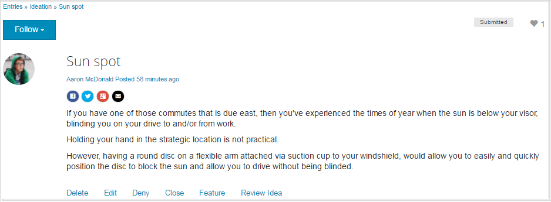

# Funktionen für spezielle Inhalte {#featured-content-feature}

## Einführung {#introduction}

Die Funktion für speziellen Inhalt bietet einen Bereich für angemeldete Site-Besucher (Community-Mitglieder) in der Veröffentlichungsumgebung, in dem Inhalte für

* [Blogs](blog-feature.md)
* [Kalender](calendar.md)
* [Foren](forum.md)
* [Ideen](ideation-feature.md)
* [Frage und Antwort](working-with-qna.md)

Sobald der Inhalt als &quot;hervorgehoben&quot;gekennzeichnet ist, wird er in dieser Komponente aufgelistet, die auf bestimmten Einstiegsseiten oder in bestimmten Bereichen platziert werden kann, die die Aufmerksamkeit der Community-Mitglieder leicht erfassen.

Die Funktion zum Feature von Inhalten kann pro Komponente zugelassen oder deaktiviert werden.

In diesem Abschnitt der Dokumentation wird Folgendes beschrieben:

* Hinzufügen von speziellen Inhalten zu einer Community-Site
* Configuration settings for the `Featured Content`component

## Hinzufügen von speziellen Inhalten zu einer Seite {#adding-featured-content-to-a-page}

To add a `Featured Content` component to a page in author mode, use the component browser to locate

* `Communities / Featured Content`

und ziehen Sie es auf eine Seite, auf der der spezielle Inhalt angezeigt werden soll.

For necessary information, visit [Communities Components Basics](basics.md).

When the [required client-side libraries](essentials-featured.md#essentials-for-client-side) are included, this is how the `Featured Content`component will appear:

## Konfigurieren von speziellen Inhalten {#configuring-featured-content}

Select the placed `Featured Content` component to access and select the `Configure` icon which opens the edit dialog.

 

### Registerkarte „Settings“{#settings-tab}

Identifizieren Sie auf der Registerkarte &quot; **[!UICONTROL Einstellungen]** &quot;den zu verwendenden Inhalt:

* **[!UICONTROL Anzeigename]** Der Titel für die Liste der speziellen Inhalte. For example `Featured Questions` or `Featured Ideas`. Die Standardeinstellung ist `Featured Content` bei leerem Feld.

* **[!UICONTROL Position des präsentierten Inhalts]**
   *(Erforderlich)* Navigieren Sie zu der Seite, die den Inhalt enthält, der möglicherweise Funktion ist (Komponenten dieser Seite müssen so konfiguriert sein, dass spezielle Inhalte zulässig sind). Beispiel: `/content/sites/engage/en/forum`

* **[!UICONTROL Anzeigebeschränkung]** Die maximale Anzahl anzuzeigender spezieller Inhalte. Der Standardwert ist 5.

## Site-Besuchererlebnis {#site-visitor-experience}

Die Möglichkeit, Inhalte als speziellen Inhalt zu kennzeichnen, erfordert Moderatorenrechte.

Wenn ein Moderator gepostete Inhalte anzeigt, hat er Zugriff auf die kontextbezogenen Moderations-Flags, die das neue `Feature` Flag enthalten.

Wenn das Flag als Funktion markiert wurde, wird es `Unfeature`zu dem Modeartions-Flag.

Die Seite, die die `Featured Content` Komponente enthält, enthält jetzt diesen Beitrag.

`Read More` ist ein Link zum eigentlichen Beitrag.

## Zusätzliche Informationen {#additional-information}

More information may be found on the [Featured Content](essentials-featured.md) page for developers.

Informationen zum Anzeigen von Inhalten mit den Funktionen finden Sie unter [Moderieren benutzergenerierter Inhalte](moderate-ugc.md).
