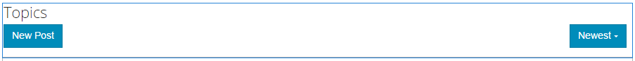

# Funktion „Forum“{#forum-feature}

## Einführung {#introduction}

Die Forumsfunktion bietet einen Bereich, in dem angemeldete Besucher (Community-Mitglieder) in der Veröffentlichungsumgebung Folgendes tun können:

* Erstellen neuer Themen
* Themen anzeigen und beantworten
* Thema folgen
* Forum durchsuchen
* Moderieren von Forumsinhalten
* Verschieben von Forumthemen von einer Seite auf eine andere

In diesem Abschnitt der Dokumentation wird Folgendes beschrieben:

* Hinzufügen der Forumsfunktion zu einer AEM Site.
* Konfigurationseinstellungen für die Komponente `Forum` .

### Hinzufügen eines Forums zu einer Seite {#adding-a-forum-to-a-page}

Um eine Komponente `Forum` im Autorenmodus zu einer Seite hinzuzufügen, suchen Sie mit dem Komponenten-Browser nach

* `Communities / Forum`

und ziehen Sie die Komponente an die gewünschte Stelle auf der Seite, auf der das Forum angezeigt werden soll.

Die erforderlichen Informationen finden Sie unter [Grundlagen der Communities-Komponenten](/help/communities/basics.md).

Wenn die [erforderlichen clientseitigen Bibliotheken](/help/communities/essentials-forum.md#essentials-for-client-side) eingeschlossen sind, wird die Komponente `Forum` so angezeigt:

### Konfigurieren eines Forums {#configuring-a-forum}

Wählen Sie die platzierte Komponente `Forum` aus, um auf das Symbol `Configure` zuzugreifen, mit dem das Bearbeitungsdialogfeld geöffnet wird.

#### Registerkarte „Settings“{#settings-tab}

Legen Sie auf der Registerkarte **Einstellungen** die Einstellungen für Themen und Antworten fest:

* **Anhangminiatur zulassen**

   Wenn diese Option aktiviert ist, wird eine Miniaturansicht des angehängten Bildes erstellt.

* **Max. Anhangminiaturgröße**

   Maximale Größe (in Pixel) des Miniaturbilds des Anhangs. Der Standardwert ist 800 x 800.

* **Mindestbildgröße für Miniaturansichten**
* **Max. Miniaturgröße**

   Maximale Größe (in Pixel) des Miniaturbilds für Inline-Bilder. Der Standardwert ist 800 x 800.

* **Themen pro Seite**

   Legt fest, wie viele Themen/Posts pro Seite angezeigt werden. Der Standardwert ist 10.

* **Moderiert**

   Wenn diese Option aktiviert ist, muss das Posten von Themen und Kommentaren genehmigt werden, bevor sie auf einer Veröffentlichungs-Site erscheinen. Diese Option ist standardmäßig deaktiviert.

* **Geschlossen**

   Wenn diese Option aktiviert ist, können im Forum keine neuen Themen und Kommentare erstellt werden. Diese Option ist standardmäßig deaktiviert.

* **Rich-Text-Editor**

   Wenn diese Option aktiviert ist, können Themen und Kommentare mit Markup eingegeben werden. Diese Option ist standardmäßig deaktiviert.

* **Tagging zulassen**

   Wenn diese Option aktiviert ist, können Mitglieder ihrem Beitrag Tag-Beschriftungen hinzufügen (siehe Registerkarte **Tag-Feld** ). Diese Option ist standardmäßig deaktiviert.

* **Datei-Uploads zulassen**

   Wenn diese Option aktiviert ist, können dem Thema oder Kommentar Dateianlagen hinzugefügt werden. Diese Option ist standardmäßig deaktiviert.

* **Folgende zulassen**

   Wenn diese Option aktiviert ist, fügen Sie die folgende Funktion für Forumsbeiträge hinzu, mit der Mitglieder [benachrichtigt](/help/communities/notifications.md) über neue Beiträge werden können. Diese Option ist standardmäßig deaktiviert.

* **Fixierung zulassen**

   Wenn diese Option aktiviert ist, können Forumsthemen an den Anfang der Themenliste gesetzt werden. Diese Option ist standardmäßig deaktiviert.

* **Feature-Inhalt zulassen**

   Wenn diese Option aktiviert ist, kann die Idee als [Inhalt mit Funktionen](/help/communities/featured.md) identifiziert werden. Diese Option ist standardmäßig deaktiviert.

* **E-Mail-Abonnements zulassen**

   Wenn diese Option aktiviert ist, können Mitglieder per E-Mail über neue Beiträge benachrichtigt werden ([subscription](/help/communities/subscriptions.md)). Erfordert die Überprüfung von `Allow Following` und die Konfiguration von [E-Mail](/help/communities/email.md). Diese Option ist standardmäßig deaktiviert.

* **Max. Dateigröße**

   Nur relevant, wenn `Allow File Uploads` aktiviert ist. Mit diesem Feld lässt sich die Größe (in Byte) der hochgeladenen Dateien beschränken. Der Standardwert ist 104857600 (10 MB).

* **Zulässige Dateitypen**

   Nur relevant, wenn `Allow File Uploads` aktiviert ist. Eine kommagetrennte Liste der zulässigen Dateierweiterungen inklusive Punkt. Beispiel: .jpg, .jpeg., png, .doc, .docx, .pdf. Wurden Dateitypen festgelegt, können Dateien nicht angegebenen Typs nicht hochgeladen werden. Die Standardeinstellung ist nicht so festgelegt, dass alle Dateitypen zulässig sind.

* **Maximale Größe der Bilddatei anhängenNur relevant, wenn**
die Option &quot;Datei-Uploads zulassen&quot;aktiviert ist. Die maximal zulässige Anzahl von Bytes einer Bilddatei. Der Standardwert ist 2097152 (2 MB).

* **Antworten mit Diskussionsfaden zulassen**

   Wenn diese Option aktiviert ist, erlauben Sie Antworten auf Kommentare, die zum Thema gepostet wurden. Diese Option ist standardmäßig deaktiviert.

* **Abstimmung zulassen**

   Wenn diese Option aktiviert ist, fügen Sie die Abstimmungsfunktion in ein Thema ein. Diese Option ist standardmäßig deaktiviert.

* **Benutzern das Löschen von Anmerkungen und Themen ermöglichen**

   Wenn diese Option aktiviert ist, können Mitglieder die von ihnen veröffentlichten Kommentare und Themen löschen. Diese Option ist standardmäßig deaktiviert.

* **Breadcrumbs anzeigen**

   Wenn diese Option aktiviert ist, zeigen Sie Navigations-Breadcrumbs auf Themenseiten an. Diese Option ist standardmäßig aktiviert.

* **Abzeichen anzeigen**

   Wenn diese Option aktiviert ist, zeigen Sie verdiente und zugewiesene [Badges](/help/communities/implementing-scoring.md) mit dem Blogeintrag eines Mitglieds an. Diese Option ist standardmäßig deaktiviert.

* **Privilegierte Mitglieder zulassen**

   Wenn diese Option aktiviert ist, dürfen nur privilegierte Mitglieder Inhalte erstellen.

* **Zugelassene privilegierte Mitglieder**

   Fügen Sie die berechtigten Mitglieder hinzu, die Inhalte erstellen dürfen.

* **Benutzergenerierte Inhalte im Autoren-Bearbeitungsmodus blockieren**

   Wenn diese Option aktiviert ist, wird benutzergenerierter Inhalt bei der Bearbeitung im Autorenmodus blockiert.

* **Erwähnung aktivieren**

   Wenn diese Option aktiviert ist, können registrierte Community-Benutzer andere registrierte Mitglieder (unter Verwendung von Vorname, Nachname, Benutzername) identifizieren und sie mit der gemeinsamen Syntax @user-name versehen. Die getaggten Benutzer erhalten Benachrichtigungen über ihre Erwähnungen.

* **Max. Erwähnungen**

   Schränken Sie die maximale Anzahl der Erwähnungen ein, die in einem Beitrag zulässig sind. Der Standardwert ist 10.

* **UI-Erwähnungsmuster**

   Geben Sie die zulässige Musterzeichenfolge an, um den registrierten Benutzer in einem Beitrag mit Tags zu versehen (@mention). Beispiel `~{{familyName}}{{givenName}}`.

>[!NOTE]
>
>Es kann erforderlich sein, sowohl `AllowThreaded Replies` als auch `Allow users to Delete Comments and Topics` zu überprüfen, um Kommentare zu einem Thema zu aktivieren.

#### Registerkarte Benutzermoderation {#user-moderation-tab}

Geben Sie auf der Registerkarte **Benutzermoderation** an, wie die veröffentlichten Themen und Antworten (benutzergenerierte Inhalte) verwaltet werden. Weitere Informationen finden Sie unter [Moderation benutzergenerierter Inhalte](/help/communities/moderate-ugc.md).

* **Posts ablehnen**

   Wenn diese Option aktiviert ist, können Moderatoren vertrauenswürdiger Mitglieder Beiträge ablehnen und verhindern, dass der Beitrag im öffentlichen Forum erscheint. Diese Option ist standardmäßig deaktiviert.

* **Themen schließen/erneut öffnen**

   Wenn diese Option aktiviert ist, können Moderatoren von vertrauenswürdigen Mitgliedern ein Thema schließen, um weitere Bearbeitungen und Kommentare vorzunehmen, und ein Thema möglicherweise erneut öffnen. Diese Option ist standardmäßig deaktiviert.

* **Themen verschieben**

   Wenn diese Option aktiviert ist, lassen Sie zu, dass Moderatoren auf Veröffentlichungsseite Themen verschieben. Diese Option ist standardmäßig aktiviert.

* **Posts kennzeichnen**

   Wenn diese Option aktiviert ist, können Mitglieder Themen oder Kommentare anderer Mitglieder als unangemessen kennzeichnen. Diese Option ist standardmäßig deaktiviert.

* **Liste mit Kenn-zeichnungsgründen**

   Wenn diese Option aktiviert ist, können Mitglieder aus einer Dropdown-Liste den Grund auswählen, aus dem Themen oder Kommentare als unangemessen gekennzeichnet werden. Diese Option ist standardmäßig deaktiviert.

* **Grund für benutzerdefinierte Kennzeichnung**

   Wenn diese Option aktiviert ist, können Mitglieder einen eigenen Grund für die Kennzeichnung eines Themas oder Kommentars als unangemessen eingeben. Diese Option ist standardmäßig deaktiviert.

* **Schwellenwert für Moderation**

   Geben Sie an, wie oft ein Thema oder Kommentar von Mitgliedern gekennzeichnet werden muss, bevor Moderatoren benachrichtigt werden. Der Standardwert ist 1 (einmal).

* **Kennzeichnungslimit**

   Geben Sie an, wie oft ein Thema oder Kommentar gekennzeichnet werden muss, bevor er in der öffentlichen Ansicht ausgeblendet wird. Bei einem Wert von -1 wird das gekennzeichnete Thema oder der gekennzeichnete Kommentar nie ausgeblendet. In allen anderen Fällen muss der Wert größer als der oder gleich dem „Schwellenwert für Moderation“ sein. Der Standardwert ist 5.

#### Registerkarte &quot;Tag-Feld&quot;{#tag-field-tab}

Auf der Registerkarte **Tag-Feld** wird eingeschränkt, welche Tags je nach ausgewähltem Namespace (falls auf der Registerkarte **Einstellungen** aktiviert) verwendet werden können.

* **Zulässige Namespaces**

   Relevant, wenn `Allow Tagging` auf der Registerkarte **Einstellungen** aktiviert ist. Die verwendbaren Tags sind auf die ausgewählten Namespace-Kategorien beschränkt. Die Liste der Namespaces umfasst &quot;Standard-Tags&quot;(den Standard-Namespace) sowie &quot;Alle Tags einschließen&quot;. Standardmäßig ist die Option nicht aktiviert, es sind also alle Namespaces zulässig.

* **Empfehlungsgrenze**

   Geben Sie die Anzahl der Tags ein, die als Vorschlag für das Mitglied angezeigt werden sollen, das im Forum veröffentlicht wird. Der Standardwert ist **-**1 (keine Beschränkungen).

#### Registerkarte &quot;Übersetzung&quot;{#translation-tab}

Auf der Registerkarte **Übersetzung** können Sie festlegen, ob bei für die Community-Site aktivierter Übersetzungsoption der gesamte Thread oder nur bestimmte Posts übersetzt werden sollen.

* **Alles übersetzen**

   Wenn diese Option aktiviert ist, wird der Forum-Thread in die bevorzugte Sprache des Benutzers übersetzt. Diese Option ist standardmäßig deaktiviert.

#### Registerkarte &quot;Sortiereinstellungen&quot;{#sort-settings-tab}

Geben Sie auf der Registerkarte **Sortiereinstellungen** an, wie die veröffentlichten Kommentare sortiert werden sollen, wenn sie angezeigt werden.

* **Sortierfolge**

   Aktivieren Sie alle zulässigen Sortierauswahlen : `Newest, Oldest, Last Updated, Most Viewed, Most Active, Most Followed and Most Liked`. Der Standardwert ist `Newest, Oldest, Last Updated`.

* **Als Standard festlegen**

   Ziehen Sie den Mauszeiger nach unten, um eine der aktivierten Sortieroptionen auszuwählen, die als Standard angezeigt werden sollen. Der Standardwert ist `Newest`.

* **Zeitoptionen für Analytics-Sortierung auswählen**

   Ziehen Sie den Mauszeiger nach unten, um eine der folgenden Optionen auszuwählen: `All, Last 24 Hours, Last 7 Days, Last 30 Days`.

   Der Standardwert ist `All`.

### Zusätzliche Informationen {#additional-information}

Weitere Informationen finden Sie auf der Entwickler-Seite [Forumsgrundlagen](/help/communities/essentials-forum.md).

Informationen zur Moderation von veröffentlichten Themen und Kommentaren finden Sie unter [Moderation benutzergenerierter Inhalte](/help/communities/moderate-ugc.md).

Informationen zum Tagging von veröffentlichten Themen und Kommentaren finden Sie unter [Tagging benutzergenerierter Inhalte](/help/communities/tag-ugc.md).

Informationen zur Übersetzung von veröffentlichten Themen und Kommentaren finden Sie unter [Übersetzung benutzergenerierter Inhalte](/help/communities/translate-ugc.md).
