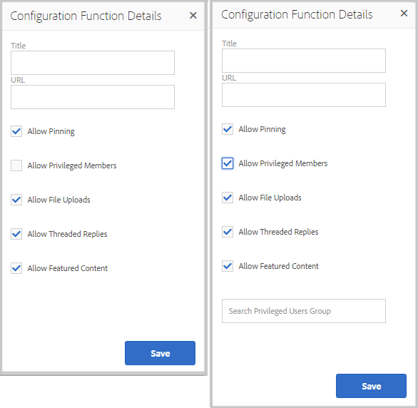

# Community-Funktionen{#community-functions}

Die Art der Funktionen, die von einer Community-Erfahrung erwartet werden, sind bekannt. Community-Funktionen sind als Community-Funktionen verfügbar. Sie sind im Wesentlichen eine oder mehrere Seiten, die vorab verkabelt sind, um eine Community-Funktion zu implementieren, die mehr erfordert, als einfach eine Komponente zu einer Seite im Autorenmodus hinzuzufügen. Sie sind die Bausteine, mit denen die Struktur einer [Community-Site-Vorlage](/help/communities/sites.md) definiert wird, aus der Community-Sites [erstellt werden.](/help/communities/sites-console.md)

Nachdem eine Community-Site erstellt wurde, können den resultierenden Seiten Inhalte mit dem Standard [AEM Authoring-Modus](/help/sites-authoring/editing-content.md) hinzugefügt werden. Verschiedene Community-Funktionen stehen zur Verfügung, wie in der Community-Funktionkonsole zu sehen ist.

>[!NOTE]
>
>Die Konsolen für die Erstellung von [Community-Sites](/help/communities/sites-console.md), [Community-Sitevorlagen](/help/communities/sites.md), [Community-Gruppenvorlagen](/help/communities/tools-groups.md) und [Community-Funktionen](/help/communities/functions.md) sind nur für die Verwendung in der Autoren-Umgebung vorgesehen.

## Community Functions Console {#community-functions-console}

So erreichen Sie die Community-Funktionkonsole in der Authoring-Umgebung:

* Navigieren Sie zu **[!UICONTROL Tools]** > **[!UICONTROL Communities]** > **[!UICONTROL Community-Funktionen]**.

## Vorgefertigte Funktionen {#pre-built-functions}

Im Folgenden werden die mit AEM Communities gelieferten Funktionen kurz beschrieben. Jede Funktion umfasst eine oder mehrere AEM Seiten, die Communities-Komponenten enthalten, die in eine Funktion verdrahtet sind, die leicht in eine [Community-Site-Vorlage](/help/communities/sites.md) integriert werden kann.

Eine Community-Site-Vorlage bietet die Struktur für eine Community-Site, einschließlich Anmeldung, Profile, Benachrichtigungen, Nachrichten, Site-Menü, Suche, Themen und Branding-Funktionen.

### Titel- und URL-Einstellungen {#title-and-url-settings}

**Titel** und  **** URLs sind Eigenschaften, die allen Community-Funktionen gemein sind.

Wenn eine Community-Funktion zu einer Community-Site-Vorlage hinzugefügt oder hinzugefügt wird, wenn [die Struktur einer Community-Site geändert wird, wird der Dialog der Funktion geöffnet, damit Titel und URL konfiguriert werden können.](/help/communities/sites-console.md#modifying-site-properties)

#### Konfiguration der Funktionsdetails {#configuration-function-details}

* **Titel**

   (*Erforderlich*) Der Text, der im Menü der Funktionen für die Site angezeigt wird

* **URL**

   (*Erforderlich*) Der Name, der zum Generieren des URI verwendet wird. Der Name muss den von AEM und JCR festgelegten Benennungskonventionen](/help/sites-developing/naming-conventions.md) entsprechen.[

Verwenden Sie zum Beispiel die Site, die nach dem Tutorial [Erste Schritte](/help/communities/getting-started.md) erstellt wurde, wenn

* Titel = Webseite
* URL = Seite

Dann lautet die URL zur Seite https://localhost:4503/content/sites/engage/en/page.html

und der Menülink für die Seite wie folgt angezeigt wird:

### Aktivitäts-Stream-Funktion {#activity-stream-function}

Die Stream-Funktion der Aktivität ist eine Seite mit der Aktivität [Aktivität Streams component](/help/communities/activities.md), auf der alle Ansichten ausgewählt sind (alle Aktivitäten, Benutzergruppen und folgende). Siehe auch [Aktivität Stream Essentials](/help/communities/essentials-activities.md) für Entwickler.

Wenn eine Vorlage hinzugefügt wird, wird das folgende Dialogfeld geöffnet:

#### Konfiguration der Funktionsdetails {#configuration-function-details-1}

* [Titel- und URL-Einstellungen](#title-and-url-settings)

* **Ansicht „Meine Aktivitäten“ anzeigen**

   Wenn diese Option aktiviert ist, enthält die Seite &quot;Aktivitäten&quot;eine Registerkarte, auf der die Aktivitäten der Filter basieren, die vom aktuellen Mitglied innerhalb der Community generiert wurden. Diese Option ist standardmäßig ausgewählt.

* **Ansicht „Alle Aktivitäten“ anzeigen**

   Wenn diese Option aktiviert ist, enthält die Seite &quot;Aktivitäten&quot;eine Registerkarte mit allen Aktivitäten, die in der Community generiert wurden, auf die das aktuelle Mitglied Zugriff hat. Diese Option ist standardmäßig ausgewählt.

* **Ansicht „News-Feed“ anzeigen**

   Wenn diese Option aktiviert ist, enthalten die Seiten &quot;Aktivitäten&quot;eine Registerkarte, auf der die Aktivitäten der Filter basieren, die vom aktuellen Member ausgeführt werden. Diese Option ist standardmäßig ausgewählt.

### Zuweisungsfunktion {#assignments-function}

Die Zuweisungsfunktion ist die grundlegende Funktion, die eine [Community-Site für die Aktivierung](/help/communities/overview.md#enablement-community) definiert. Es ermöglicht die Zuweisung von Ressourcen zur Aktivierung an Community-Mitglieder. Siehe auch [Zuweisungsgrundlagen](/help/communities/essentials-assignments.md) für Entwickler.

Diese Funktion ist als Funktion des [Aktivieren-Add-ons](/help/communities/enablement.md) verfügbar. Für das Aktivieren-Add-on sind zusätzliche Lizenzen für die Verwendung in einer Produktions-Umgebung erforderlich.

Wenn eine Vorlage hinzugefügt wird, ist die einzige Konfiguration für die Einstellungen [Titel und URL](#title-and-url-settings).

### Blogfunktion {#blog-function}

Die Blog-Funktion ist eine Seite mit einer [Blog-Komponente](/help/communities/blog-feature.md), die für Tagging, Datei-Uploads konfiguriert ist, der folgenden folgt, Mitglieder zur Selbstbearbeitung, Abstimmung und Moderation. Siehe auch [Blog Essentials](/help/communities/blog-developer-basics.md) für Entwickler.

Wenn eine Vorlage hinzugefügt wird, wird das folgende Dialogfeld geöffnet:

* [Titel- und URL-Einstellungen](#title-and-url-settings)

* **Privilegierte Mitglieder zulassen**

   Wenn diese Option aktiviert ist, erlaubt der Blog es privilegierten Mitgliedern nur, Artikel zu erstellen, indem die Auswahl einer [privilegierten Mitgliedergruppe](/help/communities/users.md#privileged-members-group) erlaubt wird. Wenn diese Option nicht ausgewählt ist, können alle Community-Mitglieder erstellen. Die Option &quot;Standard&quot;ist deaktiviert.

* **Datei-Uploads zulassen**

   Wenn diese Option aktiviert ist, können Mitglieder im Blog Dateien hochladen. Diese Option ist standardmäßig ausgewählt.

* **Antworten mit Diskussionsfaden zulassen**

   Wenn nicht ausgewählt, erlaubt der Blog Antworten (Kommentare) auf einen Artikel, aber Antworten auf Kommentare sind nicht zulässig. Diese Option ist standardmäßig ausgewählt.

* **Feature-Inhalt zulassen**

   Wenn diese Option aktiviert ist, wird der Blog als [gekennzeichneter Inhalt](/help/communities/featured.md) identifiziert. Diese Option ist standardmäßig ausgewählt.

### Kalenderfunktion {#calendar-function}

Die Kalenderfunktion ist eine Seite mit einer [Kalenderkomponente](/help/communities/calendar.md), die für das Tagging konfiguriert ist. Siehe auch [Kalendergrundlagen](/help/communities/calendar-basics-for-developers.md) für Entwickler.

Wenn eine Vorlage hinzugefügt wird, wird das folgende Dialogfeld geöffnet:

* [Titel- und URL-Einstellungen](#title-and-url-settings)

* **Fixierung zulassen**

   Wenn diese Option aktiviert ist, können Themenantworten an den Anfang der Liste der Kommentare gebunden werden. Diese Option ist standardmäßig ausgewählt.

* **Privilegierte Mitglieder zulassen**

   Wenn diese Option aktiviert ist, erlaubt der Blog es privilegierten Mitgliedern nur, Artikel zu erstellen, indem die Auswahl einer [privilegierten Mitgliedergruppe](/help/communities/users.md#privileged-members-group) erlaubt wird. Wenn diese Option nicht ausgewählt ist, können alle Community-Mitglieder erstellen. Die Option &quot;Standard&quot;ist deaktiviert.

* **Datei-Uploads zulassen**

   Wenn diese Option aktiviert ist, können Mitglieder im Blog Dateien hochladen. Diese Option ist standardmäßig ausgewählt.

* **Antworten mit Diskussionsfaden zulassen**

   Wenn nicht ausgewählt, erlaubt der Blog Antworten (Kommentare) auf einen Artikel, aber Antworten auf Kommentare sind nicht zulässig. Diese Option ist standardmäßig ausgewählt.

* **Feature-Inhalt zulassen**

   Wenn diese Option aktiviert ist, wird der Inhalt als [gekennzeichneter Inhalt](/help/communities/featured.md) identifiziert. Diese Option ist standardmäßig ausgewählt.

### Katalogfunktion {#catalog-function}

Die Katalogfunktion bietet Mitgliedern der [Aktivieren-Community](/help/communities/overview.md#enablement-community) die Möglichkeit, Aktivierungsressourcen zu durchsuchen, die ihnen nicht zugewiesen sind. Siehe [Tagging-Aktivierungsressourcen](/help/communities/tag-resources.md) und [Kataloggrundsätze](/help/communities/catalog-developer-essentials.md) für Entwickler.

Alle Aktivierungsressourcen und Lernpfade für die Community-Site werden in allen Katalogen angezeigt, wenn ihre Eigenschaft ` [Show in Catalog](/help/communities/resources.md)` auf true gesetzt ist. Um explizit Ressourcen und Lernpfade einzubeziehen, müssen Sie einen [Vorfilter](/help/communities/catalog-developer-essentials.md#pre-filters) auf den Katalog anwenden.

Wenn eine Vorlage hinzugefügt wird, ermöglicht die Konfiguration die Angabe von Tag-Namensräumen, die zum Konfigurieren des Tag-Filters verwendet werden, der den Site-Besuchern angezeigt wird:

* [Titel- und URL-Einstellungen](#title-and-url-settings)

* **Alle Namespaces auswählen**

   Die ausgewählten Tag-Namensraum definieren, welche Tags von Besuchern zum Filtern der Liste der im Katalog aufgelisteten Aktivierungsressourcen ausgewählt werden können.
Wenn diese Option aktiviert ist, sind alle für die Community-Site zulässigen Tag-Namensraum verfügbar.
Wenn diese Option deaktiviert ist, können Sie einen oder mehrere für die Community-Site zulässige Namensraum auswählen.
Diese Option ist standardmäßig ausgewählt.

### Funktion für spezielle Inhalte {#featured-content-function}

Die Funktion für speziellen Inhalt ist eine Seite mit einer [Komponente für speziellen Inhalt](/help/communities/featured.md), die so konfiguriert ist, dass Kommentare hinzugefügt und gelöscht werden können.

Die Funktion zum Feature von Inhalten kann pro Komponente zugelassen oder deaktiviert werden (siehe [Blog-Funktion](#blog-function), [Kalenderfunktion](#calendar-function), [Forum-Funktion](#forum-function), [Ideenfunktion](#ideation-function) und [QnA-Funktion](#qna-function)).

Wenn eine Vorlage hinzugefügt wird, ist die einzige Konfiguration für die Einstellungen [Titel und URL](#title-and-url-settings).

### Dateibibliotheksfunktion {#file-library-function}

Die Dateibibliotheksfunktion ist eine Seite mit einer [Dateibibliothekskomponente](/help/communities/file-library.md), auf der Kommentare hinzugefügt und gelöscht werden können.

Wenn eine Vorlage hinzugefügt wird, ist die einzige Konfiguration für die Einstellungen [Titel und URL](#title-and-url-settings).

### Forumsfunktion {#forum-function}

Die Forumfunktion ist eine Seite mit einer [Forumkomponente](/help/communities/forum.md), die für Tagging, Datei-Uploads konfiguriert ist, der folgenden folgt, Mitgliedern zur Selbstbearbeitung, Abstimmung und Moderation.

Wenn eine Vorlage hinzugefügt wird, wird das folgende Dialogfeld geöffnet:

#### Konfiguration der Funktionsdetails {#configuration-function-details-2}

* [Titel- und URL-Einstellungen](#title-and-url-settings)

* **Fixierung zulassen**

   Wenn diese Option aktiviert ist, können Themenantworten an den Anfang der Liste der Kommentare gebunden werden. Diese Option ist standardmäßig ausgewählt.

* **Privilegierte Mitglieder zulassen**

   Wenn diese Option aktiviert ist, können privilegierte Mitglieder nur Themen posten, indem sie die Auswahl einer [privilegierten Mitgliedergruppe](/help/communities/users.md#privileged-members-group) zulassen. Wenn diese Option nicht ausgewählt ist, dürfen alle Community-Mitglieder Beiträge veröffentlichen. Die Option &quot;Standard&quot;ist deaktiviert.

* **Datei-Uploads zulassen**

   Wenn diese Option aktiviert ist, können Mitglieder Dateien hochladen. Diese Option ist standardmäßig ausgewählt.

* **Antworten mit Diskussionsfaden zulassen**

   Wenn sie nicht ausgewählt ist, erlaubt das Forum Kommentare zu einem Thema, aber Antworten auf diese Kommentare sind nicht zulässig. Diese Option ist standardmäßig ausgewählt.

* **Feature-Inhalt zulassen**

   Wenn diese Option aktiviert ist, wird der Inhalt der Komponente als [hervorgehobener Inhalt](/help/communities/featured.md) identifiziert. Diese Option ist standardmäßig ausgewählt.

### Gruppenfunktion {#groups-function}

>[!CAUTION]
>
>Die Funktion &quot;Gruppen&quot;muss *nicht* die Funktion *first noch die einzige Funktion* in der Struktur einer Site oder in einer Vorlage einer Community-Site sein.
>
>Jede andere Funktion, wie z. B. die Funktion [page](#page-function), muss eingeschlossen und zuerst aufgelistet werden.

Die Gruppenfunktion bietet Community-Mitgliedern die Möglichkeit, Untergruppen auf der Community-Site in der Umgebung zum Veröffentlichen zu erstellen.

Abhängig von [den Einstellungen](/help/communities/sites-console.md#groupmanagement), wenn die Funktion &quot;Groups&quot;in einer [Community-Site-Vorlage](/help/communities/sites.md) enthalten ist, können die Gruppen öffentlich oder privat sein und eine oder mehrere Community-Gruppenvorlagen können so konfiguriert werden, dass eine Auswahl von Vorlagen bereitgestellt wird, wenn die Community-Umgebung tatsächlich erstellt wird (z. B. aus der Veröffentlichungsgruppe). Eine [Community-Gruppenvorlage](/help/communities/tools-groups.md) gibt an, welche Communities-Funktionen für die Gruppenseiten erstellt werden, z. B. Foren und Kalender.

Wenn eine Community-Gruppe erstellt wird, wird eine Mitgliedsgruppe dynamisch für die neue Gruppe erstellt, der Mitglieder zugewiesen oder hinzugefügt werden können. Weitere Informationen finden Sie unter [Verwalten von Benutzern und Benutzergruppen](/help/communities/users.md).

Ab Communities [Feature Pack 1](/help/communities/deploy-communities.md#latestfeaturepack) werden Community-Gruppen in der Autorengruppe mit der [Communities Sites&#39;-Konsole](/help/communities/groups.md) erstellt und können in der Umgebung &quot;Veröffentlichen&quot;erstellt werden, wenn sie aktiviert sind.

Wenn eine Vorlage hinzugefügt wird, wird das folgende Dialogfeld geöffnet:

* [Titel- und URL-Einstellungen](#title-and-url-settings)

* **Gruppenvorlagen auswählen**

   Eine Dropdown-Liste, die die Auswahl einer oder mehrerer aktivierter Gruppenvorlagen ermöglicht, aus denen der künftige Ersteller einer neuen Community-Umgebung (in der Veröffentlichungsgruppe) wählen kann.

* **Privilegierte Mitglieder zulassen**

   Wenn diese Option aktiviert ist, können privilegierte Mitglieder nur Themen veröffentlichen, indem sie die Auswahl einer [privilegierten Mitgliedersicherheitsgruppe](/help/communities/users.md#privileged-members-group) zulassen. Wenn diese Option nicht ausgewählt ist, dürfen alle Community-Mitglieder Beiträge veröffentlichen. Die Option &quot;Standard&quot;ist deaktiviert.

* **Veröffentlichung der Kreation erlauben**

   Wenn diese Option aktiviert ist, können autorisierte Community-Mitglieder eine Gruppe in der Umgebung &quot;Veröffentlichen&quot;erstellen. Wenn diese Option deaktiviert ist, können neue Gruppen (Untergruppen) nur in der Umgebung &quot;Autor&quot;in der Konsole &quot;Communities Sites&quot;erstellt werden.
Diese Option ist standardmäßig ausgewählt.

### Ideen-Funktion {#ideation-function}

Die Ideationsfunktion ist eine Seite mit einer [Ideationskomponente](/help/communities/ideation-feature.md).

Wenn eine Vorlage hinzugefügt wird, wird das folgende Dialogfeld geöffnet, in dem die standardmäßigen Titel- und URL-Namen sowie die standardmäßigen Anzeigeeinstellungen für die Vorlage festgelegt werden:

* [Titel- und URL-Einstellungen](#title-and-url-settings)

* **Privilegierte Mitglieder zulassen**

   Wenn diese Option aktiviert ist, können privilegierte Mitglieder nur Themen veröffentlichen, indem sie die Auswahl einer [privilegierten Mitgliedersicherheitsgruppe](/help/communities/users.md#privileged-members-group) zulassen. Wenn diese Option nicht ausgewählt ist, dürfen alle Community-Mitglieder Beiträge veröffentlichen. Die Option &quot;Standard&quot;ist deaktiviert.

* **Datei-Uploads zulassen**

   Wenn diese Option aktiviert ist, können Mitglieder Dateien hochladen. Diese Option ist standardmäßig ausgewählt.

* **Antworten mit Diskussionsfaden zulassen**

   Wenn diese Option nicht ausgewählt ist, sind Antworten (Kommentare) auf ein Thema zulässig, Antworten auf Kommentare sind jedoch nicht zulässig. Diese Option ist standardmäßig ausgewählt.

* **Feature-Inhalt zulassen**

   Wenn diese Option aktiviert ist, wird der Inhalt als [gekennzeichneter Inhalt](/help/communities/featured.md) identifiziert. Diese Option ist standardmäßig ausgewählt.

### Leaderboard-Funktion {#leaderboard-function}

Die Leader-Funktion ist eine Seite mit einer [Leaderboard-Komponente](/help/communities/enabling-leaderboard.md).

**HINWEIS**: Die Komponente Leaderboard muss weiter konfiguriert werden,  ** nachdem eine Community-Site aus einer Community-Vorlage erstellt wurde, die die Funktion Leaderboard enthält. Geben Sie die [Regeln](/help/communities/enabling-leaderboard.md#rules-tab) der Komponente &quot;Leaderboard&quot;an, die von der Konfiguration von [Scoring und Abzeichen](/help/communities/implementing-scoring.md) für die Community-Site abhängen.

Wenn eine Vorlage hinzugefügt wird, wird das folgende Dialogfeld geöffnet, in dem die standardmäßigen Titel- und URL-Namen sowie die standardmäßigen Anzeigeeinstellungen für die Vorlage festgelegt werden:

* [Titel- und URL-Einstellungen](#title-and-url-settings)

* **Abzeichen anzeigen**

   Wenn diese Option aktiviert ist, wird eine Spalte für Symbole mit Zeichen in die Lederboard aufgenommen.
Die Option &quot;Standard&quot;ist deaktiviert.

* **Abzeichennamen anzeigen**

   Wenn diese Option aktiviert ist, wird eine Spalte für den Namen des Kennzeichens in der Leiste angezeigt.
Die Option &quot;Standard&quot;ist deaktiviert.

* **Avatar anzeigen**

   Wenn diese Option aktiviert ist, wird das Avatarbild des Mitglieds neben dem Namen des Mitglieds mit dem Profil des Mitglieds verknüpft.
Die Option &quot;Standard&quot;ist deaktiviert.

### Seitenfunktion {#page-function}

Die Seitenfunktion fügt der Community-Site eine leere Seite hinzu, auf der sie in die Funktionen der Community-Site verdrahtet wird: Login, Menü, Benachrichtigungen, Messaging, Theming und Branding. Der Seite werden Inhalte mithilfe des [Standard-AEM-Authoring-Modus](/help/sites-authoring/editing-content.md) hinzugefügt.

Wenn eine Vorlage hinzugefügt wird, ist die einzige Konfiguration für die Einstellungen [Titel und URL](#title-and-url-settings).

### Fragen/Antworten-Funktion {#qna-function}

Die QnA-Funktion ist eine Seite mit einer [QnA-Komponente](/help/communities/working-with-qna.md), die für Tagging, Datei-Uploads konfiguriert ist, gefolgt von Mitgliedern zur Selbstbearbeitung, Abstimmung und Moderation.

Wenn eine Vorlage hinzugefügt wird, erlaubt die Konfiguration die Beschränkung auf privilegierte Mitglieder:

* [Titel- und URL-Einstellungen](#title-and-url-settings)

* **Fixierung zulassen**

   Wenn diese Option aktiviert ist, können Themenantworten an den Anfang der Liste der Kommentare gebunden werden. Diese Option ist standardmäßig ausgewählt.

* **Privilegierte Mitglieder zulassen**

   Wenn diese Option aktiviert ist, erlaubt das QnA-Forum nur privilegierten Mitgliedern das Posten von Fragen, indem es die Auswahl einer [privilegierten Mitgliedergruppe](/help/communities/users.md#privileged-members-group) erlaubt. Wenn diese Option nicht ausgewählt ist, dürfen alle Community-Mitglieder Beiträge veröffentlichen. Die Option &quot;Standard&quot;ist deaktiviert.

* **Datei-Uploads zulassen**

   Wenn diese Option aktiviert ist, können Mitglieder im QnA-Forum Dateien hochladen. Diese Option ist standardmäßig ausgewählt.

* **Antworten mit Diskussionsfaden zulassen**

   Wenn nicht ausgewählt, erlaubt das QnA-Forum Kommentare (Antworten) zu einer geposteten Frage, aber Antworten auf Antworten sind nicht erlaubt. Diese Option ist standardmäßig ausgewählt.

* **Feature-Inhalt zulassen**

   Wenn diese Option aktiviert ist, wird der Inhalt als [gekennzeichneter Inhalt](/help/communities/featured.md) identifiziert. Diese Option ist standardmäßig ausgewählt.

## Community-Funktion erstellen {#create-community-function}

Die Möglichkeit, eine Community-Funktion zu erstellen, wird durch Auswahl des `Create Community Function`-Symbols oben in der Community Functions-Konsole erreicht. Mehrere Funktionen, die auf demselben AEM Blueprint basieren, können erstellt und dann durch Öffnen im Autorenbearbeitungsmodus eindeutig angepasst werden.

### Name der Community-Funktion {#community-function-name}

Im Bedienfeld &quot;Community-Funktionsname&quot;werden ein Name und eine Beschreibung sowie die Konfiguration der Funktion aktiviert oder deaktiviert:

* **Name der Community-Funktion**

   Der für die Anzeige und Datenspeicherung verwendete Funktionsname.

* **Community-Funktionsbeschreibung**

   Die Funktionsbeschreibung für die Anzeige.

* **Deaktiviert/aktiviert**

   Ein Umschalter, der steuert, ob die Funktion referenzierbar ist.

### AEM-Blueprint {#aem-blueprint}

Im Bedienfeld `AEM Blueprint` können Sie den Entwurf auswählen, der die zugrunde liegende Implementierung der Community-Funktion ist.

Die Community-Funktion ist eine Mini-Site, die eine oder mehrere Seiten umfasst, die vorab für die Einbindung in eine Community-Site verkabelt wurden, einschließlich Anmeldung, Profil, Benachrichtigungen, Nachrichten, Site-Menü, Suche, Themen und Branding-Funktionen. Nachdem die Funktion erstellt wurde, ist es möglich, die Funktion [im Autorenbearbeitungsmodus zu öffnen und die Seiten- oder Komponenteneinstellungen anzupassen.](#open-community-function)

Da die Community-Funktion als [Live Copy](/help/sites-administering/msm.md#live-copies) eines [Blueprints](/help/sites-administering/msm-livecopy.md#creatingablueprint) implementiert ist, ist es möglich, Änderungen an einer Funktion zu implementieren, die alle Community-Site-Seiten betrifft, die aus der [Community-Site-Vorlage](/help/communities/sites.md) oder [Community-Gruppenvorlage](/help/communities/tools-groups.md) erstellt wurden, die die die Funktion enthält. Es ist auch möglich, die Verknüpfung einer Seite mit dem übergeordneten Entwurf zu trennen, um Änderungen auf Seitenebene vorzunehmen.

Siehe auch [Multi-Site-Manager](/help/sites-administering/msm.md).

### Miniaturansicht  {#thumbnail}

Im Bereich &quot;Miniaturansicht&quot;kann ein Bild hochgeladen werden, um es in der Konsole [Community-Funktionen](#community-functions-console) anzuzeigen.

## Community-Funktion öffnen {#open-community-function}

Klicken Sie auf das Symbol `Open Community Function`, um in den Bearbeitungsmodus für Autoren zum Authoring des Seiteninhalts und zum Ändern der Konfiguration der Funktionskomponente(n) zu wechseln.

### Konfigurieren von Komponenten {#configuring-components}

Eine Community-Funktion wird als Live Copy eines AEM Blueprints implementiert, dessen Details unter [Multi-Site-Manager](/help/sites-administering/msm.md) dokumentiert sind.

Es ist möglich, nicht nur Seiteninhalte zu erstellen, sondern Komponenten zu konfigurieren.

Wenn Sie eine Komponente auf einer Seite einer erstellten Community-Site konfigurieren, ist es möglicherweise erforderlich, [Vererbung](/help/sites-administering/msm-livecopy.md#changing-live-copy-content) abzubrechen, um die Komponente zu konfigurieren. Die Vererbung sollte nach Abschluss der Konfiguration wiederhergestellt werden.

Konfigurationsdetails finden Sie unter [Communities Components](/help/communities/author-communities.md) für Autoren.

## Community-Funktion bearbeiten {#edit-community-function}

Klicken Sie auf das Symbol `Edit Community Function`, um die Eigenschaften der Funktion mit denselben Bedienfeldern wie [Erstellen einer Community-Funktion](#create-community-function) zu bearbeiten, einschließlich Aktivieren oder Deaktivieren der Funktion.
