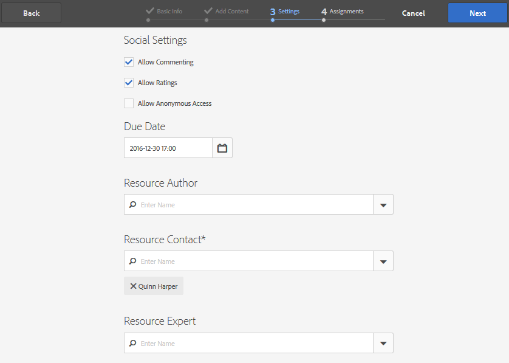

# Community Groups-Konsole{#community-groups-console}

Die Konsole &quot;Gruppen&quot;bietet Zugriff auf das Erstellen von Community-Gruppen, wenn die [Vorlagenstruktur](/help/communities/sites-console.md#step1) einer Community-Site die Funktion[&quot; ](/help/communities/functions.md#groups-function)Gruppen&quot;enthält.

* AEM Communities unterstützen das Verschachteln von Gruppen innerhalb anderer Gruppen. Gruppenverschachtelung ist möglich, wenn die [Struktur der neuen Gruppe](/help/communities/tools-groups.md) die Funktion groups enthält.
* Nur für die Autorenumgebung gibt es einen Assistenten zum Erstellen von Gruppen, der dem Assistenten zum Erstellen der Site ähnelt.
* Ob (oder nicht) Mitglieder Gruppen in der Veröffentlichungsumgebung erstellen können, ist konfigurierbar, wenn Sie einer Community-Site- oder Community-Gruppenstruktur eine Funktion &quot;Gruppen&quot;hinzufügen.

Von den drei enthaltenen Gruppenvorlagen enthält nur die `Reference Group` Vorlage eine Gruppenfunktion in ihrer Struktur.

Die verschiedenen Facetten von Gemeinschaftsgruppen sind:

* **Erstellung**: Neue Gruppe kann beim Autor und optional beim Veröffentlichen erstellt werden
* **Kontrolle**: kann offen oder geheim sein
* **Verschachtelung**: eine Gruppe kann null oder mehr Gruppen enthalten

<!-- This is a 404 on helpx. Please update or remove.
>[!NOTE]
>
>Community groups, created in the publish environment before the [existence of the Community Groups console](/help/communities/version-history.md#featurepack1fp1), will not be listed in the Community Groups console, and thus, are not modifiable using the console.-->

>[!NOTE]
>
>Diese Konsole &quot;Gruppen&quot;, die nur über die Konsole &quot;Communities Sites&quot;zugänglich ist, ist nicht mit der [Gruppenkonsole](/help/communities/members.md) für die Verwaltung von Mitgliedsgruppen zu verwechseln.
>
>Die Benutzergruppen sind Benutzergruppen, die in der Veröffentlichungsumgebung registriert sind und über den [Tunneldienst](/help/communities/deploy-communities.md#tunnel-service-on-author)von der Autorenumgebung aus aufgerufen werden.

## Gruppenerstellung {#group-creation}

So greifen Sie auf die Konsole &quot;Gruppen&quot;zu:

* Melden Sie sich beim Autor mit Administratorrechten an
* Aus globaler Navigation: **Communities, Sites**
* Wählen Sie einen vorhandenen Community-Site-Ordner aus, um ihn zu öffnen
* Wählen Sie eine Instanz einer Community-Site im Ordner aus

   * die Struktur der Community-Site muss eine Gruppenfunktion enthalten
   * Diese Screenshots stammen aus dem Tutorial &quot;Erste Schritte&quot;, nachdem Gruppen im Veröffentlichungsmodus [erstellt wurden.](/help/communities/published-site.md)

Wählen Sie den Ordner &quot; **Gruppen&quot;** , um ihn zu öffnen.

Beim Öffnen werden alle vorhandenen Gruppen angezeigt, unabhängig davon, ob sie beim Autor oder beim Veröffentlichen erstellt wurden.

In dieser Konsole &quot;Gruppen&quot;können neue Gruppen erstellt werden.

* Klicken Sie auf die Schaltfläche &quot;Gruppe **erstellen** &quot;.

### Schritt 1: Community-Gruppenvorlage {#step-community-group-template}

* **Community-Gruppentitel**: einen Anzeigentitel für die Gruppe.
Der Titel wird auf der veröffentlichten Site für die Gruppe angezeigt.

* **Community-Gruppenbeschreibung**: eine Beschreibung der Gruppe.
* **Community-Gruppenstamm**: der Stammpfad zur Gruppe.
Der Standardstamm ist die übergeordnete Site, der Stammordner kann jedoch an einen beliebigen Speicherort innerhalb der Website verschoben werden. Es wird nicht empfohlen, es zu ändern.

* ****** Menü &quot;Zusätzliche verfügbare Community-Gruppensprachen&quot;: **Verwenden Sie die Dropdownliste, um die verfügbaren Gemeinschaftsgruppensprachen auszuwählen. Das Menü zeigt alle Sprachen an, in denen die übergeordnete Community-Site erstellt wurde. Benutzer können in diesem Schritt eine der folgenden Sprachen auswählen, um Gruppen in mehreren Gebietsschemas zu erstellen. Dieselbe Gruppe wird in mehreren angegebenen Sprachen in der Gruppenkonsole der jeweiligen Community-Sites erstellt.

* **Community-Gruppenname**: der Name der Stammseite der Gruppe, die in der URL angezeigt wird

   * den Namen doppelt prüfen, da er nach dem Erstellen der Gruppe nicht leicht geändert werden kann
   * die Basis-URL wird unter der `Community Group Name`
   * für eine gültige URL an &quot;.html&quot; anhängen
      *zum Beispiel*: `https://localhost:4502/content/sites/mysight/en/mygroup.html`

* **Menü &quot;Community-Gruppenvorlage** &quot;: Verwenden Sie die Dropdownliste, um eine verfügbare [Community-Gruppenvorlage](/help/communities/tools.md)auszuwählen.

### Schritt 2: Design {#step-design}

#### COMMUNITY GROUP THEME {#community-group-theme}

Das Framework verwendet [Twitter Bootstrap](https://twitterbootstrap.org/) , um ein reaktionsfähiges, flexibles Design auf die Site zu bringen. Eines der vielen vorgeladenen Bootstrap-Designs kann ausgewählt werden, um die ausgewählte Community-Gruppenvorlage zu gestalten, oder ein Bootstrap-Design kann hochgeladen werden.

Wenn diese Option aktiviert ist, wird das Design mit einem undurchsichtigen blauen Häkchen überlagert.

Es ist möglich, ein Design auszuwählen, das sich vom Design der übergeordneten Site unterscheidet.

Nachdem die Community-Site veröffentlicht wurde, können Sie die Eigenschaftenbearbeiten und ein anderes Design auswählen.

#### COMMUNITY GROUP BRANDING {#community-group-branding}

Das Branding einer Community-Site ist ein Bild, das als Kopfzeile am oberen Rand jeder Seite angezeigt wird. Es ist möglich, ein Banner für die Gruppe anzuzeigen, das sich von anderen Seiten der Site unterscheidet.

Das Bild sollte so groß sein, dass es im Browser wie erwartet angezeigt wird, und 120 Pixel hoch.

Beachten Sie beim Erstellen oder Auswählen eines Bildes Folgendes:

* Die Bildhöhe wird auf 120 Pixel abgeschnitten, gemessen vom oberen Rand des Bilds
* Das Bild wird am linken Rand des Browserfensters fixiert
* Die Bildgröße ändert sich nicht, d. h. wenn die Bildbreite wie folgt ist:

   * kleiner als die Browserbreite, wird das Bild horizontal wiederholt
   * größer als die Browserbreite, scheint das Bild abgeschnitten zu sein

### Schritt 3: Einstellungen {#step-settings}

#### MODERATION {#moderation}

**Community-Gruppenmoderatoren**

Standardmäßig wird die Liste der Moderatoren der übergeordneten Community-Site geerbt.

Es ist möglich, für die Gruppe spezifische Moderatoren hinzuzufügen. Nach Mitgliedern suchen (aus der Veröffentlichungsumgebung), um sie als Moderatoren hinzuzufügen

**Gruppenadministratoren**

Standardmäßig ist der Administrator der übergeordneten Community-Site auch der Administrator für Gruppen.

Es ist jedoch möglich, unabhängige Gruppenadministratoren zuzuweisen. Gruppenadministratoren können ihre Gruppe (z. B. G1) verwalten und eine Untergruppe erstellen, die unter G1 verschachtelt ist. Sie können der Untergruppe weitere Administratoren zuweisen.

Ein Benutzer U1 kann daher Administrator in einer Gruppe G1 und ein regulärer Benutzer in der verschachtelten Gruppe G2 sein.

#### MEMBERSHIP {#membership}

Die Mitgliedschaftseinstellung ermöglicht die Auswahl einer der drei Möglichkeiten, eine Community-Gruppe zu sichern.

* **Optionale Mitgliedschaft** Bei Auswahl dieser Option ist die Community-Gruppe eine öffentliche Gruppe. Site-Mitglieder können an der Gruppe und an Beiträgen teilnehmen, ohne explizit der Gruppe beizutreten. Diese Option ist standardmäßig ausgewählt.

* **Erforderliche Mitgliedschaft** Bei Auswahl dieser Option ist die Community-Gruppe eine offene Gruppe. Mitglieder der Community-Site können den Inhalt der Gruppe anzeigen, müssen jedoch der Gruppe beitreten, um Inhalte zu veröffentlichen. Mitglieder werden durch Klicken auf die `Join` Schaltfläche in der Veröffentlichungsumgebung hinzugefügt. &quot;Standard&quot;ist nicht ausgewählt.

* **Eingeschränkte Mitgliedschaft** Bei Auswahl dieser Option ist die Community-Gruppe eine geheime Gruppe. Die Mitglieder der Gemeinschaft müssen ausdrücklich eingeladen werden. Eingeladene Mitglieder werden in das Suchfeld eingegeben. Mitglieder können später in der Autorenumgebung über die [Mitglieder- und Gruppenkonsolen](/help/communities/members.md) hinzugefügt werden. &quot;Standard&quot;ist nicht ausgewählt.

#### MINIATUR {#thumbnail}

Die Miniaturansicht ist ein Bild, das bei Autor und Veröffentlichung für die Gruppe angezeigt wird.

Die optimale Größe für ein Gruppenbild beträgt 170 x 90 Pixel in einem unterstützten Bildformat (z. B. JPG oder PNG).

Wenn kein Bild hinzugefügt wird, wird ein Standardbild angezeigt.

### Schritt 4: Gruppe erstellen {#step-create-group}

Falls Anpassungen erforderlich sind, verwenden Sie die Schaltfläche **Zurück **um sie vorzunehmen.

Nachdem **Erstellen** ausgewählt und gestartet wurde, kann der Vorgang zum Erstellen der Gruppe nicht unterbrochen werden.

Nach Abschluss des Vorgangs wird die Karte für die neue Subcommunity-Site (Gruppe) in der Communities Sites Groups-Konsole angezeigt, über die Autoren Seiteninhalte hinzufügen können oder Administratoren die Eigenschaften der Site ändern können.

>[!NOTE]
>
>Die Gruppe wird in allen Sprachen erstellt, wie in [Schritt 1 angegeben: Community-Gruppenvorlage](/help/communities/groups.md#step-community-group-template) in zusätzlichen verfügbaren Community-Gruppensprachen in der Community-Gruppenkonsole der jeweiligen Community-Sites.

## Inhalt der Autorengruppe {#author-group-content}

Der Seiteninhalt einer Gruppe kann mit denselben Werkzeugen wie jede andere AEM-Seite erstellt werden. Um die Gruppe zum Authoring zu öffnen, wählen Sie das Symbol &quot;Site öffnen&quot;, das angezeigt wird, wenn Sie den Mauszeiger über die Gruppenkarte bewegen.

## Gruppeneigenschaften ändern {#modify-group-properties}

Die Eigenschaften einer bestehenden Subcommunity-Site, die während des Community-Gruppenerstellungsprozesses angegeben wurde, können durch Auswahl des Symbols &quot;Site bearbeiten&quot;geändert werden, das angezeigt wird, wenn Sie den Mauszeiger über die Gruppenkarte bewegen:

Die Details der folgenden Eigenschaften stimmen mit den Beschreibungen im Abschnitt [Gruppenerstellung](#group-creation) überein. Verschachtelte Gruppen können geändert werden, unabhängig davon, ob sie in der Veröffentlichungsumgebung oder in der Autorenumgebung erstellt wurden.

### Basic ändern {#modify-basic}

Das BASIC-Bedienfeld ermöglicht die Änderung von

* Community-Gruppenname
* Community-Gruppenbeschreibung

Der Community-Gruppenname darf nicht geändert werden.

Die Auswahl einer anderen Community-Gruppenvorlage hätte keine Auswirkungen auf eine bestehende Community-Gruppensite, da keine Verbindung zwischen Vorlagen und Sites bestehen bleibt.

Stattdessen kann die [STRUKTUR](#modify-structure) der Untergemeinschaft geändert werden.

### Struktur ändern {#modify-structure}

Das STRUKTURbedienfeld ermöglicht die Änderung der Struktur, die ursprünglich aus der Community-Gruppenvorlage erstellt wurde, die beim Erstellen der Unter-Community-Site aus der Autor- oder Veröffentlichungsumgebung ausgewählt wurde. Über den Bereich können Sie

* Ziehen Sie zusätzliche [Community-Funktionen](/help/communities/functions.md) in die Site-Struktur.
* Auf einer Instanz einer Community-Funktion in der Site-Struktur:

   * **`Gear icon`**
Bearbeiten Sie Einstellungen, einschließlich des Anzeigentitels und des URL-Namens*und der [privilegierten Mitgliedergruppen](/help/communities/users.md#privilegedmembersgroups).

   * **`Trashcan icon`**
Entfernen (Löschen) von Funktionen aus der Site-Struktur.

   * **`Grid icon`**
Ändern Sie die Reihenfolge der Funktionen, die in der Navigationsleiste auf der obersten Navigationsebene der Site angezeigt werden.

>[!CAUTION]
>
>* Obwohl der Anzeigentitel ohne Nebenwirkungen geändert werden kann, wird nicht empfohlen, den URL-Namen einer Community-Funktion zu bearbeiten, die zu einer Community-Site gehört.
Wenn Sie beispielsweise die URL umbenennen, wird die vorhandene UGC nicht verschoben, sodass die UGC verliert wird.

>[!CAUTION]
Die Funktion groups darf *nicht *die *erste oder einzige* Funktion in der Site-Struktur sein.
Jede andere Funktion, wie die [Seitenfunktion](/help/communities/functions.md#page-function), muss eingeschlossen und zuerst aufgeführt werden.

#### Beispiel: Hinzufügen einer Kalenderfunktion zu einer UnterCommunity-(Gruppen-)Struktur {#example-adding-a-calendar-function-to-a-sub-community-group-structure}

### Design ändern {#modify-design}

Das DESIGN-Bedienfeld ermöglicht die Änderung des Designs:

* [Community-Gruppen-Design](#community-group-theme)
* [Community-Gruppen-Branding](#community-group-branding)

   * zum unteren Rand des Bedienfelds scrollen, um das Markenbild zu ändern

### Einstellungen ändern {#modify-settings}

Über das Bedienfeld &quot;EINSTELLUNGEN&quot;können Community- [Moderatoren](#moderation)hinzugefügt werden.

### Mitgliedschaft ändern {#modify-membership}

Die [Mitgliedergruppe](#membership) ist nur informativ. Es ist nicht möglich, die Art der Gruppenmitgliedschaft zu ändern, unabhängig davon, ob sie optional, erforderlich oder eingeschränkt ist.

### Miniaturansicht ändern {#modify-thumbnail}

Das [THUMBNAIL](#thumbnail) -Bedienfeld ermöglicht es, ein Bild hochzuladen, das die Community-Gruppe für Site-Besucher in der Veröffentlichungsumgebung sowie in der Communities Site-Gruppenkonsole in der Autorenumgebung darstellt.

## Veröffentlichen der Gruppe {#publish-the-group}

Nachdem eine Community-Gruppe neu erstellt oder geändert wurde, kann die Gruppe durch Auswahl des `Publish Site` Symbols veröffentlicht (aktiviert) werden.

Nachdem die Gruppe erfolgreich veröffentlicht wurde, wird eine Meldung angezeigt:

>[!CAUTION]
Die übergeordnete Community-Site und die übergeordneten Gruppen hätten bereits veröffentlicht werden sollen.
Die Community-Site und verschachtelte Gruppen sollten von oben nach unten veröffentlicht werden.

## Gruppe löschen {#delete-the-group}

Löschen Sie eine Gruppe aus der Community-Gruppenkonsole, indem Sie auf das Symbol &quot;Gruppe löschen&quot;klicken, das angezeigt wird, wenn Sie den Mauszeiger über die Gruppe halten.

Dadurch werden alle mit der Gruppe verknüpften Elemente entfernt, zum Beispiel wird der gesamte Inhalt der Gruppe dauerhaft gelöscht und die Benutzermitgliedschaften werden aus dem System entfernt.
