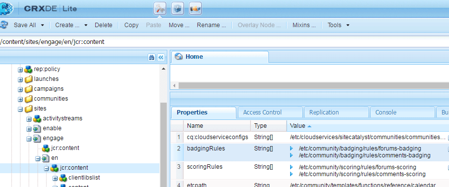

# Communities Scoring and Badges {#communities-scoring-and-badges}

## Überblick {#overview}

Die AEM Communities-Funktion für Scoring und Abzeichen bietet die Möglichkeit, Community-Mitglieder zu identifizieren und zu belohnen.

Wichtigste Aspekte der Bewertung und Abzeichen sind:

* [Weisen Sie ](#assign-and-revoke-badges) badgesto zu, um die Rolle eines Mitglieds in der Community zu identifizieren.

* [Grundlegende Vergabe von ](#enable-scoring) badgesto-Mitgliedern, um ihre Teilnahme zu fördern (Menge der erstellten Inhalte).

* [Erweiterte Vergabe von ](/help/communities/advanced.md) badgesto identifizieren Mitglieder als Experten (Qualität der Inhalte erstellt).

**Beachten Sie,** dass die Vergabe von Kennzeichen  [nicht standardmäßig](/help/communities/implementing-scoring.md#main-pars-text-237875536) aktiviert ist.

>[!CAUTION]
>
>Die in der CRXDE Lite angezeigte Implementierungsstruktur kann sich ändern, sobald die Benutzeroberfläche verfügbar ist.

## Zeichen {#badges}

Kennzeichen werden unter dem Namen eines Mitglieds platziert, um entweder ihre Rolle oder ihr Ansehen in der Gemeinschaft anzugeben. Abzeichen können entweder als Bild oder als Name angezeigt werden. Wenn der Name als Bild angezeigt wird, wird er als alternativer Text für die Barrierefreiheit eingefügt.

Standardmäßig befinden sich Abzeichen im Repository unter

* `/libs/settings/community/badging/images`

Wenn sie an einem anderen Ort gespeichert sind, sollten sie von allen gelesen werden können.

Die Kennzeichen werden in UGC differenziert, ob sie gemäß den Regeln zugewiesen wurden oder verdient wurden. Derzeit werden zugewiesene Kennzeichen als Text und verdiente Kennzeichen als Bild angezeigt.

### Benutzeroberfläche der Bademanagement {#badge-management-ui}

Die Communities [Badges-Konsole](/help/communities/badges.md) bietet die Möglichkeit, benutzerdefinierte Abzeichen hinzuzufügen, die für ein Mitglied angezeigt werden können, wenn es verdient (verliehen) oder eine bestimmte Rolle in der Community übernimmt (zugewiesen).

### Zugewiesene Kennzeichen {#assigned-badges}

Rollenbasierte Abzeichen werden von einem Administrator entsprechend ihrer Rolle in der Community Mitgliedern zugewiesen.

Zugewiesene (und erwartete) Kennzeichen werden im ausgewählten [SRP](/help/communities/srp.md) gespeichert und sind nicht direkt zugänglich. Solange keine grafische Benutzeroberfläche verfügbar ist, können rollenbasierte Abzeichen nur mit Code oder cURL zugewiesen werden. Anweisungen zu cURL finden Sie im Abschnitt [Kennzeichen zuweisen und sperren](#assign-and-revoke-badges).

In der Version sind drei rollenbasierte Abzeichen enthalten:

* **moderator**

   `/libs/settings/community/badging/images/moderator/jcr:content/moderator.png`

* **group Manager**

   `/libs/settings/community/badging/images/group-manager/jcr:content/group-manager.png`

* **privilegiertes Mitglied**

   `/libs/settings/community/badging/images/privileged-member/jcr:content/privileged-member.png`

   

### Zuerkannte Kennzeichen {#awarded-badges}

Belohnungsbasierte Abzeichen werden vom Bewertungsdienst an Mitglieder der Gemeinde vergeben, die auf Regeln beruhen, die für ihre Aktivität in der Gemeinde gelten.

Damit Kennzeichen als Belohnung für Aktivität erscheinen, müssen zwei Dinge geschehen:

* Die Abzeichen müssen für die Funktionskomponente [enabled](#enableforcomponent) sein.
* Die Scoring- und Badging-Regeln müssen auf die Seite (oder den Vorfahren), auf der die Komponente platziert wird, [angewendet werden.](#applytopage)

In der Version sind drei belohnungsbasierte Abzeichen enthalten:

* **Gold**

   `/libs/settings/community/badging/images/gold-badge/jcr:content/gold.png`

* **silber**

   `/libs/settings/community/badging/images/silver-badge/jcr:content/silver.png`

* **Bronze**

   `/libs/settings/community/badging/images/bronze-badge/jcr:content/bronze.png`

   

>[!NOTE]
>
>Bewertungsregeln können so konfiguriert werden, dass negative Punkte für Beiträge zugewiesen werden, die als unangemessen gekennzeichnet sind und sich daher auf den Ergebniswert auswirken. Sobald ein Abzeichen jedoch verdient wurde, wird es aufgrund von Änderungen der Punktreduzierung oder der Bewertungsregel nicht automatisch entfernt.
>
>Zuerkannte Abzeichen können wie zugewiesene Abzeichen widerrufen werden. Siehe Abschnitt [Abzeichen zuweisen und sperren](#assign-and-revoke-badges). Zukünftige Verbesserungen beinhalten eine Benutzeroberfläche zur Verwaltung der Abzeichen der Mitglieder.

### Benutzerdefinierte Abzeichen {#custom-badges}

Benutzerdefinierte Abzeichen können mit der Konsole [Abzeichen](/help/communities/badges.md) installiert und entweder zugewiesen oder in Absatzwegeln angegeben werden.

Bei der Installation über die Badges-Konsole werden benutzerdefinierte Abzeichen automatisch in die Veröffentlichungs-Umgebung repliziert.

## Bewertung aktivieren {#enable-scoring}

Die Bewertung ist nicht standardmäßig aktiviert. Die grundlegenden Schritte zur Einrichtung und Aktivierung der Bewertung und Vergabe von Abzeichen sind:

* Identifizieren Sie die Regeln für die Ertragspunkte ([Bewertungsregeln](#scoring-rules)).
* Weisen Sie für Punkte, die nach Bewertungsregeln akkumuliert wurden, [Abzeichen](#badges) ([Abbedinungsregeln](#badging-rules)) zu.

* [Wenden Sie die Scoring- und Kennzeichnungsregeln auf eine Community-Site](#apply-rules-to-content) an.
* [Aktivieren Sie das Abzeichnen für Community-Funktionen](#enable-badges-for-component).

Siehe Abschnitt [Schnelltest](#quick-test), um die Bewertung für eine Community-Site mit den standardmäßigen Scoring- und Badging-Regeln für Foren und Kommentare zu aktivieren.

### Regeln auf Inhalt anwenden {#apply-rules-to-content}

Um die Bewertung und Abzeichen zu aktivieren, fügen Sie die Eigenschaften `scoringRules` und `badgingRules` zu einem beliebigen Knoten in der Inhaltsstruktur der Site hinzu.

Wenn die Site bereits veröffentlicht wurde, veröffentlichen Sie die Site nach Anwendung aller Regeln und aktivierenden Komponenten erneut.

Die Regeln, die für eine badging-fähige Komponente gelten, sind die Regeln für die aktuelle Node oder deren Vorgänger.

Wenn der Knoten vom Typ `cq:Page` (empfohlen) ist, fügen Sie mithilfe von CRXDE|Lite die Eigenschaften dem Knoten `jcr:content` hinzu.

| **Eigenschaft** | **Typ** | **Beschreibung** |
|---|---|---|
| badgingRules | Zeichenfolge | eine Array-Liste von [Kennzeichnungsregeln](#badging-rules) |
| scoringRules | Zeichenfolge | eine Array-Liste von [Bewertungsregeln](#scoring-rules) |

>[!NOTE]
>
>Wenn eine Bewertungsregel keine Auswirkungen auf die Zuweisung von Kennzeichen zu haben scheint, stellen Sie sicher, dass die Bewertungsregel nicht von der scoringRules-Eigenschaft der Kennzeichnungsregel blockiert wurde. Siehe Abschnitt [Kennzeichnungsregeln](#badging-rules).

### Kennzeichen für Komponente {#enable-badges-for-component} aktivieren

Die Scoring- und Bading-Regeln werden nur für Instanzen von Komponenten angewendet, die die Markierung durch Bearbeiten der Komponentenkonfiguration im [Authoring-Modus](/help/communities/author-communities.md) aktiviert haben.

Die boolesche Eigenschaft `allowBadges` aktiviert/deaktiviert die Anzeige von Abzeichen für eine Komponenteninstanz. Sie kann im [Dialogfeld zum Bearbeiten von Komponenten](/help/communities/author-communities.md) für Forum-, QnA- und Kommentarkomponenten über ein Kontrollkästchen mit der Bezeichnung **Anzeigemarke** konfiguriert werden.

#### Beispiel: allowBadges for Forum component instance {#example-allowbadges-for-forum-component-instance}


>[!NOTE]
>
>Jede Komponente kann überlagert werden, um Abzeichen mit dem HBS-Code anzuzeigen, der in Foren, QnA und Kommentaren zu finden ist.

## Bewertungsregeln {#scoring-rules}

Bewertungsregeln sind die Grundlage für die Verleihung von Abzeichen.

Jede Bewertungsregel ist ganz einfach eine Liste einer oder mehrerer Unterregeln. Bewertungsregeln werden auf den Inhalt der Community-Site angewendet, um die Regeln zu identifizieren, die bei Aktivierung von Kennzeichen angewendet werden.

Bewertungsregeln werden geerbt, jedoch nicht additiv. Beispiel:

* Wenn page2 Scoring rule2 enthält und die angefangene Seite1 Scoring Rule1 enthält.
* Eine Aktion auf einer Komponente &quot;page2&quot;ruft sowohl Regel1 als auch Regel2 auf.
* Wenn beide Regeln anwendbare Unterregeln für dasselbe `topic/verb` enthalten:

   * Nur die Unterregel aus Regel 2 wirkt sich auf das Ergebnis aus.
   * Die Ergebnisse beider Unterregeln werden nicht zusammen addiert.

Wenn es mehr als eine Bewertungsregel gibt, werden die Ergebnisse für jede Regel separat beibehalten.

Bewertungsregeln sind Knoten des Typs `cq:Page` mit Eigenschaften auf dem Knoten `jcr:content`, die die Liste der Unterregeln angeben, die diese definieren.

Scores werden in SRP gespeichert.

>[!NOTE]
>
>Best Practice: Benennen Sie jede Bewertungsregel eindeutig.
>
>Die Namen von Bewertungsregeln sollten global eindeutig sein. sie sollten nicht mit demselben Namen enden.
>
>Beispiel für die folgenden Schritte:**
>
>/libs/settings/community/scoring/rules/site1/forums-scoring
>/libs/settings/community/scoring/rules/site2/forums-scoring

### Bewertungsunterregeln {#scoring-sub-rules}

Die Bewertungsunterregeln enthalten die Eigenschaften, die die Werte für die Teilnahme an der Community detailliert angeben.

Jede Bewertungsunterregel identifiziert:

* Welche Aktivitäten werden verfolgt?
* Welche speziellen Gemeinschaftsfunktionen sind betroffen?
* Wie viele Punkte werden vergeben?

Standardmäßig werden Punkte an das Mitglied vergeben, das eine Aktion durchführt, es sei denn, die Unterregel legt fest, dass der Eigentümer des Inhalts die Punkte erhält ( `forOwner`).

Jede Unterregel kann in einer oder mehreren Bewertungsregeln enthalten sein.

Der Name der Unterregel folgt normalerweise dem Muster der Verwendung eines *subject* , *object* und *verb*. Beispiel:

* member-comment-create
* member-receive-Votum

Unter-Regeln sind Knoten des Typs `cq:Page` mit Eigenschaften auf ihrem `jcr:content`Knoten, die die [Verben und Themen](#topics-and-verbs) angeben.

<table>
 <tbody>
  <tr>
   <th>Eigenschaft</th>
   <th>Typ</th>
   <th> Wertbeschreibung</th>
  </tr>
  <tr>
   <td><i><code>VERB</code></i></td>
   <td>Long</td>
   <td>
    <ul>
     <li>erforderlich; das Verb entspricht einer Ereignis-Aktion</li>
     <li>Es muss mindestens eine Verb-Eigenschaft vorhanden sein</li>
     <li>das Verb muss in allen UPPERCASE eingegeben werden</li>
     <li>Es können mehrere Eigenschaften von Verb vorhanden sein, jedoch keine Duplikat</li>
     <li>der Wert ist der Wert, der für dieses Ereignis gelten soll</li>
     <li>der Wert kann positiv oder negativ sein</li>
     <li>Eine Liste der Verben, die in der Version unterstützt werden, befindet sich im Abschnitt <a href="#topics-and-verbs">Themen und Verben</a></li>
    </ul> </td>
  </tr>
  <tr>
   <td><code>topics</code></td>
   <td>Zeichenfolge</td>
   <td>
    <ul>
     <li>optional; beschränkt Unterregel auf Community-Komponenten, die nach Ereignis-Themen identifiziert werden</li>
     <li>if specified : value ist eine Zeichenfolge mit mehreren Werten für Ereignis-Themen</li>
     <li>Eine Liste der Themen in der Version befindet sich im Abschnitt <a href="#topics-and-verbs">Themen und Verben</a></li>
     <li>ist standardmäßig auf alle Themen anzuwenden, die mit dem bzw. den Verb(en) verbunden sind</li>
    </ul> </td>
  </tr>
  <tr>
   <td><code>forOwner</code></td>
   <td>Boolesch</td>
   <td>
    <ul>
     <li>optional; nicht relevant, wenn ein Mitglied mit Inhalten handelt, die ihm gehören</li>
     <li>Wenn "true", wird das Ergebnis auf den Eigentümer des Inhalts angewendet, auf den reagiert wird</li>
     <li>Wenn false, Punktzahl auf die Aktion des Mitglieds anwenden</li>
     <li>default ist false</li>
    </ul> </td>
  </tr>
  <tr>
   <td><code>scoringType</code></td>
   <td>Zeichenfolge</td>
   <td>
    <ul>
     <li>optional; erkennt die Bewertungsmaschine</li>
     <li>if "basic" gibt die Bewertungsmaschine basierend auf der Menge an
      <ul>
       <li>in der Version enthalten</li>
      </ul> </li>
     <li>if "advanced", gibt die Bewertungsmaschine auf der Grundlage von Qualität und Menge an
      <ul>
       <li>erfordert ein <a href="/help/communities/advanced.md">zusätzliches Paket</a></li>
      </ul> </li>
     <li>default ist "basic"</li>
    </ul> </td>
  </tr>
 </tbody>
</table>

### Einbezogene Bewertungsregeln und Unterregeln {#included-scoring-rules-and-sub-rules}

In der Version sind zwei Bewertungsregeln für die [Foren-Funktion](/help/communities/functions.md#forum-function) enthalten (eine für die Foren- und Kommentarkomponenten der Funktion &quot;Forum&quot;):

1. /libs/settings/community/scoring/rules/comments-scoring

   * subRules[] =
/libs/settings/community/scoring/rules/sub-rules/member-comment-create
/libs/settings/community/scoring/rules/sub-rules/member-receive-Vize
/libs/settings/community/scoring/rules/sub-rules/member-gebe-Votum
/libs/settings/community/scoring/rules/sub-rules/member-is-moderated

1. /libs/settings/community/scoring/rules/forums-scoring

   * subRules[] =
/libs/settings/community/scoring/rules/sub-rules/member-forum-create
/libs/settings/community/scoring/rules/sub-rules/member-receive-Vize
/libs/settings/community/scoring/rules/sub-rules/member-gebe-Votum
/libs/settings/community/scoring/rules/sub-rules/member-is-moderated

**Hinweise:**

* Die Knoten `rules` und `sub-rules` sind vom Typ cq:Page.

* `subRules` ist ein Attribut des Typs [] Stringon der  `jcr:content` Knoten der Regel.

* `sub-rules` kann für verschiedene Bewertungsregeln freigegeben werden.
* `rules` sollte sich in einem Repository mit Leserechte für alle befinden.

   * Regelnamen müssen unabhängig vom Ort eindeutig sein.

### Aktivieren benutzerdefinierter Bewertungsregeln {#activating-custom-scoring-rules}

Änderungen oder Ergänzungen, die an Bewertungsregeln oder Unterregeln in der Autorenregel vorgenommen wurden, müssen bei der Veröffentlichung installiert werden.

## Kennzeichnungsregeln {#badging-rules}

Kennzeichnungsregeln verknüpfen Bewertungsregeln mit Kennzeichen, indem sie Folgendes angeben:

* Bewertungsregel
* Ergebnis erforderlich, um mit einem bestimmten Zeichen versehen zu werden

Kennzeichnungsregeln sind Knoten des Typs `cq:Page` mit Eigenschaften auf ihrem `jcr:content`-Knoten, die Bewertungsregeln mit Bewertungen und Abzeichen korrelieren.

Die Regeln für das Abzeichen bestehen aus einer obligatorischen `thresholds`-Eigenschaft, bei der es sich um eine geordnete Liste von Punktzahlen handelt, die Markierungen zugeordnet sind. Die Ergebnisse müssen in zunehmendem Wert angeordnet werden. Beispiel:

* `1|/libs/settings/community/badging/images/bronze-badge/jcr:content/bronze.png`

   * Ein Bronzemaske wird für 1 Punkt erwartet.

* `60|/libs/settings/community/badging/images/silver-badge/jcr:content/silver.png`

   * Ein Silberabzeichen wird vergeben, wenn 60 Punkte gesammelt wurden.

* `80|/libs/settings/community/badging/images/gold-badge/jcr:content/gold.png`

   * Wenn 80 Punkte gesammelt wurden, wird ein Goldabzeichen erwartet.

Kennzeichnungsregeln werden mit Bewertungsregeln gepaart, die bestimmen, wie Punkte akkumuliert werden. Siehe Abschnitt [Regeln auf Inhalt anwenden](#apply-rules-to-content).

Die `scoringRules`-Eigenschaft einer Kennzeichnungsregel schränkt einfach ein, welche Bewertungsregeln mit dieser bestimmten Kennzeichnungsregel gepaart werden können.

>[!NOTE]
>
>Bewährte Verfahren: Sie können individuelle Abzeichen für jede AEM Website erstellen.


<table>
 <tbody>
  <tr>
   <th>Eigenschaft</th>
   <th>Typ</th>
   <th>Wertbeschreibung</th>
  </tr>
  <tr>
   <td>Schwellenwerte</td>
   <td>Zeichenfolge</td>
   <td><em>(erforderlich)</em> Eine Zeichenfolge mit mehreren Werten im Format 'number|path'
    <ul>
     <li>number = score</li>
     <li>| = vertikaler Zeilenabstand (U+007C)</li>
     <li>path = vollständiger Pfad zur Abzeichen-Bildressource</li>
    </ul> Die Zeichenfolgen müssen so angeordnet sein, dass die Zahlen an Wert zunehmen und zwischen Zahl und Pfad kein Leerzeichen angezeigt wird.<br /> Beispieleintrag:<br /> <code>80|/libs/settings/community/badging/images/gold-badge/jcr:content/gold.png</code></td>
  </tr>
  <tr>
   <td>badgingType</td>
   <td>Zeichenfolge</td>
   <td><em>(optional)</em> Identifiziert die Scoring-Engine entweder als "Basis"oder als "Erweitert". Wenn die erweiterte Scoring-Engine gewünscht wird, finden Sie weitere Informationen unter <a href="/help/communities/advanced.md">Erweiterte Scoring- und Abzeichen</a>. Der Standardwert ist "basic".</td>
  </tr>
  <tr>
   <td>scoringRules</td>
   <td>Zeichenfolge</td>
   <td>(<em>optional</em>) Eine Zeichenfolge mit mehreren Werten, um die Kennzeichnungsregel auf die von den Bewertungsregeln identifizierten Ereignis zu beschränken</td>
  </tr>
 </tbody>
</table>

### Einbezogene Kennzeichnungsregeln {#included-badging-rules}

In der Version sind zwei Kennzeichnungsregeln enthalten, die den [Foren- und Kommentarauswertungsregeln](#includedscoringrules) entsprechen.

* `/libs/settings/community/badging/rules/comments-badging`

* `/libs/settings/community/badging/rules/forums-badging`

**Hinweise:**

* `rules` Knoten sind vom Typ cq:Page.
* `rules` sollte sich in einem Repository mit Leserechte für alle befinden.

   * Regelnamen müssen unabhängig vom Ort eindeutig sein.

### Aktivieren benutzerdefinierter Kennzeichnungsregeln {#activating-custom-badging-rules}

Änderungen oder Ergänzungen an den Kennzeichnungsregeln oder Bildern, die in der Authoring-Umgebung vorgenommen wurden, müssen bei der Veröffentlichung installiert werden.

## Zuteilen und Entziehen von Abzeichen {#assign-and-revoke-badges}

Abzeichen können Mitgliedern entweder mit der [members-Konsole](/help/communities/members.md#badges-tab) oder programmgesteuert mit cURL-Befehlen zugewiesen werden.

Die folgenden cURL-Befehle zeigen, was für eine HTTP-Anforderung zum Zuweisen und Sperren von Kennzeichen erforderlich ist. Das Basisformat lautet:

cURL -i -X POST -H *header* -u *signin* -F *operation* -F *badge* *member-Profil-url*

*header* = &quot;Accept:application/json&quot; benutzerdefinierter Header, der an den Server übergeben wird (erforderlich)

*sign* = administrator-id:password zum Beispiel: admin:admin

*operation* = &quot;:operation=social:assignBadge&quot; OR &quot;:operation=social:deleteBadge&quot;

*badge* = &quot;badgeContentPath=*badge-image-file*&quot;

*badge-image-file* = der Speicherort der Badge-Bilddatei im Repository zum Beispiel: /libs/settings/community/badging/images/moderator/jcr:content/moderator.png

*member-Profil-url* = Endpunkt für das Profil des Mitglieds bei der Veröffentlichung z. B. : https://&lt;server>:&lt;port>/home/users/community/riley/profile.social.json

>[!NOTE]
>
>Die *member-Profil-url*:
>
>* Kann auf eine Autoreninstanz verweisen, wenn der [Tunneldienst](/help/communities/users.md#tunnel-service) aktiviert ist.
>* Kann ein undurchsichtiger, zufälliger Name sein - siehe [Sicherheits-Checkliste](/help/sites-administering/security-checklist.md#verify-that-you-are-not-disclosing-personally-identifiable-information-in-the-users-home-path) zu autorisierbarer ID.


### Beispiele: {#examples}

#### Moderatorzeichen {#assign-a-moderator-badge} zuweisen

```shell
curl -i -X POST -H "Accept:application/json" -u admin:admin -F ":operation=social:assignBadge" -F "badgeContentPath=/libs/settings/community/badging/images/moderator/jcr:content/moderator.png" /home/users/community/updcs9DndLEI74DB9zsB/profile.social.json
```

#### Sperren eines zugewiesenen Silber-Kennzeichens {#revoke-an-assigned-silver-badge}

```shell
curl -i -X POST -H "Accept:application/json" -u admin:admin -F ":operation=social:deleteBadge" -F "badgeContentPath=/libs/settings/community/badging/images/silver/jcr:content/silver.png" /home/users/community/updcs9DndLEI74DB9zsB/profile.social.json
```

>[!NOTE]
>
>Die Verwendung von cURL zum Zuweisen und Sperren von Abzeichen funktioniert für jedes Abzeichen-Bild, aber wenn sie anstelle von &quot;verdient&quot;zugewiesen werden, werden sie als zugewiesene Abzeichen markiert und entsprechend behandelt.

## Bewertung und Abzeichen für benutzerdefinierte Komponenten {#scoring-and-badges-for-custom-components}

Scoring- und Badging-Regeln können für benutzerdefinierte Komponenten erstellt werden, indem die für die Komponente erstellten Ereignis-Themen mit Verben verknüpft werden.

## Themen und Verben {#topics-and-verbs}

Wenn Mitglieder mit Communities-Funktionen interagieren, werden Ereignis gesendet, die asynchrone Listener wie Benachrichtigungen und Scoring Trigger geben können.

Die SocialEvent-Instanz einer Komponente zeichnet die Ereignis als `actions` auf, die für ein `topic` auftreten. Das SocialEvent enthält eine Methode, um eine `verb` zurückzugeben, die der Aktion zugeordnet ist. Es besteht eine *n-1*-Beziehung zwischen `actions` und `verbs`.

Für die bereitgestellten Communities-Komponenten beschreiben die folgenden Tabellen die `verbs`, die für jede `topic` definiert sind, die in [Scoring-Unterregeln](#scoring-sub-rules) verfügbar ist.

>[!NOTE]
>
>Eine neue boolesche Eigenschaft, `allowBadges`, aktiviert/deaktiviert die Anzeige von Zeichen für eine Komponenteninstanz. Es kann in aktualisierten [Dialogfeldern zum Bearbeiten von Komponenten](/help/communities/author-communities.md) mithilfe eines Kontrollkästchens **Anzeigemarke** konfiguriert werden.

**[Calendar](/help/communities/calendar.md)**
ComponentSocialEvent  `topic`= com/adobe/cq/social/calendar

| **Verb** | **Beschreibung** |
|---|---|
| POST | Mitglied erstellt ein Ereignis im Kalender |
| HINZUFÜGEN | Mitgliederkommentare für ein Kalendertool |
| UPDATE | Ereignis oder Kommentar des Mitglieds wird bearbeitet |
| DELETE | Ereignis oder Kommentar des Mitglieds wird gelöscht |

**[Kommentare](/help/communities/comments.md)**
ComponentSocialEvent  `topic`= com/adobe/cq/social/comment

| **Verb** | **Beschreibung** |
|---|---|
| POST | Mitglied erstellt einen Kommentar |
| HINZUFÜGEN | Antworten des Mitglieds auf Kommentar |
| UPDATE | Kommentar des Mitglieds wird bearbeitet |
| DELETE | Kommentar des Mitglieds wird gelöscht |

**[File Library](/help/communities/file-library.md)**
ComponentSocialEvent  `topic`= com/adobe/cq/social/fileLibrary

| **Verb** | **Beschreibung** |
|---|---|
| POST | Mitglied erstellt einen Ordner |
| ANLAGE | Mitglied lädt eine Datei hoch |
| UPDATE | Mitglied aktualisiert einen Ordner oder eine Datei |
| DELETE | löscht einen Ordner oder eine Datei |

**[Forum](/help/communities/forum.md)**
ComponentSocialEvent  `topic`= com/adobe/cq/social/forum

| **Verb** | **Beschreibung** |
|---|---|
| POST | Mitglied erstellt Forumthema |
| HINZUFÜGEN | Mitgliederantworten zum Forenthema |
| UPDATE | Forenthema oder Antwort des Mitglieds wird bearbeitet |
| DELETE | Forenthema oder Antwort des Mitglieds wird gelöscht |

**[Protokoll](/help/communities/blog-feature.md)**
ComponentSocialEvent  `topic`= com/adobe/cq/social/Protokoll

| **Verb** | **Beschreibung** |
|---|---|
| POST | Mitglied erstellt einen Blog-Artikel |
| HINZUFÜGEN | Kommentare zu einem Blog-Artikel |
| UPDATE | Blog-Artikel oder Kommentar des Mitglieds wird bearbeitet |
| DELETE | Blog-Artikel oder Kommentar des Mitglieds wird gelöscht |

**[QnA](/help/communities/working-with-qna.md)**
ComponentSocialEvent  `topic` = com/adobe/cq/social/qna

| **Verb** | **Beschreibung** |
|---|---|
| POST | Mitglied erstellt eine QnA-Frage |
| HINZUFÜGEN | Mitglied erstellt eine QnA-Antwort |
| UPDATE | Frage oder Antwort des Mitglieds zur Servicequalitätsprüfung wird bearbeitet |
| SELECT | Antwort des Mitglieds ausgewählt |
| AUSWAHL aufheben | Die Antwort des Mitglieds wird deaktiviert |
| DELETE | Frage oder Antwort des Mitglieds zur Servicequalitätsprüfung wird gelöscht |

**[Reviews](/help/communities/reviews.md)**
ComponentSocialEvent  `topic`= com/adobe/cq/social/review

| **Verb** | **Beschreibung** |
|---|---|
| POST | Mitglied erstellt Review |
| UPDATE | Überprüfung des Mitglieds wird bearbeitet |
| DELETE | Überprüfung des Mitglieds wird gelöscht |

**[Rating](/help/communities/rating.md)**
ComponentSocialEvent  `topic`= com/adobe/cq/social/tally/rating

| **Verb** | **Beschreibung** |
|---|---|
| hinzufügen | Der Inhalt des Mitglieds wurde bewertet |
| RATING ENTFERNEN | der Inhalt des Mitglieds wurde heruntergesetzt |

**[Voting](/help/communities/voting.md)**
ComponentSocialEvent  `topic`= com/adobe/cq/social/tally/stimmst

| **Verb** | **Beschreibung** |
|---|---|
| hinzufügen ABSTIMMUNG | Der Inhalt des Mitglieds wurde abgestimmt |
| ABSTIMMUNG ENTFERNEN | Inhalt des Mitglieds wurde abgelehnt |

**Moderationsaktivierte**
KomponentenSocialEvent  `topic`= com/adobe/cq/social/moderation

| **Verb** | **Beschreibung** |
|---|---|
| DENY | Inhalt des Mitglieds wird verweigert |
| FLAG-AS-INAPPROPRIATE | Inhalt des Mitglieds wird markiert |
| UNFLAG-AS-INAPPROPRIATE | Der Inhalt des Mitglieds ist unmarkiert |
| AKZEPT | Der Inhalt des Mitglieds wird vom Moderator genehmigt |
| SCHLIESSEN | Mitglied schließt Kommentar zu Bearbeitungen und Antworten |
| OPEN | Mitglied öffnet Kommentar erneut |

### Ereignis für benutzerdefinierte Komponenten {#custom-component-events}

Bei einer benutzerdefinierten Komponente wird ein SocialEvent instanziiert, um die Ereignis der Komponente als `actions` aufzuzeichnen, die für ein `topic` auftreten.

Um die Bewertung zu unterstützen, muss das SocialEvent die Methode `getVerb()` überschreiben, sodass für jedes `action` ein entsprechendes `verb` zurückgegeben wird. Das für eine Aktion zurückgegebene `verb` kann eine häufig verwendete (z. B. `POST`) oder eine für die Komponente spezialisierte (z. B. `ADD RATING`) sein. Es besteht eine *n-1*-Beziehung zwischen `actions` und `verbs`.

## Fehlerbehebung {#troubleshooting}

### Abzeichen werden nicht angezeigt.{#badges-are-not-appearing}

Wenn für den Inhalt der Website Scoring- und Kennzeichnungsregeln angewendet wurden, für keine Aktivität Kennzeichen angezeigt werden, stellen Sie sicher, dass für die Komponenteninstanz Kennzeichen aktiviert wurden.

Siehe [Kennzeichen für Komponente](#enable-badges-for-component) aktivieren.

### Bewertungsregel hat keine Auswirkung {#scoring-rule-has-no-effect}

Wenn für den Inhalt der Website Scoring- und Kennzeichnungsregeln angewendet wurden und für einige Aktionen, aber nicht für andere Kennzeichen vergeben werden, überprüfen Sie, ob die Kennzeichnungsregel die anzuwendenden Bewertungsregeln nicht eingeschränkt hat.

Siehe auch `scoringRules`-Eigenschaft von [Badging Rules](#badging-rules).

### Groß-/Kleinschreibung bei Typo {#case-sensitive-typo}

Bei den meisten Eigenschaften und Werten, insbesondere bei den Verben, wird die Groß-/Kleinschreibung beachtet. Verbs müssen in einer Scoring-Unterregel als alle UPPERCASE verwendet werden.

Wenn die Funktion nicht wie erwartet funktioniert, stellen Sie sicher, dass die Daten korrekt eingegeben wurden.

## Schnelltest {#quick-test}

Es ist möglich, schnell mit der [Erste Schritte-Lernprogramm](/help/communities/getting-started.md)-Site (interagieren) Scoring und Abzeichen zu versuchen:

* Zugriff auf CRXDE Lite beim Autor.
* Gehen Sie zur Basisseite:

   * /content/sites/engagement/de/jcr:content

* hinzufügen der badgingRules-Eigenschaft:

   * **Name**: `badgingRules`
   * **Typ**: `String`
   * Wählen Sie **Multi**
   * Wählen Sie **Hinzufügen**
   * Geben Sie Folgendes ein `/libs/settings/community/badging/rules/forums-badging`
   * Wählen Sie nun eine der folgenden Optionen aus **+**
   * Geben Sie Folgendes ein `/libs/settings/community/badging/rules/comments-badging`
   * Wählen Sie **OK** aus

* hinzufügen der Eigenschaft scoringRules:

   * **Name**:  `scoringRules`
   * **Typ**: `String`
   * Wählen Sie **Multi**
   * Wählen Sie **Hinzufügen**
   * Geben Sie Folgendes ein `/libs/settings/community/scoring/rules/forums-scoring`
   * Wählen Sie nun eine der folgenden Optionen aus **+**
   * Geben Sie Folgendes ein `/libs/settings/community/scoring/rules/comments-scoring`
   * Wählen Sie **OK** aus

* Wählen Sie **Alle speichern**.



Stellen Sie dann sicher, dass die Forum- und Kommentarkomponenten die Anzeige von Abzeichen zulassen:

* Wieder mit CRXDE Lite.
* Zur Forumkomponente navigieren

   * `/content/sites/engage/en/forum/jcr:content/content/primary/forum`

* hinzufügen Sie ggf. die boolesche Eigenschaft allowBadges und stellen Sie sicher, dass sie wahr ist.

   * **Name**:  `allowBadges`
   * **Typ**: `Boolean`
   * **Wert**: `true`


Als Nächstes veröffentlichen Sie [die Community-Site erneut.](/help/communities/sites-console.md#publishing-the-site)

Abschließend,

* Navigieren Sie zur Komponente in der Veröffentlichungsinstanz.
* Melden Sie sich als Community-Mitglied an (z. B.: weston.mccall@dodgit.com).
* Posten Sie ein neues Forenthema.
* Die Seite muss aktualisiert werden, damit das Abzeichen angezeigt wird.

   * Abmelden und sich als anderes Community-Mitglied anmelden (z. B. aaron.mcdonald@mailinator.com).

* Wählen Sie das Forum aus.

Dies sollte dem Community-Mitglied ein Bronzemarke mit seinem Forenbeitrag sichtbar machen, da der erste Schwellenwert der ersten Regel, die das Forums-Abzeichen vorgibt, ein Wert von 1 ist.


## Zusätzliche Informationen {#additional-information}

Weitere Informationen finden Sie auf der Seite [Scoring and Badges Essentials](/help/communities/configure-scoring.md) für Entwickler.

Informationen zur erweiterten Scoring-Engine finden Sie unter [Erweiterte Scoring- und Badges](/help/communities/advanced.md)-Funktion.

Die konfigurierbare Leaderboard [component](/help/communities/enabling-leaderboard.md) und [function](/help/communities/functions.md#leaderboard-function) vereinfacht die Anzeige von Mitgliedern und deren Ergebnissen auf einer Community-Site.
