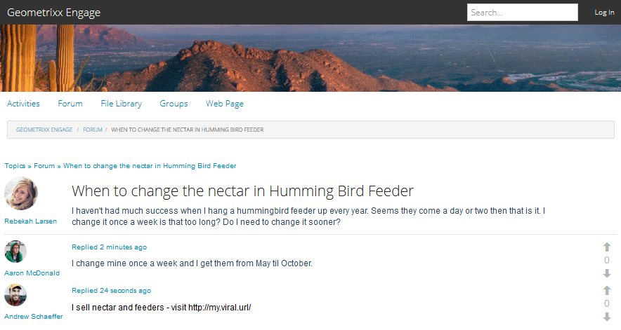

# In-Context-Moderation {#in-context-moderation}

Für AEM Communities kann die Moderation von Administratoren und vertrauenswürdigen Community-Mitgliedern direkt auf der veröffentlichten Seite erfolgen, auf der die Community-Inhalte veröffentlicht wurden.

Bei Verwendung einer [Moderationskonsole](moderation.md) enthalten die für den Inhalt angezeigten Informationen einen Link zur veröffentlichten Seite, um den Zugriff auf zusätzliche Moderationsaktionen zu ermöglichen, die beim Moderieren im Kontext verfügbar sind.

## Moderationsaktionen {#moderation-actions}

In der Moderationsübersicht finden Sie eine Beschreibung von [Moderationsaktionen](moderate-ugc.md#moderation-actions).

## Moderationsbenutzeroberfläche {#moderation-ui}

Die Benutzeroberfläche, die dem Moderator auf der Veröffentlichungsinstanz angezeigt wird, ist im Dialogfeld für die Veröffentlichung und Verwaltung benutzergenerierter Inhalte (UGC) enthalten. Die Elemente der Benutzeroberfläche werden durch den Status des Site-Besuchers bestimmt - unabhängig davon, ob sie ...

1. Das Mitglied, das den Inhalt veröffentlicht hat.
1. Moderator eines vertrauenswürdigen Mitglieds.
1. Einen Administrator.
1. Angemeldet, aber weder Administrator, Moderator noch Autor des Inhalts.
1. Nicht angemeldet.

## Beispiel {#example}

Mithilfe der Site [Geometrixx Engage](http://localhost:4503/content/sites/engage/en.html) , die beim [Erste Schritte mit AEM Communities](getting-started.md) erstellt wurde, ist es möglich, schnell einen Thread in einem Forum einzurichten, in dem verschiedene Moderationsaktivitäten in der Veröffentlichungsumgebung erleben können, wie unten dargestellt.

Aaron McDonald (aaron.mcdonald@mailinator.com) wurde als vertrauenswürdiges Community-Mitglied identifiziert, indem er ihn bei der Erstellung der Website zur Community-Interaktion-Moderatoren-Gruppe hinzufügte.

Rebekah Larsen (rebekah.larsen@trashymail.com) kann mithilfe der [Members console](members.md) als Mitglied der Community-Interaktionsmitgliedergruppe hinzugefügt werden.

Weitere Informationen zu Community-Benutzergruppen finden Sie unter [Verwalten von Benutzern und Benutzergruppen](users.md).

### Forumbeiträge erstellen {#create-the-forum-posts}

* Als Rebekah Larsen anmelden (rebekah.larsen@trashymail.com)

   * Forum auswählen
   * Neuen Beitrag auswählen
   * Betreff eingeben

      Wann wird der Nektar in der Humming-Vogelzucht geändert?

   * Textkörper eingeben

      Ich hatte nicht viel Erfolg, wenn ich jedes Jahr eine Kolibris aufhänge. Anscheinend kommen sie an ein oder zwei Tagen, dann ist es so. Ich ändere es einmal in der Woche ist das zu lang? Muss ich es früher ändern?

   * Beitrag auswählen
   * Log Out auswählen

* Als Aaron McDonald anmelden (aaron.mcdonald@mailinator.com)

   * Forum auswählen
   * Wählen Sie für das Thema &quot;Hummingbird&quot;die Option &quot;Mehr lesen&quot;
   * Geben Sie den Kommentar für Antwort posten ein.

      Ich wechsele meine Woche einmal und bekomme sie von Mai bis Oktober.

   * Antwort auswählen
   * Log Out auswählen

* Als Andrew Schäffer anmelden (andrew.schaeffer@trashymail.com)

   * Forum auswählen
   * Wählen Sie für das Thema &quot;Hummingbird&quot;die Option &quot;Mehr lesen&quot;
   * Geben Sie den Kommentar für Antwort posten ein.

      Ich verkaufe Nektar und Feeds - besuchen Sie https://my.viral.url/

   * Antwort auswählen
   * Log Out auswählen

### Anonymer Site-Besucher (#5) {#anonymous-site-visitor}

Im Folgenden finden Sie eine Ansicht des Forums, das von einem Site-Besucher gesehen wird, der nicht angemeldet ist (5).

Ein anonymer Site-Besucher kann nur das Forum anzeigen, jedoch keine Inhalte posten und keine Moderationsaktionen durchführen.

### Neues Mitglied (#4) {#new-member}

Melden Sie sich beim Autor als Administrator an und fügen Sie Boyd Larsen (boyd.larsen@dodgit.com) als neues Mitglied der Gruppe &quot;community-engage-members&quot;hinzu, indem Sie die [Mitglieder Console](members.md) verwenden und dann abmelden.

Melden Sie sich bei der Veröffentlichung als Boyd Larsen an und greifen Sie auf den Thread zu, indem Sie `Forum` und dann `Read more` für den Kohlingvogelpost auswählen.

Hinweis:

* Boyd hat nicht an dem Forum teilgenommen.
* Junge kann nichts löschen.
* Boyd ist angemeldet und kann Inhalte beantworten oder kennzeichnen.

Lassen Sie Boyd Flag auswählen, um den von Andrew veröffentlichten Inhalt zu kennzeichnen.

Abmelden

### Administrator (#3) {#administrator}

Melden Sie sich als Administrator (Admin) an und greifen Sie auf den Thread zu, indem Sie &quot;Forum&quot;auswählen und dann &quot;Mehr lesen&quot;für einen Beitrag auswählen.

Hinweis:

* Admin kann kennzeichnen, löschen, bearbeiten, ablehnen, ausschneiden, schließen, fixieren, Funktion.
* Der Administrator kann Administration auswählen, um auf die Moderationskonsole zuzugreifen.

Wählen Sie das Menüelement Administration aus, um in der Veröffentlichungsumgebung auf die [Moderationskonsole](moderation.md) zuzugreifen.

Beachten Sie, dass für einen Administrator alle moderierbaren Inhalte sichtbar sind, nicht nur Inhalte von der Community-Site &quot;Geometrixx Engage&quot;.

Der Suchfilter ist ein Seitenelement, das geöffnet oder geschlossen wird.

Abmelden.

### Community-Moderator (#2) {#community-moderator}

Melden Sie sich als Aaron McDonald (aaron.mcdonal@mailinator.com) an, ein Community-Moderator, und greifen Sie auf den Thread zu, indem Sie Forum auswählen, und lesen Sie dann mehr für den Komingbird-Post.

Hinweis:

* Aaron kann seinen eigenen Beitrag beantworten, löschen, bearbeiten oder ablehnen.
* Aaron kann auch andere Inhalte kennzeichnen/zulassen, antworten, löschen, bearbeiten, ablehnen.
* Aaron kann das Forenthema ausschneiden, um es in ein anderes Forum zu verschieben, für das er moderiert.
* Aaron kann Administration auswählen, um auf die Moderationskonsole zuzugreifen.

Wählen Sie das Menüelement Administration aus, um in der Veröffentlichungsumgebung auf die [Moderationskonsole](moderation.md) zuzugreifen.

Beachten Sie, dass für einen Community-Moderator nur moderierbare Inhalte von der Geometrixx Engage Community-Site angezeigt werden.

Beachten Sie, dass der Community-Moderator dieselben Optionen wie der Administrator hat (Bild ist mit geschlossener Suchseitenleiste), aber keinen Zugriff auf andere AEM Konsolen hat.

Abmelden.

### Inhaltsautor (#1) {#content-author}

Melden Sie sich als Rebekah Larsen (rebekah.larsen@mailinator.com) an, ein Community-Mitglied, das den Thread gestartet hat, und greifen Sie durch die Auswahl von Forum auf den Thread zu, und lesen Sie dann mehr für den Hummingbird-Post.

Hinweis:

* Rebekah kann ihren eigenen Beitrag löschen oder bearbeiten.
* Rebekah kann auch auf andere Inhalte antworten oder andere Inhalte kennzeichnen.
* Rebekah kann nicht auf die Moderationskonsole zugreifen.

