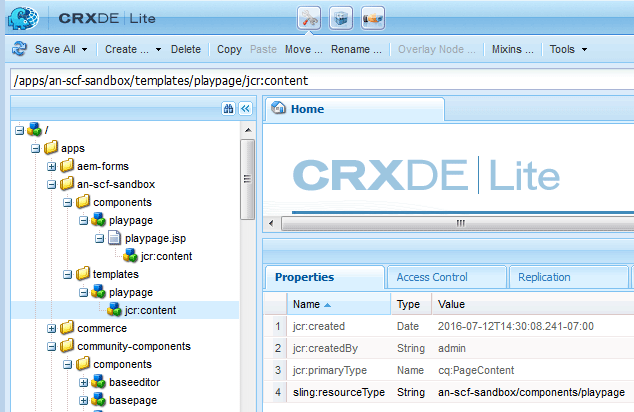

# Erste Sandbox-Anwendung {#initial-sandbox-application}

In diesem Abschnitt erstellen Sie Folgendes:

* Die **[Vorlage](#createthepagetemplate)** , die zum Erstellen von Inhaltsseiten in der Beispiel-Website verwendet wird.
* Die **[Komponente und das Skript](#create-the-template-s-rendering-component)**, die zum Rendern der Website-Seiten verwendet werden.

## Erstellen der Inhaltsvorlage {#create-the-content-template}

Eine Vorlage definiert den Standardinhalt einer neuen Seite. Komplexe Websites können mehrere Vorlagen verwenden, um die verschiedenen Seitentypen auf der Site zu erstellen. Darüber hinaus kann der Vorlagensatz zu einem Blueprint werden, der verwendet wird, um Änderungen auf einem Servercluster durchzuführen.

In dieser Übung basieren alle Seiten auf einer einfachen Vorlage.

1. Im Explorer-Bereich von CRXDE Lite:

   * Klicken Sie auf `/apps/an-scf-sandbox/templates`
   * **[!UICONTROL Erstellen]** > **[!UICONTROL Vorlage erstellen]**

1. Geben Sie im Dialogfeld „Komponente erstellen“ die folgenden Eigenschaftswerte ein und klicken Sie dann auf **[!UICONTROL Weiter]**:

   * Bezeichnung: `playpage`
   * Titel: `An SCF Sandbox Play Template`
   * Beschreibung: `An SCF Sandbox template for play pages`
   * Ressourcentyp: `an-scf-sandbox/components/playpage`
   * Rangfolge: &lt;Als Standard beibehalten>

   Der Titel wird für den Knotennamen verwendet.

   Der Ressourcentyp wird auf dem `jcr:content` -Knoten von `playpage` als Eigenschaft `sling:resourceType` angezeigt. Er identifiziert die Komponente (Ressource), die den Inhalt rendert, wenn sie von einem Browser angefordert wird.

   In diesem Fall werden alle Seiten, die mit der Vorlage `playpage` erstellt wurden, von der Komponente `an-scf-sandbox/components/playpage` gerendert. Standardmäßig ist der Pfad zur Komponente relativ, sodass Sling zuerst im Ordner `/apps` und, falls nicht gefunden, im Ordner `/libs` nach der Ressource suchen kann.

   

1. Stellen Sie bei Verwendung von &quot;Kopieren/Einfügen&quot;sicher, dass der Wert &quot;Ressourcentyp&quot;keine führenden oder nachfolgenden Leerzeichen aufweist.

   Klicken Sie auf **[!UICONTROL Weiter]**.

1. &quot;Zulässige Pfade&quot;bezieht sich auf die Pfade von Seiten, die diese Vorlage verwenden, sodass die Vorlage für das Dialogfeld **[!UICONTROL Neue Seite]** aufgeführt wird.

   Um einen Pfad hinzuzufügen, klicken Sie auf die Plusschaltfläche `+` und geben Sie im angezeigten Textfeld `/content(/.&ast;)?` ein. Stellen Sie bei Verwendung von Kopieren/Einfügen sicher, dass keine führenden oder nachfolgenden Leerzeichen vorhanden sind.

   Hinweis: Der Wert der zulässigen Pfadeigenschaft ist ein *regulärer Ausdruck*. Inhaltsseiten mit einem Pfad, der dem Ausdruck entspricht, können die Vorlage verwenden. In diesem Fall stimmt der reguläre Ausdruck mit dem Pfad des Ordners **/content** und allen zugehörigen Unterseiten überein.

   Wenn ein Autor eine Seite unter `/content` erstellt, wird die Vorlage `playpage` mit dem Titel &quot;Eine SCF-Sandbox-Seitenvorlage&quot;in einer Liste der zu verwendenden Vorlagen angezeigt.

   Nachdem die Stammseite aus der Vorlage erstellt wurde, kann der Zugriff auf die Vorlage auf diese Website beschränkt werden, indem die Eigenschaft bearbeitet wird, um den Stammpfad in den regulären Ausdruck einzuschließen.

   `/content/an-scf-sandbox(/.&ast;)?`

   

1. Klicken Sie auf **[!UICONTROL Weiter]**.

   Klicken Sie auf **[!UICONTROL Weiter]** im Bereich **[!UICONTROL Zugelassene übergeordnete Elemente]** .

   Klicken Sie im Bereich **[!UICONTROL Zulässige untergeordnete Elemente]** auf **[!UICONTROL Weiter]** .

   Klicken Sie auf **[!UICONTROL OK]**.

1. Nachdem Sie auf OK geklickt und die Erstellung der Vorlage abgeschlossen haben, beachten Sie die roten Dreiecke, die in den Ecken der Eigenschaften -Tab-Werte für die neue `playpage` -Vorlage angezeigt werden. Diese roten Dreiecke zeigen Bearbeitungen an, die nicht gespeichert wurden.

   Klicken Sie auf **[!UICONTROL Alle speichern]** , um die neue Vorlage im Repository zu speichern.

   

### Erstellen der Rendering-Komponente der Vorlage {#create-the-template-s-rendering-component}

Erstellen Sie die Komponente *component* , die den Inhalt definiert und alle Seiten rendert, die basierend auf der [Paketvorlage](#createthepagetemplate) erstellt wurden.

1. Klicken Sie unter CRXDE Lite mit der rechten Maustaste auf **`/apps/an-scf-sandbox/components`** und klicken Sie auf **[!UICONTROL Erstellen > Komponente]**.
1. Durch Festlegen des Knotennamens (Beschriftung) auf *playpage* lautet der Pfad zur Komponente

   `/apps/an-scf-sandbox/components/playpage`

   entspricht dem Ressourcentyp der Paketvorlage (optional abzüglich des anfänglichen **`/apps/`** -Teils des Pfads).

   Geben Sie im Dialogfeld **[!UICONTROL Komponente erstellen]** die folgenden Eigenschaftswerte ein:

   * Bezeichnung: **playpage**
   * Titel: **Eine SCF-Sandbox-Abspielkomponente**
   * Beschreibung: **Dies ist die Komponente, die Inhalt für eine SCF-Sandbox-Seite rendert.**
   * Supertyp: *&lt;leer lassen>*
   * Gruppe: *&lt;leer lassen>*

   

1. Klicken Sie auf **[!UICONTROL Weiter]** , bis das Bedienfeld **[!UICONTROL Zulässige untergeordnete Elemente]** des Dialogfelds angezeigt wird:

   * Klicken Sie auf **[!UICONTROL OK]**.
   * Klicken Sie auf **[!UICONTROL Alle speichern]**.

1. Überprüfen Sie, ob der Pfad zur Komponente und der resourceType für die Vorlage übereinstimmen.

   >[!CAUTION]
   >
   >Die Korrespondenz zwischen dem Pfad zur Paketkomponente und der Eigenschaft `sling:resourceType` der Paketvorlage ist für das ordnungsgemäße Funktionieren der Website von entscheidender Bedeutung.

   
