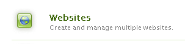

# Anfänglicher Sandbox-Inhalt {#initial-sandbox-content}

In diesem Abschnitt erstellen Sie die folgenden Seiten, die alle die [Seitenvorlage](initial-app.md#createthepagetemplate) verwenden:

* SCF-Sandbox-Site, die zur englischen Version der Hauptseite weiterleitet.

   * SCF Sandbox - Die Hauptseite für die englische Version der Site.

   * SCF Play - Untergeordnetes Element der Hauptseite, auf der abgespielt werden soll.

Dieses Tutorial behandelt nicht die [Sprachkopien](../../help/sites-administering/tc-prep.md). Stattdessen wird sie so konzipiert, dass die Stammseite die Erkennung der bevorzugten Sprache für den Benutzer über die HTML-Kopfzeile implementieren und zur entsprechenden Hauptseite für die weiterleiten kann. Die Konvention besteht darin, den aus zwei Buchstaben bestehenden Ländercode für den Knotennamen der Seite zu verwenden, z. B. &quot;en&quot;für Englisch und &quot;fr&quot;für Französisch.

## Erste Seiten erstellen {#create-first-pages}

Da es nun eine [Seitenvorlage](initial-app.md#createthepagetemplate) gibt, können Sie die Stammseite der Website im Ordner /content einrichten.

1. Die Standard-Benutzeroberfläche bietet derzeit Blueprints zum Erstellen von Sites. Da in diesem Tutorial eine einfache Site erstellt wird, ist die klassische Benutzeroberfläche nützlich.

   Um zur klassischen Benutzeroberfläche zu wechseln, wählen Sie die globale Navigation aus und bewegen Sie den Mauszeiger über die rechte Seite des Projektsymbols. Wählen Sie das Symbol *Zur klassischen Benutzeroberfläche wechseln* aus, das angezeigt wird:

   

   Die Möglichkeit, zur klassischen Benutzeroberfläche zu wechseln, muss von einem Administrator aktiviert werden ](../../help/sites-administering/enable-classic-ui.md).[

1. Wählen Sie auf der Begrüßungsseite [Klassische Benutzeroberfläche](http://localhost:4502/welcome.html) die Option **[!UICONTROL Websites]** aus.

   

   Alternativ können Sie direkt auf die klassische Benutzeroberfläche für Websites zugreifen, indem Sie zu [/siteadmin](http://localhost:4502/siteadmin) navigieren.

1. Wählen Sie im Explorer-Bereich **[!UICONTROL Websites]** und dann in der Symbolleiste **[!UICONTROL Neu]** > **[!UICONTROL Neue Seite]** aus.

   Geben Sie im Dialogfeld **[!UICONTROL Seite erstellen]** Folgendes ein:

   * Titel: `SCF Sandbox Site`
   * Name: `an-scf-sandbox`
   * Wählen Sie **[!UICONTROL eine SCF Sandbox Play Template]** aus.
   * Klicken Sie auf **[!UICONTROL Erstellen]**.

   

1. Wählen Sie im Explorer-Bereich die von Ihnen erstellte Seite `/Websites/SCF Sandbox Site` aus und klicken Sie auf **[!UICONTROL Neu]** > **[!UICONTROL Neue Seite]**:

   * Titel: `SCF Sandbox`
   * Name: `en`
   * Wählen Sie **[!UICONTROL eine SCF Sandbox Play Template]** aus.
   * Klicken Sie auf **[!UICONTROL Erstellen]**.

1. Wählen Sie im Explorer-Bereich die erstellte Seite &quot;`/Websites/SCF Sandbox Site/SCF Sandbox`&quot;aus und klicken Sie auf &quot;**[!UICONTROL Neu]**&quot;> &quot;**[!UICONTROL Neue Seite]**&quot;.

   * Titel: `SCF Play`
   * Name: `play`
   * Wählen Sie **[!UICONTROL eine SCF Sandbox Play Template]** aus.
   * Klicken Sie auf **[!UICONTROL Erstellen]**.

1. So wird die Website jetzt in der Websites-Konsole angezeigt. Beachten Sie, dass untergeordnete Seiten des im Explorer-Bereich ausgewählten Elements im rechten Bereich angezeigt werden, wo sie verwaltet werden können.

   

   Dies ist die Repository-Ansicht, die mit dem Website-Tool und der Vorlage erstellt wurde:

   

## Hinzufügen des Designpfads {#add-the-design-path}

Wenn ` [/etc/designs/an-scf-sandbox](setup-website.md#setupthedesigntreeetcdesigns)` mit dem Abschnitt &quot;Designs&quot;der Tools-Konsole erstellt wurde, lautet die Eigenschaft &quot;

* `cq:template="/libs/wcm/core/templates/designpage"`

wurde definiert, was die optionale Möglichkeit bietet, Design-Assets in einem Skript mit `currentDesign.getPath()` zu referenzieren. Zum Beispiel

* `% String favIcon = currentDesign.getPath() + "/favicon.ico"; %`

   * Name: `cq:designPath`
   * Typ: `String`
   * Wert: `/etc/designs/an-scf-sandbox`

* Klicken Sie auf das grüne `[+] Add`

Das Repository sollte wie folgt angezeigt werden:

* Klicken Sie auf **[!UICONTROL Alle speichern]**

Wenn beim Speichern der Konfiguration Probleme auftreten, melden Sie sich erneut an und konfigurieren Sie sie erneut.

>[!NOTE]
>
>Die Verwendung von `cq:designPath` ist optional und steht nicht im Zusammenhang mit der [Verwendung von clientlibs](develop-app.md#includeclientlibsintemplate), die erforderlich sind, da die SCF-Komponenten [clientlibs](client-customize.md#clientlibs-for-scf) verwenden, um ihre JS und CSS zu verwalten.
